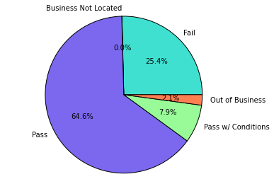

<properties 
    pageTitle="Usar Apache Spark para criar aplicativos de aprendizado de máquina em HDInsight | Microsoft Azure" 
    description="Instruções passo a passo sobre como usar blocos de anotações com Apache Spark para criar aplicativos de aprendizado de máquina" 
    services="hdinsight" 
    documentationCenter="" 
    authors="nitinme" 
    manager="jhubbard" 
    editor="cgronlun"
    tags="azure-portal"/>

<tags 
    ms.service="hdinsight" 
    ms.workload="big-data" 
    ms.tgt_pltfrm="na" 
    ms.devlang="na" 
    ms.topic="article" 
    ms.date="10/05/2016" 
    ms.author="nitinme"/>

# Aprendizado de máquina: análise de previsão na inspeção de alimento dados usando MLlib com Apache Spark cluster no HDInsight Linux

> [AZURE.TIP] Este tutorial também está disponível como um bloco de anotações de Jupyter em um cluster de Spark (Linux) que você criar no HDInsight. A experiência de bloco de anotações lhe permite executar os trechos de Python do próprio bloco de anotações. Para executar o tutorial de dentro de um bloco de anotações, crie um cluster Spark, inicie um bloco de anotações de Jupyter (`https://CLUSTERNAME.azurehdinsight.net/jupyter`), e execute o bloco de anotações **usando o aprendizado de máquina Spark - análise de previsão nos dados de inspeção de alimentação MLLib.ipynb** sob a pasta de **Python** .

Este artigo demonstra como usar **MLLib**, bibliotecas, de aprendizado de máquina interna do Spark para executar uma análise de previsão simple em um conjunto de dados aberto. MLLib é uma biblioteca de Spark de núcleo que fornece um número de utilitários que são úteis para tarefas de aprendizado de máquina, incluindo utilitários que são adequados para:

* Classificação

* Regressão

* Agrupamento

* Modelagem de tópico

* Decomposição de valor singular (SVD) e análise de componente principal (PCA)

* Hipótese testes e calculando as estatísticas de amostra

Este artigo apresenta uma abordagem simples para *classificação* por meio de regressão logística.

## O que são a classificação e regressão logística?

A *classificação*, uma tarefa, de aprendizado de máquina muito comum é o processo de classificação de dados de entrada em categorias. É o trabalho de um algoritmo de classificação para descobrir como atribuir "rótulos" para entrada de dados que você fornecer. Por exemplo, você poderia pensar um algoritmo de aprendizado de máquina que aceita informações de ações como entrada e divide o papel em duas categorias: ações que você deve vender e ações que você deve manter.

Regressão logística é o algoritmo usado para classificação. Regressão logística do Spark API é útil para *classificação binária*ou classificar dados de entrada em um dos dois grupos. Para obter mais informações sobre perdas logísticas, consulte [Wikipedia](https://en.wikipedia.org/wiki/Logistic_regression).

Em resumo, o processo de regressão logística produz uma *função logística* que podem ser usadas para prever a probabilidade que um vetor de entrada pertence em um grupo ou outro.  

## O que estamos tentando realizar neste artigo?

Você usará Spark para realizar algumas análise de previsão em dados de inspeção de alimentação (**Food_Inspections1.csv**) que foi adquiridos por meio do [portal de dados da cidade de Chicago](https://data.cityofchicago.org/). Este dataset contém informações sobre inspeções de alimentos que foram realizados em Chicago, incluindo informações sobre cada estabelecimento de alimentos que foi inspecionada, as violações que foram encontradas (se houver) e os resultados da inspeção. O arquivo de dados CSV já está disponível na conta de armazenamento associada ao cluster em **/HdiSamples/HdiSamples/FoodInspectionData/Food_Inspections1.csv**.

Nas etapas abaixo, você desenvolver um modelo para ver o que é necessário para passar ou falhar uma inspeção de alimentação. 

## Começar a criar um aplicativo de aprendizado de máquina usando Spark MLlib

1. No [Portal do Azure](https://portal.azure.com/), do startboard, clique no bloco para o seu cluster Spark (se você fixados-lo a startboard). Você também pode navegar para o seu cluster em **Procurar tudo** > **HDInsight Clusters**.   

2. Da lâmina cluster Spark, clique em **Painel de Cluster**e clique em **Bloco de anotações de Jupyter**. Se solicitado, digite as credenciais de administrador para o cluster.

    > [AZURE.NOTE] Você também pode atingir o bloco de anotações de Jupyter para o seu cluster abrindo a seguinte URL no seu navegador. Substitua o nome do seu cluster __CLUSTERNAME__ :
    >
    > `https://CLUSTERNAME.azurehdinsight.net/jupyter`

2. Crie um novo bloco de anotações. Clique em **novo**e, em seguida, clique em **PySpark**.

    ![Criar um novo bloco de anotações de Jupyter] (./media/hdinsight-apache-spark-machine-learning-mllib-ipython/hdispark.note.jupyter.createnotebook.png "Criar um novo bloco de anotações de Jupyter")

3. Um novo bloco de anotações será criado e aberto com o nome Untitled.pynb. Clique no nome do bloco de anotações na parte superior e insira um nome amigável.

    ![Fornecer um nome para o bloco de anotações] (./media/hdinsight-apache-spark-machine-learning-mllib-ipython/hdispark.note.jupyter.notebook.name.png "Fornecer um nome para o bloco de anotações")

3. Como você criou um bloco de anotações usando o núcleo PySpark, você não precisa criar qualquer contextos explicitamente. Os contextos Spark e seção serão automaticamente criados para você quando você executa a primeira célula de código. Você pode começar a criar seu aplicativo de aprendizado importando os tipos requeridos para este cenário de máquina. Para fazer isso, coloque o cursor na célula e pressione **SHIFT + ENTER**.

        from pyspark.ml import Pipeline
        from pyspark.ml.classification import LogisticRegression
        from pyspark.ml.feature import HashingTF, Tokenizer
        from pyspark.sql import Row
        from pyspark.sql.functions import UserDefinedFunction
        from pyspark.sql.types import *

## Construir um dataframe de entrada

Podemos usar `sqlContext` para realizar transformações em dados estruturados. A primeira tarefa é carregar os dados de exemplo ((**Food_Inspections1.csv**)) em um SQL Spark *dataframe*. 

1. Como os dados processados estão no formato CSV, precisamos usar o contexto Spark retirar cada linha do arquivo na memória como texto não estruturado; em seguida, você usa biblioteca CSV do Python para analisar cada linha individualmente. 

        def csvParse(s):
            import csv
            from StringIO import StringIO
            sio = StringIO(s)
            value = csv.reader(sio).next()
            sio.close()
            return value
        
        inspections = sc.textFile('wasbs:///HdiSamples/HdiSamples/FoodInspectionData/Food_Inspections1.csv')\
                        .map(csvParse)

2. Agora temos o arquivo CSV como um RDD. Deixe-nos recupere uma linha do RDD entender o esquema de dados.

        inspections.take(1)

    Você deve ver uma saída semelhante ao seguinte:

        # -----------------
        # THIS IS AN OUTPUT
        # -----------------

        [['413707',
          'LUNA PARK INC',
          'LUNA PARK  DAY CARE',
          '2049789',
          "Children's Services Facility",
          'Risk 1 (High)',
          '3250 W FOSTER AVE ',
          'CHICAGO',
          'IL',
          '60625',
          '09/21/2010',
          'License-Task Force',
          'Fail',
          '24. DISH WASHING FACILITIES: PROPERLY DESIGNED, CONSTRUCTED, MAINTAINED, INSTALLED, LOCATED AND OPERATED - Comments: All dishwashing machines must be of a type that complies with all requirements of the plumbing section of the Municipal Code of Chicago and Rules and Regulation of the Board of Health. OBSEVERD THE 3 COMPARTMENT SINK BACKING UP INTO THE 1ST AND 2ND COMPARTMENT WITH CLEAR WATER AND SLOWLY DRAINING OUT. INST NEED HAVE IT REPAIR. CITATION ISSUED, SERIOUS VIOLATION 7-38-030 H000062369-10 COURT DATE 10-28-10 TIME 1 P.M. ROOM 107 400 W. SURPERIOR. | 36. LIGHTING: REQUIRED MINIMUM FOOT-CANDLES OF LIGHT PROVIDED, FIXTURES SHIELDED - Comments: Shielding to protect against broken glass falling into food shall be provided for all artificial lighting sources in preparation, service, and display facilities. LIGHT SHIELD ARE MISSING UNDER HOOD OF  COOKING EQUIPMENT AND NEED TO REPLACE LIGHT UNDER UNIT. 4 LIGHTS ARE OUT IN THE REAR CHILDREN AREA,IN THE KINDERGARDEN CLASS ROOM. 2 LIGHT ARE OUT EAST REAR, LIGHT FRONT WEST ROOM. NEED TO REPLACE ALL LIGHT THAT ARE NOT WORKING. | 35. WALLS, CEILINGS, ATTACHED EQUIPMENT CONSTRUCTED PER CODE: GOOD REPAIR, SURFACES CLEAN AND DUST-LESS CLEANING METHODS - Comments: The walls and ceilings shall be in good repair and easily cleaned. MISSING CEILING TILES WITH STAINS IN WEST,EAST, IN FRONT AREA WEST, AND BY THE 15MOS AREA. NEED TO BE REPLACED. | 32. FOOD AND NON-FOOD CONTACT SURFACES PROPERLY DESIGNED, CONSTRUCTED AND MAINTAINED - Comments: All food and non-food contact equipment and utensils shall be smooth, easily cleanable, and durable, and shall be in good repair. SPLASH GUARDED ARE NEEDED BY THE EXPOSED HAND SINK IN THE KITCHEN AREA | 34. FLOORS: CONSTRUCTED PER CODE, CLEANED, GOOD REPAIR, COVING INSTALLED, DUST-LESS CLEANING METHODS USED - Comments: The floors shall be constructed per code, be smooth and easily cleaned, and be kept clean and in good repair. INST NEED TO ELEVATE ALL FOOD ITEMS 6INCH OFF THE FLOOR 6 INCH AWAY FORM WALL.  ',
          '41.97583445690982',
          '-87.7107455232781',
          '(41.97583445690982, -87.7107455232781)']]

3. A saída acima nos dá uma ideia do esquema do arquivo de entrada; o arquivo inclui o nome de cada estabelecimento, o tipo de estabelecimento, o endereço, os dados das inspeções e o local, entre outras coisas. Vamos selecionar algumas colunas que serão úteis para nosso análise de previsão e agrupar os resultados como um dataframe, que podemos usar para criar uma tabela temporária.

        schema = StructType([
        StructField("id", IntegerType(), False), 
        StructField("name", StringType(), False), 
        StructField("results", StringType(), False), 
        StructField("violations", StringType(), True)])

        df = sqlContext.createDataFrame(inspections.map(lambda l: (int(l[0]), l[1], l[12], l[13])) , schema)
        df.registerTempTable('CountResults')

4. Agora, temos um *dataframe*, `df` nas quais é possível executar nossa análise. Também temos uma tabela temporária chamada **CountResults**. Há 4 colunas de interesse na dataframe: **identificação**, **nome**, **resultados**e **violações**. 
    
    Vamos obter uma pequena amostra dos dados:

        df.show(5)

    Você deve ver uma saída semelhante ao seguinte:

        # -----------------
        # THIS IS AN OUTPUT
        # -----------------

        +------+--------------------+-------+--------------------+
        |    id|                name|results|          violations|
        +------+--------------------+-------+--------------------+
        |413707|       LUNA PARK INC|   Fail|24. DISH WASHING ...|
        |391234|       CAFE SELMARIE|   Fail|2. FACILITIES TO ...|
        |413751|          MANCHU WOK|   Pass|33. FOOD AND NON-...|
        |413708|BENCHMARK HOSPITA...|   Pass|                    |
        |413722|           JJ BURGER|   Pass|                    |
        +------+--------------------+-------+--------------------+

## Compreender os dados

1. Vamos começar a entender o que nosso dataset contém. Por exemplo, quais são os diferentes valores na coluna **resultados** ?

        df.select('results').distinct().show()

    
    Você deve ver uma saída semelhante ao seguinte:

        # -----------------
        # THIS IS AN OUTPUT
        # -----------------
    
        +--------------------+
        |             results|
        +--------------------+
        |                Fail|
        |Business Not Located|
        |                Pass|
        |  Pass w/ Conditions|
        |     Out of Business|
        +--------------------+
    
2. Uma visualização rápida pode ajudar a razão sobre a distribuição desses resultados. Já temos os dados em uma tabela temporária **CountResults**. Você pode executar a seguinte consulta SQL na tabela para compreender melhor como os resultados são distribuídos.

        %%sql -o countResultsdf
        SELECT results, COUNT(results) AS cnt FROM CountResults GROUP BY results

    O `%%sql` mágico seguido por `-o countResultsdf` garante que a saída da consulta é mantida localmente no servidor Jupyter (normalmente a headnode do cluster). A saída é mantida como um dataframe [Pandas](http://pandas.pydata.org/) com o nome especificado **countResultsdf**.
    
    Você deve ver uma saída semelhante ao seguinte:
    
    ![Saída da consulta SQL] (./media/hdinsight-apache-spark-machine-learning-mllib-ipython/query.output.png "Saída da consulta SQL")

    Para obter mais informações sobre o `%%sql` mágico, bem como outras magics disponíveis com núcleo PySpark, consulte [Kernels disponíveis nos notebooks Jupyter com clusters Spark HDInsight](hdinsight-apache-spark-jupyter-notebook-kernels.md#why-should-i-use-the-new-kernels).

3. Você também pode usar Matplotlib, uma biblioteca usada para construir a visualização de dados para criar um gráfico. Porque a plotagem deve ser criada a partir do dataframe localmente persistentes **countResultsdf** , o trecho de código deve começar com o `%%local` mágico. Isso garante que o código é executado localmente no servidor Jupyter.

        %%local
        %matplotlib inline
        import matplotlib.pyplot as plt
        
        
        labels = countResultsdf['results']
        sizes = countResultsdf['cnt']
        colors = ['turquoise', 'seagreen', 'mediumslateblue', 'palegreen', 'coral']
        plt.pie(sizes, labels=labels, autopct='%1.1f%%', colors=colors)
        plt.axis('equal')

    Você deve ver uma saída semelhante ao seguinte:

    

4. Você pode ver o que há 5 resultados distintos uma inspeção pode ter:
    
    * Business não localizado 
    * Falhas
    * Passar
    * SPS com condições, e
    * Sair do Business 

    Vamos desenvolva um modelo que pode imaginar o resultado de uma inspeção de alimentos, fornecidas violações. Como Regressão logística é um método de classificação binário, faz sentido para agrupar nossos dados em duas categorias: **Falha** e **passar**. Um "passar com condições" ainda é uma passagem, para que quando podemos treinar o modelo, consideraremos dois resultados equivalente. Dados com os resultados ("Business não localizado", "de negócios") não são úteis para que eles serão removidos da nosso conjunto de treinamento. Isso deve ser okey desde que essas duas categorias compõem uma porcentagem muito pequena dos resultados mesmo assim.

5. Deixe-nos ir adiante e converter nosso dataframe existente (`df`) em um novo dataframe onde cada inspeção é representada por um par de violações de rótulo. Em nosso caso, um rótulo de `0.0` representa uma falha, um rótulo de `1.0` representa um sucesso e um rótulo de `-1.0` representa alguns resultados além desses dois. Podemos filtre esses outros resultados quando computação o novo quadro de dados.

        def labelForResults(s):
            if s == 'Fail':
                return 0.0
            elif s == 'Pass w/ Conditions' or s == 'Pass':
                return 1.0
            else:
                return -1.0
        label = UserDefinedFunction(labelForResults, DoubleType())
        labeledData = df.select(label(df.results).alias('label'), df.violations).where('label >= 0')

    Vamos recuperar uma linha de dados rotulados para ver sua aparência.

        labeledData.take(1)

    Você deve ver uma saída semelhante ao seguinte:
    
        # -----------------
        # THIS IS AN OUTPUT
        # -----------------
    
        [Row(label=0.0, violations=u"41. PREMISES MAINTAINED FREE OF LITTER, UNNECESSARY ARTICLES, CLEANING  EQUIPMENT PROPERLY STORED - Comments: All parts of the food establishment and all parts of the property used in connection with the operation of the establishment shall be kept neat and clean and should not produce any offensive odors.  REMOVE MATTRESS FROM SMALL DUMPSTER. | 35. WALLS, CEILINGS, ATTACHED EQUIPMENT CONSTRUCTED PER CODE: GOOD REPAIR, SURFACES CLEAN AND DUST-LESS CLEANING METHODS - Comments: The walls and ceilings shall be in good repair and easily cleaned.  REPAIR MISALIGNED DOORS AND DOOR NEAR ELEVATOR.  DETAIL CLEAN BLACK MOLD LIKE SUBSTANCE FROM WALLS BY BOTH DISH MACHINES.  REPAIR OR REMOVE BASEBOARD UNDER DISH MACHINE (LEFT REAR KITCHEN). SEAL ALL GAPS.  REPLACE MILK CRATES USED IN WALK IN COOLERS AND STORAGE AREAS WITH PROPER SHELVING AT LEAST 6' OFF THE FLOOR.  | 38. VENTILATION: ROOMS AND EQUIPMENT VENTED AS REQUIRED: PLUMBING: INSTALLED AND MAINTAINED - Comments: The flow of air discharged from kitchen fans shall always be through a duct to a point above the roofline.  REPAIR BROKEN VENTILATION IN MEN'S AND WOMEN'S WASHROOMS NEXT TO DINING AREA. | 32. FOOD AND NON-FOOD CONTACT SURFACES PROPERLY DESIGNED, CONSTRUCTED AND MAINTAINED - Comments: All food and non-food contact equipment and utensils shall be smooth, easily cleanable, and durable, and shall be in good repair.  REPAIR DAMAGED PLUG ON LEFT SIDE OF 2 COMPARTMENT SINK.  REPAIR SELF CLOSER ON BOTTOM LEFT DOOR OF 4 DOOR PREP UNIT NEXT TO OFFICE.")]

## Crie um modelo de regressão logística da entrada dataframe

Nossa tarefa final é converter os dados rotulados em um formato que pode ser analisado por regressão logística. A entrada a um algoritmo de regressão logística deve ser um conjunto de *pares de vetor do recurso de rótulo*, onde o "vetor do recurso" é um vetor de números que representa o ponto de entrada de alguma maneira. Portanto, precisamos de uma maneira de converter a coluna "violações", que é semiestruturados e contém uma grande quantidade de comentários em texto livre, para uma matriz de números reais que uma máquina facilmente pudesse entender. 

Um aprendizado abordagem para processamento de linguagem natural de máquina padrão é atribuir cada palavra distinct "índice" e, em seguida passar um vetor para a algoritmo de aprendizado de forma que o valor de cada índice contém a frequência relativa dessa palavra na cadeia de texto de máquina. 

MLLib fornece uma maneira fácil de executar essa operação. Primeiro, vamos será "indexar" cada cadeia de caracteres de violações para obter as palavras individuais em cada cadeia de caracteres e, em seguida, usaremos um `HashingTF` para converter cada conjunto de tokens em um vetor de recurso que pode ser passado para o algoritmo de regressão logística para construir um modelo. Vai conduzir todas essas etapas em sequência usando um "pipeline".

    tokenizer = Tokenizer(inputCol="violations", outputCol="words")
    hashingTF = HashingTF(inputCol=tokenizer.getOutputCol(), outputCol="features")
    lr = LogisticRegression(maxIter=10, regParam=0.01)
    pipeline = Pipeline(stages=[tokenizer, hashingTF, lr])
    
    model = pipeline.fit(labeledData)

## Avaliar o modelo em um conjunto de dados de teste separado

Podemos usar o modelo criado anteriormente para *prever* os resultados das novas inspeções serão, com base em violações que foram observadas. Podemos treinamento esse modelo no conjunto de dados **Food_Inspections1.csv**. Vamos use um segundo conjunto de dados, **Food_Inspections2.csv**, para *avaliar* a força desse modelo em novos dados. Esse segundo conjunto de dados (**Food_Inspections2.csv**) já deve estar no contêiner de armazenamento de padrão associado ao cluster.

1. O trecho a seguir cria um novo dataframe, **predictionsDf** que contém a previsão gerada pelo modelo de. O trecho de código também cria uma tabela temporária **que previsões** com base na dataframe.

        testData = sc.textFile('wasbs:///HdiSamples/HdiSamples/FoodInspectionData/Food_Inspections2.csv')\
                 .map(csvParse) \
                 .map(lambda l: (int(l[0]), l[1], l[12], l[13]))
        testDf = sqlContext.createDataFrame(testData, schema).where("results = 'Fail' OR results = 'Pass' OR results = 'Pass w/ Conditions'")
        predictionsDf = model.transform(testDf)
        predictionsDf.registerTempTable('Predictions')
        predictionsDf.columns

    Você deve ver uma saída semelhante ao seguinte:
    
        # -----------------
        # THIS IS AN OUTPUT
        # -----------------
        
        ['id',
         'name',
         'results',
         'violations',
         'words',
         'features',
         'rawPrediction',
         'probability',
         'prediction']

2. Examinar um das previsões. Execute este trecho de código:

        predictionsDf.take(1)

    Você verá a previsão para a primeira entrada no conjunto de dados de teste.

3. O `model.transform()` método serão aplicadas a mesma transformação para qualquer novos dados com o mesmo esquema e chegar a uma previsão de como classificar os dados. Podemos fazer algumas estatísticas simples para entender como precisos nossos previsões foram:

        numSuccesses = predictionsDf.where("""(prediction = 0 AND results = 'Fail') OR 
                                              (prediction = 1 AND (results = 'Pass' OR 
                                                                   results = 'Pass w/ Conditions'))""").count()
        numInspections = predictionsDf.count()
        
        print "There were", numInspections, "inspections and there were", numSuccesses, "successful predictions"
        print "This is a", str((float(numSuccesses) / float(numInspections)) * 100) + "%", "success rate"

    A saída tem a seguinte aparência:
    
        # -----------------
        # THIS IS AN OUTPUT
        # -----------------
    
        There were 9315 inspections and there were 8087 successful predictions
        This is a 86.8169618894% success rate

    Usando Regressão logística com Spark fornece um modelo preciso da relação entre as descrições de violações em inglês e se um negócio seria pass ou fail uma inspeção de alimentação. 

## Criar uma representação visual da previsão

Agora podemos construir uma visualização final para ajudar a razão sobre os resultados de teste. 

1. Vamos começar extraindo a previsões diferentes e os resultados da tabela temporária **previsões** criada anteriormente. As seguintes consultas separam a saída como *true_positive*, *false_positive*, *true_negative*e *false_negative*. Nas consultas abaixo, podemos desativar visualização usando `-q` e também salvar a saída (usando `-o`) como dataframes que podem ser usados com o `%%local` mágico. 

        %%sql -q -o true_positive
        SELECT count(*) AS cnt FROM Predictions WHERE prediction = 0 AND results = 'Fail'

        %%sql -q -o false_positive
        SELECT count(*) AS cnt FROM Predictions WHERE prediction = 0 AND (results = 'Pass' OR results = 'Pass w/ Conditions')

        %%sql -q -o true_negative
        SELECT count(*) AS cnt FROM Predictions WHERE prediction = 1 AND results = 'Fail'

        %%sql -q -o false_negative
        SELECT count(*) AS cnt FROM Predictions WHERE prediction = 1 AND (results = 'Pass' OR results = 'Pass w/ Conditions') 

2. Por fim, use o trecho a seguir para gerar a plotagem usando **Matplotlib**.

        %%local
        %matplotlib inline
        import matplotlib.pyplot as plt
        
        labels = ['True positive', 'False positive', 'True negative', 'False negative']
        sizes = [true_positive['cnt'], false_positive['cnt'], false_negative['cnt'], true_negative['cnt']]
        colors = ['turquoise', 'seagreen', 'mediumslateblue', 'palegreen', 'coral']
        plt.pie(sizes, labels=labels, autopct='%1.1f%%', colors=colors)
        plt.axis('equal')
    
    Você verá a seguinte saída.
    
    

    Nesse gráfico, um resultado "positivo" se refere a inspeção alimentos falha, enquanto um resultado negativo se refere a uma inspeção passada.

## Desligar o bloco de anotações

Após terminar de executar o aplicativo, você deve desligar o bloco de anotações para liberar os recursos. Para fazer isso, no menu **arquivo** no bloco de anotações, clique em **Fechar e parar**. Este será desligar e feche o bloco de anotações.

## Consulte também

* [Visão geral: Apache Spark no Azure HDInsight](hdinsight-apache-spark-overview.md)

### Cenários

* [Spark com BI: executar análise de dados interativos usando Spark em HDInsight com ferramentas de BI](hdinsight-apache-spark-use-bi-tools.md)

* [Spark com aprendizado de máquina: Spark de uso em HDInsight para analisar a temperatura de construção usando dados HVAC](hdinsight-apache-spark-ipython-notebook-machine-learning.md)

* [Streaming Spark: Uso Spark no HDInsight para criar aplicativos de streaming em tempo real](hdinsight-apache-spark-eventhub-streaming.md)

* [Análise de log de site usando Spark no HDInsight](hdinsight-apache-spark-custom-library-website-log-analysis.md)

### Criar e executar aplicativos

* [Criar um aplicativo autônomo usando Scala](hdinsight-apache-spark-create-standalone-application.md)

* [Executar trabalhos remotamente em um cluster de Spark usando Livy](hdinsight-apache-spark-livy-rest-interface.md)

### Ferramentas e extensões

* [Usar o plug-in de ferramentas de HDInsight para IntelliJ IDEIA para criar e enviar Spark Scala aplicativos](hdinsight-apache-spark-intellij-tool-plugin.md)

* [Usar o plug-in de ferramentas de HDInsight para IntelliJ IDEIA para depurar aplicativos de Spark remotamente](hdinsight-apache-spark-intellij-tool-plugin-debug-jobs-remotely.md)

* [Usar blocos de anotações de Zeppelin com um cluster Spark em HDInsight](hdinsight-apache-spark-use-zeppelin-notebook.md)

* [Kernels disponíveis para o bloco de anotações de Jupyter em cluster Spark para HDInsight](hdinsight-apache-spark-jupyter-notebook-kernels.md)

* [Usar os pacotes externos com blocos de anotações de Jupyter](hdinsight-apache-spark-jupyter-notebook-use-external-packages.md)

* [Instalar Jupyter no seu computador e se conectar a um cluster de HDInsight Spark](hdinsight-apache-spark-jupyter-notebook-install-locally.md)

### Gerenciar recursos

* [Gerenciar recursos para cluster Spark Apache no Azure HDInsight](hdinsight-apache-spark-resource-manager.md)

* [Rastrear e depurar trabalhos em execução em um cluster de Apache Spark em HDInsight](hdinsight-apache-spark-job-debugging.md)
