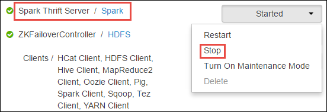

<properties 
    pageTitle="Usar o Gerenciador de recurso alocar recursos para cluster Spark Apache no HDInsight | Microsoft Azure" 
    description="Saiba como usar o Gerenciador de recursos para clusters de Spark no HDInsight para obter melhor desempenho." 
    services="hdinsight" 
    documentationCenter="" 
    authors="nitinme" 
    manager="jhubbard" 
    editor="cgronlun"
    tags="azure-portal"/>

<tags 
    ms.service="hdinsight" 
    ms.workload="big-data" 
    ms.tgt_pltfrm="na" 
    ms.devlang="na" 
    ms.topic="article" 
    ms.date="08/25/2016" 
    ms.author="nitinme"/>

# Gerenciar recursos para o cluster Spark Apache no HDInsight Linux

Neste artigo, você aprenderá como acessar as interfaces como Ambari UI, fio COLORIDO UI, e o servidor de histórico Spark associados ao seu cluster Spark. Você também aprenderá sobre como ajustar a configuração de cluster para um desempenho ideal.

**Pré-requisitos:**

Você deve ter o seguinte:

- Uma assinatura do Azure. Consulte [avaliação gratuita do Azure obter](https://azure.microsoft.com/documentation/videos/get-azure-free-trial-for-testing-hadoop-in-hdinsight/).
- Um cluster de Apache Spark no HDInsight Linux. Para obter instruções, consulte [criar Apache Spark clusters no Azure HDInsight](hdinsight-apache-spark-jupyter-spark-sql.md).

## Como iniciar o interface do usuário do Ambari Web?

1. No [Portal do Azure](https://portal.azure.com/), do startboard, clique no bloco para o seu cluster Spark (se você fixados-lo a startboard). Você também pode navegar para o seu cluster em **Procurar tudo** > **HDInsight Clusters**. 
 
2. Da lâmina cluster Spark, clique em **Painel de controle**. Quando solicitado, digite as credenciais de administrador para o cluster Spark.

    ![Início Ambari] (./media/hdinsight-apache-spark-resource-manager/hdispark.cluster.launch.dashboard.png "Iniciar o Gerenciador de recursos")

3. Isso deve abrir a interface do usuário Ambari da Web, conforme mostrado abaixo.

    ![Web Ambari da interface do usuário] (./media/hdinsight-apache-spark-resource-manager/ambari-web-ui.png "Web Ambari da interface do usuário")   

## Como iniciar o servidor de histórico de Spark?

1. No [Portal do Azure](https://portal.azure.com/), do startboard, clique no bloco para o seu cluster Spark (se você fixados-lo a startboard).

2. Da lâmina do cluster, em **Links rápidos**, clique em **Painel de controle do Cluster**. Na lâmina **Cluster Dashboard** , clique em **Servidor de histórico Spark**.

    ![Servidor de histórico Spark] (./media/hdinsight-apache-spark-resource-manager/launch-history-server.png "Servidor de histórico Spark")

    Quando solicitado, digite as credenciais de administrador para o cluster Spark.

## Como iniciar o fio colorido interface do usuário?

Você pode usar a interface do usuário fio COLORIDO para monitorar aplicativos que estão sendo executadas no cluster Spark. 

1. Da lâmina cluster, clique em **Painel de Cluster**e clique em **fio COLORIDO**.

    

    >[AZURE.TIP] Como alternativa, você também pode iniciar o UI fio COLORIDO da Ambari UI. Para iniciar a Ambari UI, da lâmina cluster, clique em **Painel de Cluster**e, em seguida, clique em **Painel de Cluster HDInsight**. Partir da Ambari UI, clique **fio COLORIDO**, clique em **Links rápidos**, clique em Gerenciador de recursos ativo e clique em **ResourceManager UI**.

## O que é a configuração de cluster ideal para executar Spark aplicativos?

Os três parâmetros de chave que podem ser usados para configuração de Spark dependendo dos requisitos do aplicativo são `spark.executor.instances`, `spark.executor.cores`, e `spark.executor.memory`. Um Executor é um processo iniciado para um aplicativo Spark. Ele é executado no nó trabalhador e é responsável para realizar as tarefas para o aplicativo. O número padrão de executores e os tamanhos de executor para cada cluster é calculado com base no número de nós de trabalho e o tamanho de nó de trabalho. Eles são armazenados no `spark-defaults.conf` em nós de cabeça do cluster. 

Os parâmetros de configuração de três podem ser configurados no nível do cluster (para todos os aplicativos executados no cluster) ou podem ser especificados para cada aplicativo individual também.

### Alterar os parâmetros usando Ambari UI

1. Do UI Ambari clique **Spark**, clique em **configurações**e expanda **spark-padrões personalizados**.

    

2. Os valores padrão são boas ter 4 Spark aplicativos executados simultaneamente no cluster. Você pode alterações esses valores da interface do usuário, conforme mostrado abaixo.

    

3. Clique em **Salvar** para salvar as alterações de configuração. Na parte superior da página, você será solicitado a reiniciar todos os serviços afetados. Clique em **Reiniciar**.

    

### Alterar os parâmetros para um aplicativo em execução no bloco de anotações de Jupyter

Para aplicativos executados no bloco de anotações Jupyter, você pode usar o `%%configure` mágico para fazer as alterações de configuração. Ideal, você deve fazer essas alterações no início do aplicativo, antes de executar sua primeira célula de código. Isso garante que a configuração é aplicada à sessão Livy, quando ela é criada. Se você quiser alterar a configuração posteriormente no aplicativo, você deve usar o `-f` parâmetro. No entanto, por isso andamento todos no aplicativo serão perdido.

O trecho a seguir mostra como alterar a configuração para um aplicativo executado em Jupyter.

    %%configure 
    {"executorMemory": "3072M", "executorCores": 4, “numExecutors”:10}

Parâmetros de configuração devem ser passados como uma cadeia de caracteres JSON e devem ser na próxima linha após a magia, conforme mostrado no exemplo a coluna. 

### Alterar os parâmetros de um aplicativo enviado usando spark-enviar

Comando a seguir é um exemplo de como alterar os parâmetros de configuração para um aplicativo de lote que é enviado usando `spark-submit`.

    spark-submit --class <the application class to execute> --executor-memory 3072M --executor-cores 4 –-num-executors 10 <location of application jar file> <application parameters>

### Alterar os parâmetros de um aplicativo enviado usando ondulação

Comandos a seguir é um exemplo de como alterar os parâmetros de configuração para um aplicativo de lote que é enviada usando ondulação.

    curl -k -v -H 'Content-Type: application/json' -X POST -d '{"file":"<location of application jar file>", "className":"<the application class to execute>", "args":[<application parameters>], "numExecutors":10, "executorMemory":"2G", "executorCores":5' localhost:8998/batches

### Como posso alterar esses parâmetros em um servidor de e mais Próspero banco Spark?

Spark e mais Próspero banco Server fornece acesso ODBC/JDBC para um cluster de Spark e é usado para consultas de SQL de Spark de serviço. Ferramentas como o Power BI, Tableau etc. Use o protocolo ODBC para se comunicar com Spark e mais Próspero banco servidor para executar consultas SQL do Spark como um aplicativo de Spark. Quando um cluster Spark for criado, duas instâncias do servidor e mais Próspero banco Spark são iniciadas, um em cada nó principal. Cada servidor de e mais Próspero banco Spark fica visível como um aplicativo de Spark a IU fio COLORIDO. 

Spark e mais Próspero banco Server usa alocação de executor dinâmico Spark e, portanto, o `spark.executor.instances` não é usado. Em vez disso, Spark e mais Próspero banco Server usa `spark.dynamicAllocation.minExecutors` e `spark.dynamicAllocation.maxExecutors` para especificar a contagem de executor. Os parâmetros de configuração `spark.executor.cores` e `spark.executor.memory` é usado para modificar o tamanho de executor. Você pode alterar esses parâmetros, conforme mostrado abaixo.

* Expanda a categoria de **avançadas de spark e mais Próspero banco-sparkconf** para atualizar os parâmetros `spark.dynamicAllocation.minExecutors`, `spark.dynamicAllocation.maxExecutors`, e `spark.executor.memory`.

     

* Expanda a categoria **personalizada spark e mais Próspero banco sparkconf** para atualizar o parâmetro `spark.executor.cores`.

    

### Como posso alterar a memória de driver do servidor e mais Próspero banco Spark?

Memória de driver Spark e mais Próspero banco Server configurado para 25% do tamanho da RAM nó principal, fornecido que o tamanho de RAM total do nó principal é maior do que 14GB. Você pode usar a UI Ambari para alterar a configuração de memória do driver, conforme mostrado abaixo.

* Da Ambari UI clique **Spark**, clique em **configurações**, expanda **avançadas spark env**e fornecer o valor para **spark_thrift_cmd_opts**.

    

## Não usa BI com cluster Spark. Como tirar os recursos novamente?

Como usamos alocação dinâmica Spark, apenas os recursos que são consumidos pelo servidor e mais Próspero banco são os recursos para os mestres de dois aplicativos. Para recuperar esses recursos, você deve interromper os serviços de servidor e mais Próspero banco em execução no cluster.

1. Da Ambari UI, no painel esquerdo, clique em **Spark**.

2. Na próxima página, clique em **Spark e mais Próspero banco Servers**.

    

3. Você deve ver os dois headnodes em que o servidor de e mais Próspero banco Spark está em execução. Clique em uma da headnodes.

    

4. A próxima página lista todos os serviços em execução no que headnode. Na lista clique no botão suspenso próximo Spark e mais Próspero banco Server e, em seguida, clique em **Parar**.

    

5. Repita essas etapas em outro headnode.

## Meus blocos de anotações de Jupyter não estão executando como esperado. Como reiniciar o serviço?

1. Inicie a interface do usuário do Ambari Web conforme mostrado acima. No painel de navegação esquerdo, clique **Jupyter**, clique em **Ações de serviço**e, em seguida, clique em **Reiniciar tudo**. Isso iniciará o serviço de Jupyter em todo os headnodes.

    ![Reinicie o Jupyter] (./media/hdinsight-apache-spark-resource-manager/restart-jupyter.png "Reinicie o Jupyter")

    

## Consulte também

* [Visão geral: Apache Spark no Azure HDInsight](hdinsight-apache-spark-overview.md)

### Cenários

* [Spark com BI: executar análise de dados interativos usando Spark em HDInsight com ferramentas de BI](hdinsight-apache-spark-use-bi-tools.md)

* [Spark com aprendizado de máquina: Spark de uso em HDInsight para analisar a temperatura de construção usando dados HVAC](hdinsight-apache-spark-ipython-notebook-machine-learning.md)

* [Spark com aprendizado de máquina: Spark de uso em HDInsight prever resultados da inspeção de alimentos](hdinsight-apache-spark-machine-learning-mllib-ipython.md)

* [Streaming Spark: Uso Spark no HDInsight para criar aplicativos de streaming em tempo real](hdinsight-apache-spark-eventhub-streaming.md)

* [Análise de log de site usando Spark no HDInsight](hdinsight-apache-spark-custom-library-website-log-analysis.md)

### Criar e executar aplicativos

* [Criar um aplicativo autônomo usando Scala](hdinsight-apache-spark-create-standalone-application.md)

* [Executar trabalhos remotamente em um cluster de Spark usando Livy](hdinsight-apache-spark-livy-rest-interface.md)

### Ferramentas e extensões

* [Usar o plug-in de ferramentas de HDInsight para IntelliJ IDEIA para criar e enviar Spark Scala aplicativos](hdinsight-apache-spark-intellij-tool-plugin.md)

* [Usar o plug-in de ferramentas de HDInsight para IntelliJ IDEIA para depurar aplicativos de Spark remotamente](hdinsight-apache-spark-intellij-tool-plugin-debug-jobs-remotely.md)

* [Usar blocos de anotações de Zeppelin com um cluster Spark em HDInsight](hdinsight-apache-spark-use-zeppelin-notebook.md)

* [Kernels disponíveis para o bloco de anotações de Jupyter em cluster Spark para HDInsight](hdinsight-apache-spark-jupyter-notebook-kernels.md)

* [Usar os pacotes externos com blocos de anotações de Jupyter](hdinsight-apache-spark-jupyter-notebook-use-external-packages.md)

* [Instalar Jupyter no seu computador e se conectar a um cluster de HDInsight Spark](hdinsight-apache-spark-jupyter-notebook-install-locally.md)

### Gerenciar recursos

* [Rastrear e depurar trabalhos em execução em um cluster de Apache Spark em HDInsight](hdinsight-apache-spark-job-debugging.md)

[hdinsight-versions]: hdinsight-component-versioning.md
[hdinsight-upload-data]: hdinsight-upload-data.md
[hdinsight-storage]: hdinsight-hadoop-use-blob-storage.md

[azure-purchase-options]: http://azure.microsoft.com/pricing/purchase-options/
[azure-member-offers]: http://azure.microsoft.com/pricing/member-offers/
[azure-free-trial]: http://azure.microsoft.com/pricing/free-trial/
[azure-management-portal]: https://manage.windowsazure.com/
[azure-create-storageaccount]: storage-create-storage-account.md 
