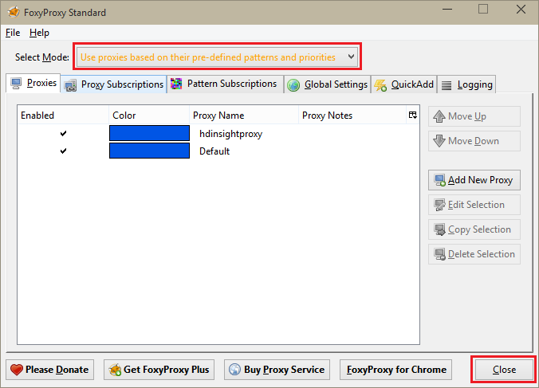

<properties 
    pageTitle="Instalar os blocos de anotações do Zeppelin para cluster Apache Spark em HDInsight Linux | Microsoft Azure" 
    description="Instruções passo a passo sobre como instalar e usar blocos de anotações de Zeppelin com clusters Spark no HDInsight Linux." 
    services="hdinsight" 
    documentationCenter="" 
    authors="nitinme" 
    manager="jhubbard" 
    editor="cgronlun"/>

<tags 
    ms.service="hdinsight" 
    ms.workload="big-data" 
    ms.tgt_pltfrm="na" 
    ms.devlang="na" 
    ms.topic="article" 
    ms.date="10/28/2016" 
    ms.author="nitinme"/>

# Instalar os blocos de anotações do Zeppelin para cluster Apache Spark em HDInsight Linux

Saiba como instalar blocos de anotações de Zeppelin em clusters Apache Spark e como usar os blocos de anotações de Zeppelin para executar Spark trabalhos.

> [AZURE.IMPORTANT] Blocos de anotações de Zeppelin agora estão disponíveis por padrão com clusters Spark. Você não precisa explicitamente instalá-los em um cluster de Spark mais. Para obter mais informações, consulte [usar Zeppelin blocos de anotações com Apache Spark cluster no HDInsight Linux](hdinsight-apache-spark-zeppelin-notebook.md). 

**Pré-requisitos:**

* Antes de começar este tutorial, você deve ter uma assinatura do Azure. Consulte [avaliação gratuita do Azure obter](https://azure.microsoft.com/documentation/videos/get-azure-free-trial-for-testing-hadoop-in-hdinsight/).
* Um cluster de Apache Spark. Para obter instruções, consulte [criar Apache Spark clusters no Azure HDInsight](hdinsight-apache-spark-jupyter-spark-sql.md).
* Um cliente SSH. Para distribuições Linux e Unix ou Macintosh OS X, o `ssh` comando é fornecido com o sistema operacional. Para Windows, é recomendável [Acabamento](http://www.chiark.greenend.org.uk/~sgtatham/putty/download.html)

    > [AZURE.NOTE] Se você deseja usar um cliente SSH diferente `ssh` ou acabamento, consulte a documentação de seu cliente sobre como estabelecer um túnel SSH.

* Um navegador da web que pode ser configurado para usar um proxy SOCKS

* __(opcional)__: um plug-in como [FoxyProxy](http://getfoxyproxy.org/,) que pode aplicar regras que apenas rotear solicitações específico pelo túnel.

    > [AZURE.WARNING] Sem um plug-in como FoxyProxy, todas as solicitações feitas por meio do navegador podem ser roteadas pelo túnel. Isso pode resultar em carregamento mais lento de páginas da web no seu navegador.

## Instalar Zeppelin em um cluster de Spark

Você pode instalar Zeppelin em um cluster de Spark usando a ação de script. Ação de script usa scripts personalizados para instalar os componentes no cluster que não estão disponíveis por padrão. Você pode usar o script personalizado para instalar o Zeppelin do Portal do Azure, usando HDInsight .NET SDK ou usando o PowerShell do Azure. Você pode usar o script para instalar o Zeppelin ou como parte da criação do cluster, ou depois de cluster está em execução. Links nas seções a seguir fornecem as instruções sobre como fazer isso. 

### Usando o Portal do Azure

Para obter instruções sobre como usar o Portal do Azure para executar a ação de script instalar o Zeppelin, consulte [Personalizar HDInsight clusters usando a ação de Script](hdinsight-hadoop-customize-cluster-linux.md#use-a-script-action-from-the-azure-portal). Você deve fazer algumas alterações para as instruções nesse artigo.

* Você deve usar o script para instalar o Zeppelin. O script personalizado instalar Zeppelin em um cluster de Spark em HDInsight está disponível os links a seguir:
    * Para clusters Spark 1.6.0-`https://hdiconfigactions.blob.core.windows.net/linuxincubatorzeppelinv01/install-zeppelin-spark160-v01.sh`
    * Para clusters Spark 1.5.2-`https://hdiconfigactions.blob.core.windows.net/linuxincubatorzeppelinv01/install-zeppelin-spark151-v01.sh`

* Você deve executar a ação script apenas na headnode.

* O script não precisa quaisquer parâmetros. 

### Usando o SDK do .NET HDInsight

Para obter instruções sobre como usar o SDK do .NET HDInsight para executar a ação de script instalar o Zeppelin, consulte [Personalizar HDInsight clusters usando a ação de Script](hdinsight-hadoop-customize-cluster-linux.md#use-a-script-action-from-the-hdinsight-net-sdk). Você deve fazer algumas alterações para as instruções nesse artigo.

* Você deve usar o script para instalar o Zeppelin. O script personalizado instalar Zeppelin em um cluster de Spark em HDInsight está disponível os links a seguir:
    * Para clusters Spark 1.6.0-`https://hdiconfigactions.blob.core.windows.net/linuxincubatorzeppelinv01/install-zeppelin-spark160-v01.sh`
    * Para clusters Spark 1.5.2-`https://hdiconfigactions.blob.core.windows.net/linuxincubatorzeppelinv01/install-zeppelin-spark151-v01.sh`

* O script não precisa quaisquer parâmetros. 

* Defina o tipo de cluster que você está criando a Spark.

### Usando o PowerShell Azure

Use o seguinte trecho do PowerShell para criar um cluster de Spark no HDInsight Linux com Zeppelin instalado. Dependendo de qual versão do cluster Spark tiver, atualize o trecho de código do PowerShell abaixo para incluir o link para o script personalizado correspondente. 

* Para clusters Spark 1.6.0-`https://hdiconfigactions.blob.core.windows.net/linuxincubatorzeppelinv01/install-zeppelin-spark160-v01.sh`
* Para clusters Spark 1.5.2-`https://hdiconfigactions.blob.core.windows.net/linuxincubatorzeppelinv01/install-zeppelin-spark151-v01.sh`

[AZURE.INCLUDE [upgrade-powershell](../../includes/hdinsight-use-latest-powershell.md)]

    Login-AzureRMAccount
    
    # PROVIDE VALUES FOR THE VARIABLES
    $clusterAdminUsername="admin"
    $clusterAdminPassword="<<password>>"
    $clusterSshUsername="adminssh"
    $clusterSshPassword="<<password>>"
    $clusterName="<<clustername>>"
    $clusterContainerName=$clusterName
    $resourceGroupName="<<resourceGroupName>>"
    $location="<<region>>"
    $storage1Name="<<storagename>>"
    $storage1Key="<<storagekey>>"
    $subscriptionId="<<subscriptionId>>"
    
    Select-AzureRmSubscription -SubscriptionId $subscriptionId
    
    $passwordAsSecureString=ConvertTo-SecureString $clusterAdminPassword -AsPlainText -Force
    $clusterCredential=New-Object System.Management.Automation.PSCredential ($clusterAdminUsername, $passwordAsSecureString)
    $passwordAsSecureString=ConvertTo-SecureString $clusterSshPassword -AsPlainText -Force
    $clusterSshCredential=New-Object System.Management.Automation.PSCredential ($clusterSshUsername, $passwordAsSecureString)
    
    $azureHDInsightConfigs= New-AzureRmHDInsightClusterConfig -ClusterType Spark
    $azureHDInsightConfigs.DefaultStorageAccountKey = $storage1Key
    $azureHDInsightConfigs.DefaultStorageAccountName = "$storage1Name.blob.core.windows.net"
    
    Add-AzureRMHDInsightScriptAction -Config $azureHDInsightConfigs -Name "Install Zeppelin" -NodeType HeadNode -Parameters "void" -Uri "https://hdiconfigactions.blob.core.windows.net/linuxincubatorzeppelinv01/install-zeppelin-spark151-v01.sh"
    
    New-AzureRMHDInsightCluster -Config $azureHDInsightConfigs -OSType Linux -HeadNodeSize "Standard_D12" -WorkerNodeSize "Standard_D12" -ClusterSizeInNodes 2 -Location $location -ResourceGroupName $resourceGroupName -ClusterName $clusterName -HttpCredential $clusterCredential -DefaultStorageContainer $clusterContainerName -SshCredential $clusterSshCredential -Version "3.3"
 
## Configurar SSH túnel para acessar um bloco de anotações de Zeppelin

Você usará SSH encapsulamentos para acessar os blocos de anotações de Zeppelin em execução em cluster Spark no HDInsight Linux. As etapas a seguir demonstram como criar um túnel SSH usando ssh linha de comando (Linux) e acabamento (Windows).

### Criar um túnel usando o comando SSH (Linux)

Use o seguinte comando para criar um SSH túnel usando o `ssh` comando. Substitua o __nome de usuário__ com um usuário SSH para o seu cluster HDInsight e __CLUSTERNAME__ com o nome do seu cluster HDInsight

    ssh -C2qTnNf -D 9876 USERNAME@CLUSTERNAME-ssh.azurehdinsight.net

Isso cria uma conexão que rotear o tráfego para a porta local 9876 ao cluster via SSH. As opções são:

* **9876 D** - a porta local que vai rotear o tráfego através do túnel.

* **C** - compactar todos os dados, pois o tráfego da web é principalmente texto.

* **2** - forçar SSH para experimentar o protocolo somente a versão 2.

* **p** - modo silencioso.

* **T** - alocação de tty pseudo-índice desativar, desde que estamos apenas encaminhando uma porta.

* **n** - impede a leitura dos STDIN, desde que estamos apenas encaminhando uma porta.

* **N** - não executar um comando remoto, desde que estamos apenas encaminhando uma porta.

* **f** - executado em segundo plano.

Se você configurou o cluster com uma chave SSH, talvez seja necessário usar o `-i` parâmetro e especifique o caminho para a chave SSH particular.

Após a conclusão do comando, o tráfego enviado a porta 9876 no computador local será roteada sobre Secure Sockets Layer (SSL) ao cluster nó de cabeçalho e parecem se originar lá.

### Criar um túnel usando acabamento (Windows)

Use as seguintes etapas para criar um túnel SSH usando acabamento.

1. Abra Acabamento e insira suas informações de conexão. Se você não estiver familiarizado com acabamento, consulte [Usar SSH com baseado em Linux Hadoop em HDInsight do Windows](hdinsight-hadoop-linux-use-ssh-windows.md) para obter informações sobre como usá-lo com HDInsight.

2. Na seção **categoria** à esquerda da caixa de diálogo, expanda a **Conexão**, expanda **SSH**e selecione **túneis**.

3. Forneça as seguintes informações no formulário de **Opções que controlam o encaminhamento de porta SSH** :

    * **Porta de origem** - a porta no cliente que você deseja encaminhar. Por exemplo, **9876**.

    * Endereço de **destino** - o SSH para o cluster HDInsight baseados em Linux. Por exemplo, **meucluster-ssh.azurehdinsight.net**.

    * **Dinâmico** - proxy SOCKS dinâmico permite que o roteamento.

    

4. Clique em **Adicionar** para adicionar as configurações e clique em **Abrir** para abrir uma conexão SSH.

5. Quando solicitado, faça logon no servidor. Isso estabelecer uma sessão SSH e habilitar o túnel.

### Use o túnel em seu navegador

> [AZURE.NOTE] As etapas desta seção usam o navegador FireFox, como ela está disponível gratuitamente para sistemas Linux, Unix, Macintosh OS X e Windows. Outros navegadores modernos como Google Chrome, Microsoft Edge ou Apple Safari devem funcionar bem; No entanto, o plug-in FoxyProxy usado em algumas etapas pode não estar disponível para todos os navegadores.

1. Configure o navegador para usar **localhost:9876** como um proxy **SOCKS v5** . Aqui está a aparência as configurações do Firefox. Se você usou uma porta diferente 9876, altere a porta para usado:

    

    > [AZURE.NOTE] Selecionar **DNS remoto** resolverá solicitações de sistema de nome de domínio (DNS) usando o cluster HDInsight. Se esta for desmarcada, DNS será resolvido localmente.

2. Verifique se que o tráfego está sendo roteado pelo túnel por vising um site como [http://www.whatismyip.com/](http://www.whatismyip.com/) com as configurações de proxy habilitado e desabilitado no Firefox. Embora as configurações estão habilitadas, o endereço IP será para um computador no Microsoft Azure data center.

### Extensões do navegador

Enquanto Configurando o navegador para usar o túnel funciona, você geralmente não deseja direcionar todo o tráfego através do túnel. Extensões do navegador como [FoxyProxy](http://getfoxyproxy.org/) oferece suporte a padrões correspondentes para solicitações de URL (FoxyProxy padrão ou Plus somente), de modo que somente as solicitações de URLs específicas serão enviadas pela túnel.

Se você tiver instalado o FoxyProxy padrão, use as etapas a seguir para configurá-lo para encaminhar apenas o tráfego para HDInsight através do túnel.

1. Abra a extensão FoxyProxy no seu navegador. Por exemplo, no Firefox, selecione o ícone de FoxyProxy ao lado do campo de endereço.

    

2. Selecionar **Adicionar novo Proxy**, selecione a guia **Geral** e insira um nome de proxy de **HDInsightProxy**.

    

3. Selecione a guia **Detalhes de Proxy** e preencher os campos a seguir:

    * **Host ou o endereço IP** - este é o host local, como estamos usando um túnel SSH na máquina local.

    * **Porta** - essa é a porta que você usou para o túnel SSH.

    * **Proxy SOCKS** - Selecione esta opção para ativar o navegador para usar o túnel como um proxy.

    * **SOCKS v5** - Selecione esta opção para definir a versão necessária para o proxy.

    

4. Selecione a guia **Padrões de URL** e, em seguida, selecione **Adicionar novo padrão**. Use o seguinte para definir o padrão e clique em **Okey**:

    * **Nome do padrão** - **zeppelinnotebook** - isso é apenas um nome amigável para o padrão.

    * **Padrão de URL** - **\*hn0** * - define um padrão que corresponde ao nome de domínio totalmente qualificado interno do ponto de extremidade onde os blocos de anotações de Zeppelin são hospedados. Porque blocos de anotações de Zeppelin só estão disponíveis na headnode0 do cluster, e o ponto de extremidade é geralmente `http://hn0-<string>.internal.cloudapp.net`, usando o padrão * *hn0** garante que a solicitação é redirecionada para o ponto de extremidade de Zeppelin.

        

4. Clique em **Okey** para adicionar o proxy e fechar **As configurações de Proxy**.

5. Na parte superior da caixa de diálogo FoxyProxy, altere **O modo de selecionar** para **proxies de uso com base em seus padrões predefinidos e prioridades**e clique em **Fechar**.

    

Depois de seguir essas etapas, somente as solicitações para URLs que contêm a cadeia de caracteres __hn0__ serão roteadas através do túnel SSL. 

## Acessar o bloco de anotações de Zeppelin

Quando você tiver SSH túnel configuração, você pode usar as etapas a seguir para acessar o bloco de anotações de Zeppelin em cluster Spark seguindo as etapas abaixo. Nesta seção, você verá como executar % sql e instruções de seção de %.

1. Usando o navegador da web, abra o ponto de extremidade a seguir:

        http://hn0-myspar:9995

    * **hn0** indica headnode0
    * **myspar** são as seis primeiras letras do nome do cluster Spark.
    * **9995** é a porta onde o bloco de anotações de Zeppelin é acessível.

2. Crie um novo bloco de anotações. No painel de cabeçalho, clique em **Bloco de anotações**e, em seguida, clique em **Criar nova anotação**.

    ![Criar um novo bloco de anotações de Zeppelin] (./media/hdinsight-apache-spark-use-zeppelin-notebook/hdispark.createnewnote.png "Criar um novo bloco de anotações de Zeppelin")

    Na mesma página, sob o título do **Bloco de anotações** , você verá um novo bloco de anotações com o nome começando com **XXXXXXXXX de anotação**. Clique em novo bloco de anotações.

3. Na página da web para o novo bloco de anotações, clique no título e alterar o nome do bloco de anotações se desejar. Pressione ENTER para salvar a alteração de nome. Além disso, verifique se que o cabeçalho de bloco de anotações mostra um status **conectado** no canto superior direito.

    ![Status de bloco de anotações de Zeppelin] (./media/hdinsight-apache-spark-use-zeppelin-notebook/hdispark.newnote.connected.png "Status de bloco de anotações de Zeppelin")

### Executar instruções SQL

4. Carregar dados de amostra para uma tabela temporária. Quando você cria um cluster Spark no HDInsight, o arquivo de dados de exemplo, **hvac.csv**, é copiado para a conta de armazenamento associado em **\HdiSamples\SensorSampleData\hvac**.

    No parágrafo vazio que é criado por padrão no novo bloco de anotações, cole o seguinte trecho.

        // Create an RDD using the default Spark context, sc
        val hvacText = sc.textFile("wasbs:///HdiSamples/HdiSamples/SensorSampleData/hvac/HVAC.csv")
        
        // Define a schema
        case class Hvac(date: String, time: String, targettemp: Integer, actualtemp: Integer, buildingID: String)
        
        // Map the values in the .csv file to the schema
        val hvac = hvacText.map(s => s.split(",")).filter(s => s(0) != "Date").map(
            s => Hvac(s(0), 
                    s(1),
                    s(2).toInt,
                    s(3).toInt,
                    s(6)
            )
        ).toDF()
        
        // Register as a temporary table called "hvac"
        hvac.registerTempTable("hvac")
        
    Pressione **SHIFT + ENTER** ou clique no botão **Executar** para o parágrafo executar o trecho. O status no canto direito do parágrafo devem progresso de pronto, pendente, execução como concluído. A saída aparece na parte inferior do mesmo parágrafo. A captura de tela tem a seguinte aparência:

    ![Criar uma tabela temporária de dados processados] (./media/hdinsight-apache-spark-use-zeppelin-notebook/hdispark.note.loaddDataintotable.png "Criar uma tabela temporária de dados processados")

    Você também pode fornecer um título a cada parágrafo. Do canto direito, clique no ícone **configurações** e clique em **Mostrar título**.

5. Agora você pode executar instruções SQL Spark na tabela **hvac** . Cole a seguinte consulta em um novo parágrafo. A consulta recupera a ID de construção e a diferença entre o destino e reais temperaturas para cada prédio em uma determinada data. Pressione **SHIFT + ENTER**.

        %sql
        select buildingID, (targettemp - actualtemp) as temp_diff, date 
        from hvac
        where date = "6/1/13" 

    A instrução **sql %** no começo informa o bloco de anotações para usar o intérprete Spark SQL. Você pode examinar os interpretadores definidos na guia **intérprete** no cabeçalho do bloco de anotações.

    A captura de tela a seguir mostra a saída.

    ![Executar uma instrução SQL de Spark usando o bloco de anotações] (./media/hdinsight-apache-spark-use-zeppelin-notebook/hdispark.note.sparksqlquery1.png "Executar uma instrução SQL de Spark usando o bloco de anotações")

     Clique nas opções de exibição (realçadas no retângulo) para alternar entre diferentes representações para a mesma saída. Clique em **configurações** para escolher quais consitutes a chave e os valores na saída. A captura de tela acima usa **buildingID** como a chave e a média de **temp_diff** como o valor.

    
6. Você também pode executar instruções SQL Spark usando variáveis na consulta. O próximo trecho mostra como definir uma variável, **Temp**, na consulta com os valores possíveis que você deseja consultar com. Quando você primeiro executa a consulta, uma lista suspensa é preenchida automaticamente com os valores especificados para a variável.

        %sql
        select buildingID, date, targettemp, (targettemp - actualtemp) as temp_diff
        from hvac
        where targettemp > "${Temp = 65,65|75|85}" 

    Cole este trecho de código em um novo parágrafo e pressione **SHIFT + ENTER**. A captura de tela a seguir mostra a saída.

    ![Executar uma instrução SQL de Spark usando o bloco de anotações] (./media/hdinsight-apache-spark-use-zeppelin-notebook/hdispark.note.sparksqlquery2.png "Executar uma instrução SQL de Spark usando o bloco de anotações")

    Para consultas subsequentes, você pode selecionar um novo valor na lista suspensa e execute a consulta novamente. Clique em **configurações** para escolher quais consitutes a chave e os valores na saída. A captura de tela acima usa **buildingID** como a chave, a média de **temp_diff** como o valor e **targettemp** como o grupo.

7. Reinicie o intérprete Spark SQL para sair do aplicativo. Clique na guia de **intérprete** na parte superior e para o intérprete Spark, clique em **Reiniciar**.

    ![Reinicie o intepreter Zeppelin] (./media/hdinsight-apache-spark-use-zeppelin-notebook/hdispark.zeppelin.restart.interpreter.png "Reinicie o intepreter Zeppelin")

### Executar instruções de seção

1. No bloco de anotações Zeppelin, clique no botão de **intérprete** .

    ![Seção de atualização intérprete] (./media/hdinsight-apache-spark-use-zeppelin-notebook/zeppelin-update-hive-interpreter-1.png "Seção de atualização intérprete")

2. Para o intérprete de **seção** , clique em **Editar**.

    ![Seção de atualização intérprete] (./media/hdinsight-apache-spark-use-zeppelin-notebook/zeppelin-update-hive-interpreter-2.png "Seção de atualização intérprete")

    Atualize as seguintes propriedades.

    * Defina **default.password** como a senha especificada para o usuário admin ao criar o cluster HDInsight Spark.
    * Defina **default.url** como `jdbc:hive2://<spark_cluster_name>.azurehdinsight.net:443/default;ssl=true?hive.server2.transport.mode=http;hive.server2.thrift.http.path=/hive2`. Substituir ** \<spark_cluster_name >** com o nome do seu cluster Spark.
    * Defina **default.user** como o nome do usuário administrador que você especificou ao criar o cluster. Por exemplo, *administrador*.

3. Clique em **Salvar** e quando solicitado para reiniciar o intérprete de seção, clique em **Okey**.

4. Crie um novo bloco de anotações e execute a instrução a seguir para listar todas as tabelas de seção no cluster.

        %hive
        SHOW TABLES

    Por padrão, um cluster de HDInsight tem uma tabela de exemplo chamada **hivesampletable** , então você deve ver o seguinte resultado.

    ![Seção de saída] (./media/hdinsight-apache-spark-use-zeppelin-notebook/zeppelin-update-hive-interpreter-3.png "Seção de saída")

5. Execute a seguinte instrução para listar os registros na tabela.

        %hive
        SELECT * FROM hivesampletable LIMIT 5

    Você deve uma saída semelhante ao seguinte.

    ![Seção de saída] (./media/hdinsight-apache-spark-use-zeppelin-notebook/zeppelin-update-hive-interpreter-4.png "Seção de saída")

## Consulte também

* [Visão geral: Apache Spark no Azure HDInsight](hdinsight-apache-spark-overview.md)

### Cenários

* [Spark com BI: executar análise de dados interativos usando Spark em HDInsight com ferramentas de BI](hdinsight-apache-spark-use-bi-tools.md)

* [Spark com aprendizado de máquina: Spark de uso em HDInsight para analisar a temperatura de construção usando dados HVAC](hdinsight-apache-spark-ipython-notebook-machine-learning.md)

* [Spark com aprendizado de máquina: Spark de uso em HDInsight prever resultados da inspeção de alimentos](hdinsight-apache-spark-machine-learning-mllib-ipython.md)

* [Streaming Spark: Uso Spark no HDInsight para criar aplicativos de streaming em tempo real](hdinsight-apache-spark-eventhub-streaming.md)

* [Análise de log de site usando Spark no HDInsight](hdinsight-apache-spark-custom-library-website-log-analysis.md)

### Criar e executar aplicativos

* [Criar um aplicativo autônomo usando Scala](hdinsight-apache-spark-create-standalone-application.md)

* [Executar trabalhos remotamente em um cluster de Spark usando Livy](hdinsight-apache-spark-livy-rest-interface.md)

### Ferramentas e extensões

* [Usar o plug-in de ferramentas de HDInsight para IntelliJ IDEIA para criar e enviar Spark Scala aplicativos](hdinsight-apache-spark-intellij-tool-plugin.md)

* [Usar o plug-in de ferramentas de HDInsight para IntelliJ IDEIA para depurar aplicativos de Spark remotamente](hdinsight-apache-spark-intellij-tool-plugin-debug-jobs-remotely.md)

* [Kernels disponíveis para o bloco de anotações de Jupyter em cluster Spark para HDInsight](hdinsight-apache-spark-jupyter-notebook-kernels.md)

* [Usar os pacotes externos com blocos de anotações de Jupyter](hdinsight-apache-spark-jupyter-notebook-use-external-packages.md)

* [Instalar Jupyter no seu computador e se conectar a um cluster de HDInsight Spark](hdinsight-apache-spark-jupyter-notebook-install-locally.md)

### Gerenciar recursos

* [Gerenciar recursos para cluster Spark Apache no Azure HDInsight](hdinsight-apache-spark-resource-manager.md)

* [Rastrear e depurar trabalhos em execução em um cluster de Apache Spark em HDInsight](hdinsight-apache-spark-job-debugging.md)

[hdinsight-versions]: hdinsight-component-versioning.md
[hdinsight-upload-data]: hdinsight-upload-data.md
[hdinsight-storage]: hdinsight-hadoop-use-blob-storage.md

[azure-purchase-options]: http://azure.microsoft.com/pricing/purchase-options/
[azure-member-offers]: http://azure.microsoft.com/pricing/member-offers/
[azure-free-trial]: http://azure.microsoft.com/pricing/free-trial/
[azure-management-portal]: https://manage.windowsazure.com/
[azure-create-storageaccount]: storage-create-storage-account.md 

