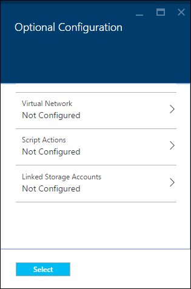
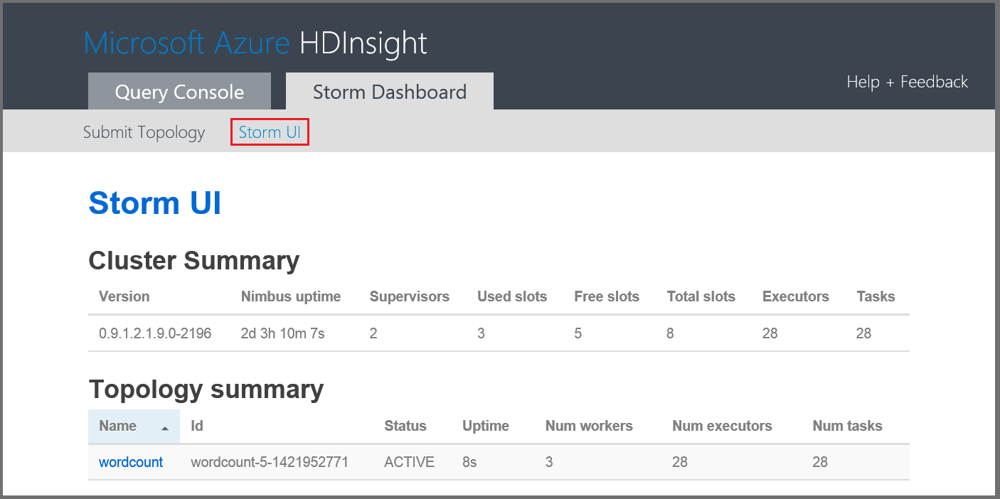
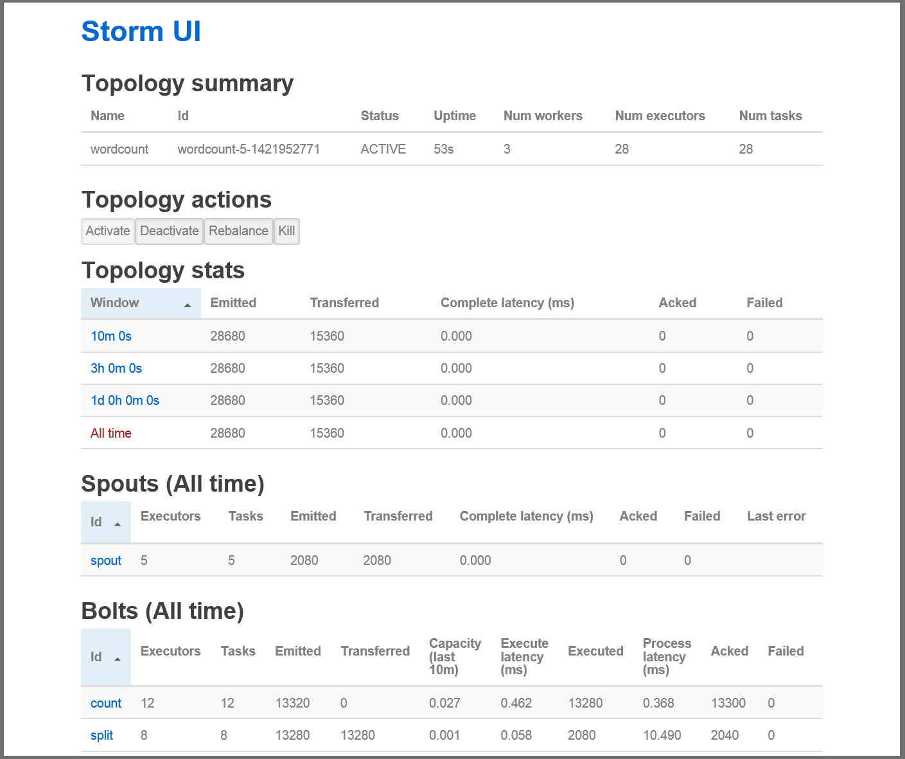

<properties
    pageTitle="Tutorial de tempestade Apache: Introdução ao tempestade | Microsoft Azure"
    description="Começar a usar a análise de dados grande usando Apache tempestade e as amostras de tempestade Starter em HDInsight. Saiba como usar tempestade para processar dados em tempo real."
    keywords="Tempestade Apache, tutorial de tempestade apache, a análise de dados grande, starter tempestade"
    services="hdinsight"
    documentationCenter=""
    authors="Blackmist"
    manager="jhubbard"
    editor="cgronlun"
    tags="azure-portal"/>

<tags
   ms.service="hdinsight"
   ms.devlang="java"
   ms.topic="article"
   ms.tgt_pltfrm="na"
   ms.workload="big-data"
   ms.date="09/07/2016"
   ms.author="larryfr"/>

# Tutorial de tempestade Apache: começar a usar as amostras de tempestade Starter para análise de dados grande em HDInsight

Tempestade Apache é um sistema de computação scalable, tolerância, distribuído, em tempo real para o processamento de fluxos de dados. Com tempestade no Microsoft Azure HDInsight, você pode criar um cluster de tempestade baseado em nuvem que realiza a análise de dados grande em tempo real. 

> [AZURE.NOTE] As etapas neste artigo criam um cluster baseado no Windows HDInsight. Para obter etapas criar uma tempestade baseados em Linux em cluster HDInsight, consulte [tutorial Apache tempestade: começar a usar a amostra de tempestade Starter usando a análise de dados em HDInsight](hdinsight-apache-storm-tutorial-get-started-linux.md)

## Pré-requisitos

[AZURE.INCLUDE [delete-cluster-warning](../../includes/hdinsight-delete-cluster-warning.md)]

Você deve ter o seguinte para concluir este tutorial Apache tempestade com êxito:

- **Assinatura de um Azure**. Consulte [avaliação gratuita do Azure obter](https://azure.microsoft.com/documentation/videos/get-azure-free-trial-for-testing-hadoop-in-hdinsight/).

### Requisitos de controle de acesso

[AZURE.INCLUDE [access-control](../../includes/hdinsight-access-control-requirements.md)]

## Criar um cluster de tempestade

Tempestade em HDInsight usa o armazenamento de Blob do Azure para armazenar arquivos de log e topologias enviadas ao cluster. Use as seguintes etapas para criar uma conta de armazenamento do Azure para uso com o seu cluster:

1. Entre [Portal do Azure][preview-portal].

2. Selecione **novo**, selecione __A análise de dados__e selecione __HDInsight__.

    

3. Insira um __nome de Cluster__. Uma marca de seleção verde é exibida ao lado do __Nome do Cluster__ se ele estiver disponível.

4. Se você tiver mais de uma assinatura, selecione a entrada de __assinatura__ para selecionar a assinatura Azure que será usada para o cluster.

5.  Use __Selecionar tipo de Cluster__ para selecionar um cluster de __tempestade__ . Para o __sistema operacional__, selecione Windows. Para __Cluster camada__, selecione padrão. Por fim, use o botão de seleção para salvar essas configurações.

    

5. __Grupo de recursos__, você pode usar a lista suspensa para ver uma lista de grupos de recursos existentes e, em seguida, selecione aquele para criar o cluster no. Ou você pode selecionar __novo__ e, em seguida, insira o nome do novo grupo de recursos. Aparece uma marca de seleção verde para indicar se o novo nome de grupo está disponível.

6. Selecione __as credenciais__e insira um __Nome de usuário do Cluster Login__ e a __Senha de logon do Cluster__. Por fim, use __Selecionar__ para definir as credenciais. Área de trabalho remota não será usada neste documento, então você pode deixá-lo desativado.

    

6. Para __Fonte de dados__, você pode selecionar a entrada para escolher uma fonte de dados existente ou crie um novo.

    

    Atualmente, você pode selecionar uma conta de armazenamento do Azure como fonte de dados para um cluster de HDInsight. Use este procedimento para entender as entradas na lâmina __Fonte de dados__ .

    - __Método de seleção__: defina __de todas as assinaturas__ para habilitar a navegação das contas de armazenamento em suas assinaturas. Defina a __Chave de acesso__ se desejar inserir o __Nome de armazenamento__ e uma __Tecla de acesso__ de uma conta de armazenamento existente.

    - __Criar novo__: Use essa opção para criar uma nova conta de armazenamento. Use o campo que aparece para digitar o nome da conta de armazenamento. Uma marca de seleção verde será exibido se o nome está disponível.

    - __Escolha o contêiner de padrão__: Use este comando para inserir o nome do contêiner padrão a ser usado para o cluster. Enquanto você pode inserir qualquer nome aqui, é recomendável usar o mesmo nome como cluster para que você possa reconhecer facilmente que o contêiner é usado para este cluster específico.

    - __Local__: A região geográfica que a conta de armazenamento será no ou será criada em.

        > [AZURE.IMPORTANT] Selecionando o local para a fonte de dados padrão também define o local do cluster HDInsight. A fonte de dados de cluster e padrão deve estar localizada na mesma região.

    - __Selecione__: Use este comando para salvar a configuração de fonte de dados.

7. Selecione __Níveis de preços de nó__ para exibir informações sobre os nós que serão criados para este cluster. Por padrão, o número de nós de trabalho está definido para __4__. Defina como __1__, como isso é suficiente para este tutorial e reduz o custo do cluster. O custo estimado do cluster é mostrado na parte inferior deste blade.

    

    Use o comando __Selecionar__ para salvar as informações de __Nó níveis de preços__ .

8. Selecione __configuração opcional__. Este blade permite que você selecione a versão de cluster, bem como definir outras configurações opcionais, como ingressar em uma __Rede Virtual__.

    

9. Certifique-se de que __Pin para Startboard__ está selecionada e clique em seguida __criar__. Isso cria o cluster e adiciona um bloco para ele para o Startboard de seu portal Azure. O ícone indica que o cluster é provisionamento e alterações para exibir o ícone de HDInsight uma vez provisionamento concluiu.

  	| Ao provisionar | Configuração concluída |
  	| ------------------ | --------------------- |
  	|  |  |

    > [AZURE.NOTE] Leva algum tempo para o cluster seja criado, geralmente cerca de 15 minutos. Use o bloco na Startboard ou a entrada de __notificações__ à esquerda da página, para verificar o processo de provisionamento.

## Executar uma amostra de tempestade Starter em HDInsight

Este tutorial Apache tempestade apresenta a análise de dados grande usando as amostras de tempestade Starter em GitHub.

Cada tempestade em cluster HDInsight vem com o painel de tempestade, que pode ser usado para carregar e executar topologias tempestade em cluster. Cada cluster também vem com exemplos de topologias que podem ser executados diretamente do Dashboard tempestade.

### Conectar-se ao painel

O painel está localizado em **https://&lt;clustername >.azurehdinsight.net//**, onde **clustername** é o nome do cluster. Você também pode encontrar um link para o painel selecionando o cluster a Startboard e selecionando o link __do Dashboard__ na parte superior da lâmina.

> [AZURE.NOTE] Ao se conectar ao painel, você precisará Insira um nome de usuário e senha. Este é o nome do administrador (**administrador**) e a senha usada quando você criou o cluster.

Depois que o painel de tempestade foi carregado, você verá o formulário de **Topologia de enviar** .

O formulário de **Topologia enviar** pode ser usado para carregar e executar arquivos. jar que contêm topologias tempestade. Ele também inclui vários exemplos básicos que são fornecidos com o cluster.

### Executar a amostra de contagem de palavras do projeto tempestade Starter no GitHub

Os exemplos fornecidos com o cluster incluem diversas variações de uma topologia de contagem do word. Esses exemplos incluem um **spout** que emite aleatoriamente sentenças e **bolts** que dividir cada frase em palavras individuais, em seguida, conte quantas vezes cada palavra ocorreu. Esses exemplos são de [amostras de tempestade Starter](https://github.com/apache/storm/tree/master/examples/storm-starter), que fazem parte da Apache tempestade.

Execute as seguintes etapas para executar uma amostra de tempestade Starter:

1. Selecione **StormStarter - WordCount** na lista suspensa do **Arquivo Jar** . Isso preenche os campos **Nome da classe** e **Parâmetros adicionais** com os parâmetros para este exemplo.

    

    * **Nome da classe** - a classe no arquivo. jar que envia a topologia.
    * **Parâmetros adicionais** - quaisquer parâmetros necessários a topologia. Neste exemplo, o campo é usado para fornecer um nome amigável para a topologia enviado.

2. Clique em **Enviar**. Após alguns instantes, o campo **resultado** exibe o comando usado para enviar o trabalho, bem como os resultados do comando. O campo de **erro** exibe todos os erros que ocorrem ao enviar a topologia.

    

    > [AZURE.NOTE] Os resultados não indicam que a topologia terminou - **uma topologia de tempestade, uma vez iniciada, é executado até que o proprietário.** A topologia de contagem de palavras gera sentenças aleatórias e mantém uma contagem de quantas vezes ele encontra cada palavra, até você interrompê-la.

### Monitorar a topologia

A interface de usuário de tempestade podem ser usado para monitorar a topologia.

1. Selecione **Tempestade UI** na parte superior do painel de tempestade. Isso exibe as informações de resumo para o cluster e todas as topologias em execução.

    

    Na página acima, você pode ver a hora que a topologia foi ativa, além do número de funcionários, executores e tarefas sendo usadas.

    > [AZURE.NOTE] A coluna **nome** contém o nome amigável fornecido anteriormente por meio do campo de **Parâmetros adicionais** .

4. Em **Resumo de topologia**, selecione a entrada de **wordcount** na coluna **nome** . Isso exibe mais informações sobre a topologia.

    

    Esta página fornece as seguintes informações:

    * **Estatísticas de topologia** - informações básicas sobre o desempenho de topologia, organizados em janelas de tempo.

        > [AZURE.NOTE] A seleção de uma janela de tempo específico altera a janela de tempo para informações exibidas em outras seções da página.

    * **Spouts** - informações básicas sobre spouts, incluindo o último erro retornado por cada spout.

    * **Bolts** - informações básicas sobre parafusos.

    * **Configuração de topologia** - informações detalhadas sobre a configuração de topologia.

    Essa página também fornece ações que podem ser executadas na topologia:

    * **Ativar** - processamento de currículos de uma topologia desativada.

    * **Desativar** - pausa uma topologia em execução.

    * **Rebalancear** - ajustará o paralelismo da topologia. Você deve rebalancear topologias em execução depois de alterar o número de nós no cluster. Isso permite a topologia ajustar paralelismo para compensar o número de aumento/redução de nós no cluster. Para obter mais informações, consulte [Noções básicas sobre o paralelismo de uma topologia de tempestade](http://storm.apache.org/documentation/Understanding-the-parallelism-of-a-Storm-topology.html).

    * **Eliminar** - termina uma topologia de tempestade após o tempo limite especificado.

5. Nesta página, selecione uma entrada da seção **Spouts** ou **Bolts** . Isso exibe as informações sobre o componente selecionado.

    

    Esta página exibe as seguintes informações:

    * **Estatísticas de spout/raio** - informações básicas sobre o desempenho do componente, organizados em janelas de tempo.

        > [AZURE.NOTE] A seleção de uma janela de tempo específico altera a janela de tempo para informações exibidas em outras seções da página.

    * **Estatísticas de entrada** (incluir apenas) - informações sobre componentes que produzem dados consumidos pelo raio.

    * **Estatísticas de saída** - obter informações sobre dados emitidas por este raio.

    * **Executores** - informações sobre ocorrências desse componente.

    * **Erros** - erros produzidos por esse componente.

5. Ao exibir os detalhes de uma spout ou raio, selecione uma entrada da coluna **porta** na seção **executores** para exibir detalhes de uma instância específica do componente.

        2015-01-27 14:18:02 b.s.d.task [INFO] Emitting: split default ["with"]
        2015-01-27 14:18:02 b.s.d.task [INFO] Emitting: split default ["nature"]
        2015-01-27 14:18:02 b.s.d.executor [INFO] Processing received message source: split:21, stream: default, id: {}, [snow]
        2015-01-27 14:18:02 b.s.d.task [INFO] Emitting: count default [snow, 747293]
        2015-01-27 14:18:02 b.s.d.executor [INFO] Processing received message source: split:21, stream: default, id: {}, [white]
        2015-01-27 14:18:02 b.s.d.task [INFO] Emitting: count default [white, 747293]
        2015-01-27 14:18:02 b.s.d.executor [INFO] Processing received message source: split:21, stream: default, id: {}, [seven]
        2015-01-27 14:18:02 b.s.d.task [INFO] Emitting: count default [seven, 1493957]

    Esses dados, você pode ver que o word **sete** ocorreu 1,493,957 vezes. Isso é quantas vezes ela foi encontrada desde que essa topologia foi iniciada.

### Parar a topologia

Retorne para a página de **Resumo de topologia** para a topologia de contagem de palavras e selecione **eliminar** a seção **topologia ações** . Quando solicitado, digite 10 para os segundos aguardar antes de interromper a topologia. Após o período de tempo limite, a topologia não aparece mais quando visitar a seção de **Tempestade UI** do painel de controle.

##Excluir o cluster

[AZURE.INCLUDE [delete-cluster-warning](../../includes/hdinsight-delete-cluster-warning.md)]

## Resumo

Neste tutorial Apache tempestade, você usava o Starter tempestade para aprender a criar uma tempestade em cluster HDInsight e usar o painel de tempestade para implantar, monitorar e gerenciar topologias tempestade.

## Próximas etapas

* **Ferramentas de HDInsight para Visual Studio** - HDInsight ferramentas permite que você use o Visual Studio para enviar, monitorar e gerenciar topologias de tempestade semelhantes ao painel tempestade mencionado anteriormente. Ferramentas de HDInsight também fornece a capacidade de criar topologias c# tempestade e inclui topologias de exemplo que você pode implantar e executar no cluster.

    Para obter mais informações, consulte [Introdução usando as ferramentas de HDInsight para Visual Studio](hdinsight-hadoop-visual-studio-tools-get-started.md).

* **Arquivos de amostra** - cluster o tempestade HDInsight fornece vários exemplos no diretório **%STORM_HOME%\contrib** . Cada exemplo deve conter o seguinte:

    * O código-fonte - por exemplo, tempestade-starter-0.9.1.2.1.5.0-2057-sources.jar

    * A documentos de Java - por exemplo, tempestade-starter-0.9.1.2.1.5.0-2057-javadoc.jar

    * O exemplo - por exemplo, storm-starter-0.9.1.2.1.5.0-2057-jar-with-dependencies.jar

    Use o comando 'jar' para extrair o código-fonte ou documentos de Java. Por exemplo, ' tempestade de xvf - jar-starter-0.9.1.2.1.5.0.2057-javadoc.jar'.

    > [AZURE.NOTE] Documentos de Java consistem em páginas da Web. Quando extraídos, use um navegador para exibir o arquivo **index** .

    Para acessar esses exemplos, você deve habilitar a área de trabalho remota para o tempestade em cluster HDInsight e, em seguida, copie os arquivos do **%STORM_HOME%\contrib**.

* O seguinte documento contém uma lista de outros exemplos que podem ser usadas com tempestade em HDInsight:

    * [Topologias de exemplo para tempestade em HDInsight](hdinsight-storm-example-topology.md)

[apachestorm]: https://storm.incubator.apache.org
[stormdocs]: http://storm.incubator.apache.org/documentation/Documentation.html
[stormstarter]: https://github.com/apache/storm/tree/master/examples/storm-starter
[stormjavadocs]: https://storm.incubator.apache.org/apidocs/
[azureportal]: https://manage.windowsazure.com/
[hdinsight-provision]: hdinsight-provision-clusters.md
[preview-portal]: https://portal.azure.com/
