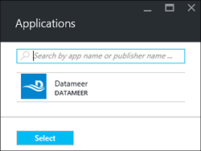

<properties
    pageTitle="Instalar aplicativos do Hadoop em HDInsight | Microsoft Azure"
    description="Saiba como instalar os aplicativos de HDInsight em aplicativos de HDInsight."
    services="hdinsight"
    documentationCenter=""
    authors="mumian"
    manager="jhubbard"
    editor="cgronlun"
    tags="azure-portal"/>

<tags
    ms.service="hdinsight"
    ms.devlang="na"
    ms.topic="hero-article"
    ms.tgt_pltfrm="na"
    ms.workload="big-data"
    ms.date="09/14/2016"
    ms.author="jgao"/>

# Instalar aplicativos de HDInsight

Um aplicativo de HDInsight é um aplicativo que os usuários podem instalar em um cluster de HDInsight baseados em Linux. Esses aplicativos podem ser desenvolvidos pela Microsoft, fornecedores de software independentes (ISV) ou por si mesmo. Neste artigo, você aprenderá como instalar um aplicativo publicado. Para instalar o seu próprio aplicativo, consulte [instalar aplicativos personalizados de HDInsight](hdinsight-apps-install-custom-applications.md). 

Atualmente não há um aplicativo publicado:

- **Datameer**: [Datameer](http://www.datameer.com/documentation/display/DAS50/Home?ls=Partners&lsd=Microsoft&c=Partners&cd=Microsoft) oferece analistas uma forma interativa de descobrir, analisar e visualizar os resultados em dados grande. Retire nas fontes de dados adicionais facilmente para descobrir novas relações e obter as respostas que necessárias rapidamente.

>[AZURE.NOTE] Datameer atualmente é suportado apenas nas Azurehdinsight versão 3,2 clusters.

As instruções fornecidas neste artigo usam portal Azure. Você também pode exportar o modelo do Gerenciador de recursos do Azure a partir do portal ou obter uma cópia do modelo de Gerenciador de recursos de fornecedores e use PowerShell do Azure e CLI do Azure para implantar o modelo.  Consulte [Hadoop baseados em Linux criar clusters de HDInsight usando modelos do Gerenciador de recursos](hdinsight-hadoop-create-linux-clusters-arm-templates.md).

## Pré-requisitos

Se você quiser instalar aplicativos de HDInsight em um cluster de HDInsight existente, você deve ter um cluster de HDInsight. Para criar uma, consulte [criar clusters](hdinsight-hadoop-linux-tutorial-get-started.md#create-cluster). Você também pode instalar aplicativos de HDInsight quando você cria um cluster de HDInsight.

## Instalar aplicativos em clusters existentes

O procedimento a seguir mostra como instalar aplicativos de HDInsight para um cluster de HDInsight existente.

**Para instalar um aplicativo de HDInsight**

1. Entrar no [portal do Azure](https://portal.azure.com).
2. Clique em **Clusters de HDInsight** no menu à esquerda.  Se você não estiver visível, clique em **Procurar**e, em seguida, clique em **Clusters de HDInsight**.
3. Clique em um cluster de HDInsight.  Se você não tiver um, você deve criar uma primeira.  consulte [criar clusters](hdinsight-hadoop-linux-tutorial-get-started.md#create-cluster).
4. Da lâmina **configurações** , clique em **aplicativos** em categoria **Geral** . A lâmina de **Aplicativos instalados** lista todos os aplicativos instalados. 

    

5. Clique em **Adicionar** no menu de blade. 

    

    Você deverá ver uma lista de aplicativos de HDInsight existentes.

    

6. Clique em um dos aplicativos, aceite os termos legais e, em seguida, clique em **Selecionar**.

Você pode ver o status da instalação das notificações de portal (clique no ícone de sino na parte superior do portal). Depois que o aplicativo é instalado, o aplicativo aparecerá na lâmina aplicativos instalados.

## Instalar aplicativos durante a criação de cluster

Você tem a opção para instalar os aplicativos de HDInsight quando você cria um cluster. Durante o processo, aplicativos de HDInsight são instalados depois cluster é criado e o estado em execução. O procedimento a seguir mostra como instalar os aplicativos de HDInsight quando você cria um cluster.

**Para instalar um aplicativo de HDInsight**

1. Entrar no [portal do Azure](https://portal.azure.com).
2. Clique em **novo**, clique em **dados + análise**e clique em **HDInsight**.
3. Insira o **Nome do Cluster**: esse nome deve ser exclusivo.
4. Clique em **assinatura** para selecionar a assinatura Azure que será usada para o cluster.
5. Clique em **Selecionar cluster tipo**e selecione:

    - **Tipo de cluster**: se você não souber qual escolher, selecione **Hadoop**. É o tipo de cluster mais popular.
    - **Sistema operacional**: selecione **Linux**.
    - **Versão**: usar a versão padrão se você não sabe o que escolher. Para obter mais informações, consulte [versões de cluster HDInsight](hdinsight-component-versioning.md).
    - **Nível de cluster**: Azurehdinsight fornece as ofertas de nuvem de grande volume em duas categorias: Standard e Premium camadas. Para obter mais informações, consulte [níveis de Cluster](hdinsight-hadoop-provision-linux-clusters.md#cluster-tiers).
6. Clique em **aplicativos**, clique em um dos aplicativos publicados e, em seguida, clique em **Selecionar**.
6. Clique em **credenciais** e, em seguida, digite uma senha para o usuário admin. Você também deve inserir um **Nome de usuário SSH** e uma **senha** ou **Chave pública**, que será usado para autenticar o usuário SSH. Usar uma chave pública é a abordagem recomendada. Na parte inferior para salvar a configuração de credenciais, clique em **Selecionar** .
8. Clique em **Fonte de dados**, selecione uma da conta de armazenamento existente ou criar uma nova conta de armazenamento a ser usado como a conta de armazenamento padrão para o cluster.
9. Clique em **Grupo de recursos** para selecionar um grupo de recursos existente ou clique em **novo** para criar um novo grupo de recursos

10. No **Novo HDInsight Cluster** blade, certifique-se de que **Pin para Startboard** está selecionada e clique em **criar**. 

## Lista de aplicativos instalados do HDInsight e propriedades

O portal mostra uma lista dos aplicativos instalados HDInsight para um cluster e as propriedades de cada aplicativo instalado.

**Propriedades de aplicativo e exibição de HDInsight de lista**

1. Entrar no [portal do Azure](https://portal.azure.com).
2. Clique em **Clusters de HDInsight** no menu à esquerda.  Se você não estiver visível, clique em **Procurar**e, em seguida, clique em **Clusters de HDInsight**.
3. Clique em um cluster de HDInsight.
4. Da lâmina **configurações** , clique em **aplicativos** em categoria **Geral** . A lâmina de aplicativos instalados lista todos os aplicativos instalados. 

    

5. Clique em um dos aplicativos instalados para mostrar a propriedade. As listas de blade de propriedade:

    - Nome do aplicativo: nome do aplicativo.
    - Status: status do aplicativo. 
    - Página da Web: A URL do aplicativo da web que você implantou o nó de borda, se houver alguma. A credencial é a mesma que as credenciais de usuário HTTP que você configurou para o cluster.
    - Ponto de extremidade HTTP: A credencial é a mesma que as credenciais de usuário HTTP que você configurou para o cluster. 
    - Ponto de extremidade SSH: você pode usar [SSH](hdinsight-hadoop-linux-use-ssh-unix.md) para se conectar a nó de borda. As credenciais SSH são a mesma que as credenciais do usuário SSH que você configurou para o cluster.

6. Para excluir um aplicativo, clique com botão direito do aplicativo e clique em **Excluir** no menu de contexto.

## Conectar-se para o nó de borda

Você pode se conectar a nó de borda usando HTTP e SSH. As informações da empresa podem ser encontradas no [portal](#list-installed-hdinsight-apps-and-properties)do. Para obter mais informações sobre como usar o SSH, consulte [Usar SSH com baseado em Linux Hadoop em HDInsight do Linux, Unix ou OS X](hdinsight-hadoop-linux-use-ssh-unix.md). 

As credenciais de ponto de extremidade HTTP são as credenciais do usuário HTTP que você configurou para o cluster HDInsight; as credenciais de ponto de extremidade SSH forem o SSH que você configurou para o cluster HDInsight.

## Solucionar problemas

Consulte [Solucionar problemas de instalação](hdinsight-apps-install-custom-applications.md#troubleshoot-the-installation).

## Próximas etapas

- [Instalar aplicativos personalizados de HDInsight](hdinsight-apps-install-custom-applications.md): Saiba como implantar um aplicativo de HDInsight cancelamento publicado ao HDInsight.
- [HDInsight publicar aplicativos](hdinsight-apps-publish-applications.md): aprender a publicar HDInsight aplicativos personalizados ao Azure Marketplace.
- [MSDN: instalar um aplicativo de HDInsight](https://msdn.microsoft.com/library/mt706515.aspx): Aprenda a definir HDInsight aplicativos.
- [Clusters baseados em Personalizar Linux HDInsight usando a ação de Script](hdinsight-hadoop-customize-cluster-linux.md): Saiba como usar a ação de Script para instalar aplicativos adicionais.
- [Hadoop baseados em Linux criar clusters em HDInsight usando o recurso Gerenciador de modelos](hdinsight-hadoop-create-linux-clusters-arm-templates.md): Saiba como chamar modelos do Gerenciador de recursos para criar clusters de HDInsight.
- [Usar nós de borda vazio no HDInsight](hdinsight-apps-use-edge-node.md): Saiba como usar um nó de borda vazia para acessar HDInsight cluster, testando aplicativos de HDInsight e HDInsight aplicativos de hospedagem.

