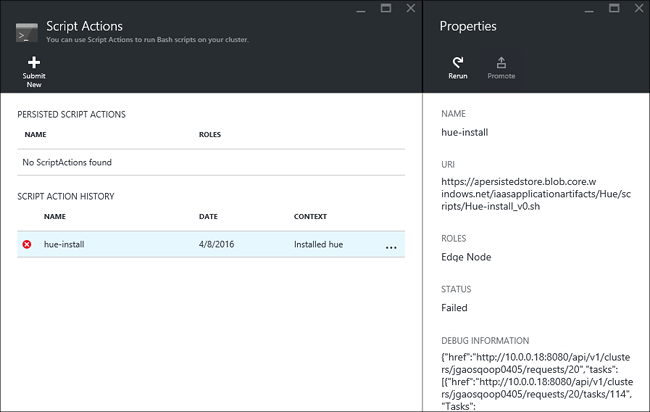

<properties
    pageTitle="Instalar aplicativos do Hadoop em HDInsight | Microsoft Azure"
    description="Saiba como instalar os aplicativos de HDInsight em aplicativos de HDInsight."
    services="hdinsight"
    documentationCenter=""
    authors="mumian"
    manager="jhubbard"
    editor="cgronlun"
    tags="azure-portal"/>

<tags
    ms.service="hdinsight"
    ms.devlang="na"
    ms.topic="hero-article"
    ms.tgt_pltfrm="na"
    ms.workload="big-data"
    ms.date="09/14/2016"
    ms.author="jgao"/>

# Instalar aplicativos personalizados de HDInsight

Um aplicativo de HDInsight é um aplicativo que os usuários podem instalar em um cluster de HDInsight baseados em Linux.  Esses aplicativos podem ser desenvolvidos pela Microsoft, fornecedores de software independentes (ISV) ou por si mesmo. Neste artigo, você aprenderá a instalar um aplicativo de HDInsight que não foi publicado para o portal do Azure em HDInsight. O aplicativo que você irá instalar é [matiz](http://gethue.com/). 

Outros artigos relacionados:

- [HDInsight instalar aplicativos](hdinsight-apps-install-applications.md): Saiba como instalar um aplicativo de HDInsight para seus clusters.
- [HDInsight publicar aplicativos](hdinsight-apps-publish-applications.md): aprender a publicar HDInsight aplicativos personalizados ao Azure Marketplace.
- [MSDN: instalar um aplicativo de HDInsight](https://msdn.microsoft.com/library/mt706515.aspx): Aprenda a definir HDInsight aplicativos.

 
## Pré-requisitos

Se você quiser instalar aplicativos de HDInsight em um cluster de HDInsight existente, você deve ter um cluster de HDInsight. Para criar uma, consulte [criar clusters](hdinsight-hadoop-linux-tutorial-get-started.md#create-cluster). Você também pode instalar aplicativos de HDInsight quando você cria um cluster de HDInsight.

## Instalar aplicativos de HDInsight

HDInsight aplicativos podem ser instalados quando você cria um cluster ou a um cluster de HDInsight existente. Para definir o Gerenciador de recursos do Azure modelos, consulte [MSDN: instalar um aplicativo de HDInsight](https://msdn.microsoft.com/library/mt706515.aspx).

Os arquivos necessários para implantar esse aplicativo (matiz):

- [azuredeploy.JSON](https://github.com/hdinsight/Iaas-Applications/blob/master/Hue/azuredeploy.json): modelo do Gerenciador de recursos para instalar o aplicativo de HDInsight. Consulte [MSDN: instalar um aplicativo de HDInsight](https://msdn.microsoft.com/library/mt706515.aspx) para desenvolver seu próprio modelo de Gerenciador de recursos.
- [matiz-install_v0.sh](https://github.com/hdinsight/Iaas-Applications/blob/master/Hue/scripts/Hue-install_v0.sh): ação o Script sendo chamada pelo modelo de Gerenciador de recursos para configurar o nó de borda. 
- [matiz-binaries.tgz](https://hdiconfigactions.blob.core.windows.net/linuxhueconfigactionv01/hue-binaries-14-04.tgz): O arquivo binário matiz sendo chamado de hui-install_v0.sh. 
- [matiz-binários-14-04.tgz](https://hdiconfigactions.blob.core.windows.net/linuxhueconfigactionv01/hue-binaries-14-04.tgz): O arquivo binário matiz sendo chamado de hui-install_v0.sh. 
- [webwasb-tomcat.tar.gz](https://hdiconfigactions.blob.core.windows.net/linuxhueconfigactionv01/webwasb-tomcat.tar.gz): um aplicativo da web de amostra (Tomcat) sendo chamado de hui-install_v0.sh.

**Para instalar o matiz a um cluster de HDInsight existente**

1. Clique na imagem a seguir para entrar Azure e abra o modelo do Gerenciador de recursos no Portal do Azure. 

    

    Esse botão abre um modelo do Gerenciador de recursos no portal do Azure.  O modelo do Gerenciador de recursos está localizado em [https://github.com/hdinsight/Iaas-Applications/tree/master/Hue](https://github.com/hdinsight/Iaas-Applications/tree/master/Hue).  Para saber como escrever este modelo de Gerenciador de recursos, consulte [MSDN: instalar um aplicativo de HDInsight](https://msdn.microsoft.com/library/mt706515.aspx).
    
2. Da lâmina **parâmetros** , insira o seguinte:

    - **ClusterName**: insira o nome do cluster onde você deseja instalar o aplicativo. Este cluster deve ser um cluster existente.
    
3. Clique em **Okey** para salvar os parâmetros.
4. Da lâmina **implantação personalizada** , insira o **grupo de recursos**.  O grupo de recursos é um contêiner que agrupa cluster, a conta de armazenamento dependentes e outros recursos. Ele é necessário para usar o mesmo grupo de recursos do cluster.
5. Clique em **termos legais**e, em seguida, clique em **criar**.
6. Verifique se a caixa de seleção **Fixar no painel de controle** está selecionado e clique em **criar**. Você pode ver o status da instalação do bloco fixos para o painel de portal e a notificação de portal (clique no ícone de sino na parte superior do portal).  Leva cerca de 10 minutos para instalar o aplicativo.

**Para instalar o matiz ao criar um cluster**

1. Clique na imagem a seguir para entrar Azure e abra o modelo do Gerenciador de recursos no Portal do Azure. 

    

    Esse botão abre um modelo do Gerenciador de recursos no portal do Azure.  O modelo do Gerenciador de recursos está localizado em [https://hditutorialdata.blob.core.windows.net/hdinsightapps/create-linux-based-hadoop-cluster-in-hdinsight.json](https://hditutorialdata.blob.core.windows.net/hdinsightapps/create-linux-based-hadoop-cluster-in-hdinsight.json).  Para saber como escrever este modelo de Gerenciador de recursos, consulte [MSDN: instalar um aplicativo de HDInsight](https://msdn.microsoft.com/library/mt706515.aspx).

2. Siga as instruções para criar o cluster e instalar o matiz. Para obter mais informações sobre como criar clusters de HDInsight, consulte [clusters baseados em Linux criar Hadoop no HDInsight](hdinsight-hadoop-provision-linux-clusters.md).

Além de portal do Azure, você também pode usar [PowerShell do Azure](hdinsight-hadoop-create-linux-clusters-arm-templates.md#deploy-with-powershell) e [CLI do Azure](hdinsight-hadoop-create-linux-clusters-arm-templates.md#deploy-with-azure-cli) para chamar o recurso Gerenciador de modelos.

## Validar a instalação

Você pode verificar o status do aplicativo no portal do Azure para validar a instalação do aplicativo. Além disso, você também pode validar todos provém de pontos de extremidade HTTP para cima conforme o esperado e a página da Web se houver:

**Para abrir o portal de matiz**

1. Entrar no [portal do Azure](https://portal.azure.com).
2. Clique em **Clusters de HDInsight** no menu à esquerda.  Se você não estiver visível, clique em **Procurar**e, em seguida, clique em **Clusters de HDInsight**.
3. Clique no cluster onde você instalou o aplicativo.
4. Da lâmina **configurações** , clique em **aplicativos** em categoria **Geral** . Você deverá ver **matiz** listados na lâmina **Aplicativos instalados** .
5. Clique em **matiz** na lista para as propriedades de lista.  
6. Clique no link de página da Web para validar o site; Abra o ponto de extremidade HTTP em um navegador para validar web matiz UI, abra o ponto de extremidade SSH usando [Acabamento](hdinsight-hadoop-linux-use-ssh-windows.md) ou outros [clientes SSH](hdinsight-hadoop-linux-use-ssh-unix.md).
 
## Solucionar problemas de instalação

Você pode verificar o status de instalação do aplicativo a notificação de portal (clique no ícone de sino na parte superior do portal). 

Se uma falha na instalação de um aplicativo, você pode ver as mensagens de erro e informações de 3 casas de depuração:

- Aplicativos de HDInsight: informações de erro geral.

    Abrir o cluster a partir do portal e clique em aplicativos da lâmina configurações:

    

- Ação de script HDInsight: se a mensagem de erro dos aplicativos HDInsight indica uma falha de ação de script, mais detalhes sobre a falha de script serão apresentadas no painel de ações de script.

    Clique em ação de Script da lâmina configurações. Histórico de ação de script mostra as mensagens de erro

    
    
- Ambari UI da Web: Se o script de instalação foi a causa da falha, use Ambari Web UI para verificar logs completos sobre os scripts de instalação.

    Para obter mais informações, consulte [solução de problemas](hdinsight-hadoop-customize-cluster-linux.md#troubleshooting).

## Remover aplicativos de HDInsight

Há várias maneiras de excluir aplicativos de HDInsight.

### Usar o portal

**Para remover um aplicativo usando o portal**

1. Entrar no [portal do Azure](https://portal.azure.com).
2. Clique em **Clusters de HDInsight** no menu à esquerda.  Se você não estiver visível, clique em **Procurar**e, em seguida, clique em **Clusters de HDInsight**.
3. Clique no cluster onde você instalou o aplicativo.
4. Da lâmina **configurações** , clique em **aplicativos** em categoria **Geral** . Você deverá ver uma lista de aplicativos instalados. Para este tutorial, **matiz** listados na lâmina **Aplicativos instalados** .
5. Clique no aplicativo que você deseja remover e clique em **Excluir**.
6. Clique em **Sim** para confirmar.

No portal do, você também pode excluir o cluster ou excluir o grupo de recursos que contém o aplicativo.

### Usar o PowerShell Azure

Usando o PowerShell do Azure, você pode excluir o cluster ou excluir o grupo de recursos. Consulte [Excluir clusters usando o PowerShell do Azure](hdinsight-administer-use-powershell.md#delete-clusters).

### Usar a CLI do Azure

Usando o Azure CLI, você pode excluir o cluster ou excluir o grupo de recursos. Consulte [Excluir clusters usando CLI do Azure](hdinsight-administer-use-command-line.md#delete-clusters).

## Próximas etapas

- [MSDN: instalar um aplicativo de HDInsight](https://msdn.microsoft.com/library/mt706515.aspx): Aprenda a desenvolver modelos do Gerenciador de recursos para implantar aplicativos de HDInsight.
- [HDInsight instalar aplicativos](hdinsight-apps-install-applications.md): Saiba como instalar um aplicativo de HDInsight para seus clusters.
- [HDInsight publicar aplicativos](hdinsight-apps-publish-applications.md): aprender a publicar HDInsight aplicativos personalizados ao Azure Marketplace.
- [Clusters baseados em Personalizar Linux HDInsight usando a ação de Script](hdinsight-hadoop-customize-cluster-linux.md): Saiba como usar a ação de Script para instalar aplicativos adicionais.
- [Hadoop baseados em Linux criar clusters em HDInsight usando o recurso Gerenciador de modelos](hdinsight-hadoop-create-linux-clusters-arm-templates.md): Saiba como chamar modelos do Gerenciador de recursos para criar clusters de HDInsight.
- [Usar nós de borda vazio no HDInsight](hdinsight-apps-use-edge-node.md): Saiba como usar um nó de borda vazia para acessar HDInsight cluster, testando aplicativos de HDInsight e HDInsight aplicativos de hospedagem.
