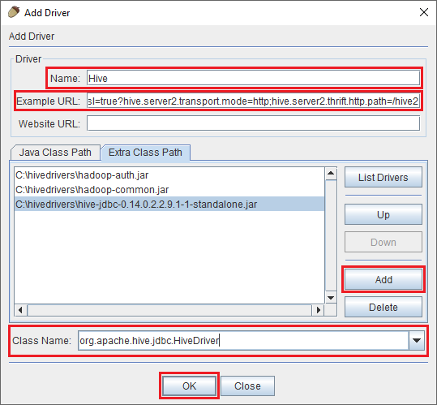
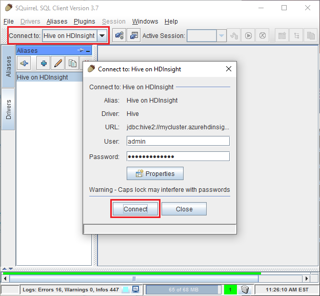
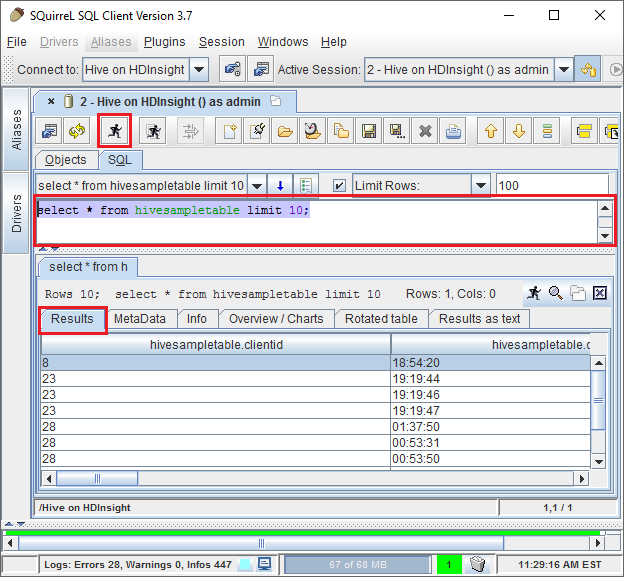

<properties
 pageTitle="Usar JDBC a consulta seção no Azure HDInsight"
 description="Saiba como usar JDBC para conectar-se a seção em Azurehdinsight e remotamente executar consultas de dados armazenados na nuvem."
 services="hdinsight"
 documentationCenter=""
 authors="Blackmist"
 manager="jhubbard"
 editor="cgronlun"
    tags="azure-portal"/>

<tags
 ms.service="hdinsight"
 ms.devlang="java"
 ms.topic="article"
 ms.tgt_pltfrm="na"
 ms.workload="big-data"
 ms.date="08/23/2016"
 ms.author="larryfr"/>

#Conectar-se a seção em Azurehdinsight usando o driver JDBC seção

[AZURE.INCLUDE [ODBC-JDBC-selector](../../includes/hdinsight-selector-odbc-jdbc.md)]

Neste documento, você aprenderá como usar JDBC de um aplicativo Java para remotamente enviar consultas de ramificação a um cluster de HDInsight. Você aprenderá como conectar-se do cliente esquilo SQL e como se conectar por programação do Java.

Para obter mais informações sobre a Interface de JDBC seção, consulte [HiveJDBCInterface](https://cwiki.apache.org/confluence/display/Hive/HiveJDBCInterface).

##Pré-requisitos

Para concluir as etapas neste artigo, você precisará do seguinte:

* Um Hadoop em cluster HDInsight. Baseado em Linux ou Windows clusters funcionará.

* [Esquilo SQL](http://squirrel-sql.sourceforge.net/). Esquilo é um aplicativo de cliente JDBC.

Para criar e executar o aplicativo de Java de exemplo vinculado deste artigo, você precisará do seguinte.

* O [Java Developer Kit (JDK) versão 7](https://www.oracle.com/technetwork/java/javase/downloads/jdk7-downloads-1880260.html) ou superior.

* [Apache Maven](https://maven.apache.org). Maven é sistema para projetos Java que é usado pelo project associada a este artigo de compilação de um projeto.

##Cadeia de Conexão

Conexões JDBC a um cluster de HDInsight no Azure feitas mais 443 e o tráfego é protegido usando SSL. O gateway público que os clusters ficam atrás redireciona o tráfego para a porta que HiveServer2 é realmente listening em. Portanto, uma cadeia de conexão típica gostaria o seguinte:

    jdbc:hive2://CLUSTERNAME.azurehdinsight.net:443/default;ssl=true?hive.server2.transport.mode=http;hive.server2.thrift.http.path=/hive2

Substitua o nome do seu cluster HDInsight __CLUSTERNAME__ .

##Autenticação

Ao estabelecer a conexão, você deve usar o nome do administrador de cluster HDInsight e a senha para autenticar para o gateway de cluster. Quando a conexão de clientes JDBC como esquilo SQL, você deve digitar o nome do administrador e senha nas configurações do cliente.

De um aplicativo Java, você deve usar o nome e senha ao estabelecer uma conexão. Por exemplo, o seguinte código Java abre uma nova conexão usando a cadeia de conexão, o nome de administrador e a senha:

    DriverManager.getConnection(connectionString,clusterAdmin,clusterPassword);

##Conectar-se com esquilo SQL client

Esquilo SQL é um cliente JDBC que pode ser usado para executar consultas de seção remotamente com seu cluster HDInsight. As etapas a seguir presumem que você já tiver instalado o SQL esquilo e orientará na baixando e configurando os drivers para a seção.

1. Copie os drivers JDBC seção do seu cluster HDInsight.

    * Para __HDInsight baseado no Linux__, use as etapas a seguir para baixar os arquivos jar necessários.

        1. Crie uma nova pasta que conterá os arquivos. Por exemplo, `mkdir hivedriver`.

        2. Um prompt de comando, Bash, PowerShell ou outro prompt de linha de comando, altere diretórios para o novo diretório e use os seguintes comandos para copiar os arquivos do cluster HDInsight.

                scp USERNAME@CLUSTERNAME:/usr/hdp/current/hive-client/lib/hive-jdbc*standalone.jar .
                scp USERNAME@CLUSTERNAME:/usr/hdp/current/hadoop-client/hadoop-common.jar .
                scp USERNAME@CLUSTERNAME:/usr/hdp/current/hadoop-client/hadoop-auth.jar .

            Substitua o __nome de usuário__ com o nome de conta de usuário do SSH para o cluster. Substitua o nome do cluster HDInsight __CLUSTERNAME__ .

            > [AZURE.NOTE] Em ambientes Windows, você precisará usar o utilitário PSCP em vez de scp. É possível baixá-lo do [http://www.chiark.greenend.org.uk/~sgtatham/putty/download.html](http://www.chiark.greenend.org.uk/~sgtatham/putty/download.html).

    * Para __HDInsight baseados no Windows__, use as etapas a seguir para baixar os arquivos jar.

        1. Azure no portal do, selecione o seu cluster HDInsight e selecione o ícone de __Área de trabalho remota__ .

            

        2. Na lâmina área de trabalho remota, use o botão __Conectar__ para conectar-se ao cluster. Se a área de trabalho remota não estiver habilitada, use o formulário para fornecer um nome de usuário e senha, selecione __Ativar__ para habilitar a área de trabalho remota para cluster.

            

            Depois de selecionar __Conectar__, um arquivo. RDP será baixado. Use este arquivo para iniciar o cliente de área de trabalho remota. Quando solicitado, use o nome de usuário e senha que você inseriu para acesso de área de trabalho remota.

        3. Uma vez conectado, copie os seguintes arquivos da sessão de área de trabalho remota para sua máquina local. Colocá-los em um diretório local chamado `hivedriver`.

            * C:\apps\dist\hive-0.14.0.2.2.9.1-7\lib\hive-JDBC-0.14.0.2.2.9.1-7-Standalone.jar
            * C:\apps\dist\hadoop-2.6.0.2.2.9.1-7\share\hadoop\common\hadoop-Common-2.6.0.2.2.9.1-7.jar
            * C:\apps\dist\hadoop-2.6.0.2.2.9.1-7\share\hadoop\common\lib\hadoop-AUTH-2.6.0.2.2.9.1-7.jar

            > [AZURE.NOTE] Os números de versão incluídos na caminhos e nomes de arquivo podem ser diferentes para o seu cluster.

        4. Desconecte a sessão de área de trabalho remota depois que terminar de copiar os arquivos.

3. Inicie o aplicativo esquilo SQL. Do lado esquerdo da janela, selecione __Drivers__.

    

4. Os ícones na parte superior da caixa de diálogo __Drivers__ , selecione o __+__ ícone para criar um novo driver.

    

5. Na caixa de diálogo Adicionar Driver, adicione as informações a seguir.

    * __Nome__: seção
    * __Exemplo de URL__: jdbc:hive2://localhost:443/default;ssl=true?hive.server2.transport.mode=http;hive.server2.thrift.http.path=/hive2
    * __Caminho de classe extra__: usar o botão Adicionar para adicionar os arquivos jar baixou anteriormente
    * __Nome da classe__: org.apache.hive.jdbc.HiveDriver

    

    Clique em __Okey__ para salvar essas configurações.

6. À esquerda da janela esquilo SQL, selecione __Aliases__. Clique na __+__ ícone para criar um novo alias de conexão.

    

7. Use os seguintes valores para a caixa de diálogo __Adicionar Alias__ .

    * __Nome__: seção em HDInsight
    * __Driver__: Use o menu suspenso para selecionar o driver de __seção__
    * __URL__: jdbc:hive2://CLUSTERNAME.azurehdinsight.net:443/default;ssl=true?hive.server2.transport.mode=http;hive.server2.thrift.http.path=/hive2

        Substitua o nome do seu cluster HDInsight __CLUSTERNAME__ .

    * __Nome de usuário__: O nome de conta de login de cluster para o seu cluster HDInsight. O padrão é `admin`.
    * __Senha__: A senha da conta de logon do cluster. Esta é uma senha que você forneceu ao criar o cluster HDInsight.

    

    Use o botão de __teste__ para verificar se a conexão funciona. Quando __conectar-se a: seção em HDInsight__ caixa de diálogo for exibida, selecione __conectar-se__ para executar o teste. Se o teste for bem-sucedido, você verá uma caixa de diálogo de __Conexão bem-sucedido__ .

    Use o botão __Okey__ na parte inferior da caixa de diálogo __Adicionar Alias__ para salvar o alias de conexão.

8. No menu suspenso de __conectar a__ na parte superior da esquilo SQL, selecione a __seção em HDInsight__. Quando solicitado, selecione __Conectar__.

    

9. Uma vez conectado, insira a seguinte consulta na caixa de diálogo de consulta SQL e, em seguida, selecione o ícone de __Executar__ . A área de resultados deve mostrar os resultados da consulta.

        select * from hivesampletable limit 10;

    

##Conectar-se de um exemplo de aplicação Java

Um exemplo de usando um cliente de Java a consulta seção em HDInsight está disponível em [https://github.com/Azure-Samples/hdinsight-java-hive-jdbc](https://github.com/Azure-Samples/hdinsight-java-hive-jdbc). Siga as instruções no repositório para criar e executar a amostra.

##Solução de problemas

### Erro inesperado ao tentar abrir uma conexão de SQL.

__Sintomas__: ao conectar a um cluster HDInsight versão 3.3 ou 3.4, você poderá receber um erro que ocorreu um erro inesperado. O rastreamento de pilha para esse erro começará com as seguintes linhas:

    java.util.concurrent.ExecutionException: java.lang.RuntimeException: java.lang.NoSuchMethodError: org.apache.commons.codec.binary.Base64.<init>(I)V
    at java.util.concurrent.FutureTas...(FutureTask.java:122)
    at java.util.concurrent.FutureTask.get(FutureTask.java:206)

__Causa__: esse erro é causado por uma incompatibilidade na versão do arquivo commons codec.jar usado pelo esquilo e o necessários pelos componentes de seção JDBC baixados do cluster HDInsight.

__Resolução__: para corrigir esse erro, use as etapas a seguir.

1. Baixe o arquivo de jar commons-codec do seu cluster HDInsight.

        scp USERNAME@CLUSTERNAME:/usr/hdp/current/hive-client/lib/commons-codec*.jar ./commons-codec.jar

2. Sair esquilo e vá para a pasta onde esquilo está instalado no seu sistema. No diretório esquilo, sob o `lib` diretório, substituir o commons-codec.jar existente com aquele baixados do cluster HDInsight.

3. Reinicie esquilo. O erro não deve ocorrer ao se conectar a seção em HDInsight.

##Próximas etapas

Agora que você aprendeu como usar JDBC para trabalhar com a seção, use os links a seguir para explorar outras maneiras de trabalhar com o Azure HDInsight.

* [Carregar dados ao HDInsight](hdinsight-upload-data.md)
* [Use a seção com HDInsight](hdinsight-use-hive.md)
* [Usar porco com HDInsight](hdinsight-use-pig.md)
* [Usar MapReduce trabalhos com HDInsight](hdinsight-use-mapreduce.md)
