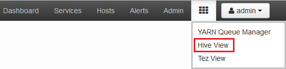
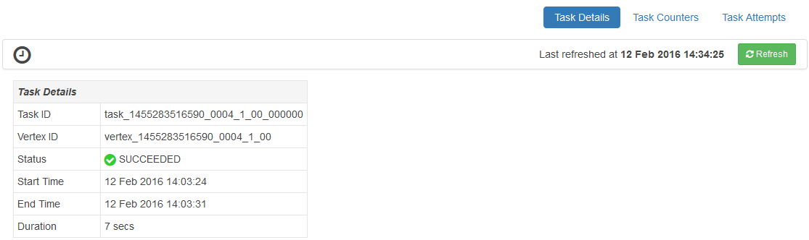

<properties
pageTitle="Usar o modo de exibição de Tez Ambari com HDInsight | Azure"
description="Saiba como usar o modo de exibição de Ambari Tez para depurar Tez trabalhos em HDInsight."
services="hdinsight"
documentationCenter=""
authors="Blackmist"
manager="jhubbard"
editor="cgronlun"/>

<tags
ms.service="hdinsight"
ms.devlang="na"
ms.topic="article"
ms.tgt_pltfrm="na"
ms.workload="big-data"
ms.date="10/04/2016"
ms.author="larryfr"/>

# Usar modos de exibição de Ambari depurar Tez trabalhos em HDInsight

Interface do usuário do Ambari Web para HDInsight contém um modo de exibição de Tez que pode ser usado para compreender e depurar trabalhos que usam Tez como o mecanismo de execução. O modo de exibição Tez permite que você visualize o trabalho como um gráfico de itens conectadas, analise cada item e recuperar estatísticas e informações de log.

> [AZURE.NOTE] As informações neste documento são específicas para clusters HDInsight baseados em Linux. Para obter informações sobre depuração de trabalhos de Tez usando HDInsight baseados no Windows, consulte [usar a interface do usuário Tez para depurar Tez trabalhos em HDInsight baseado no Windows](hdinsight-debug-tez-ui.md).

## Pré-requisitos

* Um cluster de HDInsight baseados em Linux. Para obter etapas sobre como criar um novo cluster, consulte [Introdução ao uso HDInsight baseados em Linux](hdinsight-hadoop-linux-tutorial-get-started.md).

* Um navegador da web moderna que ofereça suporte a HTML5.

## Noções básicas sobre Tez

Tez é uma estrutura extensível para processamento de dados no Hadoop que fornece velocidades maiores que processamento de MapReduce tradicional. Para clusters baseados em Linux HDInsight, é o mecanismo padrão para a seção.

Quando o trabalho é enviado para Tez, ele cria um direcionado acíclica Graph (Dag mão) que descreva a ordem de execução das ações necessárias pelo trabalho. Ações individuais são chamadas de vértices e execute uma parte do trabalho geral. A execução real do trabalho descrito por um vértice é chamada de uma tarefa e pode ser distribuída em vários nós no cluster.

### Noções básicas sobre o modo de exibição de Tez

O modo de exibição de Tez fornece informações sobre processos estiver executando, ou que possuem executou anteriormente usando Tez. Ele permite que você exiba o Dag de mão gerado pelo Tez, como ele é distribuído em clusters, contadores como memória usada por tarefas e vértices e informações de erro. Ele pode oferecer informações úteis nas seguintes situações:

* Monitoramento demorada processa, exibindo o andamento do mapa e reduzir as tarefas.

* Analisar dados históricos para processos com êxito ou falhas saber como processamento poderia ser melhorado ou por que não conseguiram.

## Gerar um Dag de mão

O modo de exibição de Tez conterá dados somente se um trabalho que usa o mecanismo de Tez está sendo executado ou foi executada no passado. Consultas de seção simples geralmente podem ser resolvidas sem usar Tez, porém mais complexas consultas que fazer a filtragem, agrupamento, ordenação, junções, etc. normalmente exigirão Tez.

Use as etapas a seguir para executar uma consulta de seção que será executada usando Tez.

1. Em um navegador da web, navegue até https://CLUSTERNAME.azurehdinsight.net, onde __CLUSTERNAME__ é o nome do seu cluster HDInsight.

2. No menu na parte superior da página, selecione o ícone de __modos de exibição__ . Isso se parece com uma série de quadrados. No menu suspenso que aparece, selecione a __seção modo de exibição__. 

    

3. Quando a seção exibir cargas, cole o seguinte no Editor de consulta e clique em __Executar__.

        select market, state, country from hivesampletable where deviceplatform='Android' group by market, country, state;
    
    Após concluir o trabalho, você verá a saída exibida na seção __Resultados do processo de consulta__ . Os resultados devem ser semelhantes à seguinte
    
        market  state       country
        en-GB   Hessen      Germany
        en-GB   Kingston    Jamaica
        
4. Selecione a guia __Log__ . Você verá informações similares ao seguinte:
    
        INFO : Session is already open
        INFO :

        INFO : Status: Running (Executing on YARN cluster with App id application_1454546500517_0063)

    Salve o valor de __id do aplicativo__ , pois isso será usado na próxima seção.

## Usar o modo de exibição de Tez

1. No menu na parte superior da página, selecione o ícone de __modos de exibição__ . Na lista suspensa que aparece, selecione o __modo de exibição de Tez__.

    

2. Quando o modo de exibição de Tez carrega, você verá uma lista de DAGs que estão sendo executadas ou ter sido executado no cluster. O modo de exibição padrão inclui o Dag Name, identificação, remetente, Status, hora de início, hora de término, duração, ID de aplicativo e fila. Mais colunas podem ser adicionadas usando o ícone de engrenagem na parte direita da página.

    

3. Se você tiver apenas uma entrada, será para a consulta que você executou na seção anterior. Se você tiver várias entradas, você pode pesquisar inserindo a ID do aplicativo no campo __ID de aplicativo__ e pressione enter.

4. Selecione o __Nome de Dag mão__. Isto irá exibir informações sobre a Dag de mão, bem como a opção para baixar um zip de arquivos JSON que contêm informações sobre o Dag de mão.

    

5. Acima os __Detalhes de Dag mão__ são vários links que podem ser usados para exibir informações sobre a Dag de mão.

    * __Dag mão contadores__ exibe informações de contadores para este Dag de mão.
    
    * __Exibição gráfica__ mostra uma representação gráfica deste Dag de mão.
    
    * __Todos os vértices__ exibe uma lista dos vértices neste Dag de mão.
    
    * __Todas as tarefas__ exibe uma lista das tarefas para todos os vértices neste Dag de mão.
    
    * __Todos os TaskAttempts__ exibe informações sobre o tenta executar tarefas para este Dag de mão.
    
    > [AZURE.NOTE] Se você rolar a exibição da coluna para vértices, tarefas e TaskAttempts, observe que há links para exibir __contadores__ e __Exibir ou fazer o download de logs__ para cada linha.

    Se houver uma falha com o trabalho, os detalhes de Dag mão exibirá um status de falha, juntamente com links para informações sobre a tarefa falhou. Informações de diagnóstico serão exibidas abaixo os detalhes de Dag mão.
    
    

7. Selecione o __modo de exibição de gráfico__. Isso exibe uma representação gráfica da Dag a mão. Você pode colocar o mouse sobre cada vértice no modo de exibição para exibir informações sobre ele.

    

8. Clicar em um vértice carregará os __Detalhes de vértice__ para esse item. Clique no vértice a __1 de mapa__ para exibir detalhes para este item.

    

9. Observe que, agora, você tem links na parte superior da página que estão relacionadas a vértices e tarefas.

    > [AZURE.NOTE] Você também pode chegar a esta página voltar a __Detalhes Dag mão__, selecionando __Vértice detalhes__e selecionando o vértice __1 do mapa__ .

    * __Vértice contadores__ exibe as informações de contador para este vértice.
    
    * __Tarefas__ exibe tarefas para este vértice.
    
    * __Tarefa tentar__ exibe informações sobre tentativas de executar tarefas para este vértice.
    
    * __Fontes e receptores__ exibe fontes de dados e recpetores este vértice.

    > [AZURE.NOTE] Como com o menu anterior, você pode rolar a exibição de coluna para tarefas, tentativas de tarefa e fontes & Sinks__ exibir links para obter mais informações para cada item.

10. Selecione __tarefas__e, em seguida, selecione o item chamado __00_000000__. Isto irá exibir __Detalhes da tarefa__ para esta tarefa. Nessa tela, você pode exibir __Contadores de tarefa__ e __Tentativas de tarefa__.

    

## Próximas etapas

Agora que você aprendeu como usar o modo de exibição de Tez, saiba mais sobre [Usando seção em HDInsight](hdinsight-use-hive.md).

Para obter informações técnicas mais detalhadas sobre Tez, consulte a [página de Tez em Hortonworks](http://hortonworks.com/hadoop/tez/).

Para obter mais informações sobre como usar Ambari com HDInsight, consulte [clusters de gerenciar HDInsight usando a interface do usuário do Ambari da Web](hdinsight-hadoop-manage-ambari.md)
