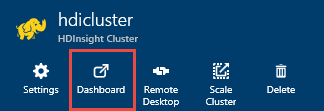

<properties
    pageTitle="Depurar Hadoop no HDInsight: logs de exibir e interpretar mensagens de erro | Microsoft Azure"
    description="Saiba mais sobre as mensagens de erro que você pode receber ao administrar HDInsight usando o PowerShell e etapas que você pode tomar para recuperar."
    services="hdinsight"
    tags="azure-portal"
    editor="cgronlun"
    manager="jhubbard"
    authors="mumian"
    documentationCenter=""/>

<tags
    ms.service="hdinsight"
    ms.workload="big-data"
    ms.tgt_pltfrm="na"
    ms.devlang="na"
    ms.topic="article"
    ms.date="09/02/2016"
    ms.author="jgao"/>

# Analisar logs de HDInsight

Cada cluster Hadoop em Azurehdinsight possui uma conta de armazenamento do Azure usada como o sistema de arquivo padrão. A conta de armazenamento é conhecida como a conta de armazenamento padrão. Cluster usa o armazenamento de tabela do Azure e o armazenamento de Blob da conta de armazenamento padrão para armazenar seus logs.  Para descobrir a conta de armazenamento padrão para o seu cluster, consulte [Gerenciar Hadoop clusters no HDInsight](hdinsight-administer-use-management-portal.md#find-the-default-storage-account). Os logs retêm na conta de armazenamento, mesmo após o cluster é excluído.

##Logs de escrita às tabelas do Azure

Os logs escritos às tabelas do Azure fornecem um nível de percepção o que está acontecendo com um cluster de HDInsight.

Quando você cria um cluster de HDInsight, 6 tabelas são criadas automaticamente para clusters baseados em Linux no armazenamento de tabela padrão:

- hdinsightagentlog
- syslog
- daemonlog
- hadoopservicelog
- ambariserverlog
- ambariagentlog

3 tabelas são criadas para clusters baseados no Windows:

- Setuplog: Log de eventos/exceções encontrados em provisionamento/Configurando de HDInsight clusters.
- hadoopinstalllog: Log de eventos/exceções encontrados durante a instalação do Hadoop no cluster. Essa tabela pode ser útil na depuração de problemas relacionados a clusters criados com parâmetros personalizados.
- hadoopservicelog: Log de eventos/exceções gravado por todos os serviços do Hadoop. Essa tabela pode ser útil na depuração de problemas relacionados a falhas de trabalho em clusters de HDInsight.

Os nomes de arquivo de tabela são **u<ClusterName>DDMonYYYYatHHMMSSsss<TableName>**.

Estas tabelas contém os seguintes campos:

- ClusterDnsName
- NomeComponente
- EventTimestamp
- Host
- MALoggingHash
- Mensagem
- N
- PreciseTimeStamp
- Função
- RowIndex
- Locatário
- CARIMBO DE HORA
- TraceLevel

### Ferramentas para acessar os logs

Há muitas ferramentas disponíveis para acessar dados nessas tabelas:

-  O Visual Studio
-  Explorador de armazenamento do Azure
-  Power Query para Excel

#### Usar o Power Query para Excel

Power Query pode ser instalado do [www.microsoft.com/en-us/download/details.aspx?id=39379]( http://www.microsoft.com/en-us/download/details.aspx?id=39379). Consulte a página de download para os requisitos do sistema

**Usar o Power Query para abrir e analisar o log de serviço**

1. Abra o **Microsoft Excel**.
2. No menu **Power Query** , clique em **Do Azure**e clique em **armazenamento de tabela do Microsoft Azure**.
 
    
3. Insira o nome da conta de armazenamento. Isso pode ser o nome curto ou o FQDN.
4. Insira a chave de conta de armazenamento. Você deverá ver uma lista de tabelas:

    
5. A tabela hadoopservicelog no painel **navegador** de atalho e selecione **Editar**. Você deverá ver 4 colunas. Opcionalmente, exclua as colunas de **Chave de partição**, **Chave de linha**e **carimbo de hora** selecionando-os e clicando em **Remover colunas** entre as opções na faixa de opções.
6. Clique no ícone de expansão na coluna conteúdo para escolher as colunas que você deseja importar para a planilha do Excel. Para esta demonstração, eu escolhi TraceLevel e NomeComponente: ele pode dar me algumas informações básicas na qual componentes tinham problemas.

    
7. Clique em **Okey** para importar os dados.
8. Selecione as colunas **TraceLevel**, função e **NomeComponente** e clique em **Agrupar por** controle na faixa de opções.
9. Clique em **Okey** na caixa de diálogo Agrupar por
10. Clique em** Aplicar e fechar**.
 
Agora você pode usar o Excel para filtrar e classificar conforme necessário. Obviamente, você talvez queira incluir outras colunas (por exemplo, mensagem) para fazer busca detalhada em problemas quando eles ocorrem, mas selecionando e agrupando colunas descritas acima oferecem um panorama razoável do que está acontecendo com os serviços do Hadoop. A ideia mesma pode ser aplicada às tabelas setuplog e hadoopinstalllog.

#### Use o Visual Studio

**Usar o Visual Studio**

1. Abra o Visual Studio.
2. No menu **Exibir** , clique em **Gerenciador de nuvem**. Ou simplesmente clique **CTRL +\, CTRL + X**.
3. No **Explorador de nuvem**, selecione **Tipos de recursos**.  A outra opção disponível é **Grupos de recursos**.
4. Expanda **Contas de armazenamento**, a conta de armazenamento padrão para o seu cluster e **tabelas**.
5. Clique duas vezes em **hadoopservicelog**.
6. Adicione um filtro. Por exemplo:
    
        TraceLevel eq 'ERROR'

    

    Para obter mais informações sobre a construção de filtros, consulte [Construir cadeias de caracteres de filtro para o Designer de tabela](../vs-azure-tools-table-designer-construct-filter-strings.md).
 
##Logs de escrita ao Azure Blob Storage

[Os logs escritos às tabelas do Azure](#log-written-to-azure-tables) fornecem um nível de percepção o que está acontecendo com um cluster de HDInsight. No entanto, essas tabelas não fornecem logs de nível da tarefa, que podem ser útil para análise posterior problemas quando ocorrem. Para fornecer esse próximo nível de detalhe, HDInsight clusters são configurados para gravar logs de tarefa à sua conta de armazenamento de Blob para qualquer trabalho que foi enviado por meio de Templeton. Praticamente, isso significa trabalhos enviados usando os cmdlets do PowerShell do Microsoft Azure ou as APIs de envio de trabalho do .NET, não os trabalhos enviados por meio de RDP/linha de comando acesso ao cluster. 

Para exibir os logs, consulte [fio COLORIDO acesso aplicativo fizer logon HDInsight baseados em Linux](hdinsight-hadoop-access-yarn-app-logs-linux.md).

Para obter mais informações sobre logs de aplicativo, consulte [gerenciamento de logs de usuário de simplificando e acesso no fio COLORIDO](http://hortonworks.com/blog/simplifying-user-logs-management-and-access-in-yarn/).
 
 
## Exibir logs de trabalho e de integridade do cluster

###Interface de usuário do Access Hadoop

Azure no Portal do, clique em um nome de cluster HDInsight para abrir a lâmina de cluster. Da lâmina cluster, clique em **Painel de controle**.

Quando solicitado, digite as credenciais de administrador de cluster. No Console de consulta que é aberta, clique em **Hadoop interface do usuário**.

###Acesso o interface do usuário fio colorido

Azure no Portal do, clique em um nome de cluster HDInsight para abrir a lâmina de cluster. Da lâmina cluster, clique em **Painel de controle**. Quando solicitado, digite as credenciais de administrador de cluster. No Console de consulta que é aberta, clique em **Fio COLORIDO da interface do usuário**.

Você pode usar a interface do usuário fio COLORIDO para fazer o seguinte:

* **Obter o status de cluster**. No painel esquerdo, expanda **Cluster**e clique em **sobre**. Detalhes de status como total alocado memória, cores usadas, estado do Gerenciador de recursos do cluster de cluster neste presente, cluster versão etc.

    

* **Obter o status do nó**. No painel esquerdo, expanda **Cluster**e clique em **nós**. Lista todos os nós no cluster, endereço HTTP de cada nó, recursos alocados para cada nó, etc.

* **Monitorar o status de trabalho**. No painel esquerdo, expanda **Cluster**e clique em **aplicativos** para listar todos os trabalhos no cluster. Se você deseja examinar trabalhos em um estado específico (como execução de nova e enviada, etc.), clique no link apropriado em **aplicativos**. Você pode clicar ainda mais o nome do trabalho para saber mais sobre o trabalho tais incluindo a saída, logs, etc.

###Acessar a interface do usuário HBase

Azure no Portal do, clique em um nome de cluster HDInsight HBase para abrir a lâmina de cluster. Da lâmina cluster, clique em **Painel de controle**. Quando solicitado, digite as credenciais de administrador de cluster. No Console de consulta que é aberta, clique em **HBase interface do usuário**.

## Códigos de erro de HDInsight

As mensagens de erro detalhadas nesta seção são fornecidas para ajudar os usuários do Hadoop em Azurehdinsight a entender possíveis condições de erro que eles podem ocorrer quando administrar o serviço usando o PowerShell do Azure e para avisá-los sobre as etapas que podem ser realizadas para corrigir o erro.

Algumas dessas mensagens de erro também podem ser vistas no Portal do Azure quando ele é usado para gerenciar clusters de HDInsight. Outras mensagens de erro que podem ocorrer, mas há menos granular devido as restrições nas ações corretivas possíveis neste contexto. Outras mensagens de erro são fornecidas nos contextos onde a atenuação é óbvia. 

### AtleastOneSqlMetastoreMustBeProvided
- **Descrição**: Forneça detalhes de banco de dados do SQL Azure pelo menos um componente para poder usar configurações personalizadas de seção e Oozie metastores.
- **Atenuação**: O usuário precisa fornecer um metastore válida do SQL Azure e repita a solicitação.  

### AzureRegionNotSupported
- **Descrição**: não foi possível criar cluster na região *nameOfYourRegion*. Usar uma região HDInsight válida e tente novamente a solicitação.
- **Atenuação**: cliente deve criar a região de cluster que suporta atualmente-los: Sudeste Asiático, Europa Oeste, Norte da Europa, EUA Leste ou oeste EUA.  

### ClusterContainerRecordNotFound
- **Descrição**: O servidor não foi possível localizar o registro de cluster solicitado.  
- **Atenuação**: Repetir a operação.

### ClusterDnsNameInvalidReservedWord
- **Descrição**: Cluster DNS nome *yourDnsName* é inválido. Verifique se nome começa e termina com alfanumérico e podem conter somente '-' caractere especial  
- **Atenuação**: Certifique-se de que você usou um nome válido de DNS para o seu cluster que inicia e termina com alfanuméricos e não contém nenhuma especial caracteres que não seja o traço '-' e, em seguida, repita a operação.

### ClusterNameUnavailable
- **Descrição**: nome de Cluster *yourClusterName* não está disponível. Escolha outro nome.  
- **Atenuação**: O usuário deve especificar um clustername exclusiva e não exista e tente novamente. Se o usuário está usando o Portal, a interface do usuário notificará-las se um nome de cluster já está sendo usado durante as etapas de criar.

### ClusterPasswordInvalid
- **Descrição**: Cluster senha é inválida. Senha deve ter pelo menos 10 caracteres e deve conter pelo menos um número, letra maiuscula, letra minúscula e um caractere especial sem espaços e não deve conter o nome de usuário como parte dele.  
- **Atenuação**: fornecer uma senha de cluster válido e repita a operação.

### ClusterUserNameInvalid
- **Descrição**: nome de usuário de Cluster é inválido. Verifique se o nome de usuário não contém espaços ou caracteres especiais.  
- **Atenuação**: forneça um nome de usuário de cluster válido e repita a operação.

### ClusterUserNameInvalidReservedWord
- **Descrição**: Cluster DNS nome *yourDnsClusterName* é inválido. Verifique se nome começa e termina com alfanumérico e podem conter somente '-' caractere especial  
- **Atenuação**: forneça um nome de usuário de cluster DNS válido e repita a operação.

### ContainerNameMisMatchWithDnsName
- **Descrição**: nome de contêiner no URI *yourcontainerURI* e de nome DNS *yourDnsName* no corpo da solicitação devem ser o mesmo.  
- **Atenuação**: Certifique-se de que seu nome de contêiner e seu nome DNS são os mesmos e repita a operação.

### DataNodeDefinitionNotFound
- **Descrição**: configuração de cluster inválido. Não é possível encontrar as definições de nó de dados no tamanho nó.  
- **Atenuação**: Repetir a operação.

### DeploymentDeletionFailure
- **Descrição**: Falha na exclusão de implantação para Cluster  
- **Atenuação**: Repetir a operação de exclusão.

### DnsMappingNotFound
- **Descrição**: erro de configuração do serviço. Informações de mapeamento de DNS necessárias não encontradas.  
- **Atenuação**: Excluir cluster e criar um novo cluster.

### DuplicateClusterContainerRequest
- **Descrição**: duplicar tentativa de criação do contêiner de cluster. Existe um registro para *nameOfYourContainer* , mas não correspondem a Etags.
- **Atenuação**: forneça um nome exclusivo para o contêiner e repita a operação de criar.

### DuplicateClusterInHostedService
- **Descrição**: serviço hospedado *nameOfYourHostedService* já contém um cluster. Um serviço hospedado não pode conter vários clusters  
- **Atenuação**: hospedar o cluster em outro serviço hospedado.

### FailureToUpdateDeploymentStatus
- **Descrição**: O servidor não foi possível atualizar o estado da implantação do cluster.  
- **Atenuação**: Repetir a operação. Se isso acontecer várias vezes, contate CSS.

### HdiRestoreClusterAltered
- **Descrição**: Cluster *yourClusterName* foi excluído como parte da manutenção. Recrie o cluster.
- **Atenuação**: recrie o cluster.

### HeadNodeConfigNotFound
- **Descrição**: configuração de cluster inválido. Configuração de nó de cabeça necessário não encontrada em tamanhos de nó.
- **Atenuação**: Repetir a operação.

### HostedServiceCreationFailure
- **Descrição**: não é possível criar serviço hospedado *nameOfYourHostedService*. Repita solicitação.  
- **Atenuação**: Repetir a solicitação.

### HostedServiceHasProductionDeployment
- **Descrição**: serviço hospedado *nameOfYourHostedService* já tem uma implantação de produção. Um serviço hospedado não pode conter várias implantações de produção. Repita a solicitação com um nome de cluster diferente.
- **Atenuação**: Use um nome de cluster diferente e repita a solicitação.

### HostedServiceNotFound
- **Descrição**: hospedado de serviço *nameOfYourHostedService* para cluster não pôde ser encontrado.  
- **Atenuação**: se o cluster estiver em estado de erro, excluí-la e tente novamente.

### HostedServiceWithNoDeployment
- **Descrição**: serviço hospedado *nameOfYourHostedService* não tem nenhuma implantação associada.  
- **Atenuação**: se o cluster estiver em estado de erro, excluí-la e tente novamente.

### InsufficientResourcesCores
- **Descrição**: A SubscriptionId *yourSubscriptionId* não tem cores para a esquerda para criar cluster *yourClusterName*. Necessário: *resourcesRequired*, disponível: *resourcesAvailable*.  
- **Atenuação**: liberar recursos em sua assinatura ou aumentar os recursos disponíveis para a assinatura e tente criar o cluster novamente.

### InsufficientResourcesHostedServices
- **Descrição**: ID da assinatura *yourSubscriptionId* não tem a cota de um novo HostedService criar cluster *yourClusterName*.  
- **Atenuação**: liberar recursos em sua assinatura ou aumentar os recursos disponíveis para a assinatura e tente criar o cluster novamente.

### InternalErrorRetryRequest
- **Descrição**: O servidor encontrou um erro interno. Repita solicitação.  
- **Atenuação**: Repetir a solicitação.

### InvalidAzureStorageLocation
- **Descrição**: local de armazenamento do Azure *dataRegionName* não é um local válido. Verifique se que a região está correta e tente novamente a solicitação.
- **Atenuação**: selecione um local de armazenamento que suporta HDInsight, verifique se o seu cluster está localizado e repita a operação.

### InvalidNodeSizeForDataNode
- **Descrição**: tamanho de máquina virtual inválido para nós de dados. Tamanho de 'VM grandes' somente tem suporte para todos os nós de dados.  
- **Atenuação**: especificar o tamanho de nó suportados para o nó de dados e repita a operação.

### InvalidNodeSizeForHeadNode
- **Descrição**: tamanho de máquina virtual inválido para o nó principal. Tamanho de 'VM extra grande' só há suporte para o nó principal.  
- **Atenuação**: especificar o tamanho de nó suportados para o nó principal e repita a operação

### InvalidRightsForDeploymentDeletion
- **Descrição**: ID da assinatura *yourSubscriptionId* sendo usado não tem permissões suficientes para executar a operação de exclusão para cluster *yourClusterName*.  
- **Atenuação**: se o cluster estiver em estado de erro, solte-o e tente novamente.  

### InvalidStorageAccountBlobContainerName
- **Descrição**: armazenamento externo conta blob contêiner nome *yourContainerName* é inválido. Verifique se nome começa com uma letra e contém apenas letras minúsculas, números e traço.  
- **Atenuação**: Especifique um nome de contêiner de blob de conta de armazenamento válido e repita a operação.

### InvalidStorageAccountConfigurationSecretKey
- **Descrição**: configuração de conta de armazenamento externo *yourStorageAccountName* é necessário ter secretas detalhes importantes a ser definida.  
- **Atenuação**: especificar uma chave secreta válida para a conta de armazenamento e repita a operação.

### InvalidVersionHeaderFormat
- **Descrição**: versão cabeçalho *yourVersionHeader* não está em formato válido de aaaa-mm-dd.  
- **Atenuação**: especificar um formato válido para o cabeçalho de versão e repita a solicitação.

### MoreThanOneHeadNode
- **Descrição**: configuração de cluster inválido. Encontrado mais de uma configuração de nó principal.  
- **Atenuação**: editar a configuração para que onloy um cabeçalho nó especificado.

### OperationTimedOutRetryRequest
- **Descrição**: A operação não pôde ser concluída dentro do tempo permitido ou o máximo de repetições tentativas possíveis. Repita solicitação.  
- **Atenuação**: Repetir a solicitação.

### ParameterNullOrEmpty
- **Descrição**: parâmetro *yourParameterName* não pode ser nulo ou vazio.  
- **Atenuação**: Especifique um valor válido para o parâmetro.

### PreClusterCreationValidationFailure
- **Descrição**: uma ou mais das entradas de solicitação de criação de cluster não são válido. Verifique se os valores de entrada estão corretos e tente novamente a solicitação.  
- **Atenuação**: Verifique se os valores de entrada estão corretos e tente novamente a solicitação.

### RegionCapabilityNotAvailable
- **Descrição**: capacidade de região não disponível para região *yourRegionName* e ID da assinatura *yourSubscriptionId*.  
- **Atenuação**: especificar uma região que oferece suporte a clusters de HDInsight. As regiões publicamente com suporte são: Sudeste Asiático, Europa Oeste, Norte da Europa, EUA Leste ou oeste EUA.

### StorageAccountNotColocated
- **Descrição**: conta de armazenamento *yourStorageAccountName* está na região *currentRegionName*. Ele deve ser igual a região de cluster *yourClusterRegionName*.  
- **Atenuação**: especificar uma conta de armazenamento na mesma região que o cluster está em ou se seus dados já estiverem na conta de armazenamento, criar um novo cluster na mesma região como a conta de armazenamento existente. Se você estiver usando o Portal, a interface do usuário o notificará sobre esse problema com antecedência.

### SubscriptionIdNotActive
- **Descrição**: ID de assinatura especificada *yourSubscriptionId* não está ativo.  
- **Atenuação**: reativar sua assinatura ou recebe uma nova assinatura válida.

### SubscriptionIdNotFound
- **Descrição**: ID da assinatura *yourSubscriptionId* não pôde ser encontrado.  
- **Atenuação**: Verifique se a sua ID de assinatura é válido e repita a operação.

### UnableToResolveDNS
- **Descrição**: não é possível resolver DNS *yourDnsUrl*. Certifique-se de que a URL totalmente qualificada para o ponto de extremidade do blob é fornecida.  
- **Atenuação**: fornecer uma URL de blob válida. A URL deve ser totalmente válido, incluindo começando com *http://* e extensão *. com*.

### UnableToVerifyLocationOfResource
- **Descrição**: não é possível verificar o local do recurso *yourDnsUrl*. Certifique-se de que a URL totalmente qualificada para o ponto de extremidade do blob é fornecida.  
- **Atenuação**: fornecer uma URL de blob válida. A URL deve ser totalmente válido, incluindo começando com *http://* e extensão *. com*.

### VersionCapabilityNotAvailable
- **Descrição**: capacidade de versão não disponível para versão *specifiedVersion* e ID da assinatura *yourSubscriptionId*.  
- **Atenuação**: escolha uma versão que está disponível e repita a operação.

### VersionNotSupported
- **Descrição**: versão *specifiedVersion* não têm suportada.
- **Atenuação**: escolha uma versão que é suportada e repita a operação.

### VersionNotSupportedInRegion
- **Descrição**: versão *specifiedVersion* não está disponível no Azure região *specifiedRegion*.  
- **Atenuação**: escolha uma versão compatível com a região especificada e repita a operação.

### WasbAccountConfigNotFound
- **Descrição**: configuração de cluster inválido. Configuração da conta WASB necessária não encontrada em contas externas.  
- **Atenuação**: Verifique se a conta existe e corretamente especificado na configuração e repita a operação.

## Próximas etapas

- [Usar modos de exibição de Ambari depurar Tez trabalhos em HDInsight](hdinsight-debug-ambari-tez-view.md)
- [Habilitar despejos de pilha Hadoop nos serviços baseados em Linux HDInsight](hdinsight-hadoop-collect-debug-heap-dump-linux.md)
- [Gerenciar clusters HDInsight usando a interface do usuário do Ambari da Web](hdinsight-hadoop-manage-ambari.md)
