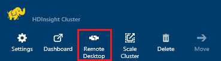
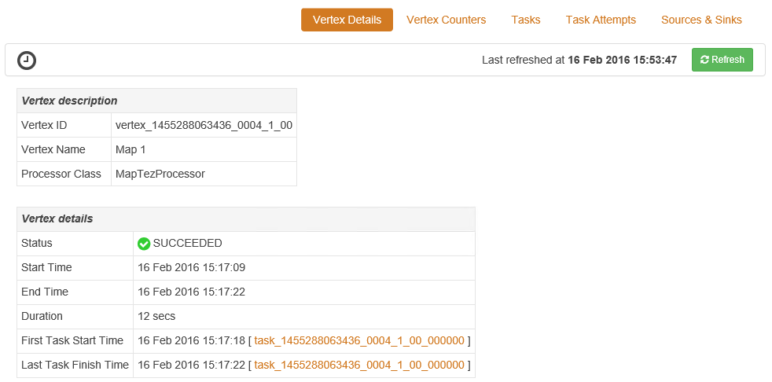

<properties
pageTitle="Usar Tez UI com baseado no Windows HDInsight | Azure"
description="Saiba como usar o Tez UI para depurar Tez trabalhos em baseado no Windows HDInsight HDInsight."
services="hdinsight"
documentationCenter=""
authors="Blackmist"
manager="jhubbard"
editor="cgronlun"/>

<tags
ms.service="hdinsight"
ms.devlang="na"
ms.topic="article"
ms.tgt_pltfrm="na"
ms.workload="big-data"
ms.date="10/04/2016"
ms.author="larryfr"/>

# Usar a Tez UI para depurar Tez trabalhos em HDInsight baseado no Windows

A UI Tez é uma página da web que pode ser usado para compreender e depurar trabalhos que usam Tez como o mecanismo de execução em clusters de HDInsight baseados no Windows. A UI Tez permite que você visualize o trabalho como um gráfico de itens conectadas, analise cada item e recuperar estatísticas e informações de log.

> [AZURE.NOTE] As informações neste documento são específicas para clusters HDInsight baseados no Windows. Para obter informações sobre a visualização e depuração Tez em HDInsight baseado em Linux, consulte [Usar modos de exibição de Ambari depurar Tez trabalhos em HDInsight](hdinsight-debug-ambari-tez-view.md).

## Pré-requisitos

* Um cluster baseado no Windows HDInsight. Para obter etapas sobre como criar um novo cluster, consulte [Introdução ao uso HDInsight baseados no Windows](hdinsight-hadoop-tutorial-get-started-windows.md).

    > [AZURE.IMPORTANT] A UI Tez só está disponível em clusters de HDInsight baseados no Windows criados após 8 de fevereiro de 2016.

* Um cliente de Desktop remoto baseado no Windows.

## Noções básicas sobre Tez

Tez é uma estrutura extensível para processamento de dados no Hadoop que fornece velocidades maiores que processamento de MapReduce tradicional. Para clusters de HDInsight baseados no Windows, é um mecanismo opcional que você pode habilitar para seção usando o comando a seguir como parte da sua consulta de seção:

    set hive.execution.engine=tez;

Quando o trabalho é enviado para Tez, ele cria um direcionado acíclica Graph (Dag mão) que descreva a ordem de execução das ações necessárias pelo trabalho. Ações individuais são chamadas de vértices e execute uma parte do trabalho geral. A execução real do trabalho descrito por um vértice é chamada de uma tarefa e pode ser distribuída em vários nós no cluster.

### Noções básicas sobre a interface do usuário Tez

A UI Tez é que uma página da web fornece informações sobre processos estiver executando, ou que possuem executou anteriormente usando Tez. Ele permite que você exiba o Dag de mão gerado pelo Tez, como ele é distribuído em clusters, contadores como memória usada por tarefas e vértices e informações de erro. Ele pode oferecer informações úteis nas seguintes situações:

* Monitoramento demorada processa, exibindo o andamento do mapa e reduzir as tarefas.

* Analisar dados históricos para processos com êxito ou falhas saber como processamento poderia ser melhorado ou por que não conseguiram.

## Gerar um Dag de mão

A UI Tez conterá dados somente se um trabalho que usa o mecanismo de Tez está sendo executado ou foi executada no passado. Consultas de seção simples geralmente podem ser resolvidas sem usar Tez, porém mais complexas consultas que fazer a filtragem, agrupamento, ordenação, junções, etc. normalmente exigirão Tez.

Use as etapas a seguir para executar uma consulta de seção que será executada usando Tez.

1. Em um navegador da web, navegue até https://CLUSTERNAME.azurehdinsight.net, onde __CLUSTERNAME__ é o nome do seu cluster HDInsight.

2. No menu na parte superior da página, selecione o __Editor de seção__. Isso exibirá uma página com a consulta de exemplo a seguir.

        Select * from hivesampletable

    Apagar a consulta de exemplo e substituí-la com o seguinte.

        set hive.execution.engine=tez;
        select market, state, country from hivesampletable where deviceplatform='Android' group by market, country, state;

3. Selecione o botão __Enviar__ . A seção de __Sessão de trabalho__ na parte inferior da página exibirá o status da consulta. Depois que o status é alterado para __concluído__, selecione o link __Exibir detalhes__ para exibir os resultados. A __Saída de trabalho__ deve ser semelhante ao seguinte:
        
        en-GB   Hessen      Germany
        en-GB   Kingston    Jamaica
        en-GB   Nairobi Area    Kenya

## Usar a interface do usuário Tez

> [AZURE.NOTE] A UI Tez só está disponível na área de trabalho de nós cluster cabeça, portanto você deve usar a área de trabalho remota para conectar-se com os nós de cabeça.

1. No [portal do Azure](https://portal.azure.com), selecione o seu cluster HDInsight. Na parte superior da lâmina HDInsight, selecione o ícone de __Área de trabalho remota__ . Isto exibirá a lâmina de desktop remota

    

2. Da lâmina área de trabalho remota, selecione __Conectar__ para conectar-se para o nó principal do cluster. Quando solicitado, use o nome de usuário de área de trabalho remota cluster e a senha para autenticar a conexão.

    

    > [AZURE.NOTE] Se você não ativou conectividade de área de trabalho remota, forneça um nome de usuário, senha e data de vencimento, selecione __Ativar__ para habilitar a área de trabalho remota. Depois que ele tiver sido ativado, use as etapas anteriores para conectar.

3. Uma vez conectado, abra o Internet Explorer na área de trabalho remota, selecione o ícone de engrenagem no canto superior direito do navegador e selecione __Configurações do modo de exibição de compatibilidade__.

4. Na parte inferior do __Configurações de exibição de compatibilidade__, desmarque a caixa de seleção para __sites de intranet de exibição no modo de compatibilidade__ e __listas de compatibilidade de usar o Microsoft__e, em seguida, selecione __Fechar__.

5. No Internet Explorer, navegue até tezui/http://headnodehost:8188 / #/. Isto exibirá a Tez UI

    

    Quando a Tez UI carrega, você verá uma lista de DAGs que estão sendo executadas ou ter sido executado no cluster. O modo de exibição padrão inclui o Dag Name, identificação, remetente, Status, hora de início, hora de término, duração, ID de aplicativo e fila. Mais colunas podem ser adicionadas usando o ícone de engrenagem na parte direita da página.

    Se você tiver apenas uma entrada, será para a consulta que você executou na seção anterior. Se você tiver várias entradas, você pode pesquisar por meio de critérios de pesquisa nos campos acima do DAGs e pressione __Enter__.

4. Selecione o __Nome de Dag mão__ para a entrada de Dag mão mais recente. Isto irá exibir informações sobre a Dag de mão, bem como a opção para baixar um zip de arquivos JSON que contêm informações sobre o Dag de mão.

    

5. Acima os __Detalhes de Dag mão__ são vários links que podem ser usados para exibir informações sobre a Dag de mão.

    * __Dag mão contadores__ exibe informações de contadores para este Dag de mão.
    
    * __Exibição gráfica__ mostra uma representação gráfica deste Dag de mão.
    
    * __Todos os vértices__ exibe uma lista dos vértices neste Dag de mão.
    
    * __Todas as tarefas__ exibe uma lista das tarefas para todos os vértices neste Dag de mão.
    
    * __Todos os TaskAttempts__ exibe informações sobre o tenta executar tarefas para este Dag de mão.
    
    > [AZURE.NOTE] Se você rolar a exibição da coluna para vértices, tarefas e TaskAttempts, observe que há links para exibir __contadores__ e __Exibir ou fazer o download de logs__ para cada linha.

    Se houver uma falha com o trabalho, os detalhes de Dag mão exibirá um status de falha, juntamente com links para informações sobre a tarefa falhou. Informações de diagnóstico serão exibidas abaixo os detalhes de Dag mão.

7. Selecione o __modo de exibição de gráfico__. Isso exibe uma representação gráfica da Dag a mão. Você pode colocar o mouse sobre cada vértice no modo de exibição para exibir informações sobre ele.

    

8. Clicar em um vértice carregará os __Detalhes de vértice__ para esse item. Clique no vértice a __1 de mapa__ para exibir detalhes para este item. Selecione __Confirmar__ para confirmar a navegação.

    

9. Observe que, agora, você tem links na parte superior da página que estão relacionadas a vértices e tarefas.

    > [AZURE.NOTE] Você também pode chegar a esta página voltar a __Detalhes Dag mão__, selecionando __Vértice detalhes__e selecionando o vértice __1 do mapa__ .

    * __Vértice contadores__ exibe as informações de contador para este vértice.
    
    * __Tarefas__ exibe tarefas para este vértice.
    
    * __Tarefa tentar__ exibe informações sobre tentativas de executar tarefas para este vértice.
    
    * __Fontes e receptores__ exibe fontes de dados e recpetores este vértice.

    > [AZURE.NOTE] Como com o menu anterior, você pode rolar a exibição de coluna para tarefas, tentativas de tarefa e fontes & Sinks__ exibir links para obter mais informações para cada item.

10. Selecione __tarefas__e, em seguida, selecione o item chamado __00_000000__. Isto irá exibir __Detalhes da tarefa__ para esta tarefa. Nessa tela, você pode exibir __Contadores de tarefa__ e __Tentativas de tarefa__.

    

## Próximas etapas

Agora que você aprendeu como usar o modo de exibição de Tez, saiba mais sobre [Usando seção em HDInsight](hdinsight-use-hive.md).

Para obter informações técnicas mais detalhadas sobre Tez, consulte a [página de Tez em Hortonworks](http://hortonworks.com/hadoop/tez/).
