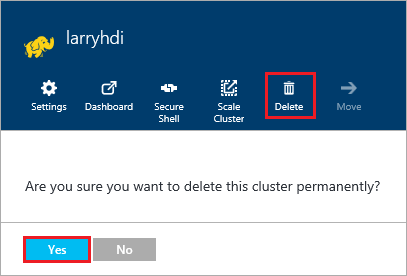

<properties
pageTitle="Como excluir um cluster de HDInsight | Azure"
description="Informações sobre as diversas maneiras que você pode excluir um cluster de HDInsight."
services="hdinsight"
documentationCenter=""
authors="Blackmist"
manager="jhubbard"
editor="cgronlun"/>

<tags
ms.service="hdinsight"
ms.devlang="na"
ms.topic="article"
ms.tgt_pltfrm="na"
ms.workload="big-data"
ms.date="10/28/2016"
ms.author="larryfr"/>

#Como excluir um cluster de HDInsight

HDInsight cluster de cobrança começa assim que um cluster é criado e é interrompido quando o cluster é excluído e é proporcional por minuto, portanto, você sempre deve excluir seu cluster quando ele não está mais em uso. Neste documento, você aprenderá como excluir um cluster usando o Portal do Azure, PowerShell do Azure e a CLI do Azure.

> [AZURE.IMPORTANT] Excluir um cluster de HDInsight não exclui as contas de armazenamento do Azure associadas ao cluster. Isso permite preservar e reutilizar quaisquer dados armazenados pelo cluster.

##Portal do Azure

1. Faça logon no [portal do Azure](https://portal.azure.com) e selecione o seu cluster HDInsight. Se o seu cluster HDInsight não está fixado ao painel, você pode procurá-lo por nome usando o campo de pesquisa (ícone de lupa), no lado direito da barra de navegação.

    

2. Quando a lâmina abre para o cluster, selecione o ícone __Excluir__ . Quando solicitado, selecione __Sim__ para excluir o cluster.

    

##PowerShell Azure

Em um prompt do PowerShell, use o seguinte comando para excluir o cluster:

    Remove-AzureRmHDInsightCluster -ClusterName CLUSTERNAME

Substitua o nome do seu cluster HDInsight __CLUSTERNAME__ .

##CLI Azure

Em um prompt, use o seguinte para excluir o cluster:

    azure hdinsight cluster delete CLUSTERNAME
    
Substitua o nome do seu cluster HDInsight __CLUSTERNAME__ .
