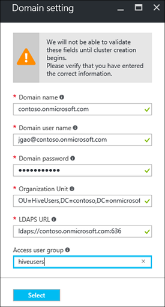

<properties
    pageTitle="Configurar domínio HDInsight clusters | Microsoft Azure"
    description="Saiba como instalar e configurar o domínio HDInsight clusters"
    services="hdinsight"
    documentationCenter=""
    authors="saurinsh"
    manager="jhubbard"
    editor="cgronlun"
    tags=""/>

<tags
    ms.service="hdinsight"
    ms.devlang="na"
    ms.topic="article"
    ms.tgt_pltfrm="na"
    ms.workload="big-data"
    ms.date="10/26/2016"
    ms.author="saurinsh"/>

# Configurar domínio HDInsight clusters (prévia)

Saiba como configurar um cluster de Azurehdinsight com o Azure Active Directory (AD Azure) e [Apache Ranger](http://hortonworks.com/apache/ranger/) para tirar proveito de autenticação forte e políticas de controle (RBAC) de acesso baseado em função avançada.  Domínio HDInsight só pode ser configurada em clusters baseados em Linux. Para obter mais informações, consulte [clusters de apresentar domínio HDInsight](hdinsight-domain-joined-introduction.md).

Este artigo é o primeiro tutorial de uma série:

- Crie um cluster de HDInsight conectado ao Azure AD (via a capacidade de serviços de domínio do Azure Directory) com Ranger Apache habilitado.
- Criar e aplicar políticas de seção por meio de Ranger Apache e permitir que os usuários (por exemplo, cientistas de dados) para se conectar à seção usando ferramentas baseadas em ODBC, por exemplo, Excel, Tableau etc. Microsoft está trabalhando em adicionando outras cargas de trabalho, como HBase, Spark e tempestade, ao domínio HDInsight em breve.

Um exemplo da topologia final tem a seguinte aparência:

Porque Azure AD atualmente oferece suporte apenas para redes virtuais clássicas (VNets) e HDInsight baseados em Linux clusters suporte apenas Gerenciador de recursos do Azure com base VNets, integração de HDInsight Azure AD requer dois VNets e uma correspondência entre elas. Para as informações de comparação entre os modelos de implantação de duas, consulte [Gerenciador de recursos do Azure versus implantação clássica: Noções básicas sobre modelos de implantação e o estado de seus recursos](../resource-manager-deployment-model.md). Os dois VNets devem estar na mesma região do Azure AD DS.

Nomes de serviço Azure devem ser exclusivos. Os nomes a seguir são usados neste tutorial. Contoso é um nome fictício. Você deve substituir *contoso* com um nome diferente ao percorrer o tutorial. 
    
**Nomes:**

|Propriedade|Valor|
|--------|-----|
| Azure AD VNet|contosoaadvnet|
| Azure AD VM (Máquina Virtual)|contosoaadadmin. Esta máquina virtual é usada para configurar a unidade de organização e reverter zona DNS.|
| Directory do Azure AD|contosoaaddirectory|
| Nome de domínio do Azure AD|Contoso (contoso.onmicrosoft.com)|
| HDInsight VNet|contosohdivnet|
| Grupo de recursos de HDInsight VNet|contosohdirg|
| HDInsight cluster|contosohdicluster|

Este tutorial fornece as etapas para configurar um cluster de HDInsight domínio. Cada seção tem links para outros artigos com mais informações de plano de fundo.

## Pré-requisito:

- Familiarizar-se com [os serviços de domínio do Azure AD](https://azure.microsoft.com/services/active-directory-ds/) sua estrutura de [preços](https://azure.microsoft.com/pricing/details/active-directory-ds/) .
- Certifique-se de que sua assinatura está na lista branca para essa visualização pública. Você pode fazê-lo enviando um email para hdipreview@microsoft.com com sua ID de assinatura.
- Um certificado SSL assinado por uma autoridade de assinatura do seu domínio. É necessário o certificado Configurando LDAP seguro. Certificados autoassinados não podem ser usados.

## Procedimentos

1. Crie um VNet clássico Azure para seu Azure AD.  
2. Criar e configurar Azure AD e Azure AD DS.
3. Adicione uma máquina virtual para o VNet clássico para a criação de unidade organizacional. 
4. Crie uma unidade organizacional para o Azure AD DS.
5. Crie um HDInsight VNet no modo de gerenciamento de recursos Azure.
6. Configure zonas DNS reverter para o Azure AD DS.
6. VNets de ponto os dois.
7. Crie um cluster de HDInsight.

> [AZURE.NOTE] Este tutorial supõe que você não tenha um anúncio Azure. Se você tiver um, você pode ignorar a parte na etapa 2.
    
## Criar um VNet clássico Azure

Nesta seção, você criar uma VNet clássica usando o portal do Azure. Na próxima seção, habilitar o Azure AD DS para o Azure AD no VNet clássico. Para obter mais informações sobre o procedimento a seguir e usar outros métodos de criação de VNet, consulte [criar uma rede virtual (clássica) usando o portal do Azure](../virtual-network/virtual-networks-create-vnet-classic-portal.md).

**Para criar um VNet clássico**

1. Entre [portal do Azure](https://portal.azure.com). 
2. Clique em **novo** > **rede** > **rede Virtual**.
3. Em **Selecione um modelo de implantação**, selecione **clássico**e clique em **criar**.
4. Digite ou selecione os valores a seguir:

    - **Nome**: contosoaadvnet
    - **Espaço de endereço**: 10.1.0.0/16
    - **Nome de sub-rede**: Subnet1
    - **Intervalo de endereços de sub-rede**: 10.1.0.0/24
    - **Assinatura**: (selecione uma assinatura usada para criar este VNet).
    - **ResourceGroup**:
    - **Local**: (selecione uma região para o seu cluster HDInsight).

        > [AZURE.IMPORTANT] Você deve escolher um local que ofereça suporte Azure AD DS. Para obter mais informações, consulte [produtos disponíveis por região](https://azure.microsoft.com/en-us/regions/services/). 
        >
        > O VNet clássico e a VNet de grupo de recursos devem estar na mesma região do Azure AD DS.

5. Clique em **criar** para criar o VNet.

## Criar e configurar o Azure AD DS para o Azure AD

Nesta seção, você irá:

1. Crie um anúncio Azure.
2. Crie usuários do Azure AD. Esses usuários são usuários de domínio. Você pode usar o primeiro usuário para configurar o cluster HDInsight com o Azure AD.  Os outros dois usuários são opcionais para este tutorial. Eles serão usados na [seção Configurar políticas para domínio HDInsight clusters](hdinsight-domain-joined-run-hive.md) ao configurar diretivas de Ranger Apache.
3. Criar o grupo de administradores de DC AAD e adicione o usuário do Azure AD para o grupo. Use este usuário para criar a unidade organizacional.
4. Habilite serviços de domínio do Azure AD (Azure AD DS) para o Azure AD.
7. Configure LDAPS para o Azure AD. O LDAP Lightweight Directory Access Protocol () é usado para ler e gravar ao Azure AD.

Se você preferir usar um anúncio Azure existente, você pode ignorar as etapas 1 e 2.

**Para criar um anúncio Azure**

1. Do [Azure portal clássico](https://manage.windowsazure.com), clique em **novo** > **Os serviços de aplicativo** > **Do Active Directory** > **diretório** > **Criar personalizada**. 
3. Digite ou selecione os valores a seguir:

    - **Nome**: contosoaaddirectory
    - **Nome de domínio**: contoso.  Esse nome deve ser exclusivo.
    - **País ou região**: selecione seu país ou região.
4. Clique em **Concluir**.

**Criar um usuário do Azure AD**

1. Do [Azure portal clássico](https://manage.windowsazure.com), clique em **Active Directory** -> **contosoaaddirectory**. 
3. No menu superior, clique em **usuários** .
4. Clique em **Adicionar usuário**.
4. Insira o **Nome de usuário**e clique em **Avançar**. 
5. Configurar o perfil de usuário; **Função**, selecione **Administrador Global**; e, em seguida, clique em **Avançar**.  A função de Administrador Global é necessário para criar unidades organizacionais.
6. Clique em **criar** para obter uma senha temporária.
7. Faça uma cópia da senha e, em seguida, clique em **Concluir**. Posteriormente neste tutorial, você usará esse usuário de administrador global para assinar o administrador máquina virtual para criar uma unidade organizacional e configurar DNS reverso.

Siga o mesmo procedimento para criar duas mais usuários com a função de **usuário** , hiveuser1 e hiveuser2. Os usuários a seguir serão usados na [seção Configurar políticas para clusters de domínio HDInsight](hdinsight-domain-joined-run-hive.md).

**Para criar o grupo dos administradores de DC AAD e adicionar um usuário do Azure AD**

1. Do [Azure portal clássico](https://manage.windowsazure.com), clique em **Active Directory** > **contosoaaddirectory**. 
3. No menu superior, clique em **grupos** .
4. Clique em **Adicionar um grupo** ou **Adicionar grupo**.
5. Digite ou selecione os valores a seguir:

    - **Nome**: AAD DC administradores.  Não altere o nome do grupo.
    - **Tipo de grupo**: segurança.
6. Clique em **Concluir**.
7. Clique em **Administradores de DC AAD** para abrir o grupo.
8. Clique em **Adicionar membros**.
9. Selecione o primeiro usuário que você criou na etapa anterior e, em seguida, clique em **Concluir**.
10. Repita as mesmas etapas para criar outro grupo chamado **HiveUsers**e adicione os dois usuários de seção ao grupo.

Para obter mais informações, consulte [Serviços de domínio do Azure AD (visualização) - criar o grupo ' Administradores de DC AAD'](../active-directory-domain-services/active-directory-ds-getting-started.md).

**Para habilitar o Azure AD DS para o Azure AD**

1. Do [Azure portal clássico](https://manage.windowsazure.com), clique em **Active Directory** > **contosoaaddirectory**. 
3. No menu superior, clique em **Configurar** .
4. Role para baixo para **Serviços de domínio**e defina os seguintes valores:

    - **Ativar os serviços de domínio para este diretório**: Sim.
    - **Nome de domínio DNS dos serviços de domínio**: isso mostra o nome DNS padrão do diretório do Azure. Por exemplo, contoso.onmicrosoft.com.
    - **Serviços de domínio de conectar a esta rede virtual**: selecione a rede virtual clássica que você criou anteriormente, ou seja, **contosoaadvnet**.
    
6. Clique em **Salvar** da parte inferior da página. Você verá **pendente …** ao lado de **habilitar os serviços de domínio para este diretório**.  
7. Aguarde até **pendente …** desaparece, e o **Endereço IP** fica preenchido. Dois endereços IP serão preenchidos. Esses são os endereços IP dos controladores de domínio provisionados pelos serviços de domínio. Cada endereço IP estarão visível depois que o controlador de domínio correspondente é provisionado e pronto. Anote os dois endereços IP. Você precisará-las mais tarde.

Para obter mais informações, consulte [Serviços de domínio do Azure AD (visualização) - serviços de habilitar o domínio do Azure AD](../active-directory-domain-services/active-directory-ds-getting-started-enableaadds.md).

**A sincronização de senha**

Se você usar seu próprio domínio, você precisa sincronizar a senha. Consulte [Habilitar a sincronização de senha para serviços de domínio do Azure AD para um Azure somente na nuvem diretório AD](../active-directory-domain-services/active-directory-ds-getting-started-password-sync.md).

**Para configurar o LDAPS para o Azure AD**

1. Obter um certificado SSL assinado por uma autoridade de assinatura do seu domínio. Certificados autoassinados não podem ser usados. Se você não conseguir um certificado SSL, por favor Impressione hdipreview@microsoft.com para uma exceção.
1. Do [Azure portal clássico](https://manage.windowsazure.com), clique em **Active Directory** > **contosoaaddirectory**. 
3. No menu superior, clique em **Configurar** .
4. Role para **Serviços de domínio**.
5. Clique em **Configurar certificado**.
6. Siga as instruções para especificar o arquivo de certificado e a senha. Você verá **pendente …** ao lado de **habilitar os serviços de domínio para este diretório**.  
7. Aguarde até **pendente …** desaparece, e **Seguro LDAP certificado** obtido preenchida.  Isso pode levar até 10 minutos ou mais.
 
>[AZURE.NOTE] Se algumas tarefas de plano de fundo estão sendo executadas no Azure AD DS, você poderá ver um erro ao carregar certificado - <i>lá é uma operação sendo realizada para este site principal. Tente novamente mais tarde</i>.  Caso esse erro ocorrer, tente novamente após alguns instantes. O segundo IP de controlador de domínio pode levar até 3 horas para ser provisionado.

Para obter mais informações, consulte [Configurar seguro LDAP (LDAPS) para um domínio de serviços de domínio do Azure AD gerenciados](../active-directory-domain-services/active-directory-ds-admin-guide-configure-secure-ldap.md).

## Configurar uma unidade organizacional e reverter DNS

Nesta seção, você adicionar uma máquina virtual para o Azure AD VNet e instale ferramentas administrativas esta máquina virtual para que possa configurar uma unidade organizacional e reverter DNS. Pesquisa DNS inversa é necessária para a autenticação Kerberos.

**Para criar uma máquina virtual em rede virtual**

1. Do [Azure portal clássico](https://manage.windowsazure.com), clique em **novo** > **Calcular** > **Máquina Virtual** > **Da Galeria**.
3. Selecione uma imagem e clique em **Avançar**.  Se você não souber qual delas usar, selecione o padrão, **O Centro de dados do Windows Server 2012 R2**.
4. Digite ou selecione os valores a seguir:

    - Nome de máquina virtual: **contosoaadadmin**
    - Camada: **Básico**
    - Novo nome de usuário: (Insira um nome de usuário)
    - Senha: (Digite uma senha)
    
    Observe o nome de usuário e a senha é o administrador de local.
    
5. Clique em **Avançar**
6. Em **Rede Virtual/região**, selecione a nova rede virtual que você criou na última etapa (contosoaadvnet) e clique em **Avançar**.
7. Clique em **Concluir**.

**Para RDP para a máquina virtual**

1. Do [Azure portal clássico](https://manage.windowsazure.com), clique em **máquinas virtuais** > **contosoaadadmin**.
3. Clique em **Painel de controle** do menu superior.
4. Clique em **conectar-se** da parte inferior da página.
5. Siga as instruções e o nome de usuário de administrador local e a senha para se conectar.

**Para ingressar máquina virtual ao domínio do Azure AD**

1. Da sessão RDP, clique em **Iniciar**e, em seguida, clique em **Gerenciador de servidor**.
2. Clique em **Servidor Local** no menu à esquerda.
3. No grupo de trabalho, clique em **grupo de trabalho**.
4. Clique em **Alterar**.
5. Clique em **domínio**, digite **contoso.onmicrosoft.com**e clique em **Okey**.
6. Insira as credenciais de usuário de domínio e clique em **Okey**.
7. Clique em **Okey**.
8. Clique em **Okey** para aceitar a reinicialização do computador.
9. Clique em **Fechar**.
10. Clique em **Reiniciar agora**.

Para obter mais informações, consulte [ingressar em uma máquina virtual Windows Server um domínio gerenciado](../active-directory-domain-services/active-directory-ds-admin-guide-join-windows-vm.md).

**Para instalar ferramentas de administração do Active Directory e DNS**

1. RDP em **contosoaadadmin** usando a conta de usuário do Azure AD.
2. Clique em **Iniciar**e, em seguida, clique em **Gerenciador de servidor**.
3. Clique em **Painel de controle** no menu à esquerda.
4. Clique em **Gerenciar**e, em seguida, clique em **recursos e adicionar funções**.
5. Clique em **Avançar**.
6. Selecione **instalação baseada em função ou baseada em recursos**e clique em **Avançar**.
7. Selecione a máquina virtual atual do pool de servidor e clique em **Avançar**.
8. Clique em **Avançar** para ignorar funções.
9. Expanda **As ferramentas de administração de servidor remoto**, expanda **As ferramentas de administração de função**, selecione **AD DS e ferramentas do AD LDS** e **Ferramentas do servidor DNS**e clique em **Avançar**. 
10. Clique em **Avançar**
10. Clique em **instalar**.

Para obter mais informações, consulte [Ferramentas de administração de instalar o Active Directory na máquina virtual](../active-directory-domain-services/active-directory-ds-admin-guide-administer-domain.md#task-2---install-active-directory-administration-tools-on-the-virtual-machine).

**Configurar o DNS reverso**

1. RDP para contosoaadadmin usando a conta de usuário do Azure AD.
2. Clique em **Iniciar**, clique em **Ferramentas administrativas**e clique em **DNS**. 
3. Clique em **não** para ignorar a adição de ContosoAADAdmin.
4. Selecione **o seguinte computador**, digite o endereço IP do primeiro servidor DNS configurado anteriormente e clique em **Okey**.  Você deverá ver que o DC/DNS é adicionado ao painel esquerdo.
3. Expanda o servidor DNS/DC, **Zonas de pesquisa inversa**de atalho e, em seguida, clique em **Nova zona**. Assistente de nova zona é aberta.
4. Clique em **Avançar**.
5. Selecione a **zona primária**e clique em **Avançar**.
6. Selecione **todos os servidores DNS executando em controladores de domínio nesse domínio**e clique em **Avançar**.
6. Selecione a **Zona de pesquisa reversa IPv4**e clique em **Avançar**.
7. Em **ID de rede**, insira o prefixo para o intervalo de rede de HDInsight VNET e clique em **Avançar**. Você criará o HDInsight VNet na seção a seguir.
8. Clique em **Avançar**.
9. Clique em **Avançar**.
10. Clique em **Concluir**.

A unidade de organização que criar próximo será usada quando criar o cluster HDInsight. Os usuários de sistema de Hadoop e contas de computador serão colocadas esta unidade organizacional.

**Criar uma unidade organizacional (OU) em um domínio gerenciado de serviços de domínio do Azure AD**

1. RDP em **contosoaadadmin** usando a conta de domínio que está no grupo **Administradores de DC AAD** .
2. Clique em **Iniciar**, clique em **Ferramentas administrativas**e clique em **Central Administrativa do Active Directory**.
5. Clique no nome de domínio no painel esquerdo. Por exemplo, contoso.
6. Clique em **novo** sob o nome de domínio no painel de **tarefas** e, em seguida, clique em **Unidade organizacional**.
7. Insira um nome, por exemplo **HDInsightOU**e clique em **Okey**. 

Para obter mais informações, consulte [criar uma unidade organizacional (OU) em um domínio de serviços de domínio do Azure AD gerenciados](../active-directory-domain-services/active-directory-ds-admin-guide-create-ou.md).

## Criar um VNet Gerenciador de recursos para cluster de HDInsight

Nesta seção, você criará um VNet Gerenciador de recursos do Azure que será usado para o cluster HDInsight. Para obter mais informações sobre como criar VNET Azure usando outros métodos, consulte [criar uma rede virtual](../virtual-network/virtual-networks-create-vnet-arm-pportal.md)

Depois de criar a VNet, você irá configurar o VNet Gerenciador de recursos para usar os mesmos servidores DNS para o Azure AD VNet. Se você seguiu as etapas deste tutorial para criar a VNet clássico e o Azure AD, os servidores DNS são 10.1.0.4 e 10.1.0.5.

**Para criar um VNet Gerenciador de recursos**

1. Entre [portal do Azure](https://portal.azure.com).
2. Clique em **novo**, **rede**e, em seguida, **rede Virtual**. 
3. Em **Selecione um modelo de implantação**, selecione **Gerenciador de recursos**e clique em **criar**.
4. Digite ou selecione os valores a seguir:

    - **Nome**: contosohdivnet
    - **Espaço de endereço**: 10.2.0.0/16. Verifique se que o intervalo de endereços não pode sobrepor o intervalo de endereço IP do VNet clássico.
    - **Nome de sub-rede**: Subnet1
    - **Intervalo de endereços de sub-rede**: 10.2.0.0/24
    - **Assinatura**: (selecione sua assinatura do Azure).
    - **Grupo de recursos**: contosohdirg
    - **Local**: (selecione o mesmo local como o Azure AD VNet, ou seja, contosoaadvnet).

5. Clique em **criar**.

**Configurar DNS para VNet o Gerenciador de recursos**

1. No [portal do Azure](https://portal.azure.com), clique em **mais serviços** -> **redes virtuais**. Certifique-se para não clique em **redes virtuais (clássicos)**.
2. Clique em **contosohdivnet**.
4. Clique em **servidores DNS** do lado esquerdo da lâmina novo.
6. Clique em **personalizado**e, em seguida, insira os seguintes valores:

    - 10.1.0.4
    - 10.1.0.5

    Esses endereços IP do servidor DNS devem corresponder para os servidores DNS na VNet de AD Azure (VNet clássico).
7. Clique em **Salvar**.

## Ponto o Azure AD VNet e o HDInsight VNet

**Ao correspondente a duas VNet**

1. Entre [portal do Azure](https://portal.azure.com).
2. Clique em **mais serviços** no menu à esquerda.
3. Clique em **redes virtuais**. Não clique em **redes virtuais (clássicos)**.
4. Clique em **contosohdivnet**.  Este é o HDInsight VNet.
5. Clique em **Peerings** no menu à esquerda da lâmina.
6. No menu superior, clique em **Adicionar** . Ele abre a lâmina **Adicionar correspondência** .
7. Na lâmina **Adicionar correspondência** , definir ou selecione os valores a seguir:

    - **Nome**: ContosoAADHDIVNetPeering
    - **Modelo de implantação de rede virtual**: clássico
    - **Assinatura**: selecione seu nome de assinatura usado para o vnet clássico (Azure AD).
    - **Rede virtual**: contosoaadvnet.
    - **Permitir acesso de rede virtual**: (Verificar)
    - **Permitir encaminhadas tráfego**: (Verificar). Deixe as outras duas caixas de seleção desmarcada.

8. Clique em **Okey**.

## Criar HDInsight cluster

Nesta seção, você criar um cluster baseado no Linux Hadoop em HDInsight usando o portal do Azure ou o [modelo do Gerenciador de recursos do Azure](../resource-group-template-deploy.md). Para outros métodos de criação de cluster e Noções básicas sobre as configurações, consulte [criar HDInsight clusters](hdinsight-hadoop-provision-linux-clusters.md). Para obter mais informações sobre como usar o modelo do Gerenciador de recursos para criar clusters de Hadoop no HDInsight, consulte [criar Hadoop clusters no HDInsight usando modelos do Gerenciador de recursos](hdinsight-hadoop-create-windows-clusters-arm-templates.md)

**Para criar um cluster de domínio HDInsight usando o portal do Azure**

1. Entre [portal do Azure](https://portal.azure.com).
2. Clique em **novo**, **inteligência + analytics**e, em seguida, **HDInsight**.
3. Da lâmina **cluster novo HDInsight** , digite ou selecione os valores a seguir:

    - **Nome do cluster**: insira um novo nome de cluster para o cluster de domínio HDInsight.
    - **Assinatura**: selecione uma assinatura do Azure usada para criar este cluster.
    - **Configuração de cluster**:

        - **Tipo de cluster**: Hadoop. Domínio HDInsight está apenas com suporte no Hadoop clusters.
        - **Sistema operacional**: Linux.  Domínio HDInsight só é suportado em clusters de HDInsight baseados em Linux.
        - **Versão**: Hadoop 2.7.3 (HDI 3.5). Domínio HDInsight é suportado apenas na versão de cluster HDInsight 3.5.
        - **Tipo de cluster**: PREMIUM

        Clique em **Selecionar** para salvar as alterações.

    - **Credenciais**: configurar as credenciais para o usuário de cluster e o usuário SSH.
    - **Fonte de dados**: criar uma nova conta de armazenamento ou usar uma conta de armazenamento existente como a conta de armazenamento padrão para o cluster HDInsight. O local deve ser igual as duas VNets.  O local também é o local do cluster HDInsight.
    - **Preços**: selecione o número de nós de trabalho do seu cluster.
    - **Configurações avançadas**: 

        - **Ingressando em domínio & Vnet/sub-rede**: 

            - **Configurações de domínio**: 

                - **Nome de domínio**: contoso.onmicrosoft.com
                - **Nome de usuário de domínio**: insira um nome de usuário de domínio. Esse domínio deve ter os seguintes privilégios: ingressar máquinas no domínio e colocá-los na unidade organizacional configurado anteriormente; Criar objetos de serviço dentro da unidade de organização configurado anteriormente; Crie entradas de DNS reverso. Este usuário do domínio se tornará o administrador desse cluster de HDInsight domínio.
                - **Senha de domínio**: insira a senha de usuário de domínio.
                - **Unidade organizacional**: insira o nome diferenciado do que a unidade Organizacional que você configurou anteriormente. Por exemplo: OU = HDInsightOU, DC = contoso, DC = onmicrosoft, DC = com
                - **URL de LDAPS**: ldaps://contoso.onmicrosoft.com:636
                - **Grupo de usuários do Access**: especificar a segurança do grupo cujos usuários wan para sincronização ao cluster. Por exemplo, HiveUsers.

                Clique em **Selecionar** para salvar as alterações.

                
            - **Rede virtual**: contosohdivnet
            - **Sub-rede**: Subnet1

            Clique em **Selecionar** para salvar as alterações.       
        Clique em **Selecionar** para salvar as alterações.
    - **Grupo de recursos**: selecione o grupo de recursos usado para o HDInsight VNet (contosohdirg).

4. Clique em **criar**.  

Outra opção para a criação de cluster HDInsight domínio é usar o modelo de gerenciamento de recursos do Azure. O procedimento a seguir mostra como fazer isso:

**Para criar um cluster de HDInsight domínio usando um modelo de gerenciamento de recursos**

1. Clique na imagem a seguir para abrir um modelo do Gerenciador de recursos no portal do Azure. O modelo do Gerenciador de recursos está localizado em um contêiner de blob pública. 

    

2. Da lâmina **parâmetros** , insira os seguintes valores:

    - **Assinatura**: (selecione a sua assinatura do Azure).
    - **Grupo de recursos**: clique em **Usar existente**, e especifique o mesmo grupo de recursos que você tem usado.  Por exemplo, contosohdirg. 
    - **Local**: Especifique um local de grupo de recursos.
    - **Nome do cluster**: insira um nome para o cluster Hadoop que será criado. Por exemplo, contosohdicluster.
    - **Tipo de cluster**: selecione um tipo de cluster.  O valor padrão é **hadoop**.
    - **Local**: selecione um local para o cluster.  A conta padrão de armazenamento utiliza o mesmo local.
    - **Contagem de nós de operador de cluster**: selecione o número de nós de trabalho.
    - **Nome de login de cluster e de senha**: O nome de login padrão é **admin**.
    - **E SSH senha**: O nome de usuário padrão é **sshuser**.  Você pode renomeá-la. 
    - **Id de rede virtual**: /subscriptions/&lt;SubscriptionID > /resourceGroups/&lt;ResourceGroupName > /providers/Microsoft.Network/virtualNetworks/&lt;VNetName >
    - **Virtual sub-rede**: /subscriptions/&lt;SubscriptionID > /resourceGroups/&lt;ResourceGroupName > /providers/Microsoft.Network/virtualNetworks/&lt;VNetName >/sub-redes/Subnet1
    - **Nome de domínio**: contoso.onmicrosoft.com
    - **Organização unidade DN**: OU = HDInsightOU, DC = contoso, DC = onmicrosoft, DC = com
    - **Cluster usuários grupo D Ns**: "\"CN = HiveUsers, OU = AADDC usuários, DC =<DomainName>, DC = onmicrosoft, DC = com\""
    - **LDAPUrls**: ["ldaps://contoso.onmicrosoft.com:636"]
    - **DomainAdminUserName**: (Insira o nome de usuário de administrador de domínio)
    - **DomainAdminPassword**: (Insira a senha de usuário de administrador de domínio)
    - **Eu concordar com os termos e condições mencionadas acima**: (Verificar)
    - **Fixar em dashboard**: (Verificar)

6. Clique em **comprar**. Você verá um novo bloco intitulado **implantação de implantação do modelo**. Ele leva cerca de cerca de 20 minutos para criar um cluster. Depois que o cluster for criado, você pode clicar a lâmina cluster no portal para abri-lo.

Depois de concluir o tutorial, talvez você queira excluir o cluster. Com HDInsight, seus dados são armazenados no armazenamento do Azure, assim você pode excluir com segurança um cluster quando ele não está em uso. Você também cobrado para um cluster de HDInsight, mesmo quando não estiver em uso. Como os encargos para o cluster são muitas vezes mais do que os encargos de armazenamento, faz sentido econômico excluir clusters quando eles não estão em uso. Para obter as instruções de exclusão de um cluster, consulte [clusters de gerenciar Hadoop em HDInsight usando o portal do Azure](hdinsight-administer-use-management-portal.md#delete-clusters).

## Próximas etapas

- Para configurar políticas de seção e executar consultas de seção, consulte [Configurar seção políticas para clusters de domínio HDInsight](hdinsight-domain-joined-run-hive.md).
- Para executar consultas de seção usando SSH em clusters de domínio HDInsight, consulte [Usar SSH com baseado em Linux Hadoop em HDInsight do Linux, Unix ou OS X](hdinsight-hadoop-linux-use-ssh-unix.md#connect-to-a-domain-joined-hdinsight-cluster).
