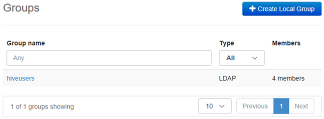

<properties
    pageTitle="Gerenciar clusters de domínio HDInsight | Microsoft Azure"
    description="Saiba como gerenciar clusters de domínio HDInsight"
    services="hdinsight"
    documentationCenter=""
    authors="saurinsh"
    manager="jhubbard"
    editor="cgronlun"
    tags=""/>

<tags
    ms.service="hdinsight"
    ms.devlang="na"
    ms.topic="article"
    ms.tgt_pltfrm="na"
    ms.workload="big-data"
    ms.date="10/25/2016"
    ms.author="saurinsh"/>

# Gerenciar domínio HDInsight clusters (prévia)

Saiba os usuários e as funções no domínio HDInsight e como gerenciar domínio clusters de HDInsight.

## Usuários de domínio HDInsight clusters

Um cluster de HDInsight que não é domínio tem duas contas de usuário que são criadas durante a criação de cluster:

- **Administração de Ambari**: essa conta também é conhecido como *usuário do Hadoop* ou *HTTP*. Essa conta pode ser usada para fazer logon no Ambari em https://&lt;clustername >. azurehdinsight.net. Ele também pode ser usado para executar consultas em modos de exibição de Ambari, executar trabalhos por meio de ferramentas externas (ou seja, PowerShell, Templeton, Visual Studio) e autenticar com o driver ODBC de seção e ferramentas de BI (isto é, Excel, PowerBI ou Tableau).

- **Usuário SSH**: essa conta pode ser usado com SSH e executar comandos sudo. Ela tem privilégios de raiz para VMs Linux.

Um cluster de HDInsight domínio tem três novos usuários além Ambari administrador e usuário SSH.

- **Administração de Ranger**: esta é a conta de administrador Apache Ranger local. Não é um usuário de domínio do active directory. Essa conta pode ser usada para configurar políticas e fazer outros usuários ou administradores delegados (de forma que os usuários podem gerenciar políticas). Por padrão, o nome de usuário é *admin* e a senha é a mesma que a senha de administrador Ambari. A senha pode ser atualizada na página Configurações de no Ranger.

- **Usuário de domínio de administrador de cluster**: essa conta é um usuário de domínio do active directory designado como administrador de cluster do Hadoop, incluindo Ambari e Ranger. Você deve fornecer credenciais do usuário durante a criação de cluster. Este usuário tem os seguintes privilégios:

    - Ingresse em máquinas ao domínio e colocá-los dentro da OU que você especificar durante a criação de cluster.
    - Crie objetos de serviço dentro da OU que você especificar durante a criação de cluster. 
    - Crie entradas de DNS reverso.

    Observe que os outros usuários do AD também tenham esses privilégios. 

    Há alguns pontos de extremidade dentro do cluster (por exemplo, Templeton) que não são gerenciados pelo Ranger e, portanto, não são seguros. Esses pontos de extremidade são bloqueados para todos os usuários, exceto o usuário de domínio de administrador de cluster. 

- **Regular**: durante a criação do cluster, você pode fornecer vários grupos do active directory. Os usuários nesses grupos serão sincronizados Ranger e Ambari. Esses usuários são usuários de domínio e terão acesso aos somente Ranger pontos finais gerenciados (por exemplo, Hiveserver2). Todas as políticas RBAC e auditoria será aplicável a esses usuários.

## Funções de domínio HDInsight clusters

Domínio HDInsight ter as seguintes funções:

- Administrador de cluster
- Operador de cluster
- Administrador do serviço
- Operador de serviço
- Usuário de cluster

**Para ver as permissões dessas funções**

1. Abra o gerenciamento de Ambari da interface do usuário.  Consulte [Abrir o gerenciamento de Ambari da interface do usuário](#open-the-ambari-management-ui).
2. No menu à esquerda, clique em **funções**.
3. Clique no ponto de interrogação azul para ver as permissões:

    

## Abra o gerenciamento de Ambari da interface do usuário

1. Entre [portal do Azure](https://portal.azure.com).
2. Abra seu cluster HDInsight em uma lâmina. Consulte [clusters de lista e mostrar](hdinsight-administer-use-management-portal.md#list-and-show-clusters).
3. Clique em **painel** de menu superior para abrir Ambari.
4. Faça logon em Ambari usando o nome de usuário de domínio de administrador de cluster e a senha.
5. Clique no menu suspenso de **Administração** do canto superior direito e, em seguida, clique em **Gerenciar Ambari**.

    

    A interface do usuário é semelhante a:

    

## Listar os usuários de domínio sincronizados em seu Active Directory

1. Abra o gerenciamento de Ambari da interface do usuário.  Consulte [Abrir o gerenciamento de Ambari da interface do usuário](#open-the-ambari-management-ui).
2. No menu à esquerda, clique em **usuários**. Você deverá ver todos os usuários sincronizados a partir de seu Active Directory ao cluster HDInsight.

    

## Listar os grupos de domínio sincronizados em seu Active Directory

1. Abra o gerenciamento de Ambari da interface do usuário.  Consulte [Abrir o gerenciamento de Ambari da interface do usuário](#open-the-ambari-management-ui).
2. No menu à esquerda, clique em **grupos**. Você deverá ver todos os grupos sincronizados a partir de seu Active Directory ao cluster HDInsight.

    

## Configurar permissões de seção modos de exibição

1. Abra o gerenciamento de Ambari da interface do usuário.  Consulte [Abrir o gerenciamento de Ambari da interface do usuário](#open-the-ambari-management-ui).
2. No menu à esquerda, clique em **modos de exibição**.
3. Clique em **seção** para mostrar os detalhes.

    

4. Clique no link da **Seção modo de exibição** para configurar modos de exibição de seção.
5. Role para baixo até a seção **permissões** .

    

6. Clique em **Adicionar usuário** ou **Grupo de adicionar**e, em seguida, especifique os usuários ou grupos que podem usar modos de exibição de seção. 

## Configurar usuários para as funções

 Para ver uma lista de funções e suas permissões, consulte [clusters de funções do domínio HDInsight](#roles-of-domain---joined-hdinsight-clusters).

1. Abra o gerenciamento de Ambari da interface do usuário.  Consulte [Abrir o gerenciamento de Ambari da interface do usuário](#open-the-ambari-management-ui).
2. No menu à esquerda, clique em **funções**.
3. Clique em **Adicionar usuário** ou **Grupo de adicionar** para atribuir usuários e grupos para diferentes funções.
 
## Próximas etapas

- Para configurar um cluster de domínio HDInsight, consulte [Configurar domínio HDInsight clusters](hdinsight-domain-joined-configure.md).
- Para configurar políticas de seção e executar consultas de seção, consulte [Configurar seção políticas para clusters de domínio HDInsight](hdinsight-domain-joined-run-hive.md).
- Para executar consultas de seção usando SSH em clusters de domínio HDInsight, consulte [Usar SSH com baseado em Linux Hadoop em HDInsight do Linux, Unix ou OS X](hdinsight-hadoop-linux-use-ssh-unix.md#connect-to-a-domain-joined-hdinsight-cluster).
