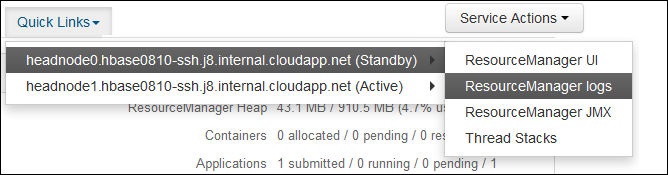

<properties
    pageTitle="Aplicativo do Access fio COLORIDO Hadoop logon baseado em Linux HDInsight | Microsoft Azure"
    description="Saiba como acessar fio COLORIDO logs de aplicativos em um cluster baseado no Linux HDInsight (Hadoop) usando a linha de comando e um navegador da web."
    services="hdinsight"
    documentationCenter=""
    tags="azure-portal"
    authors="Blackmist" 
    manager="jhubbard"
    editor="cgronlun"/>

<tags
    ms.service="hdinsight"
    ms.workload="big-data"
    ms.tgt_pltfrm="na"
    ms.devlang="na"
    ms.topic="article"
    ms.date="10/21/2016"
    ms.author="larryfr"/>

# Aplicativo do Access fio COLORIDO logon baseado em Linux HDInsight 

Este documento explica como acessar os logs de aplicativos de fio COLORIDO (ainda outro recurso Negotiator) que terminar em um cluster de Hadoop no Azure HDInsight.

> [AZURE.NOTE] As informações neste documento são específicas para clusters HDInsight baseados em Linux. Para obter informações sobre clusters baseados no Windows, consulte [fio COLORIDO acesso aplicativo fizer logon HDInsight baseado no Windows](hdinsight-hadoop-access-yarn-app-logs.md)

## Pré-requisitos

* Um cluster de HDInsight baseados em Linux.

* Você deve [criar um túnel SSH](hdinsight-linux-ambari-ssh-tunnel.md) antes de poder acessar web ResourceManager Logs da interface do usuário.

## Servidor de linha do tempo de fio COLORIDO

O [Servidor de linha do tempo de fio COLORIDO](http://hadoop.apache.org/docs/r2.4.0/hadoop-yarn/hadoop-yarn-site/TimelineServer.html) fornece informações genéricas em aplicativos concluídos, bem como informações específicas do framework aplicativo por meio de duas interfaces diferentes. Especificamente:

* Armazenamento e recuperação de informações de aplicativo genérico em clusters de HDInsight foi ativado com versão 3.1.1.374 ou superior.
* O componente de informações específicas do framework aplicativo do servidor linha do tempo não está disponível atualmente nos clusters de HDInsight.

Informações genéricas em aplicativos incluem os seguintes tipos de dados:

* A ID do aplicativo, um identificador exclusivo de um aplicativo
* O usuário que iniciou o aplicativo
* Informações sobre tentativas feitas para concluir o aplicativo
* Os contêineres usados por qualquer tentativa de determinado aplicativo

## Logs e aplicativos de fio COLORIDO

Fio COLORIDO oferece suporte a vários modelos de programação (MapReduce sendo um deles), separação de gerenciamento de recursos do aplicativo agendamento/monitoramento. Isso é feito por meio de um global *ResourceManager* (RM), por trabalhador-nó *NodeManagers* (NMs) e por aplicativo *ApplicationMasters* (AMs). O AM por aplicativo negocia recursos (CPU, memória, disco, rede) para executar o aplicativo com o mecanismo de retenção. O mecanismo de retenção funciona com NMs para conceder esses recursos, o que são concedidos como *contêineres*. O AM é responsável por controlar o andamento dos contêineres atribuído pelo mecanismo de retenção. Um aplicativo pode exigir muitos contêineres dependendo da natureza do aplicativo.

Além disso, cada aplicativo pode consistir em várias *tentativas de aplicativo* para término na presença de travamentos ou devido a perda de comunicação entre AM e um mecanismo de retenção. Portanto, contêineres são concedidos a uma tentativa de específico de um aplicativo. Em um sentido, um contêiner fornece o contexto da unidade básica do trabalho realizado por um aplicativo de fio COLORIDO e todo o trabalho que é feito dentro do contexto de um contêiner é executado no nó único trabalhador no qual o contêiner foi alocado. Consulte [Conceitos fio COLORIDO] [ YARN-concepts] para referência posterior.

Logs de aplicativo (e os logs de contêiner associado) são fundamentais na depuração problemático Hadoop aplicativos. Fio COLORIDO fornece uma estrutura lindas para coletar, agregar e armazenar logs de aplicativo com a [Agregação de Log] [ log-aggregation] recurso. O recurso de agregação de Log torna mais determinante, ao acessar logs de aplicativos, como ela agrega logs em todos os contêineres em um nó de trabalho e armazena-os como um agregado arquivo de log por nó de trabalho no sistema de arquivos padrão após a conclusão de um aplicativo. Seu aplicativo pode utilizar centenas ou milhares de contêineres, mas logs para todos os contêineres executados em um nó único trabalhador sempre serão agregados para um único arquivo, resultando em um arquivo de log por nó de trabalho usado pelo seu aplicativo. Agregação de log é habilitada por padrão em HDInsight clusters (versão 3.0 e acima), e agregados logs podem ser encontrados no contêiner padrão do seu cluster no seguinte local:

    wasbs:///app-logs/<user>/logs/<applicationId>

Nesse local, o *usuário* é o nome do usuário que iniciou o aplicativo e *applicationId* é o identificador exclusivo de um aplicativo como atribuído pelo mecanismo de retenção fio COLORIDO.

Os logs agregados não estão diretamente legíveis, como eles são gravados em um [TFile][T-file], [formato binário] [ binary-format] indexado pelo contêiner. Você deve usar as ferramentas CLI ou logs de ResourceManager fio COLORIDO para exibir esses logs como texto sem formatação para aplicativos ou contêineres de interesse. 

##Ferramentas de CLI fio COLORIDO

Para usar as ferramentas de CLI fio COLORIDO, você primeiro deve se conectar ao cluster HDInsight usando SSH. Use um dos seguintes documentos para obter informações sobre como usar SSH com HDInsight:

- [Use SSH com baseado em Linux Hadoop em HDInsight Linux, Unix ou dos X](hdinsight-hadoop-linux-use-ssh-unix.md)

- [Use SSH com baseado em Linux Hadoop em HDInsight do Windows](hdinsight-hadoop-linux-use-ssh-windows.md)
    
Você pode exibir esses logs como texto sem formatação, execute um dos seguintes comandos:

    yarn logs -applicationId <applicationId> -appOwner <user-who-started-the-application>
    yarn logs -applicationId <applicationId> -appOwner <user-who-started-the-application> -containerId <containerId> -nodeAddress <worker-node-address>
    
Especifique o &lt;applicationId >, &lt;usuário quem-iniciado-do aplicativo >, &lt;containerId >, e & ltworker-nó-endereço > informações durante a execução desses comandos.

##Interface de usuário de ResourceManager fio COLORIDO

A interface do usuário do fio COLORIDO ResourceManager funciona em headnode o cluster e pode ser acessada através da web Ambari UI; No entanto, você deve primeiro [criar um túnel SSH](hdinsight-linux-ambari-ssh-tunnel.md) antes de acessar a UI ResourceManager.

Quando você tiver criado um túnel SSH, use as etapas a seguir para exibir os logs de fio COLORIDO:

1. No navegador da web, navegue até https://CLUSTERNAME.azurehdinsight.net. Substitua o nome do seu cluster HDInsight CLUSTERNAME.

2. Na lista de serviços à esquerda, selecione __fio COLORIDO__.

    

3. No menu suspenso __Links rápidos__ , selecione um de nós cabeça cluster e selecione __Log de ResourceManager__.

    
    
    Você verá uma lista de links com fio COLORIDO logs.

[YARN-timeline-server]:http://hadoop.apache.org/docs/r2.4.0/hadoop-yarn/hadoop-yarn-site/TimelineServer.html
[log-aggregation]:http://hortonworks.com/blog/simplifying-user-logs-management-and-access-in-yarn/
[T-file]:https://issues.apache.org/jira/secure/attachment/12396286/TFile%20Specification%2020081217.pdf
[binary-format]:https://issues.apache.org/jira/browse/HADOOP-3315
[YARN-concepts]:http://hortonworks.com/blog/apache-hadoop-yarn-concepts-and-applications/
