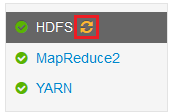

<properties
    pageTitle="Habilitar despejos de pilha Hadoop nos serviços HDInsight | Microsoft Azure"
    description="Habilite despejos de pilha para serviços de Hadoop de HDInsight baseados em Linux clusters para análise e depuração."
    services="hdinsight"
    documentationCenter=""
    authors="Blackmist"
    manager="jhubbard"
    editor="cgronlun"
    tags="azure-portal"/>

<tags
    ms.service="hdinsight"
    ms.workload="big-data"
    ms.tgt_pltfrm="na"
    ms.devlang="na"
    ms.topic="article"
    ms.date="09/27/2016"
    ms.author="larryfr"/>

#Habilitar despejos de pilha Hadoop nos serviços baseados em Linux HDInsight (prévia)

[AZURE.INCLUDE [heapdump-selector](../../includes/hdinsight-selector-heap-dump.md)]

Despejos de pilha conter um instantâneo da memória do aplicativo, incluindo os valores de variáveis no momento que o despejo foi criado. Para que elas fiquem muito útil para diagnosticar problemas que ocorrem em tempo de execução.

> [AZURE.NOTE] As informações neste artigo aplica-se somente ao HDInsight baseados em Linux. Para obter informações sobre HDInsight baseados no Windows, consulte [Ativar despejos de pilha Hadoop nos serviços HDInsight baseado no Windows](hdinsight-hadoop-collect-debug-heap-dumps.md)

## Serviços

Você pode ativar despejos de pilha para os seguintes serviços:

*  **hcatalog** - tempelton
*  **seção** - hiveserver2, metastore, derbyserver
*  **mapreduce** - jobhistoryserver
*  **fio colorido** - resourcemanager, nodemanager, timelineserver
*  **hdfs** - datanode, secondarynamenode, namenode

Você também pode habilitar despejos de pilha para o mapa e reduzir processos executou por HDInsight.

## Configuração de despejo de pilha de Noções básicas sobre

Despejos de pilha estão habilitados passando opções (às vezes conhecido como optar, ou parâmetros) à JVM quando um serviço é iniciado. Na maioria dos serviços de Hadoop, isso pode ser feito modificando o script do shell usado para iniciar o serviço.

Em cada script, há uma exportação para ** \* \_OPTS**, que contém as opções passadas à JVM. Por exemplo, no script **hadoop-env.sh** , a linha que começa com `export HADOOP_NAMENODE_OPTS=` contém as opções para o serviço de NameNode.

Mapear e reduzir processos são ligeiramente diferentes, já que esses são um processo filho do serviço MapReduce. Cada mapa ou reduzir processo é executado em um contêiner de filho e não existem duas entradas que contêm as opções de JVM para essas. Ambos contidos em **mapred-site.xml**:

* **MapReduce.Admin.map.Child.Java.opts**
* **MapReduce.Admin.reduce.Child.Java.opts**

> [AZURE.NOTE] É recomendável usar Ambari para modificar os scripts e configurações de mapred-site.xml, conforme Ambari tratará replicar alterações em nós do cluster. Consulte a seção de [Usando Ambari](#using-ambari) para etapas específicas.

###Habilitar despejos de pilha

A opção a seguir permite despejos de pilha quando ocorre um OutOfMemoryError:

    -XX:+HeapDumpOnOutOfMemoryError

O **+** indica que esta opção está habilitada. O padrão é desativado.

> [AZURE.WARNING] Despejos de pilha não estão ativados para os serviços do Hadoop HDInsight por padrão, como os arquivos de despejo podem ser grandes. Se você ativá-los para solução de problemas, lembre-se de desabilitá-las depois reproduzir o problema e reunidas os arquivos de despejo.

###Despejar local

O local padrão para o arquivo de despejo é o diretório de trabalho atual. Você pode controlar onde o arquivo está armazenado usando a opção a seguir:

    -XX:HeapDumpPath=/path

Por exemplo, usando `-XX:HeapDumpPath=/tmp` fará com que os despejos sejam armazenados no diretório /tmp.

###Scripts

Você também pode disparar um script quando um **OutOfMemoryError** ocorre. Por exemplo, disparar uma notificação para que você saiba que o erro ocorreu. Isso é controlado usando a opção a seguir:

    -XX:OnOutOfMemoryError=/path/to/script

> [AZURE.NOTE] Como Hadoop é um sistema distribuído, qualquer script usado deve ser posicionado em todos os nós no cluster que o serviço é executado em.
>
> O script deve também estar em um local acessível pela conta do serviço é executado como e forneça permissões de execução. Por exemplo, convém armazenar scripts em `/usr/local/bin` e use `chmod go+rx /usr/local/bin/filename.sh` para conceder a leitura e permissões de execução.

##Usando Ambari

Para modificar a configuração de um serviço, use as seguintes etapas:

1. Abra a web Ambari da interface do usuário para o seu cluster. A URL será https://YOURCLUSTERNAME.azurehdinsight.net.

    Quando solicitado, autenticar para o site usando o nome da conta HTTP (padrão: administrador,) e a senha para o seu cluster.

    > [AZURE.NOTE] Você pode ser solicitado uma segunda vez por Ambari para o nome de usuário e senha. Em caso afirmativo, basta Insira novamente o mesmo nome de conta e a senha

2. Usando a lista de à esquerda, selecione Área de serviço que você deseja modificar. Por exemplo, **HDFS**. Na área central, selecione a guia **configurações** .

    

3. Usando a entrada de **filtro** , insira **opta**. Isso filtra a lista de itens de configuração apenas àquelas que contém o texto e é uma maneira rápida de encontrar o script do shell ou **modelo** que podem ser usadas para definir essas opções.

    

4. Encontre o ** \* \_OPTS** entrada para o serviço que você deseja habilitar despejos de pilha para e adicionar as opções que você deseja ativar. Na imagem a seguir, eu adicionei `-XX:+HeapDumpOnOutOfMemoryError -XX:HeapDumpPath=/tmp/` para o **HADOOP\_NAMENODE\_OPTS** entrada:

    

    > [AZURE.NOTE] Quando pilha habilitação descarta para o mapa ou reduzir processo filho, você em vez disso, procure os campos rotuladas **mapreduce.admin.map.child.java.opts** e **mapreduce.admin.reduce.child.java.opts**.

    Use o botão **Salvar** para salvar as alterações. Você poderá inserir uma anotação breve descrevendo as alterações.

5. Depois que as alterações foram aplicadas, o ícone de **Reiniciar necessários** aparecerá ao lado de um ou mais serviços.

    

6. Selecione cada serviço que precisa ser reiniciado e use o botão **Ações de serviço** para **Ativar no modo de manutenção**. Isso impede que alertas sendo gerada desse serviço quando você reiniciá-lo.

    

7. Uma vez que você tiver habilitado o modo de manutenção, use o botão **Reiniciar** para o serviço **Reinicie todos os afetado**

    

    > [AZURE.NOTE] as entradas para o botão **Reiniciar** podem ser diferentes para outros serviços.

8. Depois de tem sido reiniciados os serviços, use o botão **Ações de serviço** para **Ativar desativar o modo de manutenção**. Este Ambari para reiniciar o monitoramento de alertas para o serviço.
