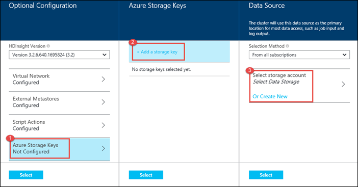

<properties
   pageTitle="Criar clusters Hadoop em HDInsight | Microsoft Azure"
    description="Aprenda a criar clusters para Azurehdinsight usando o Portal do Azure."
   services="hdinsight"
   documentationCenter=""
   tags="azure-portal"
   authors="mumian"
   manager="jhubbard"
   editor="cgronlun"/>

<tags
   ms.service="hdinsight"
   ms.devlang="na"
   ms.topic="article"
   ms.tgt_pltfrm="na"
   ms.workload="big-data"
   ms.date="09/02/2016"
   ms.author="jgao"/>

# Criar clusters baseados no Windows Hadoop em HDInsight usando o Portal do Azure

[AZURE.INCLUDE [selector](../../includes/hdinsight-selector-create-clusters.md)]

Aprenda a criar um cluster de Hadoop em HDInsight usando o Portal do Azure. O Microsoft [Azure portal](../azure-portal-overview.md) é um local central onde você pode provisionar e gerenciar seus recursos Azure. Portal Azure é uma das ferramentas que você pode usar para criar baseado em Linux ou Windows cluster Hadoop em HDInsight. Para a criação de cluster outros recursos e ferramentas clique em selecionar a guia na parte superior desta página ou consulte [métodos de criação de Cluster](hdinsight-provision-clusters.md#cluster-creation-methods).

##Pré-requisitos:

[AZURE.INCLUDE [delete-cluster-warning](../../includes/hdinsight-delete-cluster-warning.md)]

Antes de começar as instruções neste artigo, você deve ter o seguinte:

- Uma assinatura do Azure. Consulte [avaliação gratuita do Azure obter](https://azure.microsoft.com/documentation/videos/get-azure-free-trial-for-testing-hadoop-in-hdinsight/).

### Requisitos de controle de acesso

[AZURE.INCLUDE [access-control](../../includes/hdinsight-access-control-requirements.md)]

## Criar clusters

**Para criar um cluster de HDInsight**

1. Entre [Portal do Azure](https://portal.azure.com).
2. Clique em **novo**, clique em **Análise de dados**e clique em **HDInsight**.

    ![Criar um novo cluster no Portal do Azure] (./media/hdinsight-provision-clusters/HDI.CreateCluster.1.png "Criar um novo cluster no Portal do Azure")

3. Digite ou selecione os valores a seguir:

    * **Nome do cluster**: insira um nome para o cluster. Uma marca de seleção verde aparecerá ao lado do nome de cluster se o nome está disponível.

    * **Tipo de cluster**: selecione **Hadoop**. Outras opções inclue **HBase**, **tempestade**e **Spark**.

        > [AZURE.IMPORTANT] HDInsight clusters ocorrer em uma variedade de tipos, que correspondem a carga de trabalho ou a tecnologia que o cluster é ajustado para. Não haverá nenhum método com suporte para criar um cluster que combina vários tipos, como tempestade e HBase em um cluster.

    * **Sistema operacional de cluster**: selecione **Windows**. Para criar um cluster de Linux-base, selecione **Linux**.
    * **Versão**: ver [versões HDInsight](hdinsight-component-versioning.md).
    * **Assinatura**: selecione a assinatura Azure que será usada para criar este cluster.
    * **Grupo de recursos**: selecione uma existente ou crie um novo grupo de recursos. Essa entrada padrão será um de seus grupos de recursos existentes, se estiverem disponíveis.
    * **Credenciais**: configurar o nome de usuário e a senha do usuário do Hadoop (usuário HTTP). Se você habilitar a área de trabalho remota para o cluster, você precisará configurar o nome de usuário de desktop remoto de usuário e senha e uma data de validade de conta. Na parte inferior para salvar as alterações, clique em **Selecionar** .

        ![Fornecer credenciais de cluster] (./media/hdinsight-provision-clusters/HDI.CreateCluster.3.png "Fornecer credenciais de cluster")

    * **Fonte de dados**: criar um novo ou selecione uma conta de armazenamento do Azure existente a ser usado como o sistema de arquivo padrão para o cluster.

        ![Blade de fonte de dados] (./media/hdinsight-provision-clusters/HDI.CreateCluster.4.png "Configuração de fonte de dados de fornecer")

        * **Método de seleção**: defina **de todas as assinaturas** para habilitar a navegação de contas de armazenamento de todas as suas assinaturas. Defina esta **Acessar** a chave se desejar inserir o **Nome de armazenamento** e uma **Tecla de acesso** de uma conta de armazenamento existente.
        * **Selecione conta de armazenamento / criar novo**: clique em **Selecione a conta de armazenamento** para procurar e selecione uma conta de armazenamento existente que você deseja associar o cluster. Ou, clique em **Criar novo** para criar uma nova conta de armazenamento. Use o campo que aparece para digitar o nome da conta de armazenamento. Uma marca de seleção verde aparecerá se o nome está disponível.
        * **Escolha o contêiner de padrão**: Use este comando para inserir o nome do contêiner padrão a ser usado para o cluster. Enquanto você pode inserir qualquer nome aqui, é recomendável usar o mesmo nome como cluster para que você possa reconhecer facilmente que o contêiner é usado para este cluster específico.
        * **Local**: A região geográfica que a conta de armazenamento no ou será criada em. Esse local determinará a localização de cluster.  O cluster e sua conta de armazenamento padrão conjunta devem localizar no mesmo Azure data center.
    
    * **Níveis de preços de nó**: defina o número de nós de trabalho que você precisa para o cluster. O custo estimado do cluster será mostrado dentro a lâmina.
  

        ![Lâmina de níveis de preços de nó] (./media/hdinsight-provision-clusters/HDI.CreateCluster.5.png "Especificar o número de nós de cluster")

    * **Configuração opcional** para selecionar a versão de cluster, bem como definir outras configurações opcionais, como ingressar em uma **Rede Virtual**, configurando um **Metastore externo** para armazenar dados de seção e Oozie, usar ações de Script para personalizar um cluster para instalar componentes personalizados ou usar contas de armazenamento adicional com o cluster.

    * **Versão do HDInsight**: selecione a versão que você deseja usar para o cluster. Para obter mais informações, consulte [versões de cluster HDInsight](hdinsight-component-versioning.md).
    * **Rede virtual**: selecione uma rede virtual Azure e a sub-rede se quiser colocar o cluster em uma rede virtual.  

        ![Blade de rede virtual] (./media/hdinsight-provision-clusters/HDI.CreateCluster.6.png "Especificar detalhes de rede virtual")

        Para obter informações sobre como usar HDInsight com uma rede Virtual, incluindo os requisitos de configuração específica da rede Virtual, consulte [capbilities HDInsight estender usando uma rede Virtual do Azure](hdinsight-extend-hadoop-virtual-network.md).
  

        
    * **Metastores externo**: Especifique um banco de dados do SQL Azure para armazenar metadados de seção e Oozie associado ao cluster.
 
        > [AZURE.NOTE] Configuração de Metastore não está disponível para os tipos de cluster HBase.

    ![Blade de metastores personalizado] (./media/hdinsight-provision-clusters/HDI.CreateCluster.7.png "Especificar externos metastores")

    Para **usar um banco de dados existente do SQL para seção** metadados, clique em **Sim**, selecione um banco de dados do SQL e fornecer o nome de usuário/senha do banco de dados. Repita essas etapas se você quiser **usar um banco de dados existente do SQL para Oozie metadados**. Clique em **Selecionar** até voltar para a lâmina de **Configuração opcional** .

    >[AZURE.NOTE] O banco de dados do SQL Azure usado para o metastore deve permitir conectividade com outros serviços do Azure, incluindo Azurehdinsight. No painel de banco de dados SQL Azure, no lado direito, clique no nome do servidor. Este é o servidor no qual a instância de banco de dados do SQL está em execução. Uma vez que você está no modo de exibição do servidor, clique em **Configurar**e para os **Serviços do Azure**, clique em **Sim**e clique em **Salvar**.

            &nbsp;

            > [AZURE.IMPORTANT] Ao criar um metastore, não use um nome de banco de dados que contenha traços ou hifens, pois isso pode causar o processo de criação de cluster falha.
        
        * **Script Actions** if you want to use a custom script to customize a cluster, as the cluster is being created. For more information about script actions, see [Customize HDInsight clusters using Script Action](hdinsight-hadoop-customize-cluster.md). On the Script Actions blade provide the details as shown in the screen capture.
    

            

        * **Azure Storage Keys**: Specify additional storage accounts to associate with the cluster. In the **Azure Storage Keys** blade, click **Add a storage key**, and then select an existing storage account or create a new account.
    

            

4. Clique em **criar**. Selecionar o **Pin para Startboard** adicionará um bloco para cluster para o Startboard de seu Portal. O ícone indicará que o cluster está sendo criado e mudará para exibir o ícone de HDInsight após a conclusão da criação.
    
    Levará algum tempo para o cluster seja criado, geralmente cerca de 15 minutos. Use o bloco na Startboard ou a entrada de **notificações** no lado esquerdo da página para verificar o processo de provisionamento.
    

5. Uma vez concluída a criação, clique no bloco para o cluster do Startboard para iniciar a lâmina de cluster. A lâmina de cluster fornece informações essenciais sobre o cluster como o nome, o grupo de recursos que ele pertence, o local, o sistema operacional, a URL para o painel de controle de cluster, etc.

    ![Blade de cluster] (./media/hdinsight-provision-clusters/HDI.Cluster.Blade.png "Propriedades do cluster")

    Use o seguinte para entender os ícones na parte superior deste blade e na seção **Essentials** :

    * **Configurações** e **Todas as configurações**: exibe a lâmina de **configurações** para o cluster, que permite que você acesse informações detalhadas de configuração para o cluster.
    * **Painel de controle**, **Cluster Dashboard**e **URL**: estas são todas as maneiras de acessar o painel de cluster, que é um portal da Web para executar trabalhos no cluster.
    * **Área de trabalho remota**: permite que você habilitar/desabilitar a área de trabalho remota em nós do cluster.
    * **Cluster de escala**: permite que você altere o número de nós de trabalho para esse cluster.
    * **Excluir**: exclui o cluster HDInsight.
    * **Início rápido** (): exibe as informações que ajudarão você a começar a usar o HDInsight.
    * **Usuários** (): permite que você defina permissões para _gerenciamento de portal_ desse cluster para outros usuários na sua assinatura do Azure.
    

        > [AZURE.IMPORTANT] Este _só_ afeta as permissões para esse cluster no Portal e acesso e não tem efeito sobre quem pode se conectar ao ou enviar trabalhos ao cluster HDInsight.
        
    * **Marcas** (): marcas permite que você defina pares de chave/valor para definir uma taxonomia personalizada dos seus serviços de nuvem. Por exemplo, você pode criar uma chave chamada __project__e, em seguida, use um valor em comum para todos os serviços associados a um projeto específico.

##Personalizar clusters

- Consulte [Personalizar HDInsight clusters usando inicialização](hdinsight-hadoop-customize-cluster-bootstrap.md).
- Consulte [clusters baseados no Windows personalizar HDInsight usando a ação de Script](hdinsight-hadoop-customize-cluster.md).

##Próximas etapas
Neste artigo, você aprendeu várias maneiras de criar um cluster de HDInsight. Para saber mais, consulte os seguintes artigos:

* [Introdução ao Azure HDInsight](hdinsight-hadoop-linux-tutorial-get-started.md) - Saiba como começar a trabalhar com seu cluster HDInsight
* [Enviar Hadoop trabalhos programaticamente](hdinsight-submit-hadoop-jobs-programmatically.md) - Aprenda a enviar programaticamente trabalhos ao HDInsight
* [Gerenciar clusters Hadoop em HDInsight usando o Portal do Azure](hdinsight-administer-use-management-portal.md)

