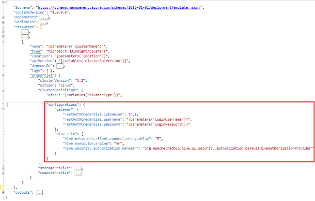

<properties
    pageTitle="Personalizar HDInsight Clusters usando inicialização | Microsoft Azure"
    description="Saiba como personalizar clusters HDInsight usando a inicialização."
    services="hdinsight"
    documentationCenter=""
    authors="mumian"
    manager="jhubbard"
    editor="cgronlun"
    tags="azure-portal"/>

<tags
    ms.service="hdinsight"
    ms.workload="big-data"
    ms.tgt_pltfrm="na"
    ms.devlang="na"
    ms.topic="article"
    ms.date="09/02/2016"
    ms.author="jgao"/>

# Personalizar HDInsight clusters usando inicialização

Às vezes, você deseja configurar os arquivos de configuração que incluem:

- clusterIdentity.xml
- núcleo-site.xml
- gateway.XML
- hbase-env.xml
- hbase-site.xml
- HDFS-site.xml
- seção env.xml
- seção site.xml
- site de mapred
- oozie-site.xml
- oozie-env.xml
- site.xml de tempestade
- tez-site.xml
- webhcat-site.xml
- fio colorido-site.xml

Os clusters não podem reter as alterações devido a imagem novamente. Para obter mais informações sobre imagens novamente, consulte [Função instância reiniciado devido à atualizações de sistema operacional](http://blogs.msdn.com/b/kwill/archive/2012/09/19/role-instance-restarts-due-to-os-upgrades.aspx). Para manter as alterações por meio de vida útil dos clusters, você pode usar a personalização de cluster HDInsight durante o processo de criação. Esta é a maneira recomendada para alterar as configurações de um cluster e persistir entre esses eventos de reiniciar reinicialização nova imagem Azure. Essas alterações de configuração são aplicadas antes do início do serviço, para que os serviços não precisam ser reiniciados. 

Existem 3 métodos para usar a inicialização:

- Usar o PowerShell Azure

    [AZURE.INCLUDE [upgrade-powershell](../../includes/hdinsight-use-latest-powershell.md)]
    
- Usar o SDK do .NET
- Usar o Gerenciador de recursos do Azure modelo

Para obter informações sobre como instalar componentes adicionais em cluster HDInsight durante a hora de criação, consulte:

- [Personalizar clusters HDInsight usando a ação de Script (Linux)](hdinsight-hadoop-customize-cluster-linux.md)
- [Personalizar clusters HDInsight usando a ação de Script (Windows)](hdinsight-hadoop-customize-cluster.md)

## Usar o PowerShell Azure

O seguinte código do PowerShell personaliza uma configuração de seção:

    # hive-site.xml configuration
    $hiveConfigValues = @{ "hive.metastore.client.socket.timeout"="90" }
    
    $config = New-AzureRmHDInsightClusterConfig `
        | Set-AzureRmHDInsightDefaultStorage `
            -StorageAccountName "$defaultStorageAccountName.blob.core.windows.net" `
            -StorageAccountKey $defaultStorageAccountKey `
        | Add-AzureRmHDInsightConfigValues `
            -HiveSite $hiveConfigValues 
    
    New-AzureRmHDInsightCluster `
        -ResourceGroupName $existingResourceGroupName `
        -ClusterName $clusterName `
        -Location $location `
        -ClusterSizeInNodes $clusterSizeInNodes `
        -ClusterType Hadoop `
        -OSType Windows `
        -Version "3.2" `
        -HttpCredential $httpCredential `
        -Config $config 

Um script PowerShell de trabalho completo pode ser encontrado no [Apêndice-A](#hdinsight-hadoop-customize-cluster-bootstrap.md/appx-a:-powershell-sample).

**Para verificar a alteração:**

1. Entre [portal do Azure](https://portal.azure.com).
2. No painel esquerdo, clique em **Procurar**e, em seguida, clique em **Clusters de HDInsight**.
3. Clique no cluster que você acabou de criar usando o script do PowerShell.
4. Clique em **Painel de controle** da parte superior da lâmina para abrir a Ambari UI.
5. No menu à esquerda, clique em **seção** .
6. Clique em **HiveServer2** de **Resumo**.
7. Clique na guia **configurações** .
8. No menu à esquerda, clique em **seção** .
9. Clique na guia **Avançado** .
10. Role para baixo e expanda **Avançado de sites de seção**.
11. Procure por **hive.metastore.client.socket.timeout** na seção.

Alguns exemplos mais sobre como personalizar a outros arquivos de configuração:

    # hdfs-site.xml configuration
    $HdfsConfigValues = @{ "dfs.blocksize"="64m" } #default is 128MB in HDI 3.0 and 256MB in HDI 2.1

    # core-site.xml configuration
    $CoreConfigValues = @{ "ipc.client.connect.max.retries"="60" } #default 50

    # mapred-site.xml configuration
    $MapRedConfigValues = @{ "mapreduce.task.timeout"="1200000" } #default 600000

    # oozie-site.xml configuration
    $OozieConfigValues = @{ "oozie.service.coord.normal.default.timeout"="150" }  # default 120

Para obter mais informações, consulte blog de Azim Uddin intitulado [criação de personalização HDInsight Cluster](http://blogs.msdn.com/b/bigdatasupport/archive/2014/04/15/customizing-hdinsight-cluster-provisioning-via-powershell-and-net-sdk.aspx).

## Usar o SDK do .NET

Consulte [baseados em Linux criar clusters em HDInsight usando o SDK do .NET](hdinsight-hadoop-create-linux-clusters-dotnet-sdk.md#use-bootstrap).

## Modelo de usar o Gerenciador de recursos

Você pode usar a inicialização no modelo do Gerenciador de recursos:

    "configurations": {
        …
        "hive-site": {
            "hive.metastore.client.connect.retry.delay": "5",
            "hive.execution.engine": "mr",
            "hive.security.authorization.manager": "org.apache.hadoop.hive.ql.security.authorization.DefaultHiveAuthorizationProvider"
        }
    }

## Consulte também

- [Criar clusters Hadoop no HDInsight] [ hdinsight-provision-cluster] fornece instruções sobre como criar um cluster de HDInsight usando outras opções personalizadas.
- [Desenvolver scripts de ação de Script para HDInsight][hdinsight-write-script]
- [Instalar e usar Spark em clusters de HDInsight][hdinsight-install-spark]
- [Instalar e usar R em clusters de HDInsight][hdinsight-install-r]
- [Instalar e usar clusters Solr em HDInsight](hdinsight-hadoop-solr-install.md).
- [Instalar e usar clusters Giraph em HDInsight](hdinsight-hadoop-giraph-install.md).

[hdinsight-install-spark]: hdinsight-hadoop-spark-install.md
[hdinsight-install-r]: hdinsight-hadoop-r-scripts.md
[hdinsight-write-script]: hdinsight-hadoop-script-actions.md
[hdinsight-provision-cluster]: hdinsight-provision-clusters.md
[powershell-install-configure]: powershell-install-configure.md

[img-hdi-cluster-states]: ./media/hdinsight-hadoop-customize-cluster/HDI-Cluster-state.png "Estágios durante a criação de cluster"

## Amostra de PowerShell AppX-r:

Este script do PowerShell cria um cluster de HDInsight e personaliza uma configuração de seção:

    ####################################
    # Set these variables
    ####################################
    #region - used for creating Azure service names
    $nameToken = "<ENTER AN ALIAS>" 
    #endregion

    #region - cluster user accounts
    $httpUserName = "admin"  #HDInsight cluster username
    $httpPassword = "<ENTER A PASSWORD>" #"<Enter a Password>"

    $sshUserName = "sshuser" #HDInsight ssh user name
    $sshPassword = "<ENTER A PASSWORD>" #"<Enter a Password>"
    #endregion

    ####################################
    # Service names and varialbes
    ####################################
    #region - service names
    $namePrefix = $nameToken.ToLower() + (Get-Date -Format "MMdd")

    $resourceGroupName = $namePrefix + "rg"
    $hdinsightClusterName = $namePrefix + "hdi"
    $defaultStorageAccountName = $namePrefix + "store"
    $defaultBlobContainerName = $hdinsightClusterName

    $location = "East US 2"
    #endregion

    # Treat all errors as terminating
    $ErrorActionPreference = "Stop"

    ####################################
    # Connect to Azure
    ####################################
    #region - Connect to Azure subscription
    Write-Host "`nConnecting to your Azure subscription ..." -ForegroundColor Green
    try{Get-AzureRmContext}
    catch{Login-AzureRmAccount}
    #endregion

    #region - Create an HDInsight cluster
    ####################################
    # Create dependent components
    ####################################
    Write-Host "Creating a resource group ..." -ForegroundColor Green
    New-AzureRmResourceGroup `
        -Name  $resourceGroupName `
        -Location $location

    Write-Host "Creating the default storage account and default blob container ..."  -ForegroundColor Green
    New-AzureRmStorageAccount `
        -ResourceGroupName $resourceGroupName `
        -Name $defaultStorageAccountName `
        -Location $location `
        -Type Standard_GRS

    $defaultStorageAccountKey = (Get-AzureRmStorageAccountKey `
                                    -ResourceGroupName $resourceGroupName `
                                    -Name $defaultStorageAccountName)[0].Value
    $defaultStorageContext = New-AzureStorageContext `
                                    -StorageAccountName $defaultStorageAccountName `
                                    -StorageAccountKey $defaultStorageAccountKey
    New-AzureStorageContainer `
        -Name $defaultBlobContainerName `
        -Context $defaultStorageContext #use the cluster name as the container name

    ####################################
    # Create a configuration object
    ####################################
    $hiveConfigValues = @{ "hive.metastore.client.socket.timeout"="90" }
        
    $config = New-AzureRmHDInsightClusterConfig `
        | Set-AzureRmHDInsightDefaultStorage `
            -StorageAccountName "$defaultStorageAccountName.blob.core.windows.net" `
            -StorageAccountKey $defaultStorageAccountKey `
        | Add-AzureRmHDInsightConfigValues `
            -HiveSite $hiveConfigValues 

    ####################################
    # Create an HDInsight cluster
    ####################################
    $httpPW = ConvertTo-SecureString -String $httpPassword -AsPlainText -Force
    $httpCredential = New-Object System.Management.Automation.PSCredential($httpUserName,$httpPW)

    $sshPW = ConvertTo-SecureString -String $sshPassword -AsPlainText -Force
    $sshCredential = New-Object System.Management.Automation.PSCredential($sshUserName,$sshPW)

    New-AzureRmHDInsightCluster `
        -ResourceGroupName $resourceGroupName `
        -ClusterName $hdinsightClusterName `
        -Location $location `
        -ClusterSizeInNodes 1 `
        -ClusterType Hadoop `
        -OSType Linux `
        -Version "3.2" `
        -HttpCredential $httpCredential `
        -SshCredential $sshCredential `
        -Config $config

    ####################################
    # Verify the cluster
    ####################################
    Get-AzureRmHDInsightCluster -ClusterName $hdinsightClusterName

    #endregion
