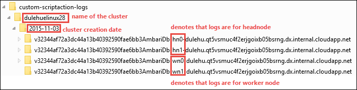

<properties
    pageTitle="Personalizar HDInsight clusters usando ações de script | Microsoft Azure"
    description="Saiba como adicionar componentes personalizados à clusters baseados em Linux HDInsight usando ações de Script. Ações de script são Bash scripts que em nós do cluster e pode ser usada para personalizar a configuração de cluster ou adicionar serviços adicionais e utilitários como o matiz, Solr ou R."
    services="hdinsight"
    documentationCenter=""
    authors="Blackmist"
    manager="jhubbard"
    editor="cgronlun"
    tags="azure-portal"/>

<tags
    ms.service="hdinsight"
    ms.workload="big-data"
    ms.tgt_pltfrm="na"
    ms.devlang="na"
    ms.topic="article"
    ms.date="09/06/2016"
    ms.author="larryfr"/>

# Personalizar clusters baseados em Linux HDInsight usando a ação de Script

HDInsight fornece uma opção de configuração chamada **Ação de Script** que invoca scripts personalizados que personalizar o cluster. Esses scripts podem ser usados durante a criação de cluster ou em um cluster já em execução e são usadas para instalar componentes adicionais ou alterar definições de configuração.

> [AZURE.NOTE] A capacidade de usar ações de script em um cluster já em execução só está disponível para clusters HDInsight baseados em Linux. Para obter informações sobre como usar ações de script com clusters baseados no Windows, consulte [Personalizar HDInsight clusters usando a ação de Script (Windows)](hdinsight-hadoop-customize-cluster.md).

Ações de script também podem ser publicadas do Azure Marketplace como um aplicativo de HDInsight. Alguns dos exemplos neste documento mostram como você pode instalar um aplicativo de HDInsight usando os comandos de ação de script do PowerShell e o SDK do .NET. Para obter mais informações sobre aplicativos de HDInsight, consulte [HDInsight publicar aplicativos em do Azure Marketplace](hdinsight-apps-publish-applications.md). 

## Noções básicas sobre ações de Script

Uma ação de Script é simplesmente um Bash script que você fornecer uma URL para e parâmetros para, e, em seguida, é executado em nós do cluster HDInsight. A seguir estão características e recursos de ações de script.

* Devem ser armazenados em um URI acessível do cluster HDInsight. Estes são possíveis locais de armazenamento:

    * Uma conta de armazenamento de blob que seja o armazenamento principal ou adicional conta para cluster HDInsight. Desde que HDInsight é concedido acesso a esses dois tipos de contas de armazenamento durante a criação de cluster, esses oferecem uma maneira de usar uma ação de script não público.
    
    * Um URI publicamente legível como um Azure Blob GitHub, OneDrive, Dropbox, etc.
    
    Para obter exemplos do URI de scripts armazenados no contêiner de blob (publicamente legível), consulte a seção de [scripts de ação de script de exemplo](#example-script-action-scripts) .

* Pode ser restrito a __executar em somente determinados tipos de nó__, nós por exemplo cabeçotes ou nós de trabalho.

    > [AZURE.NOTE] Quando usada com HDInsight Premium, você pode especificar que o script deve ser usado no nó borda.

* Pode ser __persistentes__ ou __ad-hoc__.

    Os scripts de __persistido__ são scripts que são aplicados a nós de trabalho e serão executado automaticamente no novos nós criado ao dimensionar um cluster.

    Um script persistente também pode aplicar alterações em outro tipo de nó, como um nó principal, mas de uma perspectiva de funcionalidade só é necessário um script persista é para que ela se aplica aos novos nós de trabalho criados quando um cluster é dimensionado check-out.

    > [AZURE.IMPORTANT] Ações de script persistentes devem ter um nome exclusivo.

    __Ad-hoc__ scripts não são mantidas; No entanto, você pode subsequentemente promover um script ad-hoc de um script persistente ou rebaixar um script persistente para um script ad-hoc.

    > [AZURE.IMPORTANT] Ações de script usadas durante a criação de cluster automaticamente são mantidas.
    >
    > Scripts que falhas não são persistentes, mesmo se você especificamente indicar que elas devem ser.

* Pode aceitar __parâmetros__ que são usados pelo script durante a execução.

* São executados com __privilégios de raiz__ em nós do cluster.

* Pode ser usado através do __portal do Azure__, __Azure PowerShell__, __Azure CLI__ou __HDInsight.NET SDK__

    [AZURE.INCLUDE [upgrade-powershell](../../includes/hdinsight-use-latest-powershell-cli-and-dotnet-sdk.md)]

Para ajudar a compreender quais scripts foram aplicados a um cluster e determinar que a identificação de scripts para promoção ou rebaixamento, cluster mantém um histórico de todos os scripts que foram executado.

> [AZURE.IMPORTANT] Não há nenhuma maneira automática de desfazer as alterações feitas por uma ação de script. Se você precisar reverter os efeitos de um script, você deve compreender quais alterações foram feitas e manualmente invertê-los (ou fornecer uma ação de script que inverte-los.)

### Ação de script do processo de criação de cluster

Ações de script usadas durante a criação de cluster são um pouco diferentes de script ações executadas em um cluster existente:

* O script é __mantido automaticamente__.

* Uma __Falha__ no script pode causar o processo de criação de cluster falha.

O diagrama a seguir ilustra quando a ação de Script é executada durante o processo de criação:

![Personalização de cluster HDInsight e estágios durante a criação de cluster][img-hdi-cluster-states]

O script é executado enquanto HDInsight está sendo configurado. Neste estágio, o script é executado em paralelo em todos os nós especificado no cluster e é executado com privilégios de raiz em nós.

> [AZURE.NOTE] Porque o script é executado com privilégios de nível raiz em nós do cluster, você pode realizar operações como parar e iniciar serviços, incluindo serviços relacionados a Hadoop. Se você interromper serviços, você deve garantir que o serviço de Ambari e outros serviços relacionados Hadoop estejam em execução antes do script terminar a execução. Esses serviços são necessários para determinar com êxito a integridade e o estado do cluster enquanto ele está sendo criado.

Durante a criação de cluster, você pode especificar várias ações de script que são chamadas na ordem em que eles foram especificados.

> [AZURE.IMPORTANT] Ações de script devem ser concluídas em 60 minutos ou que eles serão tempo limite. Durante a configuração de cluster, o script é executado simultaneamente com outros processos de instalação e configuração. Concorrência para recursos como largura de banda hora ou rede CPU pode causar o script para levar mais tempo para concluir do que no seu ambiente de desenvolvimento.
>
> Para minimizar o tempo necessário para executar o script, evite tarefas como baixar e compilar aplicativos de fonte. Em vez disso, pré-compilar o aplicativo e armazene o binário no armazenamento de Blob do Azure para que ele pode ser baixado rapidamente ao cluster.

###Ação de script em um cluster em execução

Ao contrário de script ações usadas durante a criação de cluster, uma falha em um script executadas em um cluster já em execução não automaticamente causa cluster alterar para um estado de falha. Quando um script for concluída, o cluster deve retornar a um estado "executando".

> [AZURE.IMPORTANT] Isso não significa que seu cluster em execução é imune a scripts que fazem coisas ruins. Por exemplo, um script foi possível excluir arquivos necessários pelo cluster, alterar configuração para que os serviços falhar, etc.
>
> Ações de scripts executados com privilégios de raiz, portanto você deve certificar-se de que você entende o que significa um script antes de aplicá-lo ao seu cluster.

Ao aplicar um script a um cluster, o estado do cluster alterar para de __execução__ para __aceitos__, em seguida, __configuração de HDInsight__e finalmente, de volta para __Executar__ scripts bem-sucedido. O status de script é registrado no histórico de ação de script, e você pode usar isso para determinar se o script foi bem-sucedida ou falha. Por exemplo, o `Get-AzureRmHDInsightScriptActionHistory` cmdlet do PowerShell pode ser usado para exibir o status de um script. Ele retornará informações similar ao seguinte:

    ScriptExecutionId : 635918532516474303
    StartTime         : 2/23/2016 7:40:55 PM
    EndTime           : 2/23/2016 7:41:05 PM
    Status            : Succeeded

> [AZURE.NOTE] Se você tiver alterado a senha do usuário (admin) cluster após o agrupamento foi criado, isso pode causar script executou ações contra este cluster falha. Se você tiver quaisquer ações de script persistentes que nós de trabalho de destino, esses podem falhar quando você adiciona nós ao cluster por meio de redimensionar operações.

## Scripts de ação de Script de exemplo

Scripts de ação de script podem ser usados com o portal do Azure, Azure PowerShell, Azure CLI ou o SDK do .NET HDInsight. HDInsight fornece scripts para instalar os seguintes componentes em clusters de HDInsight:

Nome | Script
----- | -----
**Adicionar uma conta de armazenamento do Azure** | https://hdiconfigactions.blob.Core.Windows.NET/linuxaddstorageaccountv01/Add-Storage-Account-v01.sh. Consulte [Aplicar uma ação de Script para um cluster em execução](#apply-a-script-action-to-a-running-cluster).
**Instalar o matiz** | https://hdiconfigactions.blob.Core.Windows.NET/linuxhueconfigactionv02/Install-Hue-uber-v02.sh. Consulte [instalar e usar o matiz em HDInsight clusters](hdinsight-hadoop-hue-linux.md).
**Instalar R** | https://hdiconfigactions.blob.Core.Windows.NET/linuxrconfigactionv01/r-Installer-v01.sh. Consulte [instalação e uso R em clusters de HDInsight](hdinsight-hadoop-r-scripts-linux.md).
**Instalar o Solr** | https://hdiconfigactions.blob.Core.Windows.NET/linuxsolrconfigactionv01/solr-Installer-v01.sh. Consulte [instalação e uso Solr em HDInsight clusters](hdinsight-hadoop-solr-install-linux.md).
**Instalar o Giraph** | https://hdiconfigactions.blob.Core.Windows.NET/linuxgiraphconfigactionv01/giraph-Installer-v01.sh. Consulte [instalação e uso Giraph em HDInsight clusters](hdinsight-hadoop-giraph-install-linux.md).
| **Pré-carregar bibliotecas de seção** | https://hdiconfigactions.blob.Core.Windows.NET/linuxsetupcustomhivelibsv01/Setup-customhivelibs-v01.sh. Consulte [Adicionar seção bibliotecas em clusters de HDInsight](hdinsight-hadoop-add-hive-libraries.md) |

## Usar uma ação de Script durante a criação de cluster

Esta seção fornece exemplos sobre as diferentes maneiras que você pode usar ações de script ao criar um cluster de HDInsight - Azure no portal do, usando um modelo do Gerenciador de recursos do Azure, usando CMDlets do PowerShell e usando o SDK do .NET.

### Usar uma ação de Script durante a criação de cluster do portal do Azure

1. Começar a criar um cluster, conforme descrito em [Hadoop criar clusters no HDInsight](hdinsight-provision-clusters.md#portal).

2. Em __Configuração opcional__, para a lâmina de **Ações de Script** , clique em **Adicionar ação de script** para fornecer detalhes sobre a ação de script, conforme mostrado abaixo:

    

  	| Propriedade | Valor |
  	| -------- | ----- |
  	| Nome | Especifique um nome para a ação de script. |
  	| Script URI | Especifique o URI para o script que é invocado para personalizar o cluster. |
  	| Cabeça/trabalhador | Especifica os nós (**cabeça**, **trabalho**ou **ZooKeeper**) no qual o script de personalização é executado. |
  	| Parâmetros | Especifique os parâmetros, se necessário pelo script. |

    Pressione ENTER para adicionar mais de uma ação de script para instalar vários componentes em cluster.

3. Clique em **Selecionar** para salvar a configuração e continuar com a criação de cluster.

### Usar uma ação de Script a partir de modelos do Gerenciador de recursos do Azure

Nesta seção, podemos usar modelos de Gerenciador de recursos do Azure para criar um cluster de HDInsight e também usar uma ação de script para instalar componentes personalizados (R, neste exemplo) no cluster. Esta seção fornece uma amostra de modelo para criar um cluster usando a ação de script.

> [AZURE.NOTE] As etapas desta seção demonstram criando um cluster usando uma ação de script. Para obter um exemplo de criação de um cluster de um modelo usando um aplicativo de HDInsight, consulte [instalar aplicativos personalizados de HDInsight](hdinsight-apps-install-custom-applications.md).

#### Antes de começar

* Para obter informações sobre como configurar uma estação de trabalho para executar cmdlets do HDInsight Powershell, consulte [instalar e configurar o Azure PowerShell](../powershell-install-configure.md).
* Para obter instruções sobre como criar modelos, consulte [modelos de coautoria Gerenciador de recursos do Azure](../resource-group-authoring-templates.md).
* Se você ainda não utilizou Azure PowerShell com o Gerenciador de recursos, consulte [Usando o PowerShell Azure com o Gerenciador de recursos do Azure](../powershell-azure-resource-manager.md).

#### Criar clusters usando a ação de Script

1. Copie o seguinte modelo para um local no seu computador. Este modelo instala Giraph na headnodes, além de nós de trabalhador no cluster. Você também pode verificar se o modelo JSON é válido. Cole o conteúdo do modelo [JSONLint](http://jsonlint.com/), uma ferramenta de validação de JSON online.

            {
            "$schema": "http://schema.management.azure.com/schemas/2015-01-01/deploymentTemplate.json#",
            "contentVersion": "1.0.0.0",
            "parameters": {
                "clusterLocation": {
                    "type": "string",
                    "defaultValue": "West US",
                    "allowedValues": [ "West US" ]
                },
                "clusterName": {
                    "type": "string"
                },
                "clusterUserName": {
                    "type": "string",
                    "defaultValue": "admin"
                },
                "clusterUserPassword": {
                    "type": "securestring"
                },
                "sshUserName": {
                    "type": "string",
                    "defaultValue": "username"
                },
                "sshPassword": {
                    "type": "securestring"
                },
                "clusterStorageAccountName": {
                    "type": "string"
                },
                "clusterStorageAccountResourceGroup": {
                    "type": "string"
                },
                "clusterStorageType": {
                    "type": "string",
                    "defaultValue": "Standard_LRS",
                    "allowedValues": [
                        "Standard_LRS",
                        "Standard_GRS",
                        "Standard_ZRS"
                    ]
                },
                "clusterStorageAccountContainer": {
                    "type": "string"
                },
                "clusterHeadNodeCount": {
                    "type": "int",
                    "defaultValue": 1
                },
                "clusterWorkerNodeCount": {
                    "type": "int",
                    "defaultValue": 2
                }
            },
            "variables": {
            },
            "resources": [
                {
                    "name": "[parameters('clusterStorageAccountName')]",
                    "type": "Microsoft.Storage/storageAccounts",
                    "location": "[parameters('clusterLocation')]",
                    "apiVersion": "2015-05-01-preview",
                    "dependsOn": [ ],
                    "tags": { },
                    "properties": {
                        "accountType": "[parameters('clusterStorageType')]"
                    }
                },
                {
                    "name": "[parameters('clusterName')]",
                    "type": "Microsoft.HDInsight/clusters",
                    "location": "[parameters('clusterLocation')]",
                    "apiVersion": "2015-03-01-preview",
                    "dependsOn": [
                        "[concat('Microsoft.Storage/storageAccounts/', parameters('clusterStorageAccountName'))]"
                    ],
                    "tags": { },
                    "properties": {
                        "clusterVersion": "3.2",
                        "osType": "Linux",
                        "clusterDefinition": {
                            "kind": "hadoop",
                            "configurations": {
                                "gateway": {
                                    "restAuthCredential.isEnabled": true,
                                    "restAuthCredential.username": "[parameters('clusterUserName')]",
                                    "restAuthCredential.password": "[parameters('clusterUserPassword')]"
                                }
                            }
                        },
                        "storageProfile": {
                            "storageaccounts": [
                                {
                                    "name": "[concat(parameters('clusterStorageAccountName'),'.blob.core.windows.net')]",
                                    "isDefault": true,
                                    "container": "[parameters('clusterStorageAccountContainer')]",
                                    "key": "[listKeys(resourceId('Microsoft.Storage/storageAccounts', parameters('clusterStorageAccountName')), '2015-05-01-preview').key1]"
                                }
                            ]
                        },
                        "computeProfile": {
                            "roles": [
                                {
                                    "name": "headnode",
                                    "targetInstanceCount": "[parameters('clusterHeadNodeCount')]",
                                    "hardwareProfile": {
                                        "vmSize": "Large"
                                    },
                                    "osProfile": {
                                        "linuxOperatingSystemProfile": {
                                            "username": "[parameters('sshUserName')]",
                                            "password": "[parameters('sshPassword')]"
                                        }
                                    },
                                    "scriptActions": [
                                        {
                                            "name": "installGiraph",
                                            "uri": "https://hdiconfigactions.blob.core.windows.net/linuxgiraphconfigactionv01/giraph-installer-v01.sh",
                                            "parameters": ""
                                        }
                                    ]
                                },
                                {
                                    "name": "workernode",
                                    "targetInstanceCount": "[parameters('clusterWorkerNodeCount')]",
                                    "hardwareProfile": {
                                        "vmSize": "Large"
                                    },
                                    "osProfile": {
                                        "linuxOperatingSystemProfile": {
                                            "username": "[parameters('sshUserName')]",
                                            "password": "[parameters('sshPassword')]"
                                        }
                                    },
                                    "scriptActions": [
                                        {
                                            "name": "installR",
                                            "uri": "https://hdiconfigactions.blob.core.windows.net/linuxrconfigactionv01/r-installer-v01.sh",
                                            "parameters": ""
                                        }
                                    ]
                                }
                            ]
                        }
                    }
                }
            ],
            "outputs": {
                "cluster":{
                    "type" : "object",
                    "value" : "[reference(resourceId('Microsoft.HDInsight/clusters',parameters('clusterName')))]"
                }
            }
        }

2. Inicie o Azure PowerShell e faça logon em sua conta do Azure. Depois de fornecer suas credenciais, o comando retorna informações sobre sua conta.

        Add-AzureRmAccount

        Id                             Type       ...
        --                             ----
        someone@example.com            User       ...

3. Se você tiver várias assinaturas, forneça a identificação de assinatura que você deseja usar para implantação.

        Select-AzureRmSubscription -SubscriptionID <YourSubscriptionId>

    > [AZURE.NOTE] Você pode usar `Get-AzureRmSubscription` para obter uma lista de todas as assinaturas associada a sua conta, que inclui a Id de inscrição para cada um deles.

5. Se você não tiver um grupo de recursos existentes, crie um novo grupo de recursos. Fornece o nome do grupo de recursos e local que você precisa para sua solução. Um resumo do novo grupo de recursos é retornado.

        New-AzureRmResourceGroup -Name myresourcegroup -Location "West US"

        ResourceGroupName : myresourcegroup
        Location          : westus
        ProvisioningState : Succeeded
        Tags              :
        Permissions       :
                            Actions  NotActions
                            =======  ==========
                            *
        ResourceId        : /subscriptions/######/resourceGroups/ExampleResourceGroup

6. Para criar uma nova implantação para seu grupo de recursos, execute o comando **New-AzureRmResourceGroupDeployment** e forneça os parâmetros necessários. Os parâmetros incluirá um nome para sua implantação, o nome do seu grupo de recursos e o caminho ou a URL para o modelo que você criou. Se seu modelo requer os parâmetros, você deve passar esses parâmetros também. Nesse caso, a ação de script instalar R em cluster não exige quaisquer parâmetros.

        New-AzureRmResourceGroupDeployment -Name mydeployment -ResourceGroupName myresourcegroup -TemplateFile <PathOrLinkToTemplate>

    Você será solicitado a fornecer valores para os parâmetros definidos no modelo.

7. Quando o grupo de recursos tiver sido implantado, você verá um resumo da implantação.

          DeploymentName    : mydeployment
          ResourceGroupName : myresourcegroup
          ProvisioningState : Succeeded
          Timestamp         : 8/17/2015 7:00:27 PM
          Mode              : Incremental
          ...

8. Se sua implantação falhar, você pode usar os seguintes cmdlets para obter informações sobre as falhas.

        Get-AzureRmResourceGroupDeployment -ResourceGroupName myresourcegroup -ProvisioningState Failed

### Usar uma ação de Script durante a criação de cluster do PowerShell do Azure

Nesta seção, usamos o cmdlet [Add-AzureRmHDInsightScriptAction](https://msdn.microsoft.com/library/mt603527.aspx) para chamar scripts usando a ação de Script para personalizar um cluster. Antes de prosseguir, certifique-se de ter instalado e configurado o Azure PowerShell. Para obter informações sobre como configurar uma estação de trabalho para executar cmdlets do HDInsight PowerShell, consulte [instalar e configurar o Azure PowerShell](../powershell-install-configure.md).

Execute as seguintes etapas:

1. Abra o console do PowerShell do Azure e use o seguinte para efetuar login à sua assinatura do Azure e declarar algumas variáveis do PowerShell:

        # LOGIN TO ZURE
        Login-AzureRmAccount

        # PROVIDE VALUES FOR THESE VARIABLES
        $subscriptionId = "<SubscriptionId>"        # ID of the Azure subscription
        $clusterName = "<HDInsightClusterName>"         # HDInsight cluster name
        $storageAccountName = "<StorageAccountName>"    # Azure storage account that hosts the default container
        $storageAccountKey = "<StorageAccountKey>"      # Key for the storage account
        $containerName = $clusterName
        $location = "<MicrosoftDataCenter>"             # Location of the HDInsight cluster. It must be in the same data center as the storage account.
        $clusterNodes = <ClusterSizeInNumbers>          # The number of nodes in the HDInsight cluster.
        $resourceGroupName = "<ResourceGroupName>"      # The resource group that the HDInsight cluster will be created in

2. Especifique os valores de configuração (como nós no cluster) e o armazenamento de padrão a ser usado.

        # SPECIFY THE CONFIGURATION OPTIONS
        Select-AzureRmSubscription -SubscriptionId $subscriptionId
        $config = New-AzureRmHDInsightClusterConfig
        $config.DefaultStorageAccountName="$storageAccountName.blob.core.windows.net"
        $config.DefaultStorageAccountKey=$storageAccountKey

3. Use o cmdlet **Add-AzureRmHDInsightScriptAction** para chamar o script. O exemplo a seguir usa um script que instala Giraph no cluster:

        # INVOKE THE SCRIPT USING THE SCRIPT ACTION FOR HEADNODE AND WORKERNODE
        $config = Add-AzureRmHDInsightScriptAction -Config $config -Name "Install Giraph"  -NodeType HeadNode -Uri https://hdiconfigactions.blob.core.windows.net/linuxgiraphconfigactionv01/giraph-installer-v01.sh
        $config = Add-AzureRmHDInsightScriptAction -Config $config -Name "Install Giraph"  -NodeType WorkerNode -Uri https://hdiconfigactions.blob.core.windows.net/linuxgiraphconfigactionv01/giraph-installer-v01.sh

    O cmdlet **Add-AzureRmHDInsightScriptAction** usa os seguintes parâmetros:

  	| Parâmetro | Definição |
  	| --------- | ---------- |
  	| Configuração | Objeto de configuração à qual script informações de ação são adicionadas. |
  	| Nome | Nome da ação script. |
  	| NodeType | Especifica o nó no qual o script de personalização é executado. Os valores válidos são **HeadNode** (para instalar no nó principal), **WorkerNode** (para instalar em todos os nós de dados), ou **ZookeeperNode** (para instalar no nó zookeeper). |
  	| Parâmetros | Parâmetros necessários para o script. |
  	| URI | Especifica o URI para o script que é executado. |

4. Defina o usuário administrador/HTTPS para o cluster:

        $httpCreds = get-credential

    Quando solicitado, digite 'admin' como o nome e fornecer uma senha.

5. Defina as credenciais SSH:

        $sshCreds = get-credential

    Quando solicitado, digite o nome de usuário SSH e a senha. Se você deseja proteger a conta SSH com um certificado em vez de uma senha, use uma senha em branco e defina `$sshPublicKey` para o conteúdo da chave pública do certificado que você deseja usar. Por exemplo:

        $sshPublicKey = Get-Content .\path\to\public.key -Raw

4. Por fim, crie o cluster:

        New-AzureRmHDInsightCluster -config $config -clustername $clusterName -DefaultStorageContainer $containerName -Location $location -ResourceGroupName $resourceGroupName -ClusterSizeInNodes $clusterNodes -HttpCredential $httpCreds -SshCredential $sshCreds -OSType Linux

    Se você estiver usando uma chave pública para proteger sua conta SSH, você também deve especificar `-SshPublicKey $sshPublicKey` como um parâmetro.

Pode levar alguns minutos antes que o cluster for criado.

### Usar uma ação de Script durante a criação de cluster do HDInsight .NET SDK

O SDK do .NET HDInsight fornece bibliotecas de cliente que torna mais fácil trabalhar com HDInsight em um aplicativo .NET. Para uma amostra de código, consulte [clusters baseados em Linux criar no HDInsight usando o SDK do .NET](hdinsight-hadoop-create-linux-clusters-dotnet-sdk.md#use-script-action).

## Aplicar uma ação de Script para um cluster em execução

Esta seção fornece exemplos sobre as diferentes maneiras que você pode aplicar ações de script para um cluster de HDInsight em execução; Azure no portal do, usando CMDlets do PowerShell, usando a CLI do Azure entre plataformas e usando o SDK do .NET. A ação de script persistentes usada nesta seção adiciona uma conta existente do armazenamento do Azure para um cluster em execução. Você também pode usar outras ações de script, consulte [scripts de ação de Script de exemplo](#example-script-action-scripts).

### Aplicar uma ação de Script para um cluster em execução do portal do Azure

1. No [portal do Azure](https://portal.azure.com), selecione o seu cluster HDInsight.

2. Da lâmina cluster HDInsight, selecione o bloco de __Ações de Script__ .

    

    > [AZURE.NOTE] Você também pode selecionar __todas as configurações__ e selecione __Ações de Script__ da lâmina configurações.

4. Na parte superior da lâmina ações de Script, selecione __Enviar novos__.

    

5. Da lâmina Adicionar ação de Script, insira as seguintes informações.

    * __Nome__: O nome amigável para usar para esta ação de Script. Neste exemplo, `Add Storage account`.
    * __URI do SCRIPT__: O URI para o script. Neste exemplo,`https://hdiconfigactions.blob.core.windows.net/linuxaddstorageaccountv01/add-storage-account-v01.sh`
    * __Cabeça__, __trabalhador__e __Zookeeper__: verificar os nós que esse script deve ser aplicado à. Neste exemplo, cabeça, trabalhador e Zookeeper são verificados.
    * __Parâmetros__: se o script aceita parâmetros, insira-os aqui. Neste exemplo, insira o nome da conta de armazenamento e a chave da conta de armazenamento:

        

        Na captura de tela, `contosodata` é uma conta existente do armazenamento do Azure, a segunda linha é a chave da conta de armazenamento.
    * __PERSISTIDO__: marque essa entrada se você quiser manter o script para que ele será aplicado a novos nós de trabalho quando você dimensionar o cluster.

6. Por fim, use o botão __criar__ para aplicar o script ao cluster.

### Aplicar uma ação de Script para um cluster de execução do PowerShell do Azure

Antes de prosseguir, certifique-se de ter instalado e configurado o Azure PowerShell. Para obter informações sobre como configurar uma estação de trabalho para executar cmdlets do HDInsight PowerShell, consulte [instalar e configurar o Azure PowerShell](../powershell-install-configure.md).

1. Abra o console do PowerShell do Azure e use o seguinte para efetuar login à sua assinatura do Azure e declarar algumas variáveis do PowerShell:

        # LOGIN TO ZURE
        Login-AzureRmAccount

        # PROVIDE VALUES FOR THESE VARIABLES
        $clusterName = "<HDInsightClusterName>"         # HDInsight cluster name
        $saName = "<ScriptActionName>"                  # Name of the script action
        $saURI = "<URI to the script>"                  # The URI where the script is located
        $nodeTypes = "headnode", "workernode"
        
    > [AZURE.NOTE] Se usar um cluster de HDInsight Premium, você pode usar um nodetype de `"edgenode"` para executar o script no nó borda.

2. Use o seguinte comando para aplicar o script ao cluster:

        Submit-AzureRmHDInsightScriptAction -ClusterName $clusterName -Name $saName -Uri $saURI -NodeTypes $nodeTypes -PersistOnSuccess

    Quando o trabalho for concluída, você deverá receber informações similares ao seguinte:

        OperationState  : Succeeded
        ErrorMessage    :
        Name            : Giraph
        Uri             : https://hdiconfigactions.blob.core.windows.net/linuxgiraphconfigactionv01/giraph-installer-v01.sh
        Parameters      :
        NodeTypes       : {HeadNode, WorkerNode}

### Aplicar uma ação de Script para um cluster em execução da CLI do Azure

Antes de prosseguir, certifique-se de ter instalado e configurado a CLI do Azure. Para obter mais informações, consulte [instalar o CLI do Azure](../xplat-cli-install.md).

    [AZURE.INCLUDE [use-latest-version](../../includes/hdinsight-use-latest-cli.md)] 

1. Abra uma sessão de shell, terminal, prompt de comando ou outra linha de comando para o seu sistema e use o seguinte comando para alternar para modo de Gerenciador de recursos do Azure.

        azure config mode arm

2. Use o seguinte para autenticar à sua assinatura do Azure.

        azure login

3. Use o seguinte comando para aplicar uma ação de script para um cluster em execução

        azure hdinsight script-action create <clustername> -g <resourcegroupname> -n <scriptname> -u <scriptURI> -t <nodetypes>

    Se você omitir parâmetros para este comando, você será solicitado para eles. Se o script que você especificar com `-u` aceita parâmetros, você pode especificá-las usando o `-p` parâmetro.

    Válido __nodetypes__ são __headnode__, __workernode__e __zookeeper__. Se o script deve ser aplicado a vários tipos de nó, especifique os tipos separados por um ';'. Por exemplo, `-n headnode;workernode`.

    Para manter o script, adicione a `--persistOnSuccess`. Você pode também persistir o script em uma data posterior usando `azure hdinsight script-action persisted set`.
    
    Quando o trabalho for concluída, você receberá saída semelhante à seguinte.
    
        info:    Executing command hdinsight script-action create
        + Executing Script Action on HDInsight cluster
        data:    Operation Info
        data:    ---------------
        data:    Operation status:
        data:    Operation ID:  b707b10e-e633-45c0-baa9-8aed3d348c13
        info:    hdinsight script-action create command OK

### Aplicar uma ação de Script para um cluster em execução usando a API REST

Consulte [Executar ações de Script em um cluster em execução](https://msdn.microsoft.com/library/azure/mt668441.aspx).
### Aplicar uma ação de Script para um cluster em execução do SDK do .NET HDInsight

Para obter um exemplo de como usar o SDK do .NET para aplicar scripts em um cluster, consulte [https://github.com/Azure-Samples/hdinsight-dotnet-script-action](https://github.com/Azure-Samples/hdinsight-dotnet-script-action).

## Exibir histórico, promover e rebaixar ações de Script

### Usando o portal do Azure

1. No [portal do Azure](https://portal.azure.com), selecione o seu cluster HDInsight.

2. Da lâmina cluster HDInsight, selecione __configurações__.

    

3. Da lâmina configurações, selecione __Ações de Script__.

    

4. Uma lista dos scripts persistentes, bem como um histórico de scripts aplicados ao cluster, é exibida na lâmina ações de Script. A captura de tela abaixo, você pode ver que o Solr script foi executado neste cluster, mas que não ações de script tem sido persistente.

    

5. Selecionar um script do histórico de exibirá a lâmina de propriedades para esse script. Na parte superior da lâmina, você pode executar novamente o script ou promovê-lo.

    

6. Você também pode usar o __…__ à direita das entradas na lâmina ações de Script para executar ações como executar novamente, se mantiver ou (para ações persistentes,) excluir.

    

### Usando o PowerShell Azure

| Use o seguinte... | Para... |
| ----- | ----- |
| Get-AzureRmHDInsightPersistedScriptAction | Recuperar informações sobre ações de script persistentes |
| Get-AzureRmHDInsightScriptActionHistory | Recuperar um histórico das ações de script aplicadas à cluster ou detalhes de um script específico |
| Set-AzureRmHDInsightPersistedScriptAction | Promove uma ação de script ad-hoc para uma ação de script persistentes |
| Remover AzureRmHDInsightPersistedScriptAction | Rebaixa a uma ação de script persistentes a uma ação ad-hoc |

> [AZURE.IMPORTANT] Usando `Remove-AzureRmHDInsightPersistedScriptAction` não não desfazer as ações executadas por um script, apenas remove o sinalizador persistente para que o script não vai ser executado em novos nós de trabalho adicionados ao cluster.

O script de exemplo a seguir demonstra usando os cmdlets para promover, rebaixar um script.

    # Get a history of scripts
    Get-AzureRmHDInsightScriptActionHistory -ClusterName mycluster

    # From the list, we want to get information on a specific script
    Get-AzureRmHDInsightScriptActionHistory -ClusterName mycluster -ScriptExecutionId 635920937765978529

    # Promote this to a persisted script
    # Note: the script must have a unique name to be promoted
    # if the name is not unique, you will receive an error
    Set-AzureRmHDInsightPersistedScriptAction -ClusterName mycluster -ScriptExecutionId 635920937765978529

    # Demote the script back to ad hoc
    # Note that demotion uses the unique script name instead of
    # execution ID.
    Remove-AzureRmHDInsightPersistedScriptAction -ClusterName mycluster -Name "Install Giraph"

### Usando a CLI do Azure

| Use o seguinte... | Para... |
| ----- | ----- |
| `azure hdinsight script-action persisted list <clustername>` | Recuperar uma lista de ações de script persistentes |
| `azure hdinsight script-action persisted show <clustername> <scriptname>` | Recuperar informações em uma ação de script persistente específico |
| `azure hdinsight script-action history list <clustername>` | Recuperar um histórico das ações de script aplicados ao cluster |
| `azure hdinsight script-action history show <clustername> <scriptname>` | Recuperar informações em uma ação de script específicos |
| `azure hdinsight script action persisted set <clustername> <scriptexecutionid>` | Promove uma ação de script ad-hoc para uma ação de script persistentes |
| `azure hdinsight script-action persisted delete <clustername> <scriptname>` | Rebaixa a uma ação de script persistentes a uma ação ad-hoc |

> [AZURE.IMPORTANT] Usando `azure hdinsight script-action persisted delete` não não desfazer as ações executadas por um script, apenas remove o sinalizador persistente para que o script não vai ser executado em novos nós de trabalho adicionados ao cluster.

### Usando o SDK do .NET HDInsight

Para obter um exemplo de como usar o SDK do .NET para recuperar o histórico de script de um cluster, promover ou rebaixar scripts, consulte [https://github.com/Azure-Samples/hdinsight-dotnet-script-action](https://github.com/Azure-Samples/hdinsight-dotnet-script-action).

> [AZURE.NOTE] Este exemplo também demonstra como instalar um aplicativo de HDInsight usando o SDK do .NET.

## Solução de problemas

Você pode usar Ambari UI da web para exibir informações registradas por ações de script. Se o script foi usado durante a criação de cluster e criação de cluster falhou devido a um erro no script, os logs também estão disponíveis na conta de armazenamento padrão associada ao cluster. Esta seção fornece informações sobre como recuperar os registros usando os dois essas opções.

### Usando a Web Ambari da interface do usuário

1. No seu navegador, navegue até https://CLUSTERNAME.azurehdinsight.net. Substitua o nome do seu cluster HDInsight CLUSTERNAME.

    Quando solicitado, digite o nome da conta de administrador (admin) e a senha para o cluster. Você pode precisar inserir novamente as credenciais de administrador em um formulário da web.

2. Na barra na parte superior da página, selecione a entrada de __operações__ . Isso mostrará uma lista das operações de atuais e anteriores realizado em cluster por meio de Ambari.

    

3. Localizar as entradas que têm __executar\_customscriptaction__ na coluna __Operations__ . Estes são criados quando as ações de Script são executados.

    

    Selecione essa entrada e busca detalhada nos links para exibir a saída STDOUT e STDERR gerada quando o script foi executado no cluster.

### Logs de acesso da conta padrão do armazenamento

Se a criação de cluster falhou devido a um erro em ação de script, os logs de ação de script ainda podem ser acessados diretamente da conta padrão do armazenamento associada ao cluster.

* Os logs de armazenamento estão disponíveis em `\STORAGE_ACOCUNT_NAME\DEFAULT_CONTAINER_NAME\custom-scriptaction-logs\CLUSTER_NAME\DATE`.

    

    Sob esta, os logs são organizados separadamente para nós zookeeper, workernode e headnode. Alguns exemplos são:
    * **Headnode** - `<uniqueidentifier>AmbariDb-hn0-<generated_value>.cloudapp.net`
    * **Nó de trabalho** - `<uniqueidentifier>AmbariDb-wn0-<generated_value>.cloudapp.net`
    * **Nó zookeeper** - `<uniqueidentifier>AmbariDb-zk0-<generated_value>.cloudapp.net`

* Todos os stdout e stderr do host correspondente é carregado para a conta de armazenamento. Há um **saída -\*. txt** e **erros -\*. txt** para cada ação de script. O arquivo de saída-*. txt contém informações sobre o URI do script que você tem executado no host. Por exemplo

        'Start downloading script locally: ', u'https://hdiconfigactions.blob.core.windows.net/linuxrconfigactionv01/r-installer-v01.sh'

* É possível criar repetidamente um cluster de ação de script com o mesmo nome. Nesse caso, você pode distinguir os logs relevantes com base no nome da pasta Data. Por exemplo, a estrutura da pasta para um cluster (meucluster) criado em datas diferentes será:
    * `\STORAGE_ACOCUNT_NAME\DEFAULT_CONTAINER_NAME\custom-scriptaction-logs\mycluster\2015-10-04`
    * `\STORAGE_ACOCUNT_NAME\DEFAULT_CONTAINER_NAME\custom-scriptaction-logs\mycluster\2015-10-05`

* Se você criar um cluster de ação de script com o mesmo nome no mesmo dia, você pode usar o prefixo exclusivo para identificar os arquivos de log relevantes.

* Se você criar um cluster no final do dia, é possível que os arquivos de log estendem entre dois dias. Nesses casos, você verá duas pastas de data diferente do mesmo cluster.

* Carregando arquivos de log para o recipiente padrão pode levar até 5 min, especialmente para grandes clusters. Portanto, se quiser acessar os logs, você não deve imediatamente Excluir cluster se uma ação de script falhar.

## Suporte para o software de código-fonte aberto usados em clusters de HDInsight

O serviço do Microsoft Azure HDInsight é uma plataforma flexível que permite criar aplicativos de grandes de dados na nuvem usando um ecossistema de tecnologias de código-fonte aberto formado em torno de Hadoop. Microsoft Azure fornece um nível geral de suporte para tecnologias de código-fonte aberto, conforme discutido na seção **Escopo de suporte** do [site de perguntas Frequentes de suporte do Azure](https://azure.microsoft.com/support/faq/). O serviço de HDInsight fornece um nível adicional de suporte para alguns dos componentes, conforme descrito abaixo.

Há dois tipos de componentes de código-fonte aberto que estão disponíveis no serviço de HDInsight:

- **Componentes internos** - esses componentes são pré-instalados em clusters de HDInsight e fornecer funcionalidade de núcleo do cluster. Por exemplo, ResourceManager fio COLORIDO, a linguagem de consulta de seção (HiveQL) e a biblioteca de Mahout pertencem a essa categoria. Uma lista completa de componentes de cluster está disponível no [Novidades nas versões Hadoop cluster fornecidas pelo HDInsight?](hdinsight-component-versioning.md).

- **Componentes personalizados** - você, como um usuário do cluster, pode instalar ou usar em sua carga de trabalho qualquer componente disponível na comunidade ou criado por você.

> [AZURE.WARNING] Componentes fornecidos com o cluster HDInsight são totalmente suportadas e Microsoft Support ajudará para isolar e resolver problemas relacionados a esses componentes.
>
> Componentes personalizados recebem suporte comercialmente razoável para ajudar a solucionar o problema. Isso pode resultar em resolver o problema ou solicitando envolva canais disponíveis para as tecnologias de fonte aberta onde profunda especialização para que a tecnologia é encontrada. Por exemplo, existem muitos sites de comunidade que podem ser usados, como: [Fórum do MSDN para HDInsight](https://social.msdn.microsoft.com/Forums/azure/en-US/home?forum=hdinsight), [http://stackoverflow.com](http://stackoverflow.com). Também projetos Apache tem sites de projeto no [http://apache.org](http://apache.org), por exemplo: [Hadoop](http://hadoop.apache.org/).

O serviço de HDInsight oferece várias maneiras de usar componentes personalizados. Independentemente de como um componente é usado ou instalado no cluster, o mesmo nível de suporte se aplica. Abaixo está uma lista das maneiras mais comuns que componentes personalizados podem ser usados em clusters de HDInsight:

1. Envio do trabalho - Hadoop ou outros tipos de trabalhos que executar ou usam componentes personalizados pode ser enviado ao cluster.

2. Personalização de cluster - durante a criação de cluster, você pode especificar configurações adicionais e componentes personalizados que serão instalados em nós do cluster.

3. Exemplos - para populares componentes personalizados, Microsoft e outras pessoas podem fornecer exemplos de como esses componentes podem ser usados em clusters HDInsight. Esses exemplos são fornecidos sem suporte.

##Solução de problemas

###Histórico não mostra scripts usados durante a criação de cluster

Se o seu cluster foi criado antes de 15 de março de 2016, você não poderá ver uma entrada no histórico de ação de Script para os scripts usado durante a criação de cluster. No entanto, se você redimensionar cluster após 15 de março de 2016, os scripts usando durante a criação de cluster serão exibidos no histórico conforme eles são aplicados aos novos nós do cluster como parte da operação de redimensionamento.

Há duas exceções:

* Se o seu cluster foi criado antes de 1º de setembro de 2015. Isso acontece quando o Script ações foram introduzidas, qualquer cluster criado antes desta data poderia não ter usado ações de Script para a criação de cluster.

* Se você usou várias ações de Script durante a criação de cluster e usado o mesmo nome para vários scripts, ou o mesmo nome, mesmo URI, mas os parâmetros diferentes para vários scripts. Nesses casos, você receberá o erro a seguir.

    Não há novas ações de script podem ser executadas nesse cluster devido a conflitantes nomes de script em scripts existentes. Nomes de script fornecidos em cluster criar devem ser exclusivos. Scripts existentes ainda serão executados ao redimensionar.

## Próximas etapas

Veja a seguir para obter informações e exemplos sobre como criar e usar scripts para personalizar um cluster:

- [Desenvolver scripts de ação de Script para HDInsight](hdinsight-hadoop-script-actions-linux.md)
- [Instalar e usar Solr em clusters de HDInsight](hdinsight-hadoop-solr-install-linux.md)
- [Instalar e usar Giraph em clusters de HDInsight](hdinsight-hadoop-giraph-install-linux.md)

[img-hdi-cluster-states]: ./media/hdinsight-hadoop-customize-cluster-linux/HDI-Cluster-state.png "Estágios durante a criação de cluster"
