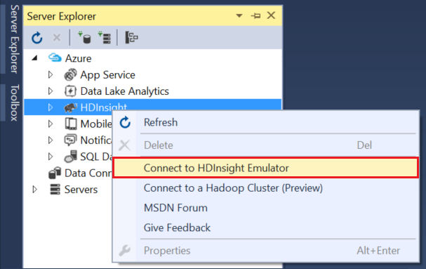
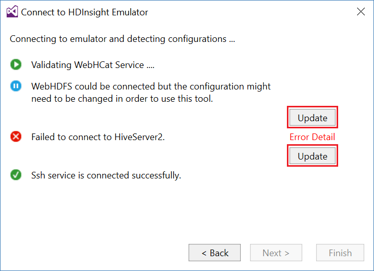

<properties
pageTitle="Usar as ferramentas de Lucerne de dados do Microsoft Azure para Visual Studio com a área restrita Hortonworks | Microsoft Azure"
description="Saiba como usar as ferramentas de Lucerne de dados do Azure para VIsual Studio com a área restrita de Hortonworks (executando uma máquina virtual local.) Com essas ferramentas, você pode criar e executar trabalhos de seção e porco na saída de trabalho de área restrita e modo de exibição e histórico."
services="hdinsight"
documentationCenter=""
authors="Blackmist"
manager="paulettm"
editor="cgronlun"/>

<tags
ms.service="hdinsight"
ms.devlang="na"
ms.topic="article"
ms.tgt_pltfrm="na"
ms.workload="big-data"
ms.date="08/26/2016"
ms.author="larryfr"/>

# Usar as ferramentas de Lucerne dados Azure para Visual Studio com a área restrita Hortonworks

As ferramentas de Lucerne de dados do Azure para Visual Studio incluem ferramentas para trabalhar com clusters genéricos do Hadoop, além de ferramentas para trabalhar com Lucerne de dados do Azure e HDInsight. Este documento fornece as etapas necessárias para usar as ferramentas do Azure dados Lucerne com a área restrita Hortonworks executado em uma máquina virtual local.

Usando a área restrita Hortonworks permite que você trabalhar com Hadoop localmente em seu ambiente de desenvolvimento. Depois de ter desenvolvido uma solução e deseja implantá-lo em escala, você pode mover a um cluster de HDInsight.

## Pré-requisitos

* A caixa de proteção de Hortonworks em execução em uma máquina virtual no seu ambiente de desenvolvimento. Este documento foi criado e testado com a área restrita em execução no Oracle VirtualBox, que foi configurado usando as informações do documento de [Introdução no ecossistema do Hadoop](hdinsight-hadoop-emulator-get-started.md) .

* Visual Studio 2013 ou qualquer edição de 2015.

* O [SDK do Azure para .NET](https://azure.microsoft.com/downloads/) 2.7.1 ou superior

* [Dados Azure Lucerne ferramentas para Visual Studio](https://www.microsoft.com/download/details.aspx?id=49504)

## Configurar senhas para a área restrita

Certifique-se de que a área restrita Hortonworks está sendo executado, em seguida, siga as etapas em [Introdução no ecossistema do Hadoop](hdinsight-hadoop-emulator-get-started.md#set-passwords) para configurar a senha para o SSH `root` conta e o Ambari `admin` conta. Essas senhas serão usadas durante a conexão com a área restrita do Visual Studio.

## Conectar as ferramentas para a área restrita

1. Abra o Visual Studio e selecione o __modo de exibição__, em seguida, __Server Explorer__.

2. No __Server Explorer__, clique com botão direito na entrada de __HDInsight__ e selecione __conectar ao HDInsight emulador__.

    

3. Na caixa de diálogo __conectar ao emulador de HDInsight__ , digite a senha que você configurou para Ambari.

    

    Selecione __Avançar__ para continuar.

4. Use o campo de __senha__ digite a senha que você configurou para o `root` conta. Deixe os outros campos no valor padrão.

    

    Selecione __Avançar__ para continuar.

5. Aguarde validação dos serviços para ser concluída. Em alguns casos, validação pode falhar e solicitar que você atualize a configuração. Quando isso acontece, selecione o botão __Atualizar__ e aguarde a configuração e a verificação do serviço ser concluída.

    

    > [AZURE.NOTE] O processo de atualização usa Ambari para modificar a configuração de área restrita Hortonworks esperada pelas ferramentas Lucerne de dados do Azure para Visual Studio.

    Após a conclusão da validação, selecione __Concluir__ para concluir a configuração.

    

    > [AZURE.NOTE] Dependendo da velocidade do seu ambiente de desenvolvimento e a quantidade de memória alocada na máquina virtual, pode levar alguns minutos para configurar e validar os serviços.

Depois de seguir essas etapas, agora você tem uma entrada "HDInsight cluster local" no Server Explorer sob a seção de HDInsight.

## Escrever uma consulta de seção

Seção fornece uma linguagem de consulta do tipo SQL (HiveQL), para trabalhar com dados estruturados. Use as etapas a seguir para aprender a executar consultas ad-hoc cluster local.

1. No __Server Explorer__, clique com botão direito na entrada para o cluster local que você adicionou anteriormente e selecione __escrever uma consulta de seção__.

    

    Isso abre uma nova janela de consulta que permite que você digitar rapidamente e enviar uma consulta para o cluster local.

2. Na janela de consulta nova, insira o seguinte:

        select count(*) from sample_08;
    
    Na parte superior da janela da consulta, certifique-se de que a configuração para cluster local está selecionado e, em seguida, selecione __Enviar__. Deixe os outros valores (__lote__ e nome do servidor,) os valores padrão.

    

    Observe que você também pode usar o menu suspenso ao lado __Enviar__ para selecionar __Avançado__. Isso abre uma caixa de diálogo que permite fornecer opções adicionais quando enviar o trabalho.

    

3. Depois que você envia a consulta, o status do trabalho será exibida. Fornece informações sobre o trabalho como ele é processado por Hadoop. A entrada de __Estado do trabalho__ fornece o status atual do trabalho. O estado será atualizado periodicamente ou você pode usar o ícone de atualização para atualizar manualmente o estado.

    

    Depois que o __Status do trabalho__ muda para __concluído__, um direcionado acíclica Graph (Dag mão) é exibida. Descreve o caminho de execução que foi determinado por Tez (o padrão mecanismo de execução para seção no local cluster.) 
    
    > [AZURE.NOTE] Tez também é o padrão ao usar clusters de HDInsight baseados em Linux. Não é o padrão em HDInsight baseado no Windows; para usá-lo, você deve adicionar a linha `set hive.execution.engine = tez;` para o início da sua consulta de seção. 

    Use o link de __Saída de trabalho__ para exibir a saída. Nesse caso, é __823__; o número de linhas na tabela sample_08. Você pode exibir informações de diagnóstico sobre o trabalho usando os links de __Log de trabalho__ e __Baixe o Log de fio COLORIDO__ .

4. Você também pode executar trabalhos de seção interativamente alterando o campo __lote__ para __interativo__e selecione __Executar__. 

    

    Isso transfere o log de saída gerado durante o processamento para a janela de __Saída de HiveServer2__ .
    
    > [AZURE.NOTE] Este é as mesmas informações que está disponíveis no link __Log de trabalho__ depois que um trabalho concluído.

    

## Criar um projeto de seção

Você também pode criar um projeto que contém vários scripts de seção. Isso é útil quando você tem relacionadas scripts que você precisa manter juntos ou manter usando um sistemas de controle de versão.

1. No Visual Studio, selecione o __arquivo__, __novo__e then__Project__.

2. Na lista de projetos, expanda __modelos__, __Lucerne de dados do Azure__ e selecione __seção (HDInsight)__. Na lista de modelos, selecione __Seção Sample__. Insira um nome e local e selecione __Okey__.

    

O projeto de __Amostra seção__ contém dois scripts, __WebLogAnalysis.hql__ e __SensorDataAnalysis.hql__. Você pode enviar esses usando o mesmo botão __Enviar__ na parte superior da janela.

## Criar um projeto de porco

Enquanto a seção fornece uma linguagem SQL semelhante para trabalhar com dados estruturados, porco fornece um idioma (porco latino), que permite que você desenvolva um pipeline de transformações que são aplicadas aos seus dados. Use as seguintes etapas para usar porco com cluster local.

1. Abra o Visual Studio e selecione o __arquivo__, __novo__e, em seguida, __Project__. Na lista de projetos, expanda __modelos__, __Lucerne de dados do Azure__e selecione __porco (HDInsight)__. Na lista de modelos, selecione o __Aplicativo de porco__. Digite um nome, localização e selecione __Okey__.

    

2. Insira o seguinte como o conteúdo do arquivo __script.pig__ que foi criado com este projeto.

        a = LOAD '/demo/data/Website/Website-Logs' AS (
            log_id:int, 
            ip_address:chararray, 
            date:chararray, 
            time:chararray, 
            landing_page:chararray, 
            source:chararray);
        b = FILTER a BY (log_id > 100);
        c = GROUP b BY ip_address;
        DUMP c;

    Enquanto porco usa um idioma diferente de seção, como executar os trabalhos é consistente entre os dois idiomas através do botão __Enviar__ . Selecionando o menu suspenso para baixo ao lado de __Enviar__ exibe uma caixa de diálogo Enviar avançado porco.

    
    
3. O status de trabalho e saída também é exibida a mesma como uma consulta de seção.

    

## Exibir trabalhos

Azure ferramentas de Lucerne de dados também permitem que você facilmente exibir informações sobre os trabalhos que foram executado no Hadoop. Use as etapas a seguir para ver os trabalhos que foram executado no cluster local.

1. No __Server Explorer__, clique com botão direito no cluster local e selecione __Exibir trabalhos__. Isso exibirá uma lista de trabalhos que foram enviadas ao cluster.

    

2. Na lista de trabalhos, selecione um para exibir os detalhes de trabalho.

    

    As informações exibidas são semelhantes ao que você vê após executar uma consulta seção ou porco, completa com links para exibir a saída e registrar informações.

3. Você também pode modificar e reenviar o trabalho a partir daqui.

## Exibir bancos de dados de seção

1. No __Server Explorer__, expanda a entrada de __cluster local HDInsight__ e em seguida, expanda a __Seção bancos de dados__. Isso irá revelar os bancos de dados __padrão__ e __xademo__ em cluster local. Expandir um banco de dados revela as tabelas no banco de dados.

    

2. Expandir uma tabela exibe as colunas da tabela. Pode ser uma tabela de atalho e selecione __Exibição primeiras 100 linhas__ para exibir rapidamente os dados.

    

### Propriedades de banco de dados e tabela

Você pode ter notado que você pode selecionar para exibir as __Propriedades__ em um banco de dados ou tabela. Isso mostrará detalhes para o item selecionado na janela de propriedades.

### Criar uma tabela

Para criar uma nova tabela, um banco de dados de atalho e, em seguida, selecione __Criar tabela__.

Você pode criar a tabela usando um formulário. Você pode ver o HiveQL bruto que será usada para criar a tabela na parte inferior desta página.

## Próximas etapas

* [Os ropes da área de segurança Hortonworks de aprendizagem](http://hortonworks.com/hadoop-tutorial/learning-the-ropes-of-the-hortonworks-sandbox/)
* [Tutorial do Hadoop - Introdução ao HDP](http://hortonworks.com/hadoop-tutorial/hello-world-an-introduction-to-hadoop-hcatalog-hive-and-pig/)