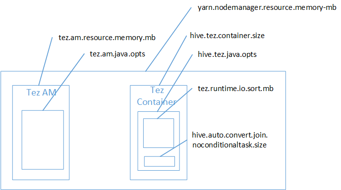

<properties
    pageTitle="Sair do erro de memória (OOM) - configurações de seção | Microsoft Azure"
    description="Corrigi um erro de falta de memória (OOM) de uma consulta de seção no Hadoop em HDInsight. O cenário de cliente é uma consulta em várias tabelas grandes."
    keywords="sair do configurações de seção de erro, memória Insuficiente, de memória"
    services="hdinsight"
    documentationCenter=""
    authors="rashimg"
    manager="jhubbard"
    editor="cgronlun"/>

<tags
    ms.service="hdinsight"
    ms.devlang="na"
    ms.topic="article"
    ms.tgt_pltfrm="na"
    ms.workload="big-data"
    ms.date="09/02/2016"
    ms.author="rashimg;jgao"/>

# Corrigir um erro de memória (OOM) com as configurações de memória de seção em Hadoop no Azure HDInsight

Um dos problemas comuns nossos clientes enfrentam estão recebendo um erro de memória (OOM) quando usando seção. Este artigo descreve um cenário de cliente e as configurações de seção que é recomendável para corrigir o problema.

## Cenário: Seção consulta em tabelas grandes

Um cliente executou a consulta abaixo usando a seção.

    SELECT
        COUNT (T1.COLUMN1) as DisplayColumn1,
        …
        …
        ….
    FROM
        TABLE1 T1,
        TABLE2 T2,
        TABLE3 T3,
        TABLE5 T4,
        TABLE6 T5,
        TABLE7 T6
    where (T1.KEY1 = T2.KEY1….
        …
        …

Algumas nuances desta consulta:

* T1 é um alias para uma tabela grande, Tabela1, que tem muitos tipos de coluna de cadeia de caracteres.
* Outras tabelas são não que grandes, mas têm um grande número de colunas.
* Todas as tabelas estão ingressando uns dos outros, em alguns casos com várias colunas de TABLE1 e outras pessoas.

Quando o cliente executou a consulta usando a seção em MapReduce em um nó 24 cluster A3, a consulta é executado em cerca de 26 minutos. O cliente notado as seguintes mensagens de aviso quando a consulta foi executada usando a seção em MapReduce:

    Warning: Map Join MAPJOIN[428][bigTable=?] in task 'Stage-21:MAPRED' is a cross product
    Warning: Shuffle Join JOIN[8][tables = [t1933775, t1932766]] in Stage 'Stage-4:MAPRED' is a cross product

Porque a consulta terminar a execução em cerca de 26 minutos, o cliente ignorados esses avisos e em vez disso iniciado concentrar-se em como melhorar o desempenho da consulta ainda mais.

O cliente consultado [otimizar seção consultas para Hadoop em HDInsight](hdinsight-hadoop-optimize-hive-query.md)e decidido usar mecanismo de execução de Tez. Depois que a mesma consulta foi executada com a configuração de Tez habilitada a consulta executou por 15 minutos e, em seguida, emitiu o seguinte erro:

    Status: Failed
    Vertex failed, vertexName=Map 5, vertexId=vertex_1443634917922_0008_1_05, diagnostics=[Task failed, taskId=task_1443634917922_0008_1_05_000006, diagnostics=[TaskAttempt 0 failed, info=[Error: Failure while running task:java.lang.RuntimeException: java.lang.OutOfMemoryError: Java heap space
        at
    org.apache.hadoop.hive.ql.exec.tez.TezProcessor.initializeAndRunProcessor(TezProcessor.java:172)
        at org.apache.hadoop.hive.ql.exec.tez.TezProcessor.run(TezProcessor.java:138)
        at
    org.apache.tez.runtime.LogicalIOProcessorRuntimeTask.run(LogicalIOProcessorRuntimeTask.java:324)
        at
    org.apache.tez.runtime.task.TezTaskRunner$TaskRunnerCallable$1.run(TezTaskRunner.java:176)
        at
    org.apache.tez.runtime.task.TezTaskRunner$TaskRunnerCallable$1.run(TezTaskRunner.java:168)
        at java.security.AccessController.doPrivileged(Native Method)
        at javax.security.auth.Subject.doAs(Subject.java:415)
        at org.apache.hadoop.security.UserGroupInformation.doAs(UserGroupInformation.java:1628)
        at
    org.apache.tez.runtime.task.TezTaskRunner$TaskRunnerCallable.call(TezTaskRunner.java:168)
        at
    org.apache.tez.runtime.task.TezTaskRunner$TaskRunnerCallable.call(TezTaskRunner.java:163)
        at java.util.concurrent.FutureTask.run(FutureTask.java:262)
        at java.util.concurrent.ThreadPoolExecutor.runWorker(ThreadPoolExecutor.java:1145)
        at java.util.concurrent.ThreadPoolExecutor$Worker.run(ThreadPoolExecutor.java:615)
        at java.lang.Thread.run(Thread.java:745)
    Caused by: java.lang.OutOfMemoryError: Java heap space

O cliente então decidido usar uma maior máquina virtual (ou seja D12) pensando uma máquina virtual maior teria mais espaço de pilha. Mesmo assim, o cliente continua a ver o erro. O cliente atingido check-out para a equipe de HDInsight para obter ajuda na depuração esse problema.

## Depurar o erro de memória (OOM)

Nosso suporte e equipes de engenharia juntos encontradas um dos problemas causando o erro de memória (OOM) foi um [problema descrito em JIRA o Apache conhecido](https://issues.apache.org/jira/browse/HIVE-8306). A partir da descrição na JIRA:

    When hive.auto.convert.join.noconditionaltask = true we check noconditionaltask.size and if the sum  of tables sizes in the map join is less than noconditionaltask.size the plan would generate a Map join, the issue with this is that the calculation doesnt take into account the overhead introduced by different HashTable implementation as results if the sum of input sizes is smaller than the noconditionaltask size by a small margin queries will hit OOM.

Confirmamos que **hive.auto.convert.join.noconditionaltask** realmente foi definida como **true** olhando em site.xml de seção de arquivo:

    <property>
        <name>hive.auto.convert.join.noconditionaltask</name>
        <value>true</value>
        <description>
            Whether Hive enables the optimization about converting common join into mapjoin based on the input file size.
            If this parameter is on, and the sum of size for n-1 of the tables/partitions for a n-way join is smaller than the
            specified size, the join is directly converted to a mapjoin (there is no conditional task).
        </description>
    </property>

Com base no aviso e o JIRA, nossa hipótese era mapa ingressar a causa do erro Java pilha espaço OOM. Então vamos pesquisa mais profunda esse problema.

Conforme explicado na postagem do blog [fio colorido Hadoop configurações de memória em HDInsight](http://blogs.msdn.com/b/shanyu/archive/2014/07/31/hadoop-yarn-memory-settings-in-hdinsigh.aspx), realmente quando Tez mecanismo de execução é usado o espaço de pilha usado pertence ao contêiner de Tez. Consulte a imagem abaixo descrever a memória de contêiner de Tez.

Como a postagem no blog sugere, as seguintes configurações de duas memória definem a memória de contêiner para pilha: **hive.tez.container.size** e **hive.tez.java.opts**. De nossa experiência, a exceção de memória Insuficiente não significa que o tamanho do contêiner é muito pequeno. Isso significa que o tamanho da pilha Java (hive.tez.java.opts) é muito pequeno. Para que sempre que você vir memória Insuficiente, você pode tentar aumentar **hive.tez.java.opts**. Se for necessário que talvez você precise aumentar **hive.tez.container.size**. A configuração de **java.opts** deve ser aproximadamente 80% das **container.size**.

> [AZURE.NOTE]  A configuração **hive.tez.java.opts** sempre deve ser menor do que **hive.tez.container.size**.

Como uma máquina D12 tem 28GB de memória, podemos decidiu usar um tamanho de contêiner de 10GB (10240MB) e atribuir 80% a java.opts. Isso foi feito no console seção usando a configuração abaixo:

    SET hive.tez.container.size=10240
    SET hive.tez.java.opts=-Xmx8192m

A consulta com base nessas configurações, executada com êxito em menos de dez minutos.

## Conclusão: Erros de memória Insuficiente e o tamanho do contêiner

Recebendo um erro de memória Insuficiente não necessariamente que o tamanho do contêiner é muito pequeno. Em vez disso, você deve definir as configurações de memória para que o tamanho da pilha é aumentado e é pelo menos 80% do tamanho da memória contêiner.
