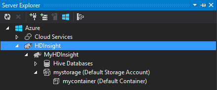

<properties
    pageTitle="Usar c# com seção e porco em Hadoop em HDInsight | Microsoft Azure"
    description="Saiba como usar c# funções definidas pelo usuário (UDF) com seção e porco streaming no Azure HDInsight."
    services="hdinsight"
    documentationCenter=""
    authors="Blackmist"
    manager="jhubbard"
    editor="cgronlun"
    tags="azure-portal"/>

<tags
    ms.service="hdinsight"
    ms.workload="big-data"
    ms.tgt_pltfrm="na"
    ms.devlang="dotnet"
    ms.topic="article"
    ms.date="10/28/2016"
    ms.author="larryfr"/>

#Usar c# funções definidas pelo usuário com seção e porco streaming em Hadoop em HDInsight

Seção e porco são ótimos para trabalhar com dados no Azure HDInsight, mas, às vezes, é necessário um idioma propósito mais geral. Seção e porco permitem código externo por meio de funções definidas pelo usuário (UDFs) ou o fluxo de chamadas.

Neste documento, saiba como usar c# com seção e porco.

##Pré-requisitos

* Windows 7 ou posterior.

* Visual Studio com as seguintes versões:

    * Visual Studio 2012 Professional/Premium/Ultimate com [atualização 4](http://www.microsoft.com/download/details.aspx?id=39305)

    * Visual Studio 2013 comunidade/Professional/Premium/Ultimate com [atualização 4](https://www.microsoft.com/download/details.aspx?id=44921)

    * Visual Studio de 2015

* Hadoop em HDInsight cluster - consulte [provisionar um cluster de HDInsight](hdinsight-provision-clusters.md) para as etapas para criar um cluster

* Ferramentas de Hadoop para Visual Studio. Consulte [Introdução ao uso de ferramentas de Hadoop HDInsight para Visual Studio](hdinsight-hadoop-visual-studio-tools-get-started.md) para obter etapas sobre como instalar e configurar as ferramentas.

##.NET na HDInsight

O .NET common language runtime (CLR) e estruturas são instaladas por padrão em clusters de HDInsight baseados no Windows. Isso permite que você use aplicativos c# com seção e porco streaming (dados passados entre seção/porco e o aplicativo c# via stdout/stdin).

> [AZURE.NOTE] Atualmente não há nenhum suporte para execução .NET Framework UDFs em clusters de HDInsight baseados em Linux. 

##.NET e streaming

Streaming envolve a seção e porco passar dados para um aplicativo externo por stdout e receber os resultados pela stdin. Para aplicativos c#, isso é mais facilmente realizado por meio de `Console.ReadLine()` e `Console.WriteLine()`.

Como seção e porco precisam chamar o aplicativo em tempo de execução, o modelo de **Aplicativo de Console** deve ser usado para seus projetos c#.

##Seção e C & #35;

###Crie o projeto c#

1. Abra o Visual Studio e criar uma nova solução. Para o tipo de projeto, selecione o **Aplicativo de Console**e nomeie o novo projeto **HiveCSharp**.

2. Substitua o conteúdo de **Program.cs** com o seguinte:

        using System;
        using System.Security.Cryptography;
        using System.Text;
        using System.Threading.Tasks;

        namespace HiveCSharp
        {
            class Program
            {
                static void Main(string[] args)
                {
                    string line;
                    // Read stdin in a loop
                    while ((line = Console.ReadLine()) != null)
                    {
                        // Parse the string, trimming line feeds
                        // and splitting fields at tabs
                        line = line.TrimEnd('\n');
                        string[] field = line.Split('\t');
                        string phoneLabel = field[1] + ' ' + field[2];
                        // Emit new data to stdout, delimited by tabs
                        Console.WriteLine("{0}\t{1}\t{2}", field[0], phoneLabel, GetMD5Hash(phoneLabel));
                    }
                }
                /// 

                /// Returns an MD5 hash for the given string
                /// 

                /// <param name="input">string value</param>
                /// <returns>an MD5 hash</returns>
                static string GetMD5Hash(string input)
                {
                    // Step 1, calculate MD5 hash from input
                    MD5 md5 = System.Security.Cryptography.MD5.Create();
                    byte[] inputBytes = System.Text.Encoding.ASCII.GetBytes(input);
                    byte[] hash = md5.ComputeHash(inputBytes);

                    // Step 2, convert byte array to hex string
                    StringBuilder sb = new StringBuilder();
                    for (int i = 0; i < hash.Length; i++)
                    {
                        sb.Append(hash[i].ToString("x2"));
                    }
                    return sb.ToString();
                }
            }
        }

3. Crie o projeto.

###Carregar para armazenamento

1. No Visual Studio, abra o **Explorador de servidor**.

3. Expanda o **Azure**e **HDInsight**.

4. Se solicitado, insira suas credenciais do Azure assinatura e, em seguida, clique em **Entrar**.

5. Expanda o cluster HDInsight que você deseja implantar esse aplicativo para e, em seguida, expanda **Conta padrão de armazenamento**.

    

6. Clique duas vezes em **Contêiner padrão** para o cluster. Isso abrirá uma nova janela que exibe o conteúdo do contêiner padrão.

7. Clique no ícone de upload e navegue até a pasta **bin\debug** do projeto **HiveCSharp** . Por fim, selecione o arquivo **HiveCSharp.exe** e clique em **Okey**.

    

8. Quando o carregamento tiver terminado, você poderá usar o aplicativo de uma consulta de seção.

###Seção consulta

1. No Visual Studio, abra o **Explorador de servidor**.

2. Expanda o **Azure**e **HDInsight**.

5. Clique com botão direito do cluster que você implantou o aplicativo **HiveCSharp** e selecione **escrever uma consulta de seção**.

6. Use o seguinte para a consulta de seção:

        add file wasbs:///HiveCSharp.exe;

        SELECT TRANSFORM (clientid, devicemake, devicemodel)
        USING 'HiveCSharp.exe' AS
        (clientid string, phoneLabel string, phoneHash string)
        FROM hivesampletable
        ORDER BY clientid LIMIT 50;

    Isso seleciona a `clientid`, `devicemake`, e `devicemodel` campos de `hivesampletable`e passa os campos para o aplicativo HiveCSharp.exe. A consulta espera o aplicativo para retornar três campos, que são armazenados como `clientid`, `phoneLabel`, e `phoneHash`. A consulta também espera encontrar HiveCSharp.exe na raiz do contêiner de armazenamento de padrão (`add file wasbs:///HiveCSharp.exe`).

5. Clique em **Enviar** para enviar o trabalho ao cluster HDInsight. A janela de **Resumo da tarefa seção** será aberta.

6. Clique em **Atualizar** para atualizar o resumo até que o **Status do trabalho** muda **concluídas**. Para exibir a saída de trabalho, clique em **Saída de trabalho**.

##Porco e C & #35;

###Crie o projeto c#

1. Abra o Visual Studio e criar uma nova solução. Para o tipo de projeto, selecione o **Aplicativo de Console**e nomeie o novo projeto **PigUDF**.

2. Substitua o conteúdo do arquivo **Program.cs** com o seguinte:

        using System;

        namespace PigUDF
        {
            class Program
            {
                static void Main(string[] args)
                {
                    string line;
                    // Read stdin in a loop
                    while ((line = Console.ReadLine()) != null)
                    {
                        // Fix formatting on lines that begin with an exception
                        if(line.StartsWith("java.lang.Exception"))
                        {
                            // Trim the error info off the beginning and add a note to the end of the line
                            line = line.Remove(0, 21) + " - java.lang.Exception";
                        }
                        // Split the fields apart at tab characters
                        string[] field = line.Split('\t');
                        // Put fields back together for writing
                        Console.WriteLine(String.Join("\t",field));
                    }
                }
            }
        }

    Este aplicativo analisará as linhas enviadas de porco e reformatar linhas que começam com `java.lang.Exception`.

3. Salve **Program.cs**e depois compilar o projeto.

###Carregar o aplicativo

1. Porco streaming espera que o aplicativo seja local no sistema de arquivos de cluster. Habilitar a área de trabalho remota para o cluster HDInsight e, em seguida, conectá-la seguindo as instruções em [conectar ao HDInsight clusters usando o RDP](hdinsight-administer-use-management-portal.md#rdp).

2. Uma vez conectado, copie **PigUDF.exe** do diretório **bin/depuração** para o projeto PigUDF em sua máquina local e colá-lo no diretório de **% PIG_HOME %** no cluster.

###Usar o aplicativo de porco latino

1. Da sessão área de trabalho remota, inicie a linha de comando do Hadoop usando o ícone de **linha de comando do Hadoop** na área de trabalho.

2. Use este procedimento para iniciar a linha de comando porco:

        cd %PIG_HOME%
        bin\pig

    Você receberá um `grunt>` prompt.

3. Digite o seguinte para executar um trabalho de porco simple, usando o aplicativo do .NET Framework:

        DEFINE streamer `pigudf.exe` SHIP('pigudf.exe');
        LOGS = LOAD 'wasbs:///example/data/sample.log' as (LINE:chararray);
        LOG = FILTER LOGS by LINE is not null;
        DETAILS = STREAM LOG through streamer as (col1, col2, col3, col4, col5);
        DUMP DETAILS;

    O `DEFINE` instrução cria um alias de `streamer` para os aplicativos de pigudf.exe, e `SHIP` distribui-lo entre os nós no cluster. Posteriormente, `streamer` é usada com a `STREAM` operador para processar as linhas única contidas no LOG e retornar os dados como uma série de colunas.

> [AZURE.NOTE] O nome do aplicativo que é usado para fluxo deve estar entre o \` (backtick) caractere quando alias, e ' (aspas simples) quando usado com `SHIP`.

3. Depois de inserir a última linha, o trabalho deve começar. Eventualmente retornará saída similar ao seguinte:

        (2012-02-03 20:11:56 SampleClass5 [WARN] problem finding id 1358451042 - java.lang.Exception)
        (2012-02-03 20:11:56 SampleClass5 [DEBUG] detail for id 1976092771)
        (2012-02-03 20:11:56 SampleClass5 [TRACE] verbose detail for id 1317358561)
        (2012-02-03 20:11:56 SampleClass5 [TRACE] verbose detail for id 1737534798)
        (2012-02-03 20:11:56 SampleClass7 [DEBUG] detail for id 1475865947)

##Resumo

Neste documento, você aprendeu a usar um aplicativo do .NET Framework da seção e porco em HDInsight. Se você gostaria de saber como usar Python com seção e porco, consulte [Usar Python com seção e porco em HDInsight](hdinsight-python.md).

Para outras maneiras de usar porco e seção e para saber como usar MapReduce, consulte o seguinte:

* [Use a seção com HDInsight](hdinsight-use-hive.md)

* [Usar porco com HDInsight](hdinsight-use-pig.md)

* [Usar MapReduce com HDInsight](hdinsight-use-mapreduce.md)
