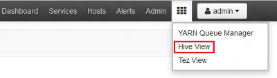

<properties
    pageTitle="Tutorial do Linux: Introdução ao Hadoop e seção | Microsoft Azure"
    description="Siga este tutorial Linux para começar a usar o Hadoop no HDInsight. Saiba como provisionar clusters Linux e consultar dados com seção."
    services="hdinsight"
    documentationCenter=""
    authors="mumian"
    manager="jhubbard"
    editor="cgronlun"
    tags="azure-portal"/>

<tags
    ms.service="hdinsight"
    ms.devlang="na"
    ms.topic="hero-article"
    ms.tgt_pltfrm="na"
    ms.workload="big-data"
    ms.date="09/14/2016"
    ms.author="jgao"/>

# Tutorial do Hadoop: Introdução ao uso baseados em Linux Hadoop em HDInsight

> [AZURE.SELECTOR]
- [Baseado em Linux](hdinsight-hadoop-linux-tutorial-get-started.md)
- [Baseado no Windows](hdinsight-hadoop-tutorial-get-started-windows.md)

Saiba como criar clusters baseados em Linux [Hadoop](http://hadoop.apache.org/) no HDInsight e como executar trabalhos de seção no HDInsight. [Seção de Apache](https://hive.apache.org/) é o componente mais popular no ecossistema do Hadoop. Atualmente HDInsight vem com 4 tipos de cluster diferentes: [Hadoop](hdinsight-hadoop-introduction.md), [Spark](hdinsight-apache-spark-overview.md), [HBase](hdinsight-hbase-overview.md) e [tempestade](hdinsight-storm-overview.md).  Cada tipo de cluster é compatível com um conjunto diferente de componentes. Todos os tipos de cluster 4 suportam seção. Para obter uma lista de componentes com suporte em HDInsight, consulte [Novidades nas versões Hadoop cluster fornecidas pelo HDInsight?](hdinsight-component-versioning.md)  

[AZURE.INCLUDE [delete-cluster-warning](../../includes/hdinsight-delete-cluster-warning.md)]

## Pré-requisitos

Antes de começar este tutorial, você deve ter:

- **Assinatura do Azure**: para criar uma conta gratuita da avaliação de um mês, navegue até [azure.microsoft.com/free](https://azure.microsoft.com/free).

### Requisitos de controle de acesso

[AZURE.INCLUDE [access-control](../../includes/hdinsight-access-control-requirements.md)]

## Criar cluster

A maioria dos trabalhos de Hadoop são trabalhos em lotes. Você cria um cluster, execute algumas tarefas e, em seguida, excluir o cluster. Nesta seção, você irá criar um cluster baseado no Linux Hadoop em HDInsight usando o [modelo do Gerenciador de recursos do Azure](../resource-group-template-deploy.md). Modelo do Gerenciador de recursos é totalmente personalizável; ele torna fácil criar recursos Azure como HDInsight. Experiência de modelo do Gerenciador de recursos não é necessária para seguindo este tutorial. Para outros métodos de criação de cluster e compreender as propriedades usadas neste tutorial, consulte [criar HDInsight clusters](hdinsight-hadoop-provision-linux-clusters.md). O modelo do Gerenciador de recursos usado neste tutorial está localizado em um contêiner de blob pública, [https://hditutorialdata.blob.core.windows.net/armtemplates/create-linux-based-hadoop-cluster-in-hdinsight.json](https://hditutorialdata.blob.core.windows.net/armtemplates/create-linux-based-hadoop-cluster-in-hdinsight.json). 

1. Clique na imagem a seguir para entrar Azure e abra o modelo do Gerenciador de recursos no Portal do Azure. 

    

2. Da lâmina **parâmetros** , insira o seguinte:

    .

    - **ClusterName**: insira um nome para o cluster Hadoop que será criado.
    - **Nome de login de cluster e de senha**: O nome de login padrão é **admin**.
    - **E SSH senha**: O nome de usuário padrão é **sshuser**.  Você pode renomeá-la. 
    
    Outros parâmetros são opcionais para seguindo este tutorial. Você pode deixá-los como estão. 
    
    Cada cluster possui uma dependência de conta de armazenamento de Blob do Azure. Geralmente, ela é referenciada como a conta de armazenamento padrão. HDInsight cluster e sua conta de armazenamento do padrão devem ser localizadas na mesma região Azure. Excluir clusters não irá excluir a conta de armazenamento. No modelo, o nome de conta de armazenamento padrão é definido como o nome do cluster com "store" acrescentado. 
    
3. Clique em **Okey** para salvar os parâmetros.
4. Da lâmina **implantação personalizada** , insira o **novo nome do grupo de recursos** para criar um novo grupo de recursos.  O grupo de recursos é um contêiner que agrupa cluster, a conta de armazenamento dependentes e outros s. O local do grupo de recursos pode ser diferente do local cluster.
5. Clique em **termos legais**e, em seguida, clique em **criar**.
6. Verifique se a caixa de seleção **Fixar no painel de controle** está selecionado e clique em **criar**. Você verá um novo bloco intitulado **implantação de implantação do modelo**. Ele leva cerca de cerca de 20 minutos para criar um cluster. 
7.  Depois que o cluster é criado, a legenda do bloco de é alterada para o nome do grupo de recursos que você especificou. E o portal automaticamente abre duas lâminas com cluster e as configurações de cluster. 

    .

    Há dois recursos listados, cluster e a conta de armazenamento padrão.

##Executar consultas de seção

[Seção Apache](hdinsight-use-hive.md) é o componente mais popular usado em HDInsight. Há várias maneiras de executar trabalhos de seção em HDInsight. Neste tutorial, você usará o modo de exibição de Ambari seção a partir do portal para executar alguns trabalhos de seção. Para outros métodos de envio de trabalhos de seção, consulte [Usar seção no HDInsight](hdinsight-use-hive.md).

1. Navegue até **https://&lt;ClusterName >. azurehdinsight.net**, onde &lt;ClusterName > é o cluster que você criou na seção anterior para abrir Ambari.
2. Insira o nome de usuário do Hadoop e a senha que você especificou na seção anterior. O nome de usuário padrão é **admin**.
3. Abra a **Seção modo de exibição** conforme mostrado na seguinte captura de tela:

    .
4. Na seção de __Editor de consultas__ da página, cole as seguintes instruções de HiveQL na planilha:

        SHOW TABLES;

    >[AZURE.NOTE] -E-vírgula é exigido por seção.       
        
5. Clique em __Executar__. Uma seção de __Resultados do processo de consulta__ deve aparecer sob o Editor de consulta e exibir informações sobre o trabalho. 

    Quando tiver terminado a consulta, a seção de __Resultados do processo de consulta__ exibirá os resultados da operação. Você deverá ver uma tabela chamada **hivesampletable**. Esta tabela de seção de amostra vem com todos os clusters de HDInsight.

    .

6. Repita as etapas 4 e 5 para executar a seguinte consulta:

        SELECT * FROM hivesampletable;

    > [AZURE.TIP] Observação na lista suspensa __Salvar os resultados__ no canto superior esquerdo da seção __Resultados do processo de consulta__ ; Você pode usar esta a baixar os resultados ou salvá-los ao armazenamento de HDInsight como um arquivo CSV.

7. Clique em **histórico** para obter uma lista dos trabalhos.

Depois de concluir um trabalho de seção, você pode [exportar os resultados para o banco de dados do SQL Azure ou SQL Server](hdinsight-use-sqoop-mac-linux.md), você também pode [visualizar os resultados usando o Excel](hdinsight-connect-excel-power-query.md). Para obter mais informações sobre como usar a seção no HDInsight, consulte [a seção de uso e HiveQL com Hadoop em HDInsight para analisar um arquivo de log4j de Apache de exemplo](hdinsight-use-hive.md).

##Limpar o tutorial

Depois de concluir o tutorial, talvez você queira excluir o cluster. Com HDInsight, seus dados são armazenados no armazenamento do Azure, assim você pode excluir com segurança um cluster quando ele não está em uso. Você também cobrado para um cluster de HDInsight, mesmo quando não estiver em uso. Como os encargos para o cluster são muitas vezes mais do que os encargos de armazenamento, faz sentido econômico excluir clusters quando eles não estão em uso. 

>[AZURE.NOTE] Usando o [Azure Data Factory](hdinsight-hadoop-create-linux-clusters-adf.md), você pode criar clusters de HDInsight sob demanda e definir uma configuração de TimeToLive para excluir os clusters automaticamente. 

**Para excluir o cluster e/ou a conta de armazenamento padrão**

1. Entrar no [portal do Azure](https://portal.azure.com).
2. No painel de portal, clique no bloco com o nome do grupo de recursos que é usada quando você criou o cluster.
3. Clique em **Excluir** na lâmina recurso para excluir o grupo de recursos que contém o cluster e a conta de armazenamento padrão; ou clique no nome do cluster no bloco **recursos** e clique em **Excluir** na lâmina cluster. Verifique a anotação, excluir o grupo de recursos excluirá a conta de armazenamento. Se você quiser manter a conta de armazenamento, optar por excluir apenas o cluster.

## Próximas etapas

Neste tutorial, você aprendeu como criar um cluster de HDInsight baseados em Linux usando um modelo do Gerenciador de recursos e como executar consultas de seção básicas.

Para saber mais sobre a análise de dados com HDInsight, consulte o seguinte:

- Para saber mais sobre como usar a seção com HDInsight, incluindo como executar consultas de seção no Visual Studio, consulte a [Seção de uso com HDInsight][hdinsight-use-hive].

- Para saber sobre porco, uma linguagem usada para transformar dados, consulte [Usar porco com HDInsight][hdinsight-use-pig].

- Para saber sobre MapReduce, uma maneira de escrever programas que processam dados no Hadoop, consulte [Usar MapReduce com HDInsight][hdinsight-use-mapreduce].

- Para saber sobre como usar as ferramentas de HDInsight para Visual Studio para analisar dados em HDInsight, consulte [Introdução ao uso de ferramentas do Visual Studio Hadoop para HDInsight](hdinsight-hadoop-visual-studio-tools-get-started.md).

Se você estiver pronto para começar a trabalhar com seus próprios dados e precisar saber mais sobre como HDInsight armazena dados ou como obter dados para o HDInsight, consulte o seguinte:

- Para obter informações sobre como HDInsight usa o armazenamento de blob do Microsoft Azure, consulte [armazenamento de Blob do uso do Azure com HDInsight](hdinsight-hadoop-use-blob-storage.md).

- Para obter informações sobre como carregar dados ao HDInsight, consulte [carregar dados ao HDInsight][hdinsight-upload-data].

Se você gostaria de saber mais sobre como criar ou gerenciar um cluster de HDInsight, consulte o seguinte:

- Para saber sobre como gerenciar seu cluster baseado em Linux HDInsight, consulte [Gerenciar HDInsight clusters usando Ambari](hdinsight-hadoop-manage-ambari.md).

- Para saber mais sobre as opções que você pode selecionar ao criar um cluster de HDInsight, consulte [Criando HDInsight no Linux usando opções personalizadas](hdinsight-hadoop-provision-linux-clusters.md).

- Se você estiver familiarizado com Linux e Hadoop, mas quiser saber especificações sobre Hadoop sobre o HDInsight, consulte [Trabalhando com HDInsight no Linux](hdinsight-hadoop-linux-information.md). Isso fornece informações como:

    * URLs para serviços hospedados no cluster, como Ambari e WebHCat
    * O local dos arquivos de Hadoop e exemplos no sistema de arquivo local
    * Armazene o uso do Azure armazenamento (WASB) em vez de HDFS como os dados padrão

[1]: ../HDInsight/hdinsight-hadoop-visual-studio-tools-get-started.md

[hdinsight-provision]: hdinsight-provision-clusters.md
[hdinsight-admin-powershell]: hdinsight-administer-use-powershell.md
[hdinsight-upload-data]: hdinsight-upload-data.md
[hdinsight-use-mapreduce]: hdinsight-use-mapreduce.md
[hdinsight-use-hive]: hdinsight-use-hive.md
[hdinsight-use-pig]: hdinsight-use-pig.md

[powershell-download]: http://go.microsoft.com/fwlink/p/?linkid=320376&clcid=0x409
[powershell-install-configure]: powershell-install-configure.md
[powershell-open]: powershell-install-configure.md#Install

[img-hdi-dashboard]: ./media/hdinsight-hadoop-tutorial-get-started-windows/HDI.dashboard.png
[img-hdi-dashboard-query-select]: ./media/hdinsight-hadoop-tutorial-get-started-windows/HDI.dashboard.query.select.png
[img-hdi-dashboard-query-select-result]: ./media/hdinsight-hadoop-tutorial-get-started-windows/HDI.dashboard.query.select.result.png
[img-hdi-dashboard-query-select-result-output]: ./media/hdinsight-hadoop-tutorial-get-started-windows/HDI.dashboard.query.select.result.output.png
[img-hdi-dashboard-query-browse-output]: ./media/hdinsight-hadoop-tutorial-get-started-windows/HDI.dashboard.query.browse.output.png
[image-hdi-clusterstatus]: ./media/hdinsight-hadoop-tutorial-get-started-windows/HDI.ClusterStatus.png
[image-hdi-gettingstarted-powerquery-importdata]: ./media/hdinsight-hadoop-tutorial-get-started-windows/HDI.GettingStarted.PowerQuery.ImportData.png
[image-hdi-gettingstarted-powerquery-importdata2]: ./media/hdinsight-hadoop-tutorial-get-started-windows/HDI.GettingStarted.PowerQuery.ImportData2.png
