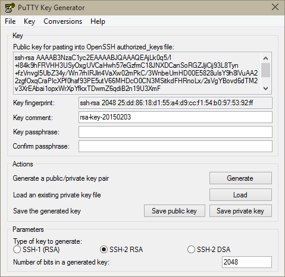
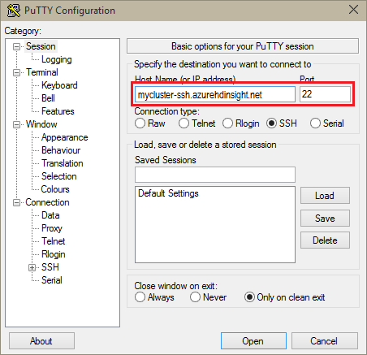
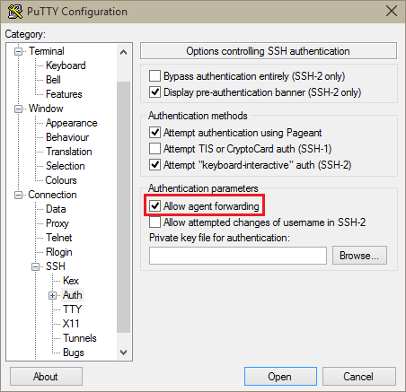

<properties
   pageTitle="Usar teclas de SSH com Hadoop em clusters baseados no Linux do Windows | Microsoft Azure"
   description="Saiba como criar e usar teclas SSH para autenticar clusters HDInsight baseados em Linux. Conecte clusters de clientes baseados no Windows usando o cliente acabamento SSH."
   services="hdinsight"
   documentationCenter=""
   authors="Blackmist"
   manager="jhubbard"
   editor="cgronlun"
    tags="azure-portal"/>

<tags
   ms.service="hdinsight"
   ms.devlang="na"
   ms.topic="get-started-article"
   ms.tgt_pltfrm="na"
   ms.workload="big-data"
   ms.date="08/30/2016"
   ms.author="larryfr"/>

#Use SSH com baseado em Linux Hadoop em HDInsight do Windows

> [AZURE.SELECTOR]
- [Windows](hdinsight-hadoop-linux-use-ssh-windows.md)
- [Linux, Unix, OS X](hdinsight-hadoop-linux-use-ssh-unix.md)

[Secure Shell (SSH)](https://en.wikipedia.org/wiki/Secure_Shell) permite que você remotamente realizam operações em seus clusters HDInsight baseados em Linux usando uma interface de linha. Este documento fornece informações sobre como se conectar ao HDInsight de clientes baseados no Windows usando o cliente acabamento SSH.

> [AZURE.NOTE] As etapas neste artigo presumem que você estiver usando um cliente baseado no Windows. Se você estiver usando um cliente Linux, Unix ou OS X, consulte [Usar SSH com baseado em Linux Hadoop em HDInsight do Linux, Unix ou OS X](hdinsight-hadoop-linux-use-ssh-unix.md).
>
> Se você tiver o Windows 10 e estiver usando [Bash no Ubuntu no Windows](https://msdn.microsoft.com/commandline/wsl/about), você pode usar as etapas do documento [Use SSH com baseado em Linux Hadoop em HDInsight do Linux, Unix ou OS X](hdinsight-hadoop-linux-use-ssh-unix.md) .

##Pré-requisitos

* **Acabamento** e **PuTTYGen** para clientes baseados no Windows. Esses utilitários estão disponíveis em [http://www.chiark.greenend.org.uk/~sgtatham/putty/download.html](http://www.chiark.greenend.org.uk/~sgtatham/putty/download.html).

* Um navegador da web moderna que ofereça suporte a HTML5.

OU

* [CLI azure](../xplat-cli-install.md).

    [AZURE.INCLUDE [use-latest-version](../../includes/hdinsight-use-latest-cli.md)] 

##O que é SSH?

SSH é um utilitário para efetuar login no e executar remotamente, comandos em um servidor remoto. Com HDInsight baseados em Linux, SSH estabelece uma conexão criptografada para o nó principal do cluster e fornece uma linha de comando que você usa para digite os comandos. Comandos são executados diretamente no servidor.

###Nome de usuário SSH

Um nome de usuário SSH é o nome que você usa para autenticar ao cluster HDInsight. Quando você especifica um nome de usuário SSH durante a criação de cluster, esse usuário é criado em todos os nós no cluster. Depois que o cluster for criado, você pode usar esse nome de usuário para se conectar a nós de cabeça do cluster HDInsight. De nós de cabeça, você pode conectar a nós trabalhador individual.

###Senha SSH ou chave pública

Um usuário SSH pode usar uma senha ou a chave pública para autenticação. Uma senha é apenas uma cadeia de caracteres de texto que compõem, enquanto uma chave pública faz parte de um par de chaves de criptografia gerado para identificá-lo exclusivamente.

Uma chave é mais segura do que uma senha, mas ela requer etapas adicionais para gerar a chave e você deve manter os arquivos que contém a chave em um local seguro. Se alguém obtiver acesso aos arquivos de chave, eles acessem sua conta. Ou, se você perder os arquivos de chave, você não poderá fazer logon em sua conta.

Um par de chaves consiste em uma chave pública (que é enviada para o servidor de HDInsight) e uma chave privada (que é mantida no computador cliente.) Quando você se conecta ao servidor HDInsight usando SSH, o cliente SSH usará a chave privada em sua máquina para autenticar com o servidor.

##Criar uma chave SSH

Use as seguintes informações se você planeja usar chaves SSH com seu cluster. Se você planeja usar uma senha, você pode ignorar esta seção.

1. Abra PuTTYGen.

2. Para **tipo de chave para gerar**, selecione **RSA SSH-2**e, em seguida, clique em **Gerar**.

    

3. Mova o mouse na área abaixo da barra de andamento, até que a barra é preenchida. Mover o mouse gera dados aleatórios que são usados para gerar a chave.

    

    Depois que a chave tiver sido gerada, a chave pública será exibida.

4. Para maior segurança, você pode inserir uma senha no campo **chave senha** e, em seguida, digite o mesmo valor no campo **Confirmar senha** .

    

    > [AZURE.NOTE] É altamente recomendável que você use uma senha segura para a chave. No entanto, se você esquecer a senha, não há nenhuma maneira de recuperá-lo.

5. Clique em **Salvar chave privada** para salvar a chave para um arquivo de **.ppk** . Esta chave será usada para autenticar seu cluster HDInsight baseados em Linux.

    > [AZURE.NOTE] Você deve armazenar essa chave em um local seguro, como ele pode ser usado para acessar o seu cluster HDInsight baseados em Linux.

6. Clique em **Salvar chave pública** para salvar a chave como um arquivo **. txt** . Isso permite reutilizar a chave pública no futuro, quando você cria adicionais clusters HDInsight baseados em Linux.

    > [AZURE.NOTE] A chave pública também é exibida na parte superior da PuTTYGen. Você pode neste campo de atalho, copie o valor e, em seguida, colá-lo em um formulário ao criar um cluster usando o Portal do Azure.

##Criar um cluster de HDInsight baseados em Linux

Ao criar um cluster baseado no Linux HDInsight, você deve fornecer a chave pública criada anteriormente. De clientes baseados no Windows, há duas maneiras de criar um cluster de HDInsight baseados em Linux:

* **Portal Azure** - usa um portal baseado na web para criar o cluster.

* **CLI do azure para Mac, Linux e Windows** - usa comandos de linha de comando para criar o cluster.

Cada um desses métodos exigem a chave pública. Para obter informações completas sobre a criação de um cluster baseado no Linux HDInsight, consulte [clusters de HDInsight baseados em provisionar Linux](hdinsight-hadoop-provision-linux-clusters.md).

###Portal do Azure

Ao usar o [Portal do Azure] [ preview-portal] para criar um cluster baseado no Linux HDInsight, digite um **Nome de usuário SSH**e selecione para inserir uma **senha** ou **Chave pública SSH**.

Se você selecionar **Chave pública SSH**, ou você pode colar a chave pública (exibido na __chave pública para colagem no OpenSSH autorizado\_arquivo de chaves__ campo PuttyGen,) para o campo __PublicKey SSH__ , ou selecione __Selecionar um arquivo__ para procurar e selecione o arquivo que contém a chave pública.

Isso cria um logon para o usuário especificado e habilita a autenticação de senha ou autenticação de chave SSH.

###Interface de linha de comando Azure para Mac, Linux e Windows

Você pode usar a [CLI do Azure para Mac, Linux e Windows](../xplat-cli-install.md) para criar um novo cluster usando o `azure hdinsight cluster create` comando.

Para obter mais informações sobre como usar este comando, consulte [clusters de provisionar Hadoop Linux em HDInsight usando opções personalizadas](hdinsight-hadoop-provision-linux-clusters.md).

##Conectar a um cluster baseado no Linux HDInsight

1. Abra o acabamento.

    

2. Se você tiver fornecido uma chave SSH quando você criou sua conta de usuário, você deve executar o seguinte procedimento para selecionar a chave privada utilizar ao autenticar ao cluster:

    Na **categoria**, expanda a **Conexão**, expanda **SSH**e selecione **Auth**. Por fim, clique em **Procurar** e selecione o arquivo de .ppk que contém sua chave privada.

    

3. Em **categoria**, selecione a **sessão**. Na tela **Opções básicas para a sua sessão de acabamento** , insira o endereço SSH do seu servidor de HDInsight no campo **nome de Host (ou endereço IP)** . Há dois possíveis endereços SSH, que você pode usar ao se conectar a um cluster:

    * __Endereço de nó de cabeça__: para conectar-se para o nó principal do cluster, use o nome do seu cluster, em seguida, **-ssh.azurehdinsight.net**. Por exemplo, **meucluster-ssh.azurehdinsight.net**.
    
    * __Endereço de nó de borda__: se você estiver se conectando a um servidor de R em cluster de HDInsight, você pode se conectar a nó de borda R Server usando o endereço __RServer.CLUSTERNAME.ssh.azurehdinsight.net__, onde CLUSTERNAME é o nome do seu cluster. Por exemplo, __RServer.mycluster.ssh.azurehdinsight.net__.

    

4. Para salvar as informações de conexão para uso futuro, insira um nome para esta conexão em **Sessões salvas**e clique em **Salvar**. A conexão será adicionado à lista de sessões salvas.

5. Clique em **Abrir** para se conectar ao cluster.

    > [AZURE.NOTE] Se esta for a primeira vez que você conectou ao cluster, você receberá um alerta de segurança. Isso é normal. Selecione **Sim** para armazenar em cache a chave do servidor RSA2 para continuar.

6. Quando solicitado, insira o usuário que você inseriu quando você criou o cluster. Se você tiver fornecido uma senha do usuário, você será solicitado para inseri-la também.

> [AZURE.NOTE] As etapas acima presumem que você está usando a porta 22, que conectará o headnode principal no cluster HDInsight. Se você usar porta 23, você se conecta para o secundário. Para obter mais informações sobre os nós de cabeça, consulte [disponibilidade e confiabilidade de clusters Hadoop em HDInsight](hdinsight-high-availability-linux.md).

###Conectar-se a nós de operador

Os nós de trabalho não estão diretamente acessíveis a partir fora do data center Azure, mas eles podem ser acessados a partir do nó de cabeça cluster via SSH.

Se você tiver fornecido uma chave SSH quando você criou sua conta de usuário, você deve executar as seguintes etapas para usar a chave privada ao autenticar ao cluster se você deseja se conectar os nós de trabalho.

1. Instale o concurso de [http://www.chiark.greenend.org.uk/~sgtatham/putty/download.html](http://www.chiark.greenend.org.uk/~sgtatham/putty/download.html). Este utilitário é usado em cache SSH teclas para acabamento.

2. Execute o concurso. Ele minimizará a um ícone na bandeja do status. Clique com botão direito no ícone e selecione **Adicionar chave**.

    

3. Quando for exibida a caixa de diálogo Procurar, selecione o arquivo de .ppk que contém a chave e clique em **Abrir**. Isso adiciona a chave concurso, que fornecerá-lo para acabamento ao conectar-se ao cluster.

    > [AZURE.IMPORTANT] Se você usou uma chave SSH para proteger sua conta, você deve concluir as etapas anteriores antes de você poderá se conectar a nós de trabalho.

4. Abra o acabamento.

5. Se você usar uma chave SSH para autenticar, na seção **categoria** , expanda a **Conexão**, expanda **SSH**e selecione **Auth**.

    Na seção **parâmetros de autenticação** , habilite **agente de permitir encaminhamento**. Isso permite acabamento passar automaticamente a autenticação de certificado por meio da conexão para o nó principal do cluster ao conectar-se a nós de trabalho.

    

6. Conecte-se ao cluster como documentadas anteriormente. Se você usar uma chave SSH para autenticação, você não precisa selecionar a chave - chave SSH adicionada ao concurso será usada para autenticar ao cluster.

7. Depois que a conexão tiver sido estabelecida, use o seguinte para recuperar uma lista de nós no seu cluster. Substitua *ADMINPASSWORD* a senha da sua conta de administrador de cluster. Substitua o nome do seu cluster *CLUSTERNAME* .

        curl --user admin:ADMINPASSWORD https://CLUSTERNAME.azurehdinsight.net/api/v1/hosts

    Isso retornará informações no formato JSON para os nós no cluster, incluindo `host_name`, que contém o nome de domínio totalmente qualificado (FQDN) para cada nó. A seguir é um exemplo de um `host_name` entrada retornada pelo comando **curl** :

        "host_name" : "workernode0.workernode-0-e2f35e63355b4f15a31c460b6d4e1230.j1.internal.cloudapp.net"

8. Quando você tiver uma lista de nós de trabalho que você deseja se conectar, use o seguinte comando da sessão acabamento para abrir uma conexão a um nó de trabalho:

        ssh USERNAME@FQDN

    Substitua o *nome de usuário* com seu nome de usuário SSH e *FQDN* com o FQDN do nó de trabalho. Por exemplo, `workernode0.workernode-0-e2f35e63355b4f15a31c460b6d4e1230.j1.internal.cloudapp.net`.

    > [AZURE.NOTE] Se você usar uma senha para autenticação a sessão SSH, você será solicitado a digitar a senha novamente. Se você usar uma chave SSH, a conexão deve terminar sem avisos.

9. Depois que a sessão tiver sido estabelecida, o prompt para sua sessão de acabamento deixará de ser `username@hn#-clustername` para `username@wn#-clustername` para indicar que você está conectado a nó de trabalho. Os comandos que você executar neste momento serão executadas no nó trabalhador.

10. Depois de terminar de realizar ações no nó trabalhador, use o `exit` comando fechar a sessão para o nó de trabalho. Você voltará para a `username@hn#-clustername` prompt.

##Adicionar mais contas

Se você precisar adicionar mais contas ao seu cluster, execute as seguintes etapas:

1. Gere uma nova chave pública e a chave privada para a nova conta de usuário, conforme descrito anteriormente.

2. De uma sessão SSH ao cluster, adicione novo usuário com o seguinte comando:

        sudo adduser --disabled-password <username>

    Isso criará uma nova conta de usuário, mas desativará a autenticação de senha.

3. Crie o diretório e arquivos pressionando a tecla usando os seguintes comandos:

        sudo mkdir -p /home/<username>/.ssh
        sudo touch /home/<username>/.ssh/authorized_keys
        sudo nano /home/<username>/.ssh/authorized_keys

4. Quando abre o editor de nano, copie e cole o conteúdo da chave pública para a nova conta de usuário. Finalmente, use **CTRL + X** para salvar o arquivo e saia do editor.

    

5. Use o comando a seguir para alterar a propriedade da pasta .ssh e conteúdo para a nova conta de usuário:

        sudo chown -hR <username>:<username> /home/<username>/.ssh

6. Você agora deve conseguir se autenticar para o servidor com a nova conta de usuário e a chave privada.

##Túnel SSH

SSH pode ser usado para solicitações de locais, como solicitações da web, ao cluster HDInsight de túnel. A solicitação, em seguida, serão ser roteada para o recurso solicitado, como se ela tinha se originou no nó HDInsight cluster principal.

> [AZURE.IMPORTANT] Um túnel SSH é um requisito para acessar a interface do usuário web para alguns serviços de Hadoop. Por exemplo, a interface de usuário do histórico de trabalho ou o Gerenciador de recursos de interface do usuário só pode ser acessado usando um túnel SSH.

Para obter mais informações sobre como criar e usar um túnel SSH, consulte [Usar SSH túnel para acessar Ambari web UI, ResourceManager, JobHistory, NameNode, Oozie e outra web da interface do usuário](hdinsight-linux-ambari-ssh-tunnel.md).

##Próximas etapas

Agora que você sabe como autenticar usando uma chave SSH, Aprenda a usar o MapReduce com Hadoop em HDInsight.

* [Use a seção com HDInsight](hdinsight-use-hive.md)

* [Usar porco com HDInsight](hdinsight-use-pig.md)

* [Usar MapReduce trabalhos com HDInsight](hdinsight-use-mapreduce.md)

[preview-portal]: https://portal.azure.com/
