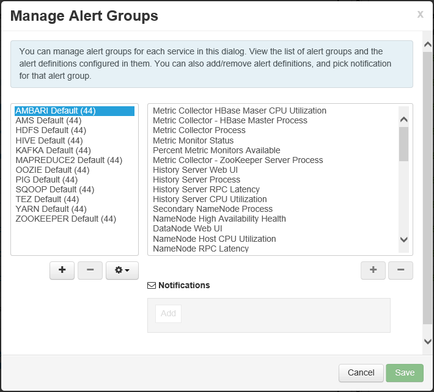

<properties
   pageTitle="Monitorar e gerenciar clusters de HDInsight usando a interface do usuário do Apache Ambari Web | Microsoft Azure"
   description="Saiba como usar Ambari para monitorar e gerenciar clusters de HDInsight baseados em Linux. Neste documento, você aprenderá como usar a interface de usuário do Ambari Web incluído no HDInsight clusters."
   services="hdinsight"
   documentationCenter=""
   authors="Blackmist"
   manager="jhubbard"
   editor="cgronlun"
    tags="azure-portal"/>

<tags
   ms.service="hdinsight"
   ms.devlang="na"
   ms.topic="article"
   ms.tgt_pltfrm="na"
   ms.workload="big-data"
   ms.date="09/27/2016"
   ms.author="larryfr"/>

#Gerenciar clusters HDInsight usando a interface do usuário do Ambari da Web

[AZURE.INCLUDE [ambari-selector](../../includes/hdinsight-ambari-selector.md)]

Apache Ambari simplifica o gerenciamento e o monitoramento de um cluster de Hadoop, fornecendo um fácil de usar web UI e API REST. Ambari está incluído em clusters baseados em Linux HDInsight e é usado para monitorar o cluster e fazer alterações de configuração.

Neste documento, você aprenderá como usar a interface do usuário do Ambari Web com um cluster de HDInsight.

##O que é Ambari?

<a href="http://ambari.apache.org" target="_blank">Apache Ambari</a> torna o gerenciamento de Hadoop mais simples, fornecendo um web fáceis de usar interface do usuário que pode ser usado para provisionar, gerenciar e monitorar clusters Hadoop. Os desenvolvedores podem integrar esses recursos em seus aplicativos usando as <a href="https://github.com/apache/ambari/blob/trunk/ambari-server/docs/api/v1/index.md" target="_blank">APIs REST de Ambari</a>.

A interface do usuário do Ambari Web é fornecida por padrão com clusters HDInsight baseados em Linux. 

##Conectividade

A interface do usuário do Ambari Web está disponível no seu cluster HDInsight em HTTPS://CLUSTERNAME.azurehdidnsight.net, onde __CLUSTERNAME__ é o nome do seu cluster. 

> [AZURE.IMPORTANT] Conectando ao Ambari em HDInsight requer HTTPS. Você também deve autenticar Ambari usando o nome da conta de administrador (o padrão é __administrador__) e senha que você forneceu quando o cluster foi criado.

##Proxy SSH

> [AZURE.NOTE] Enquanto Ambari para o seu cluster é acessível diretamente pela Internet, alguns links da interface Web Ambari (como o JobTracker) não estão expostos na internet. Portanto, você receberá erros de "servidor não encontrado" ao tentar acessar esses recursos, a menos que você use um túnel SSH (Secure Shell) para o tráfego de web proxy para o nó principal do cluster.

Para obter informações sobre a criação de um túnel SSH para trabalhar com Ambari, consulte [Usar SSH túnel para acessar Ambari web UI, ResourceManager, JobHistory, NameNode, Oozie e outra web da interface do usuário](hdinsight-linux-ambari-ssh-tunnel.md).

##Web Ambari da interface do usuário

Quando a conexão com a interface do usuário do Ambari da Web, você será solicitado a autenticar para a página. Use o usuário de administrador de cluster (padrão administração) e a senha usada durante a criação de cluster.

Quando a página é aberta, observe a barra na parte superior. Esta página contém as seguintes informações e controles:

* **Logotipo de Ambari** - abre no painel, que pode ser usado para monitorar o cluster.

* **Operações de # nome cluster** - exibe o número de operações de Ambari em andamento. Selecionando o nome do cluster ou **operações de #** exibirá uma lista das operações de plano de fundo.

* **alertas de #** - avisos ou alertas críticos, se houver, para o cluster. Selecionar isso exibirá uma lista dos alertas.

* **Painel** - exibe o painel de controle.

* **Serviços** - configurações de informações e configuração para os serviços do cluster.

* **Hosts** - informações e configurações para os nós no cluster.

* **Alertas** - um log de informações, avisos e alertas críticos.

* **Administrador** - pilha/serviços de Software que estão instalados no cluster, informações de conta de serviço e a segurança Kerberos.

* **Botão de administração** - gerenciamento Ambari, configurações de usuário e logout.

##Monitoramento

###Alertas

Ambari fornece vários alertas, que terão um dos seguintes como status:

* **Okey**

* **Aviso**

* **CRÍTICA**

* **DESCONHECIDO**

Alertas diferente **Okey** fará com que a entrada de **alertas de #** na parte superior da página para exibir o número de alertas. Selecionar essa entrada exibirá os alertas e seus status.

Alertas são organizadas em vários grupos padrão, que podem ser visualizados na página **alertas** .

Você pode gerenciar os grupos usando o menu **ações** e selecionando **Gerenciar grupos de alerta**. Isso permite modificar grupos existentes ou criar novos grupos.

Você também pode criar notificações de alerta no menu **ações** . Isso permite que você crie disparadores que enviar notificações via **EMAIL** ou **SNMP** quando ocorrerem combinações de alerta/gravidade específico. Por exemplo, você pode enviar um alerta quando qualquer um dos alertas no grupo **Padrão de fio COLORIDO** está definido para **crítico**.

###Cluster

Na guia **métricas** do painel contém uma série de widgets que tornam mais fácil monitorar o status do cluster em um relance. Widgets diversos, como o **Uso da CPU**, fornecem informações adicionais quando clicado.

Na guia **Heatmaps** exibe métricas como heatmaps colorido, partindo de verde para vermelho.

Para obter informações mais detalhadas sobre os nós no cluster, selecione **Hosts**e, em seguida, selecione o nó específico que você está interessado.

###Serviços

Barra lateral de **Serviços** no painel fornece percepção rápida o status dos serviços executados no cluster. Vários ícones são usados para indicar o status ou ações que devem ser executadas, como um símbolo de reciclagem amarelo se um serviço precisa ser reciclados.

Selecionar um serviço exibirão informações mais detalhadas sobre o serviço.

####Links rápidos

Alguns serviços exibem um link de **Links rápidos** na parte superior da página. Isso pode ser usado para acessar específico do serviço web interfaces do usuário, tais como:

* **Histórico de trabalhos** - MapReduce histórico de trabalho.

* **Gerenciador de recursos** - fio COLORIDO ResourceManager UI.

* **NameNode** - interface de usuário do arquivo System (HDFS) NameNode de distribuído Hadoop.

* **IU da Web do Oozie** - Oozie interface do usuário.

Selecionar qualquer um desses links para abrir uma nova guia em seu navegador, que exibirá a página selecionada.

> [AZURE.NOTE] Selecionando um link de **Links rápidos** para qualquer serviço resultará em um erro de "servidor não encontrado", a menos que você estiver usando um túnel Secure Sockets Layer (SSL) para o tráfego de web proxy para cluster. Isso ocorre porque os aplicativos da web usados para exibir essas informações não estão expostos na internet.
>
> Para obter informações sobre como usar um túnel SSL com HDInsight, consulte [Usar SSH túnel para acessar Ambari web UI, ResourceManager, JobHistory, NameNode, Oozie e outra web da interface do usuário](hdinsight-linux-ambari-ssh-tunnel.md)

##Gerenciamento

###Ambari usuários, grupos e permissões

Gerenciar usuários, grupos e permissões não deve ser usado com clusters de HDInsight.

###Hosts

A página de **Hosts** lista todos os hosts no cluster. Para gerenciar hosts, siga estas etapas.

> [AZURE.NOTE] Adicionando, encerramento ou recommissioning um host não deve ser usado com clusters de HDInsight.

1. Selecione o (s) que você deseja gerenciar.

2. Use o menu **ações** para selecionar a ação que você deseja realizar:

    * **Iniciar todos os componentes** - iniciar todos os componentes do host.

    * **Parar todos os componentes** - parar todos os componentes do host.

    * **Reinicie todos os componentes** - parar e iniciar todos os componentes do host.

    * **Ativar o modo de manutenção** - elimina alertas para o host. Isso deve ser habilitado se você estiver executando ações que irão gerar alertas, como reiniciar um serviço que dependem dos serviços em execução.

    * **Desativar o modo de manutenção** - retorna o host alerta normal.

    * **Parar** - paradas DataNode ou NodeManagers do host.

    * **Iniciar** - inicia DataNode ou NodeManagers do host.

    * **Reinicie** - interrompe e inicia DataNode ou NodeManagers do host.

    * **Descomissionamento** - remove um host do cluster.

        > [AZURE.NOTE] Não use esta ação em clusters de HDInsight.

    * **Recommission** - adiciona um host anteriormente encerrado ao cluster.

        > [AZURE.NOTE] Não use esta ação em clusters de HDInsight.

###Serviços

Na página do **Dashboard** ou **Serviços** , use o botão **ações** na parte inferior da lista de serviços parar e iniciar todos os serviços.

> [AZURE.WARNING] Enquanto __Adicionar serviço__ estiver listado no menu, ele não deve ser usado para adicionar serviços ao cluster HDInsight. Novos serviços devem ser adicionados usando uma ação de Script durante a configuração de cluster. Para obter mais informações sobre como usar ações de Script, consulte [Personalizar HDInsight clusters usando ações de Script](hdinsight-hadoop-customize-cluster-linux.md).

Enquanto o botão **ações** pode reinicie todos os serviços, muitas vezes você deseja iniciar, parar ou reiniciar um serviço específico. Use as etapas a seguir para executar ações em um serviço individual:

1. Na página do **Dashboard** ou **Serviços** , selecione um serviço.

2. Da parte superior da guia **Resumo** , use o botão **Ações de serviço** e selecione a ação a ser executada. Isto irá reiniciar o serviço em todos os nós.

    

    > [AZURE.NOTE] Reiniciando alguns serviços enquanto o cluster está em execução pode gerar alertas. Para evitar isso, você pode usar o botão **Ações de serviço** para habilitar o **modo de manutenção** do serviço antes de executar a reinicialização.

3. Depois que uma ação foi selecionada, a entrada de **op #** na parte superior da página será incrementado para mostrar o que está ocorrendo uma operação de plano de fundo. Se configurado para exibir, na lista de operações de plano de fundo será exibida.

    > [AZURE.NOTE] Se você ativou o **modo de manutenção** do serviço, lembre-se de desativá-lo usando o botão **Ações de serviço** quando a operação tiver terminado.

Para configurar um serviço, use as seguintes etapas:

1. Na página do **Dashboard** ou **Serviços** , selecione um serviço.

2. Selecione a guia **configurações** . A configuração atual será exibida. Uma lista de configurações anteriores também é exibida.

    

3. Use os campos exibidos para modificar a configuração e, em seguida, selecione **Salvar**. Ou selecione uma configuração anterior e, em seguida, **tornar atual** para reverter para as configurações anteriores.

##Modos de exibição de Ambari

Modos de exibição de Ambari permitem aos desenvolvedores conecte elementos de interface do usuário a interface do usuário do Ambari Web usando a [Estrutura de modos de exibição de Ambari](https://cwiki.apache.org/confluence/display/AMBARI/Views). HDInsight fornece as seguintes exibições com tipos de cluster Hadoop:

* Gerenciador de fila fio colorido: O Gerenciador de fila fornece uma interface de usuário simple para visualizar e modificar filas de fio COLORIDO.
* Modo de exibição de seção: O modo de exibição de seção permite executar consultas de seção diretamente do seu navegador da web. Você pode salvar consultas, exibir resultados, salvar os resultados ao armazenamento de cluster ou baixar resultados para seu sistema local. Para obter mais informações sobre como usar modos de exibição de seção, consulte [Usar modos de exibição seção com HDInsight](hdinsight-hadoop-use-hive-ambari-view.md).
* Modo de exibição de Tez: Exibir Tez permite entender melhor e otimizar trabalhos exibindo informações sobre como Tez trabalhos são executados e quais recursos são usados pelo trabalho.
