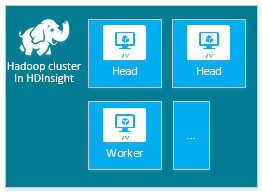
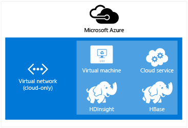

<properties
    pageTitle="Criar clusters Hadoop, HBase, tempestade ou Spark no Linux em HDInsight | Microsoft Azure"
    description="Aprenda a criar Hadoop, HBase, tempestade ou gerar clusters no Linux para HDInsight usando um navegador, o Azure CLI, Azure PowerShell, restante, ou por meio de um SDK."
    services="hdinsight"
    documentationCenter=""
    authors="mumian"
    manager="jhubbard"
    editor="cgronlun"
    tags="azure-portal"/>

<tags
    ms.service="hdinsight"
    ms.devlang="na"
    ms.topic="article"
    ms.tgt_pltfrm="na"
    ms.workload="big-data"
    ms.date="10/18/2016"
    ms.author="jgao"/>

# Criar clusters baseados em Linux Hadoop em HDInsight

[AZURE.INCLUDE [selector](../../includes/hdinsight-selector-create-clusters.md)]

Um cluster de Hadoop consiste em várias máquinas virtuais (nós) são usadas para processamento distribuído de tarefas no cluster. Azure elimina os detalhes de implementação de instalação e configuração de nós individuais, para que você só precisará fornecer informações de configuração gerais. Neste artigo, você aprenderá sobre essas configurações.

## Requisitos de controle de acesso

[AZURE.INCLUDE [access-control](../../includes/hdinsight-access-control-requirements.md)]

## Tipos de cluster

Atualmente, Azurehdinsight fornece cinco tipos diferentes de clusters, cada uma com um conjunto de componentes para fornecer certas funcionalidades.

| Tipo de cluster | Funcionalidade |
| ------------ | ----------------------------- |
| Hadoop       | Consulta e análise (trabalhos em lotes)     |
| HBase        | Armazenamento de dados NoSQL            |
| Tempestade        | Processamento de eventos em tempo real |
| Spark        | Processamento de na memória, consultas interativas, processamento de fluxo de microlote |
| [Seção interativa (prévia)](hdinsight-hadoop-use-interactive-hive.md) | Na memória cache para consultas de seção interativas e mais rápidas|
| Servidor de R em Spark (prévia) | Uma variedade de estatísticas de grande volume, modelagem de previsão e recursos de aprendizado de máquina |

Cada tipo de cluster tem seu próprio número de nós dentro do cluster, terminologia para nós dentro do cluster e tamanho de máquina virtual padrão para cada tipo de nó. Na tabela a seguir, o número de nós para cada tipo de nó é entre parênteses.

| Tipo| Nós | Diagrama|
|-----|------|--------|
|Hadoop| Cabeça nó (2), dados (1 +)||
|HBase|Servidor de ponta (2), servidor de região (1 +), nó mestre/Zookeeper (3)||
|Tempestade|Nimbus nó (2), servidor de Supervisor (1 +), Zookeeper (3)||
|Spark|Cabeça nó (2), nó de trabalho (1 +), Zookeeper (3) (grátis para tamanho de máquina virtual Zookeepers de A1)||

A tabela a seguir lista os tamanhos de máquina virtual padrão para HDInsight:

- Todas as regiões, exceto Brasil Sul e Oeste Japão:

  	|Tipo de cluster                     | Hadoop               | HBase                | Tempestade                | Spark                                                                 | Servidor de R |
  	|---------------------------------|----------------------|----------------------|----------------------|-----------------------------------------------------------------------|-----------------------------------------------------------------------|
  	|Padrão de cabeça – tamanho de máquina virtual           | D3 v2                | D3 v2                | A3                   | D12 v2                                                                | D12 v2                                                                |
  	|Cabeça – recomendados tamanhos de máquina virtual      | V2 D3, D4 v2, D12 v2 | V2 D3, D4 v2, D12 v2 | A3, A4, A5           | V2 D12, v2 D13, D14 v2                                                | V2 D12, v2 D13, D14 v2                                                |
  	|Trabalhador – padrão tamanho de máquina virtual         | D3 v2                | D3 v2                | D3 v2                | Windows: D12 v2; Linux: D4 v2                                         | Windows: D12 v2; Linux: D4 v2                                         |
  	|Trabalhador – recomendados tamanhos de máquina virtual    | V2 D3, D4 v2, D12 v2 | V2 D3, D4 v2, D12 v2 | V2 D3, D4 v2, D12 v2 | Windows: D12 v2 D13 v2, D14 v2; Linux: D4 v2, D12 v2, v2 D13, D14 v2 | Windows: D12 v2 D13 v2, D14 v2; Linux: D4 v2, D12 v2, v2 D13, D14 v2 |
  	|Zookeeper – padrão tamanho de máquina virtual      |                      | A3                   | A2                   |                                                                       |
  	|Zookeeper – recomendados tamanhos de máquina virtual |                      | A3, A4, A5           | A2, A3, A4           |                                                                       |
  	|Borda - padrão tamanho de máquina virtual           |                      |                      |                      |                                                                       | Windows: D12 v2; Linux: D4 v2                                         |
  	|Borda - máquina virtual tamanho recomendada       |                      |                      |                      |                                                                       | Windows: D12 v2 D13 v2, D14 v2; Linux: D4 v2, D12 v2, v2 D13, D14 v2 |

- Brasil Sul e Oeste Japão somente (aqui sem tamanhos v2):

  	|Tipo de cluster                     | Hadoop      | HBase       | Tempestade      | Spark                                          |Servidor de R|
  	|---------------------------------|-------------|-------------|------------|------------------------------------------------|--------|
  	|Padrão de cabeça – tamanho de máquina virtual           | D3          | D3          | A3         | D12                                            | D12|
  	|Cabeça – recomendados tamanhos de máquina virtual      | D3, D4, D12 | D3, D4, D12 | A3, A4, A5 | D14 D12, D13,                                  | D14 D12, D13,|
  	|Trabalhador – padrão tamanho de máquina virtual         | D3          | D3          | D3         | Windows: D12; Linux: D4                        | Windows: D12; Linux: D4|
  	|Trabalhador – recomendados tamanhos de máquina virtual    | D3, D4, D12 | D3, D4, D12 | D3, D4, D12| Windows: D12, D13, D14; Linux: D4, D14 D12, D13,| Windows: D12, D13, D14; Linux: D4, D14 D12, D13,|
  	|Zookeeper – padrão tamanho de máquina virtual      |             | A2          | A2         |                                                | |
  	|Zookeeper – recomendados tamanhos de máquina virtual |             | A2, A3, A4  | A2, A3, A4 |                                                | |
  	|Borda – padrão tamanhos de máquina virtual          |             |             |            |                                                | Windows: D12; Linux: D4 |
  	|Borda – recomendados tamanhos de máquina virtual      |             |             |            |                                                | Windows: D12, D13, D14; Linux: D4, D14 D12, D13, |

Observe que cabeça é conhecida como *Nimbus* para o tipo de cluster tempestade. Trabalhador é conhecido como *região* para o tipo de cluster HBase e *Supervisor* para o tipo de cluster tempestade.

> [AZURE.IMPORTANT] Se você planeja ter mais de 32 nós de trabalho, na criação de cluster ou dimensionando cluster após a criação, você deve selecionar um tamanho de nó principal com pelo menos 8 cores e 14 GB de RAM.

Você pode adicionar outros componentes como matiz ou R para esses tipos básicos usando [Ações de Script](#customize-clusters-using-script-action).

> [AZURE.IMPORTANT] HDInsight clusters ocorrer em uma variedade de tipos, que correspondem a carga de trabalho ou a tecnologia que o cluster é ajustado para. Não haverá nenhum método com suporte para criar um cluster que combina vários tipos, como tempestade e HBase em um cluster. 

Se sua solução requer tecnologias que são distribuídas entre vários tipos de cluster HDInsight, você deve criar uma rede Virtual do Azure e crie os tipos de cluster necessários dentro da rede virtual. Isso permite que os clusters e qualquer código que você implantá-los, para se comunicar diretamente uns com os outros.

Para obter mais informações sobre como usar uma rede Virtual do Azure com HDInsight, consulte [Estender HDInsight com redes virtuais do Azure](hdinsight-extend-hadoop-virtual-network.md).

Para obter um exemplo de como usar dois tipos de cluster dentro de uma rede Virtual do Azure, consulte [análise de dados de sensor com tempestade e HBase](hdinsight-storm-sensor-data-analysis.md).

## Níveis de cluster

Azure HDInsight fornece as ofertas de nuvem de grande volume em duas categorias: Standard e [Premium](hdinsight-component-versioning.md#hdinsight-standard-and-hdinsight-premium). HDInsight Premium inclui R e outros componentes adicionais. HDInsight Premium é suportado apenas em HDInsight versão 3.4.

A tabela a seguir lista o tipo de cluster HDInsight e matriz de suporte de HDInsight Premium.

| Tipo de cluster | Padrão | Premium  |
|--------------|---------------|--------------|
| Hadoop       | Sim           | Sim          |
| Spark        | Sim           | Sim          |
| HBase        | Sim           | Não           |
| Tempestade        | Sim           | Não           |
| Servidor de R em Spark | Não | Sim |

Esta tabela será atualizada como mais tipos de cluster estão incluídos no HDInsight Premium. A captura de tela a seguir mostra as informações de portal Azure para escolher os tipos de cluster.

## Opções de configuração básica

A seguir estão as opções de configuração básica usadas para criar um cluster de HDInsight.

### Nome do cluster ###

Nome do cluster é usado para identificar um cluster. Nome do cluster deve ser exclusivo, e ele deve seguir as seguintes diretrizes de nomenclatura:

- O campo deve ser uma cadeia de caracteres que contém entre 3 e 63 caracteres.
- O campo pode conter apenas letras, números e hifens.

### Tipo de cluster###

Consulte [tipos de Cluster](#cluster-types) e [níveis de Cluster](#cluster-tiers).

### Sistema Operacional ###

Você pode criar clusters de HDInsight um dos dois sistemas operacionais a seguir:

- HDInsight no Linux.  HDInsight fornece a opção de configurar clusters Linux no Azure. Configurar um cluster de Linux se você estiver familiarizado com Linux ou Unix, migrando de uma solução baseada em Linux Hadoop existente, ou deseja fácil integração com componentes de ecossistema do Hadoop criados para Linux. Para obter mais informações, consulte [Introdução ao Hadoop no Linux em HDInsight](hdinsight-hadoop-linux-tutorial-get-started.md).
- HDInsight no Windows (Windows Server 2012 R2 Data Center).

### Versão de HDInsight###

Isso é usado para determinar a versão do HDInsight necessária para esse cluster. Para obter mais informações, consulte [versões de cluster Hadoop e componentes em HDInsight](https://go.microsoft.com/fwLink/?LinkID=320896&clcid=0x409).

### Nome da assinatura###

Cada cluster HDInsight está vinculado a uma assinatura do Azure.

### Nome do grupo de recursos ###

Ajuda do [Gerenciador de recursos do Azure](../azure-resource-manager/resource-group-overview.md) você a trabalhar com os recursos em seu aplicativo como um grupo, conhecido como um grupo de recursos do Azure. Você pode implantar, atualizar, monitorar ou excluir todos os recursos para seu aplicativo em uma única operação coordenado.

### Credenciais###

Com clusters de HDInsight, você pode configurar duas contas de usuário durante a criação de cluster:

- Usuário HTTP. O nome de usuário padrão é *administrador* usando a configuração básica no portal do Azure. Às vezes, ele é chamado "Usuário de Cluster".
- Usuário SSH (Linux clusters). Isso é usado para conectar-se ao cluster usando SSH. Você pode criar contas de usuário SSH adicionais após a criação do cluster seguindo as etapas em [Uso SSH com baseado em Linux Hadoop em HDInsight do Linux, Unix ou OS X](hdinsight-hadoop-linux-use-ssh-unix.md) ou [Use SSH com baseado em Linux Hadoop em HDInsight do Windows](hdinsight-hadoop-linux-use-ssh-unix.md).

    >[AZURE.NOTE] Para clusters baseados no Windows, você pode criar um usuário RDP para se conectar ao cluster usando RDP.

### Fonte de dados###

O sistema de arquivo Hadoop distribuído original (HDFS) usa muitos discos locais no cluster. HDInsight usa o armazenamento de Blob do Azure para armazenamento de dados. Armazenamento de Blob do Azure é uma solução de armazenamento geral robustos que integra-se com HDInsight. Por meio de uma interface HDFS, o conjunto completo de componentes de HDInsight pode operar diretamente nos dados estruturados ou não no armazenamento de Blob. Armazenamento de dados no armazenamento de Blob ajuda você a excluir com segurança os clusters HDInsight que são usados para computação sem perder dados do usuário.

Durante a configuração, você deve especificar uma conta de armazenamento do Azure e um contêiner de armazenamento de Blob do Azure na conta de armazenamento do Azure. Alguns processos de criação exigem a conta de armazenamento do Azure e o contêiner de armazenamento de Blob seja criado com antecedência. O contêiner de armazenamento de Blob é usado como o local de armazenamento padrão pelo cluster. Opcionalmente, você pode especificar outras contas de armazenamento do Azure (armazenamento vinculado) que serão acessíveis pelo cluster. O cluster também pode acessar qualquer contêineres de armazenamento de Blob que estão configurados com acesso de leitura público completa ou público acesso de leitura para blobs somente.  Para obter mais informações, consulte [Gerenciar o acesso aos recursos de armazenamento do Azure](../storage/storage-manage-access-to-resources.md).

>[AZURE.NOTE] Um contêiner de armazenamento de Blob fornece um agrupamento de um conjunto de blobs, conforme mostrado na imagem a seguir.

Não é recomendável usar o contêiner de armazenamento de Blob padrão para armazenar dados corporativos. Excluindo o contêiner de armazenamento de Blob padrão após cada uso para reduzir o custo de armazenamento é uma boa prática. Observe que o recipiente padrão contém aplicativo e sistema logs. Certifique-se de recuperar os logs antes de excluir o contêiner.

>[AZURE.WARNING] Não há suporte para o compartilhamento de um contêiner de armazenamento de Blob para vários clusters.

Para obter mais informações sobre como usar o armazenamento de Blob secundário, consulte [Usando o armazenamento de Blob Azure com HDInsight](hdinsight-hadoop-use-blob-storage.md).

Além de armazenamento de Blob do Azure, você também pode usar o [Armazenamento de Lucerne de dados do Azure](../data-lake-store/data-lake-store-overview.md) como uma conta de armazenamento padrão para cluster de HBase HDInsight e armazenamento vinculado para todos os quatro tipos de cluster HDInsight. Para obter mais informações, consulte [criar um cluster de HDInsight com armazenamento de Lucerne de dados usando o portal Azure](../data-lake-store/data-lake-store-hdinsight-hadoop-use-portal.md).

### Local (região) ###

Cluster HDInsight e sua conta de armazenamento do padrão devem estar localizados no mesmo local Azure.

Para obter uma lista das regiões com suporte, clique na lista de lista suspensa de **região** na [HDInsight preços](https://go.microsoft.com/fwLink/?LinkID=282635&clcid=0x409).

### Nó níveis de preços###

Os clientes são cobrados para o uso de nós para a duração da vida do cluster. Cobrança inicia quando um cluster é criado e é interrompido quando o cluster é excluído. Clusters não podem ser alocadas eliminação ou colocar em espera.

Tipos de cluster diferentes têm diferentes tipos de nó, números de nós e tamanhos de nós. Por exemplo, um tipo de cluster Hadoop tem dois _nós de cabeça_ e um padrão de quatro _nós de dados_, enquanto um tipo de cluster tempestade tem dois _nós de nimbus_, três _nós zookeeper_e um padrão de quatro _nós supervisor_. O custo de HDInsight clusters é determinado pelo número de nós e os tamanhos de máquinas virtuais para os nós. Por exemplo, se você souber que você executarão operações que precisam de muita memória, você talvez queira selecionar um recurso de computação com mais memória. Para fins de aprendizado, é recomendável usar um nó de dados. Para obter mais informações sobre preços de HDInsight, consulte [HDInsight preços](https://go.microsoft.com/fwLink/?LinkID=282635&clcid=0x409).

>[AZURE.NOTE] O limite de tamanho de cluster varia entre assinaturas do Azure. Contate o suporte de cobrança para aumentar o limite.

>Os nós usado pelo seu cluster não contam como máquinas virtuais porque as imagens de máquina virtual usadas para os nós são um detalhe de implementação do serviço HDInsight. As cores de computação usadas por nós contam para o número total de computação cores disponíveis para sua assinatura. Você pode ver o número de cores disponíveis e as cores que serão usados pelo cluster na seção de resumo da lâmina níveis de preços de nó ao criar um cluster de HDInsight.

Quando você usa o portal do Azure para configurar o cluster, o tamanho do nó está disponível por meio de lâmina __Nó preços camada__ . Você também pode ver o custo associado os tamanhos de nó diferente. A captura de tela a seguir mostra as opções para um cluster de Hadoop base Linux.

As tabelas a seguir mostram os tamanhos suportados pelo HDInsight clusters e as capacidades que eles fornecem.

#### Nível padrão: uma série####

No modelo clássico de implantação, alguns tamanhos de máquina virtual são ligeiramente diferentes no PowerShell e CLI.
* Standard_A3 é grande
* Standard_A4 é ExtraLarge

|Tamanho |Cores de CPU|Memória|NICs (Max)|Máx. tamanho do disco|Máx. discos de dados (1023 GB cada)|Máx. IOPS (500 por disco)|
|---|---|---|---|---|---|---|
|Standard_A3\Large|4|7 GB|2|Temporário = 285 GB |8|8 x 500|
|Standard_A4\ExtraLarge|8|14 GB|4|Temporário = 605 GB |16|16 x 500|
|Standard_A6|4|28 GB|2|Temporário = 285 GB |8|8 x 500|
|Standard_A7|8|GB 56|4|Temporário = 605 GB |16|16 x 500|

#### Nível padrão: série D####

|Tamanho |Cores de CPU|Memória|NICs (Max)|Máx. tamanho do disco|Máx. discos de dados (1023 GB cada)|Máx. IOPS (500 por disco)|
|---|---|---|---|---|---|---|
|Standard_D3 |4|14 GB|4|Temporário (SSD) = 200 GB |8|8 x 500|
|Standard_D4 |8|28 GB|8|Temporário (SSD) = 400 GB |16|16 x 500|
|Standard_D12 |4|28 GB|4|Temporário (SSD) = 200 GB |8|8 x 500|
|Standard_D13 |8|GB 56|8|Temporário (SSD) = 400 GB |16|16 x 500|
|Standard_D14 |16|GB 112|8|Temporário (SSD) = 800 GB |32|32 x 500|

#### Nível padrão: Dv2 série####

|Tamanho |Cores de CPU|Memória|NICs (Max)|Máx. tamanho do disco|Máx. discos de dados (1023 GB cada)|Máx. IOPS (500 por disco)|
|---|---|---|---|---|---|---|
|Standard_D3_v2 |4|14 GB|4|Temporário (SSD) = 200 GB |8|8 x 500|
|Standard_D4_v2 |8|28 GB|8|Temporário (SSD) = 400 GB |16|16 x 500|
|Standard_D12_v2 |4|28 GB|4|Temporário (SSD) = 200 GB |8|8 x 500|
|Standard_D13_v2 |8|GB 56|8|Temporário (SSD) = 400 GB |16|16 x 500|
|Standard_D14_v2 |16|GB 112|8|Temporário (SSD) = 800 GB |32|32 x 500|    

Para considerações de implantação a serem consideradas quando você estiver planejando usar esses recursos, consulte [tamanhos para máquinas virtuais](../virtual-machines/virtual-machines-windows-sizes.md). Para obter informações sobre preços de vários tamanhos, consulte [HDInsight preços](https://azure.microsoft.com/pricing/details/hdinsight).   

> [AZURE.IMPORTANT] Se você planeja ter mais de 32 nós de trabalho, na criação de cluster ou dimensionando cluster após a criação, você deve selecionar um tamanho de nó principal com pelo menos 8 cores e 14 GB de RAM.

Cobrança inicia quando um cluster é criado e é interrompido quando o cluster é excluído. Para obter mais informações sobre preços, consulte [detalhes de preços de HDInsight](https://azure.microsoft.com/pricing/details/hdinsight/).

## Usar o armazenamento adicional

Em alguns casos, talvez você queira adicionar armazenamento adicional ao cluster. Por exemplo, você pode ter várias contas de armazenamento do Azure para diferentes regiões geográficas ou serviços diferentes, mas quiser analisá-los todos com HDInsight.

Quando você cria um cluster de HDInsight ou após um cluster tiver sido criado, você pode adicionar contas de armazenamento.  Consulte [clusters baseados em Personalizar Linux HDInsight usando a ação de Script](hdinsight-hadoop-customize-cluster-linux.md).

Para obter mais informações sobre o armazenamento de Blob secundário, consulte [armazenamento de Blob do Azure usando com HDInsight](hdinsight-hadoop-use-blob-storage.md). Para obter mais informações sobre o armazenamento de Lucerne de dados secundária, consulte [criar HDInsight clusters com armazenamento de Lucerne de dados usando o portal do Azure](../data-lake-store/data-lake-store-hdinsight-hadoop-use-portal.md).

## Use a seção/Oozie metastore

É altamente recomendável que você use um metastore personalizado se você quiser manter suas tabelas de seção após excluir seu cluster HDInsight. Você poderá anexar que metastore a outro cluster HDInsight.

> [AZURE.IMPORTANT] Metastore HDInsight criado para uma versão de cluster HDInsight, não podem ser compartilhados entre diferentes versões de cluster HDInsight. Para obter uma lista das versões de HDInsight, consulte [versões de HDInsight com suporte](hdinsight-component-versioning.md#supported-hdinsight-versions).

O metastore contém metadados de seção e Oozie, como tabelas de seção, partições, esquemas e colunas. O metastore ajuda você a manter seus metadados de seção e Oozie, então você não precisa recriar tabelas de seção ou trabalhos de Oozie quando você cria um novo cluster. Por padrão, a seção usa um banco de dados do SQL Azure incorporado armazenar essas informações. O banco de dados inserido não é possível preservar os metadados quando o cluster é excluído. Quando você cria a tabela de seção em um cluster de HDInsight com um metastore seção configurado, nessas tabelas serão mantidas quando você recria o cluster usando o mesmo metastore de seção.

Configuração de Metastore não está disponível para os tipos de cluster HBase.

> [AZURE.IMPORTANT] Ao criar um metastore personalizado, não use um nome de banco de dados que contenha traços ou hifens. Isso pode causar o processo de criação de cluster falha.

## Usar redes virtuais Azure

Com uma [rede virtual Azure](https://azure.microsoft.com/documentation/services/virtual-network/), você pode criar uma rede segura e persistente que contém os recursos que necessários para a sua solução. Com uma rede virtual, você pode:

* Conecte recursos de nuvem juntos em uma rede privada (somente na nuvem).

    

* Conecte os recursos de nuvem para sua rede do data center local (-to-site ou ponto-a-site) usando uma rede virtual privada (VPN).

| Configuração de-to-site | Configuração de ponto-a-site |
| -------------------------- | --------------------------- |
| Com a configuração de-to-site, você pode conectar vários recursos do data center à rede virtual Azure usando uma VPN de hardware ou o roteamento e serviço de acesso remoto.  | Com a configuração de ponto-a-site, você pode conectar um recurso específico para a rede virtual Azure usando um software VPN.  |

Clusters baseados no Windows exigem um v1 rede virtual (clássico), enquanto clusters baseados em Linux exigem uma rede virtual do v2 (Azure Resource Manager). Se você não tiver o tipo correto de rede, não será útil quando você cria o cluster.

Para obter mais informações sobre como usar HDInsight com uma rede virtual, incluindo os requisitos de configuração específica da rede virtual, consulte [recursos de estender HDInsight usando uma rede virtual Azure](hdinsight-extend-hadoop-virtual-network.md).

## Personalizar clusters usando a personalização de cluster HDInsight (inicialização)

Às vezes, você deseja configurar os arquivos de configuração a seguir:

- clusterIdentity.xml
- núcleo-site.xml
- gateway.XML
- hbase-env.xml
- hbase-site.xml
- HDFS-site.xml
- seção env.xml
- seção site.xml
- site de mapred
- oozie-site.xml
- oozie-env.xml
- site.xml de tempestade
- tez-site.xml
- webhcat-site.xml
- fio colorido-site.xml

Para manter as alterações por meio de vida de um cluster, você pode usar a personalização de cluster HDInsight durante o processo de criação, ou você pode usar Ambari em clusters baseados em Linux. Para obter mais informações, consulte [Personalizar HDInsight clusters usando inicialização](hdinsight-hadoop-customize-cluster-bootstrap.md).

>[AZURE.NOTE] Os clusters baseados no Windows não podem reter as alterações devido a imagem novamente. Para obter mais informações, consulte [Função instância reiniciado devido à atualizações de sistema operacional](http://blogs.msdn.com/b/kwill/archive/2012/09/19/role-instance-restarts-due-to-os-upgrades.aspx).  Para manter as alterações por meio de vida útil dos clusters, você deve usar personalização de cluster HDInsight durante o processo de criação.

## Personalizar clusters usando a ação de Script

Você pode instalar componentes adicionais ou personalizar configuração cluster usando scripts durante a criação. Esses scripts são chamados por meio de **Ação de Script**, que é uma opção de configuração que pode ser usada com o portal do Azure, cmdlets HDInsight Windows PowerShell ou o SDK do .NET HDInsight. Para obter mais informações, consulte [Personalizar HDInsight cluster usando a ação de Script](hdinsight-hadoop-customize-cluster-linux.md).

Alguns componentes Java nativos, como Mahout e em cascata, podem ser executados no cluster como arquivos Java Archive (JAR). Esses arquivos JAR podem ser distribuídos ao armazenamento de Blob do Azure e enviados para HDInsight clusters através de mecanismos de envio de trabalho do Hadoop. Para obter mais informações, consulte [Enviar Hadoop trabalhos programaticamente](hdinsight-submit-hadoop-jobs-programmatically.md).

>[AZURE.NOTE] Se você tiver problemas para HDInsight clusters implantar arquivos JAR ou chamar arquivos JAR em clusters de HDInsight, contate o [Suporte da Microsoft](https://azure.microsoft.com/support/options/).

> Em cascata não é suportado pelo HDInsight e não está qualificado para o Microsoft Support. Listas de componentes com suporte, consulte [Novidades nas versões cluster fornecidas pelo HDInsight?](hdinsight-component-versioning.md)

## Use o nó de borda

 Um nó de borda vazia é uma máquina virtual de Linux com as mesmas ferramentas de cliente instalado e configurado como o headnodes. Você pode usar o nó de borda para acessar o cluster, teste seus aplicativos de cliente e hospedar seus aplicativos de cliente. Para obter mais informações, consulte [nós de borda vazia de uso em HDInsight](hdinsight-apps-use-edge-node.md).
 
## Métodos de criação de cluster

Neste artigo, você aprendeu informações básicas sobre a criação de um cluster de HDInsight baseados em Linux. Use a tabela a seguir para localizar informações específicas sobre como criar um cluster usando um método que melhor atenda às suas necessidades.

| Clusters criados com | Navegador da Web | Linha de comando | API REST | SDK | Linux, Mac OS X ou Unix | Windows |
| ------------------------------- |:----------------------:|:--------------------:|:------------------:|:------------:|:-----------------------------:|:------------:|
| [O portal do Azure](hdinsight-hadoop-create-linux-clusters-portal.md) | ✔     | &nbsp; | &nbsp; | &nbsp; | ✔      | ✔ |
| [Fábrica de dados do Azure](hdinsight-hadoop-create-linux-clusters-adf.md) | ✔     | ✔  | ✔  |✔  | ✔      | ✔ |
| [CLI Azure](hdinsight-hadoop-create-linux-clusters-azure-cli.md)         | &nbsp; | ✔     | &nbsp; | &nbsp; | ✔      | ✔ |
| [PowerShell Azure](hdinsight-hadoop-create-linux-clusters-azure-powershell.md) | &nbsp; | ✔     | &nbsp; | &nbsp; | ✔ | ✔ |
| [Ondulação](hdinsight-hadoop-create-linux-clusters-curl-rest.md) | &nbsp; | ✔     | ✔ | &nbsp; | ✔      | ✔ |
| [.NET SDK](hdinsight-hadoop-create-linux-clusters-dotnet-sdk.md) | &nbsp; | &nbsp; | &nbsp; | ✔ | ✔      | ✔ |
| [Modelos de Gerenciador de recursos do Azure](hdinsight-hadoop-create-linux-clusters-arm-templates.md) | &nbsp; | ✔     | &nbsp; | &nbsp; | ✔      | ✔ |
