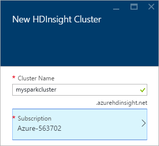
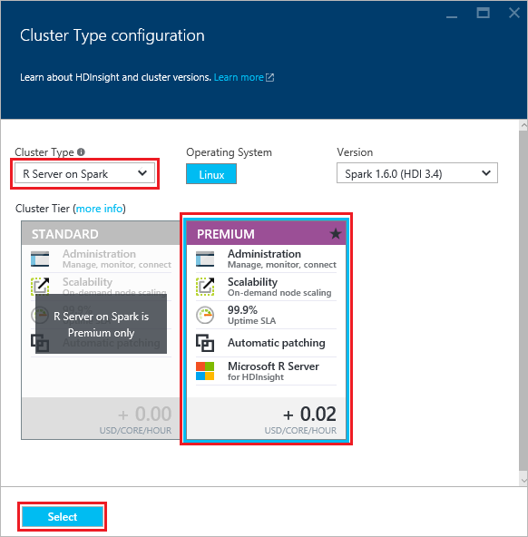
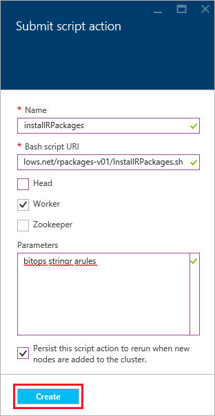

<properties
   pageTitle="Introdução ao servidor de R em HDInsight (visualização) | Azure"
   description="Aprenda a criar um Spark Apache em cluster HDInsight (Hadoop) que inclui R Server (demonstração) e, em seguida, envie um script de R no cluster."
   services="HDInsight"
   documentationCenter=""
   authors="jeffstokes72"
   manager="jhubbard"
   editor="cgronlun"
/>

<tags
   ms.service="HDInsight"
   ms.devlang="R"
   ms.topic="article"
   ms.tgt_pltfrm="na"
   ms.workload="data-services"
   ms.date="08/19/2016"
   ms.author="jeffstok"
/>

# Começar a usar o servidor de R em HDInsight (prévia)

A camada de premium oferta para HDInsight inclui servidor R como parte do seu cluster HDInsight (visualização). Isso permite que os scripts de R usar MapReduce e Spark para executar cálculos distribuídos. Neste documento, você aprenderá a criar um novo servidor R em HDInsight, em seguida, execute um script de R que demonstra usando Spark para cálculos de R distribuídos.

## Pré-requisitos

* __Assinatura de um Azure__: antes de iniciar este tutorial, você deve ter uma assinatura do Azure. Consulte [avaliação gratuita do Azure obter](https://azure.microsoft.com/documentation/videos/get-azure-free-trial-for-testing-hadoop-in-hdinsight/) para obter mais informações.

* __A Secure Shell (SSH) cliente__: um SSH cliente é usado para conectar ao HDInsight cluster e executar comandos diretamente no cluster remotamente. Os sistemas Linux, Unix e OS X fornecem um cliente SSH através do `ssh` comando. Para sistemas Windows, é recomendável [Acabamento](http://www.chiark.greenend.org.uk/~sgtatham/putty/download.html).

    * __Teclas de SSH (opcionais)__: você pode proteger a conta SSH usada para se conectar ao cluster usando uma senha ou uma chave pública. Usando uma senha é mais fácil e permite que você começar a trabalhar sem precisar criar um par de chaves pública/particular; No entanto, usando uma chave é mais segura.
    
        As etapas neste documento presumem que você está usando uma senha. Para obter informações sobre como criar e usar as teclas SSH com HDInsight, consulte os seguintes documentos:
        
        * [Usar SSH com HDInsight de clientes Linux, Unix ou OS X](hdinsight-hadoop-linux-use-ssh-unix.md)
        
        * [Usar SSH com HDInsight de clientes do Windows](hdinsight-hadoop-linux-use-ssh-windows.md)

### Requisitos de controle de acesso

[AZURE.INCLUDE [access-control](../../includes/hdinsight-access-control-requirements.md)]

## Criar o cluster

> [AZURE.NOTE] As etapas neste documento criam um servidor R em HDInsight usando informações básicas de configuração. Para outras configurações cluster (como a adição de contas de armazenamento adicional, usando uma rede Virtual do Azure ou criando um metastore para seção), consulte [clusters baseados em Linux criar HDInsight](hdinsight-hadoop-provision-linux-clusters.md).

1. Entrar no [portal do Azure](https://portal.azure.com).

2. Selecione __novo__, __dados + Analytics__e, em seguida, __HDInsight__.

    

3. Insira um nome para o cluster no campo __Nome de Cluster__ . Se você tiver várias assinaturas Azure, use a entrada de __inscrição__ para selecionar o que você deseja usar.

    

4. Selecione o __tipo de Cluster__. Na lâmina __Cluster tipo__ , selecione as seguintes opções:

    * __Tipo de cluster__: servidor R em Spark
    
    * __Nível de cluster__: Premium

    Deixe as outras opções com os valores padrão e, em seguida, use o botão __Selecionar__ para salvar o tipo de cluster.
    
    
    
    > [AZURE.NOTE] Você também pode adicionar servidor R para outros tipos de cluster HDInsight (como Hadoop ou HBase,) selecionando o tipo de cluster e, em seguida, selecionando __Premium__.

5. Selecione o **Grupo de recursos** para ver uma lista de grupos de recursos existentes e selecione uma para criar o cluster no. Ou, você pode selecionar **Criar novo** e, em seguida, insira o nome do novo grupo de recursos. Uma marca de seleção verde aparecerá para indicar que o novo nome de grupo está disponível.

    > [AZURE.NOTE] Essa entrada padrão será um de seus grupos de recursos existentes, se estiverem disponíveis.
    
    Use o botão __Selecionar__ para salvar o grupo de recursos.

6. Selecione **as credenciais**e insira um **Nome de usuário de Login de Cluster** e a **Senha de logon do Cluster**.

    Insira um __nome de usuário SSH__.  SSH é usado para se conectar remotamente ao cluster usando um cliente __SSH (Secure Shell)__ . Você pode especificar o usuário SSH nesta caixa de diálogo ou após o cluster foi criado (guia de configuração para cluster). Servidor de R está configurado para esperar um __nome de usuário SSH__ de "remoteuser".  Se você usar um nome de usuário diferentes, você precisará executar uma etapa adicional após a criação do cluster.
    
    

    __Tipo de autenticação SSH__: selecione __senha__ como o tipo de autenticação, a menos que você preferir usar de uma chave pública.  Você precisará de um par de chaves pública/particular se você gostaria de acessar o servidor de R em cluster por meio de um cliente remoto, por exemplo, RTVS, RStudio ou outro desktop IDE.   

    Para criar e usar uma chave pública/particular par selecione 'Chave pública' e proceda da seguinte maneira.  Estas instruções pressupõem que você tenha Cygwin com ssh keygen ou equivalente instalado.

    -    Gere um par de chaves pública/particular do prompt de comando em seu laptop:
      
            SSH keygen - t rsa -b 2048 – f < particular-chave-filename >
      
    -    Isso criará um arquivo de chave privado e um arquivo de chave pública sob o nome < particular-chave-filename >. pub, por exemplo  davec e davec.pub.  Em seguida, especifique o arquivo de chave pública (*. pub) ao atribuir credenciais de cluster HDI:
      
          
      
    -    Alterar permissões no arquivo de chaves privada em seu laptop
      
            chmod 600 < particular-chave-filename >
      
    -    Usar o arquivo de chave privado com SSH para logon remoto, por exemplo
      
            SSH – i < particular-chave-filename >remoteuser@<hostname public ip>
      
      ou como parte a definição de seu contexto de computação Hadoop Spark para servidor de R no cliente (consulte Using Microsoft R Server como um cliente do Hadoop na seção [Criando um contexto calcular para Spark](https://msdn.microsoft.com/microsoft-r/scaler-spark-getting-started#creating-a-compute-context-for-spark) do online [RevoScaleR Hadoop Spark guia de Introdução](https://msdn.microsoft.com/microsoft-r/scaler-spark-getting-started)).

7. Selecione a **Fonte de dados** para selecionar uma fonte de dados para o cluster. Selecione uma conta existente do armazenamento selecionando __Selecione conta de armazenamento__ e, em seguida, selecionando a conta, ou criar uma nova conta usando o link __novo__ na seção __Selecione conta de armazenamento__ .

    Se você selecionar __novo__, você deve digitar um nome para a nova conta de armazenamento. Uma marca de seleção verde aparecerá se o nome seja aceito.

    O __Contêiner padrão__ padrão será o nome do cluster. Deixe este como o valor.
    
    Selecione o __local__ para selecionar a região para criar a conta de armazenamento.
    
    > [AZURE.IMPORTANT] Selecionando o local para a fonte de dados padrão também definirá o local do cluster HDInsight. A fonte de dados de cluster e padrão deve estar localizada na mesma região.

    Use o botão **Selecionar** para salvar a configuração de fonte de dados.
    
    

8. Selecione **Níveis de preços de nó** para exibir informações sobre os nós que serão criados para este cluster. A menos que você sabe que você precisará de um cluster maior, deixe o número de nós de trabalhador no padrão de `4`. O custo estimado do cluster será mostrado dentro a lâmina.

    > [AZURE.NOTE] Se necessário, você pode redimensionar seu cluster mais tarde por meio do Portal (Cluster -> Configurações -> escala Cluster) para aumentar ou diminuir o número de nós de trabalho.  Isso pode ser útil para ocioso o cluster quando não estiver em uso, ou adicionando capacidade para atender às necessidades das tarefas maiores.

    Alguns fatores a ter em mente ao seu cluster, os nós de dados e o nó de borda de dimensionamento incluem:  
   
    - O desempenho de análises de servidor de R distribuídos em Spark é proporcional ao número de nós de trabalho quando os dados são grandes.  
    - O desempenho de análises de servidor de R é linear no tamanho dos dados sendo analisados. Por exemplo:  
        - Para dados de pequenos para moderadas, desempenho será melhor quando analisados em um contexto de computação local no nó de borda.  Para obter mais informações sobre os cenários em que o local e contextos de computação Spark funcionam melhor consulte Opções de contexto de computação para servidor de R no HDInsight. 
        - Se você efetuar login o nó de borda e executar o script R lá, tudo, mas as funções de rx ScaleR executará <strong>localmente</strong> no nó borda portanto a memória e o número de cores do nó borda devem ser ajustados adequadamente. O mesmo se aplica se você usar R Server em HDI de contexto de computação remoto do seu laptop.
    
    

    Use o botão **Selecionar** para salvar o nó preços configuração.
    
9. Na lâmina **Novo HDInsight Cluster** , certifique-se de que o **Pin para Startboard** está selecionado e clique em seguida **criar**. Isso criará o cluster e adicionar um bloco para disponibilizá-lo para o Startboard do seu Portal do Azure. O ícone indicará que o cluster está criando e mudará para exibir o ícone de HDInsight após a conclusão da criação.

  	| Ao criar | Criação concluída |
  	| ------------------ | --------------------- |
  	|  |  |

    > [AZURE.NOTE] Levará algum tempo para o cluster seja criado, geralmente cerca de 15 minutos. Use o bloco na Startboard ou a entrada de **notificações** no lado esquerdo da página para verificar o processo de criação.

## Conectar a nó de borda do servidor de R

Conecte a nó de borda de R servidor do cluster HDInsight usando SSH:

    ssh USERNAME@r-server.CLUSTERNAME-ssh.azurehdinsight.net
    
> [AZURE.NOTE] Você também pode encontrar o `R-Server.CLUSTERNAME-ssh.azurehdinsight.net` endereço no portal do Azure selecionando seu cluster, e em seguida, __Todas as configurações__, __aplicativos__e __RServer__. Isso exibirá as informações de ponto de extremidade SSH para o nó de borda.
>
> 
    
Se você usou uma senha para proteger sua conta de usuário SSH, você será solicitado para inseri-la. Se você usou uma chave pública, você talvez precise usar o `-i` parâmetro para especificar a chave privada correspondente. Por exemplo, `ssh -i ~/.ssh/id_rsa USERNAME@R-Server.CLUSTERNAME-ssh.azurehdinsight.net`.
    
Para obter mais informações sobre como usar SSH com baseado em Linux HDInsight, consulte os seguintes artigos:

* [Use SSH com baseado em Linux Hadoop em HDInsight Linux, Unix ou dos X](hdinsight-hadoop-linux-use-ssh-unix.md)

* [Use SSH com baseado em Linux Hadoop em HDInsight do Windows](hdinsight-hadoop-linux-use-ssh-windows.md)

Uma vez conectado, você chegarão em um prompt semelhante à seguinte.

    username@ed00-myrser:~$

## Usar o console de R

1. Da sessão SSH, use o seguinte comando para iniciar o console de R.

        R
    
    Você verá a saída semelhante à seguinte.
    
        R version 3.2.2 (2015-08-14) -- "Fire Safety"
        Copyright (C) 2015 The R Foundation for Statistical Computing
        Platform: x86_64-pc-linux-gnu (64-bit)

        R is free software and comes with ABSOLUTELY NO WARRANTY.
        You are welcome to redistribute it under certain conditions.
        Type 'license()' or 'licence()' for distribution details.

        Natural language support but running in an English locale

        R is a collaborative project with many contributors.
        Type 'contributors()' for more information and
        'citation()' on how to cite R or R packages in publications.

        Type 'demo()' for some demos, 'help()' for on-line help, or
        'help.start()' for an HTML browser interface to help.
        Type 'q()' to quit R.

        Microsoft R Server version 8.0: an enhanced distribution of R
        Microsoft packages Copyright (C) 2016 Microsoft Corporation

        Type 'readme()' for release notes.

        >

2. Do `>` prompt, você pode inserir código R. Servidor de R inclui pacotes que permitem interagir com Hadoop e executar cálculos distribuídos com facilidade. Por exemplo, use o comando a seguir para exibir a raiz do sistema de arquivos padrão para o cluster HDInsight.

        rxHadoopListFiles("/")
    
    Você também pode usar o estilo WASB endereçamento.
    
        rxHadoopListFiles("wasbs:///")

## Usando o servidor de R em HDI de uma instância remota do Microsoft R Server ou Microsoft R Client

Por seção acima sobre uso de pares de chaves pública/particular para acessar o cluster, é possível para configurar o acesso do contexto de computação HDI Hadoop Spark de uma instância remota do Microsoft R Server ou Microsoft R cliente em execução em um computador desktop ou laptop (consulte Using Microsoft R Server como um cliente do Hadoop na seção [Criando um contexto calcular para Spark](https://msdn.microsoft.com/microsoft-r/scaler-spark-getting-started#creating-a-compute-context-for-spark) do online [RevoScaleR Hadoop Spark guia de Introdução](https://msdn.microsoft.com/microsoft-r/scaler-spark-getting-started)).  Para fazer isso, você precisará especificar as opções a seguir ao definir o RxSpark calcular contexto em seu laptop: hdfsShareDir, shareDir, sshUsername, sshHostname, sshSwitches e sshProfileScript. Por exemplo:

    
    myNameNode <- "default"
    myPort <- 0 
 
    mySshHostname  <- 'rkrrehdi1-ssh.azurehdinsight.net'  # HDI secure shell hostname
    mySshUsername  <- 'remoteuser'# HDI SSH username
    mySshSwitches  <- '-i /cygdrive/c/Data/R/davec'   # HDI SSH private key
 
    myhdfsShareDir <- paste("/user/RevoShare", mySshUsername, sep="/")
    myShareDir <- paste("/var/RevoShare" , mySshUsername, sep="/")
 
    mySparkCluster <- RxSpark(
      hdfsShareDir = myhdfsShareDir,
      shareDir     = myShareDir,
      sshUsername  = mySshUsername,
      sshHostname  = mySshHostname,
      sshSwitches  = mySshSwitches,
      sshProfileScript = '/etc/profile',
      nameNode     = myNameNode,
      port         = myPort,
      consoleOutput= TRUE
    )

    
 
## Usar um contexto de computação

Um contexto de computação permite que você controle se computação será executada localmente no nó borda ou se ele será distribuído entre os nós no cluster HDInsight.
        
1. No console do R, use o seguinte para carregar dados de exemplo para o armazenamento padrão para HDInsight.

        # Set the HDFS (WASB) location of example data
        bigDataDirRoot <- "/example/data"
        # create a local folder for storaging data temporarily
        source <- "/tmp/AirOnTimeCSV2012"
        dir.create(source)
        # Download data to the tmp folder
        remoteDir <- "http://packages.revolutionanalytics.com/datasets/AirOnTimeCSV2012"
        download.file(file.path(remoteDir, "airOT201201.csv"), file.path(source, "airOT201201.csv"))
        download.file(file.path(remoteDir, "airOT201202.csv"), file.path(source, "airOT201202.csv"))
        download.file(file.path(remoteDir, "airOT201203.csv"), file.path(source, "airOT201203.csv"))
        download.file(file.path(remoteDir, "airOT201204.csv"), file.path(source, "airOT201204.csv"))
        download.file(file.path(remoteDir, "airOT201205.csv"), file.path(source, "airOT201205.csv"))
        download.file(file.path(remoteDir, "airOT201206.csv"), file.path(source, "airOT201206.csv"))
        download.file(file.path(remoteDir, "airOT201207.csv"), file.path(source, "airOT201207.csv"))
        download.file(file.path(remoteDir, "airOT201208.csv"), file.path(source, "airOT201208.csv"))
        download.file(file.path(remoteDir, "airOT201209.csv"), file.path(source, "airOT201209.csv"))
        download.file(file.path(remoteDir, "airOT201210.csv"), file.path(source, "airOT201210.csv"))
        download.file(file.path(remoteDir, "airOT201211.csv"), file.path(source, "airOT201211.csv"))
        download.file(file.path(remoteDir, "airOT201212.csv"), file.path(source, "airOT201212.csv"))
        # Set directory in bigDataDirRoot to load the data into
        inputDir <- file.path(bigDataDirRoot,"AirOnTimeCSV2012") 
        # Make the directory
        rxHadoopMakeDir(inputDir)
        # Copy the data from source to input
        rxHadoopCopyFromLocal(source, bigDataDirRoot)

2. Em seguida, vamos criar algumas informações de dados e definir duas fontes de dados para que podemos trabalhar com os dados.

        # Define the HDFS (WASB) file system
        hdfsFS <- RxHdfsFileSystem()
        # Create info list for the airline data
        airlineColInfo <- list(
            DAY_OF_WEEK = list(type = "factor"),
            ORIGIN = list(type = "factor"),
            DEST = list(type = "factor"),
            DEP_TIME = list(type = "integer"),
            ARR_DEL15 = list(type = "logical"))

        # get all the column names
        varNames <- names(airlineColInfo)

        # Define the text data source in hdfs
        airOnTimeData <- RxTextData(inputDir, colInfo = airlineColInfo, varsToKeep = varNames, fileSystem = hdfsFS)
        # Define the text data source in local system
        airOnTimeDataLocal <- RxTextData(source, colInfo = airlineColInfo, varsToKeep = varNames)

        # formula to use
        formula = "ARR_DEL15 ~ ORIGIN + DAY_OF_WEEK + DEP_TIME + DEST"

3. Vamos executar uma regressão logística sobre os dados usando o local de computação contexto.

        # Set a local compute context
        rxSetComputeContext("local")
        # Run a logistic regression
        system.time(
            modelLocal <- rxLogit(formula, data = airOnTimeDataLocal)
        )
        # Display a summary 
        summary(modelLocal)

    Você verá a saída que termina com linhas semelhantes à seguinte.

        Data: airOnTimeDataLocal (RxTextData Data Source)
        File name: /tmp/AirOnTimeCSV2012
        Dependent variable(s): ARR_DEL15
        Total independent variables: 634 (Including number dropped: 3)
        Number of valid observations: 6005381
        Number of missing observations: 91381
        -2*LogLikelihood: 5143814.1504 (Residual deviance on 6004750 degrees of freedom)

        Coefficients:
                        Estimate Std. Error z value Pr(>|z|)
        (Intercept)   -3.370e+00  1.051e+00  -3.208  0.00134 **
        ORIGIN=JFK     4.549e-01  7.915e-01   0.575  0.56548
        ORIGIN=LAX     5.265e-01  7.915e-01   0.665  0.50590
        ......
        DEST=SHD       5.975e-01  9.371e-01   0.638  0.52377
        DEST=TTN       4.563e-01  9.520e-01   0.479  0.63172
        DEST=LAR      -1.270e+00  7.575e-01  -1.676  0.09364 .
        DEST=BPT         Dropped    Dropped Dropped  Dropped
        ---
        Signif. codes:  0 ‘***’ 0.001 ‘**’ 0.01 ‘*’ 0.05 ‘.’ 0.1 ‘ ’ 1

        Condition number of final variance-covariance matrix: 11904202
        Number of iterations: 7

4. Em seguida, vamos executar a mesma Regressão logística usando o contexto de Spark. O contexto de Spark será distribuir o processamento em todos os nós de trabalhador no cluster HDInsight.

        # Define the Spark compute context 
        mySparkCluster <- RxSpark()
        # Set the compute context 
        rxSetComputeContext(mySparkCluster)
        # Run a logistic regression 
        system.time(  
            modelSpark <- rxLogit(formula, data = airOnTimeData)
        )
        # Display a summary
        summary(modelSpark)

    > [AZURE.NOTE] Você também pode usar MapReduce para distribuir computação em nós de cluster. Para saber mais sobre contexto de computação, consulte [Opções de contexto para servidor de R em HDInsight premium de computação](hdinsight-hadoop-r-server-compute-contexts.md).

## Distribuir código R a vários nós

Com o servidor de R Você pode facilmente executar código R existente e executá-lo em vários nós no cluster usando `rxExec`. Isso é útil ao fazer uma varredura de parâmetro ou simulações. A seguir está um exemplo de como usar `rxExec`.

    rxExec( function() {Sys.info()["nodename"]}, timesToRun = 4 )
    
Se você ainda estiver usando o contexto Spark ou MapReduce, isso retornará o valor de nodename para os nós de trabalho que o código (`Sys.info()["nodename"]`) é executado no. Por exemplo, em um cluster de quatro nós, você pode receber saída semelhante à seguinte.

    $rxElem1
        nodename
    "wn3-myrser"

    $rxElem2
        nodename
    "wn0-myrser"

    $rxElem3
        nodename
    "wn3-myrser"

    $rxElem4
        nodename
    "wn3-myrser"

## Instalar pacotes de R

Se você gostaria de instalar pacotes de R adicionais no nó borda, você pode usar `install.packages()` diretamente de dentro do R console quando conectado a nó de borda por meio do SSH. No entanto, se você precisar instalar pacotes de R em nós trabalhador do cluster, você deve usar uma ação de Script.

Ações de script são scripts de Bash que são usados para fazer alterações de configuração em cluster HDInsight, ou instalar software adicional. Nesse caso, R adicional de instalar pacotes. Para instalar pacotes adicionais usando uma ação de Script, use as etapas a seguir.

> [AZURE.IMPORTANT] Usando ações de Script para instalar pacotes de R adicionais só pode ser usado depois cluster tiver sido criado. Ele não deve ser usado durante a criação de cluster, como o script depende R servidor sendo completamente instalado e configurado.

1. No [portal do Azure](https://portal.azure.com), selecione o seu servidor de R em cluster HDInsight.

2. Da lâmina cluster, selecione __Todas as configurações__e __Ações de Script__. Da lâmina __Ações de Script__ , selecione __Enviar novas__ para enviar uma nova ação de Script.

    

3. Da lâmina __ação de script de envio__ , forneça as seguintes informações.

  - __Nome__: um nome amigável para identificar este script
  - __Bash script URI__:`http://mrsactionscripts.blob.core.windows.net/rpackages-v01/InstallRPackages.sh`
  - __Cabeça__: isso deve ser __desmarcada__
  - __Trabalhador__: deve ser __marcada__
  - __Zookeeper__: deve ser __desmarcada__
  - __Parâmetros__: pacotes de R a ser instalado. Por exemplo,`bitops stringr arules`
  - __Persist este script....__: isso deve ser __marcada__  

    > [AZURE.NOTE] 1. por padrão, todos os pacotes de R são instalados de um instantâneo do repositório do Microsoft MRAN consistente com a versão do servidor de R que foi instalado.  Se você gostaria de instalar versões mais recentes dos pacotes e em seguida, há algum risco de incompatibilidade, porém isso é possível especificando `useCRAN` como o primeiro elemento do pacote de lista, por exemplo,  `useCRAN bitops, stringr, arules`.  
    > 2. Alguns pacotes de R exigem bibliotecas adicionais de sistema Linux. Para sua conveniência, podemos previamente instalou as dependências necessárias pelos principais 100 mais populares R pacotes. No entanto, se os pacotes de R que instalar exigem bibliotecas além esses, em seguida, você deve baixar script base usado aqui e adicionar etapas para instalar as bibliotecas do sistema. Você deve carregar o script modificado em um contêiner de blob pública no armazenamento do Azure e utilizar o script modificado para instalar os pacotes.
    > Para obter mais informações sobre como desenvolver ações de Script, consulte [desenvolvimento de ação de Script](hdinsight-hadoop-script-actions-linux.md).  

    

4. Selecione __criar__ para executar o script. Quando o script for concluído, os pacotes de R estará disponíveis em todos os nós de trabalho.
    
## Próximas etapas

Agora que você sabe como criar um novo cluster HDInsight que inclui R servidor e as Noções básicas de como usar o console de R a partir de uma sessão SSH, use o seguinte para descobrir outras maneiras de trabalhar com o servidor de R em HDInsight.

- [Adicionar o servidor de RStudio HDInsight Premium](hdinsight-hadoop-r-server-install-r-studio.md)

- [Calcular opções de contexto do servidor de R em HDInsight premium](hdinsight-hadoop-r-server-compute-contexts.md)

- [Azure opções de armazenamento do servidor de R em HDInsight premium](hdinsight-hadoop-r-server-storage.md)

### Modelos do Azure Gerenciador de recursos

Se você estiver interessado em automatizar a criação de servidor de R em HDInsight usando o Gerenciador de recursos do Azure modelos, consulte modelos de exemplo a seguir.

* [Criar um servidor de R em cluster HDInsight usando uma chave pública SSH](http://go.microsoft.com/fwlink/p/?LinkID=780809)
* [Criar um servidor de R em cluster HDInsight usando uma senha SSH](http://go.microsoft.com/fwlink/p/?LinkID=780810)

Ambos os modelos de criar um novo cluster de HDInsight e uma conta de armazenamento associado e podem ser usados com o Azure CLI, Azure PowerShell ou Portal do Azure.

Para obter informações genéricas sobre como usar o Gerenciador de recursos do Azure modelos, consulte [Hadoop baseados em Linux criar clusters de HDInsight usando modelos do Gerenciador de recursos do Azure](hdinsight-hadoop-create-linux-clusters-arm-templates.md).
