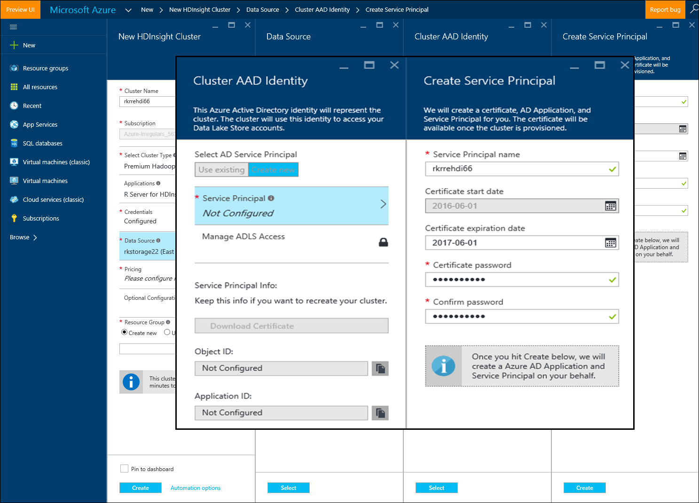

<properties
   pageTitle="Azure opções de armazenamento do servidor de R em HDInsight (visualização) | Microsoft Azure"
   description="Saiba mais sobre as diferentes opções de armazenamento disponíveis para usuários com R Server em HDInsight (prévia)"
   services="HDInsight"
   documentationCenter=""
   authors="jeffstokes72"
   manager="jhubbard"
   editor="cgronlun"
/>

<tags
   ms.service="HDInsight"
   ms.devlang="R"
   ms.topic="article"
   ms.tgt_pltfrm="na"
   ms.workload="data-services"
   ms.date="09/01/2016"
   ms.author="jeffstok"
/>

# <a name="azure-storage-options-for-r-server-on-hdinsight-preview"></a>Azure opções de armazenamento do servidor de R em HDInsight (prévia)

Microsoft R Server em HDInsight (visualização) tem acesso a ambos os Blob do Azure e [Armazenamento de Lucerne de dados do Azure](https://azure.microsoft.com/services/data-lake-store/), como um meio de manter dados, código, resultado objetos de análise e assim por diante.

Quando você cria um cluster Hadoop no HDInsight, você pode especificar uma conta de armazenamento do Azure. Um contêiner de armazenamento de Blob específico dessa conta mantém o sistema de arquivos para o cluster que você criar (por exemplo, o sistema de arquivo distribuído Hadoop). Para fins de desempenho, cluster HDInsight é criado no mesmo data center como a conta de armazenamento principal que você especificar. Para obter mais informações, consulte [usar Azure Blob storage com HDInsight](hdinsight-hadoop-use-blob-storage.md "armazenamento de Blob do uso do Azure com HDInsight").   


## <a name="use-multiple-azure-blob-storage-accounts"></a>Usar várias contas de armazenamento de Blob do Azure

Se necessário, você pode acessar várias contas de armazenamento do Azure ou contêineres com seu cluster HDI. Para fazer isso, você precisa especificar as contas de armazenamento adicional na interface do usuário quando você cria o cluster e, em seguida, siga estas etapas para usá-las em R.  

1.  Crie um cluster de HDInsight com um nome de conta de armazenamento de **storage1** e um contêiner de padrão chamado **container1**.
2. Especifique uma conta de armazenamento adicional chamada **Armazenamento2 do**.  
3. Copie o arquivo mycsv.csv no diretório /share e executar análise nesse arquivo.  

    ````
    hadoop fs –mkdir /share
    hadoop fs –copyFromLocal myscsv.scv /share  
    ````

3.  No código de R, defina o nó nome como **padrão** e defina seu diretório e arquivo para processar.  

    ````
    myNameNode <- "default"
    myPort <- 0
    ````

  Local dos dados:  

    bigDataDirRoot <-"/ compartilhar"  

  Defina o contexto de computação Spark:

    mySparkCluster <-RxSpark(consoleOutput=TRUE)

  Definir o contexto de computação:

    rxSetComputeContext(mySparkCluster)

  Defina o sistema de arquivos de sistema de arquivo distribuído da Hadoop (HDFS):

    hdfsFS <-RxHdfsFileSystem (hostName = myNameNode, porta = myPort)

  Especifique o arquivo de entrada para analisar em HDFS:

    arquivo de entrada <-file.path(bigDataDirRoot,"mycsv.csv")

Todas as referências de diretório e arquivo apontam para a conta de armazenamento wasbs://container1@storage1.blob.core.windows.net. Esta é a **conta padrão de armazenamento** associado ao cluster HDInsight.

Agora, suponha que você deseja processar um arquivo chamado mySpecial.csv localizado na /private diretório de **container2** no **Armazenamento2 do**.

No seu código de R, aponte a referência de nó nome para a conta de armazenamento **Armazenamento2 do** .

    myNameNode <- "wasbs://container2@storage2.blob.core.windows.net"
    myPort <- 0

  Local dos dados:

    bigDataDirRoot <- "/private"

  Defina o contexto de computação Spark:

    mySparkCluster <- RxSpark(consoleOutput=TRUE, nameNode=myNameNode, port=myPort)

  Definir o contexto de computação:

    rxSetComputeContext(mySparkCluster)

  Defina o sistema de arquivos HDFS:

    hdfsFS <- RxHdfsFileSystem(hostName=myNameNode, port=myPort)

  Especifique o arquivo de entrada para analisar em HDFS:

    inputFile <-file.path(bigDataDirRoot,"mySpecial.csv")

Todas as referências de diretório e arquivo agora apontam para a conta de armazenamento wasbs://container2@storage2.blob.core.windows.net. Este é o **Nó nome** que você especificou.

Observe que você terá que configurar /user/RevoShare/<SSH username> diretório na **armazenamento2** da seguinte forma:

    hadoop fs -mkdir wasbs://container2@storage2.blob.core.windows.net/user
    hadoop fs -mkdir wasbs://container2@storage2.blob.core.windows.net/user/RevoShare
    hadoop fs -mkdir wasbs://container2@storage2.blob.core.windows.net/user/RevoShare/<RDP username>

## <a name="use-an-azure-data-lake-store"></a>Usar um armazenamento Lucerne de dados do Azure

Para usar dados Lucerne armazena com sua conta HDInsight, você precisa dar acesso seu cluster a cada loja Lucerne de dados do Azure que você deseja usar. Você usa o armazenamento no script R muito como você usa uma conta de armazenamento secundário (conforme descrito no procedimento anterior).

## <a name="add-cluster-access-to-your-azure-data-lake-stores"></a>Adicionar cluster acesso a suas lojas Lucerne de dados do Azure

Você acessa um repositório de dados Lucerne usando um capital de serviço do Azure Active Directory (AD Azure) associado ao seu cluster HDInsight.

### <a name="to-add-a-service-principal"></a>Para adicionar uma entidade de serviço
1. Quando você cria seu cluster HDInsight, selecione **Cluster AAD identidade** na guia **Fonte de dados** .
2. Na caixa de diálogo **Cluster AAD identidade** , em **Selecione Principal de serviço do AD**, selecione **Criar novo**.

Depois que você dê um nome para a entidade de serviço e cria uma senha para ele, uma nova guia é aberta onde você pode associar o capital de serviço de lojas Lucerne de dados.

Observe que você pode também adicionar acesso a um armazenamento de dados Lucerne posteriormente abrindo o armazenamento de dados Lucerne no portal do Azure e indo **Explorador de dados** > **acesso**.  A seguir é um exemplo de uma caixa de diálogo que mostra como criar uma entidade de serviço e associá-lo com o armazenamento de dados Lucerne "rkadl11".




## <a name="use-the-data-lake-store-with-r-server"></a>Usar o armazenamento de dados Lucerne com o servidor de R
Ao conceder acesso a um armazenamento de dados Lucerne, você pode usar o armazenamento no servidor de R em HDInsight a maneira como faria com uma conta de armazenamento do Azure secundário. A única diferença é que o prefixo **wasb: / /** muda para **adl: / /** da seguinte maneira:

````
# Point to the ADL store (e.g. ADLtest)
myNameNode <- "adl://rkadl1.azuredatalakestore.net"
myPort <- 0

# Location of the data (assumes a /share directory on the ADL account)
bigDataDirRoot <- "/share"  

# Define Spark compute context
mySparkCluster <- RxSpark(consoleOutput=TRUE, nameNode=myNameNode, port=myPort)

# Set compute context
rxSetComputeContext(mySparkCluster)

# Define HDFS file system
hdfsFS <- RxHdfsFileSystem(hostName=myNameNode, port=myPort)

# Specify the input file in HDFS to analyze
inputFile <-file.path(bigDataDirRoot,"AirlineDemoSmall.csv")

# Create factors for days of the week
colInfo <- list(DayOfWeek = list(type = "factor",
               levels = c("Monday", "Tuesday", "Wednesday", "Thursday",
                          "Friday", "Saturday", "Sunday")))

# Define the data source
airDS <- RxTextData(file = inputFile, missingValueString = "M",
                    colInfo  = colInfo, fileSystem = hdfsFS)

# Run a linear regression
model <- rxLinMod(ArrDelay~CRSDepTime+DayOfWeek, data = airDS)
````

Estes são os comandos que são usados para configurar a conta de armazenamento de dados Lucerne com o diretório RevoShare e adicione o arquivo. csv de exemplo do exemplo anterior:

````
hadoop fs -mkdir adl://rkadl1.azuredatalakestore.net/user
hadoop fs -mkdir adl://rkadl1.azuredatalakestore.net/user/RevoShare
hadoop fs -mkdir adl://rkadl1.azuredatalakestore.net/user/RevoShare/<user>

hadoop fs -mkdir adl://rkadl1.azuredatalakestore.net/share

hadoop fs -copyFromLocal /usr/lib64/R Server-7.4.1/library/RevoScaleR/SampleData/AirlineDemoSmall.csv adl://rkadl1.azuredatalakestore.net/share

hadoop fs –ls adl://rkadl1.azuredatalakestore.net/share
````

## <a name="use-azure-files-on-the-edge-node"></a>Usar os arquivos do Azure no nó de borda

Também há uma opção de armazenamento de dados conveniente para uso no nó borda chamado de [Arquivos do Azure](../storage/storage-how-to-use-files-linux.md "Arquivos do Azure"). Ele permite montar um compartilhamento de arquivos de armazenamento do Azure para o sistema de arquivos do Linux. Isso pode ser útil para armazenar arquivos de dados, R scripts e objetos de resultado que podem ser necessárias mais tarde quando faz sentido usar o sistema de arquivos nativo no nó de borda em vez de HDFS.

Uma vantagem importante do Azure arquivos é que os compartilhamentos de arquivo podem ser montados e usados por qualquer sistema que tenha um sistema operacional compatível como o Windows ou Linux. Por exemplo, ele pode ser usado por outro cluster HDInsight com você ou alguém em sua equipe, por uma máquina virtual do Azure ou até mesmo por um sistema local.


## <a name="next-steps"></a>Próximas etapas

Agora que você entende Noções básicas de como usar o console de R a partir de uma sessão SSH e como criar um novo cluster HDInsight que inclui R Server, use os links a seguir para descobrir outras maneiras de trabalhar com o servidor de R em HDInsight.

- [Visão geral do servidor de R em HDInsight](hdinsight-hadoop-r-server-overview.md)
- [Introdução ao servidor de R em Hadoop](hdinsight-hadoop-r-server-get-started.md)
- [Adicionar o servidor de RStudio HDInsight Premium](hdinsight-hadoop-r-server-install-r-studio.md)
- [Calcular opções de contexto do servidor de R em HDInsight](hdinsight-hadoop-r-server-compute-contexts.md)
