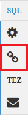

<properties
   pageTitle="Usar modos de exibição de Ambari para trabalhar com seção em HDInsight (Hadoop) | Microsoft Azure"
   description="Saiba como usar o modo de exibição de seção em seu navegador da web para enviar consultas de seção. O modo de exibição de seção é parte da interface do usuário de Web Ambari fornecidos com o seu cluster HDInsight baseados em Linux."
   services="hdinsight"
   documentationCenter=""
   authors="Blackmist"
   manager="jhubbard"
   editor="cgronlun"
    tags="azure-portal"/>

<tags
   ms.service="hdinsight"
   ms.devlang="na"
   ms.topic="article"
   ms.tgt_pltfrm="na"
   ms.workload="big-data"
   ms.date="10/28/2016"
   ms.author="larryfr"/>

#Usar o modo de exibição de seção com Hadoop em HDInsight

[AZURE.INCLUDE [hive-selector](../../includes/hdinsight-selector-use-hive.md)]

Ambari é um gerenciamento e monitoramento utilitário fornecido com clusters HDInsight baseados em Linux. Um dos recursos fornecidos pelo Ambari é uma interface de usuário da Web que podem ser usadas para executar consultas de seção. Esta é a __Seção modo de exibição__, parte dos modos de exibição Ambari fornecidos com o seu cluster HDInsight.

> [AZURE.NOTE] Ambari tem muitos recursos que não serão discutidos neste documento. Para obter mais informações, consulte [Gerenciar HDInsight clusters, usando a interface do usuário do Ambari Web](hdinsight-hadoop-manage-ambari.md).

##Pré-requisitos

- Um cluster de HDInsight baseados em Linux. Para obter informações sobre como criar um novo cluster, consulte [Introdução ao HDInsight baseados em Linux](hdinsight-hadoop-linux-tutorial-get-started.md).

##Abrir o modo de exibição de seção

Você pode Ambari modos de exibição do Portal do Azure; Selecione o seu cluster HDInsight e selecione __Modos de exibição de Ambari__ da seção __Links rápidos__ .

Você pode também navegar diretamente para Ambari indo para https://CLUSTERNAME.azurehdinsight.net em um navegador da web (onde __CLUSTERNAME__ é o nome do seu cluster HDInsight) e, em seguida, selecione o conjunto de quadrados no menu página (ao lado do link de __Administração__ e o botão à esquerda da página,) disponível modos de exibição de lista. Selecione a __seção modo de exibição__.

.

> [AZURE.NOTE] Quando estiver acessando Ambari, você será solicitado a autenticar para o site. Digite admin (padrão `admin`,) nome e senha que você usou quando criar o cluster de conta.

Você deve ver uma página semelhante ao seguinte:

##Exibir tabelas

Na seção __Explorador de banco de dados__ da página, selecione a entrada de __padrão__ na guia __bancos de dados__ . Isso exibirá uma lista de tabelas do banco de dados padrão. Para um novo cluster HDInsight, deve existir apenas uma tabela; __hivesampletable__.

Conforme novas tabelas são adicionadas as etapas neste documento, você pode usar o ícone de atualização no canto superior direito do Gerenciador de banco de dados para atualizar a lista de tabelas disponíveis.

##Editor de consulta

Use as etapas a seguir no modo de exibição seção para executar uma consulta de seção dados incluídos com o cluster.

1. Na seção de __Editor de consultas__ da página, cole as seguintes instruções de HiveQL na planilha:

        DROP TABLE log4jLogs;
        CREATE EXTERNAL TABLE log4jLogs(t1 string, t2 string, t3 string, t4 string, t5 string, t6 string, t7 string)
        ROW FORMAT DELIMITED FIELDS TERMINATED BY ' '
        STORED AS TEXTFILE LOCATION 'wasbs:///example/data/';
        SELECT t4 AS sev, COUNT(*) AS cnt FROM log4jLogs WHERE t4 = '[ERROR]' GROUP BY t4;

    Essas instruções executam as seguintes ações:

    - **DROP TABLE** - exclui a tabela e o arquivo de dados, caso a tabela já existe.
    - **Criar tabela externa** - cria uma nova tabela "externa" na seção. Tabelas externas armazenam apenas a definição de tabela na seção; os dados são deixados no local original.
    - **Formato de linha** - informa seção como os dados são formatados. Nesse caso, os campos em cada log são separados por um espaço.
    - **Local de arquivo de texto como armazenados** - informa seção onde os dados estão armazenados (o diretório de dados do exemplo) e que ele está armazenado como texto.
    - **Selecione** - seleciona uma contagem de todas as linhas onde coluna t4 contém o valor [ERROR].

    >[AZURE.NOTE] Tabelas externas devem ser usadas quando você espera os dados subjacentes ser atualizados por uma fonte externa, como um processo de carregamento de dados automatizada ou por outra operação MapReduce, mas deseja sempre as consultas de seção para usar os dados mais recentes. Soltar uma tabela externa faz *não* excluir os dados, somente a definição da tabela.

2. Use o botão __Executar__ na parte inferior do Editor de consulta para iniciar a consulta. Ele deve ativar laranja e o texto será alterado para __interromper a execução__. Uma seção de __Resultados do processo de consulta__ deve aparecer sob o Editor de consulta e exibir informações sobre o trabalho.

    > [AZURE.IMPORTANT] Alguns navegadores não podem atualizar as informações de log ou resultados corretamente. Se você executar um trabalho e ela aparece para execução sempre sem atualizar o registro ou retornando resultados, tente usar Mozilla FireFox ou o Google Chrome.

3. Quando tiver terminado a consulta, a seção de __Resultados do processo de consulta__ exibirá os resultados da operação. Botão __Parar execução__ também será alterado para um botão de __Executar__ verde. Na guia __resultados__ deve conter as seguintes informações:

        sev       cnt
        [ERROR]   3

    Guia de __Logs__ pode ser usada para exibir as informações de log criadas pelo trabalho. Você pode usar isso para solução de problemas se houver problemas com uma consulta.

    > [AZURE.TIP] Caixa de diálogo de anotação na lista __Salvar resultados__ suspensa no canto superior esquerdo da seção __Resultados do processo de consulta__ ; Você pode usar esta a baixar os resultados ou salvá-los ao armazenamento de HDInsight como um arquivo CSV.

3. Selecione as quatro primeiras linhas desta consulta e, em seguida, selecione __Executar__. Observe que não há nenhum resultado quando o trabalho for concluído. Isso ocorre porque usando o botão __Execute__ quando parte da consulta é selecionada será executado apenas as instruções selecionadas. Nesse caso, a seleção não incluir a instrução final que recupera linhas da tabela. Se você selecionar apenas essa linha e usar __Executar__, você verá os resultados esperados.

3. Use o botão __Nova planilha__ na parte inferior do __Editor de consultas__ para criar uma nova planilha. Na nova planilha, insira as seguintes instruções de HiveQL:

        CREATE TABLE IF NOT EXISTS errorLogs (t1 string, t2 string, t3 string, t4 string, t5 string, t6 string, t7 string) STORED AS ORC;
        INSERT OVERWRITE TABLE errorLogs SELECT t1, t2, t3, t4, t5, t6, t7 FROM log4jLogs WHERE t4 = '[ERROR]';

    Essas instruções executam as seguintes ações:

    - **Criar tabela se não existir** - cria uma tabela, se ele ainda não exista. Como a palavra-chave **externa** não for usada, isso é uma tabela interna, que é armazenada na seção data warehouse e é gerenciada completamente pela seção. Ao contrário de tabelas externas, soltar uma tabela interna excluirá os dados subjacentes também.
    - **ARMAZENADO como ORC** - armazena os dados no formato de linha de otimizado colunas (ORC). Este é um formato altamente otimizado e eficiente para armazenar dados de seção.
    - SUBSTITUIR **Inserir … Selecione** - seleciona linhas da tabela **log4jLogs** que contêm [ERROR] e, em seguida, insere os dados na tabela **logs de erros** .

    Use o botão __Executar__ para executar essa consulta. Na guia __resultados__ não conterá qualquer informação como sem linhas retornadas por esta consulta, mas o status deve mostrar como __êxito__.

###Seção configurações

Selecione o ícone de __configurações__ para a direita do editor.

Configurações podem ser usadas para alterar diversas configurações de seção, como alterando o mecanismo de execução de ramificação do Tez (o padrão), para MapReduce.

###Explique Visual

Selecione o ícone __Explicam Visual__ à direita do editor.

Este é o modo de exibição __Explicam Visual__ da consulta, que pode ser útil na compreensão do fluxo de consultas complexas. Você pode exibir um equivalente textual deste modo de exibição usando o botão de __Explicar__ no Editor de consultas.

###Tez

Selecione o ícone de __Tez__ à direita do editor.

Isso exibirá o direcionado acíclica Graph (Dag mão) usado por Tez para essa consulta, se disponível. Se você quiser exibir o Dag de mão para consultas você já executou no uso passado ou depurar o processo de Tez, o [Modo de exibição de Tez](hdinsight-debug-ambari-tez-view.md) em vez disso.

###Notificações

Selecione o ícone de __notificações__ à direita do editor.

Notificações são mensagens que são geradas durante a execução de consultas. Por exemplo, você receberá uma notificação quando uma consulta é enviada ou quando ocorre um erro.

##Consultas salvas

1. Do Editor de consulta, crie uma nova planilha e insira a seguinte consulta:

        SELECT * from errorLogs;

    Execute a consulta para verificar se ele funciona. Os resultados serão da seguinte maneira:

        errorlogs.t1    errorlogs.t2    errorlogs.t3    errorlogs.t4    errorlogs.t5    errorlogs.t6    errorlogs.t7
        2012-02-03  18:35:34    SampleClass0    [ERROR]     incorrect   id  
        2012-02-03  18:55:54    SampleClass1    [ERROR]     incorrect   id  
        2012-02-03  19:25:27    SampleClass4    [ERROR]     incorrect   id

2. Use o botão __Salvar como__ na parte inferior do editor. Nomeie esta consulta __logs de erros__ e selecione __Okey__. Observe que o nome da planilha muda para __logs de erros__.

3. Selecione a guia __Consultas salvas__ na parte superior da página da seção modo de exibição. Observe que os __logs de erros__ agora está listado como uma consulta salva. Ela permanecerá nesta lista até você removê-lo. Selecionando o nome abrirá a consulta no Editor de consultas.

##Histórico de consulta

O botão __histórico__ na parte superior do modo de exibição seção permite às consultas de modo de exibição tiver executados anteriormente. Usá-lo agora e selecione algumas das consultas que tiver executadas anteriormente. Quando você seleciona uma consulta, ele abre no Editor de consultas.

##Funções (UDF) definidas pelo usuário

Seção também pode ser estendida por meio de **funções definidas pelo usuário (UDF)**. Uma UDF permite implementar funcionalidade ou a lógica que não é facilmente modelada em HiveQL.

Embora você possa adicionar uma UDF como parte das instruções HiveQL em sua consulta, na guia UDF na parte superior do modo de exibição seção permite que você declarar e salvar um conjunto de UDFs que podem ser usados com o __Editor de consulta__.

Depois que você adicionou uma UDF no modo de exibição de seção, um botão __Insert udfs__ aparecerá na parte inferior do __Editor de consulta__. Selecionar isso exibirá uma lista suspensa dos UDFs definidos no modo de exibição de seção. Selecionar uma UDF adicionará HiveQL instruções à sua consulta para habilitar o UDF.

Por exemplo, se você tiver definido uma UDF com as seguintes propriedades:

* Nome do recurso: myudfs
* Caminho do recurso: wasbs:///myudfs.jar
* Nome do UDF: myawesomeudf
* Nome da classe UDF: com.myudfs.Awesome

Usando o botão __Inserir udfs__ exibirá uma entrada denominada __myudfs__, com outra lista suspensa para cada UDF definido para o recurso. Neste caso, __myawesomeudf__. Selecionar essa entrada adicionará o seguinte para o início da consulta:

    add jar wasbs:///myudfs.jar;

    create temporary function myawesomeudf as 'com.myudfs.Awesome';

Você pode usar o UDF em sua consulta. Por exemplo, `SELECT myawesomeudf(name) FROM people;`.

Para obter mais informações sobre como usar UDFs com seção em HDInsight, consulte o seguinte:

* [Usando o Python com seção e porco em HDInsight](hdinsight-python.md)

* [Como adicionar uma UDF de seção personalizado ao HDInsight](http://blogs.msdn.com/b/bigdatasupport/archive/2014/01/14/how-to-add-custom-hive-udfs-to-hdinsight.aspx)

##Próximas etapas

Para obter informações gerais sobre a seção no HDInsight:

* [Use a seção com Hadoop em HDInsight](hdinsight-use-hive.md)

Para obter informações sobre outras maneiras que você pode trabalhar com Hadoop em HDInsight:

* [Usar porco com Hadoop em HDInsight](hdinsight-use-pig.md)

* [Usar MapReduce com Hadoop em HDInsight](hdinsight-use-mapreduce.md)
