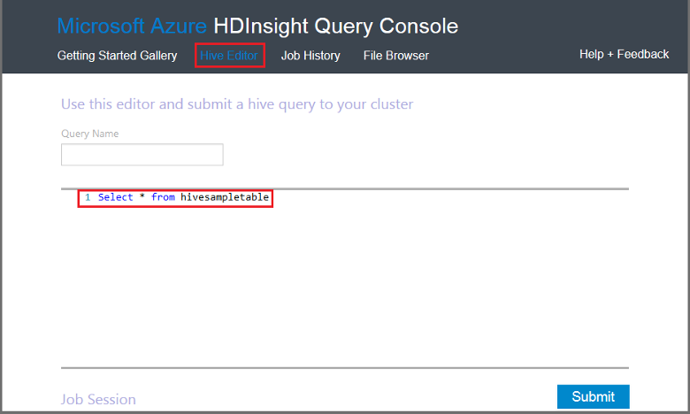

<properties
   pageTitle="Use a seção Hadoop no Console de consulta de HDInsight | Microsoft Azure"
   description="Saiba como usar o Console de consulta baseado na web para executar consultas de seção em um cluster de HDInsight Hadoop em seu navegador."
   services="hdinsight"
   documentationCenter=""
   authors="Blackmist"
   manager="jhubbard"
   editor="cgronlun"
    tags="azure-portal"/>

<tags
   ms.service="hdinsight"
   ms.devlang="na"
   ms.topic="article"
   ms.tgt_pltfrm="na"
   ms.workload="big-data"
   ms.date="09/20/2016"
   ms.author="larryfr"/>

# Executar consultas de seção usando o Console de consulta

[AZURE.INCLUDE [hive-selector](../../includes/hdinsight-selector-use-hive.md)]

Neste artigo, você aprenderá como usar o Console de consulta de HDInsight para executar consultas de seção em um cluster de HDInsight Hadoop em seu navegador.

> [AZURE.IMPORTANT] Console de consulta de HDInsight só está disponível em clusters de HDInsight baseados no Windows. Se você estiver usando um cluster baseado no Linux HDInsight, consulte [Executar seção consultas usando o modo de exibição de seção](hdinsight-hadoop-use-hive-ambari-view.md).

##Pré-requisitos

Para concluir as etapas neste artigo, você precisará do seguinte.

* Um cluster baseado no Windows HDInsight Hadoop

* Um navegador da web moderna

##Executar consultas de seção usando o Console de consulta

1. Abra um navegador da web e navegue até __https://CLUSTERNAME.azurehdinsight.net__, onde __CLUSTERNAME__ é o nome do seu cluster HDInsight. Se solicitado, insira o nome de usuário e senha que você usou quando você criou o cluster.

2. Selecione os links na parte superior da página, **Seção Editor**. Isso exibe um formulário que pode ser usado para inserir as instruções de HiveQL que você deseja executar no cluster HDInsight.

    

    Substitua o texto `Select * from hivesampletable` com as instruções de HiveQL a seguir:

        set hive.execution.engine=tez;
        DROP TABLE log4jLogs;
        CREATE EXTERNAL TABLE log4jLogs (t1 string, t2 string, t3 string, t4 string, t5 string, t6 string, t7 string)
        ROW FORMAT DELIMITED FIELDS TERMINATED BY ' '
        STORED AS TEXTFILE LOCATION 'wasbs:///example/data/';
        SELECT t4 AS sev, COUNT(*) AS count FROM log4jLogs WHERE t4 = '[ERROR]' AND INPUT__FILE__NAME LIKE '%.log' GROUP BY t4;

    Essas instruções executam as seguintes ações:

    * **DROP TABLE**: exclui a tabela e o arquivo de dados se a tabela já existe.
    * **Criar tabela externa**: cria uma nova tabela 'external' na seção. Tabelas externas armazenam apenas a definição de tabela na seção; os dados são deixados no local original.

    > [AZURE.NOTE] Tabelas externas devem ser usadas quando você espera os dados subjacentes sejam atualizadas por uma fonte externa (como um processo de carregamento de dados automatizada) ou por outra operação MapReduce, mas quiser sempre as consultas de seção para usar os dados mais recentes.
    >
    > Soltar uma tabela externa faz **não** excluir os dados, somente a definição da tabela.

    * **Formato de linha**: informa seção como os dados são formatados. Nesse caso, os campos em cada log são separados por um espaço.
    * **Local de arquivo de texto como ARMAZENADO**: informa seção onde os dados estão armazenados (o diretório de dados do exemplo) e que ele está armazenado como texto
    * **Selecione**: selecione uma contagem de todas as linhas onde coluna **t4** contêm o valor **[ERROR]**. Isso deve retornar um valor de **3** porque há três linhas que contêm esse valor.
    * **INPUT__FILE__NAME como '%.log'** - informa seção que estamos só deve retornar dados de arquivos que terminam em. log. Isso restringe a pesquisa para o arquivo de sample.log que contém os dados e impede que ela retornar dados do exemplo de outro arquivos de dados que não correspondem o esquema definimos.

2. Clique em **Enviar**. A **Sessão de trabalho** na parte inferior da página deverá exibir detalhes para o trabalho.

3. Quando o campo **Status** é alterado para **concluído**, selecione **Exibir detalhes** para o trabalho. Na página detalhes, a **Saída de trabalho** contém `[ERROR]   3`. Você pode usar o botão **Baixar** sob esse campo para baixar um arquivo que contém a saída do trabalho.

##Resumo

Como você pode ver, o Console de consulta oferece uma maneira fácil de executar consultas de seção em um cluster de HDInsight, monitorar o status do trabalho e recuperar a saída.

Para saber mais sobre como usar a seção Console de consulta para executar trabalhos de seção, selecione a **Guia de Introdução** na parte superior do Console de consulta, use os exemplos fornecidos. Cada amostra percorre o processo de usar seção para analisar dados, incluindo explicações sobre as instruções de HiveQL usadas no exemplo.

##Próximas etapas

Para obter informações gerais sobre a seção no HDInsight:

* [Use a seção com Hadoop em HDInsight](hdinsight-use-hive.md)

Para obter informações sobre outras maneiras que você pode trabalhar com Hadoop em HDInsight:

* [Usar porco com Hadoop em HDInsight](hdinsight-use-pig.md)

* [Usar MapReduce com Hadoop em HDInsight](hdinsight-use-mapreduce.md)

Se você estiver usando Tez com seção, consulte os seguintes documentos para informações de depuração:

* [Usar a interface do usuário Tez em HDInsight baseado no Windows](hdinsight-debug-tez-ui.md)

* [Usar o modo de exibição Ambari Tez HDInsight baseados em Linux](hdinsight-debug-ambari-tez-view.md)

[1]: ../HDInsight/hdinsight-hadoop-visual-studio-tools-get-started.md

[hdinsight-sdk-documentation]: http://msdnstage.redmond.corp.microsoft.com/library/dn479185.aspx

[azure-purchase-options]: http://azure.microsoft.com/pricing/purchase-options/
[azure-member-offers]: http://azure.microsoft.com/pricing/member-offers/
[azure-free-trial]: http://azure.microsoft.com/pricing/free-trial/

[apache-tez]: http://tez.apache.org
[apache-hive]: http://hive.apache.org/
[apache-log4j]: http://en.wikipedia.org/wiki/Log4j
[hive-on-tez-wiki]: https://cwiki.apache.org/confluence/display/Hive/Hive+on+Tez
[import-to-excel]: http://azure.microsoft.com/documentation/articles/hdinsight-connect-excel-power-query/

[hdinsight-use-oozie]: hdinsight-use-oozie.md
[hdinsight-analyze-flight-data]: hdinsight-analyze-flight-delay-data.md

[hdinsight-storage]: hdinsight-hadoop-use-blob-storage.md

[hdinsight-provision]: hdinsight-provision-clusters.md
[hdinsight-submit-jobs]: hdinsight-submit-hadoop-jobs-programmatically.md
[hdinsight-upload-data]: hdinsight-upload-data.md
[hdinsight-get-started]: hdinsight-hadoop-linux-tutorial-get-started.md

[Powershell-install-configure]: powershell-install-configure.md
[powershell-here-strings]: http://technet.microsoft.com/library/ee692792.aspx

[img-hdi-hive-powershell-output]: ./media/hdinsight-use-hive/HDI.Hive.PowerShell.Output.png
