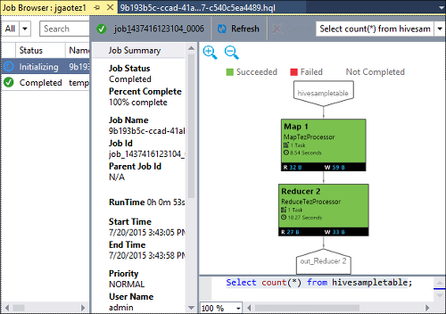

<properties
    pageTitle="Aprenda a usar ferramentas do Visual Studio Hadoop para HDInsight | Microsoft Azure"
    description="Saiba como instalar e usar as ferramentas do Visual Studio Hadoop para HDInsight para se conectar a um cluster de Hadoop e executar uma consulta de seção."
    keywords="ferramentas do Hadoop, consulta de seção, o visual studio"
    services="HDInsight"
    documentationCenter=""
    tags="azure-portal"
    authors="mumian"
    manager="jhubbard"
    editor="cgronlun"/>

<tags
    ms.service="hdinsight"
    ms.devlang="na"
    ms.topic="get-started-article"
    ms.tgt_pltfrm="na"
    ms.workload="big-data"
    ms.date="08/10/2016"
    ms.author="jgao"/>

# Introdução ao uso de ferramentas do Visual Studio Hadoop para HDInsight para executar uma consulta de seção

Saiba como usar as ferramentas de HDInsight para Visual Studio para conectar ao HDInsight clusters e enviar consultas de seção. Para obter mais informações sobre como usar HDInsight, consulte [Introdução ao HDInsight] [ hdinsight.introduction] e [começar a usar o HDInsight][hdinsight.get.started]. Para obter mais informações sobre como se conectar a um cluster de tempestade, consulte [desenvolver c# topologias para Apache tempestade em HDInsight usando o Visual Studio][hdinsight.storm.visual.studio.tools].

**Pré-requisitos**

Para concluir este tutorial e use as ferramentas do Hadoop no Visual Studio, será necessário o seguinte:

- Um cluster de Azurehdinsight: um cluster baseado no Windows ou Linux funcionarão com as etapas neste documento. Consulte um dos procedimentos a seguir para obter informações sobre como criar um cluster:

    - [Introdução ao uso HDInsight baseados em Linux](hdinsight-hadoop-linux-tutorial-get-started.md)
    - [Introdução ao uso HDInsight baseado no Windows](hdinsight-hadoop-tutorial-get-started-windows.md)

- Uma estação de trabalho com os seguintes softwares:

    - Windows 8.1, Windows 8 ou Windows 7
    - Visual Studio (um dos seguintes versões):
        - Visual Studio 2013 comunidade/Professional/Premium/Ultimate com [atualização 4](https://www.microsoft.com/download/details.aspx?id=44921)
        - Visual Studio 2015 (comunidade/Enterprise)

    >[AZURE.NOTE] Atualmente, as ferramentas de HDInsight para Visual Studio somente vêm com a versão em inglês.

## Instalar as ferramentas de HDInsight para Visual Studio

Ferramentas de HDInsight para Visual Studio e Driver ODBC seção da Microsoft estão empacotado com o SDK do Microsoft Azure para .NET versão 2.5.1 ou posterior. Você pode instalá-lo usando o [Web Platform Installer](http://go.microsoft.com/fwlink/?LinkId=255386). Você deve escolher aquele que corresponde à sua versão do Visual Studio. Se você não tiver o Visual Studio instalado, você pode instalar as últimas comunidade do Visual Studio e SDK do Azure usando o [Web Platform Installer](http://go.microsoft.com/fwlink/?LinkId=255386) ou usando os links a seguir:

- [Comunidade do Visual Studio 2015 com o SDK do Microsoft Azure](https://www.microsoft.com/web/handlers/webpi.ashx/getinstaller/VS2015CommunityAzurePack.appids)
- [Comunidade do Visual Studio 2013 com o SDK do Microsoft Azure](https://www.microsoft.com/web/handlers/webpi.ashx/getinstaller/VS2013CommunityAzurePack.appids)
- [SDK do Microsoft Azure para .NET (VS 2015)](https://www.microsoft.com/web/handlers/webpi.ashx/getinstaller/VWDOrVs2015AzurePack.appids)
- [SDK do Microsoft Azure para .NET (VS 2013)](https://www.microsoft.com/web/handlers/webpi.ashx/getinstaller/VWDOrVs2013AzurePack.appids)

![Ferramentas de Hadoop: HDinsight ferramentas para o instalador do Visual Studio Web Platform.][1]

## Conectar-se às assinaturas Azure
As ferramentas de HDInsight para Visual Studio permite que você se conecte à sua clusters HDInsight, executar algumas operações básicas de gerenciamento e executar consultas de seção.

>[AZURE.NOTE] Para obter informações sobre como se conectar a um cluster de Hadoop genérico, consulte [gravar e enviar consultas de seção usando o Visual Studio](http://blogs.msdn.com/b/xiaoyong/archive/2015/05/04/how-to-write-and-submit-hive-queries-using-visual-studio.aspx).

**Para se conectar à sua assinatura do Azure**

1.  Abra o Visual Studio.
2.  No menu **Exibir** , clique em **Server Explorer** para abrir a janela do Explorer do servidor.
3.  Expanda o **Azure**e **HDInsight**.

    >[AZURE.NOTE]Observe que a janela de **Lista de tarefas do HDInsight** deve ser aberta. Se você não estiver visível, clique em **Outras janelas** no menu **Exibir** e clique em **Janela de lista de tarefas do HDInsight**.  
4.  Insira suas credenciais do Azure assinatura e, em seguida, clique em **Entrar**. Isso só é necessário se você nunca tiver conectado à assinatura Azure do Visual Studio nesta estação de trabalho.
5.  No Server Explorer, você verá uma lista de clusters HDInsight existentes. Se você não tiver qualquer clusters, você pode provisionar um usando o Portal do Azure, Azure PowerShell ou o SDK do HDInsight. Para obter mais informações, consulte [clusters de provisionar HDInsight][hdinsight-provision].

    ![Ferramentas de Hadoop: ferramentas de HDInsight para lista de cluster Visual Studio Server Explorer][5]
6.  Expanda um cluster de HDInsight. Você verá **Seção bancos de dados**, uma conta de armazenamento padrão, contas de armazenamento vinculado e **log do serviço de Hadoop**. Você pode expandir ainda mais as entidades.

Depois que você conectou à sua assinatura do Azure, você poderá fazer o seguinte:

**Conectar-se para o portal do Azure do Visual Studio**

- Do Server Explorer, expanda **Azure** > **HDInsight**, um cluster de HDInsight de atalho e, em seguida, clique em **Gerenciar Cluster no Portal do Azure**.

**Fazer perguntas e fornecer comentários do Visual Studio**

- No menu **Ferramentas** , clique em **HDInsight**e, em seguida, clique **Fórum no MSDN** para fazer perguntas ou clique em **Enviar comentários**.

## Navegar os recursos vinculados

Do Server Explorer, você pode ver a conta de armazenamento padrão e quaisquer contas de armazenamento vinculado. Se você expandir a conta de armazenamento padrão, você pode ver os contêineres na conta de armazenamento. A conta padrão de armazenamento e o recipiente padrão estão marcadas. Você também pode atalho qualquer um dos contêineres para exibir o conteúdo.

![Ferramentas de HDInsight para lista de cluster do Visual Studio server explorer][2]

Após abrindo um contêiner, você pode usar os botões a seguir para carregar, excluir e baixar blobs:

## Executar uma consulta de seção
[Seção de Apache] [ apache.hive] é uma infraestrutura de depósito de dados criada no Hadoop para fornecer resumo de dados, consultas e análise. Ferramentas de HDInsight para Visual Studio suporta consultas de seção em execução do Visual Studio. Para obter mais informações sobre ramificação, consulte [Usar seção com HDInsight][hdinsight.hive].

É demorado para testar o script de seção em um cluster de HDInsight. Pode levar alguns minutos ou mais. Ferramentas de HDInsight para Visual Studio é capaz de Validando seção script localmente sem uma conexão com um cluster ao vivo.

Ferramentas de HDInsight para Visual Studio também permite que os usuários vejam o que está dentro do trabalho de seção coletando e faceamento os logs de fio COLORIDO de determinados trabalhos de seção.

### Exibir o **hivesampletable**
Todos os clusters HDInsight vêm com um exemplo de tabela de seção chamado *hivesampletable*. Usaremos esta tabela para mostrar a você como tabelas de seção, exiba os esquemas de tabela e as linhas da tabela a seção da lista.

**Listar tabelas de seção e exibir o esquema de tabela de seção**

1.  No **Server Explorer**, expanda **Azure** > **HDInsight** > cluster de sua escolha > **Seção bancos de dados** > **padrão** > **hivesampletable** para ver o esquema de tabela.
4.  **Hivesampletable**de atalho e, em seguida, clique em **Exibir primeiras 100 linhas** para listar as linhas. É equivalente a execução da consulta de seção seguinte usando o driver ODBC seção:

        SELECT * FROM hivesampletable LIMIT 100

    Você pode personalizar a contagem de linhas.

    ![Ferramentas de Hadoop: esquema de consulta de HDinsight seção Visual Studio][6]

### Criar tabelas de seção

Você pode usar a interface gráfica para criar uma tabela de seção ou use as consultas de seção. Para obter informações sobre como usar consultas de seção, consulte [Executar seção consultas](#run.queries).

**Para criar uma tabela de seção**

1. No **Server Explorer**, expanda **Azure** > **HDInsight Clusters** um cluster de HDInsight > **Seção bancos de dados**, em seguida, clique com botão direito **padrão**e clique em **Criar tabela**.
2. Configure a tabela.
3. Clique em **Criar tabela** para enviar o trabalho para criar a nova tabela de seção.

    ![Ferramentas de Hadoop: ferramentas do visual studio hdinsight criam tabela de seção][7]

### Validar e executar consultas de seção
Há duas maneiras de criar e executar consultas de seção:

- Criar consultas ad-hoc
- Criar um aplicativo de seção

**Para criar, validar e executar consultas ad-hoc**

1. No **Server Explorer**, expanda **Azure**e expanda **Clusters de HDInsight**.
2. Clique com botão direito do cluster onde você deseja executar a consulta e clique em **escrever uma consulta de seção**.
3. Insira as consultas de seção. Observe que o editor de seção suporta IntelliSense. Ferramentas de HDInsight para Visual Studio oferece suporte para carregar os metadados remoto quando você estiver editando seu script de seção. Por exemplo, quando você digita "SELECT * FROM", o IntelliSense lista todos os nomes de tabela sugerido. Quando um nome de tabela é especificado, os nomes de coluna são listados pelo IntelliSense. A ferramenta suporta quase todas as instruções de seção DML, subconsultas e os UDFs internos.

    ![Ferramentas de Hadoop: HDInsight Visual Studio Tools IntelliSense][13]

    ![Ferramentas de Hadoop: HDInsight Visual Studio Tools IntelliSense][14]

    > [AZURE.NOTE] Apenas os metadados dos clusters que está selecionado na barra de ferramentas de HDInsight serão sugeridos.
4. (Opcional): clique em **Validar Script** para verificar os erros de sintaxe de script.

    ![Ferramentas de Hadoop: hdinsight ferramentas de validação local do Visual Studio][10]

4. Clique em **Enviar** ou **envie (Avançado)**. Com a opção de envio avançados, você vai configurar o **Nome do trabalho**, **argumentos**, **Configurações adicionais**e **Status de diretório** para o script:

    ![consulta de seção do hadoop hdinsight][9]

    Após enviar o trabalho, você vê uma janela de **Seção Resumo da tarefa** .

    ![Resumo de uma consulta de HDInsight Hadoop seção][8]
5. Use o botão **Atualizar** para atualizar o status até que o status do trabalho mude **concluídas**.
6. Clique nos links na parte inferior para ver o seguinte: **Consulta de trabalho**, **Saída de trabalho**, **log de trabalho**ou **log de fio colorido**.

**Para criar e executar uma solução de seção**

1. No menu **arquivo** , clique em **novo**e, em seguida, clique em **projeto**.
2. Selecionar **HDInsight** no painel esquerdo, selecione o **Aplicativo de seção** no painel intermediário, insira as propriedades e clique em **Okey**.

    ![Ferramentas de Hadoop: novo projeto de seção de ferramentas do visual studio hdinsight][11]
3. No **Solution Explorer**, clique duas vezes **Script.hql** para abri-lo.
4. Para validar o script de seção, você pode clicar no botão **Validar Script** , ou o script no editor de seção de atalho e, em seguida, clique em **Validar Script** no menu de contexto.

### Exibir trabalhos de seção
Você pode exibir consultas de trabalho, saída de trabalho, logs de trabalho e logs de fio colorido para trabalhos de seção. Para obter mais informações, consulte a captura de tela anterior.

A versão mais recente da ferramenta permite que você veja o que há dentro de seus trabalhos de seção coletando e faceamento fio COLORIDO logs. Um log de fio COLORIDO pode ajudar você analisa problemas de desempenho. Para obter mais informações sobre como HDInsight coleta fio COLORIDO logs, consulte [Acesso HDInsight aplicativo Logs programaticamente][hdinsight.access.application.logs].

**Para exibir os trabalhos de seção**

1. No **Server Explorer**, expanda **Azure**e expanda **HDInsight**.
2. Um cluster de HDInsight de atalho e, em seguida, clique em **Exibir trabalhos**. Você verá uma lista dos trabalhos de seção que executou no cluster.
3. Clique em um trabalho na lista de trabalhos para selecioná-la e depois use a janela de **Resumo da tarefa de seção** para abrir a **Consulta de trabalho**, **Saída de trabalho**, **Log de trabalho**ou **log de fio colorido**.

    ![Ferramentas de Hadoop: HDInsight Visual Studio Tools Exibir trabalhos de seção][12]

### Caminho mais rápido seção execução via HiveServer2

>[AZURE.NOTE] Este recurso só funciona na versão de cluster HDInsight 3,2 e mais recente.

As ferramentas de HDInsight usadas para enviar trabalhos de seção via [WebHCat](https://cwiki.apache.org/confluence/display/Hive/WebHCat) (também conhecido como Templeton). Levou muito tempo para retornar detalhes de trabalho e informações de erro.
Para resolver esse problema de desempenho, as ferramentas de HDInsight executa trabalhos de seção diretamente no cluster por meio de HiveServer2, para que ela ignora RDP/SSH.
Além de melhorar o desempenho, os usuários também podem exibir seção Tez gráficos e os detalhes da tarefa.

Para HDInsight a versão do cluster 3,2 ou posterior, você pode ver um botão de **Executar via HiveServer2** :

E você pode ver os logs transmitidos novamente em tempo real e ver os gráficos de trabalho se a consulta de seção é executada no Tez.

**Diferença entre executar consultas via HiveServer2 e enviar consultas via WebHCat**

Apesar de executar consultas via HiveServer2 tem muitos benefícios de desempenho, ela tem várias limitações. Algumas das limitações não são adequadas para uso de produção. A tabela a seguir mostra as diferenças:

| |Executar via HiveServer2 |Enviar via WebHCat|
|---|---|---|
|Executar consultas|Elimina a sobrecarga no WebHCat (que inicia um MapReduce Job chamado "TempletonControllerJob").|Como uma consulta é executada via WebHCat, WebHCat iniciará um trabalho MapReduce que introduz latência adicional.|
|Logs de fluxo novamente|Em quase em tempo real.|Os logs de execução de trabalho estão disponíveis somente quando o trabalho é concluído.|
|Exibir histórico de trabalho|Se uma consulta é executada via HiveServer2, seu histórico de trabalho (log de trabalho, saída de trabalho) não é preservado. O aplicativo pode ser exibido na interface de usuário de fio COLORIDO com as informações limitadas.|Se uma consulta é executada via WebHCat, seu histórico de trabalho (log de trabalho, saída de trabalho) é preservado e pode ser visualizado usando o Visual Studio/HDInsight SDK/PowerShell. |
|Fechar janela|  Executar via HiveServer2 é uma maneira "síncrona", portanto, você deve manter as janelas abertas; Se as janelas são fechadas, em seguida, a execução da consulta será cancelada.|Enviar via WebHCat é uma maneira de "assíncrona" para que possa enviar a consulta via WebHCat e feche o Visual Studio. Você pode voltar e ver os resultados a qualquer momento.|

### Gráfico de desempenho de trabalho Tez seção

O suporte de HDInsight Visual Studio Tools mostrando os gráficos de desempenho para os trabalhos de seção executado pelo mecanismo de execução de Tez. Para obter informações sobre como habilitar Tez, consulte [usar seção no HDInsight][hdinsight.hive]. Depois de enviar um trabalho de seção no Visual Studio, Visual Studio mostra o gráfico quando o trabalho está concluído.  Talvez seja necessário clicar no botão **Atualizar** para obter o status do trabalho mais recente.

> [AZURE.NOTE] Este recurso só está disponível para a versão de cluster HDInsight acima 3.2.4.593 e pode só funcionam para trabalhos concluídos (se você enviou seu trabalho por meio de WebHCat; esse gráfico mostrará quando você executa sua consulta por meio de HiveServer2). Isso funciona para ambas as janelas e clusters baseados em Linux.

Para ajudá-lo a compreender sua consulta de seção melhor, a ferramenta de adicionar o modo de exibição de seção operador nesta versão. Você só precisa clique duas vezes nos vértices do gráfico de trabalho e você pode ver todos os operadores dentro do vértice. Você também pode passar o mouse em um operador específico para exibir mais detalhes desse operador.

### Exibição de execução de tarefa para seção em trabalhos de Tez

A exibição de execução de tarefa para seção em trabalhos de Tez pode ser usada para obter estruturado e visualizadas informações para trabalhos de seção e para obter mais detalhes de trabalho. Quando houver problemas de desempenho, você pode usar o modo de exibição para obter mais detalhes. Por exemplo, como funciona a cada tarefa e as informações detalhadas sobre cada tarefa (leitura/gravação de dados, tempo de cronograma/inicial/final, etc.), para que você pode ajustar as configurações de trabalho ou a arquitetura do sistema com base nas informações visualizadas.

## Executar scripts de porco

Ferramentas de HDInsight para Visual Studio oferecem suporte à criação e envie os scripts porco HDInsight clusters. Os usuários podem criar um projeto de porco do modelo e envie o script para clusters de HDInsight.

## Comentários e problemas conhecidos

- Atualmente HiveServer2 resultados são exibidos na forma de texto simples que não é ideal. Estamos trabalhando em corrigir que.

- Se os resultados são iniciados com valores nulos, atualmente os resultados não são mostrados. Estamos resolveu esse problema e se você estiver bloqueado sobre esse problema, fique à vontade para um email ou entre em contato com a equipe de suporte.

- O script HQL criado pelo Visual Studio é codificado dependendo da configuração de região local do usuário. Ele não pode executar corretamente se o usuário carrega o script para cluster como binário.

Se você tiver sugestões ou comentários ou se você encontrar problemas ao usar esta ferramenta, fique à vontade para Solte-em um email no hdivstool em microsoft ponto com.

## Próximas etapas
Neste artigo, você aprendeu como conectar-se aos clusters de HDInsight do Visual Studio, usando o pacote de ferramentas de Hadoop e como executar uma consulta de seção. Para obter mais informações, consulte:

- [Use a seção Hadoop no HDInsight][hdinsight.hive]
- [Comece a usar Hadoop no HDInsight][hdinsight.get.started]
- [Enviar trabalhos de Hadoop em HDInsight][hdinsight.submit.jobs]
- [Analisar dados de Twitter com Hadoop em HDInsight][hdinsight.analyze.twitter.data]

<!--Anchors-->
[Installation]: #installation
[Connect to your Azure subscription]: #connect-to-your-azure-subscription
[Navigate the linked resources]: #navigate-the-linked-resources
[Run Hive queries]: #run-hive-queries
[Next steps]: #next-steps

<!--Image references-->
[1]: ./media/hdinsight-hadoop-visual-studio-tools-get-started/hdinsight.visual.studio.tools.wpi.png
[2]: ./media/hdinsight-hadoop-visual-studio-tools-get-started/hdinsight.visual.studio.tools.linked.resources.png
[5]: ./media/hdinsight-hadoop-visual-studio-tools-get-started/hdinsight.visual.studio.tools.server.explorer.png
[6]: ./media/hdinsight-hadoop-visual-studio-tools-get-started/hdinsight.visual.studio.tools.hive.schema.png
[7]: ./media/hdinsight-hadoop-visual-studio-tools-get-started/hdinsight.visual.studio.tools.create.hive.table.png
[8]: ./media/hdinsight-hadoop-visual-studio-tools-get-started/hdinsight.visual.studio.tools.run.hive.job.summary.png
[9]: ./media/hdinsight-hadoop-visual-studio-tools-get-started/hdinsight.visual.studio.tools.submit.jobs.advanced.png
[10]: ./media/hdinsight-hadoop-visual-studio-tools-get-started/hdinsight.visual.studio.tools.validate.hive.script.png
[11]: ./media/hdinsight-hadoop-visual-studio-tools-get-started/hdinsight.visual.studio.tools.new.hive.project.png
[12]: ./media/hdinsight-hadoop-visual-studio-tools-get-started/hdinsight.visual.studio.tools.view.hive.jobs.png
[13]: ./media/hdinsight-hadoop-visual-studio-tools-get-started/hdinsight.visual.studio.tools.intellisense.table.names.png
[14]: ./media/hdinsight-hadoop-visual-studio-tools-get-started/hdinsight.visual.studio.tools.intellisense.column.names.png

<!--Link references-->
[hdinsight-provision]: hdinsight-provision-clusters.md
[hdinsight.introduction]: hdinsight-hadoop-introduction.md
[hdinsight.get.started]: hdinsight-hadoop-linux-tutorial-get-started.md
[hdinsight.hive]: hdinsight-use-hive.md
[hdinsight.submit.jobs]: hdinsight-submit-hadoop-jobs-programmatically.md
[hdinsight.analyze.twitter.data]: hdinsight-analyze-twitter-data.md
[hdinsight.storm.visual.studio.tools]: hdinsight-storm-develop-csharp-visual-studio-topology.md
[hdinsight.access.application.logs]: hdinsight-hadoop-access-yarn-app-logs.md

[apache.hive]: http://hive.apache.org
