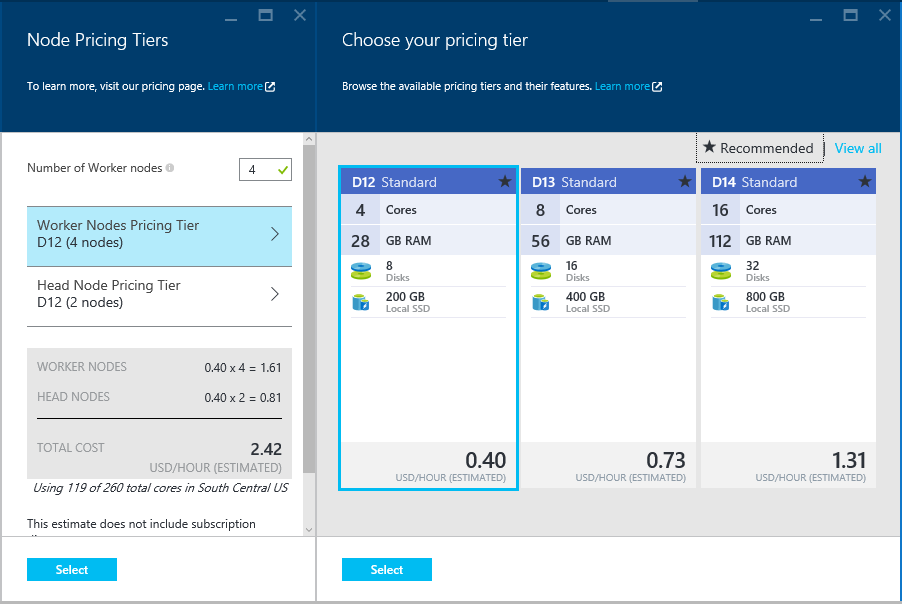

<properties
    pageTitle="Recursos de alta disponibilidade do baseados em Linux HDInsight (Hadoop) | Microsoft Azure"
    description="Saiba como baseados em Linux HDInsight clusters melhorar confiabilidade e disponibilidade por meio de um nó de cabeça adicional. Você aprenderá como isso afeta os serviços do Hadoop como Ambari e de seção, e também como conectem individualmente cada nó principal usando SSH."
    services="hdinsight"
    editor="cgronlun"
    manager="jhubbard"
    authors="Blackmist"
    documentationCenter=""
    tags="azure-portal"/>

<tags
    ms.service="hdinsight"
    ms.workload="big-data"
    ms.tgt_pltfrm="na"
    ms.devlang="multiple"
    ms.topic="article"
    ms.date="09/13/2016"
    ms.author="larryfr"/>

#Disponibilidade e confiabilidade de clusters Hadoop em HDInsight

Hadoop atinge alta disponibilidade e confiabilidade distribuindo cópias redundantes de serviços e dados entre os nós em um cluster. No entanto distribuições padrão do Hadoop geralmente têm apenas um único nó principal. Qualquer interrupção do único nó principal pode causar cluster deixem de funcionar.

Para resolver esse problema em potencial, clusters de HDInsight baseados em Linux no Azure fornecem dois nós de cabeça para aumentar a disponibilidade e confiabilidade dos serviços de Hadoop e trabalhos em execução.

> [AZURE.NOTE] As etapas usadas neste documento são específicas para clusters HDInsight baseados em Linux. Se você estiver usando um cluster baseado no Windows, consulte a [disponibilidade e confiabilidade de clusters baseados no Windows Hadoop no HDInsight](hdinsight-high-availability.md) para informações específicas do Windows.

##Compreendendo os nós

Nós em um cluster de HDInsight são implementadas usando máquinas virtuais do Azure. Se um nó falhar, ele é colocado offline e um novo nó é criado para substituir o nó que falhou. Enquanto o nó estiver offline, outro nó do mesmo tipo será usado até que o novo nó for colocado online.

> [AZURE.NOTE] Se o nó está analisando dados quando falhar, seu progresso no trabalho será perdido. O trabalho que o nó com falha estava trabalhando em vai ser enviadas novamente para outro nó.

As seções a seguir discutem os tipos de nó individual usados com HDInsight. Nem todos os tipos de nó são usados para um tipo de cluster. Por exemplo, um tipo de cluster Hadoop não terá qualquer nós Nimbus. Para obter mais informações sobre nós usados por tipos de cluster HDInsight, consulte a seção de tipos de Cluster de [clusters baseados em Linux criar Hadoop em HDInsight](hdinsight-hadoop-provision-linux-clusters.md#cluster-types).

###Nós de cabeça

Algumas implementações do Hadoop tem um único nó de cabeça que hospeda serviços e componentes que gerenciam a falha de nós de funcionário fluidez. Mas qualquer interrupções de serviços mestres em execução no nó principal faria com que o cluster pare de trabalhar.

HDInsight clusters fornecem um nó de cabeça secundário, que permite mestres serviços e componentes para continuar a ser executado no nó secundário em caso de uma falha na imagem principal.

> [AZURE.IMPORTANT] Ambos os nós cabeça estão ativos e em execução no cluster simultaneamente. Alguns serviços, como HDFS ou fio COLORIDO, só estão 'active' em um nó de cabeça em qualquer determinado tempo (e espera no outro nó principal). Outros serviços como HiveServer2 ou MetaStore seção estão ativos em ambos os nós cabeça ao mesmo tempo.

Nós de cabeça (e outros nós HDInsight,) têm um valor numérico como parte do nome de host do nó. Por exemplo, `hn0-CLUSTERNAME` ou `hn4-CLUSTERNAME`. 

> [AZURE.IMPORTANT] Não associar o valor numérico seja de um nó primário ou secundário; o valor numérico só está presente para fornecer um nome exclusivo para cada nó.

###Nós Nimbus

Para clusters de tempestade, nós Nimbus fornecem funcionalidade semelhante para o Hadoop JobTracker distribuindo e monitorando processamento em nós de trabalho. HDInsight fornece 2 nós Nimbus para o tipo de cluster tempestade.

###Nós zookeeper

Nós [zooKeeper](http://zookeeper.apache.org/ ) (ZKs) são usados para eleição do líder de serviços mestres em nós de cabeça e para garantir que os serviços, nós de dados (trabalhador) e gateways sabem qual nó principal um serviço mestre está ativo no. Por padrão, HDInsight fornece 3 nós ZooKeeper.

###Nós de operador

Nós de trabalhador executam a análise de dados reais quando um trabalho é enviado ao cluster. Se um nó trabalhador falhar, a tarefa da qual ela estava executando será enviada para outro nó de trabalho. Por padrão, HDInsight criará 4 nós de trabalho; No entanto, você pode alterar esse número para atender às suas necessidades tanto durante a criação de cluster após a criação de cluster.

###Nó de borda

Um nó de borda não participar ativamente análise de dados dentro do cluster, mas é usado por desenvolvedores ou cientistas dados ao trabalhar com Hadoop. O nó de borda reside na rede Virtual Azure mesmo como os outros nós no cluster e pode acessar diretamente a todos os outros nós. Desde que ele não está envolvido na análise de dados para o cluster, ele pode ser usado sem qualquer problema de tomar recursos longe serviços essenciais do Hadoop ou trabalhos de análise.

Atualmente, o servidor de R em HDInsight é o único tipo de cluster que fornece um nó de borda por padrão. Para servidor de R em HDInsight, o nó de borda é usado código de teste R localmente no nó antes de enviá-lo ao cluster para processamento distribuído.

[Criar um cluster baseado no Linux HDInsight com matiz em um nó de borda](https://azure.microsoft.com/documentation/templates/hdinsight-linux-with-hue-on-edge-node/) é um modelo de exemplo que pode ser usado para criar um tipo de cluster Hadoop que tem um nó de borda.

## Acessando os nós

Acesso ao cluster pela internet é fornecido por meio de um gateway público e está limitado a conexão com os nós de cabeça e (se um servidor de R em cluster HDInsight,) o nó de borda. Acesso a serviços executados em nós cabeça não é afetado pelo tendo vários nós de cabeça, como o gateway público roteia solicitações para o nó principal que hospeda o serviço solicitado. Por exemplo, se Ambari está hospedado no momento no nó principal secundário, o gateway encaminhará solicitações de entrada para Ambari para esse nó.

Quando estiver acessando o cluster usando SSH, conectando através de porta 22 (o padrão para o SSH,) irá conectá-o nó de cabeça principal; conectando através de porta 23 conectará para o nó de cabeça secundário. Por exemplo, `ssh username@mycluster-ssh.azurehdinsight.net` conectará o nó de cabeça principal do cluster denominado __meucluster__.

> [AZURE.NOTE] Isso também se aplica aos protocolos com base em SSH, como o SSH arquivo Transfer Protocol (SFTP).

O nó de borda fornecido com o servidor de R em clusters de HDInsight pode também ser acessado diretamente usando SSH através de porta 22. Por exemplo, `ssh username@RServer.mycluster.ssh.azurehdinsight.net` se conectará a nó de borda para um servidor de R em cluster HDInsight chamado __meucluster__. 

### Nomes de domínio totalmente qualificado interno (FQDN)

Nós em um cluster de HDInsight têm um endereço IP e FQDN que só pode ser acessado do cluster (como uma sessão SSH para o nó principal ou um trabalho em execução no cluster.) interno Ao acessar serviços em cluster usando o endereço IP ou FQDN interno, você deve usar Ambari para verificar o IP ou FQDN usar ao acessar o serviço.

Por exemplo, o serviço de Oozie pode executado somente em um nó principal e usando o `oozie` comando de uma sessão SSH requer a URL para o serviço. Isso pode ser recuperado do Ambari usando o seguinte comando:

    curl -u admin:PASSWORD "https://CLUSTERNAME.azurehdinsight.net/api/v1/clusters/CLUSTERNAME/configurations?type=oozie-site&tag=TOPOLOGY_RESOLVED" | grep oozie.base.url

Isso retornará um valor semelhante à seguinte, que contém a URL interna para usar com o `oozie` comando:

    "oozie.base.url": "http://hn0-CLUSTERNAME-randomcharacters.cx.internal.cloudapp.net:11000/oozie"

### Acessar outros tipos de nó

Você pode se conectar a nós que não estão diretamente acessíveis pela internet usando os seguintes métodos.

* __SSH__: quando conectado a um nó principal usando SSH, você pode usar SSH do nó cabeça para se conectar a outros nós no cluster.
* __Túnel SSH__: se você precisar acessar um serviço da web hospedado em um de nós que não são expostos à internet, você deve [usar um túnel SSH](hdinsight-linux-ambari-ssh-tunnel.md).
* __Rede Virtual do Azure__: se o seu cluster HDInsight faz parte de uma rede Virtual do Azure, qualquer recurso na mesma rede Virtual pode acessar diretamente todos os nós no cluster.

## Como verificar um status de serviço

A interface do usuário do Ambari Web ou a API REST Ambari pode ser usado para verificar o status dos serviços que são executadas em nós do cabeçalho.

###Web Ambari da interface do usuário

A interface do usuário do Ambari Web é visualizável em https://CLUSTERNAME.azurehdinsight.net. Substitua o nome do seu cluster **CLUSTERNAME** . Se solicitado, digite as credenciais de usuário HTTP para o seu cluster. O nome de usuário HTTP padrão é **admin** e a senha é a senha que você inseriu quando criar o cluster.

Quando você chegar na página Ambari, os serviços instalados serão listados no lado esquerdo da página.

Há uma série de ícones que podem aparecer ao lado de um serviço para indicar o status. Todos os alertas relacionados a um serviço podem ser visualizados usando o link de **alertas** na parte superior da página. Você pode selecionar cada serviço para exibir mais informações sobre ele.

Enquanto a página de serviço fornece informações sobre o status e a configuração de cada serviço, ele não fornece informações sobre a qual nó cabeça o serviço está em execução. Para exibir essas informações, use o link de **Hosts** na parte superior da página. Isto irá exibir hosts dentro do cluster, incluindo os nós de cabeça.

Selecionando o link para um de nós cabeça exibirá os serviços e componentes executados nesse nó.

###API REST de Ambari

A API REST Ambari está disponível pela internet e o gateway público lida com solicitações de roteamento para o nó principal que atualmente hospeda a API REST.

Você pode usar o seguinte comando para verificar o estado de um serviço por meio da API REST de Ambari:

    curl -u admin:PASSWORD https://CLUSTERNAME.azurehdinsight.net/api/v1/clusters/CLUSTERNAME/services/SERVICENAME?fields=ServiceInfo/state

* Substituir a **senha** com o usuário HTTP (admin), a senha da conta

* Substituir **CLUSTERNAME** com o nome do cluster

* Substitua **SERVICENAME** o nome do serviço para verificar o status de

Por exemplo, para verificar o status do serviço **HDFS** em um cluster chamado **meucluster**, com uma senha de **senha**, você usaria o seguinte:

    curl -u admin:password https://mycluster.azurehdinsight.net/api/v1/clusters/mycluster/services/HDFS?fields=ServiceInfo/state

A resposta será semelhante ao seguinte:

    {
      "href" : "http://hn0-CLUSTERNAME.randomcharacters.cx.internal.cloudapp.net:8080/api/v1/clusters/mycluster/services/HDFS?fields=ServiceInfo/state",
      "ServiceInfo" : {
        "cluster_name" : "mycluster",
        "service_name" : "HDFS",
        "state" : "STARTED"
      }
    }

A URL informa que o serviço está sendo executado em um nó principal chamado __hn0 CLUSTERNAME__.

O estado informa que o serviço está sendo executado ou **iniciado**.

Se você não souber quais serviços estão instalados no cluster, você pode usar o seguinte para recuperar uma lista:

    curl -u admin:PASSWORD https://CLUSTERNAME.azurehdinsight.net/api/v1/clusters/CLUSTERNAME/services

####Componentes de serviço

Serviços podem conter componentes que você deseja verificar o status de individualmente. Por exemplo, HDFS contém o componente de NameNode. Para exibir informações em um componente, o comando seria:

    curl -u admin:PASSWORD https://CLUSTERNAME.azurehdinsight.net/api/v1/clusters/CLUSTERNAME/services/SERVICE/components/component

Se você não souber quais componentes são fornecidos por um serviço, você pode usar o seguinte para recuperar uma lista:

    curl -u admin:PASSWORD https://CLUSTERNAME.azurehdinsight.net/api/v1/clusters/CLUSTERNAME/services/SERVICE/components/component
    
## Como acessar arquivos de log em nós do cabeçalho

###SSH

Enquanto estiver conectado a um nó principal por meio do SSH, arquivos de log podem ser encontrados em **/var/log**. Por exemplo, **/var/log/hadoop-yarn/yarn** contêm logs para fio COLORIDO.

Cada nó principal pode ter entradas de log exclusivo, portanto você deve verificar os logs em ambos.

###SFTP

Você também pode conectar-se para o nó principal usando o SSH File Transfer Protocol ou o protocolo de transferência de arquivo de seguro (SFTP) e baixar os arquivos de log diretamente.

Semelhante ao uso de um cliente SSH, quando se conectando ao cluster, você deve fornecer o nome de conta de usuário SSH e o endereço SSH do cluster. Por exemplo, `sftp username@mycluster-ssh.azurehdinsight.net`. Você também deve fornecer a senha da conta quando solicitado, ou fornecer uma chave pública usando o `-i` parâmetro.

Uma vez conectado, você verá um `sftp>` prompt. A partir desse prompt, você pode alterar diretórios, carregar e baixar arquivos. Por exemplo, os seguintes comandos altere diretórios para o diretório **/var/log/hadoop/hdfs** e, em seguida, baixar todos os arquivos no diretório.

    cd /var/log/hadoop/hdfs
    get *

Para obter uma lista de comandos disponíveis, digite `help` na `sftp>` prompt.

> [AZURE.NOTE] Também existem interfaces gráficas que permitem que você visualize o sistema de arquivos quando conectado usando SFTP. Por exemplo, [MobaXTerm](http://mobaxterm.mobatek.net/) permite que você navegue o sistema de arquivos usando uma interface semelhante ao Windows Explorer.

###Ambari

> [AZURE.NOTE] Acessar os arquivos de log por meio de Ambari requer um túnel SSH, como os sites para os serviços individuais não estão expostos publicamente na Internet. Para obter informações sobre como usar um túnel SSH, consulte [Usar SSH túnel para acessar Ambari web UI, ResourceManager, JobHistory, NameNode, Oozie e outra web da interface do usuário](hdinsight-linux-ambari-ssh-tunnel.md).

Da interface Web Ambari, selecione o serviço que você deseja exibir logs de (por exemplo, fio COLORIDO) e use **Links rápidos** para selecionar quais nó principal para exibir os logs.

## Como configurar o tamanho do nó ##

O tamanho da um nó só pode ser selecionado durante a criação de cluster. Você pode obter uma lista de tamanhos de máquina virtual diferentes disponíveis de HDInsight, incluindo o core, memória e armazenamento local para cada, na [página de preços de HDInsight](https://azure.microsoft.com/pricing/details/hdinsight/).

Ao criar um novo cluster, você pode especificar o tamanho de nós. A seguir fornece informações sobre como especificar o tamanho usando o [Portal do Azure][preview-portal], [Azure PowerShell][azure-powershell]e o [Azure CLI][azure-cli]:

* **Portal Azure**: ao criar um novo cluster, você terá a opção de definir o tamanho (preço camada,) da cabeça, trabalhador e (se usado pelo tipo cluster,) nós de ZooKeeper para o cluster:

    

* **Azure CLI**: ao usar o `azure hdinsight cluster create` comando, você pode definir o tamanho da cabeça, trabalhador e nós ZooKeeper usando o `--headNodeSize`, `--workerNodeSize`, e `--zookeeperNodeSize` parâmetros.

* **Azure PowerShell**: ao usar o `New-AzureRmHDInsightCluster` cmdlet, você pode definir o tamanho da cabeça, trabalhador e nós ZooKeeper usando o `-HeadNodeVMSize`, `-WorkerNodeSize`, e `-ZookeeperNodeSize` parâmetros.

##Próximas etapas

Neste documento, você aprendeu como Azurehdinsight fornece alta disponibilidade para Hadoop. Use o seguinte para saber mais sobre o que foi mencionado neste documento.

- [Referência REST Ambari](https://github.com/apache/ambari/blob/trunk/ambari-server/docs/api/v1/index.md)

- [Instalar e configurar o CLI do Azure](../xplat-cli-install.md)

- [Instalar e configurar o PowerShell do Azure](../powershell-install-configure.md)

- [Gerenciar HDInsight usando Ambari](hdinsight-hadoop-manage-ambari.md)

- [Provisionar clusters baseados em Linux HDInsight](hdinsight-hadoop-provision-linux-clusters.md)

[preview-portal]: https://portal.azure.com/
[azure-powershell]: ../powershell-install-configure.md
[azure-cli]: ../xplat-cli-install.md
