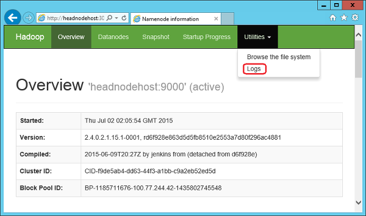

<properties
    pageTitle="Disponibilidade de Hadoop clusters de HDInsight | Microsoft Azure"
    description="HDInsight implanta clusters altamente disponíveis e confiáveis com um nó de cabeça adicional."
    services="hdinsight"
    tags="azure-portal"
    editor="cgronlun"
    manager="jhubbard"
    authors="mumian"
    documentationCenter=""/>

<tags
    ms.service="hdinsight"
    ms.workload="big-data"
    ms.tgt_pltfrm="na"
    ms.devlang="multiple"
    ms.topic="article"
    ms.date="10/21/2016"
    ms.author="jgao"/>

#Disponibilidade e confiabilidade de clusters baseados no Windows Hadoop em HDInsight

>[AZURE.NOTE] As etapas usadas neste documento são específicas para clusters HDInsight baseados no Windows. Se você estiver usando um cluster baseado em Linux, consulte [disponibilidade e confiabilidade dos clusters baseados em Linux Hadoop no HDInsight](hdinsight-high-availability-linux.md) para informações específicas do Linux.

HDInsight permite aos clientes implantar uma variedade de tipos de cluster, para cargas de trabalho de análise de dados diferentes. Tipos de cluster oferecidos hoje são clusters de Hadoop para consulta e cargas de trabalho de análise, HBase clusters para cargas de trabalho de NoSQL e clusters tempestade para cargas de trabalho de processamento de eventos de tempo real. Dentro de um tipo determinado cluster, há funções diferentes para vários nós. Por exemplo:

- Clusters de Hadoop para HDInsight são implantados com duas funções:
    - Nó de cabeça (2 nós)
    - Dados nó (pelo menos 1)

- Clusters de HBase para HDInsight são implantados com três funções:
    - Servidores de cabeça (2 nós)
    - Servidores de região (pelo menos 1 nó)
    - Nós mestre/Zookeeper (3 nós)

- Clusters de tempestade para HDInsight são implantados com três funções:
    - Nós Nimbus (2 nós)
    - Servidores de Supervisor (pelo menos 1 nó)
    - Nós zookeeper (3 nós)

Implementações padrão de Hadoop clusters geralmente têm um único nó principal. HDInsight remove esse único ponto de falha com a adição de um nó de cabeça secundário /head nó de servidor/Nimbus para aumentar a disponibilidade e confiabilidade do serviço necessário para gerenciar cargas de trabalho. Esses nós de servidores/Nimbus de cabeça nós/cabeça foram projetados para gerenciar a falha de nós de funcionário fluidez, mas as interrupções de serviços mestres em execução no nó principal faria com que o cluster pare de trabalhar.

Nós [zooKeeper](http://zookeeper.apache.org/ ) (ZKs) foram adicionadas e são usados para eleição do líder de cabeça nós e para garantir que trabalhador nós e gateways (GWs) sabem quando alternar para o nó de cabeça secundário (cabeça Node1) quando o nó de cabeça ativo (cabeça Node0) se torna inativo.

## Verificar status de serviço de nó de cabeça ativo
Para determinar qual nó principal está ativo e verificar o status dos serviços executados nesse nó cabeça, você deve se conectar ao cluster Hadoop usando o protocolo de área de trabalho remota (RDP). Para as instruções de RDP, consulte [Gerenciar Hadoop clusters em HDInsight usando o portal do Azure](hdinsight-administer-use-management-portal.md#connect-to-hdinsight-clusters-by-using-rdp). Depois que você tiver conectado ao cluster, clique duas vezes no ícone **Hadoop serviço disponível** localizado na área de trabalho para obter o status sobre qual nó cabeça a Namenode, serviços Jobtracker, Templeton, Oozieservice, Metastore e Hiveserver2 estão em execução, ou para serviços HDI 3.0, o Namenode, gerente de recursos, servidor de histórico, Templeton, Oozieservice, Metastore e Hiveserver2.

Na captura de tela, o nó de cabeça ativo é *headnode0*.

## Arquivos de log de acesso no nó principal secundário

Para acessar trabalho logs no nó principal secundário que ele se tornou o nó de cabeça ativo, a JobTracker UI de navegação ainda funciona como faz para o nó ativo principal. Para acessar JobTracker, você deve se conectar ao cluster Hadoop usando RDP conforme descrito na seção anterior. Quando tiverem remotos ao cluster, clique duas vezes no ícone de **Status de nó do Hadoop nome** localizado na área de trabalho e clique nos **logs de NameNode** para acessar o diretório de logs no nó principal secundário.

## Configurar o tamanho de nó principal
Nós de cabeça são alocados como grandes máquinas virtuais (VMs) por padrão. Esse tamanho é adequado para o gerenciamento da maioria dos trabalhos de Hadoop executados no cluster. Mas há cenários que podem exigir VMs extra grandes para os nós de cabeça. Um exemplo é quando o cluster tem que gerenciar um grande número de pequenos trabalhos de Oozie.

VMs extra grandes podem ser configuradas usando cmdlets do PowerShell do Azure ou o SDK do HDInsight.

A criação e provisionamento de um cluster usando o PowerShell do Azure é documentadas no [administrar HDInsight usando o PowerShell](hdinsight-administer-use-powershell.md). A configuração de um nó de cabeça extra grande requer a adição do `-HeadNodeVMSize ExtraLarge` parâmetro para o `New-AzureRmHDInsightcluster` cmdlet usado nesse código.

    # Create a new HDInsight cluster in Azure PowerShell
    # Configured with an ExtraLarge head-node VM
    New-AzureRmHDInsightCluster `
                -ResourceGroupName $resourceGroupName `
                -ClusterName $clusterName ` 
                -Location $location `
                -HeadNodeVMSize ExtraLarge `
                -DefaultStorageAccountName "$storageAccountName.blob.core.windows.net" `
                -DefaultStorageAccountKey $storageAccountKey `
                -DefaultStorageContainerName $containerName  `
                -ClusterSizeInNodes $clusterNodes

Para o SDK, a história é semelhante. A criação e provisionamento de um cluster usando o SDK é documentadas no [Usando o SDK do .NET de HDInsight](hdinsight-provision-clusters.md#sdk). A configuração de um nó de cabeça extra grande requer a adição do `HeadNodeSize = NodeVMSize.ExtraLarge` parâmetro para o `ClusterCreateParameters()` método usado nesse código.

    # Create a new HDInsight cluster with the HDInsight SDK
    # Configured with an ExtraLarge head-node VM
    ClusterCreateParameters clusterInfo = new ClusterCreateParameters()
    {
        Name = clustername,
        Location = location,
        HeadNodeSize = NodeVMSize.ExtraLarge,
        DefaultStorageAccountName = storageaccountname,
        DefaultStorageAccountKey = storageaccountkey,
        DefaultStorageContainer = containername,
        UserName = username,
        Password = password,
        ClusterSizeInNodes = clustersize
    };

## Próximas etapas

- [Apache ZooKeeper](http://zookeeper.apache.org/ )
- [Conectar ao HDInsight clusters usando RDP](hdinsight-administer-use-management-portal.md#rdp)
- [Usando o SDK do .NET HDInsight](hdinsight-provision-clusters.md#sdk)
