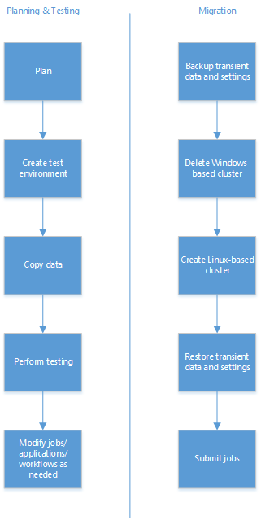

<properties
pageTitle="Migrar do HDInsight baseado no Windows para baseados em Linux HDInsight | Azure"
description="Saiba como migrar de um cluster baseado no Windows HDInsight para um cluster de HDInsight baseados em Linux."
services="hdinsight"
documentationCenter=""
authors="Blackmist"
manager="jhubbard"
editor="cgronlun"/>

<tags
ms.service="hdinsight"
ms.devlang="na"
ms.topic="article"
ms.tgt_pltfrm="na"
ms.workload="big-data"
ms.date="10/28/2016"
ms.author="larryfr"/>

#Migrar de um cluster baseado no Windows HDInsight para um cluster baseado em Linux

Enquanto baseado no Windows HDInsight fornece uma maneira fácil de usar Hadoop na nuvem, você pode descobrir que precisa de um cluster baseado em Linux para tirar proveito de ferramentas e tecnologias que são necessárias para sua solução. Muitas coisas no ecossistema do Hadoop são desenvolvidas em sistemas baseados em Linux e alguns podem não estar disponível para uso com HDInsight baseados no Windows. Além disso, muitos livros, vídeos e outros materiais de treinamento presumem que você está usando um sistema Linux ao trabalhar com Hadoop.

Este documento fornece detalhes sobre as diferenças entre HDInsight em Windows e Linux e orientação sobre como migrar cargas de trabalho existentes para um cluster baseado em Linux.

> [AZURE.NOTE] Clusters de HDInsight usar suporte a longo prazo Ubuntu (LTS) como o sistema operacional para os nós no cluster. Para obter informações sobre a versão do Ubuntu disponível com HDInsight, juntamente com outras informações de controle de versão do componente, consulte [as versões do componente de HDInsight](hdinsight-component-versioning.md).

## Tarefas de migração

O fluxo de trabalho geral para a migração é da seguinte maneira.

1.  Leia cada seção deste documento para entender as alterações que podem ser necessárias ao migrar seu fluxo de trabalho existente, trabalhos, etc. para um cluster baseado em Linux.

2.  Crie um cluster baseado em Linux como um ambiente de garantia de qualidade, teste. Para obter mais informações sobre como criar um cluster baseado em Linux, consulte [baseados em Linux criar clusters em HDInsight](hdinsight-hadoop-provision-linux-clusters.md).

3.  Copie trabalhos existentes, fontes de dados e receptores para o novo ambiente. Ver os dados de cópia para a seção de ambiente de teste para obter mais detalhes.

4.  Execute testes de validação para certificar-se de que seus trabalhos funcionam como esperado no novo cluster.

Depois que você tiver verificado que tudo funciona como esperado, agende o tempo de inatividade para a migração. Durante esse tempo de inatividade, fazer as seguintes ações.

1.  Faça o backup de quaisquer dados temporárias armazenados localmente em nós do cluster. Por exemplo, se você tiver dados armazenados diretamente em um nó principal.

2.  Exclua o cluster baseado no Windows.

3.  Crie um cluster baseado em Linux usando o armazenamento de dados padrão mesmo que o cluster baseado no Windows usado. Isso permitirá que o novo cluster continuar a trabalhar em seus dados de produção existente.

4.  Importe qualquer temporárias dados de que backup.

5.  Iniciar trabalhos/continuar processamento usando o novo cluster.

### Copiar dados para o ambiente de teste

Há vários métodos para copiar os dados e trabalhos, porém os dois discutidos nesta seção são os métodos simples para diretamente move arquivos para um cluster de teste.

#### Cópia HDFS DFS

Você pode usar o comando Hadoop HDFS diretamente copiar dados do armazenamento para o seu cluster de produção existente, para o armazenamento para um novo cluster de teste usando as seguintes etapas.

1. Localize as armazenamento padrão contêiner informações de conta e seu cluster existente. Você pode fazer isso usando o seguinte script do PowerShell do Azure.

        $clusterName="Your existing HDInsight cluster name"
        $clusterInfo = Get-AzureRmHDInsightCluster -ClusterName $clusterName
        write-host "Storage account name: $clusterInfo.DefaultStorageAccount.split('.')[0]"
        write-host "Default container: $clusterInfo.DefaultStorageContainer"

2. Siga as etapas em clusters baseados em Linux criar no documento de HDInsight para criar um novo ambiente de teste. Parar antes de criar o cluster e, em vez disso, selecione **Configuração opcional**.

3. Da lâmina configuração opcional, selecione **Contas de armazenamento vinculadas**.

4. Selecione **Adicionar uma chave de armazenamento**e quando solicitado, selecione a conta de armazenamento que foi retornada pelo script PowerShell na etapa 1. Clique em **Selecionar** em cada lâmina fechá-los. Finalmente, crie o cluster.

5. Depois que o cluster tiver sido criado, conectá-la usando **SSH.** Se você não estiver familiarizado com o uso de SSH com HDInsight, consulte um dos seguintes artigos.

    * [Use SSH com baseado em Linux HDInsight de clientes do Windows](hdinsight-hadoop-linux-use-ssh-windows.md)

    * [Use SSH com baseado em Linux HDInsight de clientes Linux, Unix e Mac](hdinsight-hadoop-linux-use-ssh-unix.md)

6. Da sessão SSH, use o seguinte comando para copiar arquivos da conta de armazenamento vinculado para a nova conta de armazenamento padrão. Substitua o CONTÊINER e conta com o contêiner e informações de conta retornado pelo script PowerShell na etapa 1. Substitua o caminho para dados com o caminho para um arquivo de dados.

        hdfs dfs -cp wasbs://CONTAINER@ACCOUNT.blob.core.windows.net/path/to/old/data /path/to/new/location

    [AZURE.NOTE] Se a estrutura de diretório que contém os dados não existir no ambiente de teste, você pode criar usando o comando a seguir.

        hdfs dfs -mkdir -p /new/path/to/create

    O `-p` switch permite a criação de todas as pastas no caminho.

#### Cópia direta entre blobs de armazenamento do Azure

Como alternativa, talvez você queira usar o `Start-AzureStorageBlobCopy` cmdlet do PowerShell do Azure para copiar blobs entre contas de armazenamento fora do HDInsight. Para obter mais informações, consulte como gerenciar seção Blobs do Azure usando o PowerShell do Azure com o armazenamento do Azure.

##Tecnologias do lado do cliente

Em geral, tecnologias do lado do cliente como [cmdlets do PowerShell do Azure](../powershell-install-configure.md), [Azure CLI](../xplat-cli-install.md) ou o [SDK do .NET para Hadoop](https://hadoopsdk.codeplex.com/) continuarão a funcionar a mesma com clusters baseados em Linux, como eles dependem de APIs REST que são os mesmos em ambos os tipos de cluster SO.

##Tecnologias de servidor

A tabela a seguir fornece orientação sobre migrando componentes de servidor que são específicos do Windows.

| Se você estiver usando essa tecnologia … | Execute esta ação... |
| ----- | ----- |
| **PowerShell** (scripts de servidor, incluindo ações de Script usado durante a criação de cluster) | Regravar como Bash scripts. Para ações de Script, consulte [baseados em Personalizar Linux HDInsight com ações de Script](hdinsight-hadoop-customize-cluster-linux.md) e [desenvolvimento de ação de Script para HDInsight baseados em Linux](hdinsight-hadoop-script-actions-linux.md). |
| **CLI Azure** (scripts do lado do servidor) | A CLI do Azure está disponível no Linux, ele não vêm pré-instalados em nós de cabeça de cluster HDInsight. Se você precisar dela para execução de scripts do lado do servidor, consulte [instalar o CLI do Azure](../xplat-cli-install.md) para obter informações sobre como instalar nas plataformas baseadas no Linux. |
| **Componentes do .NET** | .NET não é totalmente suportado em clusters de HDInsight baseados em Linux. Baseado em Linux tempestade em HDInsight clusters criadas após o suporte de 28/10/2017 topologias c# tempestade usando a estrutura SCP.NET. Suporte adicional para .NET será adicionado em futuras atualizações. |
| **Componentes de Win32 ou outra tecnologia somente do Windows** | Orientação depende do componente ou tecnologia; Você poderá encontrar uma versão que seja compatível com Linux, ou talvez você precise encontrar uma solução alternativa ou regravação este componente. |

##Criação de cluster

Esta seção fornece informações sobre as diferenças na criação de cluster.

### SSH usuário

Clusters de HDInsight baseados em Linux usam o protocolo **Secure Shell (SSH)** para fornecer acesso remoto a nós do cluster. Ao contrário dos clusters baseados em área de trabalho remota para Windows, a maioria dos clientes SSH não fornecem uma experiência de usuário gráfica, mas em vez disso, fornece uma linha de comando que permite executar comandos em cluster. Alguns clientes (como [MobaXterm](http://mobaxterm.mobatek.net/),) fornecem um navegador de sistema de arquivos gráficos além de um controle remoto da linha de comando.

Durante a criação de cluster, você deve fornecer um usuário SSH e uma **senha** ou **certificado de chave pública** para autenticação.

Recomendamos o uso de certificado de chave pública, a fim de que ele seja mais seguro que usando uma senha. Autenticação de certificado funciona por gerar um par de chaves pública/particular assinado, em seguida, fornecendo a chave pública ao criar o cluster. Ao se conectar ao servidor usando SSH, a chave privada no cliente fornece autenticação para a conexão.

Para obter mais informações sobre como usar SSH com HDInsight, consulte:

- [Usar SSH com HDInsight de clientes do Windows](hdinsight-hadoop-linux-use-ssh-windows.md)

- [Usar SSH com HDInsight de clientes Linux, Unix e OS X](hdinsight-hadoop-linux-use-ssh-unix.md)

### Personalização de cluster

**Ações de script** usado com clusters baseados em Linux devem ser escritos em script Bash. Enquanto ações de Script pode ser usadas durante a criação de cluster, para clusters baseados em Linux eles também podem ser usados para executar a personalização após um cluster e em execução. Para obter mais informações, consulte [HDInsight baseados em Linux personalizar com ações de Script](hdinsight-hadoop-customize-cluster-linux.md) e [desenvolvimento de ação de Script para HDInsight baseados em Linux](hdinsight-hadoop-script-actions-linux.md).

Outro recurso de personalização é **inicialização**. Para clusters do Windows, isso permite especificar o local de bibliotecas adicionais para uso com seção. Após a criação do cluster, essas bibliotecas são automaticamente disponíveis para uso com consultas de seção sem a necessidade de usar `ADD JAR`.

Inicialização para clusters baseados em Linux não fornecem essa funcionalidade. Em vez disso, use ação de script documentada em [bibliotecas de adicionar seção durante a criação de cluster](hdinsight-hadoop-add-hive-libraries.md).

### Redes virtuais

Baseado no Windows HDInsight clusters funcionem apenas com redes virtuais clássico, enquanto HDInsight baseados em Linux clusters exigem redes de Virtual do Gerenciador de recursos. Se você tiver recursos em uma rede Virtual clássico cluster Linux HDInsight deve se conectar ao, consulte [Conectando a uma rede Virtual clássico a uma rede de Virtual do Gerenciador de recursos](../vpn-gateway/vpn-gateway-connect-different-deployment-models-portal.md).

Para obter mais informações sobre requisitos de configuração para usar redes virtuais Azure com HDInsight, consulte [recursos de estender HDInsight usando uma rede Virtual](hdinsight-extend-hadoop-virtual-network.md).

##Monitoramento e gerenciamento

Muitos da web interfaces do usuário que você talvez tenha usado com HDInsight baseados no Windows, como o histórico de trabalho ou fio colorido UI, estão disponíveis por meio de Ambari. Além disso, o modo de exibição de seção Ambari fornece uma maneira de executar consultas de seção usando o navegador da web. A interface do usuário do Ambari Web está disponível em clusters baseados em Linux em https://CLUSTERNAME.azurehdinsight.net.

Para obter mais informações sobre como trabalhar com Ambari, consulte os seguintes documentos:

- [Ambari Web](hdinsight-hadoop-manage-ambari.md)

- [API REST de Ambari](hdinsight-hadoop-manage-ambari-rest-api.md)

### Alertas de Ambari

Ambari tem um sistema de alerta que informa de possíveis problemas com o cluster. Alertas aparecem como vermelhas ou amarelas entradas na interface do usuário do Ambari Web, no entanto, você também poderá recuperá-las por meio da API REST.

> [AZURE.IMPORTANT] Alertas de Ambari indicam que há *pode* ser um problema, não há *é* um problema. Por exemplo, você pode receber um alerta que HiveServer2 não pode ser acessado, embora você possa acessá-lo normalmente.
>
> Vários alertas são implementadas como consultas baseadas em intervalo em relação a um serviço e esperam uma resposta em um período específico. Para que o alerta não necessariamente significa que o serviço está desativado, basta que ele não retorna resultados dentro do prazo esperado.

Em geral, você deve avaliar se um alerta vem ocorrendo por um longo período ou reflete problemas de usuário que anteriormente foram relatados com o cluster antes de realizar ação nele.

##Locais de arquivos de sistema

O sistema de arquivos de cluster Linux é disposto diferente clusters HDInsight baseados no Windows. Use a tabela a seguir para localizar mais usada arquivos.

| Eu preciso encontrar … | Ele está localizado... |
| ----- | ----- |
| Configuração | `/etc`. Por exemplo,`/etc/hadoop/conf/core-site.xml` |
| Arquivos de log | `/var/logs` |
| Plataforma de dados de Hortonworks (HDP) | `/usr/hdp`. Há dois diretórios localizado aqui, que é a versão atual do HDP (por exemplo, `2.2.9.1-1`,) e `current`. O `current` directory contém simbólicos links para arquivos e diretórios localizados no diretório de número de versão e é fornecido como uma maneira conveniente de acessar arquivos HDP desde a versão número alterará conforme a versão HDP é atualizada. |
| Hadoop-streaming.jar | `/usr/hdp/current/hadoop-mapreduce-client/hadoop-streaming.jar` |

Em geral, se você souber o nome do arquivo, você pode usar o seguinte comando de uma sessão SSH para encontrar o caminho do arquivo:

    find / -name FILENAME 2>/dev/null

Você também pode usar caracteres curinga com o nome do arquivo. Por exemplo, `find / -name *streaming*.jar 2>/dev/null` retornará o caminho para quaisquer arquivos jar que contêm a palavra 'streaming' como parte do nome do arquivo.

##Seção, porco e MapReduce

Porco e MapReduce cargas de trabalho são muito semelhantes em clusters baseados em Linux - a principal diferença é se você usar a área de trabalho remota para se conectar a um cluster baseado no Windows e executar trabalhos, você usará SSH com clusters baseados em Linux.

- [Usar porco com SSH](hdinsight-hadoop-use-pig-ssh.md)

- [Usar MapReduce com SSH](hdinsight-hadoop-use-mapreduce-ssh.md)

### Seção

O gráfico a seguir fornece orientação sobre como migrar suas cargas de trabalho de seção.

| Em baseado no Windows, usar … | Em baseados em Linux... |
| ----- | ----- |
| **Editor de seção** | [Modo de exibição de seção no Ambari](hdinsight-hadoop-use-hive-ambari-view.md) |
| `set hive.execution.engine=tez;`Para habilitar Tez | Tez é o mecanismo de execução padrão para clusters baseados em Linux, portanto, a instrução set não é mais necessária. |
| Arquivos CMD ou scripts no servidor invocado como parte de um trabalho de seção | usar Bash scripts |
| `hive`comando da área de trabalho remota | Use [Beeline](hdinsight-hadoop-use-hive-beeline.md) ou [seção de uma sessão SSH](hdinsight-hadoop-use-hive-ssh.md) |

##Tempestade

| Em baseado no Windows, usar … | Em baseados em Linux... |
| ----- | ----- |
| Painel de tempestade | No painel de tempestade não está disponível. Consulte [topologias implantar e gerenciar tempestade em HDInsight baseado em Linux](hdinsight-storm-deploy-monitor-topology-linux.md) para maneiras submeter topologias |
| Tempestade de interface do usuário | A interface de usuário de tempestade está disponível em https://CLUSTERNAME.azurehdinsight.net/stormui |
| Visual Studio para criar, implantar e gerenciar topologias c# ou híbrido | O Visual Studio pode ser usado para criar, implantar e gerenciar c# (SCP.NET) ou topologias híbridas em baseados em Linux tempestade em clusters de HDInsight criadas após 28/10/2017. |

##HBase

Em clusters baseados em Linux, é o pai de znode de HBase `/hbase-unsecure`. Você deve configurar isso na configuração de qualquer cliente Java aplicativos que usam API de Java HBase nativo.

Consulte [criar um aplicativo baseado em Java HBase](hdinsight-hbase-build-java-maven.md) para um cliente de exemplo que define esse valor.

##Spark

Clusters Spark estavam disponíveis em clusters do Windows durante a visualização; No entanto, versão, Spark só está disponível com clusters baseados em Linux. Há um caminho de migração de um cluster de visualização Spark baseado no Windows para um cluster de Spark baseados em Linux de lançamento.

##Problemas conhecidos

### Azure fábrica de dados .NET as atividades personalizadas

Azure fábrica de dados .NET as atividades personalizadas não são suportadas atualmente em clusters de HDInsight baseados em Linux. Em vez disso, você deve usar um dos seguintes métodos para implementar atividades personalizadas como parte do pipeline AAD.

-   Execute atividades do .NET em pool de lote do Azure. Consulte a seção de serviço de uso do Azure lote vinculadas de [atividades personalizadas de uso em um pipeline de fábrica de dados do Azure](../data-factory/data-factory-use-custom-activities.md#AzureBatch)

-   Implemente a atividade como uma atividade de MapReduce. Consulte [Invocar MapReduce programas da fábrica de dados](../data-factory/data-factory-map-reduce.md) para obter mais informações.

### Finais de linha

Em geral, o finais de linha nos sistemas baseados no Windows usam CRLF, enquanto sistemas baseados em Linux usam LF. Se você produzir ou espera, dados com finais de linha CRLF, você talvez precise modificar o produtores ou consumidores para trabalhar com o final da linha de LF.

Por exemplo, usando o PowerShell do Azure a consulta de HDInsight em um cluster baseado no Windows retornará dados com CRLF. A mesma consulta com um cluster baseado em Linux retornará LF. Em muitos casos, isso não importa o consumidor de dados, no entanto, ele deve ser analisado antes de migrar para um cluster baseado em Linux.

Se você tiver scripts que serão executados diretamente em nós do Linux-cluster (como um script de Python usada com a seção ou um trabalho MapReduce), você sempre deve usar LF como o final da linha. Se você usar CRLF, você poderá ver erros ao executar os scripts em um cluster baseado em Linux.

Se você souber que os scripts não contêm cadeias de caracteres com caracteres de CR inseridas, massa altere extremidades de linha usando um dos seguintes métodos:

-   **Se você tiver scripts que você planeja Carregando ao cluster**, use as seguintes instruções do PowerShell alterar extremidades de linha de CRLF para LF antes de carregar o script ao cluster.

        $original_file ='c:\path\to\script.py'
        $text = [IO.File]::ReadAllText($original_file) -replace "`r`n", "`n"
        [IO.File]::WriteAllText($original_file, $text)

-   **Se você tiver scripts que já estão no armazenamento usado pelo cluster**, você pode usar o seguinte comando de uma sessão SSH ao cluster baseado em Linux para modificar o script.

        hdfs dfs -get wasbs:///path/to/script.py oldscript.py
        tr -d '\r' < oldscript.py > script.py
        hdfs dfs -put -f script.py wasbs:///path/to/script.py

##Próximas etapas

-   [Aprenda a criar clusters baseados em Linux HDInsight](hdinsight-hadoop-provision-linux-clusters.md)

-   [Conectar a um cluster baseado em Linux usando SSH de um cliente do Windows](hdinsight-hadoop-linux-use-ssh-windows.md)

-   [Conectar a um cluster baseado em Linux usando SSH de um cliente Linux, Unix ou Mac](hdinsight-hadoop-linux-use-ssh-unix.md)

-   [Gerenciar um cluster baseado em Linux usando Ambari](hdinsight-hadoop-manage-ambari.md)
