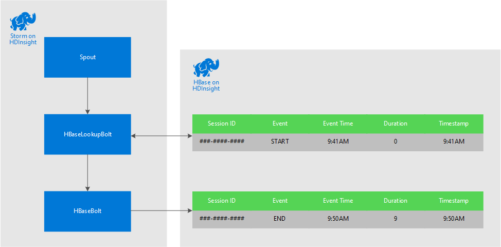

<properties
 pageTitle="Correlação eventos ao longo do tempo com tempestade e HBase em HDInsight"
 description="Aprenda a correlação eventos que chegam em momentos diferentes usando tempestade e HBase HDInsight."
 services="hdinsight"
 documentationCenter=""
 authors="Blackmist"
 manager="jhubbard"
 editor="cgronlun"
 tags="azure-portal"/>

<tags
 ms.service="hdinsight"
 ms.devlang="dotnet"
 ms.topic="article"
 ms.tgt_pltfrm="na"
 ms.workload="big-data"
 ms.date="10/27/2016"
 ms.author="larryfr"/>

# Correlação eventos ao longo do tempo com tempestade e HBase em HDInsight

Usando um repositório de dados persistentes com tempestade Apache, você pode correlacionar entradas de dados que chegam em momentos diferentes. Por exemplo, vinculando eventos de login e logout para uma sessão de usuário calcular quanto tempo a sessão de duração.

Neste documento, você aprenderá a criar uma topologia de c# tempestade básica que controla eventos de login e logout para sessões de usuário e calcula a duração da sessão. A topologia usa HBase como um repositório de dados persistentes. HBase também permite executar consultas de lote os dados históricos para produzir obtenção de informações adicionais, como quantas sessões de usuário foram iniciadas ou encerradas durante um período específico.

## Pré-requisitos

- Visual Studio e as ferramentas de HDInsight para Visual Studio: consulte [começar a usar as ferramentas de HDInsight para Visual Studio](../HDInsight/hdinsight-hadoop-visual-studio-tools-get-started.md) para obter informações de instalação.

- Apache tempestade em HDInsight cluster (baseado no Windows). Isso executa a topologia de tempestade, que processa dados de entrada e armazená-lo HBase.

    > [AZURE.IMPORTANT] Enquanto SCP.NET topologias são suportadas em clusters baseados em Linux tempestade criadas após 28/10/2016, o SDK do HBase para o pacote de .NET disponível a partir de 28/10/2016 não funciona corretamente no Linux.

- Apache HBase em cluster HDInsight (Linux ou baseado no Windows). Este é o armazenamento de dados para esse exemplo.

## Arquitetura

Correlação eventos requer um identificador comum para a origem do evento. Por exemplo, uma ID de usuário, ID da sessão ou outro dado que seja uma) exclusiva e b) incluído em todos os dados enviados para tempestade. Este exemplo usa um valor de GUID para representar uma identificação de sessão.

Este exemplo consiste em dois clusters de HDInsight:

-   HBase: repositório de dados persistentes para dados históricos

-   Tempestade: usado para incluir dados de entrada

Os dados são gerados aleatoriamente pela topologia de tempestade e consistem dos seguintes itens:

-   ID da sessão: uma GUID que identifica exclusivamente cada sessão

-   Evento: um início ou fim evento. Neste exemplo, iniciar sempre ocorre antes do final

-   Tempo: a hora do evento.

Esses dados são processados e armazenados em HBase.

### Topologia de tempestade

Quando uma sessão for iniciado, um evento de **início** é recebido pela topologia e logon HBase. Quando um evento de **término** for recebido, a topologia recupera o **início** do evento e calcula o tempo entre os dois eventos. Este valor de **duração** então é armazenada em HBase juntamente com as informações de evento **final** .

> [AZURE.IMPORTANT] Enquanto essa topologia demonstra o padrão básico, uma solução de produção precisaria levar design para os seguintes cenários:
>
> - Eventos chegando fora ordem
> - Eventos duplicados
> - Eventos ignorados

A topologia de amostra é composta dos seguintes componentes:

-   Session.cs: simula uma sessão de usuário, criando um ID de sessão aleatório, iniciar tempo e quanto tempo dura a sessão

-   Spout.cs: cria 100 sessões, emite um evento de início, aguarda o tempo limite aleatório para cada sessão e, em seguida, emite um evento de término. Em seguida, reciclagem encerrada sessões para gerar novas.

-   HBaseLookupBolt.cs: usa a identificação de sessão para procurar as informações de sessão do HBase. Quando um evento de término é processado, ele encontra o evento iniciar correspondente e calcula a duração da sessão.

-   HBaseBolt.cs: Armazena informações em HBase.

-   TypeHelper.cs: Ajuda a conversão de tipo quando leitura / gravação em HBase.

### Esquema de HBase

No HBase, os dados são armazenados em uma tabela com as esquema/configurações a seguir:

-   Tecla de linha: a sessão ID é usada como a chave para linhas nesta tabela

-   Família de coluna: o nome da família é 'cf'. Colunas armazenadas nesta família são:

    -   evento: iniciar ou finalizar

    -   tempo: o tempo em milissegundos que o evento ocorreu

    -   Duração: o comprimento entre eventos de início e término

-   VERSÕES: a família 'cf' está definida para reter 5 versões de cada linha

    > [AZURE.NOTE] As versões são um log de anterior valores armazenados para uma chave de linha específica. Por padrão, HBase somente retornará o valor para a versão mais recente de uma linha. Nesse caso, a mesma linha é usada para todos os eventos (início, término.) cada versão de uma linha é identificado pelo valor de carimbo de hora. Isso fornece uma exibição do histórico de eventos registrados para uma ID específica.

## Baixar o projeto

O projeto de exemplo pode ser baixado do [https://github.com/Azure-Samples/hdinsight-storm-dotnet-event-correlation](https://github.com/Azure-Samples/hdinsight-storm-dotnet-event-correlation).

Este download contém os projetos c# a seguir:

-   CorrelationTopology: Topologia de c# tempestade que emite aleatoriamente eventos de início e término para sessões de usuário. Cada sessão dura entre 1 e 5 minutos.

-   SessionInfo: Console aplicativo c# que cria a tabela de HBase e fornece consultas de exemplo para retornar informações sobre dados armazenados sessão.

## Criar a tabela

1. Abra o projeto **SessionInfo** no Visual Studio.

2. No **Solution Explorer**, clique com botão direito no projeto **SessionInfo** e selecione **Propriedades**.

    

3. Selecione **configurações**e, em seguida, defina os seguintes valores:

    -   HBaseClusterURL: a URL para o seu cluster HBase. Por exemplo, https://myhbasecluster.azurehdinsight.net

    -   HBaseClusterUserName: a conta de usuário de administrador/HTTP para o seu cluster

    -   HBaseClusterPassword: a senha da conta de usuário de administrador/HTTP

    -   HBaseTableName: o nome da tabela a ser usado com este exemplo

    -   HBaseTableColumnFamily: O nome da família de coluna

    

5. Execute a solução. Quando solicitado, selecione a chave de 'c'' para criar a tabela em seu cluster HBase.

## Construa e implante a topologia de tempestade

1.  Abra a solução de **CorrelationTopology** no Visual Studio.

2.  No **Solution Explorer**, clique com botão direito no projeto **CorrelationTopology** e selecione Propriedades.

3.  Na janela de propriedades, selecione **configurações** e forneça as seguintes informações. O primeiro 5 deve ser os mesmos valores usados pelo projeto **SessionInfo** :

    -   HBaseClusterURL: a URL para o seu cluster HBase. Por exemplo, https://myhbasecluster.azurehdinsight.net

    -   HBaseClusterUserName: a conta de usuário de administrador/HTTP para o seu cluster

    -   HBaseClusterPassword: a senha da conta de usuário de administrador/HTTP

    -   HBaseTableName: o nome da tabela a ser usado com este exemplo. Isso deve conter o mesmo nome de tabela usado no projeto SessionInfo

    -   HBaseTableColumnFamily: O coluna Nome da família. Isso deve conter o mesmo nome de família de coluna usado no projeto SessionInfo

    > [AZURE.IMPORTANT] Não altere o HBaseTableColumnNames, como os padrões são nomes usados por **SessionInfo** para recuperar dados.

4.  Salvar as propriedades e, em seguida, crie o projeto.

5.  No **Solution Explorer**, clique com botão direito do projeto e selecione **Enviar para tempestade em HDInsight**. Se solicitado, digite as credenciais para sua assinatura do Azure.

    

6.  Na caixa de diálogo **Enviar topologia** , selecione o cluster tempestade que executará essa topologia.

    > [AZURE.NOTE] Na primeira vez que você enviar uma topologia, pode levar alguns segundos para recuperar o nome do seu clusters HDInsight.

7.  Depois que a topologia foi carregada e enviada ao cluster, o modo de **Exibição de topologia de tempestade** será aberto e exibirá a topologia em execução. Selecione o **CorrelationTopology** e use o botão Atualizar na parte superior direita da página para atualizar as informações de topologia.

    

    Quando a topologia começa gerando dados, o valor na coluna **Emitted** será incrementado.

    > [AZURE.NOTE] Se o modo de **Exibição de topologia de tempestade** não abrir automaticamente, use as etapas a seguir para abri-lo:
    >
    > 1. No **Solution Explorer**, expanda **Azure**e, em seguida, expanda **HDInsight**.
    >
    > 2. Clique com botão direito cluster tempestade que a topologia está em execução e selecione **Exibição tempestade topologias**

## Os dados da consulta

Depois de dados tem sido emitidos, use as etapas a seguir para consultar os dados.

1. Retornar para o projeto **SessionInfo** . Se não executando, inicie uma nova instância dele.

2. Quando solicitado, selecione **s** para procurar o evento de inicialização. Você será solicitado a inserir uma hora de início e término para definir um intervalo de tempo - eventos apenas entre estes dois horários serão retornados.

    Use o seguinte formato ao inserir as horas de início e término: hh: mm e 'estou' ou 'pm'. Por exemplo, 11:20 pm.

    Desde que a topologia começou, use um início de horário de antes que ele foi implantado e uma hora de término do agora. Isso deve capturar a maioria dos eventos iniciar geradas quando iniciado. Quando a consulta é executada, você verá uma lista de entradas similares ao seguinte:

        Session e6992b3e-79be-4991-afcf-5cb47dd1c81c started at 6/5/2015 6:10:15 PM. Timestamp = 1433527820737

Pesquisando eventos finais funciona da mesma maneira como eventos de início. No entanto, eventos de fim são gerados aleatoriamente entre 1 e 5 minutos após o evento iniciar. Portanto, você pode precisar experimentar alguns intervalos de tempo para encontrar os eventos de fim. Eventos finais também conterá a duração da sessão - a diferença entre a hora de início do evento e o horário de término do evento. Aqui está um exemplo de dados para eventos de fim:

    Session fc9fa8e6-6892-4073-93b3-a587040d892e lasted 2 minutes, and ended at 6/5/2015 6:12:15 PM

> [AZURE.NOTE] Embora os valores de tempo que você insira estão na hora local, a hora retornada da consulta será UTC.

##Parar a topologia

Quando você estiver pronto para parar a topologia, retorne ao projeto **CorrelationTopology** no Visual Studio. Na **Exibição de topologia de tempestade**, selecione a topologia e, em seguida, use o botão **Finalizar** na parte superior da exibição da topologia.

##Excluir seu cluster

[AZURE.INCLUDE [delete-cluster-warning](../../includes/hdinsight-delete-cluster-warning.md)]

##Próximas etapas

Para obter mais exemplos de tempestade, consulte [topologias de exemplo para tempestade em HDInsight](hdinsight-storm-example-topology.md).
 
