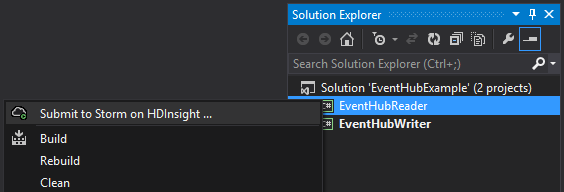

<properties
   pageTitle="Processar eventos com Hubs de evento com tempestade em HDInsight | Microsoft Azure"
   description="Saiba como processar dados de evento Hubs com uma topologia de c# tempestade criada no Visual Studio usando as ferramentas de HDInsight para Visual Studio."
   services="hdinsight,notification hubs"
   documentationCenter=""
   authors="Blackmist"
   manager="jhubbard"
   editor="cgronlun"/>

<tags
   ms.service="hdinsight"
   ms.devlang="dotnet"
   ms.topic="article"
   ms.tgt_pltfrm="na"
   ms.workload="big-data"
   ms.date="10/27/2016"
   ms.author="larryfr"/>

# Eventos de processo do Azure Hubs de evento com tempestade em HDInsight (c#)

Azure Hubs de evento permite que você processe grandes quantidades de dados de sites, aplicativos e dispositivos. O spout Hubs de evento torna fácil de usar Apache tempestade em HDInsight para analisar dados em tempo real. Você também pode gravar dados em Hubs de evento de tempestade usando o raio Hubs de evento.

Neste tutorial, você aprenderá como usar os modelos do Visual Studio instalados com ferramentas de HDInsight para Visual Studio para criar duas topologias que funcionam com Hubs de evento do Azure.

* **EventHubWriter**: aleatoriamente gera dados e grava-Hubs de evento

* **EventHubReader**: lê os dados do evento Hubs e registra os dados para os logs de tempestade

> [AZURE.NOTE] Enquanto as etapas neste documento confiam em um ambiente de desenvolvimento do Windows com o Visual Studio, o projeto compilado pode ser enviado para um Linux ou baseado no Windows HDInsight cluster. Somente clusters baseados em Linux criado após o suporte de 28/10/2016 SCP.NET topologias.
>
> Para usar uma topologia c# com um cluster baseado no Linux, você deve atualizar o pacote de Microsoft.SCP.Net.SDK NuGet usado pelo seu projeto para a versão 0.10.0.6 ou superior. A versão do pacote também deve corresponder a versão principal de tempestade instalado em HDInsight. Por exemplo, tempestade em versões de HDInsight 3.3 e 3.4 usar a versão de tempestade 0.10.x, enquanto HDInsight 3.5 usa tempestade 1.0. x.
> 
> C# topologias em clusters baseados em Linux devem usar 4,5 .NET e usar Mono para executar no cluster HDInsight. A maioria do conteúdo funcionará, no entanto, você deve verificar o documento de [Compatibilidade Mono](http://www.mono-project.com/docs/about-mono/compatibility/) para incompatibilidades.
>
> Para obter uma versão de Java deste projeto, que também funcionará em um cluster baseado em Linux ou baseado no Windows, consulte [eventos de processo do Azure Hubs de evento com tempestade em HDInsight (Java)](hdinsight-storm-develop-java-event-hub-topology.md).

## Pré-requisitos

* Uma [Tempestade Apache em HDInsight cluster](hdinsight-apache-storm-tutorial-get-started.md)

* Um [Hub de evento Azure](../event-hubs/event-hubs-csharp-ephcs-getstarted.md)

* O [SDK do Azure .NET](http://azure.microsoft.com/downloads/)

* As [Ferramentas de HDInsight para Visual Studio](hdinsight-hadoop-visual-studio-tools-get-started.md)

## Projeto concluído

Você pode baixar uma versão completa do projeto criado neste tutorial do GitHub: [eventhub-tempestade-híbrido](https://github.com/Azure-Samples/hdinsight-dotnet-java-storm-eventhub). No entanto, você ainda precisa fornecer configurações seguindo as etapas deste tutorial.

## Brilhante e spout de Hubs de evento

Os Hubs de evento spout e bolt são componentes Java que permitem trabalhar facilmente com Hubs de evento do Apache tempestade. Embora esses componentes são escritos em Java, as ferramentas de HDInsight para Visual Studio permitem que você crie topologias híbridas que misturar c# e componentes Java.

O spout e raio são distribuídos como um único Java (. jar) arquivo denominado **eventhubs-storm-spout-#.#-jar-with-dependencies.jar**, onde #. # é a versão do arquivo.

### Baixar o arquivo. jar

A versão mais recente do arquivo jar está incluída no projeto [HDInsight tempestade exemplos](https://github.com/hdinsight/hdinsight-storm-examples) na pasta **biblioteca/eventhubs** . Para baixar o arquivo, use um dos seguintes métodos.

> [AZURE.NOTE] A spout e raio foram enviadas para inclusão no projeto tempestade Apache. Para obter mais informações, consulte [tempestade 583: inicial check-in para hubs de tempestade evento](https://github.com/apache/storm/pull/336/files) no GitHub.

* **Baixar um arquivo ZIP**: [exemplos de tempestade HDInsight](https://github.com/hdinsight/hdinsight-storm-examples) no site, selecione **Baixar ZIP** no painel direito para baixar um arquivo. zip que contém o projeto.

    

    Após o download do arquivo, é possível extrair o arquivo e o arquivo será no diretório de **biblioteca** .

* **Clonar o projeto**: se você tiver [gito](http://git-scm.com/) instalado, use o seguinte comando para clonar o repositório localmente, em seguida, localize o arquivo no diretório de **biblioteca** .

        git clone https://github.com/hdinsight/hdinsight-storm-examples

## Configurar Hubs de evento

Hubs de evento é a fonte de dados para esse exemplo. Use as informações na seção __criar um Hub de evento__ do documento [começar com Hubs de evento](../event-hubs/event-hubs-csharp-ephcs-getstarted.md) .

3. Após o hub de evento tiver sido criado, exiba a lâmina EventHub no Portal do Azure e selecione __acesso compartilhado políticas__. Use a entrada __+ Adicionar__ para adicionar as seguintes políticas:

  	| Nome | Permissões |
  	| ----- | ----- |
  	| Gravador | Enviar |
  	| leitor | Ouvir |

    

5. Selecione as políticas de __leitor__ e __Gravador__ . Copie e salve o valor de __Chave primária__ para ambas as políticas, como esses serão usados mais tarde.

## Configurar o EventHubWriter

1. Se você já não instalou a versão mais recente das ferramentas de HDInsight para Visual Studio, consulte [Introdução ao uso de ferramentas de HDInsight para Visual Studio](hdinsight-hadoop-visual-studio-tools-get-started.md).

2. Baixe a solução do [eventhub-tempestade-híbrido](https://github.com/Azure-Samples/hdinsight-dotnet-java-storm-eventhub). Abra a solução e levar alguns minutos para examinar o código para o projeto __EventHubWriter__ .

4. No projeto __EventHubWriter__ , abra o arquivo __App__ . Use as informações do Hub evento configurado anteriormente para preencher o valor para as chaves a seguir:

  	| Chave | Valor |
  	| ----- | ----- |
  	| EventHubPolicyName | gravador (se você usou um nome diferente para a política com permissão _Enviar_ , usá-lo em vez disso.) |
  	| EventHubPolicyKey | A chave para a política de gravador |
  	| EventHubNamespace | O namespace que contém o seu Hub de evento |
  	| EventHubName | Nome do seu Hub de evento |
  	| EventHubPartitionCount | O número de partições no seu Hub de evento |

4. Salve e feche o arquivo **App** .

## Configurar o EventHubReader

1. Abra o projeto __EventHubReader__ e levar alguns momoents para examinar o código.

2. Abra o __App__ para o __EventHubWriter__. Use as informações do Hub evento configurado anteriormente para preencher o valor para as chaves a seguir:

  	| Chave | Valor |
  	| ----- | ----- |
  	| EventHubPolicyName | leitor (se você usou um nome diferente para a política com permissão de _ouvir_ , usá-lo em vez disso.) |
  	| EventHubPolicyKey | A chave para a política de leitor |
  	| EventHubNamespace | O namespace que contém o seu Hub de evento |
  	| EventHubName | Nome do seu Hub de evento |
  	| EventHubPartitionCount | O número de partições no seu Hub de evento |

3. Salve e feche o arquivo **App** .

## Implantar as topologias

1. No **Solution Explorer**, clique com botão direito no projeto **EventHubReader** e selecione **Enviar para tempestade em HDInsight**.

    

2. Na tela de **Topologia de enviar** , selecione o seu **Cluster tempestade**. Expanda **Configurações adicionais**, selecione **Java caminhos de arquivo**, selecione **…** e selecione a pasta que contém o arquivo **eventhubs-storm-spout-0.9-jar-with-dependencies.jar** que você baixou anteriormente. Por fim, clique em **Enviar**.

    

3. Quando a topologia foi enviada, o **Visualizador de topologias tempestade** aparecerá. Selecione a topologia de **EventHubReader** no painel esquerdo para exibir estatísticas para a topologia. Atualmente, nada deve estar acontecendo porque não há eventos foram gravados Hubs de evento ainda.

    

4. No **Solution Explorer**, clique com botão direito no projeto **EventHubWriter** e selecione **Enviar para tempestade em HDInsight**.

2. Na tela de **Topologia de enviar** , selecione o seu **Cluster tempestade**. Expanda **Configurações adicionais**, selecione **Java caminhos de arquivo**, selecione **…** e selecione a pasta que contém o arquivo **eventhubs-storm-spout-0.9-jar-with-dependencies.jar** que você baixou anteriormente. Por fim, clique em **Enviar**.

5. Quando a topologia tiver sido enviada, atualize a lista de topologia no **Visualizador de topologias tempestade** para verificar se ambas as topologias estão funcionando no cluster.

6. No **Visualizador de topologias tempestade**, selecione a topologia de **EventHubReader** .

4. No modo de exibição de gráfico, clique duas vezes o componente __LogBolt__ . Isso abrirá a página de __Resumo de componente__ para o raio.

3. Na seção __executores__ , selecione um dos links na coluna __porta__ . Isso exibirá informações registradas pelo componente. As informações registradas são semelhantes ao seguinte:

        2016-10-20 13:26:44.186 m.s.s.b.ScpNetBolt [INFO] Processing tuple: source: com.microsoft.eventhubs.spout.EventHubSpout:7, stream: default, id: {5769732396213255808=520853934697489134}, [{"deviceId":3,"deviceValue":1379915540}]
        2016-10-20 13:26:44.234 m.s.s.b.ScpNetBolt [INFO] Processing tuple: source: com.microsoft.eventhubs.spout.EventHubSpout:7, stream: default, id: {7154038361491319965=4543766486572976404}, [{"deviceId":3,"deviceValue":459399321}]
        2016-10-20 13:26:44.335 m.s.s.b.ScpNetBolt [INFO] Processing tuple: source: com.microsoft.eventhubs.spout.EventHubSpout:6, stream: default, id: {513308780877039680=-7571211415704099042}, [{"deviceId":5,"deviceValue":845561159}]
        2016-10-20 13:26:44.445 m.s.s.b.ScpNetBolt [INFO] Processing tuple: source: com.microsoft.eventhubs.spout.EventHubSpout:7, stream: default, id: {-2409895457033895206=5479027861202203517}, [{"deviceId":8,"deviceValue":2105860655}]

## Interromper as topologias

Para interromper as topologias, selecione cada topologia no **Visualizador de topologia de tempestade**, clique em **Finalizar**.

## Excluir seu cluster

[AZURE.INCLUDE [delete-cluster-warning](../../includes/hdinsight-delete-cluster-warning.md)]

## Anotações

### Ponto de verificação

O EventHubSpout pontos de verificação do seu estado para o nó Zookeeper, que salva o deslocamento atual para mensagens ler periodicamente da fila. Isso permite que o componente começar a receber mensagens no deslocamento de salvos nas seguintes situações:

* Instância do componente falha e é reiniciado.

* Você aumente ou diminua o cluster adicionando ou removendo nós.

* A topologia é encerrada e reiniciado **com o mesmo nome**.

Você também pode exportar e importar os pontos de verificação persistentes para WASB (o armazenamento do Azure usado pelo seu cluster HDInsight.) Os scripts para fazer isso estão localizados na tempestade em cluster de HDInsight, em **c:\apps\dist\storm-0.9.3.2.2.1.0-2340\zkdatatool-1.0\bin**.

>[AZURE.NOTE] O número de versão no caminho pode ser diferente, como a versão do tempestade instalado no cluster pode mudar no futuro.

Os scripts nesse diretório são:

* **stormmeta_import.cmd**: importar todos os metadados de tempestade do contêiner de armazenamento de cluster padrão para Zookeeper.

* **stormmeta_export.cmd**: exportar todos os metadados de tempestade de Zookeeper ao contêiner de armazenamento de cluster padrão.

* **stormmeta_delete.cmd**: excluir todos os metadados de tempestade de Zookeeper.

Exportar que uma importação permite manter dados de ponto de verificação quando você precisa excluir o cluster, mas deseja continuar o processamento do deslocamento atual no hub quando você antecipa um novo cluster online novamente.

> [AZURE.NOTE] Como os dados são mantidos ao contêiner de armazenamento de padrão, o cluster novo **deve** usar a mesma conta de armazenamento e o contêiner como cluster anterior.

## Próximas etapas

Neste documento, você aprendeu a usar o Java evento Hubs Spout e raio de uma topologia c# para trabalhar com dados no Hub de evento do Azure. Para saber mais sobre a criação de c# topologias, consulte o seguinte.

* [Desenvolva c# topologias para Apache tempestade em HDInsight usando o Visual Studio](hdinsight-storm-develop-csharp-visual-studio-topology.md)

* [Guia de programação do SCP](hdinsight-storm-scp-programming-guide.md)

* [Topologias de exemplo para tempestade em HDInsight](hdinsight-storm-example-topology.md)
 
