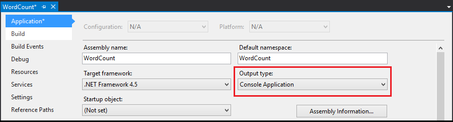

<properties
   pageTitle="Topologias Apache tempestade com Visual Studio e c# | Microsoft Azure"
   description="Aprenda a criar topologias de tempestade em c#, criando uma topologia de contagem do word simples no Visual Studio usando as ferramentas de HDInsight para Visual Studio."
   services="hdinsight"
   documentationCenter=""
   authors="Blackmist"
   manager="jhubbard"
   editor="cgronlun"
   tags="azure-portal"/>

<tags
   ms.service="hdinsight"
   ms.devlang="java"
   ms.topic="article"
   ms.tgt_pltfrm="na"
   ms.workload="big-data"
   ms.date="10/27/2016"
   ms.author="larryfr"/>

# Desenvolva c# topologias para Apache tempestade em HDInsight usando ferramentas de Hadoop para Visual Studio

Aprenda a criar uma topologia de c# tempestade usando as ferramentas de HDInsight para Visual Studio. Este tutorial orienta no processo de criação de um novo projeto de tempestade no Visual Studio, testá-lo localmente e implantá-lo em uma tempestade Apache em cluster HDInsight.

Você também aprenderá a criar topologias híbridas que usam c# e componentes Java.

> [AZURE.IMPORTANT] Enquanto as etapas neste documento confiam em um ambiente de desenvolvimento do Windows com o Visual Studio, o projeto compilado pode ser enviado para um Linux ou baseado no Windows HDInsight cluster. Somente clusters baseados em Linux criado após o suporte de 28/10/2016 SCP.NET topologias.
>
> Para usar uma topologia c# com um cluster baseado no Linux, você deve atualizar o pacote de Microsoft.SCP.Net.SDK NuGet usado pelo seu projeto para a versão 0.10.0.6 ou superior. A versão do pacote também deve corresponder a versão principal de tempestade instalado em HDInsight. Por exemplo, tempestade em versões de HDInsight 3.3 e 3.4 usar a versão de tempestade 0.10.x, enquanto HDInsight 3.5 usa tempestade 1.0. x.
> 
> C# topologias em clusters baseados em Linux devem usar 4,5 .NET e usar Mono para executar no cluster HDInsight. A maioria do conteúdo funcionará, no entanto, você deve verificar o documento de [Compatibilidade Mono](http://www.mono-project.com/docs/about-mono/compatibility/) para incompatibilidades.

## Pré-requisitos

- Uma das seguintes versões do Visual Studio

    - O Visual Studio 2012 com [atualização 4](http://www.microsoft.com/download/details.aspx?id=39305)

    - Visual Studio de 2013 com [atualização 4](http://www.microsoft.com/download/details.aspx?id=44921) ou [Comunidade de 2013 do Visual Studio](http://go.microsoft.com/fwlink/?LinkId=517284)

    - Visual Studio 2015 ou [Comunidade de 2015 do Visual Studio](https://go.microsoft.com/fwlink/?LinkId=532606)

- Azure SDK 2.9.5 ou posterior

- Ferramentas de HDInsight para Visual Studio: consulte [Introdução ao uso de ferramentas de HDInsight para Visual Studio](hdinsight-hadoop-visual-studio-tools-get-started.md) para instalar e configurar as ferramentas de HDInsight para Visual Studio.

    > [AZURE.NOTE] Ferramentas de HDInsight para Visual Studio não têm suporte no Visual Studio Express

-   Apache tempestade em cluster HDInsight: consulte o [guia de Introdução do Apache tempestade em HDInsight](hdinsight-apache-storm-tutorial-get-started.md) para obter as etapas para criar um cluster.

## Modelos

As ferramentas de HDInsight para Visual Studio fornecem os seguintes modelos:

| Tipo de projeto | Demonstra |
| ------------ | ------------- |
| Aplicativo de tempestade | Um projeto de topologia de tempestade vazio |
| Amostra de gravador do SQL Azure tempestade | Como escrever o banco de dados do Azure SQL |
| Exemplo de DocumentDB leitor de tempestade | Como ler de DocumentDB do Azure |
| Exemplo de DocumentDB gravador de tempestade | Como escrever em DocumentDB do Azure |
| Exemplo de EventHub leitor de tempestade | Como ler de Hubs de evento do Azure |
| Exemplo de EventHub gravador de tempestade | Como escrever em Hubs de evento do Azure |
| Exemplo de HBase leitor de tempestade | Como ler de HBase em clusters de HDInsight |
| Exemplo de HBase gravador de tempestade | Como escrever em HBase em clusters de HDInsight |
| Exemplo de híbrido de tempestade | Como usar um componente Java |
| Amostra de tempestade | Uma topologia de contagem do word básica |

> [AZURE.NOTE] Os exemplos de leitor e gravador de HBase usam a API REST HBase para se comunicar com um HBase em cluster HDInsight, não a API de Java HBase.

As etapas neste documento, você usará o tipo de projeto de aplicativo de tempestade básico para criar uma nova topologia.

## Criar uma topologia c#

1. Se você já não instalou a versão mais recente das ferramentas de HDInsight para Visual Studio, consulte [Introdução ao uso de ferramentas de HDInsight para Visual Studio](hdinsight-hadoop-visual-studio-tools-get-started.md).

2. Abra o Visual Studio, selecione **arquivo** > **novo**e, em seguida, **projeto**.

3. Na tela do **Novo projeto** , expanda **instalados** > **modelos**e selecione **HDInsight**. Na lista de modelos, selecione o **Aplicativo de tempestade**. Na parte inferior da tela, digite **WordCount** como o nome do aplicativo.

    

4. Depois que o projeto tiver sido criado, você deve ter os seguintes arquivos:

    - **Program.cs**: define a topologia do seu projeto. Observe que uma topologia padrão que consiste em um spout e um raio é criada por padrão.

    - **Spout.cs**: uma spout de exemplo que emite números aleatórios.

    - **Bolt.cs**: um raio de exemplo que mantém uma contagem de números emitidas pela spout.

    Como parte da criação do projeto, [SCP.NET pacotes](https://www.nuget.org/packages/Microsoft.SCP.Net.SDK/) mais recentes serão baixadas do NuGet.

    [AZURE.INCLUDE [scp.net version important](../../includes/hdinsight-storm-scpdotnet-version.md)]

As próximas seções, você irá modificar este projeto em um aplicativo de WordCount básico.

### Implementar o spout

1. Abra **Spout.cs**. Spouts são usados para ler dados em uma topologia de uma fonte externa. Os componentes principais para um spout são:

    - **NextTuple**: chamado pelo tempestade quando o spout é permitido para emitir tuplas novo.

    - **ACK** (somente topologia transações): manipula confirmações iniciadas por outros componentes na topologia de tuplas enviadas a partir deste spout. Confirmar uma tupla informa o spout que ele foi processado com êxito pelos componentes downstream.

    - **Falhar** (somente topologia transações): manipula tuplas que são falhas processamento de outros componentes da topologia. Isso fornece a oportunidade de emitir novamente a tupla para que possa ser processada novamente.

2. Substitua o conteúdo da classe **Spout** com o seguinte. Isso cria uma spout que aleatoriamente emite uma frase na topologia.

        private Context ctx;
        private Random r = new Random();
        string[] sentences = new string[] {
            "the cow jumped over the moon",
            "an apple a day keeps the doctor away",
            "four score and seven years ago",
            "snow white and the seven dwarfs",
            "i am at two with nature"
        };

        public Spout(Context ctx)
        {
            // Set the instance context
            this.ctx = ctx;

            Context.Logger.Info("Generator constructor called");

            // Declare Output schema
            Dictionary<string, List<Type>> outputSchema = new Dictionary<string, List<Type>>();
            // The schema for the default output stream is
            // a tuple that contains a string field
            outputSchema.Add("default", new List<Type>() { typeof(string) });
            this.ctx.DeclareComponentSchema(new ComponentStreamSchema(null, outputSchema));
        }

        // Get an instance of the spout
        public static Spout Get(Context ctx, Dictionary<string, Object> parms)
        {
            return new Spout(ctx);
        }

        public void NextTuple(Dictionary<string, Object> parms)
        {
            Context.Logger.Info("NextTuple enter");
            // The sentence to be emitted
            string sentence;

            // Get a random sentence
            sentence = sentences[r.Next(0, sentences.Length - 1)];
            Context.Logger.Info("Emit: {0}", sentence);
            // Emit it
            this.ctx.Emit(new Values(sentence));

            Context.Logger.Info("NextTuple exit");
        }

        public void Ack(long seqId, Dictionary<string, Object> parms)
        {
            // Only used for transactional topologies
        }

        public void Fail(long seqId, Dictionary<string, Object> parms)
        {
            // Only used for transactional topologies
        }
    
    Reserve um momento para ler os comentários para entender o que significa esse código.

### Implementar os práticos

1. Exclua o arquivo **Bolt.cs** existente do projeto.

2. No **Solution Explorer**, clique com botão direito do projeto e selecione **Adicionar** > **novo item**. Na lista, selecione **Tempestade raio**e digite **Splitter.cs** como o nome. Repita esse procedimento para criar uma segunda bolt nomeado **Counter.cs**.

    - **Splitter.cs**: implementa uma brilhante que divide sentenças em palavras individuais e emite um novo fluxo de palavras.

    - **Counter.cs**: implementa uma brilhante que conta cada palavra e emite um novo fluxo de palavras e a contagem de cada palavra.

    > [AZURE.NOTE] Esses parafusos simplesmente ler e gravem fluxos, mas você também pode usar uma brilhante para se comunicar com fontes, como um banco de dados ou um serviço.

3. Abra **Splitter.cs**. Observe que tem apenas um método por padrão: **Executar**. Isso é chamado quando o raio recebe uma tupla para processamento. Aqui, você pode ler tuplas entradas de processo e emitir saídas tuplas.

4. Substitua o conteúdo da classe **divisor** com o seguinte código:

        private Context ctx;

        // Constructor
        public Splitter(Context ctx)
        {
            Context.Logger.Info("Splitter constructor called");
            this.ctx = ctx;

            // Declare Input and Output schemas
            Dictionary<string, List<Type>> inputSchema = new Dictionary<string, List<Type>>();
            // Input contains a tuple with a string field (the sentence)
            inputSchema.Add("default", new List<Type>() { typeof(string) });
            Dictionary<string, List<Type>> outputSchema = new Dictionary<string, List<Type>>();
            // Outbound contains a tuple with a string field (the word)
            outputSchema.Add("default", new List<Type>() { typeof(string) });
            this.ctx.DeclareComponentSchema(new ComponentStreamSchema(inputSchema, outputSchema));
        }

        // Get a new instance of the bolt
        public static Splitter Get(Context ctx, Dictionary<string, Object> parms)
        {
            return new Splitter(ctx);
        }

        // Called when a new tuple is available
        public void Execute(SCPTuple tuple)
        {
            Context.Logger.Info("Execute enter");

            // Get the sentence from the tuple
            string sentence = tuple.GetString(0);
            // Split at space characters
            foreach (string word in sentence.Split(' '))
            {
                Context.Logger.Info("Emit: {0}", word);
                //Emit each word
                this.ctx.Emit(new Values(word));
            }

            Context.Logger.Info("Execute exit");
        }

    Reserve um momento para ler os comentários para entender o que significa esse código.

5. Abra **Counter.cs** e substitua o conteúdo de classe com o seguinte:

        private Context ctx;

        // Dictionary for holding words and counts
        private Dictionary<string, int> counts = new Dictionary<string, int>();

        // Constructor
        public Counter(Context ctx)
        {
            Context.Logger.Info("Counter constructor called");
            // Set instance context
            this.ctx = ctx;

            // Declare Input and Output schemas
            Dictionary<string, List<Type>> inputSchema = new Dictionary<string, List<Type>>();
            // A tuple containing a string field - the word
            inputSchema.Add("default", new List<Type>() { typeof(string) });

            Dictionary<string, List<Type>> outputSchema = new Dictionary<string, List<Type>>();
            // A tuple containing a string and integer field - the word and the word count
            outputSchema.Add("default", new List<Type>() { typeof(string), typeof(int) });
            this.ctx.DeclareComponentSchema(new ComponentStreamSchema(inputSchema, outputSchema));
        }

        // Get a new instance
        public static Counter Get(Context ctx, Dictionary<string, Object> parms)
        {
            return new Counter(ctx);
        }

        // Called when a new tuple is available
        public void Execute(SCPTuple tuple)
        {
            Context.Logger.Info("Execute enter");

            // Get the word from the tuple
            string word = tuple.GetString(0);
            // Do we already have an entry for the word in the dictionary?
            // If no, create one with a count of 0
            int count = counts.ContainsKey(word) ? counts[word] : 0;
            // Increment the count
            count++;
            // Update the count in the dictionary
            counts[word] = count;

            Context.Logger.Info("Emit: {0}, count: {1}", word, count);
            // Emit the word and count information
            this.ctx.Emit(Constants.DEFAULT_STREAM_ID, new List<SCPTuple> { tuple }, new Values(word, count));
            Context.Logger.Info("Execute exit");
        }

    Reserve um momento para ler os comentários para entender o que significa esse código.

### Definir a topologia

Spouts e parafusos são organizados em um gráfico, que define como os dados fluem entre componentes. Essa topologia, o gráfico é da seguinte maneira:

As frases são emitidas pelos spout, que são distribuídos para instâncias do raio divisor. O raio divisor divide as frases em palavras, o que são distribuídas para o raio contador.

Porque a contagem de palavras é mantida localmente na ocorrência do contador, queremos certificar-se de que palavras específicas fluem para a mesma instância de raio contador, portanto, temos apenas uma instância mantendo o controle de uma palavra específica. Mas para raio divisor, realmente não importa qual raio recebe quais sentença, simplesmente queremos carregar saldo sentenças entre as instâncias.

Abra **Program.cs**. O método importante é **GetTopologyBuilder**, que é usado para definir a topologia que será enviada para tempestade. Substitua o conteúdo de **GetTopologyBuilder** com o seguinte código para implementar a topologia descrita anteriormente:

        // Create a new topology named 'WordCount'
        TopologyBuilder topologyBuilder = new TopologyBuilder("WordCount" + DateTime.Now.ToString("yyyyMMddHHmmss"));

        // Add the spout to the topology.
        // Name the component 'sentences'
        // Name the field that is emitted as 'sentence'
        topologyBuilder.SetSpout(
            "sentences",
            Spout.Get,
            new Dictionary<string, List<string>>()
            {
                {Constants.DEFAULT_STREAM_ID, new List<string>(){"sentence"}}
            },
            1);
        // Add the splitter bolt to the topology.
        // Name the component 'splitter'
        // Name the field that is emitted 'word'
        // Use suffleGrouping to distribute incoming tuples
        //   from the 'sentences' spout across instances
        //   of the splitter
        topologyBuilder.SetBolt(
            "splitter",
            Splitter.Get,
            new Dictionary<string, List<string>>()
            {
                {Constants.DEFAULT_STREAM_ID, new List<string>(){"word"}}
            },
            1).shuffleGrouping("sentences");

        // Add the counter bolt to the topology.
        // Name the component 'counter'
        // Name the fields that are emitted 'word' and 'count'
        // Use fieldsGrouping to ensure that tuples are routed
        //   to counter instances based on the contents of field
        //   position 0 (the word). This could also have been
        //   List<string>(){"word"}.
        //   This ensures that the word 'jumped', for example, will always
        //   go to the same instance
        topologyBuilder.SetBolt(
            "counter",
            Counter.Get,
            new Dictionary<string, List<string>>()
            {
                {Constants.DEFAULT_STREAM_ID, new List<string>(){"word", "count"}}
            },
            1).fieldsGrouping("splitter", new List<int>() { 0 });

        // Add topology config
        topologyBuilder.SetTopologyConfig(new Dictionary<string, string>()
        {
            {"topology.kryo.register","[\"[B\"]"}
        });

        return topologyBuilder;

Reserve um momento para ler os comentários para entender o que significa esse código.

## Enviar a topologia

1. No **Solution Explorer**, clique com botão direito do projeto e selecione **Enviar para tempestade em HDInsight**.

    > [AZURE.NOTE] Se solicitado, digite as credenciais de logon para sua assinatura do Azure. Se você tiver mais de uma assinatura, faça logon naquele que contém sua tempestade em cluster HDInsight.

2. Selecione seu tempestade em cluster HDInsight na lista suspensa de **Tempestade Cluster** e, em seguida, selecione **Enviar**. Você pode monitorar se o envio for bem-sucedida, usando a janela de **saída** .

3. Quando a topologia foi enviada com êxito, as **Topologias de tempestade** para o cluster deverá aparecer. Selecione a topologia de **WordCount** na lista para exibir informações sobre a topologia em execução.

    > [AZURE.NOTE] Você também pode exibir **Tempestade topologias** do **Server Explorer**: expandir **Azure** > **HDInsight**, uma tempestade em cluster HDInsight de atalho e selecione **Topologias de tempestade de modo de exibição**.

    Use os links para os spouts ou parafusos para exibir informações sobre esses componentes. Uma nova janela será aberta para cada item selecionado.

4. Do modo de exibição **Resumo da topologia** , clique em **Finalizar** para interromper a topologia.

    > [AZURE.NOTE] Topologias de tempestade continuam a executar até que elas estão desativadas ou cluster é excluído.

## Topologia de transações

A topologia anterior não é transacional. Os componentes dentro da topologia não implementar nenhuma funcionalidade para reproduzir as mensagens se o processamento falhar por um componente da topologia. Para um exemplo de topologia transações, crie um novo projeto e selecione **Tempestade amostra** como o tipo de projeto.

Transações topologias implementam o seguinte para oferecer suporte a repetição de dados:

- **Cache de metadados**: O spout deve armazenar metadados sobre os dados emitidos para que os dados possam ser recuperados e emitidos novamente se ocorrer uma falha. Como os dados emitidos pela amostra são pequenos, os dados não processados para cada tupla estão armazenados em um dicionário para reprodução.

- **ACK**: cada raio da topologia pode chamar `this.ctx.Ack(tuple)` para ack que ele tenha êxito processadas uma tupla. Quando todos os parafusos tem controladas tupla, o `Ack` método do spout é invocado. Isso permite que o spout remover dados armazenados em cache para reprodução porque os dados completamente foi processados.

- **Falha**: cada raio pode chamar `this.ctx.Fail(tuple)` para indicar que o processamento falhou para uma tupla. A falha propagada para o `Fail` método spout, onde a tupla pode ser repetida usando o cache de metadados.

- **ID da sequência**: ao emitir uma tupla, uma ID de sequência pode ser especificada. Isso deve ser um valor que identifica a tupla para processamento de repetição (Ack e falhas). Por exemplo, o spout do projeto de **Amostra de tempestade** usa a seguinte ao emitir dados:

        this.ctx.Emit(Constants.DEFAULT_STREAM_ID, new Values(sentence), lastSeqId);

    Isso emite uma nova tupla que contém uma frase para o fluxo padrão, com o valor de ID de sequência contido no **lastSeqId**. Neste exemplo, **lastSeqId** simplesmente é incrementado para cada tupla emitida.

Como demonstrou do projeto de **Amostra de tempestade** , se um componente é transações pode ser definidas em tempo de execução, com base na configuração.

## Topologia híbrida

Ferramentas de HDInsight para Visual Studio também podem ser usadas para criar topologias híbridas, onde alguns componentes são c# e outros são Java.

Para um exemplo de topologia de implantação híbrida, crie um novo projeto e selecione **Tempestade híbrido amostra**. Isso cria uma amostra totalmente comentário que contém várias topologias que demonstram o seguinte:

- **Spout Java** e **c# raio**: definido em **HybridTopology_javaSpout_csharpBolt**

    - Uma versão transações é definida em **HybridTopologyTx_javaSpout_csharpBolt**

- **Raio Java**e **c# spout** : definido em **HybridTopology_csharpSpout_javaBolt**

    - Uma versão transações é definida em **HybridTopologyTx_csharpSpout_javaBolt**

        > [AZURE.NOTE] Esta versão também demonstra como usar o código de Clojure de um arquivo de texto como um componente Java.

Para alternar entre a topologia que é usada quando o projeto é enviado, basta mover o `[Active(true)]` instrução para a topologia que você deseja usar antes de enviá-lo ao cluster.

> [AZURE.NOTE] Todos os arquivos de Java necessários são fornecidos como parte deste projeto na pasta **JavaDependency** .

Considere o seguinte ao criar e enviar uma topologia híbrida:

- **JavaComponentConstructor** deve ser usado para criar uma nova instância da classe Java para uma spout ou raio.

- **microsoft.scp.storm.multilang.CustomizedInteropJSONSerializer** deve ser usada para serializar dados em para ou tirando componentes Java de objetos Java JSON.

- Ao enviar a topologia no servidor, você deve usar a opção **configurações adicionais** para especificar os **caminhos de arquivo Java**. O caminho especificado deve ser o diretório que contém os arquivos JAR que contêm suas classes Java.

### Hubs de evento Azure

A versão de SCP.Net 0.9.4.203 introduz uma nova classe e método especificamente para trabalhar com o evento Hub Spout (uma spout de Java que lê de evento Hub.) Ao criar uma topologia que usa esta spout, use os seguintes métodos:

- Classe **EventHubSpoutConfig** : cria um objeto que contém a configuração para o componente spout

- Método de **TopologyBuilder.SetEventHubSpout** : adiciona o componente Spout do evento Hub à topologia

> [AZURE.NOTE] Enquanto esses facilitam a trabalhar com o evento Hub Spout que outros componentes Java, você ainda deve usar o CustomizedInteropJSONSerializer serializar dados produzidos pela spout.

## Usando ConfigurationManager

Não use ConfigurationManager para recuperar valores de configuração de raio e spout componentes; Isso levará a uma exceção de ponteiro nulo. Em vez disso, a configuração do seu projeto é passada para a topologia de tempestade como um par de chave/valor no contexto de topologia. Cada componente que depende de valores de configuração deve recuperá-los do contexto durante a inicialização.

O código a seguir demonstra como recuperar esses valores:

    public class MyComponent : ISCPBolt
    {
        // To hold configuration information loaded from context
        Configuration configuration;
        ...
        public MyComponent(Context ctx, Dictionary<string, Object> parms)
        {
            // Save a copy of the context for this component instance
            this.ctx = ctx;
            // If it exists, load the configuration for the component
            if(parms.ContainsKey(Constants.USER_CONFIG))
            {
                this.configuration = parms[Constants.USER_CONFIG] as System.Configuration.Configuration;
            }
            // Retrieve the value of "Foo" from configuration
            var foo = this.configuration.AppSettings.Settings["Foo"].Value;
        }
        ...
    }

Se você usar um `Get` método para retornar uma instância do seu componente, você deve certificar-se de que ele passa ambos os `Context` e `Dictionary<string, Object>` parâmetros do construtor. O exemplo a seguir é um basic `Get` método corretamente passa esses valores:

    public static MyComponent Get(Context ctx, Dictionary<string, Object> parms)
    {
        return new MyComponent(ctx, parms);
    }

## Como atualizar SCP.NET

Versões recentes do SCP.NET oferece suporte a atualização de pacote pelo NuGet. Quando uma nova atualização estiver disponível, você receberá uma notificação de atualização. Para verificar manualmente uma atualização, execute estas etapas:

1. No **Solution Explorer**, clique com botão direito do projeto e selecione **Gerenciar pacotes do NuGet**.

2. No Gerenciador de pacote, selecione **atualizações**. Se uma atualização estiver disponível, ele será listado. Clique no botão de **atualização** para o pacote para instalá-lo.

> [AZURE.IMPORTANT] Se seu projeto foi criado com uma das versões anteriores do SCP.NET que não usou NuGet atualizações de pacote, você deve executar as seguintes etapas para atualizar para a nova versão:
>
> 1. No **Solution Explorer**, clique com botão direito do projeto e selecione **Gerenciar pacotes do NuGet**.
> 2. Usando o campo de **pesquisa** , procurar e, em seguida, adicionar, **Microsoft.SCP.Net.SDK** ao projeto.

## Solução de problemas

### Exceções de ponteiro nulo

Ao usar uma topologia c# com um cluster baseado no Linux HDInsight, incluir e spout componentes que usam ConfigurationManager ler configurações em tempo de execução podem retornar exceções de ponteiro nulo. Isso acontece porque a configuração do domínio carregado não é do conjunto que contém o seu projeto.

A configuração do seu projeto é passada para a topologia de tempestade como um par de chave/valor no contexto de topologia e pode ser recuperada do objeto de dicionário que é passado para os seus componentes quando eles são inicializados.

O exemplo a seguir demonstra carregando os valores de configuração do contexto topologia, consulte a seção de [ConfigurationManager](#configurationmanager) deste documento.

### System.TypeLoadException

Ao usar uma topologia c# com um cluster baseado no Linux HDInsight, você pode encontrar o erro a seguir:

    System.TypeLoadException: Failure has occurred while loading a type.

Isso geralmente ocorre quando você estiver usando um binário que não é compatível com a versão do .NET que suporta mono.

Para clusters baseados em Linux HDInsight, você deverá garantir que o projeto usa binários compilados para .NET 4,5.

### Testar uma topologia localmente

Embora seja fácil implantar uma topologia em um cluster, em alguns casos, você talvez precise testar uma topologia localmente. Use as etapas a seguir para executar e testar a topologia de exemplo neste tutorial localmente em seu ambiente de desenvolvimento.

> [AZURE.WARNING] Teste local funciona somente para, c# somente topologias básicas. Você não deve usar testes local de topologias híbridas ou topologias que usam vários fluxos, conforme você receberá erros.

1. No **Solution Explorer**, clique com botão direito do projeto e selecione **Propriedades**. Nas propriedades do projeto, altere o **tipo de saída** para o **Aplicativo de Console**.

    

    > [AZURE.NOTE] Lembre-se alterar o **tipo de saída** volte a **Biblioteca de classe** antes de implantar a topologia para um cluster.

2. No **Solution Explorer**, clique com botão direito do projeto e selecione **Adicionar** > **Novo Item**. Selecione **classe** e digite **LocalTest.cs** como o nome da classe. Por fim, clique em **Adicionar**.

3. Abra **LocalTest.cs** e adicione a seguinte instrução **usando** na parte superior:

        using Microsoft.SCP;

4. Use o seguinte como o conteúdo da classe **LocalTest** :

        // Drives the topology components
        public void RunTestCase()
        {
            // An empty dictionary for use when creating components
            Dictionary<string, Object> emptyDictionary = new Dictionary<string, object>();

            #region Test the spout
            {
                Console.WriteLine("Starting spout");
                // LocalContext is a local-mode context that can be used to initialize
                // components in the development environment.
                LocalContext spoutCtx = LocalContext.Get();
                // Get a new instance of the spout, using the local context
                Spout sentences = Spout.Get(spoutCtx, emptyDictionary);

                // Emit 10 tuples
                for (int i = 0; i < 10; i++)
                {
                    sentences.NextTuple(emptyDictionary);
                }
                // Use LocalContext to persist the data stream to file
                spoutCtx.WriteMsgQueueToFile("sentences.txt");
                Console.WriteLine("Spout finished");
            }
            #endregion

            #region Test the splitter bolt
            {
                Console.WriteLine("Starting splitter bolt");
                // LocalContext is a local-mode context that can be used to initialize
                // components in the development environment.
                LocalContext splitterCtx = LocalContext.Get();
                // Get a new instance of the bolt
                Splitter splitter = Splitter.Get(splitterCtx, emptyDictionary);

                // Set the data stream to the data created by the spout
                splitterCtx.ReadFromFileToMsgQueue("sentences.txt");
                // Get a batch of tuples from the stream
                List<SCPTuple> batch = splitterCtx.RecvFromMsgQueue();
                // Process each tuple in the batch
                foreach (SCPTuple tuple in batch)
                {
                    splitter.Execute(tuple);
                }
                // Use LocalContext to persist the data stream to file
                splitterCtx.WriteMsgQueueToFile("splitter.txt");
                Console.WriteLine("Splitter bolt finished");
            }
            #endregion

            #region Test the counter bolt
            {
                Console.WriteLine("Starting counter bolt");
                // LocalContext is a local-mode context that can be used to initialize
                // components in the development environment.
                LocalContext counterCtx = LocalContext.Get();
                // Get a new instance of the bolt
                Counter counter = Counter.Get(counterCtx, emptyDictionary);

                // Set the data stream to the data created by splitter bolt
                counterCtx.ReadFromFileToMsgQueue("splitter.txt");
                // Get a batch of tuples from the stream
                List<SCPTuple> batch = counterCtx.RecvFromMsgQueue();
                // Process each tuple in the batch
                foreach (SCPTuple tuple in batch)
                {
                    counter.Execute(tuple);
                }
                // Use LocalContext to persist the data stream to file
                counterCtx.WriteMsgQueueToFile("counter.txt");
                Console.WriteLine("Counter bolt finished");
            }
            #endregion
        }

    Reserve um tempo para ler os comentários de código. Este código usa **LocalContext** para executar os componentes no ambiente de desenvolvimento, e ele persiste o fluxo de dados entre os componentes para arquivos de texto na unidade local.

5. Abra **Program.cs** e adicione o seguinte para o método **principal** :

        Console.WriteLine("Starting tests");
        System.Environment.SetEnvironmentVariable("microsoft.scp.logPrefix", "WordCount-LocalTest");
        // Initialize the runtime
        SCPRuntime.Initialize();

        //If we are not running under the local context, throw an error
        if (Context.pluginType != SCPPluginType.SCP_NET_LOCAL)
        {
            throw new Exception(string.Format("unexpected pluginType: {0}", Context.pluginType));
        }
        // Create test instance
        LocalTest tests = new LocalTest();
        // Run tests
        tests.RunTestCase();
        Console.WriteLine("Tests finished");
        Console.ReadKey();

6. Salvar as alterações, clique **F5** ou selecione **Depurar** > **Iniciar depuração** para iniciar o projeto. Uma janela do console deve aparecer e registrar status como o andamento de testes. Quando **que terminar de testes** for exibida, pressione qualquer tecla para fechar a janela.

7. Use o **Windows Explorer** para localizar a pasta que contém o seu projeto, por exemplo, **C:\Users\<your_user_name > \Documents\Visual Studio 2013\Projects\WordCount\WordCount**. Nesse diretório, abra **Bin**e clique em **Depurar**. Você deve ver os arquivos de texto que foram produzidos quando os testes executou: sentences.txt, counter.txt e splitter.txt. Abrir cada arquivo de texto e inspecionar os dados.

    > [AZURE.NOTE] Dados de cadeia de caracteres são mantidos como uma matriz de valores decimais nesses arquivos. Por exemplo, \[[97,103,111]] o **splitter.txt** arquivo é a palavra 'e'.

Embora testes uma palavra básica contar aplicativo localmente é bastante simples, que o valor real vem quando você tem uma topologia complexa que se comunica com fontes de dados externos ou executa a análise de dados complexos. Quando você estiver trabalhando em tal um projeto, você talvez precise definir pontos de interrupção e percorrer o código em seus componentes para isolar problemas.

> [AZURE.NOTE] Certifique-se de definir o **tipo de projeto** volte a **Biblioteca de classe** antes de implantar para uma tempestade em cluster HDInsight.

### Informações de log

Você pode facilmente registrar informações de seus componentes de topologia usando `Context.Logger`. Por exemplo, o seguinte criará uma entrada de log informativas:

    Context.Logger.Info("Component started");

Informações registradas podem ser exibidas no **Log de serviço do Hadoop**, que está localizado no **Server Explorer**. Expanda a entrada para seu tempestade em cluster de HDInsight, em seguida, expanda **Log de serviço do Hadoop**. Finalmente, selecione o arquivo de log para exibir.

> [AZURE.NOTE] Os logs são armazenados na conta de armazenamento do Azure que é usada pelo seu cluster. Se esta for uma assinatura diferente daquela que você estiver conectado com o Visual Studio, você precisa fazer logon na assinatura que contém a conta de armazenamento para exibir essas informações.

### Exibir informações de erro

Para exibir erros ocorridos em uma topologia em execução, use as seguintes etapas:

1. No **Server Explorer**, clique com botão direito a tempestade em cluster HDInsight e selecione **topologias tempestade de modo de exibição**.

2. Para o **Spout** e **Bolts**, a coluna de **Último erro** terá informações sobre o último erro que ocorreu.

3. Selecione a **Id de Spout** ou **Id do raio** para o componente que tem um erro listado. Na página Detalhes do que é exibida, informações adicionais sobre erros será listado na seção **erros** na parte inferior da página.

4. Para obter mais informações, selecione uma **porta** da seção **executores** da página para ver o log de trabalhador tempestade últimos minutos.

## Próximas etapas

Agora que você aprendeu a desenvolver e implantar topologias de tempestade ferramentas HDInsight do Visual Studio, saiba como [eventos de processo do Hub de evento do Azure com tempestade em HDInsight](hdinsight-storm-develop-csharp-event-hub-topology.md).

Para obter um exemplo de uma topologia c# que divide os dados de fluxo em vários fluxos, consulte [exemplo de c# tempestade](https://github.com/Blackmist/csharp-storm-example).

Para descobrir mais informações sobre como criar c# topologias, visite [SCP.NET GettingStarted.md](https://github.com/hdinsight/hdinsight-storm-examples/blob/master/SCPNet-GettingStarted.md).

Para mais maneiras de trabalhar com HDInsight e tempestade mais amostras de HDinsight, consulte o seguinte:

**Microsoft SCP.NET**

* [Guia de programação do SCP](hdinsight-storm-scp-programming-guide.md)

**Apache tempestade em HDInsight**

- [Implantar e monitorar topologias com Apache tempestade em HDInsight](hdinsight-storm-deploy-monitor-topology.md)

- [Topologias de exemplo para tempestade em HDInsight](hdinsight-storm-example-topology.md)

**Apache Hadoop em HDInsight**

- [Use a seção com Hadoop em HDInsight](hdinsight-use-hive.md)

- [Usar porco com Hadoop em HDInsight](hdinsight-use-pig.md)

- [Usar MapReduce com Hadoop em HDInsight](hdinsight-use-mapreduce.md)

**Apache HBase em HDInsight**

- [Introdução ao HBase em HDInsight](hdinsight-hbase-tutorial-get-started.md)
