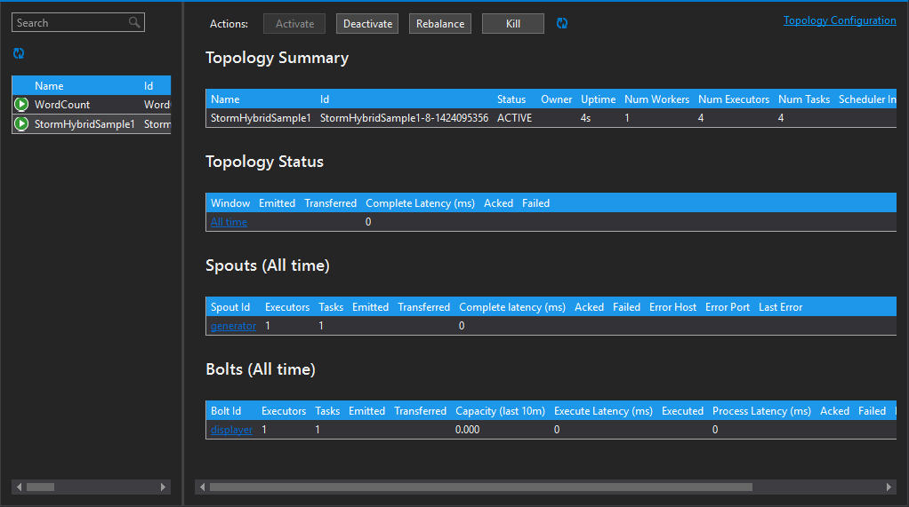

<properties
    pageTitle="Introdução ao Apache tempestade em HDInsight | Microsoft Azure"
    description="Obtenha uma introdução ao Apache tempestade e saiba como você pode usar tempestade em HDInsight para criar soluções de análise de dados em tempo real na nuvem."
    services="hdinsight"
    documentationCenter=""
    authors="Blackmist"
    manager="jhubbard"
    editor="cgronlun"
    tags="azure-portal"/>

<tags
   ms.service="hdinsight"
   ms.devlang="na"
   ms.topic="get-started-article"
   ms.tgt_pltfrm="na"
   ms.workload="big-data"
   ms.date="10/11/2016"
   ms.author="larryfr"/>

#Introdução ao Apache tempestade em HDInsight: análise em tempo real para Hadoop

Apache tempestade em HDInsight permite que você criar soluções de análise distribuídos, em tempo real no ambiente do Azure usando [Apache Hadoop](http://hadoop.apache.org).

##O que é Apache tempestade?

Tempestade Apache é um sistema de computação distribuído, tolerância, código-fonte aberto que permite que você processe dados em tempo real com Hadoop. Soluções de tempestade também podem fornecer garantia de processamento de dados, com a capacidade de repetição de dados que não foi processados com êxito na primeira vez.

##Por que usar tempestade em HDInsight?

Apache tempestade em HDInsight é um cluster gerenciado integrado ao ambiente do Azure. Ele fornece os seguintes benefícios principais:

* Executa como um serviço gerenciado com um SLA de 99,9% o tempo

* Usar o idioma de sua escolha: oferece suporte para os componentes de tempestade escritos em **Java**, **c#**e **Python**

    * Suporta uma mistura de linguagens de programação: ler dados usando Java, em seguida, processar usando C#
    
        > [AZURE.NOTE] C# topologias só há suporte em clusters de HDInsight baseados no Windows.

    * Usar a interface de Java **Trident** para criar topologias de tempestade que suportam "após exatamente" processamento de mensagens, persistência de armazenamento de dados "transação" e um conjunto de operações comuns de análise de fluxo

* Inclui os recursos internos de escala-up e down de escala: Dimensionar um cluster de HDInsight sem afetar a execução topologias de tempestade

* Integrar com outros serviços do Azure, incluindo o Hub de evento, rede Virtual do Azure, banco de dados SQL, armazenamento de Blob e DocumentDB

    * Combinar os recursos de vários clusters HDInsight usando rede Virtual do Azure: criar canais analíticos que usam clusters HDInsight, HBase ou Hadoop

Para uma lista de empresas que estão usando Apache tempestade suas soluções de análise em tempo real, consulte [Empresas usando Apache tempestade](https://storm.apache.org/documentation/Powered-By.html).

Para começar a usar tempestade, consulte [Introdução ao tempestade em HDInsight][gettingstarted].

###Facilidade de provisionamento

Você pode provisionar uma novo tempestade em cluster HDInsight em minutos. Especifique o nome do cluster, tamanho, conta de administrador e a conta de armazenamento. Azure criará o cluster, incluindo topologias de exemplo e um painel de gerenciamento da web.

> [AZURE.NOTE] Você também pode provisionar clusters tempestade usando o [Azure CLI](../xplat-cli-install.md) ou [Azure PowerShell](../powershell-install-configure.md).

Dentro de 15 minutos de enviar a solicitação, você terá um novo cluster de tempestade em execução e pronto para seu primeiro pipeline de análise em tempo real.

###Facilidade de uso

__Baseado em Linux para tempestade em clusters de HDInsight__, você pode se conectar ao cluster usando SSH e use o `storm` comando para iniciar e gerenciar topologias. Além disso, você pode usar Ambari para monitorar o serviço de tempestade e a interface de usuário de tempestade para monitorar e gerenciar topologias em execução.

Para obter mais informações sobre como trabalhar com clusters baseados em Linux tempestade, consulte [Introdução ao Apache tempestade em HDInsight baseado em Linux](hdinsight-apache-storm-tutorial-get-started-linux.md).

__Baseado no Windows para tempestade em clusters de HDInsight__, as ferramentas de HDInsight para Visual Studio permitem que você crie c# e híbridos c# / topologias Java e enviá-los à sua tempestade em cluster HDInsight.  

Ferramentas de HDInsight para Visual Studio também fornece uma interface que permite monitorar e gerenciar topologias de tempestade em um cluster.

Para obter um exemplo de como usar as ferramentas de HDInsight para criar um aplicativo de tempestade, consulte [desenvolver c# tempestade topologias com as ferramentas de HDInsight para Visual Studio](hdinsight-storm-develop-csharp-visual-studio-topology.md).

Para obter mais informações sobre as ferramentas de HDInsight para Visual Studio, consulte [começar a usar as ferramentas de HDInsight para Visual Studio](../HDInsight/hdinsight-hadoop-visual-studio-tools-get-started.md).

Cada tempestade em cluster HDInsight também fornece um painel de tempestade baseada na web que permite que você enviar, monitorar e gerenciar topologias tempestade executado no cluster.

Para obter mais informações sobre como usar o painel de tempestade, consulte [implantar e gerenciar topologias Apache tempestade em HDInsight](hdinsight-storm-deploy-monitor-topology.md).

Tempestade em HDInsight também fornece fácil integração com Hubs de evento do Azure por meio do **Evento Hub Spout**. A versão mais recente deste componente está disponível em [https://github.com/hdinsight/hdinsight-storm-examples/tree/master/lib/eventhubs](https://github.com/hdinsight/hdinsight-storm-examples/tree/master/lib/eventhubs). Para obter mais informações sobre como usar este componente, consulte os seguintes documentos.

* [Desenvolver uma topologia c# que usa Hubs de evento do Azure](hdinsight-storm-develop-csharp-event-hub-topology.md)

* [Desenvolver uma topologia de Java que usa Hubs de evento do Azure](hdinsight-storm-develop-java-event-hub-topology.md)

###Confiabilidade

Apache tempestade sempre garante que cada mensagem de entrada será totalmente processada, mesmo quando a análise de dados estiver distribuída ao longo de centenas de nós.

O **nó Nimbus** fornece funcionalidade similar ao JobTracker Hadoop e ele atribui tarefas a outros nós no cluster por meio de **Zookeeper**. Nós zookeeper fornecem coordenação para cluster e facilitam a comunicação entre Nimbus e o processo de **Supervisor** em nós trabalhador. Se um nó de processamento falhar, o nó Nimbus é informado e atribui a tarefa e os dados associados para outro nó.

A configuração padrão para Apache tempestade é ter apenas um nó Nimbus. Tempestade em HDInsight executa dois nós Nimbus. Se o nó primário falhar, cluster HDInsight alternará para o nó secundário, enquanto o nó primário é recuperado.

###Escala

Embora você possa especificar o número de nós no seu cluster durante a criação, talvez você queira aumente ou diminua o cluster para corresponder a carga de trabalho. Todos os clusters HDInsight permitem que você altere o número de nós no cluster, mesmo quando o processamento de dados.

> [AZURE.NOTE] Para tirar proveito dos novos nós adicionados por meio de escala, você precisará rebalancear topologias iniciadas antes do tamanho de cluster foi aumentado.

###Suporte

Tempestade em HDInsight vem com o suporte de 24/7 total no nível de empresa. Tempestade em HDInsight também tem um SLA de 99,9%. Isso significa que podemos garantir que o cluster terá conectividade externa pelo menos 99,9% das vezes.

##Casos comuns de uso para análise em tempo real

A seguir estão alguns cenários comuns para a qual você pode usar tempestade Apache em HDInsight. Para obter informações sobre cenários reais, leia [como empresas estão usando tempestade](https://storm.apache.org/documentation/Powered-By.html).

* Internet das coisas (IoT)
* Detecção de fraude
* Análise de social
* Extrair, transformar, carga (ETL)
* Monitoramento de rede
* Pesquisa
* Contrato móvel

##Como os dados de HDInsight tempestade são processados?

Apache tempestade executa **topologias** em vez de trabalhos MapReduce que talvez você esteja familiarizado com em HDInsight ou Hadoop. Uma tempestade em cluster HDInsight contém dois tipos de nós: nós que executam nós **Nimbus** e trabalhador que executam o **Supervisor**de cabeçalho.

* **Nimbus**: semelhante ao JobTracker no Hadoop, é responsável por distribuir código todo o cluster, atribuindo tarefas para máquinas virtuais e monitoramento falha. HDInsight fornece dois nós Nimbus, portanto, não há nenhum ponto de falha para tempestade em HDInsight

* **Supervisor**: O supervisor para cada nó trabalhador é responsável por iniciar e parar **processos de trabalho** no nó.

* **Processo de trabalho**: executa um subconjunto de uma **topologia**. Uma topologia em execução é distribuída em vários processos de trabalho em todo o cluster.

* **Topologia**: define um gráfico de computação que processa **fluxos** de dados. Ao contrário de trabalhos MapReduce, topologias executados até você interrompê-los.

* **Fluxo**: um conjunto de desacoplado de **tuplas**. Fluxos são produzidos por **spouts** e **bolts**, e eles são consumidos pela **bolts**.

* **Tupla**: uma lista nomeada de valores dinamicamente digitados.

* **Spout**: consome dados de uma fonte de dados e emite um ou mais **fluxos**.

    > [AZURE.NOTE] Em muitos casos, os dados são lidos uma fila, como Kafka, filas de barramento de serviço do Azure ou hubs de evento. Fila garante que os dados são mantidos se houver uma interrupção.

* **Raio**: consome **fluxos**, executa o processamento em **tuplas**e talvez emita **fluxos**. Parafusos também são responsáveis para gravar dados em armazenamento externo, como uma fila, HDInsight, HBase, um blob ou outro armazenamento de dados.

* **Apache e mais Próspero banco**: uma estrutura de software para o desenvolvimento de scalable serviço entre idiomas. Ele permite que você crie serviços que funcionem entre C++, Java, Python, PHP, Ruby, Erlang, Perl, Haskell, c#, Cocoa, JavaScript, Node, Smalltalk e outros idiomas.

    * **Nimbus** é um serviço e mais Próspero banco e uma **topologia** é uma definição e mais Próspero banco, portanto, é possível desenvolver topologias usando uma variedade de linguagens de programação.

Para obter mais informações sobre componentes de tempestade, consulte o [tutorial de tempestade] [ apachetutorial] em apache.org.

##Quais idiomas de programação pode usar?

O tempestade em cluster HDInsight fornece suporte para c#, Java e Python.

### C & #35;

As ferramentas de HDInsight para Visual Studio permitem que os desenvolvedores de .NET para projetar e implementar uma topologia em c#. Você também pode criar topologias híbridas que usam componentes Java e c#.

Para obter mais informações, consulte [desenvolver c# topologias para Apache tempestade em HDInsight usando o Visual Studio](hdinsight-storm-develop-csharp-visual-studio-topology.md).

###Java

A maioria dos exemplos de Java que encontrar será Java simples ou Trident. Trident é uma abstração de alto nível que torna mais fácil fazer coisas como junções, agregações, agrupamento, filtragem e. No entanto, Trident atua em lotes de tuplas, enquanto uma solução Java bruta processa uma tupla de um fluxo de cada vez.

Para obter mais informações sobre Trident, consulte o [tutorial Trident](https://storm.apache.org/documentation/Trident-tutorial.html) em apache.org.

Para obter exemplos de topologias Java e Trident, consulte a [lista de topologias de tempestade de exemplo](hdinsight-storm-example-topology.md) ou os exemplos de tempestade starter no cluster HDInsight.

Os exemplos de tempestade starter estão localizados no diretório __/usr/hdp/current/storm-client/contrib/storm-starter__ em clusters baseados em Linux e o diretório de **%storm_home%\contrib\storm-starter** em clusters baseados no Windows.

##Quais são alguns padrões de desenvolvimento comuns?

###Processamento de mensagem de garantia

Tempestade pode fornecer diferentes níveis de processamento de mensagem de garantia. Por exemplo, um aplicativo de tempestade básico pode garantir processamento de ao menos uma e Trident pode garantir exatamente-processamento de uma vez.

Para obter mais informações, consulte [as garantias de processamento de dados](https://storm.apache.org/about/guarantees-data-processing.html) em apache.org.

###IBasicBolt

O padrão de uma tupla de entrada, emitir zero ou mais tuplas e, em seguida, acking a entrada tupla imediatamente no final do método execute de leitura é muito comum e tempestade fornece a interface de [IBasicBolt](https://storm.apache.org/apidocs/backtype/storm/topology/IBasicBolt.html) para automatizar esse padrão.

###Junções

Ingressando em dois fluxos de dados varia entre aplicativos. Por exemplo, você pode ingressar em cada tupla de vários fluxos em um novo fluxo ou você pode ingressar somente lotes de tuplas para uma janela específica. De qualquer forma, ingressando em pode ser feito usando o [fieldsGrouping](http://javadox.com/org.apache.storm/storm-core/0.9.1-incubating/backtype/storm/topology/InputDeclarer.html#fieldsGrouping%28java.lang.String,%20backtype.storm.tuple.Fields%29), que é uma maneira de definir como tuplas são roteadas para parafusos.

No exemplo a seguir Java, fieldsGrouping é usado para rotear tuplas originárias componentes "1", "2" e "3" para o raio **MyJoiner** .

    builder.setBolt("join", new MyJoiner(), parallelism) .fieldsGrouping("1", new Fields("joinfield1", "joinfield2")) .fieldsGrouping("2", new Fields("joinfield1", "joinfield2")) .fieldsGrouping("3", new Fields("joinfield1", "joinfield2"));

###Processamento em lotes

Processamento em lotes pode ser feito várias maneiras. Com uma topologia de tempestade Java básica, você pode usar contador simple para o número de lote X de tuplas antes de emiti-las ou usar um mecanismo de relógio interno conhecido como uma "tupla de escala" emitir um lote de cada X segundos.

Para obter um exemplo do uso de tuplas de escala, consulte [Analisando dados de sensor com tempestade e HBase em HDInsight](hdinsight-storm-sensor-data-analysis.md).

Se você estiver usando o Trident, ele se baseia em lotes de tuplas de processamento.

###Armazenamento em cache

Cache de memória é geralmente usado como um mecanismo para acelerar o processamento porque ele mantém frequentemente usado ativos na memória. Porque uma topologia é distribuída em vários nós e vários processos dentro de cada nó, você deve considerar usando [fieldsGrouping](http://javadox.com/org.apache.storm/storm-core/0.9.1-incubating/backtype/storm/topology/InputDeclarer.html#fieldsGrouping%28java.lang.String,%20backtype.storm.tuple.Fields%29) para garantir que tuplas contendo os campos que são usados para pesquisa de cache sempre são roteadas para o mesmo processo. Isso evita duplicação de entradas de cache entre processos.

###Streaming primeiras N

Quando sua topologia depende calcular um valor de "N principais", como as tendências de 5 superiores no Twitter, você deve calcular o valor de N principais em paralelo e, em seguida, mesclar a saída desses cálculos em um valor global. Isso pode ser feito usando [fieldsGrouping](http://javadox.com/org.apache.storm/storm-core/0.9.1-incubating/backtype/storm/topology/InputDeclarer.html#fieldsGrouping%28java.lang.String,%20backtype.storm.tuple.Fields%29) rota pelo campo para os práticos paralelos (que partições os dados pelo valor de campo) e, em seguida, rota para uma brilhante que globalmente determina o valor de N principais.

Para obter um exemplo disso, consulte o exemplo [RollingTopWords](https://github.com/nathanmarz/storm-starter/blob/master/src/jvm/storm/starter/RollingTopWords.java) .

##Que tipo de registro em log tempestade usar?

Tempestade usa Apache Log4j para informações de log. Por padrão, uma grande quantidade de dados está conectada e pode ser difícil de classificar as informações. Você pode incluir um arquivo de configuração de log como parte de sua topologia de tempestade para o comportamento do log de controle.

Para obter uma topologia de exemplo que demonstra como configurar o registro em log, consulte exemplo de [WordCount baseado em Java](hdinsight-storm-develop-java-topology.md) para tempestade em HDInsight.

##Próximas etapas

Saiba mais sobre soluções de análise em tempo real com tempestade Apache no HDInsight:

* [Introdução ao tempestade em HDInsight][gettingstarted]

* [Topologias de exemplo para tempestade em HDInsight](hdinsight-storm-example-topology.md)

[stormtrident]: https://storm.apache.org/documentation/Trident-API-Overview.html
[samoa]: http://yahooeng.tumblr.com/post/65453012905/introducing-samoa-an-open-source-platform-for-mining
[apachetutorial]: https://storm.apache.org/documentation/Tutorial.html
[gettingstarted]: hdinsight-apache-storm-tutorial-get-started-linux.md
