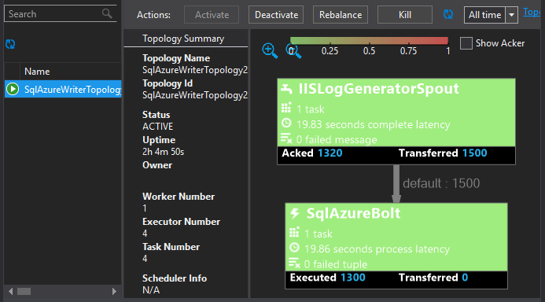
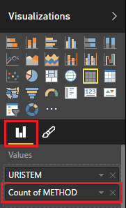
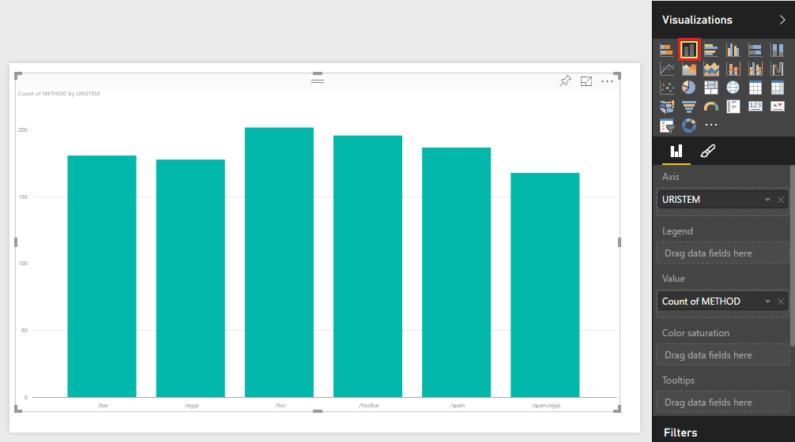

<properties
 pageTitle="Use Apache tempestade com o Power BI | Microsoft Azure"
 description="Crie um relatório do Power BI usando dados de uma topologia c# em execução em um cluster de tempestade Apache no HDInsight."
 services="hdinsight"
 documentationCenter=""
 authors="Blackmist"
 manager="jhubbard"
 editor="cgronlun"
    tags="azure-portal"/>

<tags
 ms.service="hdinsight"
 ms.devlang="dotnet"
 ms.topic="article"
 ms.tgt_pltfrm="na"
 ms.workload="big-data"
 ms.date="10/27/2016"
 ms.author="larryfr"/>

# Usar o Power BI para visualizar dados de uma topologia Apache tempestade

Power BI permite exibir dados visualmente como relatórios. Usando modelos do Visual Studio para tempestade em HDInsight, você pode facilmente usar armazene os dados de uma topologia deparando em uma tempestade Apache em cluster HDInsight com SQL Azure e, em seguida, visualize os dados usando o Power BI.

Neste documento, você aprenderá como usar o Power BI para criar um relatório de dados gerados por uma topologia de tempestade Apache e armazenados no Azure SQL Database.

> [AZURE.NOTE] Enquanto as etapas neste documento confiam em um ambiente de desenvolvimento do Windows com o Visual Studio, o projeto compilado pode ser enviado para um Linux ou baseado no Windows HDInsight cluster. Somente clusters baseados em Linux criado após o suporte de 28/10/2016 SCP.NET topologias.
>
> Para usar uma topologia c# com um cluster baseado no Linux, você deve atualizar o pacote de Microsoft.SCP.Net.SDK NuGet usado pelo seu projeto para a versão 0.10.0.6 ou superior. A versão do pacote também deve corresponder a versão principal de tempestade instalado em HDInsight. Por exemplo, tempestade em versões de HDInsight 3.3 e 3.4 usar a versão de tempestade 0.10.x, enquanto HDInsight 3.5 usa tempestade 1.0. x.
> 
> C# topologias em clusters baseados em Linux devem usar 4,5 .NET e usar Mono para executar no cluster HDInsight. A maioria do conteúdo funcionará, no entanto, você deve verificar o documento de [Compatibilidade Mono](http://www.mono-project.com/docs/about-mono/compatibility/) para incompatibilidades.
>
> Para obter uma versão de Java deste projeto, que também funcionará em um cluster baseado em Linux ou baseado no Windows, consulte [eventos de processo do Azure Hubs de evento com tempestade em HDInsight (Java)](hdinsight-storm-develop-java-event-hub-topology.md).

## Pré-requisitos

- Uma assinatura do Azure. Consulte [avaliação gratuita do Azure obter](https://azure.microsoft.com/documentation/videos/get-azure-free-trial-for-testing-hadoop-in-hdinsight/).

* Um usuário do Active Directory do Azure com acesso de [Power BI](https://powerbi.com)

* Visual Studio (um dos seguintes versões)

    * Visual Studio 2012 com [atualização 4](http://www.microsoft.com/download/details.aspx?id=39305)

    * Visual Studio de 2013 com [atualização 4](http://www.microsoft.com/download/details.aspx?id=44921) ou [Comunidade de 2013 do Visual Studio](http://go.microsoft.com/fwlink/?linkid=517284&clcid=0x409)

    * [Visual Studio de 2015](https://www.visualstudio.com/downloads/download-visual-studio-vs.aspx)

* As ferramentas de HDInsight para Visual Studio: consulte [começar a usar as ferramentas de HDInsight para Visual Studio](../HDInsight/hdinsight-hadoop-visual-studio-tools-get-started.md) para obter informações sobre instalação.

## Como ele funciona

Este exemplo contém uma topologia de c# tempestade que gera aleatoriamente dados de log de serviços de informações da Internet (IIS). Estes dados gravados em um banco de dados do SQL e a partir daí, ele é usado para gerar relatórios do Power BI.

A seguir está uma lista dos arquivos que implementar a funcionalidade principal deste exemplo.

* **SqlAzureBolt.cs**: grava informações produzidas na topologia tempestade banco de dados SQL.

* **IISLogsTable.sql**: instruções do Transact-SQL usadas para gerar o banco de dados que os dados são armazenados em.

> [AZURE.WARNING] Você deve criar a tabela no banco de dados do SQL antes de iniciar a topologia no cluster HDInsight.

## Baixe o exemplo

Baixe o [exemplo de HDInsight c# tempestade Power BI](https://github.com/Azure-Samples/hdinsight-dotnet-storm-powerbi). Para baixá-lo, ou bifurcação/clonar usando [gito](http://git-scm.com/)ou use o link de **Download** para baixar um. zip do arquivo.

## Criar um banco de dados

1. Use as etapas no documento [tutorial de banco de dados SQL](../sql-database/sql-database-get-started.md) para criar um novo banco de dados do SQL.

2. Conectar ao banco de dados seguindo as etapas no documento [conectar a um banco de dados do SQL com o Visual Studio](../sql-database/sql-database-connect-query.md) para se conectar ao banco de dados.

4. Clique com o botão direito no banco de dados no Pesquisador de objetos e crie uma __Nova consulta__. Colar o conteúdo do arquivo __IISLogsTable.sql__ incluído no projeto baixado para a janela de consulta e, em seguida, use Ctrl + Shift + E para executar a consulta. Você deve receber uma mensagem que os comandos concluída com êxito.

    Após a conclusão, haverá uma nova tabela denominada __IISLOGS__ no banco de dados.

## Configurar o exemplo

1. No [portal do Azure](https://portal.azure.com), selecione seu banco de dados do SQL. Na seção __Essentials__ da lâmina banco de dados SQL, selecione __Mostrar cadeias de caracteres de conexão de banco de dados__. Na lista que aparece, copie as informações de __ADO.NET (autenticação de SQL)__ .

1. Abra o exemplo no Visual Studio. Na **Solution Explorer**, abra o arquivo **App** e, em seguida, localize a seguinte entrada:

        <add key="SqlAzureConnectionString" value="##TOBEFILLED##" />
    
    Substitua o valor __TOBEFILLED # # # #__ com a cadeia de conexão de banco de dados copiada na etapa anterior. Substituir __{sua\_username}__ e __{sua\_senha}__ com o nome de usuário e senha do banco de dados.

2. Salve e feche os arquivos.

## Implantar a amostra

1. No **Solution Explorer**, clique com botão direito no projeto **StormToSQL** e selecione **Enviar para tempestade em HDInsight**. Selecione a caixa de diálogo do menu suspenso de **Tempestade Cluster** cluster HDInsight.

    > [AZURE.NOTE] Pode levar alguns segundos para a lista suspensa de **Tempestade Cluster** para preencher com nomes de servidor.
    >
    > Se solicitado, digite as credenciais de logon para sua assinatura do Azure. Se você tiver mais de uma assinatura, faça logon naquele que contém sua tempestade em cluster HDInsight.

2. Quando a topologia foi enviada com êxito, as topologias tempestade para o cluster deverá aparecer. Selecione a entrada SqlAzureWriterTopology na lista para exibir informações sobre a topologia em execução.

    

    Você pode usar este modo de exibição para ver informações sobre a topologia, ou clique duas vezes nas entradas (como SqlAzureBolt) para ver informações específicas de um componente da topologia.

3. Depois que a topologia tiver executado por alguns minutos, volte para a janela de consulta SQL usada para criar o banco de dados. Substitua as declarações existentes com o seguinte.

        select * from iislogs;
    
    Usar Ctrl + Shift + E para executar a consulta e você deve receber resultados semelhantes à seguinte.
    
        1   2016-05-27 17:57:14.797 255.255.255.255 /bar    GET 200
        2   2016-05-27 17:57:14.843 127.0.0.1   /spam/eggs  POST    500
        3   2016-05-27 17:57:14.850 123.123.123.123 /eggs   DELETE  200
        4   2016-05-27 17:57:14.853 127.0.0.1   /foo    POST    404
        5   2016-05-27 17:57:14.853 10.9.8.7    /bar    GET 200
        6   2016-05-27 17:57:14.857 192.168.1.1 /spam   DELETE  200

    Isso é dado foi escrito da topologia tempestade.

## Criar um relatório

1. Conecte-se ao [conector de banco de dados do SQL Azure](https://app.powerbi.com/getdata/bigdata/azure-sql-database-with-live-connect) para o Power BI.

2. Em __bancos de dados__, selecione __obter__.

3. Selecione __o banco de dados do Azure SQL__e, em seguida, selecione __Conectar__.

4. Insira as informações para se conectar ao seu banco de dados do SQL Azure. Você pode encontrar esse visitar o [portal do Azure](https://portal.azure.com) e selecionando o banco de dados do SQL.

    > [AZURE.NOTE] Você também pode definir o intervalo de atualização e filtros personalizados usando __Habilitar opções avançadas__ na caixa de diálogo Conectar.

5. Depois que você conectou, você verá um novo conjunto de dados com o mesmo nome do banco de dados que você conectado. Selecione o conjunto de dados para começar a criar um relatório.

3. De __campos__, expanda a entrada __IISLOGS__ . Selecione a caixa de seleção para __URISTEM__. Isso criará um novo relatório que lista o origina-se URI (/ foo, / barras, etc) registrado no banco de dados.

    

5. Em seguida, arraste o __método__ para o relatório. O relatório será atualizado para listar os origina-se e o método HTTP correspondente usada para a solicitação HTTP.

    

4. Na coluna __visualizações__ , selecione o ícone de __campos__ e selecione a seta para baixo ao lado do __método__ na seção __valores__ . Na lista exibida, selecione __contagem__. Isso alterará o relatório para listar uma contagem de quantas vezes um URI específico foi acessado.

    

6. Em seguida, selecione o __gráfico de colunas empilhadas__ para alterar como as informações são exibidas.

    

7. Depois que você tiver o relatório como desejar, use a entrada __Salvar__ no menu para inserir um nome e salve o relatório.

## Parar a topologia

A topologia continuará a ser executado até você interrompê-lo ou excluir o tempestade em cluster HDInsight. Execute as seguintes etapas para interromper a topologia.

1. No Visual Studio, retorne para o Visualizador de topologia e selecione a topologia.

2. Selecione o botão **Finalizar** para interromper a topologia.

    

## Excluir seu cluster

[AZURE.INCLUDE [delete-cluster-warning](../../includes/hdinsight-delete-cluster-warning.md)]

## Próximas etapas

Neste documento, você aprendeu como enviar dados de uma topologia de tempestade banco de dados SQL e, em seguida, visualize os dados usando o Power BI. Para obter informações sobre como trabalhar com outras tecnologias Azure usando tempestade em HDInsight, consulte o seguinte:

* [Topologias de exemplo para tempestade em HDInsight](hdinsight-storm-example-topology.md)
