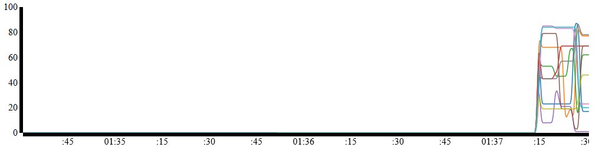
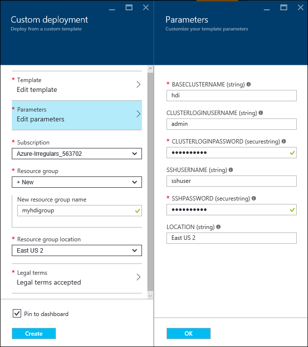

<properties
   pageTitle="Analisar dados de sensor com tempestade Apache e HBase | Microsoft Azure"
   description="Saiba como se conectar ao Apache tempestade com uma rede virtual. Use tempestade com HBase a processo dados de um hub de evento e visualize-o com D3.js."
   services="hdinsight"
   documentationCenter=""
   authors="Blackmist"
   manager="jhubbard"
   editor="cgronlun"/>

<tags
   ms.service="hdinsight"
   ms.devlang="java"
   ms.topic="article"
   ms.tgt_pltfrm="na"
   ms.workload="big-data"
   ms.date="09/20/2016"
   ms.author="larryfr"/>

# Analisar dados de sensor com tempestade Apache, Hub de evento e HBase em HDInsight (Hadoop) 

Saiba como usar Apache tempestade em HDInsight a dados processo do Hub de evento do Azure, armazená-la em Apache HBase em HDInsight e visualize-la usando D3.js executado como um aplicativo Web do Azure.

O modelo do Gerenciador de recursos do Azure usado neste documento demonstra como criar vários recursos Azure em um grupo de recursos. Especificamente, ela cria uma rede Virtual do Azure, dois clusters HDInsight (tempestade e HBase) e um aplicativo Web do Azure. Uma implementação Node de um painel da web em tempo real é implantada automaticamente para o aplicativo web.

> [AZURE.NOTE] As informações neste documento, e o exemplo fornecido, foram testadas usando baseados em Linux HDInsight 3.3 e 3,4 versões de cluster.

## Pré-requisitos

* Uma assinatura do Azure. Consulte [avaliação gratuita do Azure obter](http://azure.microsoft.com/documentation/videos/get-azure-free-trial-for-testing-hadoop-in-hdinsight/).

    > [AZURE.IMPORTANT] Não é necessário um cluster existente do HDInsight; as etapas neste documento criará os seguintes recursos:
    >
    > * Uma rede Virtual Azure
    > * Uma tempestade em cluster HDInsight (baseado em Linux, 2 nós de trabalho)
    > * Um HBase em cluster HDInsight (baseado em Linux, 2 nós de trabalho)
    > * Aplicativo Web do Azure que hospeda painel da web

* [Node](http://nodejs.org/): isso é usado para visualizar o painel web localmente em seu ambiente de desenvolvimento.

* [Java e o 1.7 JDK](http://www.oracle.com/technetwork/java/javase/downloads/index.html): usado para desenvolver a topologia de tempestade.

* [Maven](http://maven.apache.org/what-is-maven.html): usado para criar e compilar o projeto.

* [Gito](http://git-scm.com/): usados para baixar o projeto do GitHub.

* Um cliente __SSH__ : usado para conexão com os clusters HDInsight baseados em Linux. Para obter mais informações sobre como usar SSH com HDInsight, consulte os seguintes documentos.

    * [Usar SSH com HDInsight de um cliente do Windows](hdinsight-hadoop-linux-use-ssh-windows.md)

    * [Usar SSH com HDInsight de um cliente Linux, Unix ou Mac](hdinsight-hadoop-linux-use-ssh-unix.md)

    > [AZURE.NOTE] Você também deve ter acesso para a `scp` comando, que é usado para copiar arquivos entre o seu ambiente de desenvolvimento local e o cluster de HDInsight usando SSH.

## Arquitetura

Este exemplo consiste nos seguintes componentes:

* **Hubs de evento do Azure**: contiver dados que são coletados de sensores. Neste exemplo, um aplicativo é fornecido que gera os dados.

* **Tempestade em HDInsight**: fornece processamento em tempo real dos dados de Hub de evento.

* **HBase em HDInsight**: fornece um armazenamento de dados NoSQL persistente para dados depois que ela foi processada por tempestade.

* **Serviço de rede Virtual do Azure**: permite comunicações seguras entre o tempestade em HDInsight e HBase em clusters de HDInsight.

    > [AZURE.NOTE] Uma rede virtual é necessária para poder usar a API do cliente Java HBase, como ele não seja exposto sobre o gateway público para HBase clusters. Instalar clusters HBase e tempestade na mesma rede virtual permite cluster tempestade (ou qualquer outro sistema na rede virtual,) acessar diretamente HBase usando a API do cliente.

* **Site de Dashboard**: um painel de exemplo que gráficos de dados em tempo real.

    * O site está implementado Node, para que ela possa ser executada em qualquer sistema operacional de cliente para teste, ou pode ser implantado para sites do Azure.

    * [Socket.IO](http://socket.io/) é usado para comunicação em tempo real entre a topologia de tempestade e o site.

        > [AZURE.NOTE] Este é um detalhe de implementação. Você pode usar qualquer estrutura de comunicações, como WebSocket bruto ou SignalR.

    * [D3.js](http://d3js.org/) é usado para representar graficamente os dados que são enviados para o site.

> [AZURE.IMPORTANT] Dois clusters são necessários, pois haverá nenhum método com suporte para criar um cluster de HDInsight para tempestade e HBase.

A topologia lê os dados do Hub de evento usando a classe [org.apache.storm.eventhubs.spout.EventHubSpout](http://storm.apache.org/releases/0.10.1/javadocs/org/apache/storm/eventhubs/spout/class-use/EventHubSpout.html) e grava dados em HBase usando a classe [org.apache.storm.hbase.bolt.HBaseBolt](https://storm.apache.org/javadoc/apidocs/org/apache/storm/hbase/bolt/class-use/HBaseBolt.html) . Comunicação com o site é feita usando [socket.io-client.java](https://github.com/nkzawa/socket.io-client.java).

A seguir é um diagrama da topologia.

> [AZURE.NOTE] Este é um modo de exibição muito simplificado da topologia. Em tempo de execução, uma instância de cada componente é criada para cada partição para o Hub de evento que está sendo lido. Essas instâncias são distribuídas entre os nós no cluster e os dados são roteados entre eles da seguinte maneira:
>
> * Dados do spout para o analisador são balanceada de carga.
> * Dados do analisador para o painel e HBase são agrupados por ID do dispositivo, para que as mensagens do mesmo dispositivo sempre fluir ao mesmo componente.

### Componentes de topologia

* **EventHub Spout**: O spout é fornecido como parte da versão de tempestade Apache 0.10.0 e superior.

    > [AZURE.NOTE] O spout de evento Hubs usado neste exemplo requer uma tempestade na versão de cluster HDInsight 3.3 ou 3.4. Para obter informações sobre como usar o evento Hubs com uma versão antiga do tempestade em HDInsight, consulte [eventos de processo do Azure Hubs de evento com tempestade em HDInsight](hdinsight-storm-develop-java-event-hub-topology.md).

* **ParserBolt.java**: os dados que são emitidos pela spout são JSON bruto e ocasionalmente mais de um evento é emitido por vez. Este raio demonstra como ler os dados emitidos pela spout e emiti-la para um novo fluxo como uma tupla que contém vários campos.

* **DashboardBolt.java**: Isso demonstra como usar a biblioteca de cliente Socket.io para Java para enviar os dados em tempo real ao painel de ferramentas da web.

Este exemplo usa a estrutura de [fluxo](https://storm.apache.org/releases/0.10.0/flux.html) , para que a definição de topologia está contida em arquivos YAML. Há dois:

* __sem hbase.yaml__ - usar este arquivo ao testar a topologia no seu ambiente de desenvolvimento. Ele não usar componentes de HBase, desde que você não consegue acessar a API de Java HBase de fora da rede virtual que cluster reside na.

* __com hbase.yaml__ - usar este arquivo ao implantar a topologia ao cluster tempestade. Ele usa componentes de HBase como ele é executado na mesma rede virtual como cluster HBase.

## Preparar o ambiente

Antes de usar este exemplo, você deve criar um Hub de evento do Azure, lê a topologia de tempestade de.

### Configurar o Hub de evento

Hub de evento é a fonte de dados para esse exemplo. Use as seguintes etapas para criar um novo Hub de evento.

1. No [portal do Azure](https://portal.azure.com), selecione **+ novo** -> __Internet das coisas__ -> __Hubs de evento__.

2. Na lâmina __Namespace criar__ , execute as seguintes tarefas:

    1. Insira um __nome__ para o namespace.
    2. Selecione um nível de preços. __Básico__ é suficiente para este exemplo.
    3. Selecione a __assinatura do__ Azure para usar.
    4. Selecione um grupo de recursos existente ou crie um novo.
    5. Selecione o __local__ para o Hub de evento.
    6. Selecione __Fixar no painel de controle__e clique em __criar__.

3. Quando o processo de criação for concluído, a lâmina Hubs de evento para seu espaço para nome é exibida. A partir daqui, selecione __Adicionar eventos Hub +__. Na lâmina __Criar Hub de evento__ , insira um nome de __sensordata__ e clique em seguida __criar__. Deixe os outros campos com os valores padrão.

4. Selecione a lâmina Hubs de evento para seu namespace, __Hubs de evento__. Selecione a entrada __sensordata__ .

5. Da lâmina para o sensordata Hub de evento, selecione __as políticas de acesso compartilhado__. Use o link __+ Adicionar__ para adicionar as seguintes políticas:

  	| Nome da política | Declarações |
  	| ----- | ----- |
  	| dispositivos | Enviar |
  	| Tempestade | Ouvir |

5. Selecione ambas as diretivas e anote o valor de __Chave primária__ . Você precisará o valor para ambas as diretivas em etapas futuras.

## Baixe e configure o projeto

Use o seguinte para baixar o projeto de GitHub.

    git clone https://github.com/Blackmist/hdinsight-eventhub-example

Após o comando terminar, você terá a estrutura de diretório a seguir:

    hdinsight-eventhub-example/
        TemperatureMonitor/ - this contains the topology
            resources/
                log4j2.xml - set logging to minimal
                no-hbase.yaml - topology definition for local testing
                with-hbase.yaml - topology definition that uses HBase in a virutal network
            src/ - the Java bolts
            dev.properties - contains configuration values for your environment
        dashboard/nodejs/ - this is the node.js web dashboard
        SendEvents/ - utilities to send fake sensor data

> [AZURE.NOTE] Este documento não acesse detalhes completos do código incluído neste exemplo; No entanto, o código é totalmente comentado.

Abra o arquivo **hdinsight-eventhub-example/TemperatureMonitor/dev.properties** e adicionar suas informações de evento Hub para as seguintes linhas:

    eventhub.read.policy.name: storm
    eventhub.read.policy.key: KeyForTheStormPolicy
    eventhub.namespace: YourNamespace
    eventhub.name: sensordata

> [AZURE.NOTE] Este exemplo pressupõe que você usou __tempestade__ como o nome da política que tem uma declaração de __ouvir__ e que o seu Hub de evento é chamado __sensordata__.

 Salve o arquivo depois de adicionar essas informações.

## Compilar e testar localmente

Antes de teste, você deve iniciar o painel de controle para exibir a saída da topologia e gerar dados serão armazenados no Hub do evento.

> [AZURE.IMPORTANT] O componente HBase dessa topologia não está ativo quando testes localmente, como a API de Java para o cluster HBase não podem ser acessados de fora da rede Virtual do Azure que contém os clusters.

### Inicie o aplicativo web

1. Abra um novo prompt de comando ou terminal e altere os diretórios para **hdinsight-eventhub-exemplo/dashboard**e use o seguinte comando para instalar as dependências necessitadas pelo aplicativo web:

        npm install

2. Use o seguinte comando para iniciar o aplicativo da web:

        node server.js

    Você verá uma mensagem semelhante à seguinte:

        Server listening at port 3000

2. Abra um navegador da web e digite **http://localhost:3000 /** como o endereço. Você deve ver uma página semelhante ao seguinte:

    

    Deixe este prompt de comando ou terminal aberto. Após o teste, use Ctrl + C para interromper o servidor da web.

### Iniciar a geração de dados

> [AZURE.NOTE] As etapas desta seção usam Node para que eles podem ser usados em qualquer plataforma. Para outros exemplos de idioma, consulte o diretório **SendEvents** .

1. Abra um novo prompt de comando, shell ou terminal e altere os diretórios para **hdinsight-eventhub-exemplo/SendEvents/nodejs**e use o seguinte comando para instalar as dependências necessitadas ao aplicativo:

        npm install

2. Abra o arquivo **app.js** em um editor de texto e adicione as informações de evento Hub obtido anteriormente:

        // ServiceBus Namespace
        var namespace = 'YourNamespace';
        // Event Hub Name
        var hubname ='sensordata';
        // Shared access Policy name and key (from Event Hub configuration)
        var my_key_name = 'devices';
        var my_key = 'YourKey';
    
    > [AZURE.NOTE] Este exemplo pressupõe que você tenha usado __sensordata__ como o nome do seu evento Hub e __dispositivos__ como o nome da política que tem uma declaração de __Enviar__ .

2. Use o seguinte comando para inserir novas entradas no Hub do evento:

        node app.js

    Você deve ver várias linhas de saída que contêm os dados enviados para o Hub de evento. Eles aparecerão similares ao seguinte:

        {"TimeStamp":"2015-02-10T14:43.05.00320Z","DeviceId":"0","Temperature":7}
        {"TimeStamp":"2015-02-10T14:43.05.00320Z","DeviceId":"1","Temperature":39}
        {"TimeStamp":"2015-02-10T14:43.05.00320Z","DeviceId":"2","Temperature":86}
        {"TimeStamp":"2015-02-10T14:43.05.00320Z","DeviceId":"3","Temperature":29}
        {"TimeStamp":"2015-02-10T14:43.05.00320Z","DeviceId":"4","Temperature":30}
        {"TimeStamp":"2015-02-10T14:43.05.00320Z","DeviceId":"5","Temperature":5}
        {"TimeStamp":"2015-02-10T14:43.05.00320Z","DeviceId":"6","Temperature":24}
        {"TimeStamp":"2015-02-10T14:43.05.00320Z","DeviceId":"7","Temperature":40}
        {"TimeStamp":"2015-02-10T14:43.05.00320Z","DeviceId":"8","Temperature":43}
        {"TimeStamp":"2015-02-10T14:43.05.00320Z","DeviceId":"9","Temperature":84}

### Iniciar a topologia

2. Abra um novo prompt de comando, shell ou terminal e altere diretórios para __Hdinsight-eventhub-exemplo/TemperatureMonitor__e, em seguida, use o seguinte comando para iniciar a topologia:

        mvn compile exec:java -Dexec.args="--local -R /no-hbase.yaml --filter dev.properties"
    
    Se você estiver usando o PowerShell, use o seguinte:

        mvn compile exec:java "-Dexec.args=--local -R /no-hbase.yaml --filter dev.properties"

    > [AZURE.NOTE] Se você estiver em um sistema Unix/Linux/OS X e tiver [instalado tempestade em seu ambiente de desenvolvimento](http://storm.apache.org/releases/0.10.0/Setting-up-development-environment.html), você pode usar em vez disso, os seguintes comandos:
    >
    > `mvn compile package`
    > `storm jar target/WordCount-1.0-SNAPSHOT.jar org.apache.storm.flux.Flux --local -R /no-hbase.yaml`

    Isso inicia a topologia definida no arquivo __não-hbase.yaml__ no modo local. Os valores contidos no arquivo __dev.properties__ fornecem as informações de conexão para Hubs de evento. Uma vez iniciada, a topologia lê entradas de evento Hub e envia para o painel em execução no computador local. Você verá linhas aparecem no painel da web, similar ao seguinte:

    

3. Enquanto o painel é executado, use o `node app.js` comando as etapas anteriores para enviar novos dados para Hubs de evento. Como os valores de temperatura aleatoriamente são gerados, o gráfico deve atualizar para mostrar alterações grandes de temperatura.

    > [AZURE.NOTE] Você deve estar no diretório de __Hdinsight-eventhub-exemplo/SendEvents/Nodejs__ ao usar o `node app.js` comando.

3. Depois de verificar que isso funciona, interrompa a topologia usando Ctrl + C. Você pode usar Ctrl + C para interromper o servidor web local também.

## Criar um cluster de tempestade e HBase

Para executar a topologia em HDInsight e habilitar o raio HBase, você deve criar um novo cluster de tempestade e HBase cluster. As etapas desta seção usam um [modelo do Gerenciador de recursos do Azure](../resource-group-template-deploy.md) para criar um novo cluster de rede Virtual do Azure e uma tempestade e HBase em uma rede virtual. O modelo também cria um aplicativo Web do Azure e implanta uma cópia do painel nela.

> [AZURE.NOTE] Uma rede virtual é usada para que a topologia executado no cluster tempestade pode se comunicar diretamente com o cluster HBase usando a API de Java HBase.

O modelo do Gerenciador de recursos usado neste documento está localizado em um contêiner de blob pública em __https://hditutorialdata.blob.core.windows.net/armtemplates/create-linux-based-hbase-storm-cluster-in-vnet.json__.

1. Clique no botão a seguir para entrar Azure e abra o modelo do Gerenciador de recursos no portal do Azure.

    

2. Da lâmina **parâmetros** , insira o seguinte:

    
    
    * **BASECLUSTERNAME**: este valor será usado como o nome de base para o tempestade e HBase clusters. Por exemplo, inserir __hdi__ criará um cluster de tempestade denominada __tempestade hdi__ e um cluster de HBase denominada __hbase-hdi__.
    * __CLUSTERLOGINUSERNAME__: O nome de usuário de administrador para os clusters tempestade e HBase.
    * __CLUSTERLOGINPASSWORD__: A senha de usuário de administrador para os clusters tempestade e HBase.
    * __SSHUSERNAME__: O SSH usuário criar para os clusters tempestade e HBase.
    * __SSHPASSWORD__: A senha para o usuário SSH para os clusters tempestade e HBase.
    * __Local__: A região que os clusters serão criados em.
    
    Clique em __Okey__ para salvar os parâmetros.
    
3. Use a seção de __grupo de recursos__ para criar um novo grupo de recursos ou selecione uma existente.

4. No menu suspenso de __local do grupo de recursos__ , selecione o mesmo local como você selecionou para o parâmetro de __local__ .

5. Selecione __termos legais__e clique em seguida __criar__.

6. Finalmente, verifique __Pin ao painel__ e clique em seguida __criar__. Levará cerca de 20 minutos para criar os clusters.

Quando os recursos tiveram sido criados, você será redirecionado para um blade do grupo de recursos que contém os clusters e painel da web.

> [AZURE.IMPORTANT] Observe que os nomes dos clusters HDInsight são __Tempestade BASENAME__ e __hbase BASENAME__, onde BASENAME é o nome fornecido para o modelo. Você usará esses nomes em etapas posteriores ao se conectar a clusters. Observe também que o nome do site dashboard é __basename-painel de controle__. Você usará isso posteriormente ao exibir o painel de controle.

## Configurar o raio de painel

Para enviar dados para o painel implantado como um aplicativo web, você deve modificar a seguinte linha no arquivo __dev.properties__ :

    dashboard.uri: http://localhost:3000

Alterar `http://localhost:3000` para `http://BASENAME-dashboard.azurewebsites.net` e salve o arquivo. Substitua __BASENAME__ com o nome de base que você forneceu na etapa anterior. Você também pode usar o grupo de recursos criado anteriormente para selecionar o painel e exibir a URL.

## Criar a tabela de HBase

Para armazenar dados em HBase, podemos deve primeiro criar uma tabela. Você geralmente deseja criar previamente recursos que tempestade precisa gravar, como tentando criar recursos de dentro de uma topologia de tempestade podem resultar em várias cópias distribuídas do código tentando criar o mesmo recurso. Criar os recursos fora da topologia e usar apenas tempestade para leitura/gravação e análise.

1. Use SSH para se conectar ao cluster HBase usando o SSH usuário e senha que você forneceu ao modelo durante a criação do cluster. Por exemplo, se conectar usando o `ssh` comando, você usaria a seguinte sintaxe:

        ssh USERNAME@hbase-BASENAME-ssh.azurehdinsight.net
    
    Neste comando, substitua o __nome de usuário__ com o nome de usuário SSH fornecido ao criar o cluster e __BASENAME__ com o nome de base que você forneceu. Quando solicitado, digite a senha do usuário SSH.

2. Da sessão SSH, inicie o shell de HBase.

        hbase shell
    
    Assim que o shell for carregada, você verá um `hbase(main):001:0>` prompt.

3. Do shell HBase, digite o seguinte comando para criar uma tabela para armazenar os dados de sensor:

        create 'SensorData', 'cf'

4. Verifique se que a tabela tiver sido criada usando o seguinte comando:

        scan 'SensorData'
        
    Isso retorna informações semelhante ao exemplo a seguir, indicando que há 0 linhas na tabela.
    
        ROW                   COLUMN+CELL                                       0 row(s) in 0.1900 seconds

5. Digite o seguinte para sair do shell do HBase:

        exit

## Configurar o raio HBase

Para escrever HBase do cluster tempestade, você deve fornecer o raio HBase com os detalhes de configuração do cluster HBase. A maneira mais fácil de fazer isso é baixar o __hbase-site.xml__ do cluster e inclua-o no seu projeto. Você também deve Tire comentários várias dependências no arquivo __pom.xml__ , que carregar o componente de tempestade hbase e dependências necessárias.

> [AZURE.IMPORTANT] Você também deve baixar o arquivo de tempestade hbase.jar fornecido na sua tempestade em cluster de cluster 3.3 ou 3.4 HDInsight; Esta versão é compilada para trabalhar com HBase 1.1, que é usado para HBase em HDInsight 3.3 e 3,4 clusters. Se você usar um componente de tempestade hbase de qualquer outro lugar, ele pode ser compilado em relação a uma versão antiga do HBase.

### Baixe o hbase-site.xml

Em um prompt de comando, use SCP para baixar o arquivo __hbase-site.xml__ do cluster. No exemplo a seguir, substitua o __nome de usuário__ com o usuário SSH que você forneceu ao criar o cluster e __BASENAME__ com o nome de base que você forneceu anteriormente. Quando solicitado, digite a senha do usuário SSH. Substituir o `/path/to/TemperatureMonitor/resources/hbase-site.xml` com o caminho para este arquivo no projeto TemperatureMonitor.

    scp USERNAME@hbase-BASENAME-ssh.azurehdinsight.net:/etc/hbase/conf/hbase-site.xml /path/to/TemperatureMonitor/resources/hbase-site.xml

Isso fará o download do __hbase-site.xml__ ao caminho especificado.

### Baixar e instalar o componente de tempestade-hbase

1. Em um prompt de comando, use SCP para baixar o arquivo de __tempestade hbase.jar__ do cluster tempestade. No exemplo a seguir, substitua o __nome de usuário__ com o usuário SSH que você forneceu ao criar o cluster e __BASENAME__ com o nome de base que você forneceu anteriormente. Quando solicitado, digite a senha do usuário SSH.

        scp USERNAME@storm-BASENAME-ssh.azurehdinsight.net:/usr/hdp/current/storm-client/contrib/storm-hbase/storm-hbase*.jar .

    Isso irá baixar um arquivo denominado `storm-hbase-####.jar`, onde # é o número de versão de tempestade para esse cluster. Anote esse número, como ele é usado mais tarde.

2. Use o seguinte comando para instalar este componente no repositório Maven local no seu ambiente de desenvolvimento. Isso permite Maven localizar o pacote ao compilar o projeto. Substituir __####__ com o número de versão incluído no nome do arquivo.

        mvn install:install-file -Dfile=storm-hbase-####.jar -DgroupId=org.apache.storm -DartifactId=storm-hbase -Dversion=#### -Dpackaging=jar
    
    Se você estiver usando o PowerShell, use o seguinte comando:

        mvn install:install-file "-Dfile=storm-hbase-####.jar" "-DgroupId=org.apache.storm" "-DartifactId=storm-hbase" "-Dversion=####" "-Dpackaging=jar"

### Ativar o componente de tempestade hbase do projeto

1. Abra o arquivo __TemperatureMonitor/pom.xml__ e exclua as seguintes linhas:

        <!-- uncomment this section to enable the hbase-bolt
        end comment for hbase-bolt section -->
    
    > [AZURE.IMPORTANT] Excluir apenas essas duas linhas; Não exclua qualquer uma das linhas entre elas.
    
    Isso permite que vários componentes que são necessários ao se comunicar com HBase usando o raio hbase.

2. Localize as seguintes linhas e substitua __####__ com o número de versão do arquivo tempestade-hbase você baixou anteriormente.

        <dependency>
            <groupId>org.apache.storm</groupId>
            <artifactId>storm-hbase</artifactId>
            <version>####</version>
        </dependency>

    > [AZURE.IMPORTANT] O número da versão deve corresponder à versão que você usou ao instalar o componente para o repositório Maven local, como Maven usa essas informações para carregar o componente durante a criação do projeto.

2. Salve o arquivo de __pom.xml__ .

## Construir, pacote e implantar a solução ao HDInsight

Em seu ambiente de desenvolvimento, use as etapas a seguir para implantar a topologia de tempestade ao cluster tempestade.

1. Do diretório __TemperatureMonitor__ , use o seguinte comando para realizar uma nova compilação e criar um pacote JAR do seu projeto:

        mvn clean compile package

    Isso criará um arquivo denominado **TemperatureMonitor-1.0-SNAPSHOT.jar** no diretório de **destino** do seu projeto.

2. Use scp para carregar o arquivo __TemperatureMonitor-1.0-SNAPSHOT.jar__ para seu cluster tempestade. No exemplo a seguir, substitua o __nome de usuário__ com o usuário SSH que você forneceu ao criar o cluster e __BASENAME__ com o nome de base que você forneceu anteriormente. Quando solicitado, digite a senha do usuário SSH.

        scp target\TemperatureMonitor-1.0-SNAPSHOT.jar USERNAME@storm-BASENAME-ssh.azurehdinsight.net:TemperatureMonitor-1.0-SNAPSHOT.jar
    
    > [AZURE.NOTE] Pode levar alguns minutos para carregar o arquivo, como ele será vários megabytes.

    Use scp para carregar o arquivo de __dev.properties__ , como contém as informações usadas para conexão com Hubs de evento e o painel de controle.

        scp dev.properties USERNAME@storm-BASENAME-ssh.azurehdinsight.net:dev.properties

3. Depois que os arquivos tenham sido carregados, conectar-se ao cluster usando SSH.

        ssh USERNAME@storm-BASENAME-ssh.azurehdinsight.net

4. Da sessão SSH, use o seguinte comando para iniciar a topologia.

        storm jar TemperatureMonitor-1.0-SNAPSHOT.jar org.apache.storm.flux.Flux --remote -R /with-hbase.yaml --filter dev.properties
    
    Isso inicia a topologia usando a definição de topologia no arquivo __com hbase.yaml__ e os valores de configuração no arquivo __dev.properties__ .

3. Após a topologia iniciou, abra um navegador para o site que você publicou no Azure, em seguida, use o `node app.js` comando para enviar dados para o Hub de evento. Você deve ver o painel da web atualizar para exibir as informações.

    

## Exibir dados de HBase

Após o envio de dados para a topologia usando `node app.js`, use as etapas a seguir para conectar-se a HBase e verificar que os dados foram gravados para a tabela que você criou anteriormente.

1. Use SSH para se conectar ao cluster HBase.

        ssh USERNAME@hbase-BASENAME-ssh.azurehdinsight.net

2. Da sessão SSH, inicie o shell de HBase.

        hbase shell
    
    Assim que o shell for carregada, você verá um `hbase(main):001:0>` prompt.

2. Exibir linhas da tabela:

        scan 'SensorData'
        
    Isso deve retornar informações semelhantes às seguintes, indicando que há 0 linhas na tabela.
    
        hbase(main):002:0> scan 'SensorData'
        ROW                             COLUMN+CELL
        \x00\x00\x00\x00               column=cf:temperature, timestamp=1467290788277, value=\x00\x00\x00\x04
        \x00\x00\x00\x00               column=cf:timestamp, timestamp=1467290788277, value=2015-02-10T14:43.05.00320Z
        \x00\x00\x00\x01               column=cf:temperature, timestamp=1467290788348, value=\x00\x00\x00M
        \x00\x00\x00\x01               column=cf:timestamp, timestamp=1467290788348, value=2015-02-10T14:43.05.00320Z
        \x00\x00\x00\x02               column=cf:temperature, timestamp=1467290788268, value=\x00\x00\x00R
        \x00\x00\x00\x02               column=cf:timestamp, timestamp=1467290788268, value=2015-02-10T14:43.05.00320Z
        \x00\x00\x00\x03               column=cf:temperature, timestamp=1467290788269, value=\x00\x00\x00#
        \x00\x00\x00\x03               column=cf:timestamp, timestamp=1467290788269, value=2015-02-10T14:43.05.00320Z
        \x00\x00\x00\x04               column=cf:temperature, timestamp=1467290788356, value=\x00\x00\x00>
        \x00\x00\x00\x04               column=cf:timestamp, timestamp=1467290788356, value=2015-02-10T14:43.05.00320Z
        \x00\x00\x00\x05               column=cf:temperature, timestamp=1467290788326, value=\x00\x00\x00\x0D
        \x00\x00\x00\x05               column=cf:timestamp, timestamp=1467290788326, value=2015-02-10T14:43.05.00320Z
        \x00\x00\x00\x06               column=cf:temperature, timestamp=1467290788253, value=\x00\x00\x009
        \x00\x00\x00\x06               column=cf:timestamp, timestamp=1467290788253, value=2015-02-10T14:43.05.00320Z
        \x00\x00\x00\x07               column=cf:temperature, timestamp=1467290788229, value=\x00\x00\x00\x12
        \x00\x00\x00\x07               column=cf:timestamp, timestamp=1467290788229, value=2015-02-10T14:43.05.00320Z
        \x00\x00\x00\x08               column=cf:temperature, timestamp=1467290788336, value=\x00\x00\x00\x16
        \x00\x00\x00\x08               column=cf:timestamp, timestamp=1467290788336, value=2015-02-10T14:43.05.00320Z
        \x00\x00\x00\x09               column=cf:temperature, timestamp=1467290788246, value=\x00\x00\x001
        \x00\x00\x00\x09               column=cf:timestamp, timestamp=1467290788246, value=2015-02-10T14:43.05.00320Z
        10 row(s) in 0.1800 seconds

    > [AZURE.NOTE] Operação de varredura retornará apenas um máximo de 10 linhas da tabela.

## Excluir seus clusters

[AZURE.INCLUDE [delete-cluster-warning](../../includes/hdinsight-delete-cluster-warning.md)]

Para excluir os clusters, armazenamento e web app ao mesmo tempo, excluir o grupo de recursos que os contém.

## Próximas etapas

Agora que você aprendeu como usar tempestade para ler dados de Hubs de evento, armazená-la em HBase e visualize as informações em um painel de controle externo usando Socket.io e D3.js.

* Para obter mais exemplos de topologias de tempestade com HDInsight, consulte:

    * [Topologias de exemplo para tempestade em HDInsight](hdinsight-storm-example-topology.md)

* Para obter mais informações sobre Apache tempestade, consulte o site de [Tempestade Apache](https://storm.incubator.apache.org/) .

* Para obter mais informações sobre HBase HDInsight, consulte o [HBase visão geral de HDInsight](hdinsight-hbase-overview.md).

* Para obter mais informações sobre Socket.io, consulte o site [socket.io](http://socket.io/) .

* Para saber mais sobre D3.js, consulte [D3.js - dados controlado pelo documentos](http://d3js.org/).

* Para obter informações sobre a criação de topologias em Java, consulte [topologias de desenvolver Java para Apache tempestade em HDInsight](hdinsight-storm-develop-java-topology.md).

* Para obter informações sobre a criação de topologias no .NET, consulte [desenvolver c# topologias para Apache tempestade em HDInsight usando o Visual Studio](hdinsight-storm-develop-csharp-visual-studio-topology.md).

[azure-portal]: https://portal.azure.com
