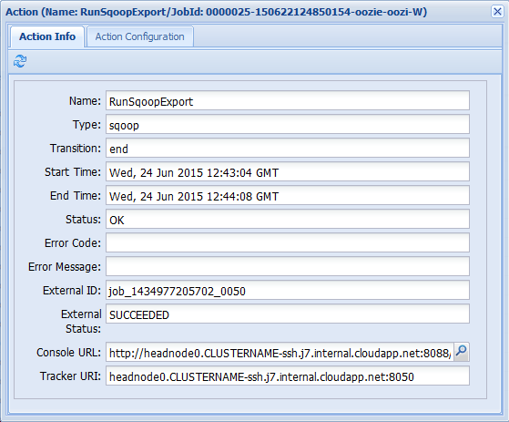
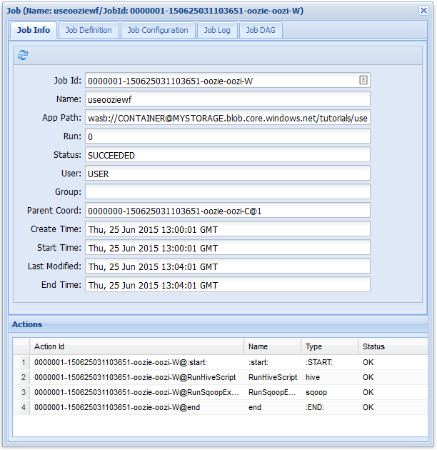

<properties
    pageTitle="Usar fluxos de trabalho do Hadoop Oozie em HDInsight baseado em Linux | Microsoft Azure"
    description="Use Hadoop Oozie do HDInsight baseados em Linux. Aprenda a definir um fluxo de trabalho Oozie e envie um trabalho Oozie."
    services="hdinsight"
    documentationCenter=""
    authors="Blackmist"
    manager="jhubbard"
    editor="cgronlun"
    tags="azure-portal"/>

<tags
    ms.service="hdinsight"
    ms.workload="big-data"
    ms.tgt_pltfrm="na"
    ms.devlang="na"
    ms.topic="article"
    ms.date="10/11/2016"
    ms.author="larryfr"/>

# Use Oozie com Hadoop para definir e executar um fluxo de trabalho baseados em Linux HDInsight

[AZURE.INCLUDE [oozie-selector](../../includes/hdinsight-oozie-selector.md)]

Saiba como usar o Apache Oozie para definir um fluxo de trabalho que usa a seção e Sqoop e, em seguida, executar o fluxo de trabalho em um cluster de HDInsight baseados em Linux.

Apache Oozie é um sistema de fluxo de trabalho/coordenação que gerencia trabalhos de Hadoop. Ele é integrado com a pilha Hadoop e suporta Hadoop trabalhos para Apache MapReduce, Apache porco, Apache seção e Apache Sqoop. Ele também pode ser usado para agendar trabalhos que são específicos para um sistema, como programas Java ou scripts do shell

> [AZURE.NOTE] Outra opção para definir fluxos de trabalho com HDInsight é fábrica de dados do Azure. Para saber mais sobre fábrica de dados do Azure, consulte [usar porco e seção com dados fábrica][azure-data-factory-pig-hive].

##Pré-requisitos

Antes de começar este tutorial, você deve ter o seguinte:

- **Assinatura de um Azure**: consulte [avaliação gratuita do Azure obter](https://azure.microsoft.com/pricing/free-trial/).

- **CLI Azure**: consulte [instalar e configurar a CLI do Azure](../xplat-cli-install.md)
    
    [AZURE.INCLUDE [use-latest-version](../../includes/hdinsight-use-latest-cli.md)]

- **HDInsight um cluster**: consulte [Introdução ao HDInsight no Linux](hdinsight-hadoop-linux-tutorial-get-started.md)

- **Banco de dados do SQL Azure**: isso será criado usando as etapas neste documento

##Fluxo de trabalho de exemplo

O fluxo de trabalho que você irá implementar seguindo as instruções neste documento contém duas ações. Ações são definições de tarefas, como executando seção, Sqoop, MapReduce ou outro processo:

![Diagrama de fluxo de trabalho][img-workflow-diagram]

1. Uma ação de seção executa um script de HiveQL para extrair os registros de **hivesampletable** incluído no HDInsight. Cada linha de dados descreve uma visita de um dispositivo móvel específico. O formato de registro aparece semelhante ao seguinte:

        8       18:54:20        en-US   Android Samsung SCH-i500        California     United States    13.9204007      0       0
        23      19:19:44        en-US   Android HTC     Incredible      Pennsylvania   United States    NULL    0       0
        23      19:19:46        en-US   Android HTC     Incredible      Pennsylvania   United States    1.4757422       0       1

    O script de seção usado neste documento conta as visitas totais para cada plataforma (como Android ou iPhone) e armazena as contagens para uma nova tabela de seção.

    Para obter mais informações sobre ramificação, consulte [Usar seção com HDInsight][hdinsight-use-hive].

2.  Uma ação Sqoop exporta o conteúdo da nova tabela seção a uma tabela em um banco de dados do SQL Azure. Para saber mais sobre Sqoop, consulte [Usar Hadoop Sqoop com HDInsight][hdinsight-use-sqoop].

> [AZURE.NOTE] Para as versões Oozie suportadas em clusters de HDInsight, consulte [Novidades nas versões Hadoop cluster fornecidas pelo HDInsight?] [hdinsight-versions].

##Criar a pasta de trabalho

Oozie espera recursos necessários para um trabalho ser armazenado na mesma pasta. Este exemplo usa **wasbs: / / / tutoriais/useoozie**. Use o seguinte comando para criar este diretório e o diretório de dados que conterá a nova tabela de seção criada por este fluxo de trabalho:

    hdfs dfs -mkdir -p /tutorials/useoozie/data

> [AZURE.NOTE] O `-p` parâmetro causados todas as pastas no caminho a ser criado se ele ainda não existir. O diretório de **dados** será usado para armazenar dados usados pelo script de **useooziewf.hql** .

Também execute o comando a seguir, que garante que Oozie pode representar sua conta de usuário durante a execução de trabalhos de seção e Sqoop. Substitua o **nome de usuário** com seu nome de logon:

    sudo adduser USERNAME users

Se você receber um erro que o usuário já é um membro de usuários, você pode ignorá-lo.

##Adicionar um driver de banco de dados

Como este fluxo de trabalho usa Sqoop para exportar dados para o banco de dados SQL, você deve fornecer uma cópia do driver JDBC usada para falar com o banco de dados SQL. Use o seguinte comando para copiá-lo para a pasta de trabalho:

    hdfs dfs -copyFromLocal /usr/share/java/sqljdbc_4.1/enu/sqljdbc*.jar /tutorials/useoozie/

Se seu fluxo de trabalho usado outros recursos, como um jar que contém um aplicativo MapReduce, você precisa adicioná-los também.

##Definir a consulta de seção

Use as seguintes etapas para criar um script de HiveQL que define uma consulta, que será usada em um fluxo de trabalho Oozie mais adiante neste documento.

1. Use SSH para se conectar ao cluster baseado em Linux HDInsight:

    * **Clientes Linux, Unix ou OS X**: consulte [Usar SSH com baseado em Linux Hadoop em HDInsight do Linux, OS X ou Unix](hdinsight-hadoop-linux-use-ssh-unix.md)

    * **Clientes do Windows**: consulte [Usar SSH com baseado em Linux Hadoop em HDInsight do Windows](hdinsight-hadoop-linux-use-ssh-windows.md)

2. Use o seguinte comando para criar um novo arquivo:

        nano useooziewf.hql

1. Quando abre o editor de nano, use o seguinte como o conteúdo do arquivo:

        DROP TABLE ${hiveTableName};
        CREATE EXTERNAL TABLE ${hiveTableName}(deviceplatform string, count string) ROW FORMAT DELIMITED
        FIELDS TERMINATED BY '\t' STORED AS TEXTFILE LOCATION '${hiveDataFolder}';
        INSERT OVERWRITE TABLE ${hiveTableName} SELECT deviceplatform, COUNT(*) as count FROM hivesampletable GROUP BY deviceplatform;

    Há duas variáveis usadas no script:

    - **${hiveTableName}**: conterá o nome da tabela a ser criado
    - **${hiveDataFolder}**: conterá o local para armazenar os arquivos de dados da tabela

    O arquivo de definição de fluxo de trabalho (. XML neste tutorial) passa esses valores para esse script HiveQL em tempo de execução.

2. Pressione Ctrl-X para sair do editor. Quando solicitado, selecione **s** para salvar o arquivo e use **Enter** para usar o nome de arquivo **useooziewf.hql** .

3. Use os seguintes comandos para copiar **useooziewf.hql** para **wasbs:///tutorials/useoozie/useooziewf.hql**:

        hdfs dfs -copyFromLocal useooziewf.hql /tutorials/useoozie/useooziewf.hql

    Esses comandos armazenam o arquivo de **useooziewf.hql** na conta de armazenamento do Azure associada a este cluster, que preserva o arquivo mesmo se o cluster é excluído. Isso permite economizar excluindo clusters quando eles não estão em uso, mantendo seus trabalhos e fluxos de trabalho.

##Definir o fluxo de trabalho

Definições de fluxos de trabalho de Oozie são escritas em hPDL (um processo de definição de linguagem XML). Use as etapas a seguir para definir o fluxo de trabalho:

1. Use a instrução a seguir para criar e editar um novo arquivo:

        nano workflow.xml

1. Quando o editor de nano abrir, digite o seguinte como o conteúdo do arquivo:

        <workflow-app name="useooziewf" xmlns="uri:oozie:workflow:0.2">
            <start to = "RunHiveScript"/>
            <action name="RunHiveScript">
            <hive xmlns="uri:oozie:hive-action:0.2">
                <job-tracker>${jobTracker}</job-tracker>
                <name-node>${nameNode}</name-node>
                <configuration>
                <property>
                    <name>mapred.job.queue.name</name>
                    <value>${queueName}</value>
                </property>
                </configuration>
                
                <param>hiveTableName=${hiveTableName}</param>
                <param>hiveDataFolder=${hiveDataFolder}</param>
            </hive>
            <ok to="RunSqoopExport"/>
            <error to="fail"/>
            </action>
            <action name="RunSqoopExport">
            <sqoop xmlns="uri:oozie:sqoop-action:0.2">
                <job-tracker>${jobTracker}</job-tracker>
                <name-node>${nameNode}</name-node>
                <configuration>
                <property>
                    <name>mapred.compress.map.output</name>
                    <value>true</value>
                </property>
                </configuration>
                <arg>export</arg>
                <arg>--connect</arg>
                <arg>${sqlDatabaseConnectionString}</arg>
                <arg>--table</arg>
                <arg>${sqlDatabaseTableName}</arg>
                <arg>--export-dir</arg>
                <arg>${hiveDataFolder}</arg>
                <arg>-m</arg>
                <arg>1</arg>
                <arg>--input-fields-terminated-by</arg>
                <arg>"\t"</arg>
                <archive>sqljdbc41.jar</archive>
                </sqoop>
            <ok to="end"/>
            <error to="fail"/>
            </action>
            <kill name="fail">
            <message>Job failed, error message[${wf:errorMessage(wf:lastErrorNode())}] </message>
            </kill>
            <end name="end"/>
        </workflow-app>

    Há duas ações definidas no fluxo de trabalho:

    - **RunHiveScript**: essa é a ação Iniciar e executa o **useooziewf.hql** seção script

    - **RunSqoopExport**: Isso exporta os dados criados a partir do script de seção usando Sqoop de banco de dados do SQL. Isso só será executada se a ação de **RunHiveScript** for bem-sucedido.

        > [AZURE.NOTE] Para obter mais informações sobre como Oozie fluxo de trabalho e usar ações de fluxo de trabalho, consulte [a documentação do Apache Oozie 4.0] [ apache-oozie-400] (para HDInsight versão 3.0) ou [Apache Oozie 3.3.2 documentação] [ apache-oozie-332] (para HDInsight versão 2.1).

    Observe que o fluxo de trabalho tem várias entradas, tais como `${jobTracker}`, que serão substituídas por valores que você usar na definição de trabalho posteriormente neste documento.

    Observe também a `<archive>sqljdbc4.jar</arcive>` entrada na seção Sqoop. Isso instrui Oozie para disponibilizar esse arquivamento para Sqoop quando esta ação é executada.

2. Use Ctrl-X e **Y** e **Enter** para salvar o arquivo.

3. Use o seguinte comando para copiar o arquivo **. XML** para **wasbs:///tutorials/useoozie/workflow.xml**:

        hdfs dfs -copyFromLocal workflow.xml /tutorials/useoozie/workflow.xml

##Criar o banco de dados

Siga as etapas no documento [criar um banco de dados SQL](../sql-database/sql-database-get-started.md) para criar um novo banco de dados. Ao criar o banco de dados, use __oozietest__ como o nome do banco de dados. Também Anote o nome usado para o servidor de banco de dados, pois isso será necessário na próxima seção.

###Criar a tabela

> [AZURE.NOTE] Há várias maneiras para se conectar ao banco de dados SQL para criar uma tabela. As etapas seguintes usam [FreeTDS](http://www.freetds.org/) do cluster HDInsight.

3. Use o comando a seguir para instalar o FreeTDS em cluster HDInsight:

        sudo apt-get --assume-yes install freetds-dev freetds-bin

4. Uma vez FreeTDS tiver sido instalado, use o seguinte comando para se conectar ao servidor de banco de dados SQL que você criou anteriormente:

        TDSVER=8.0 tsql -H <serverName>.database.windows.net -U <sqlLogin> -P <sqlPassword> -p 1433 -D oozietest

    Você receberá saída similar ao seguinte:

        locale is "en_US.UTF-8"
        locale charset is "UTF-8"
        using default charset "UTF-8"
        Default database being set to oozietest
        1>

5. No `1>` solicitar, insira as seguintes linhas:

        CREATE TABLE [dbo].[mobiledata](
        [deviceplatform] [nvarchar](50),
        [count] [bigint])
        GO
        CREATE CLUSTERED INDEX mobiledata_clustered_index on mobiledata(deviceplatform)
        GO

    Quando o `GO` instrução é inserida, as instruções anterior serão avaliadas. Isso criará uma nova tabela denominada **mobiledata** que serão gravados por Sqoop.

    Use o seguinte para verificar que a tabela foi criada:

        SELECT * FROM information_schema.tables
        GO

    Você deve ver o resultado similar ao seguinte:

        TABLE_CATALOG   TABLE_SCHEMA    TABLE_NAME      TABLE_TYPE
        oozietest       dbo     mobiledata      BASE TABLE

8. Insira `exit` na `1>` aviso sair do utilitário tsql.

##Criar a definição de trabalho

A definição de trabalho descreve onde encontrar o. XML, bem como outros arquivos usados pelo fluxo de trabalho (como useooziewf.hql). Ele também define os valores para as propriedades usadas no fluxo de trabalho e arquivos associados.

1. Use o comando a seguir para obter o endereço completo do WASB ao armazenamento de padrão. Isso será usado no arquivo de configuração em um momento:

        sed -n '/<name>fs.default/,/<\/value>/p' /etc/hadoop/conf/core-site.xml

    Isso deve retornar informações similar ao seguinte:

        <name>fs.defaultFS</name>
        <value>wasbs://mycontainer@mystorageaccount.blob.core.windows.net</value>

    Salve o **wasbs://mycontainer@mystorageaccount.blob.core.windows.net** valor, pois ele será usado nas próximas etapas.

2. Use o comando a seguir para obter o FQDN do headnode cluster. Isso será usado para o endereço de JobTracker para o cluster. Isso será usado no arquivo de configuração em um momento:

        hostname -f

    Isso retornará informações similar ao seguinte:

        hn0-CLUSTERNAME.randomcharacters.cx.internal.cloudapp.net

    A porta usada para o JobTracker é 8050, portanto, o endereço completo para usar para o JobTracker será **hn0-CLUSTERNAME.randomcharacters.cx.internal.cloudapp.net:8050**.

1. Use o seguinte para criar a configuração de definição de trabalho de Oozie:

        nano job.xml

2. Quando abre o editor de nano, use o seguinte como o conteúdo do arquivo:

        <?xml version="1.0" encoding="UTF-8"?>
        <configuration>

          <property>
            <name>nameNode</name>
            <value>wasbs://mycontainer@mystorageaccount.blob.core.windows.net</value>
          </property>

          <property>
            <name>jobTracker</name>
            <value>JOBTRACKERADDRESS</value>
          </property>

          <property>
            <name>queueName</name>
            <value>default</value>
          </property>

          <property>
            <name>oozie.use.system.libpath</name>
            <value>true</value>
          </property>

          <property>
            <name>hiveScript</name>
            <value>wasbs://mycontainer@mystorageaccount.blob.core.windows.net/tutorials/useoozie/useooziewf.hql</value>
          </property>

          <property>
            <name>hiveTableName</name>
            <value>mobilecount</value>
          </property>

          <property>
            <name>hiveDataFolder</name>
            <value>wasbs://mycontainer@mystorageaccount.blob.core.windows.net/tutorials/useoozie/data</value>
          </property>

          <property>
            <name>sqlDatabaseConnectionString</name>
            <value>"jdbc:sqlserver://serverName.database.windows.net;user=adminLogin;password=adminPassword;database=oozietest"</value>
          </property>

          <property>
            <name>sqlDatabaseTableName</name>
            <value>mobiledata</value>
          </property>

          <property>
            <name>user.name</name>
            <value>YourName</value>
          </property>

          <property>
            <name>oozie.wf.application.path</name>
            <value>wasbs://mycontainer@mystorageaccount.blob.core.windows.net/tutorials/useoozie</value>
          </property>
        </configuration>

    * Substituir todas as instâncias de **wasbs://mycontainer@mystorageaccount.blob.core.windows.net** com o valor recebidas anteriormente.

    > [AZURE.WARNING] Você deve usar o caminho completo do WASB, com a conta de armazenamento e contêiner como parte do caminho. Usando o formato curto (wasbs: / / /) fará com que a ação de RunHiveScript falha quando o trabalho é iniciado.

    * Substitua **JOBTRACKERADDRESS** com o endereço de JobTracker/ResourceManager recebidas anteriormente.

    * Substitua **seunome** com seu nome de logon para o cluster HDInsight.

    * Substitua as informações do seu banco de dados do SQL Azure **nomedoservidor**, **adminLogin**e **adminPassword** .

    A maioria das informações neste arquivo é usado para preencher os valores usados nos arquivos. XML ou ooziewf.hql (como ${nameNode}.)

    > [AZURE.NOTE] A entrada **oozie.wf.application.path** define onde encontrar o arquivo. XML, que contém o fluxo de trabalho executado por este trabalho.

2. Use Ctrl-X e **Y** e **Enter** para salvar o arquivo.

##Enviar e gerenciar o trabalho

As etapas a seguir usam o comando Oozie para enviar e gerenciar fluxos de trabalho de Oozie no cluster. O comando Oozie é uma interface amigável sobre a [API REST de Oozie](https://oozie.apache.org/docs/4.1.0/WebServicesAPI.html).

> [AZURE.IMPORTANT] Ao usar o comando Oozie, você deve usar o FQDN para o headnode HDInsight. Este FQDN só é acessível do cluster, ou se o cluster estiver em uma rede Virtual do Azure, de outros computadores na mesma rede.

1. Use o seguinte para obter a URL para o serviço de Oozie:

        sed -n '/<name>oozie.base.url/,/<\/value>/p' /etc/oozie/conf/oozie-site.xml

    Isso retornará um valor similar ao seguinte:

        <name>oozie.base.url</name>
        <value>http://hn0-CLUSTERNAME.randomcharacters.cx.internal.cloudapp.net:11000/oozie</value>

    A parte **http://hn0-CLUSTERNAME.randomcharacters.cx.internal.cloudapp.net:11000/oozie** é a URL para usar com o comando Oozie.

2. Use este procedimento para criar uma variável de ambiente para a URL, para que você não precise digitá-lo para cada comando:

        export OOZIE_URL=http://HOSTNAMEt:11000/oozie

    Substitua a URL que você recebeu anteriormente.

3. Use este procedimento para enviar o trabalho:

        oozie job -config job.xml -submit

    Isso carrega as informações de trabalho de **job.xml** e envia para Oozie, mas não é executado.

    Quando o comando for concluída, ele deve retornar a ID do trabalho. Por exemplo, `0000005-150622124850154-oozie-oozi-W`. Isso será usado para gerenciar o trabalho.

4. Exiba o status do trabalho usando o seguinte comando. Insira a ID de trabalho retornada pelo comando anterior:

        oozie job -info <JOBID>

    Isso retornará informações semelhante à seguinte.

        Job ID : 0000005-150622124850154-oozie-oozi-W
        ------------------------------------------------------------------------------------------------------------------------------------
        Workflow Name : useooziewf
        App Path      : wasbs:///tutorials/useoozie
        Status        : PREP
        Run           : 0
        User          : USERNAME
        Group         : -
        Created       : 2015-06-22 15:06 GMT
        Started       : -
        Last Modified : 2015-06-22 15:06 GMT
        Ended         : -
        CoordAction ID: -
        ------------------------------------------------------------------------------------------------------------------------------------

    Este trabalho possui um status de `PREP`, que indica que ele foi enviado, mas ainda não foi iniciado.

4. Use o seguinte para iniciar o trabalho:

        oozie job -start JOBID

    Se você verificar o status após este comando, ele estará em um estado de execução e informações serão retornadas para as ações no trabalho.

5. Quando a tarefa for concluída com êxito, você pode verificar se os dados foi gerados e exportados para a tabela de banco de dados SQL usando os seguintes comandos:

        TDSVER=8.0 tsql -H <serverName>.database.windows.net -U <adminLogin> -P <adminPassword> -p 1433 -D oozietest

    No `1>` solicitar, insira o seguinte:

        SELECT * FROM mobiledata
        GO

    Você deve receber informações similares ao seguinte:

        deviceplatform  count
        Android 31591
        iPhone OS       22731
        proprietary development 3
        RIM OS  3464
        Unknown 213
        Windows Phone   1791
        (6 rows affected)

Para obter mais informações sobre o comando Oozie, consulte [Oozie ferramenta de linha de comando](https://oozie.apache.org/docs/4.1.0/DG_CommandLineTool.html).

##API REST de Oozie

A API REST Oozie permitem que você crie suas próprias ferramentas que funcionam com Oozie. A seguir estão HDInsight informações específicas sobre como usar a API REST Oozie:

* **URI**: A API REST podem ser acessado de fora do cluster em`https://CLUSTERNAME.azurehdinsight.net/oozie`

* **Autenticação**: você deve autenticar à API usando a conta de cluster HTTP (admin) e senha. Por exemplo:

        curl -u admin:PASSWORD https://CLUSTERNAME.azurehdinsight.net/oozie/versions

Para obter mais informações sobre como usar a API REST Oozie, consulte [API de serviços Web Oozie](https://oozie.apache.org/docs/4.1.0/WebServicesAPI.html).

##Web Oozie da interface do usuário

A interface do usuário do Oozie Web fornece um modo de exibição baseado na web para o status de Oozie trabalhos em cluster. Ele permite exibir o status do trabalho, a definição de trabalho, configuração, um gráfico de ações no trabalho e logs para o trabalho. Você também pode exibir detalhes para ações dentro de um trabalho.

Para acessar a interface do usuário do Oozie da Web, use as seguintes etapas:

1. Crie um túnel SSH ao cluster HDInsight. Para obter informações sobre como fazer isso, consulte [Usar SSH túnel para acessar Ambari web UI, ResourceManager, JobHistory, NameNode, Oozie e outra web da interface do usuário](hdinsight-linux-ambari-ssh-tunnel.md).

2. Depois que um túnel tiver sido criado, abra a web de Ambari UI no navegador da web. O URI para o site de Ambari é **https://CLUSTERNAME.azurehdinsight.net**. Substitua o nome do seu cluster baseado em Linux HDInsight **CLUSTERNAME** .

3. Do lado esquerdo da página, selecione **Oozie**, e em seguida, **Links rápidos**e finalmente **Oozie Web UI**.

    

4. A interface do usuário do Oozie Web padrão exibindo trabalhos de fluxo de trabalho em execução. Para ver todos os trabalhos de fluxo de trabalho, selecione **Todos os trabalhos**.

    

5. Selecione um trabalho para exibir mais informações sobre o trabalho.

    

6. Na guia informações de trabalho, você pode ver informações sobre o trabalho básico, bem como as ações individuais no trabalho. Usando as guias na parte superior você pode exibir o acesso de definição de trabalho, configuração de trabalho, o Log de trabalho ou exibir um direcionado acíclica Graph (Dag mão) do trabalho.

    * **Log de trabalho**: selecione o botão de **GetLogs** para obter todos os logs do trabalho ou use o campo **Insira filtro de pesquisa** para filtrar os logs

        

    * **JobDAG**: Dag a mão é uma visão geral gráfica dos caminhos de dados obtidas por meio de fluxo de trabalho

        

7. Selecionando uma das ações da guia **Informações de trabalho** exibirá informações para a ação. Por exemplo, selecione a ação de **RunHiveScript** .

    

8. Você pode ver os detalhes da ação, incluindo um link para a **URL do Console**, que pode ser usado para exibir informações de JobTracker para o trabalho.

##Agendar trabalhos

O coordenador permite especificar um início, término e frequência de ocorrência para trabalhos para que eles podem ser para determinados horários agendados.

Para definir uma agenda para o fluxo de trabalho, use as seguintes etapas:

1. Use o seguinte para criar um novo arquivo chamado **coordinator.xml**:

        nano coordinator.xml

    Use o seguinte como o conteúdo do arquivo:

        <coordinator-app name="my_coord_app" frequency="${coordFrequency}" start="${coordStart}" end="${coordEnd}" timezone="${coordTimezone}" xmlns="uri:oozie:coordinator:0.4">
          <action>
            <workflow>
              <app-path>${workflowPath}</app-path>
            </workflow>
          </action>
        </coordinator-app>

    Observe que usa `${...}` variáveis que serão substituídas pelos valores na definição de trabalho. As variáveis são:

    * **${coordFrequency}**: tempo entre instâncias do trabalho em execução
    * **${coordStart}**: hora de início do trabalho
    * **${coordEnd}**: A hora de término do trabalho
    * **${coordTimezone}**: trabalhos de coordenador estão em um fuso horário fixo com nenhum horário de verão (normalmente representado usando UTC). Este fuso horário é conhecido como o "Oozie processamento de fuso horário"
    * **${wfPath}**: O caminho para o. XML

2. Use Ctrl-X e **Y** e **Enter** para salvar o arquivo.

3. Use o seguinte para copiá-lo para a pasta de trabalho para este trabalho:

        hadoop fs -copyFromLocal coordinator.xml /tutorials/useoozie/coordinator.xml

4. Use o seguinte para modificar o arquivo **job.xml** :

        nano job.xml

    Faça as seguintes alterações:

    * Alterar `<name>oozie.wf.application.path</name>` para `<name>oozie.coord.application.path</name>`. Isso instrui Oozie para executar o arquivo de coordenador em vez do arquivo de fluxo de trabalho

    * Adicione o seguinte, que será define uma variável usada no coordinator.xml para apontar para o local da. XML:

            <property>
              <name>workflowPath</name>
              <value>wasbs://mycontainer@mystorageaccount.blob.core.windows.net/tutorials/useoozie</value>
            </property>

        Substitua os valores para **mycontainer** e **mystorageaccount** valores usados em outras entradas no arquivo job.xml.

    * Adicione o seguinte, que definem o início, término e frequência para o arquivo de coordinator.xml:

            <property>
              <name>coordStart</name>
              <value>2015-06-25T12:00Z</value>
            </property>

            <property>
              <name>coordEnd</name>
              <value>2015-06-27T12:00Z</value>
            </property>

            <property>
              <name>coordFrequency</name>
              <value>1440</value>
            </property>

            <property>
              <name>coordTimezone</name>
              <value>UTC</value>
            </property>

        Esses definir hora de início para 12:00 PM em 25 de junho de 2015, a hora de término para 27 de junho de 2015 e o intervalo para executar esta tarefa para diariamente (a frequência é em minutos, portanto 24 horas x 60 minutos = 1440 minutos.) Por fim, o fuso horário está definido como UTC.

5. Use Ctrl-X e **Y** e **Enter** para salvar o arquivo.

6. Para executar o trabalho, use o seguinte comando:

        oozie job -config job.xml -run

    Isso enviar e iniciar o trabalho.

7. Se você visitar a interface do usuário do Oozie Web e selecione a guia **Trabalhos de coordenador** , você deve informações similares ao seguinte:

    

    Anote a entrada de **Materialização próximo** ; Isso é quando o trabalho será executado próximo.

8. Semelhante ao fluxo de trabalho anterior, selecionando a entrada de trabalho na web UI exibirá informações no trabalho:

    

    Observe que isso só mostra executa bem-sucedida do trabalho, ações não individuais do fluxo de trabalho agendado. Para ver que, selecione uma das entradas de **ação** . Isso exibirá informações semelhantes às que recuperados por fluxo de trabalho anterior.

    

##Solução de problemas

Quando solucionar problemas com trabalhos de Oozie, a Oozie UI é muito útil que permite a você exibir facilmente ambos os logs de Oozie, bem como links logs de JobTracker para tarefas MapReduce como consultas de seção. Em geral, deve ser o padrão para solução de problemas:

1. Exiba o trabalho em Oozie Web UI.

2. Se houver um erro ou falha para uma ação específica, selecione a ação para ver se o campo de **Mensagem de erro** fornece mais informações sobre a falha.

3. Se disponível, use a URL da ação para exibir mais detalhes (como logs de JobTracker) para a ação.

A seguir estão erros específicos que você pode encontrar e como resolvê-los.

###JA009: Não é possível inicializar cluster

**Sintomas**: O status do trabalho será alterado para **suspenso**. Detalhes do trabalho mostrará o status de RunHiveScript **START_MANUAL**. Selecionando a ação revela a seguinte mensagem de erro:

    JA009: Cannot initialize Cluster. Please check your configuration for map

**Causa**: endereços WASB o usado no arquivo **job.xml** não contêm o contêiner de armazenamento ou o nome da conta de armazenamento. O formato do endereço WASB deve ser `wasbs://containername@storageaccountname.blob.core.windows.net`.

**Resolução**: alterar os endereços WASB usados pelo trabalho.

###JA002: Oozie não é permitido para representar &lt;usuário >

**Sintomas**: O status do trabalho será alterado para **suspenso**. Detalhes do trabalho mostrará o status de RunHiveScript **START_MANUAL**. Selecionando a ação revela a seguinte mensagem de erro:

    JA002: User: oozie is not allowed to impersonate <USER>

**Causa**: as configurações de permissão atuais não permitem Oozie representar a conta de usuário especificado.

**Resolução**: Oozie tem permissão para representar os usuários do grupo de **usuários** . Use o `groups USERNAME` para ver os grupos que a conta de usuário é membro. Se o usuário não é um membro do grupo de **usuários** , use o comando a seguir para adicionar o usuário ao grupo:

    sudo adduser USERNAME users

> [AZURE.NOTE] Ele pode levar alguns minutos antes de HDInsight reconhece que o usuário foi adicionado ao grupo.

###Iniciador de erro (Sqoop)

**Sintomas**: O status do trabalho será alterado para **KILLED**. Detalhes do trabalho mostrará o status de RunSqoopExport como **erro**. Selecionando a ação revela a seguinte mensagem de erro:

    Launcher ERROR, reason: Main class [org.apache.oozie.action.hadoop.SqoopMain], exit code [1]

**Causa**: Sqoop é possível carregar o driver de banco de dados necessário para acessar o banco de dados.

**Resolução**: ao usar Sqoop de um trabalho de Oozie, você deve incluir o driver de banco de dados com os outros recursos (como. de XML,) usado pelo trabalho.

Você também deve fazer referência o arquivo contendo o driver de banco de dados do `<sqoop>...</sqoop>` seção da. XML.

Por exemplo, para o trabalho neste documento, você usaria as seguintes etapas:

1. Copie o arquivo sqljdbc4.1.jar para o diretório /tutorials/useoozie:

         hadoop fs -copyFromLocal /usr/share/java/sqljdbc_4.1/enu/sqljdbc41.jar /tutorials/useoozie/sqljdbc41.jar

2. Modificar o. XML para adicionar o seguinte em uma nova linha acima `</sqoop>`:

        <archive>sqljdbc41.jar</archive>

##Próximas etapas
Neste tutorial, você aprendeu como definir um fluxo de trabalho Oozie e como executar um trabalho de Oozie. Para saber mais sobre como trabalhar com HDInsight, consulte os seguintes artigos:

- [Usar baseada em tempo Oozie coordenador com HDInsight][hdinsight-oozie-coordinator-time]
- [Carregar dados para trabalhos de Hadoop em HDInsight][hdinsight-upload-data]
- [Usar Sqoop com Hadoop em HDInsight][hdinsight-use-sqoop]
- [Use a seção com Hadoop em HDInsight][hdinsight-use-hive]
- [Usar porco com Hadoop em HDInsight][hdinsight-use-pig]
- [Desenvolver programas Java MapReduce para HDInsight][hdinsight-develop-mapreduce]

[hdinsight-cmdlets-download]: http://go.microsoft.com/fwlink/?LinkID=325563

[azure-data-factory-pig-hive]: ../data-factory/data-factory-data-transformation-activities.md
[hdinsight-oozie-coordinator-time]: hdinsight-use-oozie-coordinator-time.md
[hdinsight-versions]:  hdinsight-component-versioning.md
[hdinsight-storage]: hdinsight-use-blob-storage.md
[hdinsight-get-started]: hdinsight-get-started.md

[hdinsight-use-sqoop]: hdinsight-use-sqoop-mac-linux.md
[hdinsight-provision]: hdinsight-provision-clusters.md
[hdinsight-upload-data]: hdinsight-upload-data.md
[hdinsight-use-mapreduce]: hdinsight-use-mapreduce.md
[hdinsight-use-hive]: hdinsight-use-hive.md
[hdinsight-use-pig]: hdinsight-use-pig.md
[hdinsight-storage]: hdinsight-use-blob-storage.md
[hdinsight-get-started-emulator]: hdinsight-get-started-emulator.md

[hdinsight-develop-mapreduce]: hdinsight-develop-deploy-java-mapreduce-linux.md

[sqldatabase-create-configue]: sql-database-create-configure.md
[sqldatabase-get-started]: sql-database-get-started.md

[azure-create-storageaccount]: storage-create-storage-account.md

[apache-hadoop]: http://hadoop.apache.org/
[apache-oozie-400]: http://oozie.apache.org/docs/4.0.0/
[apache-oozie-332]: http://oozie.apache.org/docs/3.3.2/

[powershell-download]: http://azure.microsoft.com/downloads/
[powershell-about-profiles]: http://go.microsoft.com/fwlink/?LinkID=113729
[powershell-install-configure]: powershell-install-configure.md
[powershell-start]: http://technet.microsoft.com/library/hh847889.aspx
[powershell-script]: https://technet.microsoft.com/en-us/library/ee176961.aspx

[cindygross-hive-tables]: http://blogs.msdn.com/b/cindygross/archive/2013/02/06/hdinsight-hive-internal-and-external-tables-intro.aspx

[img-workflow-diagram]: ./media/hdinsight-use-oozie/HDI.UseOozie.Workflow.Diagram.png
[img-preparation-output]: ./media/hdinsight-use-oozie/HDI.UseOozie.Preparation.Output1.png
[img-runworkflow-output]: ./media/hdinsight-use-oozie/HDI.UseOozie.RunWF.Output.png

[technetwiki-hive-error]: http://social.technet.microsoft.com/wiki/contents/articles/23047.hdinsight-hive-error-unable-to-rename.aspx
