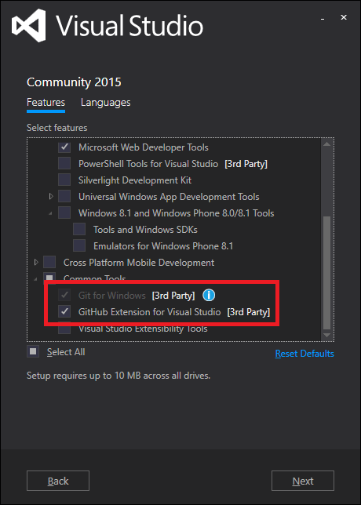
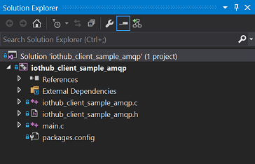

<properties
    pageTitle="Usar o dispositivo IoT Azure SDK para C | Microsoft Azure"
    description="Saiba mais sobre e começar a trabalhar com o código de exemplo no dispositivo IoT Azure SDK para C."
    services="iot-hub"
    documentationCenter=""
    authors="olivierbloch"
    manager="timlt"
    editor=""/>

<tags
     ms.service="iot-hub"
     ms.devlang="cpp"
     ms.topic="article"
     ms.tgt_pltfrm="na"
     ms.workload="na"
     ms.date="09/06/2016"
     ms.author="obloch"/>

# <a name="introducing-the-azure-iot-device-sdk-for-c"></a>Apresentando o dispositivo IoT Azure SDK para C

O **dispositivo de IoT Azure SDK** é um conjunto de bibliotecas projetado para simplificar o processo de eventos de envio e recebimento de mensagens do serviço **Azure IoT Hub** . Existem diferentes variações do SDK, cada um direcionado para uma plataforma específica, mas este artigo descreve o **dispositivo IoT Azure SDK para C**.

O dispositivo de IoT Azure SDK para C é escrito em ANSI C (C99) para maximizar a portabilidade. Isso torna mais adequado para operar em um número de dispositivos e plataformas, especialmente onde minimizando disco e espaço de memória é uma prioridade.  

Há uma ampla variedade de plataformas no qual o SDK foi testado (consulte o [Azure certificados para o catálogo de dispositivo IoT](https://catalog.azureiotsuite.com/) para obter detalhes). Embora este artigo inclui instruções passo a passo de código de amostra em execução na plataforma Windows, tenha em mente que o código descrito neste artigo é exatamente o mesmo em intervalo de plataformas com suporte.

Neste artigo você vai ser introduzido a arquitetura do dispositivo IoT Azure SDK para C. Demonstraremos como inicializar a biblioteca de dispositivo, enviar eventos para IoT Hub, bem como receber mensagens dele. As informações neste artigo devem ser suficiente para começar a usar o SDK, mas também fornece ponteiros para obter informações adicionais sobre as bibliotecas.

## <a name="sdk-architecture"></a>Arquitetura SDK

Você pode encontrar o **dispositivo IoT Azure SDK para C** no repositório do [Microsoft Azure IoT SDKs](https://github.com/Azure/azure-iot-sdks) GitHub e exibir os detalhes da API na [referência da API do C](http://azure.github.io/azure-iot-sdks/c/api_reference/index.html).

A versão mais recente das bibliotecas pode ser encontrada na ramificação **mestre** deste repositório:

  

Este repositório contém toda a família de dispositivo do Azure IoT SDKs. No entanto, este artigo é sobre o dispositivo IoT Azure SDK *para C* que pode ser encontrado na pasta **c** .

  

* A implementação principal do SDK pode ser encontrada na **iothub\_cliente** pasta que contém a implementação da camada de API mais baixa no SDK: a biblioteca **IoTHubClient** . A biblioteca de **IoTHubClient** contém APIs Implementando mensagens bruto para enviar mensagens para IoT Hub, bem como receber mensagens dele. Ao usar essa biblioteca, você é responsável por implementar serialização de mensagem (eventualmente usando a amostra de serializador descrita abaixo), mas outros detalhes de se comunicar com IoT Hub são tratados para você.
* A pasta de **serializador** contém funções de auxiliar e exemplos mostrando como serializar dados antes de enviar a Azure IoT Hub usando a biblioteca de cliente. Observe que o uso do serializador não é obrigatório e apenas fornecido a conveniência. Se você usar a biblioteca de **serializador** , comece definindo um modelo que especifica os eventos que você deseja enviar IoT Hub, bem como as mensagens que você espera receber dele. Depois que o modelo é definido, o SDK fornece uma superfície de API que permite trabalhar facilmente com mensagens e eventos sem precisar se preocupar com detalhes de serialização.
A biblioteca depende de outras bibliotecas de abrir origem que implementam transporte usando vários protocolos (MQTT, AMQP).
* A biblioteca de **IoTHubClient** depende de outras bibliotecas de código-fonte aberto:
   * A biblioteca [C Azure compartilhados utilitário](https://github.com/Azure/azure-c-shared-utility) que fornece recursos comuns para tarefas básicas (como cadeia de caracteres, manipulação de lista, IO, etc....) necessária em vários SDKs de C relacionados do Azure
   * A biblioteca de [uAMQP Azure](https://github.com/Azure/azure-uamqp-c) que é a implementação do lado do cliente do AMQP otimizado para dispositivos de restrição de recursos.
   * A biblioteca de [uMQTT Azure](https://github.com/Azure/azure-umqtt-c) que é uma biblioteca de uso geral implementação do protocolo MQTT e otimizados para dispositivos de restrição de recursos.

Tudo isso é mais fácil de compreender examinando o código de exemplo. As seções a seguir orientá-lo através de alguns dos aplicativos de exemplo incluídos no SDK. Isso deve fornecer uma boa aparência para os diversos recursos das camadas de arquiteturais do SDK, bem como uma introdução ao como funcionam as APIs.

## <a name="before-running-the-samples"></a>Antes de executar as amostras

Antes de poder executar as amostras no dispositivo IoT Azure SDK para C, você deve criar uma instância do serviço na sua assinatura do Azure se você já não tiver um e concluir 2 tarefas:
* preparar o ambiente de desenvolvimento
* Obtenha as credenciais de dispositivo.

Se você precisa criar uma instância do Azure IoT Hub em sua assinatura do Azure, siga as instruções [aqui](https://github.com/Azure/azure-iot-sdks/blob/master/doc/setup_iothub.md).

O [arquivo Leiame](https://github.com/Azure/azure-iot-sdks/tree/master/c) incluído com o SDK fornece instruções para preparar seu ambiente de desenvolvimento e obter as credenciais do dispositivo.
As seções a seguir incluem alguns comentários adicionais sobre essas instruções.

### <a name="preparing-your-development-environment"></a>Preparando seu ambiente de desenvolvimento

Enquanto pacotes são fornecidos para algumas plataformas (como NuGet para Windows ou apt_get para Debian e Ubuntu) e os exemplos usam esses pacotes quando disponível, a estas instruções detalhadas sobre como criar a biblioteca e as amostras diretamente o código de formulário.

Primeiro, você precisará obter uma cópia do SDK do GitHub e depois construa a fonte. Você deve obter uma cópia da origem da filial **mestre** do [repositório de GitHub](https://github.com/Azure/azure-iot-sdks).

Quando você baixar uma cópia da origem, você deve concluir as etapas descritas no artigo SDK ["Preparar seu ambiente de desenvolvimento"](https://github.com/Azure/azure-iot-sdks/blob/master/c/doc/devbox_setup.md).


A seguir estão algumas dicas para ajudá-lo a concluir o procedimento descrito no guia de preparação:

-   Quando você instala o utilitário **CMake** , escolha a opção Adicionar **CMake** para o caminho do sistema para **todos os usuários** (adicionando para **o usuário atual** works também):

  


-   Antes de abrir o **Prompt de comando do desenvolvedor para VS2015**, instale as ferramentas de linha de comando gito. Para instalar essas ferramentas, conclua as seguintes etapas:

    1. Inicie o programa de instalação do **Visual Studio 2015** (ou escolheu **Microsoft Visual Studio 2015** do painel de controle **programas e recursos** e selecione **Alterar**).
    
    2. Verifique se o recurso de **Gito para Windows** está selecionado no instalador, mas talvez você também queira marcar a opção de **Extensão GitHub para Visual Studio** para fornecer integração de IDE:

        

    3. Conclua o Assistente de configuração para instalar as ferramentas.

    4. Adicione diretório gito ferramentas **bin** a variável de ambiente **PATH** sistema. No Windows, isso é semelhante ao seguinte:

        


Quando você concluiu todas as etapas descritas na página ["Preparar seu ambiente de desenvolvimento"](https://github.com/Azure/azure-iot-sdks/blob/master/c/doc/devbox_setup.md) , você estará pronto para compilar os aplicativos de exemplo.

### <a name="obtaining-device-credentials"></a>Obtendo credenciais de dispositivo

Agora que seu ambiente de desenvolvimento estiver configurado, a próxima coisa a fazer é obter um conjunto de credenciais do dispositivo.  Para um dispositivo sejam capazes de acessar um hub IoT, primeiro é necessário adicionar o dispositivo para o registro do dispositivo de IoT Hub. Quando você adicionar seu dispositivo, você receberá um conjunto de credenciais do dispositivo que você precisará para que o dispositivo sejam capazes de se conectar a um hub IoT. Os aplicativos de exemplo que veremos na próxima seção esperam essas credenciais na forma de uma **cadeia de conexão do dispositivo**.

Existem algumas ferramentas fornecidas no repositório SDK Abrir fonte para ajudar a gerenciar o Hub de IoT. Uma é um aplicativo chamado dispositivo Explorer, segundo baseia um Node ferramenta CLI entre plataformas chamada iothub-explorer do Windows. Você pode saber mais sobre essas ferramentas [aqui](https://github.com/Azure/azure-iot-sdks/blob/master/doc/manage_iot_hub.md).

Como vamos através de exemplos em execução no Windows neste artigo, estamos usando a ferramenta Explorer do dispositivo. Mas você também pode usar o Explorador de iothub se você preferir ferramentas de CLI.

A ferramenta de [Dispositivo Explorer](https://github.com/Azure/azure-iot-sdks/tree/master/tools/DeviceExplorer) usa as bibliotecas de serviço do Azure IoT para realizar várias funções em IoT Hub, incluindo a adição de dispositivos. Se você usar o dispositivo Explorer para adicionar um dispositivo, você receberá uma cadeia de conexão correspondente. Você precisa essa cadeia de caracteres de conexão para tornar a amostra de aplicativos são executados.

Caso você não ainda estiver familiarizado com o processo, o procedimento a seguir descreve como usar o dispositivo Explorer para adicionar um dispositivo e obter uma cadeia de conexão do dispositivo.

Você pode encontrar um instalador do Windows para a ferramenta de dispositivo Explorer na [página de lançamento do SDK](https://github.com/Azure/azure-iot-sdks/releases). Mas você também pode executar a ferramenta diretamente do seu código abrindo **[DeviceExplorer.sln](https://github.com/Azure/azure-iot-sdks/blob/master/tools/DeviceExplorer/DeviceExplorer.sln)** no **Visual Studio 2015** e compilar a solução.

Quando você executar o programa que você verá esta interface:

  

Insira sua **Cadeia de Conexão do Hub IoT** no primeiro campo e clique em **Atualizar**. Isso configura a ferramenta para que ele possa se comunicar com IoT Hub.

Depois que a cadeia de conexão do IoT Hub estiver configurada, clique na guia **gerenciamento** :

  

Isso é onde você irá gerenciar os dispositivos registrados no seu hub IoT.

Você pode criar um dispositivo clicando no botão **criar** . Uma caixa de diálogo é exibida com um conjunto de chaves pré-populadas (primárias e secundários). Tudo o que você precisa fazer é insira uma **Identificação do dispositivo** e clique em **criar**.

  

Depois de criado o dispositivo, a lista de dispositivos é atualizada com todos os dispositivos registrados, incluindo o que você acabou de criar. Se você seu novo dispositivo de atalho, você verá esse menu:

  

Se você escolher a opção **Copiar cadeia de conexão para o dispositivo selecionado** , a cadeia de conexão para o seu dispositivo é copiada para a área de transferência. Manter uma cópia da cadeia de caracteres de conexão. Você precisará delas quando executando os aplicativos de amostra descritos nas próximas seções.

Após concluir as etapas acima, você está pronto para iniciar a execução de código. Ambos os exemplos possuem uma constante na parte superior do arquivo de origem principal que permite que você insira uma cadeia de conexão. Por exemplo, a linha correspondente do **iothub\_cliente\_amostra\_amqp** aplicativo aparece da seguinte maneira.

```
static const char* connectionString = "[device connection string]";
```

Se você deseja acompanhar, insira sua cadeia de conexão do dispositivo aqui, recompilar a solução e você poderá executar o exemplo.

## <a name="iothubclient"></a>IoTHubClient

Dentro do **iothub\_cliente** pasta no repositório do azure-iot-sdks, há uma pasta de **amostras** que contenha um aplicativo chamado **iothub\_cliente\_amostra\_amqp**.

A versão do Windows a **iothub\_cliente\_amostra\_ampq** aplicativo inclui a seguinte solução do Visual Studio:

  

Esta solução contém um único projeto. Vale a pena observar que há quatro pacotes NuGet instalados nesta solução:

- Microsoft.Azure.C.SharedUtility
- Microsoft.Azure.IoTHub.AmqpTransport
- Microsoft.Azure.IoTHub.IoTHubClient
- Microsoft.Azure.uamqp

Sempre, é necessário o pacote de **Microsoft.Azure.C.SharedUtility** quando você estiver trabalhando com o SDK. Como este exemplo utiliza AMQP, você também deve incluir os pacotes **Microsoft.Azure.uamqp** e **Microsoft.Azure.IoTHub.AmqpTransport** (há pacotes equivalentes para MQTT e HTTP). Como o exemplo usa a biblioteca de **IoTHubClient** , você também deve incluir o pacote de **Microsoft.Azure.IoTHub.IoTHubClient** em sua solução.

Você pode encontrar a implementação do aplicativo de amostra na **iothub\_cliente\_amostra\_amqp.c** arquivo de origem.

Usaremos este aplicativo de exemplo para orientá-lo o que é necessário para usar a biblioteca de **IoTHubClient** .

### <a name="initializing-the-library"></a>Inicializar a biblioteca

> [AZURE.NOTE] Antes de começar a trabalhar com as bibliotecas, talvez seja necessário realizar algumas inicialização específico de plataforma. Por exemplo, se você planeja usar AMQP no Linux, você deve inicializar a biblioteca de OpenSSL. Os exemplos no [repositório de GitHub](https://github.com/Azure/azure-iot-sdks) chamar a função de utilitário **platform_init** quando o cliente é iniciado e chamar a função **platform_deinit** antes de sair. Essas funções são declaradas no arquivo de cabeçalho "platform.h". Você deve examinar as definições dessas funções para sua plataforma de destino do [repositório](https://github.com/Azure/azure-iot-sdks) para determinar se você precisa incluir qualquer código de inicialização de plataforma no seu cliente.

Para começar a trabalhar com as bibliotecas que você deve primeiro alocar um identificador de cliente do IoT Hub:

```
IOTHUB_CLIENT_HANDLE iotHubClientHandle;
iotHubClientHandle = IoTHubClient_CreateFromConnectionString(connectionString, AMQP_Protocol);
```

Observe que estamos passando uma cópia da nossa cadeia de conexão do dispositivo para esta função (aquele que obtivemos através do Explorador de dispositivo). Nós também designar o protocolo que queremos usar. Este exemplo usa AMQP, mas MQTT e HTTP também são uma opção.

Quando você tiver um válido **IOTHUB\_cliente\_tratar**, você pode começar a chamar as APIs para eventos de enviar e receber mensagens de IoT Hub. Vamos examinar isso a seguir.

### <a name="sending-events"></a>Envio de eventos

Enviar eventos para IoT Hub requer que você conclua as etapas a seguir:

Primeiro, crie uma mensagem:

```
EVENT_INSTANCE message;
sprintf_s(msgText, sizeof(msgText), "Message_%d_From_IoTHubClient_Over_AMQP", i);
message.messageHandle = IoTHubMessage_CreateFromByteArray((const unsigned char*)msgText, strlen(msgText);
```

Em seguida, envie a mensagem:

```
IoTHubClient_SendEventAsync(iotHubClientHandle, message.messageHandle, SendConfirmationCallback, &message);
```

Sempre que você envia uma mensagem, você pode especificar uma referência a uma função de retorno de chamada que é chamada quando os dados são enviados:

```
static void SendConfirmationCallback(IOTHUB_CLIENT_CONFIRMATION_RESULT result, void* userContextCallback)
{
    EVENT_INSTANCE* eventInstance = (EVENT_INSTANCE*)userContextCallback;
    (void)printf("Confirmation[%d] received for message tracking id = %d with result = %s\r\n", callbackCounter, eventInstance->messageTrackingId, ENUM_TO_STRING(IOTHUB_CLIENT_CONFIRMATION_RESULT, result));
    /* Some device specific action code goes here... */
    callbackCounter++;
    IoTHubMessage_Destroy(eventInstance->messageHandle);
}
```

Observe a chamada para a **IoTHubMessage\_Destroy** funcionar quando terminar com a mensagem. Você deve fazer esta chamada para liberar os recursos alocados quando você criou a mensagem.

### <a name="receiving-messages"></a>Receber mensagens

Receber uma mensagem é uma operação assíncrona. Primeiro, você registrar um retorno de chamada para ser chamado quando o dispositivo recebe uma mensagem:

```
int receiveContext = 0;
IoTHubClient_SetMessageCallback(iotHubClientHandle, ReceiveMessageCallback, &receiveContext);
```

O último parâmetro é um ponteiro nulo para tudo o que você deseja. No exemplo, é um ponteiro para um inteiro, mas pode ser um ponteiro para uma estrutura de dados mais complexo. Isso permite que a função de retorno de chamada para operar em estado compartilhado com o chamador dessa função.

Quando o dispositivo recebe uma mensagem, a função de retorno de chamada registrado é invocada:

```
static IOTHUBMESSAGE_DISPOSITION_RESULT ReceiveMessageCallback(IOTHUB_MESSAGE_HANDLE message, void* userContextCallback)
{
    int* counter = (int*)userContextCallback;
    const char* buffer;
    size_t size;
    if (IoTHubMessage_GetByteArray(message, (const unsigned char**)&buffer, &size) == IOTHUB_MESSAGE_OK)
    {
        (void)printf("Received Message [%d] with Data: <<<%.*s>>> & Size=%d\r\n", *counter, (int)size, buffer, (int)size);
    }

    /* Some device specific action code goes here... */
    (*counter)++;
    return IOTHUBMESSAGE_ACCEPTED;
}
```

Observe que você usar o **IoTHubMessage\_GetByteArray** função recuperar a mensagem, que, neste exemplo, é uma cadeia de caracteres.

### <a name="uninitializing-the-library"></a>Cancelando inicialização a biblioteca

Quando terminar de eventos de envio e recebimento de mensagens, você pode não inicializar a biblioteca de IoT. Para fazer isso, execute a chamada de função a seguir:

```
IoTHubClient_Destroy(iotHubClientHandle);
```

Isso libera recursos anteriormente alocados pela **IoTHubClient\_CreateFromConnectionString** função.

Como você pode ver, é fácil eventos de enviar e receber mensagens com a biblioteca de **IoTHubClient** . A biblioteca trata os detalhes de se comunicar com IoT Hub, incluindo qual protocolo usar (da perspectiva do desenvolvedor, essa é uma opção de configuração simples).

A biblioteca de **IoTHubClient** também oferece controle preciso sobre como serializar os eventos do que seu dispositivo envia a IoT Hub. Em alguns casos, isso é uma vantagem, mas em outros casos isso é um detalhe de implementação com o qual você não quiser se preocupar. Se esse for o caso, você pode considerar usando a biblioteca de **serializador** , que descreveremos na próxima seção.

## <a name="serializer"></a>Serializador

Forma conceitual biblioteca **serializador** fica sobre a biblioteca de **IoTHubClient** no SDK. Ele usa a biblioteca de **IoTHubClient** para a comunicação subjacente com IoT Hub, mas ele adiciona recursos de modelagem que remover a carga de lidar com serialização de mensagem do desenvolvedor. Como isso funciona biblioteca é melhor demonstrou por exemplo.

Dentro o **serializador** pasta no repositório do azure-iot-sdks é uma pasta de **amostras** que contém um aplicativo chamado **simplesample\_amqp**. A versão do Windows deste exemplo inclui a seguinte solução do Visual Studio:

  

Assim como o exemplo anterior, este inclui vários pacotes NuGet:

- Microsoft.Azure.C.SharedUtility
- Microsoft.Azure.IoTHub.AmqpTransport
- Microsoft.Azure.IoTHub.IoTHubClient
- Microsoft.Azure.IoTHub.Serializer
- Microsoft.Azure.uamqp

Temos visto maioria no exemplo anterior, mas **Microsoft.Azure.IoTHub.Serializer** é novo. Isso é necessário quando usamos a biblioteca de **serializador** .

Você pode encontrar a implementação do aplicativo de exemplo no **simplesample\_amqp.c** arquivo.

As seções a seguir orientá-lo através das partes principais neste exemplo.

### <a name="initializing-the-library"></a>Inicializar a biblioteca

Para começar a trabalhar com a biblioteca de **serializador** , você deve chamar a inicialização APIs:

```
serializer_init(NULL);

IOTHUB_CLIENT_HANDLE iotHubClientHandle = IoTHubClient_CreateFromConnectionString(connectionString, AMQP_Protocol);

ContosoAnemometer* myWeather = CREATE_MODEL_INSTANCE(WeatherStation, ContosoAnemometer);
```

A chamada para a **serializador\_inicialização** função é uma chamada de uso única e é usada para inicializar a biblioteca subjacente. Em seguida, você chama o **IoTHubClient\_CreateFromConnectionString** função, que é a mesma API como a amostra de **IoTHubClient** . Esta chamada define a cadeia de caracteres de conexão do dispositivo (Isso também é onde você pode escolher o protocolo que você deseja usar). Observe que este exemplo usa AMQP como transporte, mas poderia ter usado HTTP.

Finalmente, chame o **criar\_modelo\_instância** função. Observe que **WeatherStation** é o namespace do modelo e **ContosoAnemometer** é o nome do modelo. Quando a instância do modelo é criada, você poderá usá-lo para iniciar eventos de enviar e receber mensagens. No entanto, é importante entender o que um modelo é.

### <a name="defining-the-model"></a>Definindo o modelo

Um modelo na biblioteca de **serializador** define os eventos que seu dispositivo pode enviar IoT Hub e as mensagens, chamadas de *ações* na linguagem de modelagem, que ele possa receber. Você define um modelo usando um conjunto de macros de C como na **simplesample\_amqp** aplicativo de exemplo:

```
BEGIN_NAMESPACE(WeatherStation);

DECLARE_MODEL(ContosoAnemometer,
WITH_DATA(ascii_char_ptr, DeviceId),
WITH_DATA(double, WindSpeed),
WITH_ACTION(TurnFanOn),
WITH_ACTION(TurnFanOff),
WITH_ACTION(SetAirResistance, int, Position)
);

END_NAMESPACE(WeatherStation);
```

O **começar\_NAMESPACE** e **final\_NAMESPACE** ambas as macros levar namespace do modelo como um argumento. Esperamos que nada entre essas macros é a definição de seus modelos e as estruturas de dados que usam os modelos.

Neste exemplo, há um único modelo chamado **ContosoAnemometer**. Esse modelo define dois eventos que seu dispositivo pode enviar IoT Hub: **DeviceId** e **WindSpeed**. Ele também define três ações (mensagens) com seu dispositivo pode receber: **TurnFanOn**, **TurnFanOff**e **SetAirResistance**. Cada evento tem um tipo, e cada ação tem um nome (e, opcionalmente, um conjunto de parâmetros).

Os eventos e as ações definidas no modelo de definem uma superfície de API que você pode usar para enviar eventos para IoT Hub, bem como responder a mensagens enviadas para o dispositivo. Isso é melhor compreendido por meio de um exemplo.

### <a name="sending-events"></a>Envio de eventos

O modelo define os eventos que você pode enviar a IoT Hub. Neste exemplo, isso significa que um dos dois eventos definidos usando a macro **WITH_DATA** . Por exemplo, se você quiser enviar um evento de **WindSpeed** a um hub IoT, há algumas etapas envolvidas no fazer isso acontecer. A primeira é definir os dados que você deseja enviar:

```
myWeather->WindSpeed = 15;
```

O modelo que definimos anteriormente nos permite fazer isso definindo um membro de uma **estrutura**. Em seguida, podemos serializar o evento que você deseja enviar:

```
unsigned char* destination;
size_t destinationSize;

SERIALIZE(&destination, &destinationSize, myWeather->WindSpeed);
```

Este código serializa o evento em um buffer (referenciado pelo **destino**). Por fim, enviaremos um evento IoT hub com este código:

```
sendMessage(iotHubClientHandle, destination, destinationSize);
```

Essa é uma função auxiliar no aplicativo de amostra que envia nosso evento serializado IoT Hub:

```
static void sendMessage(IOTHUB_CLIENT_HANDLE iotHubClientHandle, const unsigned char* buffer, size_t size)
{
    static unsigned int messageTrackingId;
    IOTHUB_MESSAGE_HANDLE messageHandle = IoTHubMessage_CreateFromByteArray(buffer, size);
    if (messageHandle != NULL)
    {
        if (IoTHubClient_SendEventAsync(iotHubClientHandle, messageHandle, sendCallback, (void*)(uintptr_t)messageTrackingId) != IOTHUB_CLIENT_OK)
        {
            printf("failed to hand over the message to IoTHubClient");
        }
        else
        {
            printf("IoTHubClient accepted the message for delivery\r\n");
        }

        IoTHubMessage_Destroy(messageHandle);
    }
    free((void*)buffer);
    messageTrackingId++;
}
```

Este código é muito semelhante ao que viu na **iothub\_cliente\_amostra\_amqp** aplicativo, na qual criado uma mensagem a partir de uma matriz de bytes e usada **IoTHubClient\_SendEventAsync** enviá-lo a IoT Hub. Depois que temos apenas liberar o identificador de mensagens e serializado buffer de dados, que podemos alocados anteriormente.

O segundo para o último parâmetro de **IoTHubClient\_SendEventAsync** é uma referência a uma função de retorno de chamada que é chamada quando os dados são enviados com êxito. Aqui está um exemplo de uma função de retorno de chamada:

```
void sendCallback(IOTHUB_CLIENT_CONFIRMATION_RESULT result, void* userContextCallback)
{
    int messageTrackingId = (intptr_t)userContextCallback;

    (void)printf("Message Id: %d Received.\r\n", messageTrackingId);

    (void)printf("Result Call Back Called! Result is: %s \r\n", ENUM_TO_STRING(IOTHUB_CLIENT_CONFIRMATION_RESULT, result));
}
```

O segundo parâmetro é um ponteiro para o contexto de usuário; o mesmo ponteiro nós passado para **IoTHubClient\_SendEventAsync**. Nesse caso, o contexto é um contador simple, mas pode ser qualquer coisa que desejar.

Isso é tudo há para envio de eventos. A única coisa para cobrir é como receber mensagens.

### <a name="receiving-messages"></a>Receber mensagens

Recebendo uma mensagem que funciona da mesma forma para as mensagens de maneira trabalha na biblioteca **IoTHubClient** . Primeiro, você registra uma função de retorno de chamada de mensagem:

```
IoTHubClient_SetMessageCallback(iotHubClientHandle, IoTHubMessage, myWeather)
```

Em seguida, você pode escrever a função de retorno de chamada que é chamada quando uma mensagem for recebida:

```
static IOTHUBMESSAGE_DISPOSITION_RESULT IoTHubMessage(IOTHUB_MESSAGE_HANDLE message, void* userContextCallback)
{
    IOTHUBMESSAGE_DISPOSITION_RESULT result;
    const unsigned char* buffer;
    size_t size;
    if (IoTHubMessage_GetByteArray(message, &buffer, &size) != IOTHUB_MESSAGE_OK)
    {
        printf("unable to IoTHubMessage_GetByteArray\r\n");
        result = EXECUTE_COMMAND_ERROR;
    }
    else
    {
        /*buffer is not zero terminated*/
        char* temp = malloc(size + 1);
        if (temp == NULL)
        {
            printf("failed to malloc\r\n");
            result = EXECUTE_COMMAND_ERROR;
        }
        else
        {
            memcpy(temp, buffer, size);
            temp[size] = '\0';
            EXECUTE_COMMAND_RESULT executeCommandResult = EXECUTE_COMMAND(userContextCallback, temp);
            result =
                (executeCommandResult == EXECUTE_COMMAND_ERROR) ? IOTHUBMESSAGE_ABANDONED :
                (executeCommandResult == EXECUTE_COMMAND_SUCCESS) ? IOTHUBMESSAGE_ACCEPTED :
                IOTHUBMESSAGE_REJECTED;
            free(temp);
        }
    }
    return result;
}
```

Este código clichê--é o mesmo para qualquer solução. Esta função recebe a mensagem e cuida de roteamento-la para a função apropriada por meio da chamada para **executar\_comando**. A função chamada neste ponto depende da definição das ações em nosso modelo.

Quando você define uma ação em seu modelo, você precisa implementar uma função que é chamada quando o dispositivo recebe a mensagem correspondente. Por exemplo, se seu modelo define esta ação:

```
WITH_ACTION(SetAirResistance, int, Position)
```

Você deve definir uma função com essa assinatura:

```
EXECUTE_COMMAND_RESULT SetAirResistance(ContosoAnemometer* device, int Position)
{
    (void)device;
    (void)printf("Setting Air Resistance Position to %d.\r\n", Position);
    return EXECUTE_COMMAND_SUCCESS;
}
```

Observe que o nome da função corresponde ao nome da ação no modelo e que os parâmetros da função correspondem os parâmetros especificados para a ação. O primeiro parâmetro é sempre necessário e contém um ponteiro para a instância do nosso modelo.

Quando o dispositivo recebe uma mensagem que corresponde a essa assinatura, a função correspondente é chamada. Portanto, além de ter que incluem o código clichê do **IoTHubMessage**, recebendo mensagens é apenas uma questão de definir uma função simples para cada ação definida no modelo.

### <a name="uninitializing-the-library"></a>Cancelando inicialização a biblioteca

Quando terminar de dados enviando e recebendo mensagens, você pode não inicializar a biblioteca de IoT:

```
        DESTROY_MODEL_INSTANCE(myWeather);
    }
    IoTHubClient_Destroy(iotHubClientHandle);
}
serializer_deinit();
```

Cada uma dessas funções três alinha com as três funções de inicialização descritas anteriormente. Chamar essas APIs garante que você liberar recursos alocados anteriormente.

## <a name="next-steps"></a>Próximas etapas

Este artigo faz as Noções básicas de como usar as bibliotecas no **dispositivo IoT Azure SDK para C**. Ele fornecido a você informações suficientes para entender o que está incluído no SDK, sua arquitetura e como começar a trabalhar com os exemplos do Windows. Próximo artigo continua a descrição do SDK explicando [mais sobre a biblioteca de IoTHubClient](iot-hub-device-sdk-c-iothubclient.md).

Para saber mais sobre como desenvolver para IoT Hub, consulte os [IoT Hub SDKs][lnk-sdks].

Para explorar os recursos do IoT Hub, consulte:

- [Simular um dispositivo com o SDK do Gateway IoT][lnk-gateway]


[lnk-file upload]: iot-hub-csharp-csharp-file-upload.md
[lnk-create-hub]: iot-hub-rm-template-powershell.md
[lnk-c-sdk]: iot-hub-device-sdk-c-intro.md
[lnk-sdks]: iot-hub-devguide-sdks.md

[lnk-gateway]: iot-hub-linux-gateway-sdk-simulated-device.md
