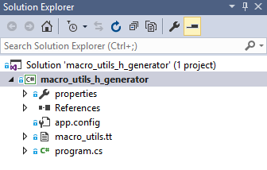
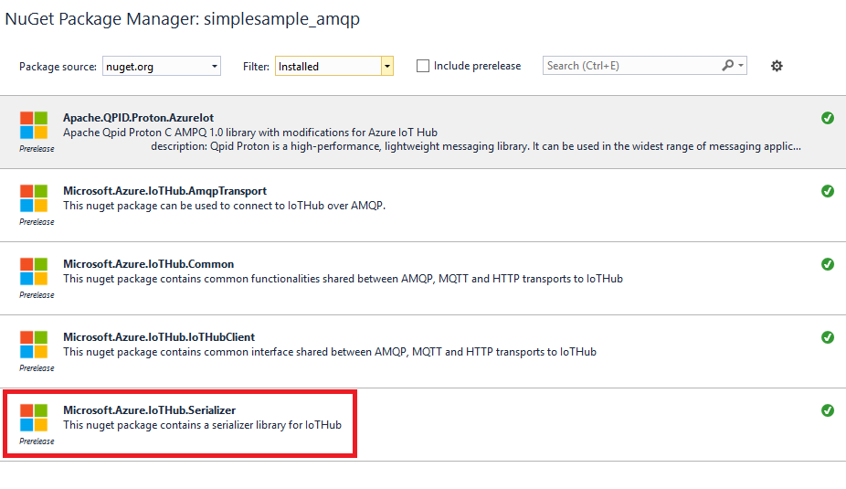

<properties
    pageTitle="Dispositivo Azure IoT SDK para C - serializador | Microsoft Azure"
    description="Saiba mais sobre como usar a biblioteca de serializador no dispositivo IoT Azure SDK para C"
    services="iot-hub"
    documentationCenter=""
    authors="olivierbloch"
    manager="timlt"
    editor=""/>

<tags
     ms.service="iot-hub"
     ms.devlang="cpp"
     ms.topic="article"
     ms.tgt_pltfrm="na"
     ms.workload="na"
     ms.date="09/06/2016"
     ms.author="obloch"/>

# <a name="microsoft-azure-iot-device-sdk-for-c--more-about-serializer"></a>Microsoft Azure IoT dispositivo SDK para C – Saiba mais sobre serializador

O [primeiro artigo](iot-hub-device-sdk-c-intro.md) desta série introduzido o **Azure IoT dispositivo SDK para C**. Próximo artigo fornecido uma descrição mais detalhada sobre o [**IoTHubClient**](iot-hub-device-sdk-c-iothubclient.md). Este artigo conclui cobertura do SDK fornecendo uma descrição mais detalhada do componente restante: a biblioteca de **serializador** .

O artigo introdutório descrita como usar a biblioteca de **serializador** para eventos de enviar e receber mensagens de IoT Hub. Neste artigo, vamos estender nessa discussão, fornecendo uma explicação mais completa de como seus dados com a linguagem de macro **serializador** de modelo. O artigo também inclui mais detalhes sobre como a biblioteca serializa mensagens (e em alguns casos, como você pode controlar o comportamento de serialização). Nós também será descrevem alguns parâmetros que você pode modificar que determinam o tamanho dos modelos que você cria.

Finalmente, o artigo reveja alguns tópicos abordados em artigos anteriores como mensagem e manipulação de propriedade. Como podemos descobrirá, esses recursos funcionam da mesma forma usando a biblioteca de **serializador** que funcionam com a biblioteca de **IoTHubClient** .

Tudo descrito neste artigo se baseia as amostras SDK **serializador** . Se você deseja acompanhar, consulte o **simplesample\_amqp** e **simplesample\_http** aplicativos incluídos no dispositivo IoT Azure SDK para C.

Você pode encontrar o **dispositivo IoT Azure SDK para C** no repositório do [Microsoft Azure IoT SDKs](https://github.com/Azure/azure-iot-sdks) GitHub e exibir os detalhes da API na [referência da API do C](http://azure.github.io/azure-iot-sdks/c/api_reference/index.html).

## <a name="the-modeling-language"></a>O idioma de modelagem

O [artigo introdutório](iot-hub-device-sdk-c-intro.md) nesta série introduzido o **Azure IoT dispositivo SDK para C** modelagem de linguagem através no exemplo fornecido na **simplesample\_amqp** aplicativo:

```
BEGIN_NAMESPACE(WeatherStation);

DECLARE_MODEL(ContosoAnemometer,
WITH_DATA(ascii_char_ptr, DeviceId),
WITH_DATA(double, WindSpeed),
WITH_ACTION(TurnFanOn),
WITH_ACTION(TurnFanOff),
WITH_ACTION(SetAirResistance, int, Position)
);

END_NAMESPACE(WeatherStation);
```

Como você pode ver, o idioma de modelagem baseia-se em C macros. Comece sempre sua definição com **inicial\_NAMESPACE** e sempre terminam com **final\_NAMESPACE**. É comum para nomear o namespace para a sua empresa ou, como neste exemplo, o projeto que você está trabalhando.

O que acontece dentro do namespace são definições de modelo. Nesse caso, há um único modelo para um anemometer. Novamente, o modelo pode ser qualquer nome, mas geralmente isso é chamado para o dispositivo ou tipo de dados que você deseja trocar com IoT Hub.  

Modelos contêm uma definição dos eventos que você pode ingresso IoT hub (os *dados*) bem como as mensagens que você pode receber de IoT Hub ( *ações*). Como você pode ver do exemplo, eventos têm um tipo e um nome; ações têm um nome e parâmetros opcionais (cada um com um tipo).

O que não é demonstrou neste exemplo são tipos de dados adicionais que são compatíveis com o SDK. Abordaremos isso a seguir.

> [AZURE.NOTE] Hub de IoT refere-se aos dados de que um dispositivo envia a ele como *eventos*, enquanto o idioma de modelagem refere-se a ele como *dados* (definido usando **WITH_DATA**). Da mesma forma, IoT Hub refere-se aos dados que enviar para dispositivos como *mensagens*, enquanto o idioma de modelagem refere-se a ele como *ações* (definido usando **WITH_ACTION**). Lembre-se de que esses termos podem ser usados alternadamente neste artigo.

### <a name="supported-data-types"></a>Tipos de dados compatíveis

Os seguintes tipos de dados são suportados no modelos criados com a biblioteca de **serializador** :

| Tipo                    | Descrição                            |
|-------------------------|----------------------------------------|
| duplo                  | dupla precisão número de ponto flutuante |
| int                     | inteiro de 32 bits                         |
| flutuação                   | número de ponto flutuante de precisão única |
| Longas                    | inteiro longo                           |
| int8\_t                 | inteiro de 8 bits                          |
| Int16\_t                | inteiro de 16 bits                         |
| Int32\_t                | inteiro de 32 bits                         |
| Int64\_t                | inteiro de 64 bits                         |
| bool                    | booliano                                |
| ASCII\_CARACT\_ptr        | Cadeia de caracteres ASCII                           |
| EDM\_data\_tempo\_deslocamento | diferença de horário de data                       |
| EDM\_GUID               | GUID                                   |
| EDM\_binário             | binário                                 |
| DECLARAR\_estrutura         | tipo de dados complexas                      |

Vamos começar com o último tipo de dados. O **DECLARE\_estrutura** permite definir tipos de dados complexos, que são agrupamentos de outros tipos primitivos. Esses agrupamentos nos permitem definir um modelo que tem esta aparência:

```
DECLARE_STRUCT(TestType,
double, aDouble,
int, aInt,
float, aFloat,
long, aLong,
int8_t, aInt8,
uint8_t, auInt8,
int16_t, aInt16,
int32_t, aInt32,
int64_t, aInt64,
bool, aBool,
ascii_char_ptr, aAsciiCharPtr,
EDM_DATE_TIME_OFFSET, aDateTimeOffset,
EDM_GUID, aGuid,
EDM_BINARY, aBinary
);

DECLARE_MODEL(TestModel,
WITH_DATA(TestType, Test)
);
```

Nosso modelo contém um evento único data do tipo **TestType**. **TestType** é um tipo complexo que inclui vários membros, que demonstram coletivamente os tipos primitivos compatíveis com o **serializador** linguagem de modelagem.

Com um modelo assim, podemos escrever código para enviar dados para o Hub de IoT que aparece da seguinte maneira:

```
TestModel* testModel = CREATE_MODEL_INSTANCE(MyThermostat, TestModel);

testModel->Test.aDouble = 1.1;
testModel->Test.aInt = 2;
testModel->Test.aFloat = 3.0f;
testModel->Test.aLong = 4;
testModel->Test.aInt8 = 5;
testModel->Test.auInt8 = 6;
testModel->Test.aInt16 = 7;
testModel->Test.aInt32 = 8;
testModel->Test.aInt64 = 9;
testModel->Test.aBool = true;
testModel->Test.aAsciiCharPtr = "ascii string 1";

time_t now;
time(&now);
testModel->Test.aDateTimeOffset = GetDateTimeOffset(now);

EDM_GUID guid = { { 0x00, 0x01, 0x02, 0x03, 0x04, 0x05, 0x06, 0x07, 0x08, 0x09, 0x0A, 0x0B, 0x0C, 0x0D, 0x0E, 0x0F } };
testModel->Test.aGuid = guid;

unsigned char binaryArray[3] = { 0x01, 0x02, 0x03 };
EDM_BINARY binaryData = { sizeof(binaryArray), &binaryArray };
testModel->Test.aBinary = binaryData;

SendAsync(iotHubClientHandle, (const void*)&(testModel->Test));
```

Basicamente, estamos atribuindo um valor para cada membro da estrutura de **teste** e, em seguida, chamar **SendAsync** para enviar o evento de dados de **teste** para a nuvem. **SendAsync** é uma função auxiliar que envia um evento de dados único para IoT Hub:

```
void SendAsync(IOTHUB_CLIENT_LL_HANDLE iotHubClientHandle, const void *dataEvent)
{
    unsigned char* destination;
    size_t destinationSize;
    if (SERIALIZE(&destination, &destinationSize, *(const unsigned char*)dataEvent) ==
    {
        // null terminate the string
        char* destinationAsString = (char*)malloc(destinationSize + 1);
        if (destinationAsString != NULL)
        {
            memcpy(destinationAsString, destination, destinationSize);
            destinationAsString[destinationSize] = '\0';
            IOTHUB_MESSAGE_HANDLE messageHandle = IoTHubMessage_CreateFromString(destinationAsString);
            if (messageHandle != NULL)
            {
                IoTHubClient_SendEventAsync(iotHubClientHandle, messageHandle, sendCallback, (void*)0);

                IoTHubMessage_Destroy(messageHandle);
            }
            free(destinationAsString);
        }
        free(destination);
    }
}
```

Esta função serializa o evento dados determinado e envia ao IoT Hub usando **IoTHubClient\_SendEventAsync**. Este é o mesmo código discutido em artigos anteriores (**SendAsync** encapsula a lógica em uma função conveniente).

Uma outra função de auxiliar usada no código anterior é **GetDateTimeOffset**. Esta função transforma tempo determinado em um valor do tipo **EDM\_data\_tempo\_deslocamento**:

```
EDM_DATE_TIME_OFFSET GetDateTimeOffset(time_t time)
{
    struct tm newTime;
    gmtime_s(&newTime, &time);
    EDM_DATE_TIME_OFFSET dateTimeOffset;
    dateTimeOffset.dateTime = newTime;
    dateTimeOffset.fractionalSecond = 0;
    dateTimeOffset.hasFractionalSecond = 0;
    dateTimeOffset.hasTimeZone = 0;
    dateTimeOffset.timeZoneHour = 0;
    dateTimeOffset.timeZoneMinute = 0;
    return dateTimeOffset;
}
```

Se você executar este código, a seguinte mensagem é enviada a IoT Hub:

```
{"aDouble":1.100000000000000, "aInt":2, "aFloat":3.000000, "aLong":4, "aInt8":5, "auInt8":6, "aInt16":7, "aInt32":8, "aInt64":9, "aBool":true, "aAsciiCharPtr":"ascii string 1", "aDateTimeOffset":"2015-09-14T21:18:21Z", "aGuid":"00010203-0405-0607-0809-0A0B0C0D0E0F", "aBinary":"AQID"}
```

Observe que a serialização é JSON, que é o formato gerado pela biblioteca de **serializador** . Observe também que cada membro do objeto JSON serializado coincide com os membros da **TestType** que definimos em nosso modelo. Os valores também iguais aqueles usados no código. No entanto, observe que os dados binários codificado na Base 64: "AQID" é o base64 codificação de {0x01, 0x02, 0x03}.

Este exemplo demonstra a vantagem de usar a biblioteca de **serializador** – ele nos permite enviar JSON para a nuvem, sem ter de explicitamente lidar com serialização em nosso aplicativo. Temos preocupar está definindo os valores dos eventos de dados em nosso modelo e, em seguida, chamar APIs simples para enviar os eventos para a nuvem.

Com essas informações, podemos definir modelos que incluem o intervalo de tipos de dados com suporte, incluindo tipos complexos (nós pode até mesmo incluir tipos complexos dentro de outros tipos complexos). No entanto, ele serializado JSON gerado pelo exemplo acima traz um ponto importante. *Como* podemos enviar dados com a biblioteca de **serializador** determina exatamente como o JSON é formado. Nesse momento específico é próximo, abordaremos.

## <a name="more-about-serialization"></a>Mais informações sobre serialização

A seção anterior realça um exemplo da saída gerado pela biblioteca de **serializador** . Nesta seção, explicaremos como a biblioteca serializa dados e como você pode controlar esse comportamento usando a serialização APIs.

Para Avançar a discussão sobre serialização, podemos trabalhará com um novo modelo com base em um termostato. Primeiro, vamos fornecer algumas informações básicas sobre o cenário estamos tentando endereço.

Queremos um termostato medir temperatura e umidade de modelo. Cada parte dos dados vai ser enviadas à IoT Hub diferente. Por padrão, os ingresses termostato um evento de temperatura uma vez a cada 2 minutos; um evento de umidade é ingressed uma vez a cada 15 minutos. Quando o evento for ingressed, ele deve incluir um carimbo de hora que mostra o tempo que a temperatura correspondente ou umidade foi medida.

Neste cenário, demonstraremos duas maneiras diferentes para os dados de modelo e explicaremos o efeito que modelagem tem na saída serializada.

### <a name="model-1"></a>Modelo 1

Aqui está a primeira versão de um modelo que ofereça suporte a situação anterior:

```
BEGIN_NAMESPACE(Contoso);

DECLARE_STRUCT(TemperatureEvent,
int, Temperature,
EDM_DATE_TIME_OFFSET, Time);

DECLARE_STRUCT(HumidityEvent,
int, Humidity,
EDM_DATE_TIME_OFFSET, Time);

DECLARE_MODEL(Thermostat,
WITH_DATA(TemperatureEvent, Temperature),
WITH_DATA(HumidityEvent, Humidity)
);

END_NAMESPACE(Contoso);
```

Observe que o modelo inclui dois eventos de dados: **temperatura** e **umidade**. Ao contrário dos exemplos anteriores, o tipo de cada evento é uma estrutura definida usando **DECLARE\_estrutura**. **TemperatureEvent** inclui uma medida de temperatura e um carimbo de hora; **HumidityEvent** contém uma medida de umidade e um carimbo de hora. Este modelo nos dá uma maneira natural para modelar os dados para o cenário descrito acima. Quando podemos enviar um evento para a nuvem, seja no modo enviaremos um temperatura/carimbo de hora ou um par de umidade/carimbo de hora.

Podemos enviar um evento de temperatura na nuvem usando código como o seguinte:

```
time_t now;
time(&now);
thermostat->Temperature.Temperature = 75;
thermostat->Temperature.Time = GetDateTimeOffset(now);

unsigned char* destination;
size_t destinationSize;
if (SERIALIZE(&destination, &destinationSize, thermostat->Temperature) == IOT_AGENT_OK)
{
    sendMessage(iotHubClientHandle, destination, destinationSize);
}
```

Podemos usarei valores embutidos para temperatura e umidade no código de exemplo, mas imagine que realmente estiver recuperando esses valores por amostragem os sensores correspondentes no termostato.

O código acima usa o auxiliar **GetDateTimeOffset** que foi introduzido anteriormente. Por razões que se tornarão limpar posteriores, este código explicitamente separa a tarefa de serialização e enviando o evento. O código anterior serializa o evento de temperatura em um buffer. Em seguida, **sendMessage** é uma função auxiliar (incluído no **simplesample\_amqp**) que envia o evento IoT Hub:

```
static void sendMessage(IOTHUB_CLIENT_HANDLE iotHubClientHandle, const unsigned char* buffer, size_t size)
{
    static unsigned int messageTrackingId;
    IOTHUB_MESSAGE_HANDLE messageHandle = IoTHubMessage_CreateFromByteArray(buffer, size);
    if (messageHandle != NULL)
    {
        IoTHubClient_SendEventAsync(iotHubClientHandle, messageHandle, sendCallback, (void*)(uintptr_t)messageTrackingId);

        IoTHubMessage_Destroy(messageHandle);
    }
    free((void*)buffer);
}
```

Este código é um subconjunto da auxiliar **SendAsync** descrito na seção anterior, então vamos não sobre ele novamente aqui.

Ao executar o código anterior para enviar o evento de temperatura, este formulário serializado do evento é enviado para IoT Hub:

```
{"Temperature":75, "Time":"2015-09-17T18:45:56Z"}
```

Nós estiver enviando uma temperatura que é do tipo **TemperatureEvent** e essa estrutura contém um membro de **temperatura** e **tempo** . Isso é refletido diretamente nos dados serializados.

Da mesma forma, podemos enviar um evento de umidade com este código:

```
thermostat->Humidity.Humidity = 45;
thermostat->Humidity.Time = GetDateTimeOffset(now);
if (SERIALIZE(&destination, &destinationSize, thermostat->Humidity) == IOT_AGENT_OK)
{
    sendMessage(iotHubClientHandle, destination, destinationSize);
}
```

O formulário serializado que é enviado para IoT Hub aparece da seguinte maneira:

```
{"Humidity":45, "Time":"2015-09-17T18:45:56Z"}
```

Novamente, isso é conforme esperado.

Com esse modelo, você pode imaginar eventos como adicionais podem ser adicionados facilmente. Você define mais estruturas usando **DECLARE\_estrutura**e incluir o evento correspondente no modelo usando **com\_dados**.

Agora, vamos modificar o modelo para que inclua os mesmos dados, mas com uma estrutura diferente.

### <a name="model-2"></a>Modelo 2

Considere esse modelo alternativo acima:

```
DECLARE_MODEL(Thermostat,
WITH_DATA(int, Temperature),
WITH_DATA(int, Humidity),
WITH_DATA(EDM_DATE_TIME_OFFSET, Time)
);
```

Nesse caso eliminamos a **DECLARE\_estrutura** macros e simplesmente está definindo os itens de dados de nosso cenário usando tipos simples do idioma modelagem.

Apenas para o momento vamos ignorar o evento de **tempo** . Com essa exceção, aqui está o código para ingresso **temperatura**:

```
time_t now;
time(&now);
thermostat->Temperature = 75;

unsigned char* destination;
size_t destinationSize;
if (SERIALIZE(&destination, &destinationSize, thermostat->Temperature) == IOT_AGENT_OK)
{
    sendMessage(iotHubClientHandle, destination, destinationSize);
}
```

Este código envia o seguinte evento serializado IoT Hub:

```
{"Temperature":75}
```

E o código para enviar o evento umidade aparece da seguinte maneira:

```
thermostat->Humidity = 45;
if (SERIALIZE(&destination, &destinationSize, thermostat->Humidity) == IOT_AGENT_OK)
{
    sendMessage(iotHubClientHandle, destination, destinationSize);
}
```

Este código envia isso para IoT Hub:

```
{"Humidity":45}
```

Até o momento ainda existem sem surpresas. Agora vamos alterar como podemos usar a macro SERIALIZE.

A macro **SERIALIZE** pode demorar vários eventos de dados como argumentos. Isso nos permite serializar o evento de **temperatura** e **umidade** juntos e enviá-los para IoT Hub em uma chamada:

```
if (SERIALIZE(&destination, &destinationSize, thermostat->Temperature, thermostat->Humidity) == IOT_AGENT_OK)
{
    sendMessage(iotHubClientHandle, destination, destinationSize);
}
```

Você pode imaginar que o resultado desse código é que eventos de dois dados são enviados para IoT Hub:

[

{"Temperatura": 75},

{"Umidade": 45}

]

Em outras palavras, você pode esperar que esse código é a mesma que enviar **temperatura** e **umidade** separadamente. É apenas uma conveniência para passar os dois eventos para **colocar** na mesma chamada. No entanto, que não é o caso. Em vez disso, o código acima envia esse evento de dados único para IoT Hub:

{"Temperatura": 75, "umidade": 45}

Isso pode parecer estranho, pois nosso modelo define **temperatura** e **umidade** como dois eventos *separados* :

```
DECLARE_MODEL(Thermostat,
WITH_DATA(int, Temperature),
WITH_DATA(int, Humidity),
WITH_DATA(EDM_DATE_TIME_OFFSET, Time)
);
```

Mais para o ponto, podemos não modelar esses eventos **temperatura** e **umidade** anotados na mesma estrutura:

```
DECLARE_STRUCT(TemperatureAndHumidityEvent,
int, Temperature,
int, Humidity,
);

DECLARE_MODEL(Thermostat,
WITH_DATA(TemperatureAndHumidityEvent, TemperatureAndHumidity),
);
```

Se usamos esse modelo, será mais fácil de compreender como **temperatura** e **umidade** seriam enviado na mesma mensagem serializada. Entretanto pode não ser limpar por que ele funciona dessa forma quando você passa ambos os eventos de dados para **colocar** em usando modelo 2.

Esse comportamento é mais fácil de compreender se você souber as suposições que está fazendo a biblioteca de **serializador** . Faça sentido isso vamos voltar para nosso modelo:

```
DECLARE_MODEL(Thermostat,
WITH_DATA(int, Temperature),
WITH_DATA(int, Humidity),
WITH_DATA(EDM_DATE_TIME_OFFSET, Time)
);
```

Considere esse modelo em termos de orientados a objeto. Nesse caso nós estiver modelagem em um dispositivo físico (um termostato) e dispositivo inclui atributos como **temperatura** e **umidade**.

Podemos enviar todo o estado de nosso modelo com código como o seguinte:

```
if (SERIALIZE(&destination, &destinationSize, thermostat->Temperature, thermostat->Humidity, thermostat->Time) == IOT_AGENT_OK)
{
    sendMessage(iotHubClientHandle, destination, destinationSize);
}
```

Supondo que os valores de temperatura, umidade e hora estão definidas, veremos um evento assim enviadas para IoT Hub:

```
{"Temperature":75, "Humidity":45, "Time":"2015-09-17T18:45:56Z"}
```

Às vezes, pode apenas deseja enviar *algumas* propriedades do modelo na nuvem (Isso é especialmente verdadeiro se o seu modelo contiver um grande número de eventos de dados). É útil enviar apenas um subconjunto dos eventos de dados, como em nosso exemplo anterior:

```
{"Temperature":75, "Time":"2015-09-17T18:45:56Z"}
```

Isso gera exatamente o mesmo evento serializado como se tinha definimos um **TemperatureEvent** com um membro de **temperatura** e **tempo** , como fizemos com modelo 1. Nesse caso, pudemos gerar exatamente o mesmo evento serializado usando um modelo diferente (modelo 2) porque podemos chamado **SERIALIZE** de maneira diferente.

O ponto importante é que se você passar vários eventos de dados para **SERIALIZE,** e em seguida, ele pressupõe que cada evento é uma propriedade em um único objeto JSON.

A melhor abordagem depende de você e como você acha sobre seu modelo. Se você estiver enviando "eventos" na nuvem e cada evento contém um conjunto de propriedades definido, a primeira abordagem faz muito sentido. Nesse caso você usaria **DECLARE\_estrutura** para definir a estrutura de cada evento e, em seguida, incluí-los no seu modelo com a **com\_dados** macro. Depois que você envia cada evento como fizemos no primeiro exemplo acima. Nesta abordagem você só faria passar um evento de dados único para **SERIALIZADOR**.

Se você pensar em seu modelo de maneira orientados a objeto, em seguida, a segunda abordagem pode suas necessidades. Nesse caso, os elementos definidos usando **com\_dados** são as "propriedades" do objeto. Você pode passar qualquer subconjunto de eventos de **SERIALIZE** que você goste, dependendo do quanto do seu estado do objeto"" que você deseja enviar para a nuvem.

Nether abordagem é certa ou errada. Apenas lembre-se de como a biblioteca de **serializador** funciona e escolha a abordagem de modelagem que melhor se adapta às suas necessidades.

## <a name="message-handling"></a>Manipulação de mensagens

Até o momento neste artigo somente tem discutido envio eventos para IoT Hub e não foi endereçada recebendo mensagens. O motivo para isso é que o que precisa saber sobre o recebimento de mensagens amplamente foi coberto em um [artigo anterior](iot-hub-device-sdk-c-intro.md). Lembre-se do artigo que você processa mensagens registrando uma função de retorno de chamada de mensagens:

```
IoTHubClient_SetMessageCallback(iotHubClientHandle, IoTHubMessage, myWeather)
```

Você então escreve a função de retorno de chamada que é chamada quando uma mensagem for recebida:

```
static IOTHUBMESSAGE_DISPOSITION_RESULT IoTHubMessage(IOTHUB_MESSAGE_HANDLE message, void* userContextCallback)
{
    IOTHUBMESSAGE_DISPOSITION_RESULT result;
    const unsigned char* buffer;
    size_t size;
    if (IoTHubMessage_GetByteArray(message, &buffer, &size) != IOTHUB_MESSAGE_OK)
    {
        printf("unable to IoTHubMessage_GetByteArray\r\n");
        result = EXECUTE_COMMAND_ERROR;
    }
    else
    {
        /*buffer is not zero terminated*/
        char* temp = malloc(size + 1);
        if (temp == NULL)
        {
            printf("failed to malloc\r\n");
            result = EXECUTE_COMMAND_ERROR;
        }
        else
        {
            memcpy(temp, buffer, size);
            temp[size] = '\0';
            EXECUTE_COMMAND_RESULT executeCommandResult = EXECUTE_COMMAND(userContextCallback, temp);
            result =
                (executeCommandResult == EXECUTE_COMMAND_ERROR) ? IOTHUBMESSAGE_ABANDONED :
                (executeCommandResult == EXECUTE_COMMAND_SUCCESS) ? IOTHUBMESSAGE_ACCEPTED :
                IOTHUBMESSAGE_REJECTED;
            free(temp);
        }
    }
    return result;
}
```

Essa implementação do **IoTHubMessage** chama a função específica para cada ação no seu modelo. Por exemplo, se seu modelo define esta ação:

```
WITH_ACTION(SetAirResistance, int, Position)
```

Você deve definir uma função com essa assinatura:

```
EXECUTE_COMMAND_RESULT SetAirResistance(ContosoAnemometer* device, int Position)
{
    (void)device;
    (void)printf("Setting Air Resistance Position to %d.\r\n", Position);
    return EXECUTE_COMMAND_SUCCESS;
}
```

**SetAirResistance** é então chamado quando essa mensagem é enviada para o seu dispositivo.

Nós ainda não explicadas ainda como fica o a versão serializada da mensagem. Em outras palavras, se você quiser enviar uma mensagem de **SetAirResistance** para o seu dispositivo, que aparência?

Se você estiver enviando uma mensagem para um dispositivo, você faria isso pelo serviço do Azure IoT SDK. Você ainda precisa saber quais cadeia de caracteres para enviar para invocar uma determinada ação. O formato geral para enviar uma mensagem aparece da seguinte maneira:

```
{"Name" : "", "Parameters" : "" }
```

Você está enviando um objeto JSON serializado com duas propriedades: **nome** é o nome da ação (mensagem) e **parâmetros** contém os parâmetros de ação.

Por exemplo, para chamar **SetAirResistance** , você pode enviar esta mensagem para um dispositivo:

```
{"Name" : "SetAirResistance", "Parameters" : { "Position" : 5 }}
```

O nome da ação deve corresponder exatamente uma ação definida no modelo. Os nomes de parâmetro devem corresponder também. Observe também entre maiusculas e minúsculas. **Nome** e **parâmetros** são sempre em maiusculas. Certifique-se corresponder a capitalização do seu nome de ação e parâmetros no seu modelo. Neste exemplo, o nome da ação é "SetAirResistance" e não "setairresistance".

Esta seção descrito tudo o que você precisa saber quando eventos de envio e recebimento de mensagens com a biblioteca de **serializador** . Antes de passar, vamos abordar alguns parâmetros podem ser configurados que controlam como grandes seu modelo for.

## <a name="macro-configuration"></a>Configuração de macro

Se você estiver usando a biblioteca de **serializador** uma parte importante do SDK a serem consideradas encontra-se na biblioteca do azure-c-compartilhados-utilitário.
Se você tiver clonar repositório Azure-iot-sdks do GitHub usando a opção – recursiva, você encontrará essa biblioteca de utilitário compartilhado aqui:

```
.\\c\\azure-c-shared-utility
```

Se você não tiver clonar a biblioteca, você pode encontrá-lo [aqui](https://github.com/Azure/azure-c-shared-utility).

Dentro da biblioteca de utilitário compartilhado, você encontrará a seguinte pasta:

```
azure-c-shared-utility\\macro\_utils\_h\_generator.
```

Esta pasta contém uma solução do Visual Studio chamada **macro\_utilitários\_h\_generator.sln**:

  

O programa nesta solução gera o **macro\_utils.h** arquivo. Não há uma macro padrão\_utils.h arquivo incluído com o SDK. Essa solução permite que você modifique alguns parâmetros e, em seguida, recriar o arquivo de cabeçalho com base nesses parâmetros.

Os dois parâmetros chaves preocupem com são **nArithmetic** e **nMacroParameters** que são definidos nessas duas linhas encontradas na macro\_utils.tt:

```
<#int nArithmetic=1024;#>
<#int nMacroParameters=124;/*127 parameters in one macro definition in C99 in chapter 5.2.4.1 Translation limits*/#>

```

Esses valores são os parâmetros padrão incluídos com o SDK. Cada parâmetro tem o seguinte significado:

-   nMacroParameters – controla quantos parâmetros que você pode ter em um DECLARE\_definição de macro do modelo.

-   nArithmetic – controla o número total de membros permitido em um modelo.

O motivo que esses parâmetros são importantes é porque eles controlam como grandes seu modelo pode ser. Por exemplo, considere esta definição de modelo:

```
DECLARE_MODEL(MyModel,
WITH_DATA(int, MyData)
);
```

Conforme mencionado anteriormente, **DECLARE\_modelo** é apenas uma macro de C. Os nomes do modelo e a **com\_dados** instrução (mas outra macro) é parâmetros de **DECLARE\_modelo**. **nMacroParameters** define quantos parâmetros podem ser incluídos em **DECLARE\_modelo**. Na verdade, isso define declarações quantos para o evento e ação do dados, você pode ter. Assim, com o limite padrão de 124 isso significa que você pode definir um modelo com uma combinação de cerca de 60 ações e eventos de dados. Se você tentar exceder esse limite, você receberá erros de compilador aparência semelhantes a esta:

  

O parâmetro **nArithmetic** é mais sobre o funcionamento interno da linguagem de macro que seu aplicativo.  Ele controla o número total de membros, que você pode ter no seu modelo, incluindo **DECLARE_STRUCT** macros. Se você começar vendo erros de compilador como esta, você deve tentar aumentar **nArithmetic**:

   

Se você quiser alterar esses parâmetros, modifique os valores na macro\_utils.tt arquivo, recompilar a macro\_utilitários\_h\_generator.sln solução e executar o programa compilado. Quando fizer isso, uma nova macro\_utils.h arquivo é gerado e inserido na. \\comuns\\diretório inc.

Para poder usar a nova versão da macro\_utils.h, remova o pacote de NuGet **serializador** a sua solução e em seu lugar incluem o projeto do Visual Studio **serializador** . Isso permite que seu código compilar contra o código-fonte da biblioteca serializador. Isso inclui a macro atualizada\_utils.h. Se você quiser fazer isso para **simplesample\_amqp**, inicie removendo o pacote do NuGet para a biblioteca de serializador da solução:

   

Em seguida, adicione esse projeto à sua solução do Visual Studio:

> . \\c\\serializador\\construir\\windows\\serializer.vcxproj

Quando terminar, sua solução deve ter esta aparência:

   

Agora quando você compila sua solução, a macro atualizada\_utils.h está incluído em seu binário.

Observe que esses valores altas suficiente crescentes podem exceder limites de compilador. Neste ponto, o **nMacroParameters** é o principal parâmetro com o qual se preocupar. A especificação de C99 Especifica que um mínimo de 127 parâmetros são permitidas em uma definição de macro. O compilador Microsoft segue as especificações exatamente (e tem um limite de 127), para que você não poderá aumentar **nMacroParameters** além do padrão. Outros compiladores podem lhe permitem fazer isso (por exemplo, o compilador GNU suporta um limite superior).

Até agora podemos abordados quase tudo o que você precisa saber sobre como escrever código com a biblioteca de **serializador** . Antes de concluir, vamos rever alguns tópicos de artigos anteriores que você pode estar se perguntando sobre.

## <a name="the-lower-level-apis"></a>As APIs de nível inferior

O aplicativo de exemplo na qual este artigo focado é **simplesample\_amqp**. Este exemplo usa o nível mais alto (a não-"LL") APIs para eventos de enviar e receber mensagens. Se você usar essas APIs, um segmento de plano de fundo executa que cuida do tanto eventos de enviar e receber mensagens. No entanto, você pode usar as APIs do nível inferior (IL) para eliminar esse thread de plano de fundo e assumir controle explícito quando você envia eventos ou recebe mensagens da nuvem.

Conforme descrito em um [artigo anterior](iot-hub-device-sdk-c-iothubclient.md), há um conjunto de funções que consiste as APIs de nível superior:

-   IoTHubClient\_CreateFromConnectionString

-   IoTHubClient\_SendEventAsync

-   IoTHubClient\_SetMessageCallback

-   IoTHubClient\_Destroy

Essas APIs são demonstrou no **simplesample\_amqp**.

Também há um análogo conjunto de APIs de nível inferior.

-   IoTHubClient\_LL\_CreateFromConnectionString

-   IoTHubClient\_LL\_SendEventAsync

-   IoTHubClient\_LL\_SetMessageCallback

-   IoTHubClient\_LL\_Destroy

Observe que as APIs de nível inferior funcionam exatamente da mesma maneira, conforme descrito nos artigos anteriores. Você pode usar o primeiro conjunto de APIs se quiser que um segmento de plano de fundo para tratar eventos enviando e recebendo mensagens. Você usar o segundo conjunto de APIs se quiser que o controle explícito sobre quando você envia e recebe dados do IoT Hub. O conjunto de trabalho APIs igualmente bem com a biblioteca de **serializador** .

Para obter um exemplo de como as APIs de nível inferior são usadas com a biblioteca de **serializador** , consulte o **simplesample\_http** aplicativo.

## <a name="additional-topics"></a>Tópicos adicionais

Alguns outros tópicos vale a pena mencionar novamente são propriedade manipulando, usando credenciais de dispositivo alternativo e opções de configuração. Esses são todos os tópicos abordados em um [artigo anterior](iot-hub-device-sdk-c-iothubclient.md). O ponto principal é que todos esses recursos funcionam da mesma maneira com a biblioteca de **serializador** como com a biblioteca de **IoTHubClient** . Por exemplo, se desejar anexar propriedades para um evento do seu modelo, usar **IoTHubMessage\_propriedades** e **mapa**\_**AddorUpdate**, da mesma maneira descrito anteriormente:

```
MAP_HANDLE propMap = IoTHubMessage_Properties(message.messageHandle);
sprintf_s(propText, sizeof(propText), "%d", i);
Map_AddOrUpdate(propMap, "SequenceNumber", propText);
```

Se o evento foi gerado da biblioteca do **serializador** ou criou manualmente usando a biblioteca de **IoTHubClient** não importa.

Para as credenciais de dispositivo alternativo, usando **IoTHubClient\_LL\_criar** funciona tão bem como **IoTHubClient\_CreateFromConnectionString** para alocar um **IOTHUB\_cliente\_lidar com**.

Finalmente, se você estiver usando a biblioteca de **serializador** , você pode definir opções de configuração **IoTHubClient\_LL\_SetOption** apenas como fez quando usando a biblioteca de **IoTHubClient** .

Um recurso que é exclusivo para a biblioteca de **serializador** são a inicialização APIs. Antes de você pode começar a trabalhar com a biblioteca, você deve chamar **serializador\_inicialização**:

```
serializer_init(NULL);
```

Isso é feito logo antes de chamar **IoTHubClient\_CreateFromConnectionString**.

Da mesma forma, quando você terminar de trabalhar com a biblioteca, a última chamada que você vai fazer é **serializador\_deinit**:

```
serializer_deinit();
```

Caso contrário, todos os outros recursos listados acima funcionam a mesma na biblioteca **serializador** como na biblioteca **IoTHubClient** . Para obter mais informações sobre qualquer um desses tópicos, consulte o [artigo anterior](iot-hub-device-sdk-c-iothubclient.md) desta série.

## <a name="next-steps"></a>Próximas etapas

Este artigo descreve detalhadamente os aspectos exclusivos da biblioteca **serializador** contidos no **dispositivo IoT Azure SDK para C**. Com as informações fornecidas a que você deve ter uma boa compreensão de como usar modelos para eventos de enviar e receber mensagens de IoT Hub.

Isso também conclui a série de três partes sobre como desenvolver aplicativos com o **Azure IoT dispositivo SDK para C**. Isso deve ser informações suficientes para não apenas iniciá-lo, mas dará uma compreensão completa de como funcionam as APIs. Para obter informações adicionais, há alguns exemplos no SDK não abordado aqui. Caso contrário, a [documentação do SDK](https://github.com/Azure/azure-iot-sdks) é um bom recurso para obter informações adicionais.


Para saber mais sobre como desenvolver para IoT Hub, consulte os [IoT Hub SDKs][lnk-sdks].

Para explorar os recursos do IoT Hub, consulte:

- [Simular um dispositivo com o SDK do Gateway IoT][lnk-gateway]

[lnk-sdks]: iot-hub-devguide-sdks.md

[lnk-gateway]: iot-hub-linux-gateway-sdk-simulated-device.md
