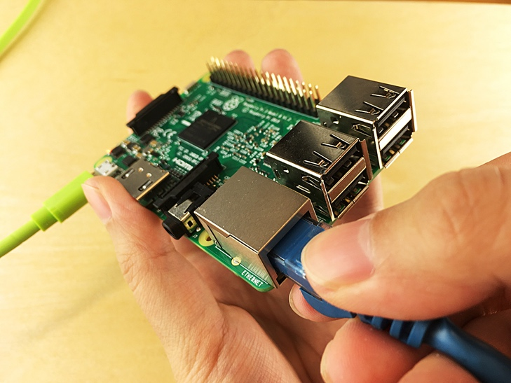

<properties
 pageTitle="Configurar seu dispositivo | Microsoft Azure"
 description="Configurar seu framboesa Pi 3 para o primeiro uso e instalar o sistema operacional Raspbian, um sistema operacional gratuito que é otimizado para o hardware framboesa Pi."
 services="iot-hub"
 documentationCenter=""
 authors="shizn"
 manager="timlt"
 tags=""
 keywords=""/>

<tags
 ms.service="iot-hub"
 ms.devlang="multiple"
 ms.topic="article"
 ms.tgt_pltfrm="na"
 ms.workload="na"
 ms.date="10/21/2016"
 ms.author="xshi"/>

# 1.1 configurar seu dispositivo

## 1.1.1 o que você fará

Configure seu Pi para o primeiro uso e instalar o sistema operacional Raspbian, um sistema operacional gratuito que é otimizado para o hardware framboesa Pi. Se você atender a todos os problemas, busca soluções na [página de solução de problemas](iot-hub-raspberry-pi-kit-node-troubleshooting.md).

## 1.1.2 o que você aprenderá

Nesta seção, você aprenderá:

- Como instalar Raspbian em seu Pi
- Como ligar seu Pi usando um cabo USB
- Como conectar seu Pi à rede usando um cabo Ethernet ou Wi-Fi
- Como adicionar um LED para o breadboard e conecte-o ao seu Pi

## 1.1.3 o que é necessário

Para concluir esta seção, necessárias as seguintes partes do seu framboesa Pi 3 Starter Kit:

- O quadro de framboesa Pi 3
- O cartão de MicroSD de 16GB
- A 5 v 2A alimentação com o cabo USB da micro seis pés
- O breadboard
- Fios de conector
- Uma resistência Ohm 560
- Um LED difusos de 10mm
- O cabo Ethernet

Você também precisa:

- Uma conexão com ou sem fio para seu Pi para se conectar ao
- Um USB adaptador ou mini SD cartão SD para gravar a imagem do sistema operacional no cartão MicroSD.
- Um computador executando o Windows, Mac ou Linux. O computador é usado para instalar o Raspbian no cartão de MicroSD.
- Uma conexão de Internet para baixar as ferramentas necessárias e software

## 1.1.4 instalar Raspbian no cartão de MicroSD

Prepare o cartão de MicroSD para gravar a imagem Raspbian.

1. Baixe o Raspbian.
  1. [Baixar](https://www.raspberrypi.org/downloads/raspbian/) o arquivo zip para Raspbian Jessie com Pixel.
  2. Extraia a imagem Raspbian em uma pasta em seu computador.
2. Instale o Raspbian ao cartão MicroSD.
  1. [Baixe](https://www.etcher.io) e instale o utilitário de gravador de placa de Etcher SD.
  2. Execute Etcher e selecione a imagem de Raspbian extraído na etapa 1.
  3. Selecione a unidade de cartão de MicroSD.
    Observação: Etcher pode já tiver selecionado a unidade correta.
  4. Clique em Flash para instalar Raspbian ao cartão MicroSD.
  5. Remova o cartão de MicroSD do computador após a conclusão.
    Observação: É segura para remover o cartão de MicroSD diretamente porque Etcher automaticamente ejeta ou desmonta o cartão de MicroSD após a conclusão.
  6. Insira o cartão de MicroSD seu Pi.

## 1.1.5 Ligue seu Pi

Ligue seu Pi usando o cabo USB micro e alimentação.

> [AZURE.NOTE] É importante usar a fonte de alimentação no kit que tenha pelo menos 2A para certificar-se de que seu framboesa é tio com energia suficiente para funcionar corretamente.

## 1.1.6 conectar seu framboesa Pi 3 à rede

Você pode conectar seu Pi para uma rede com fio ou uma rede sem fio. Certifique-se de que seu Pi está conectado à mesma rede que o seu computador. Por exemplo, você pode conectar seu Pi ao mesmo switch que o computador está conectado ao.

### 1.1.6.1 conectar a uma rede com fio

Use o cabo Ethernet para conectar seu Pi à sua rede com fio. O dois LED com seu Pi ative se a conexão for estabelecida.

### 1.1.6.2 conectar a uma rede sem fio

Siga as [instruções](https://www.raspberrypi.org/learning/software-guide/wifi/) da fundação de Pi framboesa para se conectar seu Pi à sua rede sem fio. Estas instruções exigem que você primeiro se conectar um monitor e um teclado ao seu Pi.

## 1.1.7 conectar o LED ao seu Pi

Para concluir essa tarefa, use o [breadboard](https://learn.sparkfun.com/tutorials/how-to-use-a-breadboard), os cabos de conector, o LED e a resistência. Você pode conectá-las para as portas de [entrada/saída geral](https://www.raspberrypi.org/documentation/usage/gpio/) (GPIO) de seu Pi. 

1. Conecte o trecho mais curto do LED ao **GPIO GND (Pin 6)**.
2. Conecte o trecho mais do LED um trecho da resistência.
3. Conecte o outro segmento da resistência à **GPIO 4 (pino 7)**.

Observe que a polaridade LED é importante. Esta configuração de polaridade é conhecida como baixo ativo.

Congratulation! Você configurou com êxito seu Pi.

## 1.1.8 resumo de

Nesta seção, você aprendeu como configurar seu Pi instalando Raspbian, conectando seu Pi a uma rede e conectando um LED ao seu Pi. Observe que o LED ainda não acende. Na próxima seção, você instala as ferramentas necessárias e o software em preparação para a execução de um aplicativo de exemplo em seu Pi.

## Próximas etapas

[1.2 Obtenha as ferramentas](iot-hub-raspberry-pi-kit-node-lesson1-get-the-tools-win32.md)
