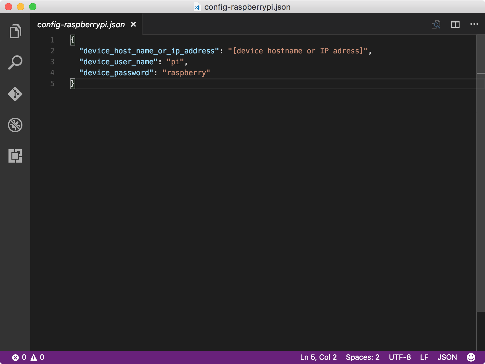

<properties
 pageTitle="Criar e implantar o aplicativo de piscar | Microsoft Azure"
 description="Clonar a amostra Node do aplicativo Github e gulp para implantar esse aplicativo para seu quadro de framboesa Pi 3. Este aplicativo de amostra pisca o LED conectado ao quadro de cada dois segundos."
 services="iot-hub"
 documentationCenter=""
 authors="shizn"
 manager="timlt"
 tags=""
 keywords=""/>

<tags
 ms.service="iot-hub"
 ms.devlang="multiple"
 ms.topic="article"
 ms.tgt_pltfrm="na"
 ms.workload="na"
 ms.date="10/21/2016"
 ms.author="xshi"/>

# <a name="13-create-and-deploy-the-blink-application"></a>1.3 criar e implantar o aplicativo piscando

## <a name="131-what-you-will-do"></a>1.3.1 o que você fará

Clonar a amostra Node do aplicativo Github e use a ferramenta de vez para implantar o aplicativo de amostra para seu framboesa Pi 3. O aplicativo de exemplo pisca o LED conectado ao quadro de cada dois segundos. Se você atender a todos os problemas, busca soluções na [página de solução de problemas](iot-hub-raspberry-pi-kit-node-troubleshooting.md).

## <a name="132-what-you-will-learn"></a>1.3.2 o que você aprenderá

- Como usar o `device-discover-cli` ferramenta para recuperar informações de rede sobre seu Pi.
- Como implantar e executar o aplicativo de amostra no seu Pi.
- Como implantar e depurar aplicativos executados remotamente em seu Pi.

## <a name="133-what-you-need"></a>1.3.3 o que é necessário

Você deve concluir com êxito as seções a seguir na lição 1:

- [Configurar seu dispositivo](iot-hub-raspberry-pi-kit-node-lesson1-configure-your-device.md)
- [Obtenha as ferramentas](iot-hub-raspberry-pi-kit-node-lesson1-get-the-tools-win32.md)

## <a name="134-obtain-the-ip-address-and-host-name-of-your-pi"></a>1.3.4 obter o nome de host e endereço IP de seu Pi

Abra um prompt de comando no Windows ou uma janela de terminal no macOS ou Ubuntu e, em seguida, execute o seguinte comando:

```bash
devdisco list --eth
```

Você deve ver uma saída semelhante à seguinte:


Anote o `IP address` e `hostname` de seu Pi. Você precisará dessas informações nesta seção.

> [AZURE.NOTE] Certifique-se de que seu Pi está conectado à mesma rede que o seu computador. Por exemplo, se o computador está conectado a uma rede sem fio enquanto seu Pi estiver conectado a uma rede com fio, você não pode ver o endereço IP na saída devdisco.

## <a name="135-clone-the-sample-application"></a>1.3.5 clonar o aplicativo de exemplo

Para abrir o código de exemplo, siga estas etapas:

1. Clone o repositório de amostra do Github executando o seguinte comando:

    ```bash
    git clone https://github.com/Azure-Samples/iot-hub-node-raspberrypi-getting-started.git
    ```

2. Abra o aplicativo de exemplo no Visual Studio código executando os seguintes comandos:

    ```bash
    cd iot-hub-node-raspberrypi-getting-started
    cd Lesson1
    code .
    ```


O `app.js` de arquivo no `app` subpasta é o arquivo de origem de chave que contém o código para controlar o LED.

### <a name="136-install-application-dependencies"></a>1.3.6 instalar dependências de aplicativos

Instale as bibliotecas e outros módulos que necessárias para o aplicativo de exemplo, execute o seguinte comando:

```bash
npm install
```

## <a name="137-configure-the-device-connection"></a>1.3.7 configurar a conexão do dispositivo

Para configurar a conexão do dispositivo, siga estas etapas:

1. Gere o arquivo de configuração de dispositivo, execute o seguinte comando:

    ```bash
    gulp init
    ```

    O arquivo de configuração `config-raspberrypi.json` contém as credenciais do usuário que você usa para fazer logon no seu Pi. Para evitar a perda de credenciais do usuário, o arquivo de configuração é gerado na subpasta `.iot-hub-getting-started` da pasta inicial em seu computador.

2. Abra o arquivo de configuração de dispositivo no Visual Studio código executando o seguinte comando:

    ```bash
    # For Windows command prompt
    code %USERPROFILE%\.iot-hub-getting-started\config-raspberrypi.json

    # For macOS or Ubuntu
    code ~/.iot-hub-getting-started/config-raspberrypi.json
    ```

3. Substituir o espaço reservado `[device hostname or IP address]` com o endereço IP ou o nome de host que você obtém seção 1.3.4.

    

Parabéns! Você criou com êxito o primeiro aplicativo de amostra para seu Pi.

## <a name="138-deploy-and-run-the-sample-application"></a>1.3.8 implantar e executar o aplicativo de amostra

### <a name="1381-install-nodejs-and-npm-on-your-pi"></a>1.3.8.1 instalar node e NPM no seu Pi

Instale node e NPM no seu Pi executando o seguinte comando:

```bash
gulp install-tools
```

Pode demorar dez minutos para concluir a primeira vez que você executar essa tarefa.

### <a name="1382-deploy-and-run-the-sample-app"></a>1.3.8.2 implantar e executar o aplicativo de amostra

Implante e execute o aplicativo de amostra em executando o seguinte comando:

```bash
gulp deploy && gulp run
```

### <a name="1383-verify-the-app-works"></a>1.3.8.3 Verifique se o aplicativo funciona

Agora você deve ver o LED no seu Pi piscando cada dois segundos.  Se você não vir o LED piscando, consulte o [guia de solução de problemas](iot-hub-raspberry-pi-kit-node-troubleshooting.md) para soluções para problemas comuns.


> [AZURE.NOTE] Use `Ctrl + C` para encerrar o aplicativo.

## <a name="139-summary"></a>1.3.9 resumo de

Você instalou as ferramentas necessárias para trabalhar com seu Pi e implantado um aplicativo de amostra para seu Pi piscando o LED. Agora você pode mover-se em para a próxima lição para criar, implantar e executar outro aplicativo de amostra que conecta seu Pi Azure IoT hub para enviar e receber mensagens.

## <a name="next-steps"></a>Próximas etapas

Agora você está pronto para iniciar a lição 2 que começa com [Obtenha as ferramentas Azure](iot-hub-raspberry-pi-kit-node-lesson2-get-azure-tools-win32.md)
