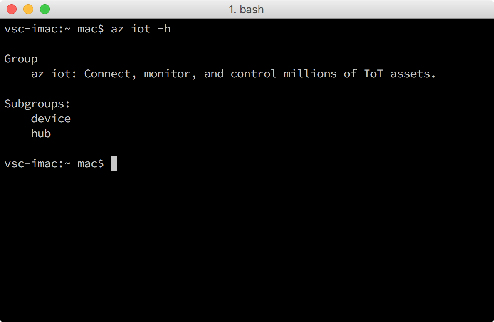

<properties
 pageTitle="Obter ferramentas Azure (macOS 10.10) | Microsoft Azure"
 description="Instale o Python e Interface de linha do Azure (Azure comando) em macOS."
 services="iot-hub"
 documentationCenter=""
 authors="shizn"
 manager="timlt"
 tags=""
 keywords=""/>

<tags
 ms.service="iot-hub"
 ms.devlang="multiple"
 ms.topic="article"
 ms.tgt_pltfrm="na"
 ms.workload="na"
 ms.date="10/21/2016"
 ms.author="xshi"/>

# <a name="21-get-azure-tools-macos-1010"></a>Ferramentas de obter Azure 2.1 (macOS 10.10)

> [AZURE.SELECTOR]
- [Windows 7 +](iot-hub-raspberry-pi-kit-node-lesson2-get-azure-tools-win32.md)
- [Ubuntu 16.04](iot-hub-raspberry-pi-kit-node-lesson2-get-azure-tools-ubuntu.md)
- [macOS 10.10](iot-hub-raspberry-pi-kit-node-lesson2-get-azure-tools-mac.md)

## <a name="211-what-you-will-do"></a>2.1.1 o que você fará

Instalar o Azure Interface de linha (comando Azure). Se você atender a todos os problemas, busca soluções na [página de solução de problemas](iot-hub-raspberry-pi-kit-node-troubleshooting.md).

## <a name="212-what-you-will-learn"></a>2.1.2 o que você aprenderá

- Como instalar o Azure CLI.
- Como adicionar o subgrupo IoT do Azure CLI.

## <a name="213-what-you-need"></a>2.1.3 o que é necessário

- Um Mac com conexão de Internet
- Uma assinatura ativa do Azure. Se você não tiver uma conta, você pode criar uma [conta gratuita](https://azure.microsoft.com/free/) em apenas alguns minutos.

## <a name="214-install-python"></a>2.1.4 instalar Python

Embora macOS vem com Python 2.7 prontos para uso, é recomendável instalar Python por meio de Homebrew. Consulte [Instalar o Python em macOS](http://docs.python-guide.org/en/latest/starting/install/osx/).

Instale Python e pip executando o seguinte comando:

```bash
brew install python
```

## <a name="215-install-the-azure-cli"></a>2.1.5 instalar o Azure CLI

A CLI do Azure fornece uma experiência de linha de comando várias plataformas do Azure, permitindo que você trabalhe diretamente da sua linha de comando para provisionar e gerenciar recursos. 

Para instalar a CLI mais recente do Azure, siga estas etapas:

1. Execute os seguintes comandos em uma janela Terminal. Ele pode levar cinco minutos para instalar a CLI do Azure.

    ```bash
    pip install azure-cli-core==0.1.0b7 azure-cli-vm==0.1.0b7 azure-cli-storage==0.1.0b7 azure-cli-role==0.1.0b7 azure-cli-resource==0.1.0b7 azure-cli-profile==0.1.0b7 azure-cli-network==0.1.0b7 azure-cli-iot==0.1.0b7 azure-cli-feedback==0.1.0b7 azure-cli-configure==0.1.0b7 azure-cli-component==0.1.0b7 azure-cli==0.1.0b7
    ```

2. Verificar a instalação, execute o seguinte comando:

    ```bash
    az iot -h
    ```
  
Se a instalação for bem-sucedida, você verá a seguinte saída.



## <a name="215-summary"></a>2.1.5 resumo de

Você instalou CLI do Azure. Continue para a próxima seção para criar sua identidade de Azure IoT Hub e dispositivo usando a CLI do Azure.

## <a name="next-steps"></a>Próximas etapas

[2.2 criar seu hub IoT e registrar seu framboesa Pi 3](iot-hub-raspberry-pi-kit-node-lesson2-prepare-azure-iot-hub.md)
