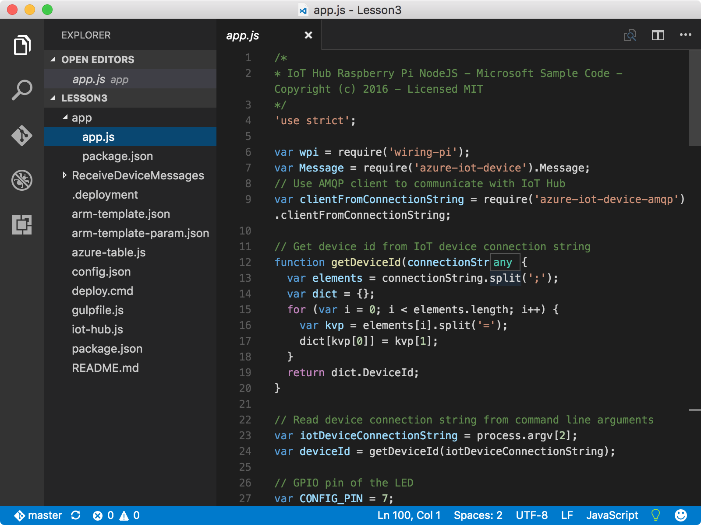
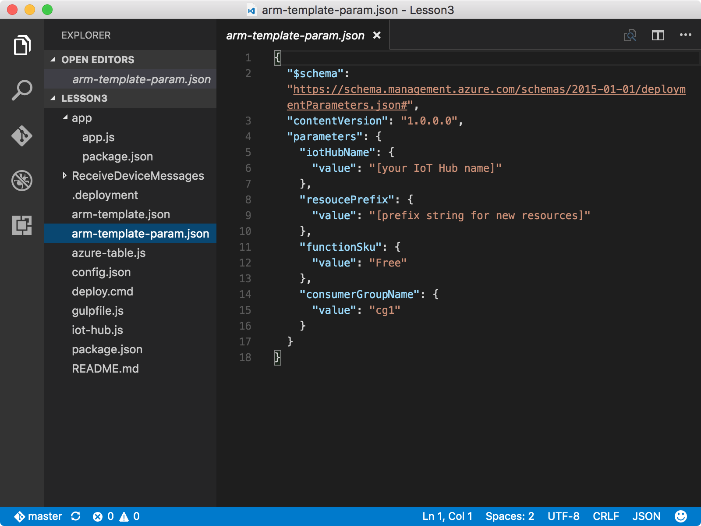

<properties
 pageTitle="Criar um aplicativo de função Azure e a conta de armazenamento do Azure | Microsoft Azure"
 description="O aplicativo de função Azure ouve eventos de hub do Azure IoT, processa mensagens de entrada e grava-los ao armazenamento de tabela do Microsoft Azure."
 services="iot-hub"
 documentationCenter=""
 authors="shizn"
 manager="timlt"
 tags=""
 keywords=""/>

<tags
 ms.service="iot-hub"
 ms.devlang="multiple"
 ms.topic="article"
 ms.tgt_pltfrm="na"
 ms.workload="na"
 ms.date="10/21/2016"
 ms.author="xshi"/>

# <a name="31-create-an-azure-function-app-and-azure-storage-account"></a>3.1 criar um aplicativo de função Azure e a conta de armazenamento do Azure

[Funções do Azure](../../articles/azure-functions/functions-overview.md) é uma solução para executar facilmente pequenas partes de código, chamado "funções", na nuvem. Um aplicativo do Azure função hospeda a execução de suas funções no Azure.

## <a name="311-what-will-you-do"></a>3.1.1 o que você fará

Use um modelo do Gerenciador de recursos do Azure para criar um aplicativo de função Azure e uma conta de armazenamento do Azure. O aplicativo de função Azure ouve eventos de hub do Azure IoT, processa mensagens de entrada e grava-los ao armazenamento de tabela do Microsoft Azure. Se você atender a todos os problemas, busca soluções na [página de solução de problemas](iot-hub-raspberry-pi-kit-node-troubleshooting.md).

## <a name="312-what-will-you-learn"></a>3.1.2 o que você aprenderá

- Como usar o [Gerenciador de recursos do Azure](../../articles/azure-resource-manager/resource-group-overview.md) para implantar recursos Azure.
- Como usar um aplicativo de função Azure para processar IoT hub mensagens e gravá-los em uma tabela em armazenamento de tabela do Microsoft Azure.

## <a name="313-what-do-you-need"></a>3.1.3 o que você precisa

- Você deve ter concluído com êxito lições anteriores: [Introdução ao seu framboesa Pi 3](iot-hub-raspberry-pi-kit-node-get-started.md) e [criar seu hub IoT do Azure](iot-hub-raspberry-pi-kit-node-get-started.md).

## <a name="314-open-the-sample-app"></a>3.1.4 Abra o aplicativo de amostra

Abra o projeto de amostra no Visual Studio código executando os seguintes comandos:

```bash
cd Lesson3
code .
```



- O `app.js` de arquivo no `app` subpasta é o arquivo de origem de chave. Este arquivo de origem contém o código para enviar uma mensagem 20 vezes para seu hub IoT e piscar o LED para cada mensagem que ele envia.
- O `arm-template.json` arquivo é o modelo de Gerenciador de recursos do Azure que contém um aplicativo de função Azure e uma conta de armazenamento do Azure.
- O `arm-template-param.json` é o arquivo de configuração usado pelo modelo de Gerenciador de recursos do Azure.
- O `ReceiveDeviceMessages` subpasta contém o código de Node para a função Azure.

## <a name="315-configure-azure-resource-manager-templates-and-create-resources-in-azure"></a>3.1.5 configurar modelos de Azure Gerenciador de recursos e criar recursos no Azure

Atualizar o `arm-template-param.json` arquivo no Visual Studio código.



- Substitua **[seu nome de IoT Hub]** **{Meu nome de hub}** que você especificou na [Lição 2](iot-hub-raspberry-pi-kit-node-lesson2-prepare-azure-iot-hub.md).
- Substitua **[sequência de prefixo para novos recursos]** com o prefixo que quiser. O prefixo garante que o nome do recurso seja globalmente exclusivo para evitar conflitos. Não use traço ou o número inicial no prefixo.

> [AZURE.NOTE] Você não precisa `azure_storage_connection_string` nesta seção. Mantenha-la como está.

Depois de atualizar o `arm-template-param.json` arquivo, implantar os recursos para o Azure executando o seguinte comando:

```bash
az resource group deployment create --template-file-path arm-template.json --parameters-file-path arm-template-param.json -g iot-sample -n mydeployment
```

Leva cerca de cinco minutos para criar esses recursos. Durante a criação de recurso estiver em andamento, você pode mover para a próxima seção.

## <a name="316-summary"></a>3.1.6 resumo de

Você criou seu aplicativo de função Azure para processar mensagens de hub IoT e uma conta de armazenamento do Azure para armazenar essas mensagens. Você pode mover em para a próxima seção para implantar e executar o exemplo para enviar mensagens de dispositivo à nuvem em seu Pi.

## <a name="next-steps"></a>Próximas etapas

[3,2 execute o aplicativo de exemplo para enviar mensagens de dispositivo à nuvem em seu framboesa Pi 3](iot-hub-raspberry-pi-kit-node-lesson3-run-azure-blink.md)

