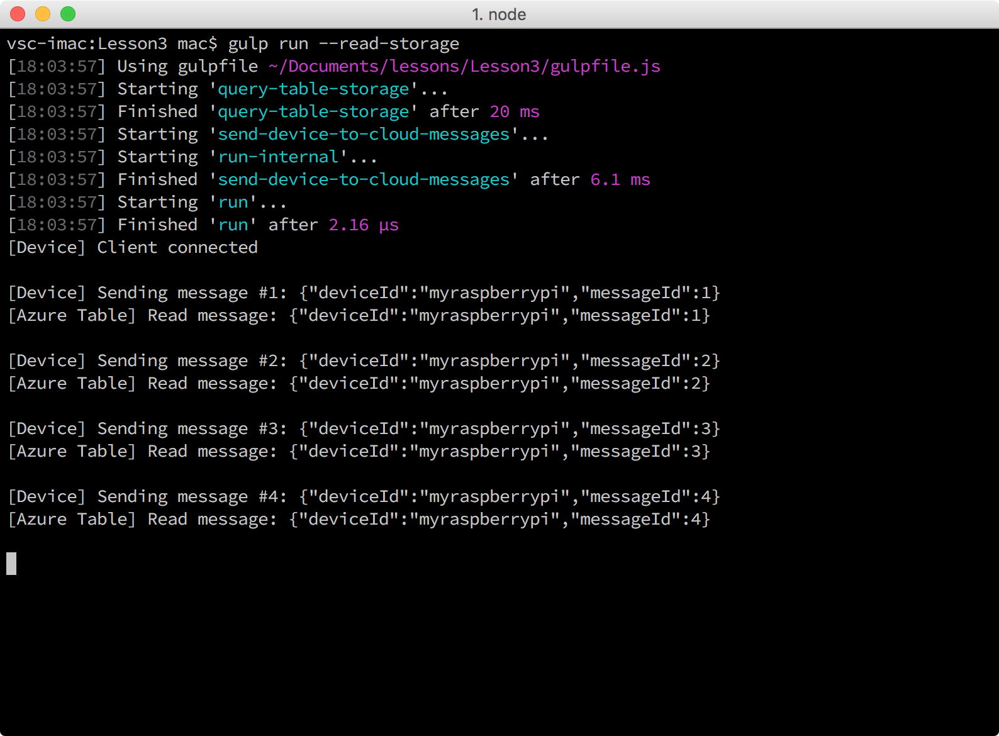

<properties
 pageTitle="Ler mensagens mantidas no armazenamento do Azure | Microsoft Azure"
 description="Monitore as mensagens do dispositivo na nuvem, como eles são gravados ao seu armazenamento de tabela do Microsoft Azure."
 services="iot-hub"
 documentationCenter=""
 authors="shizn"
 manager="timlt"
 tags=""
 keywords=""/>

<tags
 ms.service="iot-hub"
 ms.devlang="multiple"
 ms.topic="article"
 ms.tgt_pltfrm="na"
 ms.workload="na"
 ms.date="10/21/2016"
 ms.author="xshi"/>

# <a name="33-read-messages-persisted-in-azure-storage"></a>3.3 mensagens lidas persistentes no armazenamento do Azure

## <a name="331-what-will-you-do"></a>3.3.1 o que você fará

Monitore as mensagens do dispositivo à nuvem que são enviadas do seu framboesa Pi 3 para seu hub IoT como as mensagens são gravadas ao seu armazenamento de tabela do Microsoft Azure. Se você atender a todos os problemas, busca soluções na [página de solução de problemas](iot-hub-raspberry-pi-kit-node-troubleshooting.md).

## <a name="332-what-will-you-learn"></a>3.3.2 o que você aprenderá

- Como usar a tarefa de mensagem de leitura de vez para ler mensagens persistentes em seu armazenamento de tabela do Microsoft Azure.

## <a name="333-what-do-you-need"></a>3.3.3 o que você precisa

- Você deve concluído com êxito a seção anterior, [execute o aplicativo de amostra Azure piscando na sua framboesa Pi 3](iot-hub-raspberry-pi-kit-node-lesson3-run-azure-blink.md).

## <a name="334-read-new-messages-from-your-storage-account"></a>3.3.4 ler novas mensagens de sua conta de armazenamento

Na seção anterior, você executou um aplicativo de exemplo no seu Pi. As mensagens de aplicativo enviada de amostra para seu hub IoT do Azure. As mensagens enviadas para seu hub IoT são armazenadas em seu armazenamento de tabela do Microsoft Azure por meio do aplicativo de função Azure. É necessário a cadeia de conexão de armazenamento do Azure para ler mensagens de seu armazenamento de tabela do Microsoft Azure.

Para ler mensagens armazenadas em seu armazenamento de tabela do Microsoft Azure, siga estas etapas:

1. Obter a cadeia de conexão executando os seguintes comandos:

    ```bash
    az storage account list -g iot-sample --query [].name
    az storage account show-connection-string -g iot-sample -n {storage name}
    ```

    O primeiro comando recupera o `storage name` que é usado no segundo comando para obter a cadeia de conexão. `iot-sample`é o valor padrão de `{resource group name}` se você não alterar o valor na lição 2.

2. Abra o arquivo de configuração `config-raspberrypi.json` arquivo no Visual Studio código executando o seguinte comando:

    ```bash
    # For Windows command prompt
    code %USERPROFILE%\.iot-hub-getting-started\config-raspberrypi.json

    # For macOS or Ubuntu
    code ~/.iot-hub-getting-started/config-raspberrypi.json
    ```

3. Substituir `[Azure Storage connection string]` com a cadeia de conexão obtido na etapa 1.
4. Salve o `config-raspberrypi.json` arquivo.
5. Enviar mensagens novamente e lê-los de seu armazenamento de tabela do Microsoft Azure executando o seguinte comando:

    ```bash
    gulp run --read-storage
    ```

    A lógica para leitura de armazenamento de tabela Azure está na `azure-table.js` arquivo.

    

## <a name="335-summary"></a>3.3.5 resumo de

Você com êxito conectado seu Pi a seu hub de IoT na nuvem e usado o aplicativo de exemplo piscando para enviar mensagens de dispositivo na nuvem. Você também usou o aplicativo de função Azure para armazenar as mensagens recebidas de hub de IoT ao seu armazenamento de tabela do Microsoft Azure. Você passar para a próxima lição sobre como enviar mensagens de nuvem para dispositivo de seu hub IoT para seu Pi.

## <a name="next-steps"></a>Próximas etapas

[Lição 4: Enviar mensagens de nuvem para dispositivo](iot-hub-raspberry-pi-kit-node-lesson4-send-cloud-to-device-messages.md)
