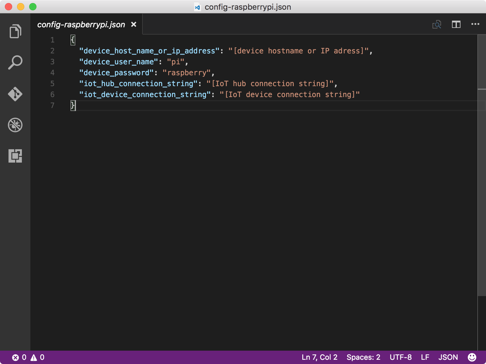

<properties
 pageTitle="Execute o aplicativo de amostra para receber mensagens de nuvem para dispositivo | Microsoft Azure"
 description="O aplicativo de exemplo na lição 4 é executado em seu Pi e monitora as mensagens de entrada do seu hub IoT. Uma nova tarefa de vez envia mensagens para sua Pi do seu hub IoT piscando o LED."
 services="iot-hub"
 documentationCenter=""
 authors="shizn"
 manager="timlt"
 tags=""
 keywords=""/>

<tags
 ms.service="iot-hub"
 ms.devlang="multiple"
 ms.topic="article"
 ms.tgt_pltfrm="na"
 ms.workload="na"
 ms.date="10/21/2016"
 ms.author="xshi"/>

# <a name="41-run-the-sample-application-to-receive-cloud-to-device-messages"></a>4.1 execute o aplicativo de amostra para receber mensagens de nuvem para dispositivo

Nesta seção, você pode implantar um aplicativo de amostra no seu framboesa Pi 3. O aplicativo de exemplo monitora mensagens de entrada de seu hub IoT. Você também pode executar uma tarefa de vez em seu computador para enviar mensagens para seu Pi do seu hub IoT. Ao receber as mensagens, o aplicativo de exemplo pisca o LED. Se você atender a todos os problemas, busca soluções na [página de solução de problemas](iot-hub-raspberry-pi-kit-node-troubleshooting.md).

## <a name="411-what-you-will-do"></a>4.1.1 o que você fará

- Conecte o aplicativo de exemplo para o seu hub IoT.
- Implante e execute o aplicativo de amostra.
- Envie mensagens de seu hub IoT para seu Pi piscando o LED.

## <a name="412-what-you-will-learn"></a>4.1.2 o que você aprenderá

- Como monitorar mensagens de entrada de seu hub IoT.
- Como enviar mensagens de nuvem para dispositivo de seu hub IoT para seu Pi. 

## <a name="413-what-do-you-need"></a>4.1.3 o que você precisa

- 3 de Pi de framboesa configurada para uso. Para saber como configurar seu Pi, consulte [Lição 1: Introdução ao seu dispositivo de framboesa Pi 3](iot-hub-raspberry-pi-kit-node-get-started.md)
- Um hub IoT criado em sua assinatura do Azure. Para saber como criar o seu Hub de IoT Azure, consulte [Lição 2: criar seu Hub de IoT Azure](iot-hub-raspberry-pi-kit-node-get-started.md)

## <a name="414-connect-the-sample-application-to-your-iot-hub"></a>4.1.4 conectar o aplicativo de amostra para seu hub IoT

1. Verifique se você está na pasta repo `iot-hub-node-raspberrypi-getting-started`. Abra o aplicativo de exemplo no Visual Studio código executando os seguintes comandos:

    ```bash
    cd Lesson4
    code .
    ```

    Observe o `app.js` de arquivo no `app` subpasta. O `app.js` arquivo é o arquivo de origem de chave que contém o código para monitorar a mensagens de entrada de IoT Hub. O `blinkLED` função pisca o LED.

    

2. Inicialize o arquivo de configuração com os seguintes comandos:

    ```bash
    npm install
    gulp init
    ```

    Se você concluiu lição 3 neste computador, todas as configurações são herdadas para que você pode pular para a etapa 4.1.5. Se você concluiu lição 3 em um computador diferente, você precisa substituir os espaços reservados no `config-raspberrypi.json` arquivo. O `config-raspberrypi.json` arquivo está na subpasta da sua pasta base.

    

- Substitua **[nome do host do dispositivo ou endereço IP]** endereço IP ou nome do host que você obtém executando o comando seu Pi`devdisco list --eth`
- Substituir **[cadeia de conexão do dispositivo IoT]** com a cadeia de conexão do dispositivo que você obtém executando o comando `az iot hub show-connection-string --name {my hub name} --resource-group {resource group name}`.
- Substituir **[cadeia de conexão do hub IoT]** com a cadeia de conexão de hub IoT que você obtém executando o comando `az iot device show-connection-string --hub {my hub name} --device-id {device id} --resource-group {resource group name}`.

## <a name="415-deploy-and-run-the-sample-application"></a>4.1.5 implantar e executar o aplicativo de amostra

Implante e execute o aplicativo de amostra em seu Pi executando os seguintes comandos:
  
```
gulp
```

O comando vez executa a tarefa de ferramentas de instalação primeiro. Em seguida, ele implanta o aplicativo de amostra para seu Pi. Por fim, ele executa o aplicativo na sua Pi e uma tarefa separada no computador host para enviar mensagens de piscar 20 a seu Pi do seu hub IoT.

Depois que o aplicativo de amostra é executado, ele começa listening mensagens de seu hub IoT. Enquanto isso, a tarefa de vez envia várias das mensagens de "piscando" de seu IoT Hub para seu Pi. Para cada mensagem piscando recebida, o aplicativo de exemplo chama a função blinkLED para piscar o LED.

Você deve ver o LED piscando cada dois segundos enquanto a tarefa de vez está enviando mensagens de 20 de seu hub IoT a seu Pi. O último é uma mensagem de "parar" que informa o aplicativo parar de executar.


## <a name="416-summary"></a>4.1.6 resumo de

Você já com êxito mensagens enviadas de seu hub IoT a seu Pi piscando o LED. Próxima seção é seção opcional que mostra como alterar ativar e desativar o comportamento do LED.

## <a name="next-steps"></a>Próximas etapas

[Seção opcional: alterar ativar e desativar o comportamento do LED](iot-hub-raspberry-pi-kit-node-lesson4-change-led-behavior.md)