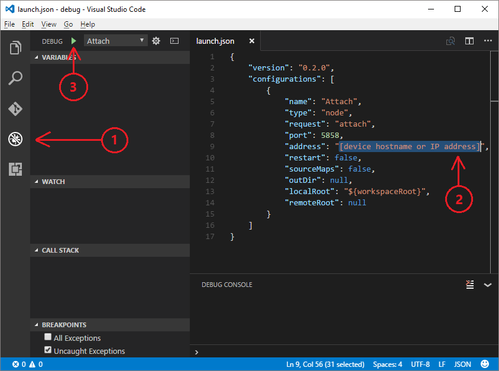
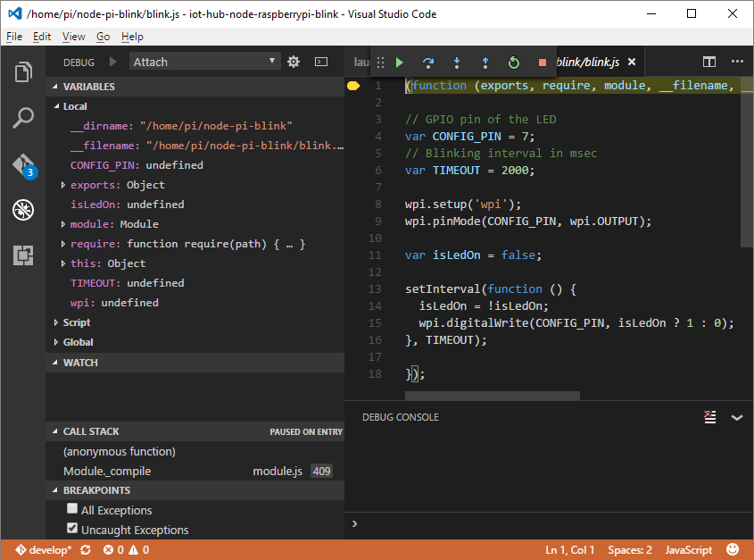

<properties
 pageTitle="Solução de problemas | Microsoft Azure"
 description="Página de solução de problemas de experiência de framboesa Pi Node"
 services="iot-hub"
 documentationCenter=""
 authors="shizn"
 manager="timlt"
 tags=""
 keywords=""/>

<tags
 ms.service="iot-hub"
 ms.devlang="multiple"
 ms.topic="article"
 ms.tgt_pltfrm="na"
 ms.workload="na"
 ms.date="10/21/2016"
 ms.author="xshi"/>

# <a name="troubleshooting"></a>Solução de problemas

## <a name="hardware-issues"></a>Problemas de hardware

### <a name="the-application-runs-well-but-the-led-is-not-blinking"></a>O aplicativo funciona bem, mas o LED não está piscando

Esse problema sempre está relacionado à conectividade de circuito de hardware. Use as etapas a seguir para identificar problemas.

1. Verifique se você escolher o correto **GPIO** em seu quadro. As duas portas nesta lição devem ser **GPIO GND (6 de Pin)** e **GPIO 04 (pino 7)**.
2. Verifique se a polaridade do seu LED está correta. O trecho mais deve indicar o pin de nó, **positivo**.
3. Use o **Fixar 3,3 v** e o **Pin GND** no seu Pi framboesa 3. Trate seu Pi como a alimentação DC. Verifique se o LED funciona bem.


### <a name="other-hardware-issues"></a>Outros problemas de hardware

Para obter informações sobre como resolver problemas comuns no framboesa Pi 3, consulte a [página de solução de problemas oficial](http://elinux.org/R-Pi_Troubleshooting).

## <a name="nodejs-package-issues"></a>Problemas de pacote Node

### <a name="no-response-during-gulp-tasks"></a>Nenhuma resposta durante vez tarefas

Se você encontrar problemas ao executar tarefas de vez, você pode adicionar o `--verbose` opção para depuração. Tentar encerrar tarefas atuais de vez com `Ctrl + C` e execute o comando a seguir na janela do console para ver mensagens de depuração. Talvez você veja mensagens de erro detalhadas impressas em sua saída do console. 

```bash
gulp --verbose
```

### <a name="device-discovery-issues"></a>Problemas de descoberta de dispositivo

Para ajudar a solucionar problemas comuns com a `devdisco` comando, consulte o [arquivo Leiame](https://github.com/Azure/device-discovery-cli/blob/develop/readme.md).

### <a name="other-npm-issues"></a>Outros problemas NPM

Tente atualizar seu pacote NPM com o seguinte comando:

```bash
npm install -g npm
```

Se o problema persistir, deixe seus comentários no final deste artigo ou criar um problema de Github em nosso [Repositório de amostra](https://github.com/Azure-Samples/iot-hub-node-raspberrypi-getting-started)

## <a name="remote-debugging"></a>Depuração remota

### <a name="run-the-sample-application-in-debug-mode"></a>Executar o aplicativo de exemplo no modo de depuração

```bash
gulp run --debug
```

Quando o mecanismo de depuração estiver pronto, você deve ver ```Debugger listening on port 5858``` na saída do console.

### <a name="configure-vs-code-to-connect-to-the-remote-device"></a>Configurar VS código para se conectar ao dispositivo remoto

Abra o painel **Depurar** no lado esquerdo.

Clique no botão verde **Iniciar depuração** (F5). Código de VS abre um arquivo de **launch.json** , o que você precisa atualizar.

Atualize o arquivo de **launch.json** com o seguinte conteúdo. Substituir `[device hostname or IP address]` com o endereço IP do dispositivo real ou o nome do host.   

```json
{
    "version": "0.2.0",
    "configurations": [
        {
            "name": "Attach",
            "type": "node",
            "request": "attach",
            "port": 5858,
            "address": "[device hostname or IP address]",
            "restart": false,
            "sourceMaps": false,
            "outDir": null,
            "localRoot": "${workspaceRoot}",
            "remoteRoot": null
        }
    ]
}
```



### <a name="attach-to-the-remote-application"></a>Anexar à aplicação remota

Clique no botão verde **Iniciar depuração** (F5) para iniciar a depuração. 

Leia [JavaScript no código de VS](https://code.visualstudio.com/docs/languages/javascript#_debugging) para saber mais sobre o depurador.



## <a name="azure-cli-issues"></a>Problemas CLI Azure

Azure é uma compilação de visualização. Você pode consultar a [Guia de instalação de visualização](https://github.com/Azure/azure-cli/blob/master/doc/preview_install_guide.md) para buscar soluções.

Se você encontrar quaisquer erros com a ferramenta, arquivo um [problema](https://github.com/Azure/azure-cli/issues) na seção de **problemas** da repo GitHub.

Para ajudar a solucionar problemas comuns, consulte o [arquivo Leiame](https://github.com/Azure/azure-cli/blob/master/README.rst).

## <a name="python-installation-issues"></a>Problemas de instalação do Python

### <a name="legacy-installation-issues-macos"></a>Problemas de instalação herdados (macOS)

Ao instalar o **pip**, um erro de permissão é lançado quando há pacotes herdados que são instalados com permissões de **SO** . Isso ocorre porque a instalação anterior do Python usando brew (macOS) não for desinstalada completamente. Alguns pacotes de **pip** de uma instalação anterior foram criados por raiz, o que causa o erro de permissão. A solução é remover os pacotes instalados pelo raiz. Use as etapas a seguir para concluir essa tarefa:

1. Vá para /usr/local/lib/python2.7/site-packages
2. Criar lista pacotes por raiz:`ls -l | grep root`
3. Desinstale os pacotes de etapa 2:`sudo rm -rf {package name}`
4. Reinstale o Python.

## <a name="azure-iot-hub-issues"></a>Problemas de hub IoT Azure

Se você tiver configurado com êxito Azure IoT hub com `azure-cli`, e você precisa de uma ferramenta para gerenciar os dispositivos que se conectando ao seu hub IoT, tente as seguintes ferramentas:

### <a name="device-explorer"></a>Explorador de dispositivo

[Explorador de dispositivo](https://github.com/Azure/azure-iot-sdks/blob/master/tools/DeviceExplorer/doc/how_to_use_device_explorer.md) é executado em sua máquina local do Windows e se conecta ao seu hub IoT no Azure. Ele se comunica com os seguintes [pontos de extremidade do IoT Hub](iot-hub-devguide.md):

- *Gerenciamento de identidades do dispositivo* para provisionar e gerenciar dispositivos registrado com seu hub IoT.
- *Recebimento de dispositivo à nuvem* para que você possa monitorar as mensagens enviadas do seu dispositivo para seu hub IoT.
- *Enviar nuvem para dispositivo* para que você possa enviar mensagens para seus dispositivos de seu hub IoT.

Configurar seu `IoT hub connection string` dentro desta ferramenta para usar todos os seus recursos.

### <a name="iot-hub-explorer"></a>Hub de IoT Explorer

[Hub de IoT Explorer](https://github.com/Azure/azure-iot-sdks/blob/master/tools/iothub-explorer/readme.md) é uma ferramenta CLI de várias plataformas de amostra para gerenciar clientes de dispositivo. A ferramenta permite que você a gerenciar os dispositivos no registro identidade, monitorar mensagens de dispositivo na nuvem e enviar comandos de nuvem para dispositivo.

Para instalar a versão mais recente do (pré-lançamento) da ferramenta iothub-explorer, execute o seguinte comando no ambiente de linha de comando:

```
npm install -g iothub-explorer@latest
```

Você pode usar o comando a seguir para obter ajuda adicional sobre todos os comandos de iothub-explorer e seus parâmetros:

```bash
iothub-explorer help
```

### <a name="use-azure-portal-to-manage-your-resources"></a>Usar o portal do Azure para gerenciar os recursos

Nestas lições, uma experiência completa de CLI é fornecida para criar e gerenciar todos os recursos do Azure. Você também pode querer usar o [portal do Azure](../azure-portal-overview.md) para ajudar a provisionar, gerenciar e depurar seus recursos Azure.

## <a name="azure-storage-issues"></a>Problemas de armazenamento do Azure

[Gerenciador de armazenamento do Microsoft Azure (visualização)](http://storageexplorer.com) é um aplicativo autônomo da Microsoft que permite a você trabalhar com dados de armazenamento do Azure em Windows, macOS e Linux. Esta ferramenta permite que você se conectar à sua tabela e ver os dados nele. Você pode usar esta ferramenta para solucionar os problemas de armazenamento do Azure.
