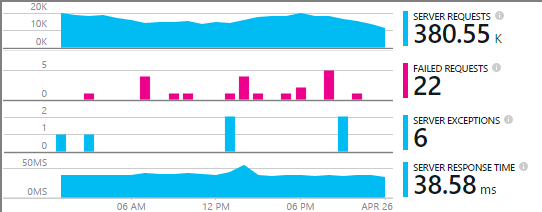

<properties
    pageTitle="Exemplo de MyDriving Azure IoT: construir | Microsoft Azure"
    description="Crie um aplicativo que é uma demonstração abrangente de como projetar um sistema IoT usando o Microsoft Azure, incluindo a análise de fluxo, aprendizado de máquina e Hubs de evento."
    services=""
    documentationCenter=".net"
    suite=""
    authors="harikmenon"
    manager="douge"/>

<tags
    ms.service="multiple"
    ms.workload="tbd"
    ms.tgt_pltfrm="ibiza"
    ms.devlang="dotnet"
    ms.topic="article"
    ms.date="03/25/2016"
    ms.author="harikm"/>


# <a name="build-and-deploy-the-mydriving-solution-to-your-environment"></a>Construir e implantar a solução de MyDriving para seu ambiente

MyDriving é uma solução de Internet das coisas (IoT) que reúne dados do seu carro, processa-lo usando o aprendizado de máquina e apresenta-lo em seu telefone celular. Back-end consiste em uma variedade de serviços fornecidos pelo Microsoft Azure. Os clientes podem ser telefones Android, iOS ou Windows 10.

Criamos a solução MyDriving para dar uma introdução na criação de seu próprio sistema IoT. Do [repositório de MyDriving no GitHub](https://github.com/Azure-Samples/MyDriving), você pode obter scripts do Gerenciador de recursos do Azure para implantar a arquitetura de back-end para sua própria conta do Azure. Desse ponto, você pode reconfigurar diferentes serviços, modificar as consultas para atender às seus próprios dados e assim por diante. Você pode encontrar esses scripts – juntamente com código para o aplicativo móvel, o projeto de API do serviço de aplicativo do Azure e muito mais--no repositório MyDriving.

Se você ainda não tiver tentado o aplicativo ainda, examine o [guia de Introdução do Get](iot-solution-get-started.md).

Não há uma conta detalhada da arquitetura do [Guia de referência de MyDriving](http://aka.ms/mydrivingdocs). Em resumo, há várias partes que podemos configurar, e que você faria configurado para criam um projeto semelhante:

* Um **aplicativo cliente** é executado em telefones iOS, Android e Windows 10. Podemos usar a plataforma Xamarin para compartilhar muito do código, que é armazenado em GitHub em `src/MobileApp`. O aplicativo realmente executa duas funções distintas:
 * Ele retransmite telemetria do dispositivo diagnóstico integrado (OBD) e de seu próprio serviço de localização para back-end de arquivo de nuvem do sistema.
 * É uma interface de usuário onde os usuários podem consultar sobre sua viagem gravadas.
* Um **serviço de nuvem** consome os dados de viagem em tempo real e processa-la. O trabalho principal de criar esse serviço é escolher, parametrizar e conectar uma variedade de serviços do Azure. Algumas partes exigem scripts filtro e os dados de entrada do processo. Podemos usar um modelo do Gerenciador de recursos do Azure para configurar todas as partes.
* Um **aplicativo de serviço móvel** é o serviço web atrás a parte da interface de usuário do aplicativo do dispositivo. Seu trabalho principal é o banco de dados armazenados e processados da consulta. Seu código está no GitHub em `src/MobileAppService`.
* **Visual Studio com Xamarin** é nosso ambiente de desenvolvimento. Xamarin, que existe como um componente do Visual Studio e um ambiente de desenvolvimento integrado autônomo (IDE), é usado para criar o código de dispositivo entre plataformas. Para criar o código iOS, é necessário ter uma instância de Xamarin em execução em um computador de OS X. Se necessário, ele pode ser executado como um agente, gerenciado do Visual Studio.
* **Testes de unidade** dos aplicativos do dispositivo é executado em nuvem de teste de Xamarin.
* **GitHub** é o repositório onde podemos armazenar todo o código, scripts e modelos.
* **Serviços de equipe do Visual Studio** é um serviço de nuvem que é usado para gerenciar a compilação contínua e teste dos aplicativos de serviço e dispositivo da web.
* **HockeyApp** é usado para distribuir versões do código do dispositivo. Ele também coletará relatórios de falha e o uso e comentários do usuário.
* **Obtenção de informações do Visual Studio aplicativo** monitora o serviço web móvel.

Vamos ver como podemos configurar tudo isso. Observe que muitas das etapas são opcionais.

## <a name="sign-up-for-accounts"></a>Inscrever-se para contas

-   [Princípios de desenvolvimento do visual Studio](https://www.visualstudio.com/products/visual-studio-dev-essentials-vs.aspx). Esse programa gratuito fornece acesso fácil a muitas ferramentas de desenvolvedor e serviços, incluindo o Visual Studio, serviços de equipe do Visual Studio e Azure. Ele fornece um crédito de US $25/ mês no Azure por 12 meses. Ele também inclui assinaturas do treinamento de Pluralsight e Xamarin University. Você pode também se inscrever separadamente para níveis gratuitas do [Azure](https://azure.com) e [Visual Studio Team Services](https://www.visualstudio.com/products/visual-studio-team-services-vs.aspx), mas elas não fornecem créditos Azure.

-   [HockeyApp](https://rink.hockeyapp.net/) (opcional), para gerenciar a distribuição de teste de aplicativos móveis e coleta de telemetria.

-   [Xamarin](https://xamarin.com/) (obrigatório), para criar o aplicativo móvel e executar testes e depuração executa na [Nuvem de teste de Xamarin](https://xamarin.com/test-cloud).

-   [GitHub](https://github.com/Azure-Samples/MyDriving/) (opcional), para criar repositórios públicos livres para seu próprio código (repositórios particulares são pagos). Como alternativa, você pode usar o plano básico no Visual Studio Team Services para repositórios particulares.

-   [Power BI](https://powerbi.microsoft.com/) (opcional), para criar visualizações avançadas de dados através do sistema inteiro.

> [AZURE.NOTE] Não é necessário uma conta GitHub para acessar o código de MyDriving no [repositório GitHub MyDriving](https://github.com/Azure-Samples/MyDriving).

## <a name="install-development-tools"></a>Instalar as ferramentas de desenvolvimento

A seguinte configuração é para desenvolver a solução completa: um iOS, Android e Windows 10 Mobile aplicativo entre plataformas, com um Azure back-end.

Como alternativa, você pode usar Xamarin Studio no Mac ou Windows para desenvolver aplicativos móveis se você não estiver trabalhando no Azure back-end.

Não há uma [descrição mais detalhada sobre essa configuração](https://msdn.microsoft.com/library/mt613162.aspx).

### <a name="windows-development-machine"></a>Máquina de desenvolvimento do Windows

A ferramenta central no Windows é o Visual Studio, para trabalhar com o aplicativo de MyDriving para Android e Windows, o projeto de API do serviço de aplicativo e extensões de microservice.

Xamarin, gito, emuladores e outros componentes úteis são integrados com o Visual Studio.

Instale:

-   [Visual Studio de 2015 com Xamarin](https://www.visualstudio.com/products/visual-studio-community-vs) (qualquer edição – comunidade é gratuita).

-   [SQLite para plataforma Windows Universal](https://visualstudiogallery.msdn.microsoft.com/4913e7d5-96c9-4dde-a1a1-69820d615936). Necessário para criar o código do Windows 10 Mobile.

-   [SDK do azure para Visual Studio 2015](https://go.microsoft.com/fwlink/?linkid=518003&clcid=0x409). Fornece o SDK para execução de aplicativos no Azure, juntamente com ferramentas de linha de comando para gerenciar o Azure.

-   [Serviço azure tecidos SDK](http://www.microsoft.com/web/handlers/webpi.ashx?command=getinstallerredirect&appid=MicrosoftAzure-ServiceFabric). Necessárias para criar a extensão [microservice](../service-fabric/service-fabric-get-started.md) .

Além disso, certifique-se de que você tenha extensões do Visual Studio à direita. Verificar que em **Ferramentas**, você vê **Android, iOS, Xamarin...**. Caso contrário, abra o painel de controle e selecione **programas e recursos** > **Microsoft** > **Visual Studio 2015** > **Modificar**. Em **várias plataformas de desenvolvimento**, selecione **C\#/.Net (Xamarin)**. Enquanto você estiver lá, verifique se **Gito para Windows** está instalado.

### <a name="mac-development-machine"></a>Máquina de desenvolvimento do Mac

Mac (Yosemite ou posterior) é necessário se você quiser desenvolver para iOS. Embora usamos Visual Studio com Xamarin no Windows para desenvolver e gerenciar todo o código, Xamarin usa um agente instalado em um Mac para construir e entre o código iOS.


(Como alternativa, você pode usar Xamarin Studio diretamente no Mac desenvolver aplicativos entre plataformas.)

Mac não é necessário se você não deseja incluir iOS como uma plataforma de destino.

Instale:

-   [Xamarin Studio para iOS](https://developer.xamarin.com/guides/ios/getting_started/installation/mac/). Você também pode configurar o Visual Studio e Xamarin em um Mac que está executando uma máquina virtual Windows. Consulte [instalação, instalar e verificações para usuários do Mac](https://msdn.microsoft.com/library/mt488770.aspx) no MSDN.

-   [Ferramentas de desenvolvimento do Azure](https://azure.microsoft.com/downloads/) (opcional).

Habilitar logon remoto no Mac. Abrir as **Preferências do sistema** > **compartilhamento**e selecione **Logon remoto**.

Quando você abre um projeto de iOS no Visual Studio no Windows, o plug-in de Xamarin solicitará a identificação do Mac.

## <a name="fetch-the-github-repository"></a>Buscar repositório GitHub

Busca uma cópia local do [repositório do GitHub MyDriving](https://github.com/Azure-Samples/MyDriving) usando o botão **Baixar ZIP** no GitHub, Visual Studio ou outro cliente gito.

Descompacte o arquivo em uma pasta com um nome de caminho curto, como c:\\código.

Como alternativa, se você quiser manter atualizado com ou contribuir para nosso código, clone repositório da seguinte maneira:

**gito clonar https://github.com/Azure-Samples/MyDriving.git**

## <a name="get-a-bing-maps-api-key"></a>Obter um Bing maps API chave

[Registre-se para uma chave de API do Bing Maps](https://msdn.microsoft.com/library/ff428642.aspx).

Você precisa substituir na linha 22 em `src/MobileApps/MyDriving/MyDriving.Utils/Logger.cs`.


## <a name="build-the-demo-app"></a>Criar o aplicativo de demonstração

Abra essas soluções no Visual Studio:

-   src\MobileApps\MyDriving.sln

-   src\MobileAppService\MyDrivingService.sln

-   src\Extensions\ServiceFabric\VINLookUpApplication\VINLookUpApplication.sln

Você receberá instruções para:

-   Confie em alguns projetos potencialmente não confiáveis. Escolha para abri-las, se desejar ir adiante.

-   Defina o modo de desenvolvedor se você estiver trabalhando em uma nova máquina Windows 10.

-   Fornece suas credenciais de Xamarin.

-   Conectar ao Mac Xamarin. Se você não tiver um Mac, clique com botão direito do projeto iOS no Visual Studio e selecione **project descarregar**.

Recrie a solução.

Se você tiver problemas para criação, tente as soluções para quirks que descobrimos:

-   *Projeto de VINLookupApplication não carrega*: Certifique-se de que você instalou o [SDK do Azure para Visual Studio 2015](https://go.microsoft.com/fwlink/?linkid=518003&clcid=0x409).

-   *Projeto de serviço tecidos não compilar*: criar projetos interface primeiro e certifique-se de que você instalou o SDK do serviço tecidos.

-   *Aplicativo do android não compilar*:

    -   Abrir **Ferramentas** > **Android** > **Gerenciador de SDK do Android**e garantir que 6 Android (API 23) / plataforma SDK está instalada.

    -   Excluir esta pasta e, em seguida, recriar:<br/>
        `%LocalAppData%\Xamarin\zips`

## <a name="get-to-know-the-code"></a>Conheça o código

Na solução, você encontrará:

-   Extensões Azure: tecidos de serviço.

-   Azure HDInsight: Scripts para processar dados de viagem no Azure.

-   Aplicativos móveis: Os aplicativos do dispositivo.

-   MobileAppsService/MyDrivingService: Final de volta na web.

-   Power BI: A definição de relatório.

-   Scripts:

    -   Gerenciador de recursos: modelos para criar os recursos Azure.

    -   PowerShell: Scripts executar o recurso Gerenciador de modelos.

    -   Banco de dados do SQL Azure: Depuração bancos de dados.

-   Banco de dados do SQL: CreateTables: definições de esquema.

-   Análise de fluxo Azure: Consultas que transformam o fluxo de dados recebidos.

## <a name="run-the-apps-in-development-mode"></a>Executar aplicativos no modo de desenvolvimento

Execute a ação para executar aplicativos, com base no dispositivo que você está usando:

-  Back-end: MyDrivingService de definir como o projeto de inicialização e pressione F5 para executar o serviço web de back-end. Ele será aberto um modo de exibição do navegador da listagem da API.

-  Os clientes móveis: os [aplicativos móveis são desenvolvidos em Xamarin](https://developer.xamarin.com/guides/cross-platform/deployment,_testing,_and_metrics/debugging_with_xamarin/).
 -  Android: Para obter detalhes, consulte [Depuração Android em Xamarin](http://developer.xamarin.com/guides/android/deployment,_testing,_and_metrics/debugging_with_xamarin_android/).

 -  iOS: para obter detalhes, consulte [depuração no iOS](http://developer.xamarin.com/guides/ios/deployment,_testing,_and_metrics/debugging_in_xamarin_ios/).

 -  Windows Phone: Para obter detalhes, consulte [Xamarin + do Windows Phone](https://developer.xamarin.com/guides/cross-platform/windows/phone/).

## <a name="upload-the-mobile-app-to-hockeyapp"></a>Carregar o aplicativo móvel em HockeyApp

HockeyApp gerencia a distribuição de seu aplicativo do Android, iOS ou Windows testar usuários, notificar os usuários das novas versões. Ele também coletará relatórios de falha útil, comentários de usuário com capturas de tela e métricas de uso.

[Comece por carregar](http://support.hockeyapp.net/kb/app-management-2/how-to-create-a-new-app) seu aplicativo de compilação. Em seguida, entre [HockeyApp](https://rink.hockeyapp.net) do seu computador de desenvolvimento. No painel de desenvolvedor, clique em **Novo aplicativo**e, em seguida, arraste os arquivos criados para a janela. (Mais tarde, você pode automatizar seu serviço de compilação para fazer isso).

Agora você está no seu painel de aplicativo.


Repita o processo para cada plataforma que seu aplicativo é executado em. Em seguida, você pode fazer o seguinte:

-  Use a [ID de aplicativo](http://support.hockeyapp.net/kb/app-management-2/how-to-find-the-app-id) no painel para enviar dados de falha e comentários de seu aplicativo. Em MyDriving, atualize as identificações no src/MobileApps/MyDriving/MyDriving.Utils/Logger.cs.

-  [Convidar usuários de teste](http://support.hockeyapp.net/kb/app-management-2/how-to-invite-beta-testers). Você recebe uma URL para recrutamento usuários testadores. Ela poderá inscrever-se para sua equipe, baixe o aplicativo e enviar comentários.

-  Se você preferir uma versão beta mais aberta, defina a distribuição ao público. Clique em **Gerenciar aplicativos** > **distribuição** > **Baixar = público**. Agora, qualquer pessoa pode fazer o download de seu aplicativo e enviar comentários, e eles verá uma notificação quando você lançar uma nova versão. Você também pode receber alguns relatórios de falha delas.

    

-  [Relatórios de falha de link para Visual Studio Team Services](http://support.hockeyapp.net/kb/third-party-bug-trackers-services-and-webhooks/how-to-use-hockeyapp-with-visual-studio-team-services-vsts-or-team-foundation-server-tfs). Clique em **Gerenciar aplicativos** > **Serviços de equipe do Visual Studio**. HockeyApp pode criar automaticamente itens de trabalho nos serviços de equipe quando há relatórios de falha ou quando os comentários é recebido.

Leia mais no [site HockeyApp](https://hockeyapp.net).

## <a name="test-the-mobile-app-on-xamarin-test-cloud"></a>Testar o aplicativo móvel em nuvem de teste Xamarin

[Nuvem de teste de Xamarin](https://developer.xamarin.com/guides/testcloud/introduction-to-test-cloud/) automatiza testes de interface do usuário em dispositivos reais na nuvem. Usando a estrutura de NUnit, você escreve testes que executam o seu aplicativo por meio da interface de usuário.

Para usar Xamarin, você incorporar [Xamarin.UITests](https://developer.xamarin.com/guides/testcloud/uitest/intro-to-uitest/) SDK ao seu aplicativo, o que vem como um pacote do NuGet. Você encontrará no aplicativo demonstração e ele será incluído quando você cria novos projetos de teste com os modelos de Xamarin.


Um exemplo de projeto de teste está incluído com o aplicativo no repositório. Na [MyDriving](https://github.com/Azure-Samples/MyDriving/tree/master/src/MobileAppService), procure em [src](https://github.com/Azure-Samples/MyDriving/tree/master/src)/MobileApps/[MyDriving](https://github.com/Azure-Samples/MyDriving/tree/master/src/MobileApps/MyDriving)/MyDriving.UITests/.

Se você usar uma compilação de serviços de equipe do Visual Studio, é fácil gravar Xamarin UI testes de unidade e executá-los como parte da sua criação.

## <a name="deploy-azure-services"></a>Implantar os serviços do Azure

Para executar uma implantação automática do Azure serviços e os serviços de compilação de serviços de equipe, consulte as instruções detalhadas no **scripts/README.md**.

Microsoft Azure fornece uma grande variedade de diferentes serviços que você pode usar para criar aplicativos de nuvem. Embora muitas podem ser usadas individualmente (como aplicativos de serviço/Web App), eles são seus melhor quando eles estiverem interconectados ao formulário, como um sistema integrado que usamos em MyDriving.

É possível criar e interconexão serviços Azure manualmente, mas é muito mais rápidos e confiáveis para usar o Gerenciador de recursos do Azure modelos. [Gerenciador de recursos](../azure-resource-manager/resource-group-overview.md) automatiza a implantação de uma solução recursos e fazendo as interconexões entre elas.

Você encontrará o modelo para o sistema de MyDriving no repositório de GitHub em [scripts/ARM](https://github.com/Azure-Samples/MyDriving/tree/master/scripts/ARM). Ele fornece uma visualização abrangente e concisa de como os diferentes serviços em nossa arquitetura são interconectados. Explicaremos todos esses em detalhes no [Guia de referência de MyDriving](http://aka.ms/mydrivingdocs), mas você pode aprender muito apenas lendo todo o próprio modelo.

> [AZURE.NOTE] Mais Azure serviços têm um custo associado, dependendo do nível de preços. Se você estiver começando a usar o Azure, você pode [experimentá-lo gratuitamente](https://azure.microsoft.com/free/). No entanto, se você não planeja usar determinados componentes do sistema MyDriving, certifique-se de removê-los para evitar os custos decorridos. A seção "Estimar custos operacionais" mais adiante neste artigo fornece um resumo de despesas de serviço típico.

### <a name="edit-the-template"></a>Editar o modelo

Para personalizar sua implantação, talvez para remover componentes desnecessários ou adicionar outras pessoas, primeiro faça uma cópias de cenário\_complete.params.json e cenário\_complete.json em que deseja fazer alterações.

Você pode usar o cenário\_complete.params.json arquivo substituir vários valores de padrão, como o serviço SKU ou o tipo de replicação de armazenamento, conforme descrito na tabela a seguir. Os valores padrão Selecione as opções de menor custo.

| **Parâmetro**         | **Descrição**                | **Valor padrão** |
|--------|---------|-------|
| Hub de IoT SKU           | Nível de serviço do Azure IoT Hub | F1                |
| Tipo de conta de armazenamento  | Tipo de replicação de armazenamento       | LRS padrão      |
| Objetivo de serviço do SQL | Consumo de slot de concorrência   | DW100             |
| Plano de hospedagem SKU      | Plano de serviço do serviço de aplicativo   | F1                |

Cenário\_complete.json:

-   Pesquise "baseName" e altere-a para um nome que você preferir.

-   Pesquise por "Criar". Cada uma dessas seções cria um recurso.

-   Defina sqlServerAdminLogin e sqlServerAdminPassword aos valores adequados.

-   Antes de excluir uma seção que cria um recurso, verifique se ela tem dependentes procurando por seu nome em qualquer lugar no arquivo. Observe que cada seção que cria um serviço inclui uma seção *dependsOn* que lista suas dependências.

Veja aqui o que configura o modelo. Os detalhes estão no [Guia de referência](http://aka.ms/mydrivingdocs).

| **Serviço**                 | **Detalhes e descrição**  
|---|----
| Contas de armazenamento            | O modelo cria três contas:                                                                                                                                                                       
|| -Um banco de dados do SQL que recebe agregados telemetria do fluxo de análise e serve como armazenamento de backup para tabelas de serviço de aplicativo do Azure que expõem esses dados por meio de pontos de extremidade de API.                      
|| -Armazenamento de blob que acumula dados históricos de outro trabalho de análise de fluxo, sejam processados pelo HDInsight.                                                                                         
|| -Um banco de dados SQL que recebe resultados processados pelo HDInsight para uso com o Power BI.                                                                                                                 
| Hub de IoT Azure                     | Estabelece uma conexão bidirecional para cada dispositivo conectado. Na solução MyDriving, o aplicativo móvel atua como um gateway de campo para enviar dados para o Azure IoT Hub. Hub de IoT Azure então serve como uma entrada para a análise de fluxo. |
| Hubs de evento Azure                   | Uma saída de um trabalho de análise de fluxo que filas a saída para extensões que são criados com estrutura de serviço do Azure.                                                                                               
| Depósito de dados do SQL Azure          |                                                                                                                                                                                                            
| Trabalhos de análise de fluxo | Conecte entradas e saídas com uma consulta, que é usada para agregar dados históricos e em tempo real para o aplicativo de serviço APIs, aprendizado de máquina do Azure, extensões e Power BI.                               
| Espaço de trabalho de aprendizado de máquina  | Inclui experiências, R código e serviço de API.                                                                                                                                                              
| Fábrica de dados do Azure                | Treinamento agendada de aprendizado de máquina.                                                                                                                                                                     
| Plano de hospedagem de estrutura de serviço | Para extensões.                                                                                                                                                                                            
| Serviço de aplicativo ("aplicativo móvel")  | Hospeda o projeto de API de aplicativos móveis que fornece pontos de extremidade para o aplicativo móvel. O código de API deve ser implantado ao aplicativo de serviço do Visual Studio.                                                         
| Regras de alerta                 | Envia que email se as respostas de aplicativo indicam falhas.                                                                                                                                            
| Obtenção de informações de aplicativo        | Para monitorar o desempenho das APIs no aplicativo de serviço. Você precisa configurar a conexão no Visual Studio.                                                                                          
| Azure cofre chave                   | Para salvar o certificado de cluster de serviço web.                                                                                                                                                                

### <a name="run-the-template"></a>Executar o modelo

Em **scripts/README.md**, há instruções detalhadas para execução do modelo.

Para provisionar todos esses serviços em sua própria conta Azure usando o script, siga um destes procedimentos:

-   Use o PowerShell:

    ```

    cd scripts/PowerShell;
    deploy.ps1 *location* *resourceGroupName*
    ```

 -   *localização* é o [local do Azure](https://azure.microsoft.com/regions/), tais como `North Europe` ou `West US`. Use `Get-AzureLocation` para encontrar uma lista de locais disponíveis.

 -   *resourceGroupName* é o nome que você deseja dar ao grupo ao qual pertencem todos os recursos. Quando terminar com os recursos, você poderá excluí-las todos juntos exclusão deste grupo.

-   Execute DeploymentScripts/Bash/deploy.sh com Bash.

-   Abra e crie a solução do Visual Studio DeploymentScripts/VS/DeployARM.sln.

Observe que cada vez que o modelo é executado, ele cria um novo conjunto de recursos com novos nomes. Para excluir os recursos, acesse o portal e excluir o grupo de recursos.

Se o script falhar por algum motivo, você pode executá-lo novamente.

O script oferece a opção de configurar integração contínua no Visual Studio Team Services. Se você tiver configurado um projeto de serviços de equipe, você terá uma URL: https://yourAccountName.visualstudio.com. Quando for solicitado, insira a URL completa. Você pode atribuir um nome novo ou existente para um projeto de serviços de equipe.

## <a name="set-up-build-and-test-definitions-in-visual-studio-team-services"></a>Configurar a compilação e testar definições no Visual Studio Team Services

Usamos Team Services neste projeto principalmente para sua compilação e testar recursos. Mas ele também fornece suporte de colaboração excelente, tais como gerenciamento de tarefa com quadros Kanban, compilações de revisão de código integrada com tarefas e controle de origem e de entrada. Ele integra bem com outras ferramentas como GitHub, Xamarin, HockeyApp e claro, Visual Studio. Você pode acessá-lo por meio da interface da web ou Visual Studio, o que for mais conveniente a qualquer momento.

As etapas nas definições de compilação e versão usam uma variedade de serviços de plug-in que estão disponíveis no Team Services [Marketplace](https://marketplace.visualstudio.com/VSTS). Além dos utilitários básicos para executar linhas de comando ou copiar arquivos, existem serviços que invocar compilações Xamarin, Android e outros fornecedores, e que se conecte a HockeyApp.


### <a name="build-definitions"></a>Criar definições

Temos definições de compilação para cada um dos destinos principais. Também temos variações para recurso e testes de regressão. Isso nos dá:

-   MyDriving.Services (o aplicativo web de back-end para o aplicativo móvel)

-   MyDriving.Xamarin.Android

    -   Recurso de MyDriving.Xamarin.Android

    -   MyDriving.Xamarin.Android-regressão

-   MyDriving.Xamarin.iOS

    -   Recurso de MyDriving.Xamarin.iOS

    -   MyDriving.Xamarin.iOS-regressão

-   MyDriving.Xamarin.UWP

    -   Recurso de MyDriving.Xamarin.UWP

    -   MyDriving.Xamarin.UWP-regressão

Se você quiser ver os detalhes completos de nossa configuração, consulte a seção 4.7 do [Guia de referência de MyDriving](http://aka.ms/mydrivingdocs), "Compilação e configuração de lançamento." Eles seguem o mesmo padrão geral. O script:

1.  Restaura o pacote NuGet. Podemos não manter código compilado no repositório, para que as primeiras etapas de cada compilação fiquem restaurar os pacotes NuGet necessários.

2.  Ativa a licença. A compilação é executada na nuvem, portanto onde precisamos uma licença — em particular, para o serviço de compilação de Xamarin – temos ativar nossa licença na máquina compilação atual. Em seguida, podemos desativá-lo imediatamente depois, para permitir que ele seja usado em outro computador.

3.  Cria usando o serviço apropriado. Podemos usar versões de Xamarin para os aplicativos móveis e o Visual Studio cria para o serviço web de back-end.

4.  Cria testes.

5.  Executa testes. Podemos executar os testes de aplicativo móvel em nuvem de teste de Xamarin.

6.  Publica o resultado de construção para o local de destino.

O disparador para as compilações principais está definido como integração contínua. Isto é, a compilação é executada sempre que o código de check-in para a ramificação mestre.


### <a name="release-definitions"></a>Definições de lançamento

Definições de lançamento são configuradas em grande parte da mesma maneira.

Para o serviço web, podemos configurar implantação como um aplicativo web Azure:


E definimos o lançamento disparador a implantação contínua. Ou seja, cada check-in seguido de um compilação bem-sucedida resulta em uma atualização para o aplicativo web.


Para aplicativos móveis, podemos implantar HockeyApp:


## <a name="explore-telemetry-by-using-application-insights"></a>Explore telemetria usando a obtenção de informações de aplicativo

[Obtenção de informações de aplicativo](../application-insights/app-insights-overview.md) coleta telemetria sobre o desempenho e o uso dos seus serviços web. O SDK do aplicativo ideias envia telemetria do serviço para o recurso de obtenção de informações de aplicativo no Azure.

Navegue para o recurso de obtenção de informações do aplicativo que o modelo de configurar. Lá, você pode explorar gráficos do desempenho do seu [projeto de serviço móvel do aplicativo](https://github.com/Azure-Samples/MyDriving/tree/master/src/MobileAppService). Eles mostrarem solicitações de servidor e tempos de resposta, falhas, e contagens de exceção. Também há gráficos de dependência tempos de resposta — ou seja, chamadas para o banco de dados e APIs REST como aprendizado de máquina. Se houver problemas de desempenho, você poderá ver qual parte do seu sistema está causando-los.



Se você tiver um serviço web que você configurar manualmente, é fácil obter os mesmos gráficos. Na lâmina serviço da web, clique em **Ferramentas** > **extensões** > **Adicionar**. Selecione a **obtenção de informações do aplicativo**.


O recurso funciona por instrumentação seu aplicativo com o SDK de obtenção de informações do aplicativo.

Você pode adicionar telemetria personalizada (ou instrumentos um aplicativo que está sendo executado em algum lugar fora do Azure) adicionando [O SDK de obtenção de informações do aplicativo](../application-insights/app-insights-asp-net.md) no tempo de desenvolvimento. Isso é útil para métricas de log que dependem do aplicativo, como o comprimento de viagem média dos usuários ou total de quilometragem. No Visual Studio, clique com botão direito do projeto e selecione **Adicionar ideias de aplicativo**.


Obtenção de informações de aplicativo enviará emails alertas se ele vê números incomuns de respostas de falha. Você também pode configurar seus próprios alertas em várias métricas, como tempos de resposta.

Apenas certifique-se de que seu serviço da web é sempre para cima e em execução, você pode configurar [testes de disponibilidade](../application-insights/app-insights-monitor-web-app-availability.md). Esses testes ping seu site em vários locais em todo o mundo a cada 15 minutos. Novamente, você receberá um email se parece haver um problema.

## <a name="estimate-operational-costs"></a>Estimar custos operacionais

É bastante barato executar um aplicativo como essa em pequena escala. Muitos dos serviços tem gratuitos níveis básico, para que o desenvolvimento e operação de pequena escala de custo muito pouco. E, naturalmente, seus próprios aplicativos não é necessário usar todos os recursos demonstrados em MyDriving.

Aqui está uma estimativa aproximada de nossos custos em Configurando a configuração de desenvolvimento para MyDriving. Podemos Observe também algumas alternativas que fizemos *não* usar. Essas informações podem ser úteis ao estimar os custos do seu próprio.

Vamos supor:

-   Uma equipe de não mais do que cinco (mais observando participantes).

-   Executando para cerca de um mês.

-   100 usuários com quatro viagens por dia.

>[AZURE.NOTE] Se você estiver começando a usar o Azure, há uma [conta gratuita](https://azure.microsoft.com/free/).

| **Componente do serviço**  | **Anotações** | **Custo/mês** |
|--------|--------|----------------|
| [Comunidade do visual Studio 2015](https://www.visualstudio.com/products/visual-studio-community-vs) com [Xamarin](https://visualstudiogallery.msdn.microsoft.com/dcd5b7bd-48f0-4245-80b6-002d22ea6eee) <br/>Ambiente de desenvolvimento de plataforma cruzada| Comunidade do Visual Studio. (Necessário [Visual Studio Professional](https://www.visualstudio.com/vs-2015-product-editions) para [Xamarin.Forms](https://xamarin.com/forms), projetar entre plataformas de uma base de código único).  | $0   |
| [Hub de IoT Azure](https://azure.microsoft.com/pricing/details/iot-hub/) <br/>Conexão de dados bidirecional para dispositivos | 8.000 mensagens + 0,5 KB/mensagem livre. | $0             |
| [Análise de fluxo](https://azure.microsoft.com/pricing/details/stream-analytics/)  <br/>   Processamento de dados de fluxo de alto volume                                                                                                                                                              | Encargo de US $0.031 por streaming unidade por hora, enquanto habilitada. Você escolher o número de unidades streaming desejado. mais dimensionar para cima. | $23            |
| [Aprendizado de máquina](https://azure.microsoft.com/documentation/services/machine-learning/)<br/> Respostas adaptativa                                                                                                                                                                              |  $10/estação/mês. <br/>                                                                                                                                                                                 + 3 horas experimento \* $1 / experimentar hora. <br/>                                                                                                                                                           + 3.5 horas API CPU \* $2 / hora de CPU de produção. <br/>                                                                                                                                                          Tempo de CPU API supõe 5 min/dia treinamento, embora isso seria subir com dados de entrada mais.                   <br/>                                                                                                                                                                     + 2 min/dia pontuação para processar 400 viagens/dia.  | US $20            |
| [Serviço de aplicativo](https://azure.microsoft.com/pricing/details/app-service/)  <br/> Host para móvel back-end                                                                                                                                                                              | Nível B1 – aplicativos da web de produção. | $56            |
| [Serviços de equipe do Visual Studio](https://azure.microsoft.com/pricing/details/visual-studio-team-services/)  <br/> Crie, teste de unidade e gerenciamento de lançamento; gerenciamento de tarefas | Agentes particulares, cinco usuários.| $0             |
| [Obtenção de informações de aplicativo](https://azure.microsoft.com/pricing/details/application-insights/) <br/>Monitoramento do desempenho e o uso de serviços web e sites| Nível gratuito.  | $0             |
| [HockeyApp](http://hockeyapp.net/pricing/) <br/> Distribuição beta aplicativos, além de coleção de comentários, uso e dados de falha                                                                                                                                      | Dois aplicativos gratuitos para novos usuários.<br/> $30/ mês depois.  | $0    |
| [Xamarin](https://store.xamarin.com/)<br/> Código em uma plataforma uniforme para vários dispositivos | Avaliação gratuita. <br/>US $25/ mês depois.| $0    |
| [Banco de dados do SQL](https://azure.microsoft.com/pricing/details/sql-database/) Azure serviço de aplicativo| Camada básica; modelo de banco de dados único. | US $5             |
| [Estrutura de serviço](https://azure.microsoft.com/pricing/details/service-fabric/) (opcional)  | Execute um cluster local. | $0             |
| [Power BI](https://powerbi.microsoft.com/pricing/)<br/> Exibe versátil e investigação de dados em fluxo e estáticos| Nível gratuito: 1 GB, 10.000 linhas/hora, atualização de diária. <br/> $10/usuário/mês para [limites superiores](https://powerbi.microsoft.com/documentation/powerbi-power-bi-pro-content-what-is-it/), mais opções de conexão, colaboração.    | $0             |
| [Armazenamento](https://azure.microsoft.com/pricing/details/storage/)   | L (localmente redundante) &lt; 100 G $0.024/GB.  | $3             |
| [Fábrica de dados](https://azure.microsoft.com/pricing/details/data-factory/)                                                                                                                       | $0,60 por atividade \* (8-5 FOC).| $2             |
| [HDInsight](https://azure.microsoft.com/pricing/details/hdinsight/) <br/>  Cluster de sob demanda para treinamento diárias   | Três nós A3 US $ 0,32/hora para 1 hora diariamente * 31 dias. | $30            |
| [Hubs de evento](https://azure.microsoft.com/pricing/details/event-hubs/)  | Basic com unidade de produtividade de US $11/ mês + ingresso de r $0,028. | $11            |
| OBD dongle  || $12            |
| **Total**|    | **$157**       |

Para obter mais informações, consulte:

-   Resumo dos [limites e cotas do serviço Azure](../azure-subscription-service-limits.md#iot-hub-limits)

-   Azure [Calculadora de preços](https://azure.microsoft.com/pricing/calculator/)

## <a name="send-us-your-feedback"></a>Envie-nos seus comentários

Como criamos MyDriving para ajudar a introdução seus próprios sistemas IoT, certamente queremos ouvir você sobre como ele funciona. Fale conosco se:

-  Você enfrentar dificuldades ou desafios.

-  Não há um ponto de extensão que tornaria mais adequado ao seu cenário.

-  Encontrar uma maneira mais eficiente para realizar certas necessidades.

-  Você tiver quaisquer outras sugestões para melhorar MyDriving ou esta documentação.

Para fazer comentários, [problema no GitHub] ou deixar um comentário abaixo (pt-br edition).

Esperamos ouvir você!

## <a name="next-steps"></a>Próximas etapas

Recomendamos o [Guia de referência de MyDriving](http://aka.ms/mydrivingdocs), que é uma descrição abrangente do design do sistema e seus componentes.
